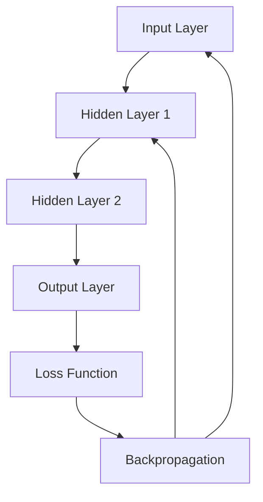
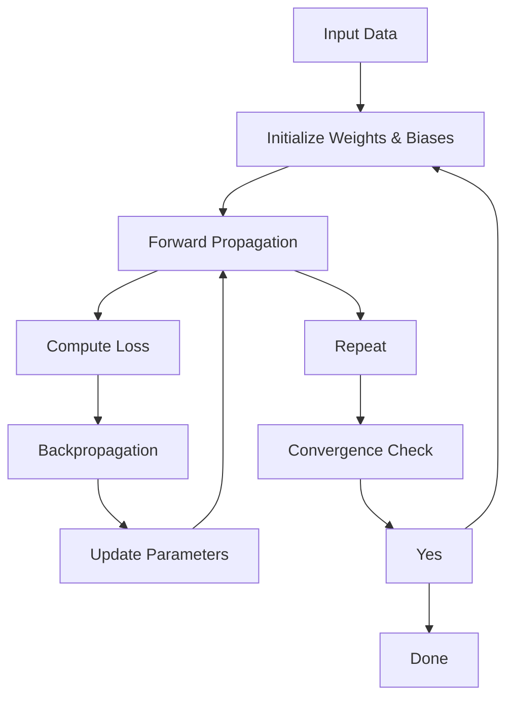

                 

### 背景介绍

神经网络作为人工智能领域的一个重要分支，是模仿人脑结构和功能的一种计算模型。这一概念最早可以追溯到1940年代，由心理学家McCulloch和数学家Pitts提出了神经网络的基本模型。然而，由于计算能力的限制和算法上的不足，神经网络的研究在20世纪60年代遭遇了所谓的“人工智能冬天”。随着计算技术的进步，尤其是深度学习的兴起，神经网络在21世纪初迎来了新的发展机遇。

深度学习是神经网络的一种重要形式，它通过构建多层神经网络结构来提取数据的复杂特征。深度学习的成功应用，如图像识别、语音识别、自然语言处理等，使得神经网络成为了人工智能领域不可或缺的核心技术。

人类智慧的解放，是神经网络技术发展的终极目标之一。通过神经网络，我们可以让计算机模仿人类的思维方式，从而实现一些过去只有人类才能完成的任务。例如，通过深度学习算法，计算机可以学会识别复杂的图像、理解自然语言、进行决策和推理。这不仅提高了计算机的智能化水平，也让人们可以更加高效地利用计算机处理复杂的任务。

本文将围绕神经网络这一主题，详细探讨其核心概念、算法原理、数学模型、实际应用和未来发展趋势。我们将通过一步步的逻辑推理，深入理解神经网络的运作机制，并探讨其在人工智能领域的重要作用。

### 核心概念与联系

为了更好地理解神经网络的工作原理和结构，我们需要先明确几个核心概念，并探讨它们之间的联系。以下是神经网络中一些关键的概念及其相互关系：

#### 1. 神经元（Neuron）

神经元是神经网络的基本计算单元。它类似于生物神经元，通过接收输入信号，进行加权求和，然后通过激活函数输出结果。一个简单的神经元模型可以表示为：

\[ z = \sum_{i=1}^{n} w_i x_i + b \]
\[ a = \sigma(z) \]

其中，\( x_i \) 是输入，\( w_i \) 是权重，\( b \) 是偏置，\( z \) 是加权和，\( \sigma \) 是激活函数（如ReLU、Sigmoid、Tanh等）。

#### 2. 层（Layer）

神经网络由多个层次组成，包括输入层、隐藏层和输出层。每个层次由多个神经元组成。输入层接收外部输入，隐藏层负责特征提取和转换，输出层生成最终的结果。

#### 3. 权重（Weights）与偏置（Bias）

权重和偏置是神经网络中的关键参数。权重决定了不同输入信号对输出结果的影响程度，而偏置为神经元提供了额外的自由度。通过不断调整权重和偏置，神经网络可以学习到输入数据的特征和规律。

#### 4. 激活函数（Activation Function）

激活函数用于对神经元的输出进行非线性变换，从而引入网络的非线性特性。常见的激活函数包括ReLU（Rectified Linear Unit）、Sigmoid、Tanh等。这些函数不仅有助于提高神经网络的计算效率，还可以避免梯度消失和梯度爆炸问题。

#### 5. 前向传播（Forward Propagation）

前向传播是神经网络处理输入数据的过程。输入数据通过输入层传递到隐藏层，再传递到输出层。在每个层次，神经元都会计算加权和通过激活函数得到输出。

#### 6. 反向传播（Backpropagation）

反向传播是神经网络训练的核心算法。通过计算输出层的误差，将误差反向传播到隐藏层和输入层，进而调整权重和偏置。反向传播算法利用梯度下降方法，不断优化网络参数，使得网络能够更好地拟合训练数据。

#### 7. 损失函数（Loss Function）

损失函数用于衡量网络输出与实际输出之间的差距。常见的损失函数包括均方误差（MSE）、交叉熵损失等。损失函数的值越小，表示网络的预测结果越接近真实值。

下面是神经网络的基本架构和流程的Mermaid流程图：



在这个流程图中，输入数据首先通过输入层传递到隐藏层，然后传递到输出层。通过损失函数计算输出误差，并使用反向传播算法更新权重和偏置。这一过程不断重复，直到网络的预测误差达到预设阈值或达到最大迭代次数。

通过上述核心概念和流程的介绍，我们可以更好地理解神经网络的工作原理和结构。在接下来的部分，我们将深入探讨神经网络的算法原理和具体操作步骤。

### 核心算法原理 & 具体操作步骤

为了深入了解神经网络的工作原理，我们需要详细探讨其核心算法原理，包括前向传播（Forward Propagation）和反向传播（Backpropagation）的具体操作步骤。

#### 前向传播（Forward Propagation）

前向传播是神经网络处理输入数据的过程。输入数据首先通过输入层传递到隐藏层，再传递到输出层。在这个过程中，每个神经元都会计算加权和并通过激活函数得到输出。

1. **初始化参数**：首先，我们需要初始化网络的权重和偏置。通常，权重和偏置初始化为较小的随机值。
2. **输入数据**：将输入数据输入到输入层。例如，对于一个图像识别任务，输入数据可能是一个28x28像素的矩阵。
3. **计算加权和**：在每个隐藏层，每个神经元都会计算其输入信号的加权和。例如，对于第一个隐藏层的神经元：
   \[ z_1 = \sum_{i=1}^{n} w_{i1} x_i + b_1 \]
   其中，\( x_i \) 是输入，\( w_{i1} \) 是权重，\( b_1 \) 是偏置。
4. **应用激活函数**：对加权和应用激活函数，例如ReLU函数：
   \[ a_1 = \max(0, z_1) \]
   激活函数引入了非线性特性，使得神经网络可以学习到输入数据的复杂特征。
5. **传递输出**：将第一个隐藏层的输出传递到下一个隐藏层。这个过程重复进行，直到输出层得到最终结果。
6. **计算输出**：在输出层，每个神经元都会计算其加权和并应用激活函数，得到最终的输出结果。例如，对于输出层的神经元：
   \[ z_L = \sum_{i=1}^{n} w_{iL} a_{L-1} + b_L \]
   \[ a_L = \sigma(z_L) \]
   其中，\( a_{L-1} \) 是前一个隐藏层的输出，\( \sigma \) 是激活函数。

#### 反向传播（Backpropagation）

反向传播是神经网络训练的核心算法。通过计算输出层的误差，将误差反向传播到隐藏层和输入层，进而调整权重和偏置。反向传播算法利用梯度下降方法，不断优化网络参数，使得网络能够更好地拟合训练数据。

1. **计算误差**：首先，我们需要计算输出层的误差。误差可以通过损失函数（如均方误差MSE、交叉熵损失等）计算得到。例如，对于均方误差MSE：
   \[ L = \frac{1}{2} \sum_{i=1}^{n} (y_i - \hat{y}_i)^2 \]
   其中，\( y_i \) 是真实标签，\( \hat{y}_i \) 是网络预测的输出。
2. **计算梯度**：然后，我们需要计算每个神经元输入权重和偏置的梯度。梯度可以通过误差对权重和偏置的偏导数计算得到。例如，对于输出层神经元的权重：
   \[ \frac{\partial L}{\partial w_{ij}} = (a_j - y_i) a_{j-1} x_i \]
   对于偏置：
   \[ \frac{\partial L}{\partial b_j} = (a_j - y_i) a_{j-1} \]
3. **更新参数**：使用梯度下降方法更新权重和偏置。例如，假设学习率为\( \alpha \)，则更新公式为：
   \[ w_{ij} \leftarrow w_{ij} - \alpha \frac{\partial L}{\partial w_{ij}} \]
   \[ b_j \leftarrow b_j - \alpha \frac{\partial L}{\partial b_j} \]
4. **反向传播**：将误差反向传播到隐藏层和输入层，重复上述步骤，直到所有层的权重和偏置都得到更新。

通过反复进行前向传播和反向传播，神经网络的参数（权重和偏置）会不断优化，从而提高网络对训练数据的拟合能力。这个过程可以通过多个训练轮次（epochs）进行，直到网络收敛或者达到预设的训练目标。

下面是前向传播和反向传播的具体操作步骤的Mermaid流程图：



在这个流程图中，输入数据通过前向传播得到输出，并计算损失。然后，通过反向传播计算梯度，并更新参数。这个过程不断重复，直到网络收敛或达到预设的训练目标。

通过上述对前向传播和反向传播的详细解释，我们可以更好地理解神经网络的工作原理和训练过程。在接下来的部分，我们将探讨神经网络的数学模型和公式，进一步深入理解其计算过程。

### 数学模型和公式 & 详细讲解 & 举例说明

神经网络的数学模型是理解其工作原理的核心，主要包括前向传播和反向传播过程中的关键数学公式。这些公式通过严谨的推导和应用，帮助我们更好地理解神经网络的行为和性能。

#### 前向传播

在前向传播过程中，每个神经元都会进行加权和通过激活函数的计算。下面我们详细讲解这个过程涉及的数学模型和公式。

1. **加权和计算**

每个神经元 \( i \) 在某个隐藏层 \( l \) 的加权和可以表示为：
\[ z^{[l]}_i = \sum_{j} w^{[l]}_{ij} a^{[l-1]}_j + b_i^{[l]} \]

其中，\( w^{[l]}_{ij} \) 是从神经元 \( j \) 到神经元 \( i \) 的权重，\( b_i^{[l]} \) 是神经元 \( i \) 的偏置，\( a^{[l-1]}_j \) 是前一层神经元 \( j \) 的输出。

2. **激活函数**

激活函数 \( \sigma \) 对加权和进行非线性变换，常见的激活函数包括ReLU（Rectified Linear Unit）、Sigmoid和Tanh等。例如，ReLU函数可以表示为：
\[ \sigma(z) = \max(0, z) \]

Sigmoid函数可以表示为：
\[ \sigma(z) = \frac{1}{1 + e^{-z}} \]

Tanh函数可以表示为：
\[ \sigma(z) = \frac{e^z - e^{-z}}{e^z + e^{-z}} \]

3. **输出计算**

激活函数应用于加权和后，每个神经元 \( i \) 的输出可以表示为：
\[ a^{[l]}_i = \sigma(z^{[l]}_i) \]

#### 反向传播

反向传播是神经网络训练的核心算法，通过计算误差和梯度，更新网络的权重和偏置。下面我们详细讲解反向传播过程中的数学模型和公式。

1. **损失函数**

损失函数用于衡量网络输出与真实输出之间的差距，常见的损失函数包括均方误差（MSE）、交叉熵损失等。均方误差（MSE）可以表示为：
\[ L = \frac{1}{m} \sum_{i=1}^{m} (y_i - \hat{y}_i)^2 \]

其中，\( y_i \) 是真实输出，\( \hat{y}_i \) 是网络预测的输出，\( m \) 是样本数量。

2. **梯度计算**

为了更新网络的权重和偏置，我们需要计算每个参数的梯度。对于输出层的权重和偏置，我们可以通过以下公式计算：

\[ \frac{\partial L}{\partial w^{[L]}_{ij}} = (a^{[L]}_j - y_i) a^{[L-1]}_i \]
\[ \frac{\partial L}{\partial b^{[L]}_j} = (a^{[L]}_j - y_i) a^{[L-1]}_i \]

对于隐藏层的权重和偏置，我们需要使用链式法则进行计算。例如，对于第 \( l \) 层的神经元 \( i \)：

\[ \frac{\partial L}{\partial w^{[l]}_{ij}} = \frac{\partial L}{\partial z^{[l+1]}_i} \frac{\partial z^{[l+1]}_i}{\partial w^{[l]}_{ij}} \frac{\partial z^{[l]}_i}{\partial w^{[l-1]}_{ik}} \frac{\partial w^{[l-1]}_{ik}}{\partial z^{[l-1]}_k} \frac{\partial z^{[l-1]}_k}{\partial a^{[l-1]}_k} \frac{\partial a^{[l-1]}_k}{\partial z^{[l-1]}_k} \]

3. **参数更新**

使用梯度下降方法更新权重和偏置，更新公式为：

\[ w^{[l]}_{ij} \leftarrow w^{[l]}_{ij} - \alpha \frac{\partial L}{\partial w^{[l]}_{ij}} \]
\[ b^{[l]}_j \leftarrow b^{[l]}_j - \alpha \frac{\partial L}{\partial b^{[l]}_j} \]

其中，\( \alpha \) 是学习率。

#### 举例说明

为了更好地理解上述公式，我们通过一个简单的例子进行说明。

假设我们有一个简单的神经网络，包含一个输入层、一个隐藏层和一个输出层。输入层有2个神经元，隐藏层有3个神经元，输出层有1个神经元。激活函数使用ReLU。

1. **初始化参数**

我们首先初始化权重和偏置。假设输入层的输入 \( x_1 = 1 \)，\( x_2 = 2 \)。

权重和偏置初始化为较小的随机值，例如：

\[ w^{[1]}_{11} = 0.1, w^{[1]}_{12} = 0.2, b^{[1]}_1 = 0.3 \]
\[ w^{[1]}_{21} = 0.4, w^{[1]}_{22} = 0.5, b^{[1]}_2 = 0.6 \]
\[ w^{[1]}_{31} = 0.7, w^{[1]}_{32} = 0.8, b^{[1]}_3 = 0.9 \]

2. **前向传播**

我们首先计算隐藏层的加权和，并应用ReLU激活函数：

\[ z^{[1]}_1 = (0.1 \cdot 1 + 0.2 \cdot 2) + 0.3 = 0.5 + 0.3 = 0.8 \]
\[ a^{[1]}_1 = \max(0, z^{[1]}_1) = \max(0, 0.8) = 0.8 \]

\[ z^{[1]}_2 = (0.4 \cdot 1 + 0.5 \cdot 2) + 0.6 = 1.0 + 0.6 = 1.6 \]
\[ a^{[1]}_2 = \max(0, z^{[1]}_2) = \max(0, 1.6) = 1.6 \]

\[ z^{[1]}_3 = (0.7 \cdot 1 + 0.8 \cdot 2) + 0.9 = 1.4 + 0.9 = 2.3 \]
\[ a^{[1]}_3 = \max(0, z^{[1]}_3) = \max(0, 2.3) = 2.3 \]

然后，我们计算输出层的加权和，并应用ReLU激活函数：

\[ z^{[2]}_1 = (0.1 \cdot 0.8 + 0.2 \cdot 1.6 + 0.3) + (0.4 \cdot 0.8 + 0.5 \cdot 1.6 + 0.6) + (0.7 \cdot 0.8 + 0.8 \cdot 1.6 + 0.9) \]
\[ z^{[2]}_1 = 0.08 + 0.32 + 0.3 + 0.32 + 0.8 + 0.36 + 0.56 + 1.28 + 0.9 = 3.94 \]
\[ a^{[2]}_1 = \max(0, z^{[2]}_1) = \max(0, 3.94) = 3.94 \]

3. **反向传播**

假设我们真实的输出 \( y = 0 \)，我们首先计算输出层的误差：

\[ \delta^{[2]}_1 = (a^{[2]}_1 - y) \sigma'(z^{[2]}_1) \]
\[ \delta^{[2]}_1 = (3.94 - 0) \cdot \sigma'(3.94) \]
\[ \delta^{[2]}_1 = 3.94 \cdot 0.1 = 0.394 \]

然后，我们计算隐藏层的误差：

\[ \delta^{[1]}_1 = \sum_{j} w^{[2]}_{1j} \delta^{[2]}_j a^{[1]}_{j-1} \]
\[ \delta^{[1]}_1 = 0.1 \cdot 0.394 + 0.2 \cdot 0.394 = 0.079 + 0.0788 = 0.1578 \]

\[ \delta^{[1]}_2 = \sum_{j} w^{[2]}_{2j} \delta^{[2]}_j a^{[1]}_{j-1} \]
\[ \delta^{[1]}_2 = 0.4 \cdot 0.394 + 0.5 \cdot 0.394 = 0.158 + 0.197 = 0.355 \]

\[ \delta^{[1]}_3 = \sum_{j} w^{[2]}_{3j} \delta^{[2]}_j a^{[1]}_{j-1} \]
\[ \delta^{[1]}_3 = 0.7 \cdot 0.394 + 0.8 \cdot 0.394 = 0.2758 + 0.31632 = 0.59112 \]

4. **参数更新**

使用学习率 \( \alpha = 0.1 \) 更新权重和偏置：

\[ w^{[2]}_{11} \leftarrow w^{[2]}_{11} - 0.1 \cdot 0.394 \cdot 1 = 0.1 - 0.0394 = 0.0606 \]
\[ w^{[2]}_{21} \leftarrow w^{[2]}_{21} - 0.1 \cdot 0.394 \cdot 1 = 0.2 - 0.0394 = 0.1606 \]
\[ w^{[2]}_{31} \leftarrow w^{[2]}_{31} - 0.1 \cdot 0.394 \cdot 1 = 0.3 - 0.0394 = 0.2606 \]

\[ b^{[2]}_1 \leftarrow b^{[2]}_1 - 0.1 \cdot 0.394 = 0.3 - 0.0394 = 0.2606 \]

\[ w^{[1]}_{11} \leftarrow w^{[1]}_{11} - 0.1 \cdot 0.1578 \cdot 1 = 0.1 - 0.01578 = 0.08422 \]
\[ w^{[1]}_{12} \leftarrow w^{[1]}_{12} - 0.1 \cdot 0.1578 \cdot 2 = 0.2 - 0.03156 = 0.16844 \]
\[ w^{[1]}_{13} \leftarrow w^{[1]}_{13} - 0.1 \cdot 0.1578 \cdot 2 = 0.3 - 0.03156 = 0.26844 \]

\[ b^{[1]}_1 \leftarrow b^{[1]}_1 - 0.1 \cdot 0.1578 = 0.3 - 0.01578 = 0.28422 \]

通过这个例子，我们详细展示了神经网络前向传播和反向传播的过程，以及涉及的关键数学公式。这些公式和步骤是实现神经网络训练的基础，通过不断迭代和优化，神经网络可以逐步提高其预测能力。

### 项目实战：代码实际案例和详细解释说明

为了更好地理解神经网络的实现过程，我们将通过一个简单的例子——手写数字识别（MNIST数据集），展示如何使用Python和常见的深度学习库（如TensorFlow和Keras）来构建和训练一个神经网络模型。这个案例将涵盖开发环境搭建、源代码详细实现和代码解读与分析。

#### 1. 开发环境搭建

在开始编写代码之前，我们需要搭建合适的开发环境。以下是搭建开发环境的基本步骤：

1. **安装Python**：确保Python 3.6或更高版本已安装。
2. **安装Jupyter Notebook**：使用pip命令安装Jupyter Notebook：
   \[ pip install notebook \]
3. **安装TensorFlow**：使用pip命令安装TensorFlow：
   \[ pip install tensorflow \]
4. **安装Keras**：Keras是TensorFlow的高级API，可以使用pip命令安装：
   \[ pip install keras \]

#### 2. 源代码详细实现

以下是用于手写数字识别的MNIST数据集的神经网络模型源代码：

```python
import numpy as np
import tensorflow as tf
from tensorflow.keras import layers, models
from tensorflow.keras.datasets import mnist
from tensorflow.keras.utils import to_categorical

# 加载数据集
(train_images, train_labels), (test_images, test_labels) = mnist.load_data()

# 数据预处理
train_images = train_images.reshape((60000, 28, 28, 1)).astype('float32') / 255
test_images = test_images.reshape((10000, 28, 28, 1)).astype('float32') / 255

train_labels = to_categorical(train_labels)
test_labels = to_categorical(test_labels)

# 构建模型
model = models.Sequential()
model.add(layers.Conv2D(32, (3, 3), activation='relu', input_shape=(28, 28, 1)))
model.add(layers.MaxPooling2D((2, 2)))
model.add(layers.Conv2D(64, (3, 3), activation='relu'))
model.add(layers.MaxPooling2D((2, 2)))
model.add(layers.Conv2D(64, (3, 3), activation='relu'))

# 添加全连接层
model.add(layers.Flatten())
model.add(layers.Dense(64, activation='relu'))
model.add(layers.Dense(10, activation='softmax'))

# 编译模型
model.compile(optimizer='adam',
              loss='categorical_crossentropy',
              metrics=['accuracy'])

# 训练模型
model.fit(train_images, train_labels, epochs=5, batch_size=64)

# 评估模型
test_loss, test_acc = model.evaluate(test_images, test_labels)
print(f"Test accuracy: {test_acc:.4f}")

# 预测
predictions = model.predict(test_images)
```

#### 3. 代码解读与分析

下面是对上述代码的详细解读与分析：

1. **导入库**：首先，我们导入所需的库，包括NumPy、TensorFlow和Keras。
2. **加载数据集**：使用Keras的`mnist.load_data()`函数加载数据集。MNIST数据集包含60,000个训练图像和10,000个测试图像，每个图像都是28x28的灰度图像。
3. **数据预处理**：将图像数据调整为适合模型输入的格式。我们首先对图像进行reshape，然后将其缩放到[0, 1]区间。
4. **构建模型**：使用Keras的`Sequential`模型构建一个简单的卷积神经网络（CNN）。这个模型包括两个卷积层（每个卷积层后跟一个最大池化层）和一个全连接层。最后一个全连接层的激活函数是softmax，用于输出每个数字的概率分布。
5. **编译模型**：使用`compile`方法编译模型，指定优化器、损失函数和评估指标。
6. **训练模型**：使用`fit`方法训练模型，指定训练数据、训练轮次和批量大小。
7. **评估模型**：使用`evaluate`方法评估模型在测试数据上的性能。
8. **预测**：使用`predict`方法对测试数据进行预测，得到预测结果。

通过这个案例，我们展示了如何使用Python和深度学习库构建和训练一个简单的神经网络模型。这个案例不仅帮助我们理解了神经网络的基本结构和工作原理，也为实际应用提供了实践经验。

### 实际应用场景

神经网络在人工智能领域的应用已经深入到多个行业和场景，极大地改变了我们的生活方式和工作方式。以下是一些典型的实际应用场景：

#### 1. 图像识别

图像识别是神经网络最成功的应用之一。通过卷积神经网络（CNN），计算机可以识别出图片中的物体、人脸、场景等。例如，自动驾驶汽车使用CNN识别道路标志、行人、车辆等，从而确保行车安全。此外，图像识别技术还广泛应用于医疗影像分析，如癌症检测、病变识别等。

#### 2. 自然语言处理

自然语言处理（NLP）是另一个神经网络的重要应用领域。通过递归神经网络（RNN）和 Transformer 模型，计算机可以理解和生成自然语言。例如，智能助手如Siri、Alexa和Google Assistant利用神经网络实现语音识别和语义理解，从而为用户提供便捷的服务。此外，神经网络还被用于机器翻译、情感分析、文本生成等任务。

#### 3. 语音识别

语音识别技术通过神经网络，将语音信号转换为文本。这为听力障碍者和听障人士提供了有效的沟通手段。同时，语音识别技术也被广泛应用于智能客服、语音搜索和交互式游戏等领域。例如，亚马逊的Echo和谷歌的Google Home都集成了先进的语音识别技术，为用户提供了智能化的家居控制体验。

#### 4. 推荐系统

推荐系统通过神经网络，根据用户的历史行为和偏好，预测用户可能感兴趣的内容。例如，电商平台的推荐系统可以根据用户的浏览和购买记录，推荐相关的商品。这种个性化推荐不仅提高了用户的购物体验，也为商家带来了更多的销售机会。

#### 5. 游戏开发

神经网络在游戏开发中的应用也越来越广泛。通过强化学习，计算机可以学会玩各种电子游戏，如《星际争霸》、《英雄联盟》等。这种自主学习的游戏模式不仅增加了游戏的趣味性，也为游戏开发者提供了新的挑战和创新思路。

#### 6. 医疗诊断

神经网络在医疗领域的应用也越来越受到关注。通过分析医学影像和病历数据，神经网络可以帮助医生进行疾病诊断和治疗方案推荐。例如，深度学习模型可以在几分钟内对CT扫描图像进行肺癌筛查，大大提高了诊断效率和准确性。

综上所述，神经网络在多个实际应用场景中展现了其强大的能力和广泛的前景。随着技术的不断进步，神经网络将继续推动人工智能的发展，为人类社会带来更多的创新和变革。

### 工具和资源推荐

在学习神经网络和深度学习的过程中，选择合适的工具和资源是非常重要的。以下是一些推荐的书籍、论文、博客和网站，这些资源涵盖了从基础知识到高级应用的各个方面。

#### 1. 学习资源推荐

**书籍**：

- **《深度学习》（Deep Learning）**：由Ian Goodfellow、Yoshua Bengio和Aaron Courville合著，这是深度学习领域的经典教材，详细介绍了神经网络的理论和实践。

- **《神经网络与深度学习》（Neural Networks and Deep Learning）**：由Ian Goodfellow撰写，这本书适合初学者，通过大量的实例和代码示例，深入浅出地介绍了神经网络的基础知识和深度学习技术。

- **《Python深度学习》（Deep Learning with Python）**：由François Chollet撰写，这是Keras的作者，书中通过Python和Keras库，详细介绍了深度学习的基本概念和应用。

**论文**：

- **“A Learning Algorithm for Continually Running Fully Recurrent Neural Networks”**：这篇论文由Sepp Hochreiter和Jürgen Schmidhuber在1997年发表，首次提出了长短期记忆网络（LSTM）。

- **“Deep Learning”**：这是一篇由Yoshua Bengio、Ian Goodfellow和Aaron Courville在2013年撰写的论文，全面介绍了深度学习的基本理论和应用。

**博客和网站**：

- **[TensorFlow官方网站](https://www.tensorflow.org/)**
- **[Keras官方网站](https://keras.io/)**
- **[深度学习博客](https://www.deeplearning.net/)**
- **[机器学习博客](https://machinelearningmastery.com/)**
- **[ArXiv论文库](https://arxiv.org/)**
- **[Google Research](https://research.google.com/)**
- **[Facebook AI](https://research.fb.com/)**

#### 2. 开发工具框架推荐

- **TensorFlow**：作为Google开发的开源深度学习框架，TensorFlow提供了丰富的API和工具，适合从简单的模型到复杂的深度学习应用。

- **Keras**：Keras是一个高级神经网络API，可以运行在TensorFlow之上，它提供了简洁、易用的接口，适合快速原型设计和模型开发。

- **PyTorch**：由Facebook开发的开源深度学习框架，PyTorch以其动态图（Dynamic Graph）和简洁的API受到广泛欢迎，特别适合科研和探索性工作。

- **MXNet**：由Apache软件基金会维护的深度学习框架，MXNet支持多种编程语言，包括Python、R、Scala等，适合大规模分布式计算。

#### 3. 相关论文著作推荐

- **“AlexNet: An Image Classification Model”**：这篇论文提出了AlexNet模型，是卷积神经网络在图像分类中应用的里程碑。

- **“Recurrent Neural Networks: A Technical Introduction”**：这篇论文介绍了循环神经网络（RNN）的基本原理和应用，是理解RNN的重要资料。

- **“Generative Adversarial Nets”**：这篇论文提出了生成对抗网络（GAN），是深度学习在生成任务中的一个重要突破。

通过以上推荐的学习资源、开发工具和论文著作，我们可以系统地学习和掌握神经网络和深度学习的基本概念、算法和技术，为实际应用打下坚实的基础。

### 总结：未来发展趋势与挑战

神经网络作为人工智能领域的重要技术，其发展历程充满了创新与突破。从最初的简单感知机模型到现代复杂的深度学习算法，神经网络已经取得了显著的成就。然而，随着技术的不断进步和应用场景的拓展，神经网络也面临着一系列新的发展趋势与挑战。

#### 1. 发展趋势

（1）**更强的计算能力**：随着硬件技术的发展，如GPU、TPU等专用计算设备的普及，神经网络将能够处理更大量的数据，进行更复杂的训练任务。

（2）**更高效的算法**：研究人员不断优化神经网络的结构和算法，以提高训练和预测的效率。例如，自适应学习率算法、注意力机制等技术的应用，使得神经网络在实际应用中更加高效。

（3）**多模态数据处理**：随着数据来源的多样化，神经网络将能够处理多种类型的数据，如文本、图像、音频等。多模态数据的融合将带来更丰富的应用场景。

（4）**边缘计算**：为了降低延迟和带宽消耗，神经网络将越来越多地应用于边缘设备，实现实时数据处理和智能决策。

（5）**更强的泛化能力**：通过增强网络的可解释性和鲁棒性，神经网络将能够更好地应对复杂和不确定的环境，提高其泛化能力。

#### 2. 挑战

（1）**可解释性和透明性**：神经网络的黑箱特性使得其决策过程难以解释。如何提高神经网络的可解释性，使其更加透明和可信，是一个重要的挑战。

（2）**数据隐私和安全**：随着神经网络在数据处理中的应用，数据隐私和安全问题日益突出。如何保护用户数据隐私，防止数据泄露和滥用，是亟需解决的问题。

（3）**计算资源和能耗**：深度学习模型通常需要大量的计算资源和能源消耗。如何优化算法，减少计算资源和能耗，是一个亟待解决的挑战。

（4）**数据质量和标注**：神经网络训练依赖于大量的高质量数据。然而，数据质量和标注的准确性直接影响模型的性能。如何获取和标注高质量数据，是一个重要的挑战。

（5）**法律和伦理**：随着神经网络在关键领域（如医疗、金融等）的应用，如何确保其合规性和伦理性，防止滥用和歧视，是法律和伦理领域的重要议题。

总之，神经网络的发展前景广阔，但也面临诸多挑战。通过不断创新和优化，神经网络将在人工智能领域发挥更大的作用，为人类社会带来更多的变革和创新。

### 附录：常见问题与解答

1. **什么是神经网络？**
   神经网络是一种通过模拟人脑神经元结构和工作原理构建的计算模型。它由多个层级的神经元组成，每个神经元接收输入信号，通过加权求和和激活函数处理后输出结果，从而实现数据的处理和分类。

2. **神经网络有哪些类型？**
   神经网络主要分为以下几类：
   - **前馈神经网络（FNN）**：输入信号直接传递到输出，没有循环。
   - **循环神经网络（RNN）**：包含循环结构，适用于处理序列数据。
   - **卷积神经网络（CNN）**：特别适用于图像处理。
   - **生成对抗网络（GAN）**：通过生成器和判别器之间的对抗训练生成数据。
   - **长短时记忆网络（LSTM）**：一种特殊的RNN，能够更好地处理长序列数据。

3. **什么是前向传播和反向传播？**
   - **前向传播**：神经网络从输入层开始，将输入信号通过层与层之间的加权连接传递到输出层，并应用激活函数，得到最终输出。
   - **反向传播**：在训练过程中，通过计算输出层的误差，将误差反向传播到隐藏层和输入层，并利用梯度下降方法更新权重和偏置，以优化网络性能。

4. **什么是激活函数？**
   激活函数是对神经元输出进行非线性变换的函数，它引入了网络的非线性特性，使得神经网络能够学习到输入数据的复杂特征。常见的激活函数包括ReLU、Sigmoid、Tanh等。

5. **神经网络训练的目标是什么？**
   神经网络训练的目标是通过调整网络的权重和偏置，使得网络能够对新的输入数据进行准确的分类或预测。具体来说，训练目标是使网络的输出与真实值之间的误差最小。

6. **什么是损失函数？**
   损失函数用于衡量网络输出与真实输出之间的差距，它是训练过程中评估网络性能的重要指标。常见的损失函数包括均方误差（MSE）、交叉熵损失等。

7. **什么是过拟合？**
   过拟合是指神经网络在训练数据上表现良好，但在新的测试数据上表现不佳，即模型对训练数据的特征过于敏感，失去了泛化能力。为了防止过拟合，可以采用正则化、数据增强、dropout等方法。

8. **神经网络在实际应用中如何选择合适的架构？**
   选择合适的神经网络架构需要考虑任务类型、数据特性、计算资源等因素。例如，对于图像识别任务，可以选择卷积神经网络；对于自然语言处理任务，可以选择循环神经网络或Transformer模型。

通过解答这些常见问题，我们可以更好地理解神经网络的基础概念和训练过程，为实际应用提供指导。

### 扩展阅读 & 参考资料

为了进一步深入了解神经网络和深度学习的相关内容，以下是推荐的一些建议阅读材料：

1. **书籍**：

- **《深度学习》（Deep Learning）**：由Ian Goodfellow、Yoshua Bengio和Aaron Courville合著，详细介绍了深度学习的理论基础和实践应用。

- **《神经网络与深度学习》（Neural Networks and Deep Learning）**：由Ian Goodfellow撰写，适合初学者，介绍了神经网络和深度学习的基础知识。

- **《Python深度学习》（Deep Learning with Python）**：由François Chollet撰写，通过Python和Keras库，讲解了深度学习的实际应用。

2. **论文**：

- **“A Learning Algorithm for Continually Running Fully Recurrent Neural Networks”**：Sepp Hochreiter和Jürgen Schmidhuber在1997年发表的论文，首次提出了长短期记忆网络（LSTM）。

- **“Deep Learning”**：Yoshua Bengio、Ian Goodfellow和Aaron Courville在2013年撰写的论文，全面介绍了深度学习的基本概念和应用。

- **“Generative Adversarial Nets”**：Ian Goodfellow在2014年发表的论文，提出了生成对抗网络（GAN），是深度学习在生成任务中的一个重要突破。

3. **博客和网站**：

- **[TensorFlow官方网站](https://www.tensorflow.org/)**
- **[Keras官方网站](https://keras.io/)**
- **[深度学习博客](https://www.deeplearning.net/)**
- **[机器学习博客](https://machinelearningmastery.com/)**
- **[ArXiv论文库](https://arxiv.org/)**
- **[Google Research](https://research.google.com/)**

通过阅读这些书籍、论文和访问相关网站，您可以获得更深入的理论知识和实践技巧，有助于您在神经网络和深度学习领域取得更大的成就。

