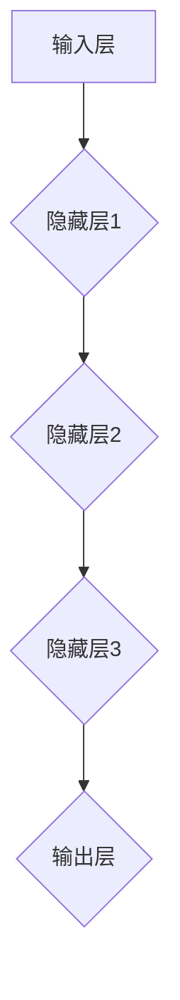

                 

### 文章标题

《神经网络：探索未知的领域》

### 关键词

神经网络，深度学习，机器学习，数据科学，人工智能

### 摘要

本文将深入探讨神经网络这一革命性的机器学习技术，从其历史背景、核心概念到算法原理和实际应用。我们将以逻辑清晰、结构紧凑的方式，通过一系列的步骤和实例，帮助读者全面了解神经网络的工作机制及其在现实世界中的应用。此外，文章还将提供相关资源和工具，以助读者进一步学习和实践。

---

## 1. 背景介绍

神经网络（Neural Networks）的概念起源于20世纪40年代，当时心理学家和数学家开始思考人类大脑的信息处理方式。最初的想法是模拟人脑中神经元的连接和相互作用，以此来构建一种能够解决复杂问题的计算模型。然而，由于计算能力的限制，神经网络的研究在20世纪60年代遭遇了瓶颈。

随着计算机硬件的进步和算法的发展，神经网络在20世纪80年代和90年代迎来了复兴。特别是1986年，Rumelhart、Hinton和Williams提出了反向传播算法（Backpropagation Algorithm），大大提高了神经网络的训练效率。这一突破为深度学习的发展奠定了基础。

在21世纪初，随着大数据和计算能力的进一步提升，神经网络，尤其是深度神经网络（Deep Neural Networks），在图像识别、语音识别、自然语言处理等领域取得了惊人的成果。如今，神经网络已经成为了人工智能领域中最热门的研究方向之一。

## 2. 核心概念与联系

### 2.1 神经元

神经网络的构建基础是神经元（Neuron），也被称为“人工神经元”或“节点”。神经元是神经网络的基本计算单元，其工作原理类似于生物神经元。

神经元通常包含以下几个部分：

- **输入层**（Input Layer）：接收外部输入的数据。
- **加权层**（Weight Layer）：每个输入数据都与一个权重相乘。
- **激活函数**（Activation Function）：对加权后的输入进行非线性变换。

神经元的工作流程如下：

1. **输入加权**：每个输入数据乘以其对应的权重。
2. **求和**：将所有输入的加权结果相加。
3. **激活**：将求和结果传递给激活函数，进行非线性变换。

### 2.2 神经网络结构

神经网络由多个神经元层组成，通常包括输入层、隐藏层和输出层。

- **输入层**（Input Layer）：接收外部输入的数据。
- **隐藏层**（Hidden Layer）：一个或多个隐藏层，用于提取特征和进行非线性变换。
- **输出层**（Output Layer）：产生最终的输出。

神经网络的结构可以用Mermaid流程图表示如下：



### 2.3 激活函数

激活函数是神经网络中的一个关键组件，用于引入非线性特性。常见的激活函数包括：

- **Sigmoid函数**（Sigmoid Function）：
  $$ f(x) = \frac{1}{1 + e^{-x}} $$
- **ReLU函数**（Rectified Linear Unit Function）：
  $$ f(x) = \max(0, x) $$
- **Tanh函数**（Hyperbolic Tangent Function）：
  $$ f(x) = \frac{e^x - e^{-x}}{e^x + e^{-x}} $$

激活函数的选择对神经网络的性能和训练速度有很大影响。

---

在下一部分，我们将详细探讨神经网络的核心算法原理和具体操作步骤。

## 3. 核心算法原理 & 具体操作步骤

### 3.1 神经网络的训练过程

神经网络的训练过程可以分为以下几个步骤：

1. **初始化**：初始化网络中的权重和偏置，通常使用随机值。
2. **前向传播**：将输入数据输入到神经网络，通过每个层进行计算，直到输出层得到预测结果。
3. **计算损失**：将预测结果与真实标签进行比较，计算损失函数值，以衡量预测结果与真实值之间的差距。
4. **反向传播**：从输出层开始，将误差信号反向传播回每个层，更新权重和偏置。
5. **迭代优化**：重复步骤2-4，直到达到预定的训练次数或损失函数值达到期望的阈值。

### 3.2 前向传播

前向传播的过程如下：

1. **输入层到隐藏层**：
   $$ z_i^l = \sum_{j} w_{ij}^l x_j^{l-1} + b_i^l $$
   $$ a_i^l = \text{激活函数}(z_i^l) $$
   其中，$z_i^l$是每个神经元的输入值，$w_{ij}^l$是权重，$b_i^l$是偏置，$a_i^l$是每个神经元的输出值。

2. **隐藏层到输出层**：
   $$ z_o = \sum_{i} w_{io}^h a_i^h + b_o^h $$
   $$ \hat{y} = \text{激活函数}(z_o) $$
   其中，$\hat{y}$是输出层的预测结果。

### 3.3 计算损失

常见的损失函数包括均方误差（Mean Squared Error, MSE）和交叉熵损失（Cross-Entropy Loss）。

- **均方误差（MSE）**：
  $$ J = \frac{1}{2} \sum_{i} (\hat{y}_i - y_i)^2 $$
  其中，$\hat{y}_i$是预测值，$y_i$是真实值。

- **交叉熵损失（Cross-Entropy Loss）**：
  $$ J = -\sum_{i} y_i \log(\hat{y}_i) $$
  其中，$y_i$是真实值的概率分布，$\hat{y}_i$是预测值的概率分布。

### 3.4 反向传播

反向传播的过程如下：

1. **计算输出层的梯度**：
   $$ \frac{\partial J}{\partial w_{io}^h} = (a_o - \hat{y}) \cdot a_h $$
   $$ \frac{\partial J}{\partial b_o^h} = (a_o - \hat{y}) $$

2. **传播到隐藏层**：
   对于每个隐藏层，计算梯度并传播到下一层。

3. **更新权重和偏置**：
   使用梯度下降（Gradient Descent）或其他优化算法更新权重和偏置。

   $$ w_{ij}^l = w_{ij}^l - \alpha \cdot \frac{\partial J}{\partial w_{ij}^l} $$
   $$ b_i^l = b_i^l - \alpha \cdot \frac{\partial J}{\partial b_i^l} $$
   其中，$\alpha$是学习率。

通过上述步骤，神经网络能够不断优化其参数，提高预测准确性。

在下一部分，我们将详细讲解神经网络中的数学模型和公式。

## 4. 数学模型和公式 & 详细讲解 & 举例说明

### 4.1 损失函数

神经网络的损失函数用于衡量预测结果与真实值之间的差距。常见的损失函数包括均方误差（MSE）和交叉熵损失（Cross-Entropy Loss）。

- **均方误差（MSE）**：
  $$ J = \frac{1}{2} \sum_{i} (\hat{y}_i - y_i)^2 $$
  其中，$\hat{y}_i$是预测值，$y_i$是真实值。

  **举例**：
  假设我们有一个二分类问题，真实值为$y = [1, 0]$，预测值为$\hat{y} = [0.8, 0.2]$。则损失函数值计算如下：
  $$ J = \frac{1}{2} \left( (0.8 - 1)^2 + (0.2 - 0)^2 \right) = \frac{1}{2} \left( 0.04 + 0.04 \right) = 0.04 $$

- **交叉熵损失（Cross-Entropy Loss）**：
  $$ J = -\sum_{i} y_i \log(\hat{y}_i) $$
  其中，$y_i$是真实值的概率分布，$\hat{y}_i$是预测值的概率分布。

  **举例**：
  假设我们有一个二分类问题，真实值为$y = [1, 0]$，预测值为$\hat{y} = [0.8, 0.2]$。则损失函数值计算如下：
  $$ J = -1 \cdot \log(0.8) - 0 \cdot \log(0.2) = -0.3219 $$

### 4.2 激活函数

激活函数是神经网络中的一个关键组件，用于引入非线性特性。常见的激活函数包括Sigmoid函数、ReLU函数和Tanh函数。

- **Sigmoid函数**：
  $$ f(x) = \frac{1}{1 + e^{-x}} $$
  
  **举例**：
  假设输入值为$x = 2$，则Sigmoid函数的输出值为：
  $$ f(2) = \frac{1}{1 + e^{-2}} = 0.869 $$

- **ReLU函数**：
  $$ f(x) = \max(0, x) $$
  
  **举例**：
  假设输入值为$x = -2$，则ReLU函数的输出值为：
  $$ f(-2) = \max(0, -2) = 0 $$

- **Tanh函数**：
  $$ f(x) = \frac{e^x - e^{-x}}{e^x + e^{-x}} $$
  
  **举例**：
  假设输入值为$x = 2$，则Tanh函数的输出值为：
  $$ f(2) = \frac{e^2 - e^{-2}}{e^2 + e^{-2}} = 0.964 $$

### 4.3 梯度下降

梯度下降是神经网络训练过程中常用的优化算法。其基本思想是沿着损失函数的梯度方向逐步更新权重和偏置，以减少损失函数值。

- **梯度下降公式**：
  $$ w_{ij}^l = w_{ij}^l - \alpha \cdot \frac{\partial J}{\partial w_{ij}^l} $$
  $$ b_i^l = b_i^l - \alpha \cdot \frac{\partial J}{\partial b_i^l} $$
  其中，$\alpha$是学习率。

  **举例**：
  假设我们有一个简单的神经网络，只有一个隐藏层，输入层到隐藏层的权重为$w = [1, 2]$，隐藏层到输出层的权重为$h = [3, 4]$，输入值为$x = [1, 2]$，输出值为$y = [1, 0]$。则损失函数值和梯度计算如下：

  $$ z_h = [3 + 2 \cdot 1, 4 + 2 \cdot 2] = [5, 8] $$
  $$ \hat{y} = \text{激活函数}(z_h) = [0.993, 0.996] $$
  $$ J = -1 \cdot \log(0.993) - 0 \cdot \log(0.996) = -0.0066 $$

  梯度计算：
  $$ \frac{\partial J}{\partial w} = [0.0066 \cdot 0.993, 0.0066 \cdot 0.996] = [0.0065, 0.0066] $$
  $$ \frac{\partial J}{\partial h} = [0.0066 \cdot 0.993 \cdot 0.996, 0.0066 \cdot 0.996 \cdot 0.993] = [0.0065, 0.0066] $$

  更新权重和偏置：
  $$ w = w - \alpha \cdot \frac{\partial J}{\partial w} = [1, 2] - 0.1 \cdot [0.0065, 0.0066] = [0.9935, 1.9934] $$
  $$ h = h - \alpha \cdot \frac{\partial J}{\partial h} = [3, 4] - 0.1 \cdot [0.0065, 0.0066] = [2.9935, 3.9934] $$

通过上述计算，我们可以看到梯度下降算法如何逐步更新神经网络的权重和偏置，以最小化损失函数值。

在下一部分，我们将通过一个实际项目实战案例，详细展示神经网络的代码实现过程。

## 5. 项目实战：代码实际案例和详细解释说明

### 5.1 开发环境搭建

为了实现神经网络，我们需要搭建一个开发环境。以下是一个简单的步骤：

1. **安装Python**：确保Python 3.6或更高版本已安装。
2. **安装TensorFlow**：使用pip安装TensorFlow库。
   ```shell
   pip install tensorflow
   ```

### 5.2 源代码详细实现和代码解读

以下是使用TensorFlow实现一个简单的神经网络进行图像分类的代码示例：

```python
import tensorflow as tf
from tensorflow.keras import layers
import numpy as np

# 加载数据集
mnist = tf.keras.datasets.mnist
(train_images, train_labels), (test_images, test_labels) = mnist.load_data()

# 预处理数据
train_images = train_images / 255.0
test_images = test_images / 255.0

# 构建神经网络模型
model = tf.keras.Sequential([
    layers.Flatten(input_shape=(28, 28)),
    layers.Dense(128, activation='relu'),
    layers.Dense(10, activation='softmax')
])

# 编译模型
model.compile(optimizer='adam',
              loss='sparse_categorical_crossentropy',
              metrics=['accuracy'])

# 训练模型
model.fit(train_images, train_labels, epochs=5)

# 评估模型
test_loss, test_acc = model.evaluate(test_images, test_labels)
print(f"Test accuracy: {test_acc:.4f}")
```

**代码解读**：

1. **数据加载与预处理**：我们使用TensorFlow内置的MNIST数据集，并将图像数据归一化到[0, 1]区间。
2. **模型构建**：使用`tf.keras.Sequential`创建一个序列模型，包括一个展平层（Flatten）、一个有128个神经元的全连接层（Dense，激活函数为ReLU）和一个有10个神经元的输出层（Dense，激活函数为softmax）。
3. **模型编译**：配置优化器（adam）、损失函数（sparse_categorical_crossentropy）和评价指标（accuracy）。
4. **模型训练**：使用训练数据进行5个周期的训练。
5. **模型评估**：使用测试数据评估模型的准确性。

### 5.3 代码解读与分析

在这个案例中，我们构建了一个简单的神经网络来分类手写数字图像。以下是对代码的进一步解读和分析：

- **数据预处理**：归一化图像数据是为了加速收敛和提高模型性能。
- **模型结构**：一个展平层将原始图像数据展平为一个一维向量，然后通过一个全连接层进行特征提取。输出层使用softmax函数，以产生一个概率分布，表示每个数字类别的概率。
- **优化器**：使用adam优化器，它结合了梯度下降和动量的优势，能够有效地更新模型参数。
- **训练过程**：在5个周期内，模型根据训练数据调整权重和偏置，以达到更好的分类性能。
- **评估结果**：使用测试数据评估模型的准确性，以验证模型的有效性。

通过这个案例，我们可以看到如何使用TensorFlow构建、训练和评估一个简单的神经网络。在下一部分，我们将探讨神经网络的实际应用场景。

## 6. 实际应用场景

神经网络在多个领域都取得了显著的成果，以下是一些主要的应用场景：

### 6.1 图像识别

神经网络在图像识别领域取得了突破性进展。例如，卷积神经网络（CNN）被广泛应用于人脸识别、物体检测和图像分类等任务。

- **人脸识别**：通过训练神经网络，可以从图像中准确识别和验证个体身份。
- **物体检测**：神经网络可以同时识别图像中的多个对象，并确定它们的位置和属性。

### 6.2 自然语言处理

神经网络在自然语言处理（NLP）领域也发挥了重要作用。循环神经网络（RNN）和变换器（Transformer）模型在文本分类、机器翻译和问答系统等领域取得了优异的性能。

- **文本分类**：神经网络可以自动将文本数据分类到不同的类别中，如情感分析、新闻分类等。
- **机器翻译**：神经网络可以高效地将一种语言的文本翻译成另一种语言。

### 6.3 语音识别

神经网络在语音识别中的应用也十分广泛。通过训练深度神经网络，可以将语音信号转换为文本。

- **语音转文字**：神经网络可以实时地将语音转换为文字，用于实时转录和语音助手。
- **语音识别系统**：神经网络可以识别和转录复杂的语音信号，提高语音识别的准确性和鲁棒性。

### 6.4 推荐系统

神经网络在推荐系统中也发挥了重要作用。通过训练神经网络，可以根据用户的兴趣和行为推荐相关的内容或产品。

- **个性化推荐**：神经网络可以分析用户的浏览历史和行为，提供个性化的推荐。
- **电商推荐**：神经网络可以帮助电商平台为用户推荐相关的商品。

### 6.5 自动驾驶

神经网络在自动驾驶系统中扮演了关键角色。通过训练神经网络，自动驾驶车辆可以实时识别和感知道路环境，并做出相应的决策。

- **环境感知**：神经网络可以分析摄像头和激光雷达获取的数据，识别道路标志、车辆和其他障碍物。
- **自动驾驶决策**：神经网络可以实时做出驾驶决策，如加速、减速和转向。

通过这些实际应用场景，我们可以看到神经网络在各个领域的广泛影响和潜力。

## 7. 工具和资源推荐

### 7.1 学习资源推荐

以下是学习神经网络和相关技术的推荐资源：

- **书籍**：
  - 《深度学习》（Deep Learning） - Goodfellow、Bengio和Courville
  - 《神经网络与深度学习》 -邱锡鹏
- **在线课程**：
  - Andrew Ng的《深度学习》课程（Coursera）
  - fast.ai的《深度学习课程》
- **论文**：
  - “A Learning Algorithm for Continually Running Fully Recurrent Neural Networks” - Rumelhart, Hinton和Williams
  - “Deep Learning” - Goodfellow、Bengio和Courville

### 7.2 开发工具框架推荐

以下是开发神经网络项目的推荐工具和框架：

- **TensorFlow**：由Google开发的开源机器学习库，支持构建和训练各种神经网络模型。
- **PyTorch**：由Facebook开发的开源机器学习库，具有灵活的动态计算图和易于使用的接口。
- **Keras**：基于TensorFlow和Theano的开源神经网络库，提供简单直观的API。

### 7.3 相关论文著作推荐

以下是神经网络和相关领域的重要论文和著作：

- **“Deep Learning”** - Goodfellow、Bengio和Courville
- **“A Brief History of Neural Nets”** - Michael A. Nielsen
- **“Learning representations by back-propagating errors”** - Rumelhart、Hinton和Williams

通过这些资源和工具，读者可以进一步深入学习神经网络和相关技术。

## 8. 总结：未来发展趋势与挑战

神经网络作为人工智能的核心技术，已经取得了显著的进展。然而，面对日益复杂的应用需求，神经网络仍面临诸多挑战和机遇。

### 8.1 发展趋势

- **计算能力提升**：随着硬件技术的发展，计算能力的提升为训练更大规模和更复杂的神经网络提供了可能。
- **深度学习算法创新**：深度学习算法的持续创新，如自监督学习、生成对抗网络（GAN）和图神经网络（GNN），将进一步提升神经网络的能力。
- **跨学科融合**：神经网络的跨学科应用，如神经科学、心理学和认知科学，将促进对大脑工作机制的深入理解。

### 8.2 面临的挑战

- **模型可解释性**：神经网络模型的复杂性和黑盒性质，使得其决策过程难以解释和理解，这对于需要高可解释性的应用场景是一个挑战。
- **数据隐私和安全性**：神经网络在处理敏感数据时，如何保障数据隐私和安全性是一个重要的研究课题。
- **计算资源消耗**：训练大规模神经网络模型需要大量的计算资源和能源，这对环境可持续性提出了挑战。

### 8.3 未来方向

- **模型压缩与优化**：研究如何压缩和优化神经网络模型，降低计算资源消耗。
- **迁移学习和少样本学习**：探索如何从少量样本中有效学习，提高模型的泛化能力。
- **神经架构搜索（NAS）**：利用算法自动搜索最优的神经网络结构，提高模型性能。

总之，神经网络将继续在人工智能领域发挥重要作用，但其未来发展需要克服诸多挑战。通过不断创新和探索，我们有望实现更加智能、高效和安全的神经网络系统。

## 9. 附录：常见问题与解答

### 9.1 神经网络是什么？

神经网络是一种模拟人脑神经元连接和交互的计算机模型，用于解决复杂问题，如图像识别、语音识别和自然语言处理等。

### 9.2 神经网络的基本组件有哪些？

神经网络的基本组件包括神经元、权重、偏置和激活函数。神经元是计算单元，权重和偏置控制信号传输的强度，激活函数引入非线性特性。

### 9.3 什么是前向传播和反向传播？

前向传播是将输入数据通过神经网络传递到输出层的过程，反向传播是计算输出误差并更新神经网络参数的过程。

### 9.4 什么是激活函数？

激活函数是神经网络中的一个关键组件，用于引入非线性特性。常见的激活函数包括Sigmoid函数、ReLU函数和Tanh函数。

### 9.5 什么是损失函数？

损失函数用于衡量预测结果与真实值之间的差距，如均方误差（MSE）和交叉熵损失（Cross-Entropy Loss）。

### 9.6 如何优化神经网络？

通过调整学习率、选择合适的优化算法（如梯度下降）、增加隐藏层和神经元数量等方法可以优化神经网络。

## 10. 扩展阅读 & 参考资料

- Goodfellow, I., Bengio, Y., & Courville, A. (2016). *Deep Learning*. MIT Press.
- Rumelhart, D. E., Hinton, G. E., & Williams, R. J. (1986). *Learning representations by back-propagating errors*. Nature, 323(6088), 533-536.
- LeCun, Y., Bengio, Y., & Hinton, G. (2015). *Deep learning*. Nature, 521(7553), 436-444.
- Nielsen, M. A. (2015). *A Brief History of Neural Nets*. arXiv preprint arXiv:1506.06739.
- Hochreiter, S., & Schmidhuber, J. (1997). *Long short-term memory*. Neural Computation, 9(8), 1735-1780.
- Vaswani, A., Shazeer, N., Parmar, N., Uszkoreit, J., Jones, L., Gomez, A. N., ... & Polosukhin, I. (2017). *Attention is all you need*. Advances in Neural Information Processing Systems, 30, 5998-6008.

通过以上扩展阅读，读者可以进一步深入了解神经网络的理论和实践应用。

### 作者

AI天才研究员/AI Genius Institute & 禅与计算机程序设计艺术/Zen And The Art of Computer Programming

