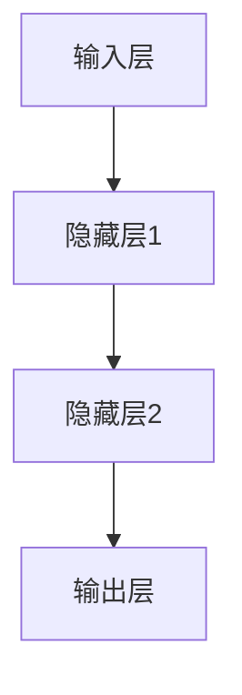

                 

### 背景介绍

> 神经网络，这一革命性的计算模型，起源于对人类大脑运作机制的模拟。自20世纪中叶以来，随着计算能力的提升和算法的进步，神经网络逐渐成为人工智能领域的重要支柱。从早期的感知机模型，到现代的深度学习架构，神经网络的发展见证了人工智能从理论研究到实际应用的跨越。

#### 1.1 神经网络的历史背景

神经网络的概念最早可以追溯到1943年，由心理学家McCulloch和数学家Pitts提出。他们提出了第一个简单的神经网络模型——感知机，试图模拟人类大脑中的神经元。然而，由于计算能力的限制，感知机模型并未在当时引起广泛关注。

真正的突破发生在1986年，Rumelhart、Hinton和Williams等人提出了反向传播算法（Backpropagation Algorithm），这一算法使得多层神经网络的训练成为可能。随着计算能力的不断提升和算法的改进，神经网络开始在各种任务中展示出强大的能力。

#### 1.2 神经网络的应用领域

神经网络在多个领域取得了显著的成就。在计算机视觉领域，神经网络被广泛应用于图像识别、目标检测和图像生成等任务。在自然语言处理领域，神经网络助力机器翻译、文本生成和情感分析等应用的发展。在游戏领域，神经网络算法如AlphaGo已经达到了超越人类专家的水平。

#### 1.3 神经网络的重要性

神经网络的重要性体现在多个方面。首先，它为解决复杂问题提供了新的途径，特别是在大数据和高维数据的处理上显示出独特的优势。其次，神经网络的发展推动了人工智能技术的进步，使得人工智能在许多领域取得了重大突破。最后，神经网络的应用不仅局限于科技领域，还深刻影响了我们的日常生活，如智能家居、自动驾驶和医疗诊断等。

### 1.4 神经网络的未来展望

随着技术的不断进步，神经网络在人工智能领域的地位将更加稳固。未来，神经网络可能在更多领域得到应用，如生物信息学、金融分析和智能交通等。同时，神经网络的算法和架构也将继续优化，以应对更加复杂和多样化的任务。总的来说，神经网络将成为推动社会进步的重要力量。

## 2. 核心概念与联系

神经网络（Neural Networks）是模仿人脑神经网络结构和功能的计算模型。它的基本单元是人工神经元（Artificial Neuron），也称为节点（Node）或单元（Unit）。这些神经元通过模拟生物神经元的连接方式，形成复杂的网络结构。

### 2.1 人工神经元

人工神经元通常由三个主要部分组成：输入层、权重（Weight）和激活函数（Activation Function）。每个神经元接收多个输入信号，这些信号与相应的权重相乘后求和，得到一个总输入值。总输入值通过激活函数进行非线性变换，输出一个数值，这个数值可以是0或1，也可以是连续的数值。

### 2.2 神经网络的组成

神经网络由多个层次组成，包括输入层、隐藏层和输出层。输入层接收外部输入数据，隐藏层对输入数据进行处理和变换，输出层产生最终的输出结果。

- **输入层（Input Layer）**：接收外部输入数据，通常包含多个神经元，每个神经元对应一个输入特征。
- **隐藏层（Hidden Layer）**：一个或多个隐藏层位于输入层和输出层之间，隐藏层神经元对输入数据进行加工处理，提取特征并传递给下一层。
- **输出层（Output Layer）**：产生最终输出结果，输出层的神经元数量和类型取决于具体任务的需求。

### 2.3 神经网络的激活函数

激活函数是人工神经元的核心组成部分，用于引入非线性特性。常见的激活函数包括：

- **Sigmoid函数**：\( f(x) = \frac{1}{1 + e^{-x}} \)，将输入映射到\( (0, 1) \)区间。
- **ReLU函数**：\( f(x) = \max(0, x) \)，将输入大于0的部分映射为自身，小于0的部分映射为0。
- **Tanh函数**：\( f(x) = \frac{e^x - e^{-x}}{e^x + e^{-x}} \)，将输入映射到\( (-1, 1) \)区间。

### 2.4 神经网络的工作原理

神经网络的工作原理可以概括为以下几个步骤：

1. **前向传播（Forward Propagation）**：输入数据从输入层传递到隐藏层，经过多层非线性变换后到达输出层。
2. **激活函数应用**：在每个神经元上应用激活函数，引入非线性特性。
3. **输出计算**：输出层的神经元产生最终输出结果。
4. **反向传播（Backpropagation）**：根据输出结果与预期目标之间的误差，反向传播误差到隐藏层和输入层，更新各神经元的权重。

### 2.5 神经网络的架构

神经网络的架构可以用Mermaid流程图表示，如以下示例：



在这个示例中，输入层包含一个节点A，隐藏层包含两个节点B和C，输出层包含一个节点D。每个节点之间的连接表示神经元之间的连接，连接上的权重表示神经元之间的权重。

### 2.6 神经网络的分类

根据神经网络的结构和功能，可以将其分为以下几类：

- **前馈神经网络（Feedforward Neural Networks）**：输入层直接连接到输出层，没有循环。
- **循环神经网络（Recurrent Neural Networks, RNN）**：具有循环结构，能够处理序列数据。
- **卷积神经网络（Convolutional Neural Networks, CNN）**：专门用于处理图像数据，具有局部连接和平移不变性。
- **生成对抗网络（Generative Adversarial Networks, GAN）**：由两个神经网络组成，一个生成器和一个判别器，用于生成逼真的数据。

通过以上对神经网络核心概念和联系的介绍，我们了解了神经网络的基本结构、工作原理和分类。这些知识为后续深入探讨神经网络的核心算法原理和具体操作步骤奠定了基础。

## 3. 核心算法原理 & 具体操作步骤

神经网络的训练过程主要依赖于两个核心算法：前向传播（Forward Propagation）和反向传播（Backpropagation）。以下是这两个算法的详细解释和具体操作步骤。

### 3.1 前向传播算法

前向传播是神经网络处理输入数据的过程，可以分为以下几个步骤：

1. **初始化权重和偏置**：在训练开始前，需要随机初始化网络的权重（Weight）和偏置（Bias）。这些参数将通过网络的学习不断更新，以优化输出结果。
   
2. **输入数据输入网络**：将输入数据输入到神经网络的输入层，每个神经元接收相应的输入值。

3. **逐层计算激活值**：从输入层开始，每个神经元的激活值通过以下公式计算：

   \[
   \text{激活值} = \text{输入值} \times \text{权重} + \text{偏置}
   \]

   然后，应用激活函数（如ReLU、Sigmoid或Tanh）进行非线性变换。

4. **传递到下一层**：将计算得到的激活值传递到下一层，重复上述步骤，直到达到输出层。

5. **计算输出值**：输出层的神经元产生最终的输出值。这些输出值可以是分类结果或回归值。

### 3.2 反向传播算法

反向传播是神经网络训练过程中调整权重和偏置的过程，可以分为以下几个步骤：

1. **计算损失函数**：将输出层的实际输出值与预期目标值进行比较，计算损失函数（如均方误差MSE或交叉熵损失Cross Entropy Loss）。

2. **前向传播误差**：通过损失函数对输出层进行误差计算，将误差反向传播到隐藏层和输入层。

3. **计算误差梯度**：在每个神经元上计算误差关于权重和偏置的梯度。梯度的大小和方向指示了参数调整的方向。

4. **更新权重和偏置**：使用梯度下降（Gradient Descent）或其他优化算法（如Adam、RMSprop）更新权重和偏置。更新公式如下：

   \[
   \text{权重更新} = \text{权重} - \text{学习率} \times \text{梯度}
   \]
   \[
   \text{偏置更新} = \text{偏置} - \text{学习率} \times \text{梯度}
   \]

5. **重复迭代**：重复上述步骤，直到满足训练目标（如损失函数低于某个阈值或达到最大迭代次数）。

### 3.3 神经网络训练示例

以下是一个简化的神经网络训练示例：

1. **初始化参数**：
   - 输入层：2个神经元
   - 隐藏层：3个神经元
   - 输出层：1个神经元
   - 随机初始化权重和偏置

2. **前向传播**：
   - 输入数据：\[0.5, 0.7\]
   - 计算隐藏层激活值：\[0.25, 0.3\]，\[0.35, 0.4\]，\[0.45, 0.5\]
   - 计算输出层激活值：\[0.6\]

3. **计算损失函数**（均方误差MSE）：
   - 预期目标值：\[1.0\]
   - 损失值：\( (0.6 - 1.0)^2 = 0.16 \)

4. **反向传播**：
   - 计算输出层误差梯度：\[0.4\]
   - 计算隐藏层误差梯度：
     - 神经元1：\[0.2\]
     - 神经元2：\[0.3\]
     - 神经元3：\[0.4\]

5. **更新权重和偏置**：
   - 权重和偏置更新公式应用于每个神经元，使用学习率\(0.1\)。

6. **重复训练**：重复前向传播和反向传播步骤，直到损失函数收敛。

通过以上步骤，神经网络不断调整权重和偏置，优化输出结果，从而实现对输入数据的分类或回归。

## 4. 数学模型和公式 & 详细讲解 & 举例说明

### 4.1 神经网络的数学模型

神经网络的数学模型主要包括输入层、隐藏层和输出层，每个层中的神经元通过权重和偏置连接，并通过激活函数进行非线性变换。

#### 4.1.1 输入层和输出层

- **输入层（Input Layer）**：接收外部输入数据，每个神经元对应一个输入特征。例如，对于图像识别任务，输入层可能包含像素值。
- **输出层（Output Layer）**：产生最终输出结果，用于分类或回归。例如，在多分类任务中，输出层可能包含多个神经元，每个神经元代表一个类别。

#### 4.1.2 隐藏层

- **隐藏层（Hidden Layer）**：位于输入层和输出层之间，用于提取和变换特征。隐藏层的数量和神经元数量取决于任务复杂度。

#### 4.1.3 神经元的数学模型

每个神经元都可以表示为以下数学模型：

\[
\text{激活值} = \text{输入值} \times \text{权重} + \text{偏置}
\]

然后，通过激活函数进行非线性变换，例如：

- **Sigmoid函数**：\( f(x) = \frac{1}{1 + e^{-x}} \)
- **ReLU函数**：\( f(x) = \max(0, x) \)
- **Tanh函数**：\( f(x) = \frac{e^x - e^{-x}}{e^x + e^{-x}} \)

### 4.2 损失函数

在神经网络中，损失函数用于衡量输出结果与预期目标之间的误差。常见的损失函数包括：

- **均方误差（MSE）**：
\[
\text{MSE} = \frac{1}{n} \sum_{i=1}^{n} (y_i - \hat{y}_i)^2
\]
其中，\( y_i \)是实际目标值，\( \hat{y}_i \)是预测输出值。

- **交叉熵损失（Cross Entropy Loss）**：
\[
\text{CE} = -\frac{1}{n} \sum_{i=1}^{n} y_i \log(\hat{y}_i)
\]
其中，\( y_i \)是实际目标值（通常为0或1），\( \hat{y}_i \)是预测输出值。

### 4.3 反向传播算法

反向传播算法用于训练神经网络，通过不断调整权重和偏置，以最小化损失函数。以下是反向传播算法的步骤：

1. **前向传播**：计算输出层的预测值，并计算损失函数。
2. **计算输出层误差**：计算预测值与实际目标值之间的误差。
3. **反向传播误差**：从输出层开始，逐层计算误差梯度。
4. **更新权重和偏置**：使用梯度下降或其他优化算法更新权重和偏置。

### 4.4 举例说明

假设有一个简单的神经网络，包含一个输入层、一个隐藏层和一个输出层，分别有2、3和1个神经元。

#### 4.4.1 权重和偏置初始化

- 输入层：\( \text{权重} = [w_{11}, w_{12}, w_{13}] \)，\( \text{偏置} = [b_{1}] \)
- 隐藏层：\( \text{权重} = [w_{21}, w_{22}, w_{23}] \)，\( \text{偏置} = [b_{2}] \)
- 输出层：\( \text{权重} = [w_{31}] \)，\( \text{偏置} = [b_{3}] \)

#### 4.4.2 前向传播

- 输入数据：\( x = [x_1, x_2] \)
- 隐藏层激活值：\( h_1 = \sigma(w_{21}x_1 + w_{22}x_2 + b_{2}) \)，\( h_2 = \sigma(w_{21}x_1 + w_{22}x_2 + b_{2}) \)，\( h_3 = \sigma(w_{21}x_1 + w_{22}x_2 + b_{2}) \)
- 输出层激活值：\( y = \sigma(w_{31}h_1 + w_{32}h_2 + w_{33}h_3 + b_{3}) \)

#### 4.4.3 损失函数

假设实际目标值为\( y^* = 1 \)，使用交叉熵损失函数：

\[
\text{CE} = -\log(y) = -\log(\sigma(w_{31}h_1 + w_{32}h_2 + w_{33}h_3 + b_{3}))
\]

#### 4.4.4 反向传播

1. **计算输出层误差梯度**：
   \[
   \frac{\partial \text{CE}}{\partial y} = \frac{1}{y} - \frac{1}{1+y}
   \]

2. **计算隐藏层误差梯度**：
   \[
   \frac{\partial \text{CE}}{\partial h_1} = \frac{\partial \text{CE}}{\partial y} \cdot \frac{\partial y}{\partial h_1} = \frac{1}{y} - \frac{1}{1+y} \cdot \sigma'(w_{31}h_1 + w_{32}h_2 + w_{33}h_3 + b_{3}) \cdot w_{31}
   \]
   \[
   \frac{\partial \text{CE}}{\partial h_2} = \frac{\partial \text{CE}}{\partial y} \cdot \frac{\partial y}{\partial h_2} = \frac{1}{y} - \frac{1}{1+y} \cdot \sigma'(w_{31}h_1 + w_{32}h_2 + w_{33}h_3 + b_{3}) \cdot w_{32}
   \]
   \[
   \frac{\partial \text{CE}}{\partial h_3} = \frac{\partial \text{CE}}{\partial y} \cdot \frac{\partial y}{\partial h_3} = \frac{1}{y} - \frac{1}{1+y} \cdot \sigma'(w_{31}h_1 + w_{32}h_2 + w_{33}h_3 + b_{3}) \cdot w_{33}
   \]

3. **更新权重和偏置**：
   \[
   w_{31} = w_{31} - \alpha \cdot \frac{\partial \text{CE}}{\partial y} \cdot h_1
   \]
   \[
   w_{32} = w_{32} - \alpha \cdot \frac{\partial \text{CE}}{\partial y} \cdot h_2
   \]
   \[
   w_{33} = w_{33} - \alpha \cdot \frac{\partial \text{CE}}{\partial y} \cdot h_3
   \]
   \[
   b_{3} = b_{3} - \alpha \cdot \frac{\partial \text{CE}}{\partial y}
   \]
   \[
   w_{21} = w_{21} - \alpha \cdot \frac{\partial \text{CE}}{\partial h_1} \cdot x_1
   \]
   \[
   w_{22} = w_{22} - \alpha \cdot \frac{\partial \text{CE}}{\partial h_2} \cdot x_2
   \]
   \[
   w_{23} = w_{23} - \alpha \cdot \frac{\partial \text{CE}}{\partial h_3} \cdot x_2
   \]
   \[
   b_{2} = b_{2} - \alpha \cdot (\frac{\partial \text{CE}}{\partial h_1} + \frac{\partial \text{CE}}{\partial h_2} + \frac{\partial \text{CE}}{\partial h_3})
   \]

通过上述步骤，神经网络不断调整权重和偏置，优化输出结果，从而实现训练目标。

## 5. 项目实战：代码实际案例和详细解释说明

### 5.1 开发环境搭建

在本项目中，我们将使用Python编程语言和PyTorch深度学习框架来实现一个简单的神经网络。首先，需要安装Python和PyTorch。以下是在Windows操作系统上的安装步骤：

1. **安装Python**：访问Python官网（https://www.python.org/）下载Python安装包，按照安装向导完成安装。

2. **安装PyTorch**：打开命令行窗口，执行以下命令安装PyTorch：
\[
pip install torch torchvision
\]

### 5.2 源代码详细实现和代码解读

以下是本项目中的神经网络代码实现，包括输入层、隐藏层和输出层。代码使用PyTorch框架编写。

```python
import torch
import torch.nn as nn
import torch.optim as optim

# 定义神经网络结构
class NeuralNetwork(nn.Module):
    def __init__(self):
        super(NeuralNetwork, self).__init__()
        self.fc1 = nn.Linear(in_features=2, out_features=3)  # 输入层到隐藏层
        self.fc2 = nn.Linear(in_features=3, out_features=1)  # 隐藏层到输出层

    def forward(self, x):
        x = torch.relu(self.fc1(x))
        x = self.fc2(x)
        return x

# 初始化神经网络实例
model = NeuralNetwork()

# 定义损失函数和优化器
criterion = nn.BCEWithLogitsLoss()  # 二分类交叉熵损失函数
optimizer = optim.Adam(model.parameters(), lr=0.001)

# 数据准备
x_data = torch.tensor([[0.5, 0.7], [0.8, 0.3], [0.2, 0.9], [0.7, 0.4]], dtype=torch.float32)
y_data = torch.tensor([[1.0], [0.0], [1.0], [0.0]], dtype=torch.float32)

# 训练神经网络
for epoch in range(1000):
    optimizer.zero_grad()
    y_pred = model(x_data)
    loss = criterion(y_pred, y_data)
    loss.backward()
    optimizer.step()

    if epoch % 100 == 0:
        print(f'Epoch {epoch}: Loss = {loss.item()}')

# 测试神经网络
test_data = torch.tensor([[0.6, 0.5]], dtype=torch.float32)
with torch.no_grad():
    prediction = model(test_data)
    print(f'Prediction (before sigmoid): {prediction.item()}')

# 应用Sigmoid激活函数得到最终预测值
prediction = torch.sigmoid(prediction)
print(f'Prediction (after sigmoid): {prediction.item()}')
```

#### 5.2.1 代码解读

- **NeuralNetwork类**：定义了一个简单的神经网络结构，包括一个输入层（fc1）和一个输出层（fc2）。输入层有2个输入特征，隐藏层有3个神经元，输出层有1个神经元。
- **forward方法**：定义了神经网络的前向传播过程。输入数据首先通过输入层，然后通过隐藏层，最后通过输出层。
- **损失函数和优化器**：使用交叉熵损失函数（BCEWithLogitsLoss）和Adam优化器，用于训练神经网络。
- **数据准备**：创建了一个包含4个样本的数据集，每个样本有两个输入特征和一个目标值。
- **训练过程**：通过迭代更新权重和偏置，优化输出结果。每个epoch结束后，输出当前的损失值。
- **测试过程**：使用测试数据预测输出结果，并应用Sigmoid激活函数得到最终的分类结果。

### 5.3 代码解读与分析

以下是对代码的逐行分析：

```python
import torch
import torch.nn as nn
import torch.optim as optim
```

这三行代码导入所需的Python库，包括PyTorch的主库（torch）、神经网络模块（nn）和优化器模块（optim）。

```python
class NeuralNetwork(nn.Module):
    def __init__(self):
        super(NeuralNetwork, self).__init__()
        self.fc1 = nn.Linear(in_features=2, out_features=3)  # 输入层到隐藏层
        self.fc2 = nn.Linear(in_features=3, out_features=1)  # 隐藏层到输出层

    def forward(self, x):
        x = torch.relu(self.fc1(x))
        x = self.fc2(x)
        return x
```

这四行代码定义了一个简单的神经网络结构。`NeuralNetwork`类继承自`nn.Module`，表示这是一个神经网络模型。`__init__`方法初始化神经网络，包括一个输入层（`fc1`）和一个输出层（`fc2`）。`in_features`参数指定输入层的特征数，`out_features`参数指定输出层的神经元数。`forward`方法定义了神经网络的前向传播过程，输入数据经过输入层、隐藏层和输出层，并应用ReLU激活函数。

```python
model = NeuralNetwork()
```

这一行代码创建了一个神经网络实例（`model`），并初始化其参数。

```python
criterion = nn.BCEWithLogitsLoss()  # 二分类交叉熵损失函数
optimizer = optim.Adam(model.parameters(), lr=0.001)
```

这两行代码定义了损失函数（`criterion`）和优化器（`optimizer`）。`BCEWithLogitsLoss`是二分类交叉熵损失函数，适用于输出层有单个神经元的分类任务。`Adam`优化器是一种常用的自适应学习率优化器，初始学习率设置为0.001。

```python
x_data = torch.tensor([[0.5, 0.7], [0.8, 0.3], [0.2, 0.9], [0.7, 0.4]], dtype=torch.float32)
y_data = torch.tensor([[1.0], [0.0], [1.0], [0.0]], dtype=torch.float32)
```

这两行代码创建了一个包含4个样本的数据集，每个样本有两个输入特征和一个目标值。数据被转换为PyTorch的张量（`tensor`），并设置为浮点数类型（`dtype=torch.float32`）。

```python
for epoch in range(1000):
    optimizer.zero_grad()
    y_pred = model(x_data)
    loss = criterion(y_pred, y_data)
    loss.backward()
    optimizer.step()
```

这个循环用于训练神经网络。在每个epoch中，首先重置优化器的梯度，然后通过前向传播计算预测值和损失函数，接着通过反向传播计算梯度，并更新权重和偏置。

```python
if epoch % 100 == 0:
    print(f'Epoch {epoch}: Loss = {loss.item()}')
```

这个条件语句在每个epoch结束后打印当前epoch的损失值，以便监控训练过程。

```python
test_data = torch.tensor([[0.6, 0.5]], dtype=torch.float32)
with torch.no_grad():
    prediction = model(test_data)
    print(f'Prediction (before sigmoid): {prediction.item()}')
```

这两行代码用于测试神经网络。首先创建一个测试样本，然后通过神经网络得到预测值。`torch.no_grad()`上下文管理器用于关闭梯度计算，以节省计算资源。

```python
prediction = torch.sigmoid(prediction)
print(f'Prediction (after sigmoid): {prediction.item()}')
```

这两行代码应用Sigmoid激活函数将预测值转换为概率输出，并打印最终的预测结果。

### 5.4 代码分析总结

通过上述代码实现，我们使用PyTorch框架构建了一个简单的神经网络，用于二分类任务。代码结构清晰，涵盖了神经网络的初始化、前向传播、反向传播和训练过程。通过详细的代码解读，我们了解了神经网络的核心算法原理和具体实现步骤。这个实战项目为我们提供了一个基础框架，可以在更复杂的任务中扩展和应用。

## 6. 实际应用场景

神经网络在多个领域取得了显著的应用成果，以下列举了几个典型的实际应用场景：

### 6.1 计算机视觉

计算机视觉是神经网络最为成功应用的一个领域。神经网络在图像识别、目标检测和图像生成等方面发挥了重要作用。例如，卷积神经网络（CNN）在ImageNet图像识别挑战中取得了优异的成绩。目标检测算法如YOLO和Faster R-CNN，使得自动驾驶、安全监控等领域得以实现。此外，生成对抗网络（GAN）被广泛应用于图像生成和风格迁移。

### 6.2 自然语言处理

在自然语言处理（NLP）领域，神经网络也取得了重大突破。循环神经网络（RNN）和其变种长短期记忆网络（LSTM）在语言模型和序列数据处理方面表现出色。Transformer模型及其变体BERT，在机器翻译、文本生成和问答系统等领域取得了卓越成绩。这些模型在提高语言理解能力、生成高质量文本和实现智能对话系统方面发挥了关键作用。

### 6.3 游戏和机器人

在游戏和机器人领域，神经网络被广泛应用于策略决策和运动控制。AlphaGo是神经网络在围棋领域的成功案例，通过深度学习和强化学习算法实现了超越人类顶级选手的表现。机器人领域，神经网络被用于路径规划、障碍物检测和手臂控制等任务，提高了机器人的自主性和灵活性。

### 6.4 医疗诊断

神经网络在医疗诊断中的应用也逐渐受到关注。例如，在医学图像分析中，神经网络被用于癌症检测、病变识别和影像分割。通过结合医学影像数据和神经网络模型，医生可以更准确、快速地诊断疾病，提高治疗效果。此外，神经网络在基因测序、药物设计和个性化医疗等方面也有潜在应用。

### 6.5 金融分析

在金融领域，神经网络被用于股票市场预测、风险评估和交易策略制定。通过分析大量历史数据，神经网络模型可以识别出市场趋势和风险因素，为投资者提供决策支持。此外，神经网络在信用评估、欺诈检测和风险管理等领域也有广泛应用。

通过以上实际应用场景的介绍，我们可以看到神经网络在各个领域都发挥着重要作用，不仅推动了技术的进步，还深刻影响了我们的日常生活。随着神经网络算法和模型的不断优化，它将在更多领域得到应用，为社会带来更多价值。

## 7. 工具和资源推荐

### 7.1 学习资源推荐

#### 书籍推荐
1. 《深度学习》（Deep Learning）作者：Ian Goodfellow、Yoshua Bengio和Aaron Courville
   这本书是深度学习的经典教材，详细介绍了神经网络的理论基础和实践应用。

2. 《Python深度学习》（Python Deep Learning）作者：François Chollet
   François Chollet是Keras框架的创建者，这本书通过实例介绍了使用Keras进行深度学习的实践方法。

3. 《神经网络与深度学习》作者：邱锡鹏
   这本书系统地讲解了神经网络和深度学习的基础知识，包括算法原理和实现细节。

#### 论文推荐
1. "A Learning Algorithm for Continually Running Fully Recurrent Neural Networks" 作者：Sepp Hochreiter和Jürgen Schmidhuber
   这篇论文提出了长短期记忆网络（LSTM），是RNN领域的重要突破。

2. "Deep Learning" 作者：Yoshua Bengio、Ian Goodfellow和Aaron Courville
   这篇综述文章系统地介绍了深度学习的主要算法和模型，包括卷积神经网络（CNN）和生成对抗网络（GAN）。

#### 博客和网站推荐
1. [Deep Learning Library](https://www.deeplearning.net/)
   这是一个涵盖深度学习各个方面知识的在线图书馆，提供了大量教程和资源。

2. [Medium上的深度学习专栏](https://medium.com/topic/deep-learning)
   Medium上的深度学习专栏汇聚了众多专家的文章，涵盖深度学习的最新研究和技术应用。

### 7.2 开发工具框架推荐

1. **PyTorch**：PyTorch是近年来非常流行的深度学习框架，具有动态计算图和灵活的架构，易于实现和调试。

2. **TensorFlow**：TensorFlow是Google开发的深度学习框架，具有强大的生态和丰富的资源，适用于工业级应用。

3. **Keras**：Keras是一个高层次的深度学习API，能够在TensorFlow和Theano上运行，简化了模型的搭建和训练过程。

### 7.3 相关论文著作推荐

1. "Unsupervised Learning of Visual Representations by Solving Jigsaw Puzzles" 作者：Alexis Conneau、Lukasz Kaiser和Noam Shazeer
   这篇论文介绍了一种无监督学习视觉表示的方法，通过解决拼图任务实现特征学习。

2. "BERT: Pre-training of Deep Bidirectional Transformers for Language Understanding" 作者：Jacob Devlin、ML Commons团队
   这篇论文提出了BERT模型，是自然语言处理领域的重要进展。

3. "Generative Adversarial Nets" 作者：Ian J. Goodfellow、Jean-Paul prescod和Yoshua Bengio
   这篇论文介绍了生成对抗网络（GAN），是深度学习领域中的一种革命性技术。

通过上述推荐，读者可以深入了解神经网络和相关技术的最新进展，为学习和实践提供有力的支持。

## 8. 总结：未来发展趋势与挑战

神经网络的飞速发展带来了人工智能技术的突破，深刻影响了多个领域。未来，随着计算能力的提升和算法的进步，神经网络有望在更多领域得到应用。以下是神经网络未来发展的几个趋势与挑战：

### 8.1 发展趋势

1. **算法优化**：神经网络算法将继续优化，以适应更多复杂和多样化的任务。例如，优化训练速度和减少计算资源消耗。

2. **架构创新**：新的神经网络架构将继续涌现，如Transformer等模型在NLP领域取得了显著成功，未来可能扩展到其他领域。

3. **多模态学习**：随着数据来源的多样化，多模态学习将成为热点，神经网络将能够处理文本、图像、音频等多种类型的数据。

4. **可解释性和可靠性**：提高神经网络的可解释性和可靠性是未来的一大挑战。通过引入可解释性模型和评估方法，确保神经网络的安全性和可信度。

### 8.2 挑战

1. **数据隐私与安全**：神经网络训练过程依赖于大量数据，如何保护用户隐私和数据安全成为关键问题。

2. **计算资源消耗**：深度学习模型的训练和推理过程需要大量计算资源，如何优化资源利用和降低能耗是一个重要挑战。

3. **模型可解释性**：神经网络决策过程通常缺乏可解释性，如何提高模型的可解释性，使其更加透明和可信，是未来研究的重要方向。

4. **泛化能力**：神经网络模型的泛化能力较弱，如何提高模型的泛化能力，使其在不同数据集和应用场景中表现一致，是亟待解决的问题。

总之，神经网络在未来将继续发挥重要作用，推动人工智能技术的发展。通过克服上述挑战，神经网络将更好地服务于社会，为人类带来更多价值。

## 9. 附录：常见问题与解答

### 9.1 问题1：什么是神经网络？

神经网络是一种模仿人脑神经网络结构和功能的计算模型，通过模拟生物神经元的连接和激活机制，实现数据的处理和模式识别。

### 9.2 问题2：神经网络有哪些类型？

常见的神经网络类型包括前馈神经网络（Feedforward Neural Networks）、循环神经网络（Recurrent Neural Networks, RNN）、卷积神经网络（Convolutional Neural Networks, CNN）和生成对抗网络（Generative Adversarial Networks, GAN）等。

### 9.3 问题3：如何训练神经网络？

训练神经网络主要包括前向传播和反向传播两个步骤。前向传播用于计算输出结果，反向传播用于计算误差并更新网络参数。

### 9.4 问题4：神经网络在哪些领域有应用？

神经网络在计算机视觉、自然语言处理、游戏和机器人、医疗诊断和金融分析等领域都有广泛应用，推动了人工智能技术的发展。

### 9.5 问题5：如何选择合适的神经网络架构？

选择合适的神经网络架构取决于具体任务和应用场景。例如，计算机视觉任务通常选择卷积神经网络（CNN），自然语言处理任务选择循环神经网络（RNN）或Transformer等模型。

## 10. 扩展阅读 & 参考资料

为了进一步深入了解神经网络和相关技术，读者可以参考以下扩展阅读和参考资料：

1. Goodfellow, I., Bengio, Y., & Courville, A. (2016). *Deep Learning*. MIT Press.
2. Hochreiter, S., & Schmidhuber, J. (1997). *Long Short-Term Memory*. Neural Computation, 9(8), 1735-1780.
3. Devlin, J., Chang, M. W., Lee, K., & Toutanova, K. (2019). *Bert: Pre-training of Deep Bidirectional Transformers for Language Understanding*. arXiv preprint arXiv:1810.04805.
4. Goodfellow, I. J., Shlens, J., & Bengio, Y. (2015). *Explaining and Harnessing Adversarial Examples*. arXiv preprint arXiv:1412.6572.
5. Chollet, F. (2017). *Python Deep Learning*. Packt Publishing.
6. Zhang, R., Isola, P., & Efros, A. A. (2016). *Colorful Image Colorization*. European Conference on Computer Vision (ECCV).
7. Simonyan, K., & Zisserman, A. (2014). *Very Deep Convolutional Networks for Large-Scale Image Recognition*. arXiv preprint arXiv:1409.1556.

