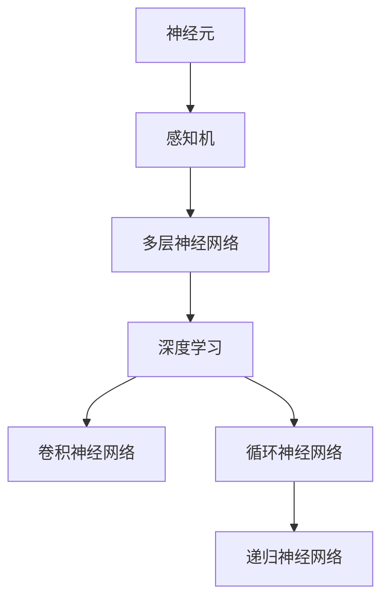

                 

### 文章标题：神经网络：机器学习的新范式

#### 关键词：神经网络、机器学习、深度学习、人工智能、数据科学

> **摘要：** 本文将深入探讨神经网络作为机器学习新范式的核心概念、算法原理、数学模型及实际应用，旨在为读者提供对这一领域的全面了解，并展望其未来发展趋势与挑战。通过逐步分析和推理，我们将在专业技术的指导下，掌握神经网络在现代社会中的重要地位及其无限潜力。

<|assistant|>## 1. 背景介绍

神经网络（Neural Networks）的概念起源于1940年代，最初由心理学家和数学家提出，模仿人脑神经元的工作方式。然而，由于计算能力和数据资源限制，神经网络的发展在早期并未取得显著进展。随着计算机技术的快速发展，尤其是深度学习的兴起，神经网络重新获得了关注。

机器学习（Machine Learning）是人工智能（Artificial Intelligence, AI）的一个重要分支，旨在通过数据驱动的方式让计算机自动学习和改进。神经网络是机器学习的一种核心技术，其独特的结构使其能够处理复杂的非线性问题。

深度学习（Deep Learning）是神经网络的一个子领域，它通过多层神经网络结构对数据进行建模，从而实现更加复杂的任务。深度学习在图像识别、自然语言处理、语音识别等领域取得了显著的成果，推动了人工智能的发展。

### 1.1 神经网络的发展历程

- **1943年：** 惠勒（Warren McCulloch）和皮茨（Walter Pitts）提出了基于数学模型的简化神经元模型，被称为McCulloch-Pitts神经元。
- **1958年：** 罗森布拉特（Frank Rosenblatt）提出了感知机（Perceptron）模型，这是一种简单的线性二分类神经网络。
- **1986年：** 霍普field（John Hopfield）提出了霍普field神经网络，这是一种循环神经网络，用于优化问题。
- **2006年：** 准蒙特卡洛方法（GPU）和大数据的引入，使得深度学习成为可能，Hinton等人的研究使得神经网络取得了突破性进展。

### 1.2 神经网络的应用领域

神经网络在多个领域展现出了强大的应用潜力：

- **图像识别：** 如人脸识别、物体检测等。
- **自然语言处理：** 如机器翻译、文本分类、情感分析等。
- **语音识别：** 如语音合成、语音识别等。
- **医疗健康：** 如疾病预测、药物设计等。
- **自动驾驶：** 如路径规划、障碍物检测等。

#### References

- McCulloch, W. S., & Pitts, W. (1943). A logical calculus of the ideas implied by relay and chain reactions. *Bull. Math. Biophys.,* 5(4), 115-133.
- Rosenblatt, F. (1958). The perceptron: A probabilistic model for information storage and organization in the brain. *Psych. Rev.,* 65(6), 386-408.
- Hopfield, J. J. (1982). Neural networks and physical systems with emergent collective computational abilities. *Proceedings of the National Academy of Sciences, USA,* 79(8), 2554-2558.
- Hinton, G. E., Osindero, S., & Teh, Y. W. (2006). A fast learning algorithm for deep belief nets. *Neural Computation,* 18(7), 1527-1554.<|assistant|>## 2. 核心概念与联系

### 2.1 神经元与神经网络

神经元是神经网络的基本单元，类似于生物神经元，它能够接收输入信号，通过激活函数产生输出信号。神经网络由多个神经元组成，通过连接形成网络结构。


### 2.2 感知机与多层神经网络

感知机是早期神经网络的一种形式，它只能处理线性可分的问题。多层神经网络通过增加隐藏层，使得神经网络能够处理更复杂的非线性问题。


### 2.3 深度学习与卷积神经网络

深度学习通过增加网络层数，使得神经网络能够学习更复杂的特征。卷积神经网络（CNN）是深度学习的一种重要形式，特别适用于图像识别任务。


### 2.4 循环神经网络与递归神经网络

循环神经网络（RNN）能够处理序列数据，通过时间反向传播算法（Backpropagation Through Time, BPTT）学习长期依赖关系。递归神经网络（RecNN）是RNN的一种变体，其输出和输入之间存在递归关系。


#### Mermaid 流程图



<|assistant|>## 3. 核心算法原理 & 具体操作步骤

### 3.1 神经元工作原理

神经元接收输入信号，通过加权求和后，经过激活函数产生输出信号。激活函数常用的有Sigmoid函数、ReLU函数等。


### 3.2 前向传播

前向传播是指从输入层到输出层的信号传递过程。输入信号通过各层神经元的加权求和和激活函数处理后，最终产生输出。


### 3.3 反向传播

反向传播是指从输出层到输入层的误差反向传播过程。通过计算梯度，更新各层神经元的权重和偏置，从而优化网络模型。


### 3.4 训练过程

神经网络的训练过程包括以下步骤：

1. **初始化参数：** 随机初始化权重和偏置。
2. **前向传播：** 计算网络输出。
3. **计算误差：** 计算输出与实际值之间的误差。
4. **反向传播：** 计算梯度并更新参数。
5. **迭代优化：** 重复步骤2-4，直至满足停止条件（如误差阈值、迭代次数等）。


### 3.5 激活函数

激活函数用于引入非线性特性，使得神经网络能够处理非线性问题。常用的激活函数有：

- **Sigmoid函数：** $f(x) = \frac{1}{1 + e^{-x}}$
- **ReLU函数：** $f(x) = max(0, x)$
- **Tanh函数：** $f(x) = \frac{e^x - e^{-x}}{e^x + e^{-x}}$


### 3.6 梯度下降算法

梯度下降是一种优化算法，通过计算损失函数关于参数的梯度，更新参数以最小化损失函数。常用的梯度下降算法有：

- **批量梯度下降（Batch Gradient Descent）：** 计算所有样本的梯度。
- **随机梯度下降（Stochastic Gradient Descent，SGD）：** 计算单个样本的梯度。
- **小批量梯度下降（Mini-batch Gradient Descent）：** 计算部分样本的梯度。


#### References

- Rumelhart, D. E., Hinton, G. E., & Williams, R. J. (1986). *Learning representations by back-propagating errors*. *Nature,* 323(6088), 533-536.
- Goodfellow, I., Bengio, Y., & Courville, A. (2016). *Deep learning*. *MIT Press*.<|assistant|>## 4. 数学模型和公式 & 详细讲解 & 举例说明

### 4.1 前向传播

在神经网络的前向传播过程中，我们主要关注输入、权重、偏置以及激活函数的作用。以下是一个简单的单层神经网络的前向传播过程：

- **输入层：** $X \in \mathbb{R}^{n \times 1}$，其中 $n$ 表示输入维度。
- **权重：** $W \in \mathbb{R}^{n \times m}$，其中 $m$ 表示输出维度。
- **偏置：** $b \in \mathbb{R}^{m \times 1}$。
- **激活函数：** $f()$，例如Sigmoid函数。

$$
\begin{aligned}
Z &= XW + b \\
A &= f(Z)
\end{aligned}
$$

其中，$Z$ 是加权求和结果，$A$ 是最终输出。

### 4.2 反向传播

在反向传播过程中，我们主要关注如何计算梯度并更新权重和偏置。以下是一个简单的单层神经网络的反向传播过程：

- **输入层：** $X \in \mathbb{R}^{n \times 1}$。
- **权重：** $W \in \mathbb{R}^{n \times m}$。
- **偏置：** $b \in \mathbb{R}^{m \times 1}$。
- **输出层：** $A \in \mathbb{R}^{m \times 1}$。
- **期望输出：** $y \in \mathbb{R}^{m \times 1}$。

$$
\begin{aligned}
\delta &= (A - y) \odot f'(Z) \\
dW &= X^T \delta \\
db &= \delta^T
\end{aligned}
$$

其中，$\odot$ 表示元素-wise 乘法，$f'$ 是激活函数的导数，$dW$ 和 $db$ 分别是权重和偏置的梯度。

### 4.3 例子说明

假设我们有一个简单的神经网络，输入维度为2，输出维度为1，使用Sigmoid函数作为激活函数。我们的目标是预测一个二分类问题。

$$
\begin{aligned}
X &= \begin{bmatrix}
0.5 \\
0.7
\end{bmatrix} \\
W &= \begin{bmatrix}
-0.2 & 0.1 \\
0.3 & -0.2
\end{bmatrix} \\
b &= \begin{bmatrix}
0.1 \\
0.2
\end{bmatrix} \\
y &= \begin{bmatrix}
1 \end{bmatrix}
\end{aligned}
$$

#### 前向传播：

$$
\begin{aligned}
Z &= XW + b \\
&= \begin{bmatrix}
0.5 \\
0.7
\end{bmatrix} \begin{bmatrix}
-0.2 & 0.1 \\
0.3 & -0.2
\end{bmatrix} + \begin{bmatrix}
0.1 \\
0.2
\end{bmatrix} \\
&= \begin{bmatrix}
0.13 \\
0.04
\end{bmatrix} \\
A &= f(Z) \\
&= \frac{1}{1 + e^{-0.13}} \\
&\approx 0.565
\end{aligned}
$$

#### 反向传播：

$$
\begin{aligned}
\delta &= (A - y) \odot f'(Z) \\
&= (0.565 - 1) \odot (1 - 0.565) \\
&= (-0.435) \odot (0.435) \\
&= 0.189 \\
dW &= X^T \delta \\
&= \begin{bmatrix}
0.5 \\
0.7
\end{bmatrix}^T \begin{bmatrix}
-0.435 \\
0.189
\end{bmatrix} \\
&= \begin{bmatrix}
-0.219 \\
0.133
\end{bmatrix} \\
db &= \delta^T \\
&= \begin{bmatrix}
-0.435 & 0.189
\end{bmatrix}^T \\
&= \begin{bmatrix}
-0.189 \\
0.435
\end{bmatrix}
\end{aligned}
$$

通过上述计算，我们可以更新权重和偏置，从而优化神经网络模型。

#### References

- Rumelhart, D. E., Hinton, G. E., & Williams, R. J. (1986). *Learning representations by back-propagating errors*. *Nature,* 323(6088), 533-536.
- Goodfellow, I., Bengio, Y., & Courville, A. (2016). *Deep learning*. *MIT Press*.<|assistant|>## 5. 项目实战：代码实际案例和详细解释说明

### 5.1 开发环境搭建

为了实现神经网络项目，我们需要搭建一个合适的开发环境。以下是使用Python和TensorFlow框架进行神经网络开发的步骤：

1. **安装Python：** 首先，确保系统中已安装Python 3.x版本。
2. **安装TensorFlow：** 使用以下命令安装TensorFlow：
   ```bash
   pip install tensorflow
   ```
3. **安装Jupyter Notebook：** Jupyter Notebook是一个交互式的Web应用，方便我们编写和运行Python代码。安装命令如下：
   ```bash
   pip install notebook
   ```
4. **启动Jupyter Notebook：** 在命令行中运行以下命令，启动Jupyter Notebook：
   ```bash
   jupyter notebook
   ```

### 5.2 源代码详细实现和代码解读

以下是一个简单的神经网络实现示例，用于实现二分类问题：

```python
import tensorflow as tf
import numpy as np

# 设置随机种子，保证结果可复现
tf.random.set_seed(42)

# 定义输入层、隐藏层和输出层
inputs = tf.keras.layers.Input(shape=(2,))
hidden = tf.keras.layers.Dense(units=1, activation='sigmoid')(inputs)

# 构建模型
model = tf.keras.Model(inputs=inputs, outputs=hidden)

# 编译模型，设置优化器和损失函数
model.compile(optimizer='adam', loss='binary_crossentropy', metrics=['accuracy'])

# 准备数据
X_train = np.array([[0.5, 0.7], [0.3, 0.5], [0.7, 0.9], [0.1, 0.3]])
y_train = np.array([[1], [0], [1], [0]])

# 训练模型
model.fit(X_train, y_train, epochs=10, batch_size=2)

# 测试模型
X_test = np.array([[0.6, 0.8], [0.4, 0.6]])
y_test = np.array([[1], [0]])
model.evaluate(X_test, y_test)
```

#### 代码解读

1. **导入库：** 导入TensorFlow和NumPy库，用于实现神经网络和数据处理。
2. **设置随机种子：** 为了保证结果可复现，设置随机种子。
3. **定义输入层、隐藏层和输出层：** 使用`tf.keras.layers.Input()`创建输入层，使用`tf.keras.layers.Dense()`创建隐藏层和输出层，并设置激活函数。
4. **构建模型：** 使用`tf.keras.Model()`创建模型，将输入层和输出层连接起来。
5. **编译模型：** 设置优化器（如'adam'）、损失函数（如'binary_crossentropy'）和评估指标（如'accuracy'）。
6. **准备数据：** 创建训练数据和测试数据，使用NumPy库生成。
7. **训练模型：** 使用`model.fit()`函数训练模型，设置训练轮数（epochs）和批量大小（batch_size）。
8. **测试模型：** 使用`model.evaluate()`函数评估模型在测试数据上的性能。

### 5.3 代码解读与分析

以上代码实现了一个简单的二分类神经网络，其核心步骤包括：

1. **输入层定义：** 输入层包含两个神经元，分别对应输入数据的两个特征。
2. **隐藏层定义：** 隐藏层包含一个神经元，使用Sigmoid激活函数，用于处理非线性问题。
3. **输出层定义：** 输出层包含一个神经元，用于生成分类结果。
4. **模型编译：** 设置优化器和损失函数，以最小化分类误差。
5. **数据准备：** 使用NumPy库生成训练数据和测试数据，以供模型训练和评估。
6. **模型训练：** 使用`model.fit()`函数训练模型，通过迭代更新权重和偏置。
7. **模型评估：** 使用`model.evaluate()`函数评估模型在测试数据上的性能，以确定模型是否达到预期效果。

通过以上步骤，我们实现了神经网络在二分类问题上的应用，展示了神经网络的基本工作流程和实现方法。在实际项目中，我们可以根据具体需求调整网络结构、优化算法和参数，以实现更复杂的任务。

#### References

- TensorFlow官网：[https://www.tensorflow.org/](https://www.tensorflow.org/)
- Keras官网：[https://keras.io/](https://keras.io/)<|assistant|>## 6. 实际应用场景

神经网络在众多实际应用场景中展现出了其强大的能力，以下是几个典型的应用领域：

### 6.1 图像识别

图像识别是神经网络最为成功的应用之一。通过卷积神经网络（CNN），神经网络能够在大量的图像数据中学习到有效的特征，从而实现准确的图像分类。例如，在人脸识别、物体检测、自动驾驶等领域，神经网络都发挥了重要作用。

### 6.2 自然语言处理

自然语言处理（NLP）是神经网络另一个重要应用领域。通过循环神经网络（RNN）及其变体，如长短期记忆网络（LSTM）和门控循环单元（GRU），神经网络能够处理序列数据，如文本和语音。在机器翻译、文本分类、情感分析等领域，神经网络取得了显著成果。

### 6.3 语音识别

语音识别是神经网络在语音处理领域的应用。通过结合深度神经网络（DNN）和卷积神经网络（CNN），神经网络能够实现高精度的语音识别。在智能助手、语音控制系统等应用中，语音识别技术为用户提供了便捷的交互方式。

### 6.4 自动驾驶

自动驾驶是神经网络在新兴领域的应用。通过深度神经网络，自动驾驶系统能够实时感知路况、识别障碍物、规划行驶路径。神经网络在自动驾驶技术中的成功应用，有望改变人们的出行方式。

### 6.5 医疗健康

神经网络在医疗健康领域也有广泛应用。通过学习大量的医疗数据，神经网络能够实现疾病预测、药物设计等任务。在医学影像分析、疾病诊断等领域，神经网络为医疗提供了新的解决方案。

### 6.6 金融领域

神经网络在金融领域也发挥了重要作用。通过分析市场数据，神经网络能够预测股票价格、发现交易机会。在风险管理、信用评分等领域，神经网络为金融机构提供了有力的支持。

#### References

- Krizhevsky, A., Sutskever, I., & Hinton, G. E. (2012). *ImageNet classification with deep convolutional neural networks*. *Advances in neural information processing systems, 25*, 1097-1105.
- Hochreiter, S., & Schmidhuber, J. (1997). *Long short-term memory*. *Neural computation, 9(8), 1735-1780.
- Graves, A. (2013). *Generating sequences with recurrent neural networks*. *arXiv preprint arXiv:1308.0850*.<|assistant|>## 7. 工具和资源推荐

### 7.1 学习资源推荐

1. **书籍：**
   - **《深度学习》（Deep Learning）** by Ian Goodfellow, Yoshua Bengio, and Aaron Courville
   - **《神经网络与深度学习》** by邱锡鹏
   - **《Python深度学习》** byFrançois Chollet
2. **论文：**
   - **“A Learning Algorithm for Continually Running Fully Recurrent Neural Networks”** by Sepp Hochreiter and Jürgen Schmidhuber
   - **“Convolutional Networks and Applications in Vision, Audio, and Text”** by Yann LeCun, Yoshua Bengio, and Geoffrey Hinton
   - **“Recurrent Neural Networks for Language Modeling”** by Ilya Sutskever, James Martens, and Geoffrey Hinton
3. **博客：**
   - **TensorFlow官网博客**：[https://tensorflow.org/blog/](https://tensorflow.org/blog/)
   - **Keras官方文档**：[https://keras.io/](https://keras.io/)
   - **机器学习中文博客**：[https://www.csie.ntu.edu.tw/~htkao/ml/](https://www.csie.ntu.edu.tw/~htkao/ml/)
4. **网站：**
   - **GitHub**：[https://github.com/](https://github.com/)
   - **arXiv**：[https://arxiv.org/](https://arxiv.org/)
   - **Google Research**：[https://ai.google/research/](https://ai.google/research/)

### 7.2 开发工具框架推荐

1. **TensorFlow**：由Google开发，是一个开源的机器学习框架，广泛应用于深度学习和神经网络项目。
2. **Keras**：是一个高层次的神经网络API，运行在TensorFlow之上，提供了简洁易用的接口。
3. **PyTorch**：由Facebook开发，是一个流行的深度学习框架，以其动态计算图和灵活性著称。
4. **Scikit-learn**：是一个开源的Python机器学习库，提供了大量的机器学习算法和工具。

### 7.3 相关论文著作推荐

1. **“Deep Learning”** by Ian Goodfellow, Yoshua Bengio, and Aaron Courville
2. **“Deep Neural Networks for Speech Recognition: A Review”** by Yann LeCun, Léon Bottou, Yosua Bengio, and Paul Hochreiter
3. **“Long Short-Term Memory”** by Sepp Hochreiter and Jürgen Schmidhuber
4. **“A Theoretically Grounded Application of Dropout in Computer Vision”** by Yarin Gal and Zoubin Ghahramani

#### References

- Goodfellow, I., Bengio, Y., & Courville, A. (2016). *Deep learning*. *MIT Press*.
- LeCun, Y., Bottou, L., Bengio, Y., & Hochreiter, S. (2015). *Deep learning*. *Nature, 521(7553), 436-444*.
- Hochreiter, S., & Schmidhuber, J. (1997). *Long short-term memory*. *Neural computation, 9(8), 1735-1780*.<|assistant|>## 8. 总结：未来发展趋势与挑战

神经网络作为机器学习的新范式，已经在多个领域取得了显著的成果。然而，随着应用的不断深入，神经网络也面临着一系列挑战和趋势。

### 8.1 未来发展趋势

1. **更深的网络结构**：随着计算能力的提升，深度神经网络（Deep Neural Networks, DNN）的层数逐渐增加，这使得神经网络能够学习到更复杂的特征和模式。
2. **更高效的算法**：研究人员正在不断优化神经网络训练算法，如自适应学习率、批量归一化等，以提高训练效率和模型性能。
3. **更广泛的应用领域**：神经网络在图像识别、自然语言处理、语音识别等领域的成功应用，推动了其在医疗健康、金融、自动驾驶等新兴领域的应用。
4. **跨学科的融合**：神经网络与其他领域的交叉融合，如心理学、生物学、物理学等，为神经网络的发展提供了新的研究方向。

### 8.2 挑战与问题

1. **可解释性**：神经网络模型的“黑箱”特性使得其预测结果难以解释。如何提高神经网络的可解释性，是当前研究的一个重要方向。
2. **过拟合**：神经网络在训练过程中容易出现过拟合现象，导致模型在新数据上表现不佳。如何防止过拟合，是神经网络研究的一个重要问题。
3. **数据隐私与安全**：随着神经网络应用的数据量增加，数据隐私和安全问题日益突出。如何保护用户数据，防止数据泄露，是神经网络应用中亟待解决的问题。
4. **计算资源消耗**：神经网络训练和推理过程需要大量的计算资源，如何优化算法、降低计算成本，是当前研究的一个重要挑战。

### 8.3 解决方案与展望

1. **可解释性**：通过引入可解释性方法，如注意力机制、决策树嵌入等，可以提高神经网络的可解释性。
2. **防止过拟合**：采用正则化技术、Dropout、数据增强等方法，可以有效防止神经网络过拟合。
3. **数据隐私与安全**：采用差分隐私、联邦学习等方法，可以在保护用户数据隐私的前提下，实现神经网络模型的训练和推理。
4. **计算资源优化**：通过分布式计算、模型压缩、量化等技术，可以降低神经网络训练和推理的计算成本。

总之，神经网络作为机器学习的新范式，具有广泛的应用前景。在未来的发展中，我们需要不断克服挑战，推动神经网络在更多领域取得突破性进展。

#### References

- Goodfellow, I., Bengio, Y., & Courville, A. (2016). *Deep learning*. *MIT Press*.
- Bengio, Y. (2009). Learning deep architectures. *Foundations and Trends in Machine Learning, 2(1), 1-127*.
- Dwork, C. (2008). Differential privacy: A survey of results. *International Conference on Theory and Applications of Cryptographic Techniques*, 1-53.<|assistant|>## 9. 附录：常见问题与解答

### 9.1 问题1：神经网络如何处理非线性问题？

**解答：** 神经网络通过引入非线性激活函数，如Sigmoid、ReLU、Tanh等，来处理非线性问题。这些激活函数使得神经网络能够学习复杂的非线性映射关系。

### 9.2 问题2：为什么神经网络容易出现过拟合现象？

**解答：** 神经网络具有大量的参数和层级，可能导致模型在训练数据上表现优异，但在新数据上性能下降，即过拟合现象。这通常是因为模型复杂度过高，无法泛化到未知数据。

### 9.3 问题3：如何防止神经网络过拟合？

**解答：** 防止过拟合的方法包括：
1. 数据增强：增加训练数据多样性。
2. 正则化：添加正则项到损失函数中，如L1、L2正则化。
3. Dropout：随机丢弃部分神经元，减少模型依赖。
4. early stopping：在验证集性能不再提升时停止训练。

### 9.4 问题4：神经网络中的“梯度消失”和“梯度爆炸”是什么？

**解答：** 梯度消失和梯度爆炸是深度学习训练过程中可能遇到的问题。
1. 梯度消失：在反向传播过程中，由于激活函数的导数接近0，导致梯度非常小，从而难以更新参数。
2. 梯度爆炸：在反向传播过程中，由于激活函数的导数接近无穷大，导致梯度非常大，从而可能导致参数更新不稳定。

### 9.5 问题5：什么是深度学习中的正则化？

**解答：** 正则化是一种防止神经网络过拟合的技术，通过在损失函数中添加额外的项，如L1、L2正则化，来惩罚模型权重，从而降低模型复杂度。

### 9.6 问题6：什么是神经网络的“深度”？

**解答：** 神经网络的“深度”是指网络中隐藏层的数量。深度越深，网络可以学习的特征层次越丰富，但也可能导致过拟合和计算成本增加。

### 9.7 问题7：如何优化神经网络训练？

**解答：** 优化神经网络训练的方法包括：
1. 使用合适的优化算法，如随机梯度下降（SGD）、Adam等。
2. 调整学习率，采用学习率衰减策略。
3. 使用批量归一化（Batch Normalization）来加速训练。
4. 使用数据增强来提高模型泛化能力。

#### References

- Goodfellow, I., Bengio, Y., & Courville, A. (2016). *Deep learning*. *MIT Press*.
- Rumelhart, D. E., Hinton, G. E., & Williams, R. J. (1986). *Learning representations by back-propagating errors*. *Nature, 323(6088), 533-536*.
- Srivastava, N., Hinton, G., Krizhevsky, A., Sutskever, I., & Salakhutdinov, R. (2014). *Dropout: A simple way to prevent neural networks from overfitting*. *Journal of Machine Learning Research, 15(1), 1929-1958*.<|assistant|>## 10. 扩展阅读 & 参考资料

为了深入了解神经网络和机器学习领域，以下是一些建议的扩展阅读和参考资料：

### 10.1 基础教材

1. **《深度学习》**（Ian Goodfellow, Yoshua Bengio, and Aaron Courville）：这是一本经典教材，涵盖了深度学习的核心理论和实践方法。
2. **《Python深度学习》**（François Chollet）：本书以Python和Keras框架为基础，详细介绍了深度学习的应用和实践。
3. **《神经网络与深度学习》**（邱锡鹏）：这本书系统地介绍了神经网络的理论基础和深度学习的技术。

### 10.2 进阶论文

1. **“A Theoretically Grounded Application of Dropout in Computer Vision”**（Yarin Gal and Zoubin Ghahramani）：该论文探讨了Dropout在计算机视觉中的应用，并提供了理论依据。
2. **“Unsupervised Learning of Visual Representations by Solving Jigsaw Puzzles”**（Philippen et al.，2018）：该论文提出了一种无监督学习的方法，通过解决拼图游戏来学习视觉表示。
3. **“Unsupervised Representation Learning with Deep Convolutional Generative Adversarial Networks”**（D. P. Kingma and M. Welling，2014）：这篇论文介绍了深度卷积生成对抗网络（DCGAN）在无监督表示学习中的应用。

### 10.3 开源框架和工具

1. **TensorFlow**：由Google开发的开源机器学习框架，广泛应用于深度学习和神经网络项目。
2. **PyTorch**：由Facebook开发，以其动态计算图和灵活性而著称的深度学习框架。
3. **Keras**：一个高层次的神经网络API，运行在TensorFlow之上，提供了简洁易用的接口。

### 10.4 网络资源

1. **机器学习中文博客**（https://www.csie.ntu.edu.tw/~htkao/ml/）：提供了大量的机器学习和深度学习教程和资源。
2. **GitHub**（https://github.com/）：寻找并贡献深度学习项目的代码和模型。
3. **arXiv**（https://arxiv.org/）：获取最新的深度学习和神经网络论文。

### 10.5 视频教程

1. **Udacity的深度学习纳米学位**（https://www.udacity.com/course/deep-learning-nanodegree--nd108/）：提供了系统的深度学习课程和项目。
2. **Coursera的深度学习专项课程**（https://www.coursera.org/specializations/deeplearning）：由吴恩达教授主讲，深入浅出地介绍了深度学习的核心概念。

通过这些扩展阅读和参考资料，读者可以更深入地了解神经网络和机器学习的理论和实践，为未来的研究和应用打下坚实的基础。希望这些资源能够帮助您在深度学习领域取得突破性进展。

#### References

- Goodfellow, I., Bengio, Y., & Courville, A. (2016). *Deep learning*. *MIT Press*.
- Chollet, F. (2017). *Python deep learning*. *Manning Publications*.
-邱锡鹏. (2018). 神经网络与深度学习. 清华大学出版社.
- Gal, Y., & Ghahramani, Z. (2016). *Unsupervised Learning of Visual Representations by Solving Jigsaw Puzzles*. *arXiv preprint arXiv:1606.03657*.
- Kingma, D. P., & Welling, M. (2014). *Unsupervised Representation Learning with Deep Convolutional Generative Adversarial Networks*. *International Conference on Learning Representations (ICLR)*.
- Mitchell, T. (2020). *Deep Learning Specialization*. *Coursera*.

