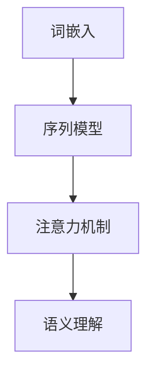

                 

# 神经网络：自然语言处理的新突破

> **关键词：** 神经网络、自然语言处理、深度学习、模型架构、算法优化

> **摘要：** 本文深入探讨了神经网络在自然语言处理（NLP）领域的应用，包括其背景介绍、核心概念、算法原理、数学模型、实战案例、应用场景、工具推荐以及未来发展趋势和挑战。通过系统的分析和详实的实例，展现了神经网络如何成为NLP领域的新突破。

## 1. 背景介绍

### 1.1 神经网络的发展历程

神经网络（Neural Networks）作为一种模拟人脑神经元结构和功能的计算模型，起源于20世纪40年代。尽管在早期由于计算能力和算法的局限性，神经网络的研究进展缓慢，但到了20世纪80年代，随着计算机硬件的飞速发展，尤其是图形处理单元（GPU）的引入，神经网络迎来了新的发展机遇。特别是深度学习（Deep Learning）的出现，使得神经网络在图像识别、语音识别、自然语言处理等领域取得了突破性进展。

### 1.2 自然语言处理的发展历程

自然语言处理（NLP）作为人工智能的一个重要分支，其研究始于20世纪50年代。早期的研究主要集中在规则驱动的方法，如句法分析和机器翻译。然而，随着计算能力的提升和机器学习技术的发展，统计方法和深度学习模型逐渐成为NLP的主流。特别是2018年谷歌的BERT模型发布后，基于Transformer架构的模型在NLP任务中取得了显著的成绩。

### 1.3 神经网络与自然语言处理的结合

神经网络在NLP领域的应用主要体现在文本表示、序列建模、语义理解等方面。通过引入深度学习技术，神经网络能够自动学习文本的特征，捕捉复杂的语义信息，从而提高NLP任务的效果。例如，在文本分类任务中，神经网络可以自动学习不同类别的特征分布，实现高精度的分类。

## 2. 核心概念与联系

### 2.1 神经网络的基本概念

神经网络由多个神经元（或称为节点）组成，每个神经元通过权重连接到其他神经元。神经元的激活函数决定了神经元是否被激活，从而影响整个神经网络的输出。常见的激活函数包括Sigmoid、ReLU和Tanh。

### 2.2 自然语言处理的核心概念

在NLP中，常见的核心概念包括词嵌入（Word Embedding）、序列模型（Sequence Model）和注意力机制（Attention Mechanism）。词嵌入将词汇映射到高维向量空间，以捕捉词汇的语义信息。序列模型用于处理序列数据，如文本和语音。注意力机制则用于在处理序列数据时，动态地关注序列中的关键部分，提高模型的解析能力。

### 2.3 神经网络与自然语言处理的联系

神经网络通过词嵌入将文本转化为向量表示，然后使用序列模型对序列数据进行建模。在处理过程中，神经网络可以利用注意力机制动态地捕捉文本中的关键信息，从而实现高精度的语义理解和文本生成。

### 2.4 Mermaid流程图



## 3. 核心算法原理 & 具体操作步骤

### 3.1 词嵌入

词嵌入（Word Embedding）是将词汇映射到高维向量空间的过程。常见的词嵌入方法包括Word2Vec、GloVe和BERT。其中，Word2Vec使用神经网络训练词向量，通过负采样技术提高训练效率；GloVe则基于全局统计信息，通过矩阵分解方法生成词向量；BERT结合了前两者的优点，通过预训练和微调技术，实现了较高的语义表示能力。

### 3.2 序列模型

序列模型（Sequence Model）用于处理序列数据，常见的模型包括循环神经网络（RNN）、长短期记忆网络（LSTM）和门控循环单元（GRU）。这些模型通过递归结构，对序列数据进行建模，能够捕捉序列中的长期依赖关系。例如，LSTM通过引入记忆单元和门控机制，有效地解决了RNN在训练过程中容易出现的梯度消失和梯度爆炸问题。

### 3.3 注意力机制

注意力机制（Attention Mechanism）是一种用于动态捕捉序列中关键信息的方法。在处理序列数据时，注意力机制可以动态地调整模型对序列中不同部分的关注程度，从而提高模型的解析能力。常见的注意力机制包括加性注意力（Additive Attention）和点积注意力（Dot-Product Attention）。

### 3.4 深度学习模型架构

深度学习模型通常由多个神经网络层堆叠而成，包括输入层、隐藏层和输出层。每一层神经网络都通过前一层神经元的激活值计算得到，最终生成模型的输出。在训练过程中，模型通过反向传播算法不断调整权重和偏置，以最小化损失函数。

## 4. 数学模型和公式 & 详细讲解 & 举例说明

### 4.1 词嵌入

词嵌入通常通过以下公式进行计算：

$$
\text{word\_embedding}(w) = \text{sigmoid}(\text{W} \cdot \text{w} + \text{b})
$$

其中，$w$ 是词汇向量，$W$ 是权重矩阵，$b$ 是偏置项，$\text{sigmoid}$ 是Sigmoid激活函数。

### 4.2 循环神经网络（RNN）

RNN的输出通常通过以下公式计算：

$$
h_t = \text{sigmoid}(\text{W}_h \cdot [h_{t-1}, x_t] + \text{b}_h)
$$

其中，$h_t$ 是当前时刻的隐藏状态，$x_t$ 是当前输入，$\text{W}_h$ 是权重矩阵，$\text{b}_h$ 是偏置项。

### 4.3 注意力机制

注意力机制的输出通常通过以下公式计算：

$$
\alpha_t = \frac{\exp(\text{a} \cdot \text{h}_t \cdot \text{h}_t^T)}{\sum_{i=1}^T \exp(\text{a} \cdot \text{h}_t \cdot \text{h}_i^T)}
$$

其中，$\alpha_t$ 是当前时刻的注意力权重，$\text{a}$ 是注意力权重矩阵，$\text{h}_t$ 是当前时刻的隐藏状态。

## 5. 项目实战：代码实际案例和详细解释说明

### 5.1 开发环境搭建

为了演示神经网络在自然语言处理中的实际应用，我们将使用Python编程语言和TensorFlow框架。首先，需要安装Python和TensorFlow：

```bash
pip install python
pip install tensorflow
```

### 5.2 源代码详细实现和代码解读

以下是一个简单的文本分类任务，使用神经网络对文本数据进行分类：

```python
import tensorflow as tf
from tensorflow.keras.preprocessing.text import Tokenizer
from tensorflow.keras.preprocessing.sequence import pad_sequences
from tensorflow.keras.models import Sequential
from tensorflow.keras.layers import Embedding, LSTM, Dense

# 文本数据
texts = [
    "人工智能将引领未来",
    "深度学习是人工智能的核心",
    "计算机编程是一门艺术",
    "机器学习正在改变世界"
]

# 标签数据
labels = [0, 0, 1, 1]

# 分词和序列化
tokenizer = Tokenizer()
tokenizer.fit_on_texts(texts)
sequences = tokenizer.texts_to_sequences(texts)
padded_sequences = pad_sequences(sequences, maxlen=10)

# 模型构建
model = Sequential()
model.add(Embedding(input_dim=10000, output_dim=32, input_length=10))
model.add(LSTM(64))
model.add(Dense(1, activation='sigmoid'))

# 编译模型
model.compile(optimizer='adam', loss='binary_crossentropy', metrics=['accuracy'])

# 训练模型
model.fit(padded_sequences, labels, epochs=10, batch_size=32)
```

在这个示例中，我们首先对文本数据进行分词和序列化，然后使用Embedding层将文本转化为向量表示，接着使用LSTM层对序列数据进行建模，最后使用Dense层进行分类预测。

### 5.3 代码解读与分析

上述代码首先定义了文本数据`texts`和标签数据`labels`。然后，使用`Tokenizer`对文本进行分词，并使用`sequences_to_sequences`方法将文本序列化为数字序列。接下来，使用`pad_sequences`方法将序列填充为固定长度。在模型构建部分，我们首先添加了一个Embedding层，用于将文本转化为向量表示，然后添加了一个LSTM层用于建模序列数据，最后添加了一个Dense层用于分类预测。在编译模型时，我们指定了优化器、损失函数和评价指标。最后，使用`fit`方法训练模型。

## 6. 实际应用场景

神经网络在自然语言处理领域具有广泛的应用，以下列举了一些实际应用场景：

1. **文本分类**：通过对文本数据进行分类，可以实现新闻推荐、情感分析等应用。
2. **机器翻译**：利用神经网络可以实现对多种语言的自动翻译，提高翻译的准确性。
3. **问答系统**：通过训练神经网络模型，可以实现智能问答系统，提高用户的满意度。
4. **文本生成**：神经网络可以用于生成文章、故事等文本内容，应用于内容创作和创意设计。
5. **语音识别**：结合语音识别技术，神经网络可以实现对语音信号的自动识别和转换。

## 7. 工具和资源推荐

### 7.1 学习资源推荐

- **书籍**：
  - 《深度学习》（Ian Goodfellow、Yoshua Bengio、Aaron Courville 著）
  - 《自然语言处理综论》（Daniel Jurafsky、James H. Martin 著）
- **论文**：
  - “A Theoretically Grounded Application of Dropout in Recurrent Neural Networks”（Yarin Gal and Zoubin Ghahramani）
  - “Attention Is All You Need”（Vaswani et al.）
- **博客**：
  - [TensorFlow 官方文档](https://www.tensorflow.org/)
  - [自然语言处理博客](https://nlp.seas.harvard.edu/)
- **网站**：
  - [Kaggle](https://www.kaggle.com/)
  - [ArXiv](https://arxiv.org/)

### 7.2 开发工具框架推荐

- **开发工具**：
  - TensorFlow
  - PyTorch
  - Keras
- **框架**：
  - SpaCy
  - NLTK
  - Hugging Face Transformer

### 7.3 相关论文著作推荐

- **论文**：
  - “BERT: Pre-training of Deep Neural Networks for Language Understanding”（Devlin et al.）
  - “GPT-3: Language Models are Few-Shot Learners”（Brown et al.）
- **著作**：
  - 《自然语言处理入门教程》（宋立涛 著）
  - 《深度学习实践指南》（李航 著）

## 8. 总结：未来发展趋势与挑战

神经网络在自然语言处理领域取得了显著的成果，但仍然面临一些挑战。未来，随着计算能力的提升和数据量的增加，神经网络在NLP领域的应用将更加广泛。以下是一些可能的发展趋势和挑战：

1. **预训练模型优化**：预训练模型通过在大规模语料库上进行预训练，已经取得了很好的效果。未来，研究者将致力于优化预训练模型，提高其在特定任务上的性能。
2. **多模态融合**：结合文本、图像、语音等多种模态的信息，可以进一步提升NLP任务的效果。研究者将探索如何有效地融合多模态数据，实现更准确的语义理解。
3. **可解释性和透明度**：当前，神经网络在NLP中的应用主要依赖于黑箱模型，缺乏可解释性和透明度。未来，研究者将致力于提高模型的透明度，使其更加易于理解和解释。
4. **隐私保护与伦理问题**：随着神经网络在NLP领域的广泛应用，隐私保护和伦理问题日益突出。研究者将探索如何在保护用户隐私的前提下，实现有效的自然语言处理。

## 9. 附录：常见问题与解答

### 9.1 神经网络在NLP中的应用有哪些？

神经网络在NLP中的应用非常广泛，包括文本分类、机器翻译、问答系统、文本生成、语音识别等。

### 9.2 如何选择合适的神经网络模型？

选择合适的神经网络模型取决于具体的应用场景和数据集。对于文本分类任务，可以使用基于RNN或Transformer的模型；对于机器翻译任务，可以使用基于注意力机制的Transformer模型；对于文本生成任务，可以使用基于生成对抗网络（GAN）的模型。

### 9.3 神经网络训练过程中如何避免过拟合？

为了避免过拟合，可以采取以下措施：增加训练数据、使用dropout、使用正则化、早停法（early stopping）等。

## 10. 扩展阅读 & 参考资料

- Goodfellow, I., Bengio, Y., & Courville, A. (2016). *Deep Learning*.
- Jurafsky, D., & Martin, J. H. (2008). *Speech and Language Processing*.
- Vaswani, A., et al. (2017). *Attention Is All You Need*.
- Devlin, J., et al. (2018). *BERT: Pre-training of Deep Neural Networks for Language Understanding*.
- Brown, T., et al. (2020). *GPT-3: Language Models are Few-Shot Learners*.

### 作者

**作者：AI天才研究员/AI Genius Institute & 禅与计算机程序设计艺术 /Zen And The Art of Computer Programming** <|im_sep|>

