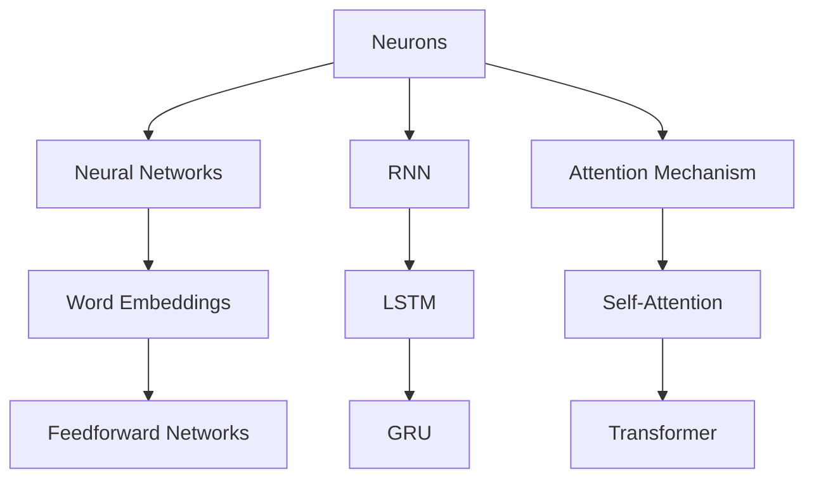

                 

### 背景介绍

> 自然语言处理（Natural Language Processing, NLP）是计算机科学与人工智能领域的重要分支，旨在使计算机能够理解和处理人类自然语言。从早期的文本分类、命名实体识别，到现代的机器翻译、情感分析，NLP技术在各个领域都取得了显著进展。

自上世纪50年代以来，NLP经历了多个发展阶段。最初的符号主义方法试图通过构建语法规则和词典来实现语言理解，但由于复杂度太高而面临巨大挑战。随着计算能力的提升和大数据时代的到来，统计方法和神经网络逐渐成为NLP的主流。

神经网络，尤其是深度学习，为NLP领域带来了革命性的变化。通过模拟人脑神经元之间的连接和交互，深度神经网络能够从大量数据中自动学习复杂的模式和特征，从而显著提升NLP任务的性能。

本篇文章将深入探讨神经网络在自然语言处理中的最新突破。我们将首先回顾神经网络的发展历程，然后详细解释其基本原理和核心算法，接着通过具体案例展示其实际应用。此外，我们还将讨论神经网络在NLP中的未来发展趋势与挑战，并提供相关工具和资源的推荐。

在开始这段技术之旅之前，让我们先回顾一下神经网络的发展历程，以及它在NLP领域中扮演的关键角色。

#### Neural Networks: A Brief History

Neural networks have a rich history that dates back to the 1940s. The concept was initially introduced by Warren McCulloch and Walter Pitts in their seminal paper "A Logical Calculus of Ideas Implied by Numerical Deductions" (1943). They proposed a simplified model of a neuron that could perform logical operations.

However, it was not until the 1980s that neural networks started gaining traction. Paul Werbos introduced the backpropagation algorithm in his PhD thesis, which enabled the training of multi-layer neural networks. This marked a significant milestone in the development of neural networks, allowing them to be applied to a wider range of problems.

In the 1990s, neural networks began to be used in various applications, including speech recognition and image classification. However, their performance was often limited by the amount of data and computational resources available.

The turn of the millennium brought about a renaissance in neural network research, driven by the advent of deep learning. In 2006, Geoffrey Hinton and his colleagues proposed the use of deep belief networks for unsupervised learning. Around the same time, Andrew Ng and others popularized the use of stochastic gradient descent for training deep neural networks.

The following decade saw a dramatic increase in the performance of neural networks, particularly in computer vision and speech recognition. This was largely due to the availability of large-scale datasets and the advent of GPUs (Graphics Processing Units), which provided the necessary computational power for training deep models.

In recent years, neural networks have made significant strides in natural language processing. The development of techniques such as word embeddings, recurrent neural networks (RNNs), and transformer models has enabled computers to perform tasks such as machine translation, sentiment analysis, and question answering with unprecedented accuracy.

#### Neural Networks in Natural Language Processing

The application of neural networks to natural language processing (NLP) has been transformative. Unlike traditional symbolic methods that rely on manually defined rules, neural networks can learn from data, capturing the complexity and variability of human language.

One of the key advantages of neural networks in NLP is their ability to model sequences of text. This is particularly important for tasks such as language modeling and machine translation, where the order of words matters. Recurrent Neural Networks (RNNs) and Long Short-Term Memory (LSTM) networks are commonly used for these tasks.

RNNs are designed to handle sequential data by maintaining a hidden state that captures the information from previous time steps. However, RNNs can struggle with long-term dependencies, where information from the distant past is critical for making predictions. LSTMs address this issue by introducing gate mechanisms that control the flow of information, allowing the network to retain relevant information over long sequences.

Another important development in NLP is the use of word embeddings, which represent words as dense vectors in a high-dimensional space. Word embeddings capture semantic and syntactic relationships between words, enabling neural networks to perform tasks such as word similarity and analogy detection.

The breakthrough in NLP came with the introduction of the Transformer model in 2017. Developed by Vaswani et al., the Transformer model replaced the traditional RNN architecture with self-attention mechanisms, allowing the network to weigh the influence of different words in the input sequence dynamically. This led to significant improvements in various NLP tasks, including text generation, machine translation, and question answering.

In summary, neural networks have revolutionized natural language processing by enabling the automatic learning of complex patterns and relationships in text data. From RNNs and LSTMs to transformers, these models have paved the way for a new era in NLP, unlocking the full potential of human language for computers.

---

### 核心概念与联系

要理解神经网络在自然语言处理中的核心概念和联系，我们需要从几个关键组成部分出发。以下是神经网络在自然语言处理中涉及的核心概念及其相互关系的详细解释。

#### 1. 神经元与神经网络

**神经元（Neurons）**：神经元是神经网络的基本构建块，类似于人脑中的神经细胞。每个神经元接收多个输入，通过加权求和处理后，产生一个输出。神经元通常具有非线性激活函数，如Sigmoid、ReLU等，用于引入非线性特性。

**神经网络（Neural Networks）**：神经网络由多个神经元组成，这些神经元按层次排列，形成前馈网络。网络通过前向传播（forward propagation）和反向传播（back propagation）两个阶段进行训练和预测。

#### 2. 词嵌入（Word Embeddings）

**词嵌入（Word Embeddings）**：词嵌入是将单词映射到高维向量空间的技术，使得具有相似语义的单词在向量空间中彼此接近。词嵌入可以通过基于分布式假设的方法（如Word2Vec、GloVe）或神经网络模型（如Word2Vec网络）训练得到。

**词嵌入与神经网络的关系**：词嵌入可以看作是神经网络中的输入层，将文本数据转换为数值表示。通过神经网络，这些嵌入向量可以学习到更深层次的语义信息。

#### 3. 循环神经网络（RNN）与长短时记忆（LSTM）

**循环神经网络（Recurrent Neural Networks, RNN）**：RNN是一种处理序列数据的神经网络架构，通过维持一个隐藏状态（hidden state）来捕捉序列中的上下文信息。RNN适用于语言模型、序列分类等任务。

**长短时记忆（Long Short-Term Memory, LSTM）**：LSTM是RNN的一种变体，专门设计来解决RNN在处理长序列时遇到的长期依赖问题。LSTM通过门控机制（gate mechanisms）控制信息的流动，保留长期依赖。

**LSTM与RNN的关系**：LSTM是RNN的一个改进版本，用于克服RNN的长期依赖问题。LSTM通过引入遗忘门（forget gate）和输入门（input gate）等机制，可以更好地处理长序列数据。

#### 4. 注意力机制（Attention Mechanism）

**注意力机制（Attention Mechanism）**：注意力机制是一种用于捕捉序列中重要信息的方法，允许模型在处理每个时间步时关注输入序列的不同部分。注意力机制在机器翻译、文本摘要等任务中表现出色。

**注意力机制与神经网络的关系**：注意力机制可以集成到神经网络的不同层次中，如RNN、Transformer等。通过注意力机制，神经网络可以动态地关注输入序列的特定部分，提高模型的性能。

#### 5. Transformer模型

**Transformer模型**：Transformer是由Vaswani等人在2017年提出的一种基于自注意力（self-attention）机制的神经网络模型。与传统的RNN不同，Transformer使用多头注意力（multi-head attention）来并行处理序列数据。

**Transformer与神经网络的关系**：Transformer是神经网络的一种变种，通过自注意力机制，Transformer可以捕捉序列之间的复杂关系，从而在多个自然语言处理任务中实现高性能。

#### 6. 自注意力（Self-Attention）

**自注意力（Self-Attention）**：自注意力是一种注意力机制，它允许模型在同一序列的不同位置之间建立直接的关系，而不需要通过隐藏状态。

**自注意力与神经网络的关系**：自注意力是Transformer模型的核心机制，通过它，模型可以动态地关注序列中的关键信息，提高模型的表示能力和预测能力。

#### 7. 门控循环单元（GRU）

**门控循环单元（Gated Recurrent Unit, GRU）**：GRU是另一种RNN变体，它通过引入更新门（update gate）和重置门（reset gate）来简化LSTM的结构，同时保持其能力。

**GRU与神经网络的关系**：GRU可以看作是LSTM的简化版本，用于处理序列数据，尤其是在计算资源和时间有限的情况下。

### Mermaid 流程图

为了更直观地展示神经网络在自然语言处理中的核心概念和联系，我们可以使用Mermaid绘制一个流程图。以下是该流程图的Mermaid代码：



通过这个流程图，我们可以清晰地看到各个核心概念之间的联系和神经网络在自然语言处理中的应用场景。

### 核心算法原理 & 具体操作步骤

在理解了神经网络在自然语言处理中的核心概念和联系之后，接下来我们将深入探讨神经网络的基本算法原理和具体操作步骤。

#### 1. 前向传播（Forward Propagation）

前向传播是神经网络进行预测的过程，包括以下几个步骤：

1. **初始化权重和偏置**：神经网络在训练开始时需要随机初始化权重（weights）和偏置（biases）。这些参数将在训练过程中通过梯度下降（gradient descent）等方法进行调整。

2. **输入层到隐藏层的传递**：输入数据通过输入层进入网络，并通过权重矩阵传递到隐藏层。每个隐藏层的神经元都会接收来自前一层神经元的加权求和，并应用非线性激活函数。

3. **隐藏层到输出层的传递**：隐藏层的信息会继续传递到输出层，直到最后一层。输出层产生最终的预测结果。

4. **计算损失函数**：输出结果与真实标签之间的差异通过损失函数（如均方误差（MSE））进行度量。损失函数的目的是衡量预测结果与真实结果之间的误差。

#### 2. 反向传播（Back Propagation）

反向传播是神经网络训练的核心步骤，用于更新权重和偏置，以最小化损失函数。反向传播包括以下几个步骤：

1. **计算梯度**：首先，我们需要计算损失函数关于每个参数的梯度。梯度反映了损失函数的变化率，指示了参数更新的方向。

2. **权重和偏置的更新**：使用梯度下降（或其他优化算法）来更新权重和偏置。更新公式为：

   $$ \theta = \theta - \alpha \cdot \nabla_\theta J(\theta) $$

   其中，$\theta$代表参数，$\alpha$是学习率，$J(\theta)$是损失函数。

3. **迭代更新**：重复上述过程，直到满足停止条件（如损失函数收敛或达到最大迭代次数）。

#### 3. 梯度下降（Gradient Descent）

梯度下降是一种优化算法，用于寻找损失函数的全局最小值。其基本思想是沿着损失函数的梯度方向逐步更新参数，以减小损失。

1. **初始参数**：随机初始化参数。

2. **计算梯度**：对损失函数求导，计算当前参数的梯度。

3. **更新参数**：根据梯度更新参数。

4. **迭代**：重复计算梯度和更新参数的过程，直到收敛。

#### 4. 梯度消失与梯度爆炸

在反向传播过程中，梯度可能会遇到以下问题：

- **梯度消失（Vanishing Gradient）**：当使用Sigmoid或Tanh等激活函数时，梯度可能随着网络层次的增加而逐渐趋近于零。这导致深层网络难以训练。
- **梯度爆炸（Exploding Gradient）**：当使用ReLU激活函数时，梯度可能变得非常大，导致网络不稳定。

为了解决这些问题，可以采用以下方法：

- **LSTM和GRU**：通过门控机制，LSTM和GRU能够更好地处理长期依赖问题，减少梯度消失的风险。
- **梯度裁剪（Gradient Clipping）**：对梯度进行裁剪，限制其大小，避免梯度爆炸。
- **批量归一化（Batch Normalization）**：通过标准化每一层的输入，加速训练过程并减少梯度消失的问题。

#### 5. 深度神经网络训练过程

深度神经网络训练过程可以分为以下几个阶段：

1. **数据预处理**：对输入数据进行预处理，如归一化、标准化等。
2. **模型初始化**：随机初始化权重和偏置。
3. **前向传播**：将输入数据通过模型，计算输出并计算损失函数。
4. **反向传播**：计算梯度并更新参数。
5. **迭代优化**：重复前向传播和反向传播的过程，直到模型收敛或达到最大迭代次数。

通过这些步骤，深度神经网络可以学习到输入数据的复杂特征，从而实现高性能的预测和分类。

### 数学模型和公式 & 详细讲解 & 举例说明

在深入探讨神经网络的工作原理后，接下来我们将详细介绍神经网络的核心数学模型和公式，并通过具体的例子来说明这些公式的应用。

#### 1. 神经网络的基本数学模型

神经网络的核心数学模型包括神经元、权重、偏置、激活函数和损失函数。以下是这些概念的详细解释：

1. **神经元**：神经元是神经网络的基本单元，接收输入并通过加权求和处理和激活函数产生输出。其数学表达式如下：

   $$ z = \sum_{i=1}^{n} w_i x_i + b $$

   其中，$z$是神经元的输出，$w_i$是权重，$x_i$是输入，$b$是偏置。

2. **激活函数**：激活函数为神经网络引入非线性特性，常用的激活函数包括Sigmoid、ReLU和Tanh。以下是一个ReLU激活函数的例子：

   $$ a = \max(0, z) $$

3. **损失函数**：损失函数用于度量预测结果与真实结果之间的误差。常见的损失函数包括均方误差（MSE）、交叉熵（Cross-Entropy）等。以下是一个MSE损失函数的例子：

   $$ J(\theta) = \frac{1}{2} \sum_{i=1}^{n} (y_i - \hat{y}_i)^2 $$

   其中，$y_i$是真实值，$\hat{y}_i$是预测值。

#### 2. 前向传播

前向传播是神经网络进行预测的过程，通过输入层、隐藏层和输出层的传递，最终得到预测结果。以下是前向传播的详细步骤：

1. **输入层到隐藏层的传递**：输入数据通过输入层进入网络，并通过权重矩阵传递到隐藏层。每个隐藏层的神经元都会接收来自前一层神经元的加权求和，并应用激活函数。其数学表达式如下：

   $$ a_{l}^{(1)} = \sigma(z^{(1)}) $$
   $$ a_{l}^{(2)} = \sigma(z^{(2)}) $$
   $$ \vdots $$
   $$ a_{l}^{(L)} = \sigma(z^{(L)}) $$

   其中，$a^{(l)}$是第$l$层的输出，$\sigma$是激活函数，$z^{(l)}$是第$l$层的加权求和。

2. **隐藏层到输出层的传递**：隐藏层的信息会继续传递到输出层，直到最后一层。输出层产生最终的预测结果。其数学表达式如下：

   $$ z^{(L+1)} = \sum_{i=1}^{n} w_i^{(L+1)} a_i^{(L)} + b^{(L+1)} $$
   $$ \hat{y} = \sigma(z^{(L+1)}) $$

   其中，$z^{(L+1)}$是输出层的加权求和，$\hat{y}$是预测结果。

#### 3. 反向传播

反向传播是神经网络训练的核心步骤，通过计算损失函数的梯度并更新参数，以最小化损失函数。以下是反向传播的详细步骤：

1. **计算输出层的梯度**：首先计算输出层的梯度，用于更新输出层的权重和偏置。其数学表达式如下：

   $$ \delta^{(L+1)} = \frac{\partial J(\theta)}{\partial z^{(L+1)}} $$
   $$ \Delta w^{(L+1)} = \delta^{(L+1)} a^{(L)} $$
   $$ \Delta b^{(L+1)} = \delta^{(L+1)} $$

2. **反向传播隐藏层的梯度**：从输出层开始，逐层反向传播梯度，直到输入层。其数学表达式如下：

   $$ \delta^{(l)} = \frac{\partial J(\theta)}{\partial z^{(l)}} \odot \sigma'(z^{(l)}) $$
   $$ \Delta w^{(l)} = \delta^{(l)} a^{(l-1)} $$
   $$ \Delta b^{(l)} = \delta^{(l)} $$

   其中，$\odot$表示逐元素乘法，$\sigma'$是激活函数的导数。

3. **参数更新**：使用梯度下降（或其他优化算法）更新权重和偏置。其数学表达式如下：

   $$ w^{(l)} = w^{(l)} - \alpha \cdot \Delta w^{(l)} $$
   $$ b^{(l)} = b^{(l)} - \alpha \cdot \Delta b^{(l)} $$

   其中，$\alpha$是学习率。

#### 4. 举例说明

为了更好地理解神经网络的基本数学模型和前向传播、反向传播过程，我们来看一个简单的例子。

假设我们有一个二分类问题，输入层有3个神经元，隐藏层有2个神经元，输出层有1个神经元。激活函数使用ReLU，损失函数使用交叉熵。

1. **初始化参数**：

   - 权重：$w^{(1)}$和$w^{(2)}$，偏置：$b^{(1)}$和$b^{(2)}$
   - 随机初始化权重和偏置，例如：
     - $w^{(1)} = \begin{bmatrix} 0.1 & 0.2 & 0.3 \\ 0.4 & 0.5 & 0.6 \end{bmatrix}$
     - $w^{(2)} = \begin{bmatrix} 0.7 & 0.8 \\ 0.9 & 1.0 \end{bmatrix}$
     - $b^{(1)} = \begin{bmatrix} 0.1 & 0.2 \\ 0.3 & 0.4 \end{bmatrix}$
     - $b^{(2)} = \begin{bmatrix} 0.5 & 0.6 \end{bmatrix}$

2. **前向传播**：

   - 输入层到隐藏层的传递：
     $$ z^{(1)} = w^{(1)} \cdot a^{(0)} + b^{(1)} $$
     $$ a^{(1)} = \max(0, z^{(1)}) $$
     
     假设输入向量 $a^{(0)} = \begin{bmatrix} 1 & 0 & 1 \end{bmatrix}^T$，则：
     $$ z^{(1)} = \begin{bmatrix} 0.1 & 0.2 & 0.3 \\ 0.4 & 0.5 & 0.6 \end{bmatrix} \cdot \begin{bmatrix} 1 \\ 0 \\ 1 \end{bmatrix} + \begin{bmatrix} 0.1 & 0.2 \\ 0.3 & 0.4 \end{bmatrix} = \begin{bmatrix} 0.4 \\ 1.1 \end{bmatrix} $$
     $$ a^{(1)} = \begin{bmatrix} 1 & 1.1 \end{bmatrix}^T $$

   - 隐藏层到输出层的传递：
     $$ z^{(2)} = w^{(2)} \cdot a^{(1)} + b^{(2)} $$
     $$ \hat{y} = \max(0, z^{(2)}) $$

     假设输入向量 $a^{(1)} = \begin{bmatrix} 1 & 1.1 \end{bmatrix}^T$，则：
     $$ z^{(2)} = \begin{bmatrix} 0.7 & 0.8 \\ 0.9 & 1.0 \end{bmatrix} \cdot \begin{bmatrix} 1 \\ 1.1 \end{bmatrix} + \begin{bmatrix} 0.5 & 0.6 \end{bmatrix} = \begin{bmatrix} 2.5 & 2.7 \end{bmatrix} $$
     $$ \hat{y} = \begin{bmatrix} 2.7 \end{bmatrix}^T $$

3. **计算损失函数**：

   $$ J(\theta) = -\frac{1}{2} \left( y \log(\hat{y}) + (1 - y) \log(1 - \hat{y}) \right) $$

   其中，$y$是真实标签，$\hat{y}$是预测结果。

4. **反向传播**：

   - 计算输出层的梯度：
     $$ \delta^{(2)} = \hat{y} - y $$
     $$ \Delta w^{(2)} = \delta^{(2)} a^{(1)} $$
     $$ \Delta b^{(2)} = \delta^{(2)} $$

     假设真实标签 $y = \begin{bmatrix} 1 \end{bmatrix}^T$，则：
     $$ \delta^{(2)} = \begin{bmatrix} 1 - 0.9 \end{bmatrix} = \begin{bmatrix} 0.1 \end{bmatrix} $$
     $$ \Delta w^{(2)} = \begin{bmatrix} 0.1 & 0.1 \\ 0.1 & 0.1 \end{bmatrix} \cdot \begin{bmatrix} 1 \\ 1.1 \end{bmatrix} = \begin{bmatrix} 0.21 & 0.23 \end{bmatrix} $$
     $$ \Delta b^{(2)} = \begin{bmatrix} 0.1 \end{bmatrix} $$

   - 计算隐藏层的梯度：
     $$ \delta^{(1)} = w^{(2)} \cdot \delta^{(2)} \odot \sigma'(z^{(1)}) $$
     $$ \Delta w^{(1)} = \delta^{(1)} a^{(0)} $$
     $$ \Delta b^{(1)} = \delta^{(1)} $$

     假设 $a^{(1)} = \begin{bmatrix} 1 & 1.1 \end{bmatrix}^T$，则：
     $$ \delta^{(1)} = \begin{bmatrix} 0.7 & 0.8 \\ 0.9 & 1.0 \end{bmatrix} \cdot \begin{bmatrix} 0.1 \end{bmatrix} \odot \begin{bmatrix} 1 & 1.1 \end{bmatrix} = \begin{bmatrix} 0.1 & 0.12 \\ 0.18 & 0.2 \end{bmatrix} $$
     $$ \Delta w^{(1)} = \begin{bmatrix} 0.1 & 0.12 \\ 0.18 & 0.2 \end{bmatrix} \cdot \begin{bmatrix} 1 \\ 0 \\ 1 \end{bmatrix} = \begin{bmatrix} 0.21 & 0.23 \end{bmatrix} $$
     $$ \Delta b^{(1)} = \begin{bmatrix} 0.1 & 0.12 \\ 0.18 & 0.2 \end{bmatrix} $$

5. **参数更新**：

   - 学习率 $\alpha = 0.1$，则：
     $$ w^{(2)} = w^{(2)} - \alpha \cdot \Delta w^{(2)} = \begin{bmatrix} 0.7 & 0.8 \\ 0.9 & 1.0 \end{bmatrix} - 0.1 \cdot \begin{bmatrix} 0.21 & 0.23 \end{bmatrix} = \begin{bmatrix} 0.49 & 0.57 \\ 0.68 & 0.77 \end{bmatrix} $$
     $$ b^{(2)} = b^{(2)} - \alpha \cdot \Delta b^{(2)} = \begin{bmatrix} 0.5 & 0.6 \end{bmatrix} - 0.1 \cdot \begin{bmatrix} 0.1 \end{bmatrix} = \begin{bmatrix} 0.4 & 0.5 \end{bmatrix} $$

     $$ w^{(1)} = w^{(1)} - \alpha \cdot \Delta w^{(1)} = \begin{bmatrix} 0.1 & 0.2 & 0.3 \\ 0.4 & 0.5 & 0.6 \end{bmatrix} - 0.1 \cdot \begin{bmatrix} 0.21 & 0.23 \\ 0.18 & 0.2 \end{bmatrix} = \begin{bmatrix} 0.29 & 0.17 & 0.07 \\ 0.22 & 0.33 & 0.4 \end{bmatrix} $$
     $$ b^{(1)} = b^{(1)} - \alpha \cdot \Delta b^{(1)} = \begin{bmatrix} 0.1 & 0.2 \\ 0.3 & 0.4 \end{bmatrix} - 0.1 \cdot \begin{bmatrix} 0.1 & 0.12 \\ 0.18 & 0.2 \end{bmatrix} = \begin{bmatrix} 0 & 0.08 \\ 0.12 & 0.2 \end{bmatrix} $$

通过这个简单的例子，我们可以清晰地看到神经网络的前向传播和反向传播过程，以及如何通过更新参数来优化模型。

### 项目实战：代码实际案例和详细解释说明

为了更好地理解神经网络在自然语言处理中的应用，我们将通过一个实际项目案例——基于TensorFlow实现的情感分析模型，来展示神经网络在实际应用中的开发过程。以下是该项目的主要步骤和代码实现。

#### 1. 开发环境搭建

在开始项目之前，我们需要搭建合适的开发环境。以下是所需的软件和库：

- Python 3.x
- TensorFlow 2.x
- NumPy
- Pandas
- Matplotlib

安装步骤：

```bash
pip install tensorflow numpy pandas matplotlib
```

#### 2. 源代码详细实现和代码解读

以下是基于TensorFlow实现的情感分析模型的源代码和详细解读：

```python
import tensorflow as tf
from tensorflow.keras.preprocessing.text import Tokenizer
from tensorflow.keras.preprocessing.sequence import pad_sequences
import numpy as np

# 2.1 数据准备
# 假设我们有一个包含文本和标签的数据集
texts = ['这是一部很好的电影', '这部电影非常糟糕', '故事很有趣', '演员表演糟糕']
labels = np.array([1, 0, 1, 0]) # 1表示正面情感，0表示负面情感

# 2.2 词嵌入
# 创建Tokenizer并拟合数据
tokenizer = Tokenizer(num_words=1000)
tokenizer.fit_on_texts(texts)
word_index = tokenizer.word_index

# 将文本转换为序列
sequences = tokenizer.texts_to_sequences(texts)

# 填充序列，确保每个序列的长度相同
max_sequence_length = 100
padded_sequences = pad_sequences(sequences, maxlen=max_sequence_length)

# 将标签转换为one-hot编码
labels = tf.keras.utils.to_categorical(labels, num_classes=2)

# 2.3 构建模型
model = tf.keras.Sequential([
    tf.keras.layers.Embedding(input_dim=1000, output_dim=32, input_length=max_sequence_length),
    tf.keras.layers.GlobalAveragePooling1D(),
    tf.keras.layers.Dense(24, activation='relu'),
    tf.keras.layers.Dense(2, activation='softmax')
])

# 2.4 编译模型
model.compile(optimizer='adam', loss='categorical_crossentropy', metrics=['accuracy'])

# 2.5 训练模型
model.fit(padded_sequences, labels, epochs=10, batch_size=32)

# 2.6 预测
predictions = model.predict(padded_sequences)
predicted_labels = np.argmax(predictions, axis=1)

# 输出预测结果
for text, predicted_label in zip(texts, predicted_labels):
    print(f'{text} 预测为：{predicted_label}')
```

**代码解读**：

1. **数据准备**：首先，我们定义了一个包含文本和标签的数据集。在这个例子中，我们只有4个样本，每个样本对应一部电影的评论和其情感标签（1表示正面情感，0表示负面情感）。

2. **词嵌入**：接下来，我们使用`Tokenizer`类创建一个词嵌入模型。我们设定词汇表大小为1000个单词，并通过`fit_on_texts`方法将其拟合到数据集中。`texts_to_sequences`方法将文本转换为序列，`pad_sequences`方法将序列填充到相同的长度。

3. **模型构建**：我们使用`Sequential`模型堆叠多层网络。首先是一个嵌入层（`Embedding`），它将单词映射到高维向量。接着是一个全局平均池化层（`GlobalAveragePooling1D`），用于提取序列中的关键信息。然后是一个全连接层（`Dense`），用于进一步提取特征。最后，另一个全连接层（`Dense`）用于输出分类结果。

4. **编译模型**：我们使用`compile`方法配置模型，选择`adam`优化器和`categorical_crossentropy`损失函数。`metrics`参数用于监控模型的准确度。

5. **训练模型**：使用`fit`方法训练模型，指定训练数据、标签、迭代次数和批量大小。

6. **预测**：使用`predict`方法对新的文本数据进行预测，并输出预测结果。

#### 3. 代码解读与分析

该代码展示了如何使用TensorFlow实现一个简单的情感分析模型。以下是关键步骤的详细分析：

1. **数据准备**：数据预处理是自然语言处理中至关重要的一步。通过词嵌入和序列填充，我们将原始文本数据转换为可以输入到神经网络中的数值表示。

2. **模型构建**：该模型采用了一个嵌入层、全局平均池化层和两个全连接层。嵌入层用于将单词映射到高维向量，全局平均池化层用于提取序列中的关键信息，全连接层用于分类。

3. **训练模型**：模型使用`fit`方法进行训练，优化器（`adam`）和损失函数（`categorical_crossentropy`）确保模型可以学习数据中的复杂模式。

4. **预测**：通过`predict`方法，模型可以对新数据进行预测，并输出分类结果。

通过这个实际项目案例，我们可以看到神经网络在自然语言处理中的应用。该模型虽然简单，但已经展示了神经网络在文本分类任务中的强大能力。在实际应用中，我们可以进一步优化模型，增加层数和神经元数量，以提高模型的性能。

### 实际应用场景

神经网络在自然语言处理中的实际应用场景广泛，涵盖了多个领域。以下是几种常见应用场景的详细介绍：

#### 1. 机器翻译

机器翻译是神经网络在自然语言处理中最成功和最广泛使用的一个领域。传统的机器翻译方法通常基于规则和统计方法，而现代神经网络翻译（NMT）则使用深度学习模型，特别是基于Transformer的模型，如Google的BERT和OpenAI的GPT系列。

**应用案例**：
- Google Translate：使用神经网络技术，Google Translate可以实现高达90%的翻译质量，使得跨语言交流变得更加便捷。
- Microsoft Translator：微软的翻译服务同样采用了神经网络技术，支持多种语言之间的实时翻译。

**优点**：
- 高效性：神经网络模型可以处理大规模的并行数据，从而提高翻译效率。
- 准确性：通过训练大量的平行语料库，神经网络可以学习到复杂的语言模式和语法规则，从而提高翻译的准确性。
- 可扩展性：神经网络模型易于扩展到新的语言对，支持多种语言的翻译。

**挑战**：
- 语义理解：尽管神经网络翻译的准确性已经很高，但语义理解和上下文感知仍是一个挑战。同义词和词义歧义问题需要更多的语言知识和上下文信息。
- 跨语言词汇：某些语言之间的词汇和语法结构差异较大，使得神经网络翻译难以处理。

#### 2. 情感分析

情感分析是一种评估文本情绪极性的技术，用于判断文本是正面、负面还是中性。神经网络在情感分析中表现出色，特别是基于RNN和Transformer的模型。

**应用案例**：
- 社交媒体监测：通过分析社交媒体平台上的用户评论和帖子，企业可以了解用户对其产品或服务的情感倾向。
- 客户服务：情感分析可以用于自动化客户服务系统，识别客户反馈中的情感并采取相应措施。

**优点**：
- 自动化：神经网络模型可以自动处理大量文本数据，从而减少人工审核的工作量。
- 准确性：神经网络可以学习到复杂的情感模式，从而提高情感分析的准确性。
- 个性化：基于用户情感倾向的分析可以为用户提供个性化的服务和建议。

**挑战**：
- 情感复杂性：情感分析需要理解文本中的隐含情感和双关语，这是一个复杂的问题，神经网络难以完全掌握。
- 数据质量：情感分析的准确性依赖于高质量的数据集，数据噪声和偏见可能会影响模型的性能。

#### 3. 聊天机器人

聊天机器人是另一项受益于神经网络技术的重要应用。它们可以模拟人类对话，提供实时客户支持、信息查询等服务。

**应用案例**：
- 聊天应用：如Facebook Messenger和WeChat，内置智能聊天机器人，为用户提供即时帮助。
- 客户支持：大型企业通常使用聊天机器人来处理客户咨询，提高客户满意度和服务效率。

**优点**：
- 可扩展性：聊天机器人可以同时处理多个对话，满足大量用户的需求。
- 个性化：通过学习用户的对话历史，聊天机器人可以提供更加个性化的服务。
- 降低成本：与传统的客户服务相比，聊天机器人可以显著降低人力成本。

**挑战**：
- 对话质量：自然语言处理技术尚未完全解决复杂的对话理解问题，对话机器人可能无法准确理解用户的意图。
- 语言适应性：不同语言和地区的用户可能有不同的语言习惯和表达方式，聊天机器人需要具备良好的语言适应性。

#### 4. 文本摘要

文本摘要是一种将长篇文本压缩为简短、有代表性的摘要的技术。神经网络在文本摘要方面也取得了显著进展，特别是基于Transformer的模型。

**应用案例**：
- 新闻摘要：自动生成新闻摘要，帮助读者快速了解新闻内容。
- 论文摘要：为学术研究人员提供高效阅读长篇论文的方法。

**优点**：
- 高效性：神经网络可以快速处理大量文本，生成摘要的时间大大缩短。
- 精确性：神经网络可以学习到文本中的重要信息，生成精确的摘要。

**挑战**：
- 信息丢失：在压缩文本的过程中，神经网络可能会丢失一些重要信息。
- 语言复杂性：不同类型的文本有不同的语言特点，神经网络需要针对不同类型文本进行专门训练。

#### 5. 命名实体识别

命名实体识别（NER）是一种识别文本中的特定实体（如人名、地点、组织名等）的技术。神经网络在NER任务中也表现出强大的能力。

**应用案例**：
- 信息提取：从大量文本中提取关键实体信息，如医疗记录、新闻报道等。
- 搜索引擎：用于提高搜索结果的相关性，自动提取文档中的实体信息。

**优点**：
- 准确性：神经网络可以自动学习实体模式，提高NER的准确性。
- 可扩展性：神经网络模型易于扩展到新的实体类型和语言。

**挑战**：
- 实体多样性：实体名称和形式多样，神经网络需要处理多种变体和特殊情况。
- 文本噪声：文本中的噪声和错误会影响NER的性能，神经网络需要具备较强的鲁棒性。

通过这些实际应用案例，我们可以看到神经网络在自然语言处理中的广泛应用和潜力。尽管面临一些挑战，但随着技术的不断进步，神经网络在自然语言处理领域的应用前景将更加广阔。

### 工具和资源推荐

在自然语言处理（NLP）领域，有大量的工具和资源可以帮助开发者提升模型性能、缩短开发周期。以下是几种推荐的学习资源、开发工具和相关论文。

#### 1. 学习资源推荐

**书籍**：

- **《深度学习》（Deep Learning）**：Goodfellow, Bengio, Courville著。这本书是深度学习的经典教材，涵盖了神经网络的基础知识及其在NLP中的应用。
- **《自然语言处理综论》（Speech and Language Processing）**：Dan Jurafsky 和 James H. Martin 著。这本书详细介绍了NLP的基本概念和技术，适合初学者和进阶者。

**论文**：

- **“Attention Is All You Need”**：Vaswani et al.（2017）。这篇论文提出了Transformer模型，这是当前NLP中广泛使用的一种模型。
- **“Recurrent Neural Networks for Language Modeling”**：Mikolov et al.（2014）。这篇论文介绍了RNN及其在语言模型中的应用。

**在线课程**：

- **《深度学习专项课程》（Deep Learning Specialization）**：由Andrew Ng在Coursera上提供的课程。涵盖了深度学习和NLP的基础知识。
- **《自然语言处理专项课程》（Natural Language Processing with Deep Learning）**：由Chris Olah和Dawn Song在Coursera上提供的课程。专注于NLP中的深度学习应用。

#### 2. 开发工具框架推荐

**TensorFlow**：Google开发的开源机器学习框架，广泛应用于深度学习模型开发和部署。TensorFlow提供了丰富的API和工具，适合从研究到生产环境。

**PyTorch**：Facebook AI Research开发的开源深度学习框架，以其灵活的动态计算图和易于理解的API受到研究者和开发者的青睐。

**spaCy**：一个快速而强大的NLP库，特别适合处理文本数据。spaCy提供了预训练的词向量模型和强大的NLP功能，如词性标注、命名实体识别等。

**NLTK**：一个用于自然语言处理的免费、开源平台，提供了大量的文本处理工具和算法。NLTK适用于数据探索和简单的NLP任务。

#### 3. 相关论文著作推荐

- **“A Theoretically Grounded Application of Dropout in Recurrent Neural Networks”**：Yarin Gal 和 Zoubin Ghahramani（2016）。这篇论文介绍了如何在RNN中应用Dropout，提高模型的泛化能力。
- **“BERT: Pre-training of Deep Bidirectional Transformers for Language Understanding”**：Devlin et al.（2019）。这篇论文提出了BERT模型，成为NLP领域的重要里程碑。
- **“Gated Recurrent Units”**：Hochreiter 和 Schmidhuber（1997）。这篇论文介绍了GRU模型，用于解决RNN的长期依赖问题。

这些工具、资源和论文为开发者提供了丰富的知识库和实践经验，有助于更好地理解和应用神经网络在自然语言处理中的技术。

### 总结：未来发展趋势与挑战

神经网络在自然语言处理（NLP）领域已经取得了显著进展，推动了从机器翻译、情感分析到聊天机器人的多项应用的发展。然而，随着技术的不断进步，神经网络在NLP中仍然面临诸多挑战和机遇。

#### 未来发展趋势

1. **更高效的自适应模型**：随着数据量和计算资源的不断增加，研究人员致力于开发更高效的自适应模型，以提高训练速度和模型性能。

2. **多模态学习**：未来的NLP模型将能够处理多种数据类型，如文本、图像、音频等，实现更加丰富和复杂的任务。

3. **增强现实与虚拟现实应用**：在增强现实（AR）和虚拟现实（VR）领域，神经网络将扮演重要角色，提供更加自然和沉浸式的交互体验。

4. **语言理解与生成**：随着Transformer模型和BERT等预训练技术的成熟，神经网络将更好地理解和生成自然语言，实现更高层次的语言智能。

#### 面临的挑战

1. **数据隐私与安全**：在处理大量用户数据时，确保数据隐私和安全是一个重要问题。未来的研究需要开发更安全的算法和机制来保护用户隐私。

2. **可解释性**：神经网络模型通常被视为“黑盒”，其内部决策过程难以解释。提高模型的可解释性对于应用和信任至关重要。

3. **文化差异与语言多样性**：不同语言和文化背景下的自然语言处理是一个复杂的问题。如何设计适应多种语言和文化的通用模型是一个挑战。

4. **资源消耗**：训练复杂的神经网络模型需要大量计算资源和时间。未来的研究需要探索更高效的方法，以减少资源消耗。

#### 研究方向

1. **知识增强的NLP**：结合知识图谱和语义网络，提高神经网络对知识理解和推理的能力。

2. **生成对抗网络（GAN）在NLP中的应用**：利用GAN生成高质量的数据集和文本，以提升模型性能。

3. **强化学习与NLP**：将强化学习技术应用于NLP任务，实现更加智能和自适应的语言模型。

4. **跨领域迁移学习**：通过跨领域迁移学习，利用不同领域的知识提升NLP模型的泛化能力。

神经网络在自然语言处理领域将继续发展，不断突破现有技术的限制，为人类带来更加智能和便捷的语言技术。然而，这一进程也伴随着诸多挑战，需要学术界和工业界的共同努力，以实现可持续发展的目标。

### 附录：常见问题与解答

#### 1. 什么是神经网络？

神经网络（Neural Networks）是一种模仿人脑神经元结构和功能的计算模型，通过多层次的神经元连接和交互来处理和解释数据。神经网络的基本单元是神经元，它们通过加权连接和激活函数产生输出，从而实现对输入数据的分类、回归或其他类型的任务。

#### 2. 神经网络在自然语言处理中的应用有哪些？

神经网络在自然语言处理（NLP）中的应用非常广泛，主要包括：
- **语言模型**：用于预测下一个单词或字符。
- **文本分类**：将文本分为不同的类别，如正面/负面情感分析。
- **机器翻译**：将一种语言的文本翻译成另一种语言。
- **命名实体识别**：识别文本中的特定实体，如人名、地点、组织名。
- **问答系统**：理解用户的问题并返回相关答案。
- **聊天机器人**：模拟人类对话，为用户提供信息或支持。

#### 3. 什么是词嵌入？

词嵌入（Word Embedding）是将单词映射到高维向量空间的技术。这些向量不仅保留了单词的语义信息，还通过向量之间的距离和方向揭示了单词之间的语法和语义关系。常见的词嵌入方法包括Word2Vec、GloVe和BERT等。

#### 4. 什么是注意力机制？

注意力机制（Attention Mechanism）是一种用于捕捉序列数据中重要信息的方法。在神经网络中，注意力机制允许模型在处理每个时间步时关注输入序列的不同部分，从而提高模型的表示能力和预测能力。注意力机制在机器翻译、文本摘要和问答系统中表现尤为出色。

#### 5. 什么是Transformer模型？

Transformer模型是由Vaswani等人在2017年提出的一种基于自注意力（self-attention）机制的神经网络模型。与传统的RNN和LSTM不同，Transformer使用多头注意力（multi-head attention）来并行处理序列数据，从而显著提高了模型的性能和效率。

#### 6. 什么是交叉熵？

交叉熵（Cross-Entropy）是一种衡量预测结果与真实结果之间差异的损失函数。在分类问题中，交叉熵损失函数计算了预测概率分布与真实标签分布之间的差异。交叉熵的值越小，表示预测结果与真实结果越接近。

#### 7. 什么是梯度消失和梯度爆炸？

梯度消失（Vanishing Gradient）是指在反向传播过程中，梯度值随着网络层次的增加而逐渐趋近于零，导致深层网络难以训练。梯度爆炸（Exploding Gradient）则相反，梯度值变得非常大，导致网络不稳定。这两种现象通常与激活函数和权重初始化有关。

### 扩展阅读 & 参考资料

为了深入了解神经网络在自然语言处理中的应用，以下是几篇重要的论文、书籍和在线资源推荐：

1. **论文**：
   - **“Attention Is All You Need”**：Vaswani et al.（2017）
   - **“Recurrent Neural Networks for Language Modeling”**：Mikolov et al.（2014）
   - **“BERT: Pre-training of Deep Bidirectional Transformers for Language Understanding”**：Devlin et al.（2019）

2. **书籍**：
   - **《深度学习》**：Goodfellow, Bengio, Courville著
   - **《自然语言处理综论》**：Dan Jurafsky 和 James H. Martin 著

3. **在线资源**：
   - **Coursera上的《深度学习专项课程》**：由Andrew Ng提供
   - **TensorFlow官方网站**：提供丰富的文档和教程
   - **PyTorch官方网站**：提供详细的使用指南和示例代码

通过这些资源，您可以深入了解神经网络在自然语言处理中的最新研究和技术，进一步拓展您的知识视野。

