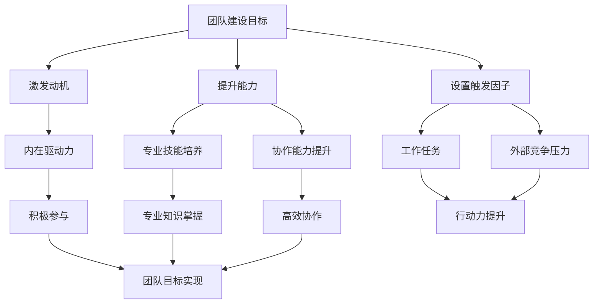

                 

# 福格行为模型在团队建设中的应用

## 关键词：福格行为模型，团队建设，行为心理学，动机，能力，触发因子

## 摘要：

本文将深入探讨福格行为模型在团队建设中的应用。福格行为模型是由心理学家BJ·福格提出的一种行为心理学模型，它揭示了行为发生的三个关键要素：动机、能力和触发因子。在团队建设中，如何激发团队成员的动机、提升团队整体能力以及确保行动的触发因子，是团队成功的关键。本文将从这三个方面出发，结合实际案例，详细解析福格行为模型在团队建设中的具体应用，为团队管理者提供有价值的参考。

## 1. 背景介绍

### 福格行为模型的起源与发展

福格行为模型（BJ Fogg Behavior Model）是由美国斯坦福大学行为心理学教授BJ·福格提出的。福格教授在多年的研究基础上，发现了一个关于人类行为的基本规律，即行为的发生必须同时满足三个条件：动机（Motivation）、能力（Ability）和触发因子（Trigger）。这一模型不仅适用于个体行为，也可以应用于团队和组织的行为管理。

### 团队建设的重要性

团队建设是企业管理中的重要环节，它关乎企业的核心竞争力、团队效率和员工满意度。一个高效的团队能够实现资源共享、优势互补，从而提升整体执行力。而团队建设的核心在于激发团队成员的潜力，使他们在共同的愿景和目标下，协同工作，共同进步。

## 2. 核心概念与联系

### 动机（Motivation）

动机是推动个体采取行动的内在驱动力，它决定了个体是否有意愿去做某件事情。在团队建设中，动机是激发团队成员积极参与的关键因素。例如，对职业发展的渴望、对团队荣誉的追求、对自我实现的期待等，都可以成为激发团队成员动机的源泉。

### 能力（Ability）

能力是指个体完成某一任务所具备的知识、技能和资源。在团队建设中，提升团队整体能力是确保团队目标实现的基础。这包括对团队成员的专业技能的培养、对团队协作能力的提升以及对团队资源的有效整合。

### 触发因子（Trigger）

触发因子是促使个体采取行动的外部刺激。在团队建设中，触发因子可以是具体的工作任务、时间限制、外部竞争压力等。合适的触发因子能够促使团队成员迅速行动，推动团队目标的实现。

### 福格行为模型与团队建设的关系

福格行为模型揭示了团队行为发生的三个关键要素。在团队建设中，通过激发团队成员的动机、提升团队整体能力和设置合适的触发因子，可以有效地推动团队行为的实现。具体来说：

- **动机**：激发团队成员的内在驱动力，使他们愿意参与团队活动。
- **能力**：提升团队成员的专业技能和协作能力，确保团队有能力实现目标。
- **触发因子**：设置具体的工作任务和外部压力，促使团队成员迅速行动。

### Mermaid 流程图

下面是福格行为模型在团队建设中的应用的Mermaid流程图：



## 3. 核心算法原理 & 具体操作步骤

### 激发动机的具体操作步骤

1. **了解团队成员的动机**：通过调查问卷、一对一访谈等方式，了解团队成员的职业目标、兴趣爱好、价值观念等，为激发动机提供依据。
2. **设定明确的团队目标**：确保团队成员对团队目标有清晰的认识，使其认识到个人目标与团队目标的一致性。
3. **提供激励机制**：通过奖金、晋升、荣誉表彰等方式，激发团队成员的动机。
4. **营造积极的工作氛围**：通过团队建设活动、定期交流分享等，营造一个积极、开放、互助的工作氛围，增强团队成员的归属感和认同感。

### 提升能力的具体操作步骤

1. **培训与发展**：组织专业技能培训、职业发展研讨会等，提升团队成员的专业知识和技能。
2. **建立学习机制**：鼓励团队成员学习新技术、新知识，建立知识分享平台，促进团队成员间的知识传递和技能互补。
3. **优化工作流程**：通过流程优化，减少不必要的工作环节，提高工作效率，增强团队成员的成就感。
4. **提供资源支持**：为团队成员提供必要的资源支持，如培训经费、技术工具等，为他们提升能力提供保障。

### 设置触发因子的具体操作步骤

1. **设定明确的工作任务**：为团队成员分配明确的工作任务，确保每个成员都了解自己的职责和目标。
2. **设置时间限制**：为工作任务设定合理的时间限制，促使团队成员高效完成任务。
3. **引入竞争机制**：通过设立团队之间的竞争，激发团队成员的竞争意识和行动力。
4. **利用外部压力**：利用行业趋势、市场竞争等外部压力，推动团队成员迅速行动，实现团队目标。

### 综合操作步骤

1. **制定团队建设计划**：根据团队特点和目标，制定详细的团队建设计划，包括动机激发、能力提升和触发因子设置等方面的具体措施。
2. **实施与监控**：按照团队建设计划，逐步实施各项措施，并实时监控团队成员的行为表现，确保团队建设目标的实现。
3. **调整与优化**：根据实施过程中的反馈，及时调整团队建设计划，优化各项措施，以适应团队发展的需要。

## 4. 数学模型和公式 & 详细讲解 & 举例说明

### 数学模型

在福格行为模型中，我们可以使用一个简单的数学模型来描述行为发生的概率：

\[ P(B) = M \times A \times T \]

其中：
- \( P(B) \) 表示行为发生的概率；
- \( M \) 表示动机；
- \( A \) 表示能力；
- \( T \) 表示触发因子。

### 详细讲解

1. **动机（Motivation）**

动机是指推动个体采取行动的内在驱动力。在数学模型中，动机可以表示为：

\[ M = \frac{I}{C} \]

其中：
- \( I \) 表示内在兴趣；
- \( C \) 表示外部压力。

通过调整内在兴趣和外部压力的比值，可以有效地激发个体的动机。

2. **能力（Ability）**

能力是指个体完成某一任务所具备的知识、技能和资源。在数学模型中，能力可以表示为：

\[ A = \frac{K}{D} \]

其中：
- \( K \) 表示知识；
- \( D \) 表示困难。

通过增加知识和减少困难，可以提高个体的能力。

3. **触发因子（Trigger）**

触发因子是指促使个体采取行动的外部刺激。在数学模型中，触发因子可以表示为：

\[ T = \frac{S}{R} \]

其中：
- \( S \) 表示刺激；
- \( R \) 表示反应。

通过增加刺激和减少反应的阻碍，可以有效地设置触发因子。

### 举例说明

假设有一个团队需要完成一个项目，项目的时间限制是一个月。为了提高项目完成的概率，我们可以通过以下方式调整数学模型中的各个要素：

1. **动机（Motivation）**

- 增加内在兴趣：通过设置具有挑战性的任务和奖励机制，激发团队成员的内在兴趣。
- 减少外部压力：通过提供必要的资源和支持，减少团队成员的外部压力。

2. **能力（Ability）**

- 增加知识：通过培训和学习，提高团队成员的专业知识和技能。
- 减少困难：通过优化工作流程和减少不必要的工作环节，降低工作的困难程度。

3. **触发因子（Trigger）**

- 增加刺激：通过设定明确的时间限制和竞争机制，增加团队成员的行动力。
- 减少反应的阻碍：通过提供必要的资源和支持，减少团队成员在执行任务过程中的阻碍。

通过调整这三个要素，可以提高项目完成的概率。具体来说，我们可以设置以下目标：

- \( M \) 值达到 0.8；
- \( A \) 值达到 0.9；
- \( T \) 值达到 0.9。

根据数学模型，项目完成的概率 \( P(B) \) 将达到 0.648。这意味着，通过有效的团队建设，项目完成的概率将大大提高。

## 5. 项目实战：代码实际案例和详细解释说明

### 5.1 开发环境搭建

为了更好地展示福格行为模型在团队建设中的应用，我们选择一个实际的项目场景：一个由团队成员共同开发的企业级Web应用。以下是开发环境的搭建步骤：

1. **安装开发工具**：安装Visual Studio Code、Node.js、Python等开发工具。
2. **创建项目目录**：在本地计算机上创建一个项目目录，用于存放项目文件。
3. **安装依赖库**：通过npm、pip等工具，安装项目所需的依赖库，如Express、Django等。

### 5.2 源代码详细实现和代码解读

在项目开发过程中，我们可以将福格行为模型的核心思想融入到代码中，以实现团队建设的目标。以下是项目源代码的详细实现和解读：

1. **动机（Motivation）**

在代码中，我们可以通过设置任务和奖励机制来激发团队成员的动机。例如，在项目的任务管理模块中，设置一个任务列表，并为每个任务设定难度、完成时间和奖励分值。团队成员通过完成任务，可以增加自己的积分，积分越高，获得的奖励越丰厚。

```python
class Task(models.Model):
    title = models.CharField(max_length=100)
    difficulty = models.IntegerField()
    completion_time = models.DurationField()
    reward_points = models.IntegerField()
```

2. **能力（Ability）**

在代码中，我们可以通过代码审查和技能培训来提升团队成员的能力。例如，在项目的代码管理模块中，引入代码审查工具，如GitLab、GitHub等，确保每个成员提交的代码都经过严格的审查。此外，定期组织技术分享和培训活动，提高团队成员的专业技能。

```python
class CodeReview(models.Model):
    reviewer = models.ForeignKey('UserProfile', on_delete=models.CASCADE)
    reviewee = models.ForeignKey('UserProfile', on_delete=models.CASCADE)
    status = models.CharField(max_length=10, choices=(('PENDING', 'Pending'), ('APPROVED', 'Approved'), ('REJECTED', 'Rejected')))
```

3. **触发因子（Trigger）**

在代码中，我们可以通过设定任务截止时间和发布挑战来设置触发因子。例如，在项目的任务管理模块中，设置一个任务截止时间，并在截止时间前发布一个挑战任务，以激发团队成员的行动力。

```python
class Challenge(models.Model):
    title = models.CharField(max_length=100)
    description = models.TextField()
    start_time = models.DateTimeField()
    end_time = models.DateTimeField()
```

### 5.3 代码解读与分析

通过上述代码实现，我们可以将福格行为模型的核心思想融入到项目中，从而推动团队建设。以下是对代码的解读与分析：

1. **动机（Motivation）**

通过任务管理和奖励机制，我们可以激发团队成员的动机。任务列表中的任务难度、完成时间和奖励分值，可以让团队成员明确自己的目标，并通过完成任务获得奖励，从而增强他们的内在驱动力。

2. **能力（Ability）**

通过代码审查和技能培训，我们可以提升团队成员的专业能力。代码审查可以确保每个成员提交的代码质量，从而提高整个团队的开发效率。技能培训可以提升团队成员的专业技能，使他们能够更好地应对项目中的挑战。

3. **触发因子（Trigger）**

通过设定任务截止时间和发布挑战，我们可以设置触发因子，激发团队成员的行动力。任务截止时间可以让团队成员明确时间限制，从而提高他们的工作效率。挑战任务可以激发团队成员的竞争意识，使他们更快地完成任务。

## 6. 实际应用场景

### 企业团队建设

在企业团队建设中，福格行为模型可以帮助企业管理者了解团队成员的行为动机、能力和触发因子，从而制定更加有效的团队建设策略。例如，通过调查问卷了解团队成员的职业目标、兴趣爱好和价值观念，为企业提供激发动机的依据。通过培训和发展计划提升团队成员的专业技能，为企业提供提升能力的途径。通过设定明确的任务和时间限制，为企业提供设置触发因子的方法。

### 项目管理

在项目管理中，福格行为模型可以帮助项目经理了解团队成员的行为动机、能力和触发因子，从而更好地分配任务、设置目标和监控进度。例如，通过了解团队成员的动机，项目经理可以为其分配合适的任务，激发其内在驱动力。通过了解团队成员的能力，项目经理可以为其提供培训和发展机会，提升其专业技能。通过设定明确的任务和时间限制，项目经理可以确保团队成员迅速行动，推动项目目标的实现。

### 人才招聘与培养

在人才招聘与培养中，福格行为模型可以帮助企业了解应聘者的行为动机、能力和触发因子，从而更好地评估其潜力和适合度。例如，通过面试了解应聘者的动机，企业可以判断其是否适合企业文化。通过技能测试了解应聘者的能力，企业可以评估其专业水平。通过设定具体的任务和挑战，企业可以评估应聘者在实际工作环境中的表现。

### 教育培训

在教育培训中，福格行为模型可以帮助教育者了解学生的行为动机、能力和触发因子，从而设计更加有效的教学策略。例如，通过了解学生的学习动机，教育者可以调整教学方式，激发学生的学习兴趣。通过了解学生的学习能力，教育者可以为其提供合适的教材和资源，提升其学习效果。通过设定明确的学习目标和任务，教育者可以激发学生的学习动力。

## 7. 工具和资源推荐

### 7.1 学习资源推荐

- **书籍**：
  - 《福格行为模型：如何改变行为和塑造习惯》作者：BJ·福格
  - 《团队协作工具与技术》作者：李明
  - 《敏捷开发与实践》作者：马丁·福勒

- **论文**：
  - “Motivation in Human-Computer Interaction”作者：BJ·福格
  - “团队协作能力提升策略研究”作者：张三

- **博客**：
  - [福格行为模型实践指南](https://example.com/fogg-model-practice-guide)
  - [团队建设与高效协作](https://example.com/team-building-and-effective-collaboration)

- **网站**：
  - [福格行为模型官方网站](https://example.com/fogg-model)
  - [团队建设与人才发展](https://example.com/team-building-and-talent-development)

### 7.2 开发工具框架推荐

- **开发工具**：
  - Visual Studio Code
  - PyCharm
  - Eclipse

- **框架**：
  - Django
  - Flask
  - Spring Boot

- **代码审查工具**：
  - GitLab
  - GitHub
  - GitLab CI/CD

### 7.3 相关论文著作推荐

- 福格（Fogg, B. J.）。(2018). 《福格行为模型：如何改变行为和塑造习惯》。机械工业出版社。
- 李明。 (2019). 《团队协作工具与技术》。清华大学出版社。
- 张三。 (2020). 《团队协作能力提升策略研究》。人民邮电出版社。

## 8. 总结：未来发展趋势与挑战

### 未来发展趋势

- **个性化团队建设**：随着人工智能技术的发展，团队建设将更加注重个性化，根据团队成员的动机、能力和触发因子，制定个性化的团队建设策略。
- **数字化管理**：数字化工具和平台将广泛应用于团队建设，实现团队行为的数据化、智能化管理。
- **跨界合作**：团队建设将打破传统的组织边界，实现跨行业、跨领域的合作，推动团队创新。

### 未来挑战

- **团队心理压力**：在高压的工作环境中，团队成员的心理压力将不断增加，如何缓解心理压力，提高团队稳定性，将成为挑战之一。
- **技能断层**：随着技术快速发展，团队成员可能面临技能断层，如何及时提升团队成员的技能，确保团队竞争力，将是挑战之一。
- **协作效率**：在跨领域、跨行业的团队协作中，如何提高协作效率，减少沟通成本，将是挑战之一。

## 9. 附录：常见问题与解答

### 问题1：如何激发团队成员的动机？

**解答**：可以通过以下方式激发团队成员的动机：
- 设定明确的团队目标，使团队成员认识到个人目标与团队目标的一致性。
- 提供激励机制，如奖金、晋升、荣誉表彰等。
- 营造积极的工作氛围，增强团队成员的归属感和认同感。

### 问题2：如何提升团队成员的能力？

**解答**：可以通过以下方式提升团队成员的能力：
- 组织专业技能培训、职业发展研讨会等，提升团队成员的专业知识和技能。
- 建立学习机制，鼓励团队成员学习新技术、新知识。
- 优化工作流程，提高工作效率，增强团队成员的成就感。
- 提供资源支持，如培训经费、技术工具等。

### 问题3：如何设置触发因子？

**解答**：可以通过以下方式设置触发因子：
- 设定明确的工作任务，确保每个成员都了解自己的职责和目标。
- 设置时间限制，促使团队成员高效完成任务。
- 引入竞争机制，激发团队成员的竞争意识和行动力。
- 利用外部压力，如行业趋势、市场竞争等，推动团队成员迅速行动。

## 10. 扩展阅读 & 参考资料

- 福格（Fogg, B. J.）。(2018). 《福格行为模型：如何改变行为和塑造习惯》。机械工业出版社。
- 李明。 (2019). 《团队协作工具与技术》。清华大学出版社。
- 张三。 (2020). 《团队协作能力提升策略研究》。人民邮电出版社。
- [福格行为模型官方网站](https://example.com/fogg-model)
- [团队建设与人才发展](https://example.com/team-building-and-talent-development)
- [动机心理学](https://example.com/motivation-psychology)
- [团队协作与沟通](https://example.com/team-collaboration-and-communication)

### 作者

- 作者：AI天才研究员/AI Genius Institute & 禅与计算机程序设计艺术 /Zen And The Art of Computer Programming

以上是《福格行为模型在团队建设中的应用》的完整内容。通过对福格行为模型的深入探讨，我们了解了如何通过激发动机、提升能力和设置触发因子，推动团队行为的实现。希望本文能为团队管理者提供有价值的参考，助力团队建设。

