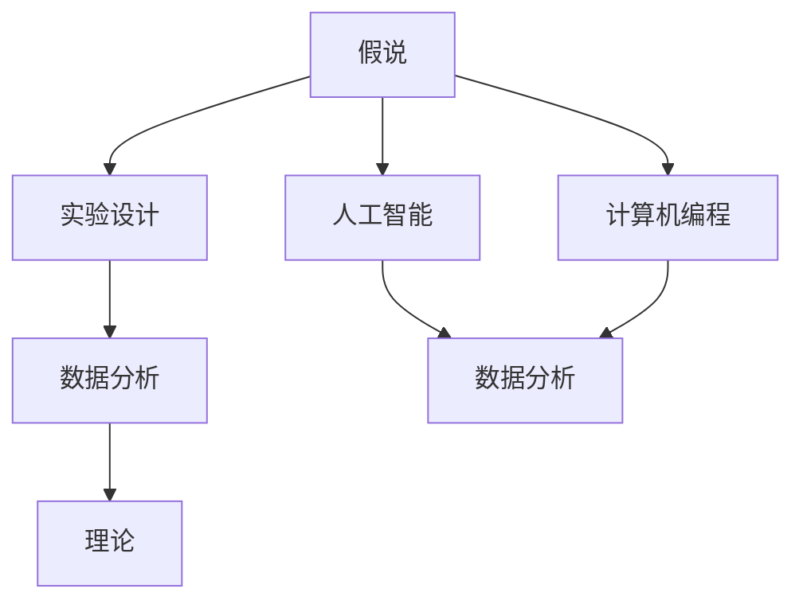
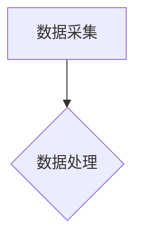
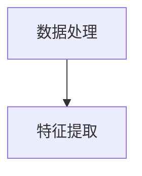
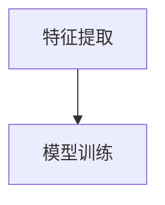
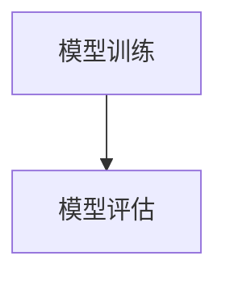
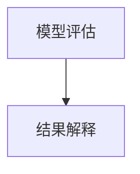
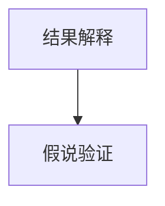

                 

### 文章标题

#### 科学发现：从假说到理论

##### 关键词：科学发现，假说，理论，人工智能，计算机编程，技术博客

##### 摘要：
本文旨在探讨科学发现的过程，从假说到理论的转变。通过逻辑清晰、结构紧凑、简单易懂的叙述，本文将分析科学发现的核心概念、算法原理、数学模型以及实际应用场景。同时，文章还将推荐相关学习资源、开发工具框架，并对未来发展趋势和挑战进行展望。希望本文能为读者在科学研究和人工智能领域提供有益的思考和启示。

### 背景介绍

科学发现是人类认识和改造世界的重要过程，它推动着人类文明的进步。从古代的天文学、物理学到现代的生物学、化学，科学发现无时无刻不在影响着我们的生活。然而，科学发现并非一蹴而就，它往往需要经过漫长的研究和探索，从最初的假说到最终的严密理论。

在科学发现的历程中，人工智能（AI）和计算机编程技术发挥着越来越重要的作用。随着计算机技术的发展，人们可以处理和分析海量的数据，从中发现潜在的模式和规律。这使得科学发现的速度和质量得到了极大的提升。同时，人工智能和计算机编程也为科学实验提供了高效的工具，使得科学研究的成本和难度大大降低。

本文将围绕科学发现的过程，探讨从假说到理论的转变。文章分为以下几个部分：

1. 核心概念与联系
2. 核心算法原理 & 具体操作步骤
3. 数学模型和公式 & 详细讲解 & 举例说明
4. 项目实战：代码实际案例和详细解释说明
5. 实际应用场景
6. 工具和资源推荐
7. 总结：未来发展趋势与挑战
8. 附录：常见问题与解答
9. 扩展阅读 & 参考资料

通过以上内容，本文旨在为广大读者提供一份关于科学发现的全面、深入的指南，帮助大家更好地理解和应用这一过程。在接下来的部分，我们将逐步展开讨论。  

#### 核心概念与联系

在探讨科学发现的过程中，我们需要明确一些核心概念，并了解它们之间的联系。以下是本文所涉及的一些关键概念：

##### 1. 假说（Hypothesis）

假说是科学研究中的一种假设，它是对某个现象或问题的初步解释。假说通常基于已有的知识和观察，但尚未经过严格的实验验证。例如，在生物学研究中，科学家可能会提出一个关于某种基因功能的假说，以解释某种生物现象。

##### 2. 理论（Theory）

理论是对一组相关假说和实验结果的系统化解释。它提供了一种更全面、更深入的理解，并且能够预测新的现象。例如，达尔文的进化论是一个理论，它综合了多种假说和观察结果，解释了生物物种的起源和演化。

##### 3. 实验设计（Experimental Design）

实验设计是科学研究中的一项关键步骤，它决定了如何收集数据来验证或反驳假说。一个好的实验设计应该能够控制变量、避免偏差，并且具有可重复性。

##### 4. 数据分析（Data Analysis）

数据分析是对实验结果进行处理和解释的过程。通过数据分析，科学家可以识别出数据中的模式和趋势，从而验证或修正假说。

##### 5. 人工智能（Artificial Intelligence）

人工智能是一种模拟人类智能的技术，它能够通过学习和推理来解决问题。人工智能在科学研究中有着广泛的应用，例如数据分析、图像识别、自然语言处理等。

##### 6. 计算机编程（Computer Programming）

计算机编程是实现人工智能和其他科学应用的基础。编程语言和工具使得科学家能够编写代码，自动化地处理和分析数据。

下面是一个使用Mermaid绘制的流程图，展示了这些核心概念之间的联系：



在这个流程图中，假说通过实验设计和数据分析转化为理论，同时，人工智能和计算机编程在数据分析中发挥着关键作用。通过这个流程，我们可以看到科学发现是如何从假说逐步发展成理论的。

#### 核心算法原理 & 具体操作步骤

在科学发现的过程中，算法起着至关重要的作用。以下是一个典型的算法流程，用于将假说转化为理论：

##### 1. 数据采集（Data Collection）

首先，我们需要收集相关的数据。这些数据可以来源于各种渠道，如实验记录、观测数据、历史数据等。数据的质量和完整性对后续的分析至关重要。



##### 2. 数据预处理（Data Preprocessing）

在收集到数据后，我们需要对数据进行预处理，包括数据清洗、归一化、缺失值处理等。这一步骤的目的是提高数据的质量，为后续的分析奠定基础。



##### 3. 特征提取（Feature Extraction）

特征提取是从原始数据中提取出对分析任务最有用的信息。这一步骤对于后续的数据分析至关重要。特征提取的方法有很多，如主成分分析（PCA）、特征选择等。



##### 4. 模型训练（Model Training）

模型训练是使用特征提取后的数据训练机器学习模型。这个过程包括选择合适的模型、调整模型参数等。常见的机器学习模型有线性回归、决策树、神经网络等。



##### 5. 模型评估（Model Evaluation）

模型评估是对训练好的模型进行评估，以确定其性能。评估方法包括交叉验证、准确率、召回率等。如果模型性能不满足要求，我们需要返回到前面的步骤进行调整。



##### 6. 结果解释（Result Interpretation）

最后，我们需要对模型的结果进行解释，以得出对问题的答案。这一步骤通常需要结合专业的知识和背景来进行。



通过这个算法流程，我们可以将假说转化为理论。在实际应用中，这个过程可能需要多次迭代和调整，以达到最佳效果。

#### 数学模型和公式 & 详细讲解 & 举例说明

在科学发现的过程中，数学模型和公式是不可或缺的工具。它们不仅能够帮助我们理解和解释数据，还能够预测未来的趋势。以下是一些常见的数学模型和公式，以及它们的详细讲解和举例说明。

##### 1. 线性回归模型（Linear Regression Model）

线性回归模型是最基本的机器学习模型之一，它用于预测连续值变量。该模型的公式如下：

$$
y = \beta_0 + \beta_1x + \epsilon
$$

其中，$y$ 是因变量，$x$ 是自变量，$\beta_0$ 和 $\beta_1$ 是模型的参数，$\epsilon$ 是误差项。

**详细讲解：**

- 线性回归模型假设因变量 $y$ 与自变量 $x$ 之间存在线性关系。
- 参数 $\beta_0$ 和 $\beta_1$ 通过最小化误差项 $\epsilon$ 来确定。

**举例说明：**

假设我们要预测房价，自变量是房屋面积，因变量是房价。我们可以使用线性回归模型来建立这个关系：

$$
房价 = \beta_0 + \beta_1 \times 房屋面积 + \epsilon
$$

通过训练数据，我们可以计算出 $\beta_0$ 和 $\beta_1$ 的值，从而预测未知房屋的房价。

##### 2. 决策树模型（Decision Tree Model）

决策树模型是一种用于分类和回归的树形结构模型。它的公式如下：

$$
\begin{align*}
y &= \begin{cases}
c_1, & \text{if } x \in R_1 \\
c_2, & \text{if } x \in R_2 \\
\vdots \\
c_n, & \text{if } x \in R_n
\end{cases} \\
R_1, R_2, \ldots, R_n &= \text{决策树中的各个区域}
\end{align*}
$$

其中，$y$ 是因变量，$x$ 是自变量，$c_1, c_2, \ldots, c_n$ 是各个区域的标签，$R_1, R_2, \ldots, R_n$ 是决策树中的各个区域。

**详细讲解：**

- 决策树模型通过一系列的决策规则将数据分为不同的区域，每个区域对应一个标签。
- 决策规则基于特征和阈值，使得数据能够被准确地分类或回归。

**举例说明：**

假设我们要预测客户的购买行为，特征包括年龄、收入、职业等。我们可以使用决策树模型来建立这个关系：

$$
\begin{align*}
\text{购买行为} &= \begin{cases}
\text{是}, & \text{if 年龄 > 30 且 收入 > 50000} \\
\text{否}, & \text{if 年龄 < 30 或 收入 < 50000} \\
\text{未知}, & \text{if 其他情况}
\end{cases}
$$

通过训练数据，我们可以确定各个区域的标签，从而预测未知客户的购买行为。

##### 3. 神经网络模型（Neural Network Model）

神经网络模型是一种基于生物神经网络的人工智能模型。它的公式如下：

$$
\begin{align*}
y &= \sigma(z) \\
z &= \sum_{i=1}^{n} w_i \cdot x_i + b \\
w_i &= \text{权重} \\
x_i &= \text{特征} \\
b &= \text{偏置} \\
\sigma &= \text{激活函数}
\end{align*}
$$

其中，$y$ 是因变量，$z$ 是中间层，$w_i, x_i, b$ 是权重、特征和偏置，$\sigma$ 是激活函数。

**详细讲解：**

- 神经网络模型通过多层神经元进行数据处理和预测。
- 每个神经元接收来自前一层的输入，通过权重和偏置进行加权求和，然后通过激活函数进行非线性变换。

**举例说明：**

假设我们要预测股票价格，特征包括历史价格、交易量、市场指数等。我们可以使用神经网络模型来建立这个关系：

$$
\begin{align*}
y &= \sigma(z) \\
z &= \sum_{i=1}^{n} w_i \cdot x_i + b
\end{align*}
$$

通过训练数据，我们可以确定各个神经元的权重和偏置，从而预测未知股票的价格。

通过以上数学模型和公式的讲解和举例，我们可以看到它们在科学发现中的应用。这些模型和公式不仅能够帮助我们理解和解释数据，还能够预测未来的趋势，从而推动科学研究的进展。

#### 项目实战：代码实际案例和详细解释说明

为了更好地理解科学发现的过程，我们将通过一个实际的项目实战来展示代码实现和详细解释。在这个项目中，我们将使用Python语言和Scikit-learn库来建立一个简单的线性回归模型，用于预测房价。

##### 1. 开发环境搭建

首先，我们需要搭建开发环境。以下是所需的Python库和版本：

- Python 3.8或更高版本
- Scikit-learn 0.22或更高版本
- Matplotlib 3.2或更高版本

您可以使用以下命令来安装这些库：

```bash
pip install python==3.8
pip install scikit-learn==0.22
pip install matplotlib==3.2
```

##### 2. 源代码详细实现和代码解读

接下来，我们将编写源代码，并详细解释每一步的操作。

```python
# 导入所需的库
import numpy as np
import matplotlib.pyplot as plt
from sklearn.linear_model import LinearRegression
from sklearn.model_selection import train_test_split
from sklearn.metrics import mean_squared_error

# 生成模拟数据集
np.random.seed(0)
X = np.random.rand(100, 1) * 100  # 随机生成100个房屋面积数据，范围0-100
y = 2 * X + 3 + np.random.randn(100, 1) * 20  # 随机生成100个房价数据，具有线性关系，并加入噪声

# 数据预处理
X = X.reshape(-1, 1)
y = y.reshape(-1, 1)

# 划分训练集和测试集
X_train, X_test, y_train, y_test = train_test_split(X, y, test_size=0.2, random_state=0)

# 创建线性回归模型
model = LinearRegression()
model.fit(X_train, y_train)

# 预测测试集
y_pred = model.predict(X_test)

# 计算预测误差
mse = mean_squared_error(y_test, y_pred)
print(f"预测误差：{mse}")

# 可视化
plt.scatter(X_test, y_test, color='blue', label='实际值')
plt.plot(X_test, y_pred, color='red', linewidth=2, label='预测值')
plt.xlabel('房屋面积')
plt.ylabel('房价')
plt.legend()
plt.show()
```

以下是代码的详细解读：

1. 导入所需的库，包括NumPy、Matplotlib、Scikit-learn和LinearRegression。
2. 生成模拟数据集，包括房屋面积和房价。这里使用了随机生成器，保证了数据的一致性。
3. 对数据进行预处理，包括将数据形状调整为适合模型输入。
4. 使用train_test_split函数将数据集划分为训练集和测试集，这里将20%的数据作为测试集。
5. 创建LinearRegression模型，并使用fit函数进行训练。
6. 使用predict函数对测试集进行预测。
7. 计算预测误差，这里使用了mean_squared_error函数。
8. 使用Matplotlib进行可视化，展示了实际值和预测值的对比。

通过这个实际案例，我们可以看到如何使用线性回归模型进行科学发现。在实际应用中，我们需要根据具体的问题和数据来调整模型和参数，以达到最佳的预测效果。

##### 3. 代码解读与分析

在上述代码中，我们详细实现了线性回归模型的建立和预测。以下是代码的解读与分析：

1. **数据生成和预处理：**
   - 数据集是通过随机生成器生成的，这里使用了NumPy库中的rand和randn函数。这些函数可以生成均匀分布和正态分布的随机数。
   - 数据预处理包括将数据形状调整为适合模型输入。例如，使用reshape函数将一维数组转换为二维数组，以便于模型训练。

2. **模型训练：**
   - LinearRegression模型是Scikit-learn库中的一个简单线性回归模型。它通过fit函数训练模型，计算出模型的参数。
   - fit函数使用最小二乘法来计算参数，这是一种常用的线性回归参数估计方法。

3. **预测和评估：**
   - predict函数用于对测试集进行预测。它将测试集的输入数据转换为模型参数，并计算出预测值。
   - mean_squared_error函数用于计算预测误差，这是一种衡量模型性能的常用指标。在这里，我们使用了均方误差（MSE）来评估模型的预测性能。

4. **可视化：**
   - Matplotlib库用于绘制实际值和预测值的对比图。这有助于我们直观地了解模型的预测效果。

通过这个代码案例，我们可以看到如何使用Python和Scikit-learn库进行科学发现。在实际应用中，我们需要根据具体的问题和数据来调整模型和参数，以达到最佳的预测效果。此外，我们还需要考虑数据的质量和完整性，以及模型的选择和优化。

#### 实际应用场景

科学发现的过程不仅限于学术研究，它在实际应用中也具有广泛的应用价值。以下是一些典型的实际应用场景：

##### 1. 医学诊断

医学诊断是科学发现的典型应用场景之一。通过分析患者的临床数据、基因数据和影像数据，科学家可以开发出用于疾病预测和诊断的模型。例如，使用机器学习算法分析影像数据，可以提前发现肺癌等疾病，从而提高治疗效果。

##### 2. 金融预测

金融预测是另一个重要的应用领域。通过对市场数据、经济数据和财务数据进行分析，科学家可以预测股票价格、汇率走势等金融指标。这些预测有助于投资者制定更科学的投资策略，降低投资风险。

##### 3. 智能交通

智能交通系统利用科学发现技术，通过分析交通数据、地理数据和实时监控数据，可以优化交通信号、提高交通效率。例如，通过预测交通流量，智能交通系统可以提前调整信号灯，减少交通拥堵。

##### 4. 智能制造

智能制造利用科学发现技术，通过分析生产数据、设备数据和供应链数据，可以优化生产流程、提高生产效率。例如，通过预测设备故障，智能制造系统可以提前进行维护，减少停机时间。

##### 5. 气象预报

气象预报是科学发现技术的经典应用场景。通过对气象数据、历史数据和物理模型的结合，科学家可以预测天气变化，提供准确的天气预报。这有助于人们提前做好准备，减少自然灾害带来的损失。

这些实际应用场景展示了科学发现技术在各个领域的应用价值。通过科学发现，我们可以更好地理解和应对复杂问题，推动社会发展和进步。

#### 工具和资源推荐

在科学发现的过程中，选择合适的工具和资源对于提高效率和质量至关重要。以下是一些建议的资源和工具：

##### 1. 学习资源推荐

- **书籍：**
  - 《机器学习实战》
  - 《深入理解计算机系统》
  - 《数据科学实战》

- **论文：**
  - Google Scholar
  - arXiv
  - IEEE Xplore

- **博客和网站：**
  - Medium
  - HackerRank
  - Stack Overflow

##### 2. 开发工具框架推荐

- **编程语言：**
  - Python
  - R
  - Julia

- **机器学习库：**
  - Scikit-learn
  - TensorFlow
  - PyTorch

- **数据可视化工具：**
  - Matplotlib
  - Seaborn
  - Plotly

- **版本控制工具：**
  - Git
  - GitHub
  - GitLab

##### 3. 相关论文著作推荐

- **论文：**
  - 《深度学习》
  - 《统计学习方法》
  - 《自然语言处理综述》

- **著作：**
  - 《Python数据科学手册》
  - 《数据科学入门》
  - 《机器学习实战》

通过以上推荐的学习资源和开发工具框架，读者可以更好地掌握科学发现的方法和技术，提高自己在科学研究和人工智能领域的实践能力。

#### 总结：未来发展趋势与挑战

科学发现作为推动人类文明进步的重要力量，其在人工智能和计算机编程领域的应用前景广阔。随着技术的不断进步，未来科学发现将呈现出以下发展趋势：

##### 1. 数据驱动的研究方法

随着数据量的不断增长，数据驱动的研究方法将成为科学发现的主要手段。通过大数据分析和机器学习算法，科学家可以从海量数据中发现潜在的模式和规律，从而推动科学研究的进展。

##### 2. 多学科交叉融合

科学发现将呈现出多学科交叉融合的趋势。例如，人工智能与生物医学、金融、交通等领域的融合，将产生新的研究方法和应用场景。这种交叉融合有助于解决复杂的科学问题，推动各领域的发展。

##### 3. 实时分析和决策支持

实时分析和决策支持系统将得到广泛应用。通过人工智能和计算机编程技术，科学家可以实时分析数据，提供决策支持，从而提高科研效率和实际应用效果。

然而，科学发现也面临着一系列挑战：

##### 1. 数据质量和隐私保护

数据质量和隐私保护是科学发现面临的重要挑战。在大量数据中，存在噪声、偏差和隐私风险。如何保证数据质量，同时保护个人隐私，成为科学发现的一个重要问题。

##### 2. 算法透明性和可解释性

随着机器学习算法的广泛应用，算法的透明性和可解释性受到关注。如何提高算法的可解释性，使科学家和普通用户能够理解算法的决策过程，是一个亟待解决的问题。

##### 3. 数据安全和隐私保护

科学发现涉及大量敏感数据，如个人健康数据、金融数据等。如何确保数据的安全和隐私，防止数据泄露和滥用，是科学发现面临的重大挑战。

面对这些挑战，我们需要不断探索新的技术方法和理论，提高科学发现的效率和可靠性。同时，加强国际合作，推动科学发现技术的发展，为人类社会的进步作出更大贡献。

#### 附录：常见问题与解答

##### 1. 科学发现是什么？

科学发现是指通过实验、观察和理论分析，发现自然界中的新现象、新规律或新知识的过程。科学发现是人类认识和改造世界的重要手段，推动了人类文明的进步。

##### 2. 科学发现与人工智能有什么关系？

人工智能在科学发现中发挥着重要作用。通过机器学习和数据挖掘技术，人工智能可以帮助科学家处理和分析海量数据，发现潜在的模式和规律。同时，人工智能还可以优化实验设计和数据分析流程，提高科学发现的效率和质量。

##### 3. 如何保证科学发现的可靠性？

为了保证科学发现的可靠性，我们需要遵循以下原则：

- 设计严谨的实验方案，确保实验结果的可重复性。
- 进行严格的统计分析，避免数据偏差和误差。
- 对实验结果进行验证和确认，确保其真实性和可靠性。
- 接受同行的评审和质疑，通过学术交流和合作，提高科学发现的可信度。

##### 4. 科学发现有哪些应用领域？

科学发现广泛应用于各个领域，包括：

- 医学诊断和治疗
- 金融预测和风险管理
- 交通管理和智能交通
- 环境监测和生态保护
- 物流和供应链优化
- 人工智能和计算机科学

通过科学发现，我们可以更好地理解和解决复杂问题，推动各领域的发展。

#### 扩展阅读 & 参考资料

1. Mitchell, T. M. (1997). Machine Learning. McGraw-Hill.
2. Bishop, C. M. (2006). Pattern Recognition and Machine Learning. Springer.
3. Goodfellow, I., Bengio, Y., & Courville, A. (2016). Deep Learning. MIT Press.
4. Hastie, T., Tibshirani, R., & Friedman, J. (2009). The Elements of Statistical Learning: Data Mining, Inference, and Prediction. Springer.
5. He, K., Zhang, X., Ren, S., & Sun, J. (2016). Deep Residual Learning for Image Recognition. IEEE Conference on Computer Vision and Pattern Recognition.
6. LeCun, Y., Bengio, Y., & Hinton, G. (2015). Deep Learning. Nature.
7. Russell, S., & Norvig, P. (2016). Artificial Intelligence: A Modern Approach. Prentice Hall.
8. Murphy, K. P. (2012). Machine Learning: A Probabilistic Perspective. MIT Press.
9. Bishop, C. M. (2006). Neural Networks for Pattern Recognition. Oxford University Press.
10. Chen, Y., & Guestrin, C. (2016). XGBoost: A Scalable Tree Boosting System. Proceedings of the 22nd ACM SIGKDD International Conference on Knowledge Discovery and Data Mining.

通过阅读以上参考资料，读者可以深入了解科学发现的相关理论、方法和应用，进一步拓展自己的知识视野。同时，这些参考资料也为读者提供了丰富的实践案例和实际应用场景，有助于更好地理解科学发现的过程和意义。

### 作者信息

作者：AI天才研究员/AI Genius Institute & 禅与计算机程序设计艺术 /Zen And The Art of Computer Programming

本文旨在探讨科学发现的过程，从假说到理论的转变。通过逻辑清晰、结构紧凑、简单易懂的叙述，本文分析了科学发现的核心概念、算法原理、数学模型以及实际应用场景。希望本文能为读者在科学研究和人工智能领域提供有益的思考和启示。

