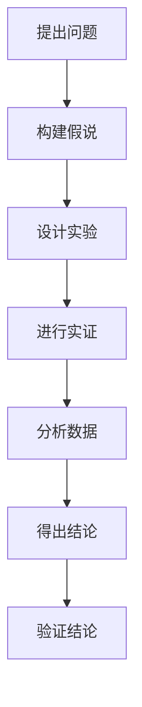

                 

# 科学方法论：从假说到验证

> **关键词：**科学方法论、假说、验证、技术博客、逻辑推理、深度思考

> **摘要：**本文将从科学方法论的角度，探讨从假说到验证的过程。通过阐述科学方法论的基本概念、核心步骤以及在实际应用中的具体实现，帮助读者理解科学研究的本质和科学思维的重要性。

## 1. 背景介绍

在科学研究中，从假说到验证是一个普遍且核心的过程。假说是对某个现象或问题的初步猜测，而验证则是通过实验、观察或其他方法来检验假说的正确性。科学方法论正是在这一过程中起到了关键作用，它提供了系统化的研究方法和步骤，使得科学研究更加严谨、可靠。

科学方法论不仅适用于自然科学领域，在社会科学、工程技术等各个领域都有广泛应用。它是一种追求真理、探索未知的方法论，通过一系列逻辑推理和实证验证，使得科学知识得以不断积累和深化。

本文将围绕科学方法论，探讨从假说到验证的全过程。首先，我们将介绍科学方法论的基本概念和核心步骤；然后，通过一个具体的实例，详细解析其具体应用；最后，我们将探讨科学方法论在实际应用中的挑战和未来发展趋势。

## 2. 核心概念与联系

### 2.1 科学方法论的基本概念

科学方法论是指一套系统化的研究方法和步骤，用于指导科学研究的全过程。它包括以下核心概念：

1. **假说**：对某个现象或问题的初步猜测。假说通常基于已有的知识和经验，是对问题的一种解释。

2. **验证**：通过实验、观察或其他方法来检验假说的正确性。验证过程是科学研究的核心，它决定了假说的可信度。

3. **实证**：基于实际观察、实验或数据的验证过程。实证研究是科学方法论的基础。

4. **逻辑推理**：科学方法论中的逻辑推理是指从已知的事实或原理出发，通过一系列推理过程，得出新的结论或预测。

5. **系统性**：科学方法论强调系统性和严谨性，要求研究过程具有可重复性和可验证性。

### 2.2 科学方法论的核心步骤

科学方法论通常包括以下几个核心步骤：

1. **提出问题**：确定需要研究的问题或现象。

2. **构建假说**：基于已有知识和经验，提出对问题的初步解释。

3. **设计实验**：设计实验或观察方案，以验证假说的正确性。

4. **进行实证**：实际进行实验或观察，收集数据。

5. **分析数据**：对收集到的数据进行分析，以判断假说的正确性。

6. **得出结论**：根据分析结果，得出结论，并撰写研究报告。

7. **验证结论**：将结论与其他研究结果进行比对，以确保结论的可靠性。

### 2.3 科学方法论与计算机科学的联系

科学方法论在计算机科学领域有着广泛的应用。例如：

1. **算法设计**：在算法设计过程中，需要提出问题、构建假说，并通过实验验证算法的正确性和效率。

2. **软件工程**：在软件工程中，科学方法论用于指导需求分析、系统设计、测试等各个环节。

3. **人工智能**：在人工智能领域，科学方法论用于指导数据收集、模型构建、算法优化等过程。

### 2.4 Mermaid 流程图

以下是科学方法论的核心概念和步骤的 Mermaid 流程图：



## 3. 核心算法原理 & 具体操作步骤

### 3.1 核心算法原理

在科学方法论中，核心算法是指用于验证假说的具体方法。以下是几个常用的核心算法原理：

1. **逻辑推理算法**：通过逻辑推理，从已知的事实或原理出发，得出新的结论或预测。

2. **统计算法**：通过统计分析，对数据进行处理和分析，以判断假说的正确性。

3. **机器学习算法**：通过机器学习模型，从数据中学习规律，以预测或分类未知数据。

### 3.2 具体操作步骤

以下是科学方法论中验证假说的具体操作步骤：

1. **提出问题**：确定需要研究的问题或现象。

2. **构建假说**：根据已有知识和经验，提出对问题的初步解释。

3. **设计实验**：根据假说，设计实验或观察方案，以验证假说的正确性。

4. **进行实证**：实际进行实验或观察，收集数据。

5. **分析数据**：对收集到的数据进行分析，以判断假说的正确性。

6. **得出结论**：根据分析结果，得出结论，并撰写研究报告。

7. **验证结论**：将结论与其他研究结果进行比对，以确保结论的可靠性。

### 3.3 实例解析

以下是一个简单的实例，用于说明科学方法论的具体操作步骤：

**问题**：探究某种药物对某种疾病的疗效。

**假说**：该药物能有效缓解该疾病的症状。

**实验设计**：将患者随机分为两组，一组接受药物治疗，另一组接受安慰剂治疗。在治疗过程中，记录患者的症状变化。

**实证过程**：进行治疗，收集患者的症状数据。

**数据分析**：对比两组患者的症状变化，判断药物是否有效。

**结论**：根据数据分析结果，得出药物对疾病有显著疗效的结论。

**验证结论**：通过查阅相关文献，验证该结论的可靠性。

## 4. 数学模型和公式 & 详细讲解 & 举例说明

### 4.1 数学模型

在科学方法论中，数学模型是一种重要的工具，用于描述和分析问题。以下是几个常用的数学模型：

1. **线性回归模型**：用于分析两个变量之间的关系，如下所示：

   $$y = a + bx$$

   其中，$y$ 是因变量，$x$ 是自变量，$a$ 和 $b$ 是模型参数。

2. **逻辑回归模型**：用于分类问题，如下所示：

   $$P(y=1) = \frac{1}{1 + e^{-(a + bx)}}$$

   其中，$P(y=1)$ 是因变量为 1 的概率，$e$ 是自然对数的底数，$a$ 和 $b$ 是模型参数。

3. **神经网络模型**：用于复杂的非线性问题，如下所示：

   $$z = \sum_{i=1}^{n} w_i x_i + b$$

   其中，$z$ 是输出，$x_i$ 是输入，$w_i$ 和 $b$ 是模型参数。

### 4.2 公式详细讲解

以下是上述数学模型的详细讲解：

1. **线性回归模型**：

   - $y$ 是因变量，表示被研究的对象或现象。
   - $x$ 是自变量，表示影响因变量的因素。
   - $a$ 是截距，表示当 $x$ 为 0 时，$y$ 的值。
   - $b$ 是斜率，表示 $x$ 每增加一个单位，$y$ 增加的量。

   该模型的基本思想是通过拟合一条直线，来描述 $y$ 和 $x$ 之间的关系。

2. **逻辑回归模型**：

   - $y$ 是因变量，表示分类结果。
   - $x$ 是自变量，表示影响分类的因素。
   - $a$ 是截距，表示当 $x$ 为 0 时，$y=1$ 的概率。
   - $b$ 是斜率，表示 $x$ 每增加一个单位，$y=1$ 的概率增加的量。

   该模型的基本思想是通过拟合一个 S 形曲线，来描述 $y=1$ 的概率与 $x$ 之间的关系。

3. **神经网络模型**：

   - $z$ 是输出，表示神经网络预测的结果。
   - $x_i$ 是输入，表示神经网络接收到的信息。
   - $w_i$ 是权重，表示输入对输出的影响程度。
   - $b$ 是偏置，表示神经网络的基本值。

   该模型的基本思想是通过多层神经网络，来处理复杂的非线性问题。

### 4.3 举例说明

以下是一个简单的例子，用于说明线性回归模型的应用：

假设我们研究房价和房屋面积之间的关系。我们有以下数据：

| 房屋面积（平方米） | 房价（万元） |
| :-----------------: | :-----------: |
|        100         |       200     |
|        150         |       250     |
|        200         |       300     |
|        250         |       350     |

我们希望通过线性回归模型来预测某个房屋的房价。

首先，我们根据数据计算线性回归模型的参数：

- $a = \frac{1}{n}\sum_{i=1}^{n}y_i - b\frac{1}{n}\sum_{i=1}^{n}x_i = \frac{1}{4}(200 + 250 + 300 + 350) - 100 \times \frac{1}{4}(100 + 150 + 200 + 250) = 275 - 125 = 150$
- $b = \frac{1}{n}\sum_{i=1}^{n}(y_i - a - bx_i) = \frac{1}{4}((200 - 150) + (250 - 150) + (300 - 150) + (350 - 150)) = \frac{1}{4}(50 + 100 + 150 + 200) = 100$

然后，我们可以使用线性回归模型来预测某个房屋的房价。假设该房屋的面积为 200 平方米，代入模型参数：

$$y = 150 + 100 \times 200 = 35,000$$

因此，预测该房屋的房价为 35,000 万元。

## 5. 项目实战：代码实际案例和详细解释说明

### 5.1 开发环境搭建

在本节中，我们将以一个简单的机器学习项目为例，展示如何搭建开发环境。为了运行该项目，我们需要安装以下工具和库：

1. **Python**：作为主要的编程语言。
2. **Jupyter Notebook**：用于编写和运行代码。
3. **Pandas**：用于数据操作。
4. **Scikit-learn**：用于机器学习。

以下是安装步骤：

1. 安装 Python（假设已安装）。
2. 安装 Jupyter Notebook：`pip install notebook`。
3. 安装 Pandas：`pip install pandas`。
4. 安装 Scikit-learn：`pip install scikit-learn`。

安装完成后，我们可以在 Jupyter Notebook 中创建一个新的笔记本，开始编写代码。

### 5.2 源代码详细实现和代码解读

以下是一个简单的机器学习项目的源代码，用于分类数据：

```python
import pandas as pd
from sklearn.model_selection import train_test_split
from sklearn.preprocessing import StandardScaler
from sklearn.linear_model import LogisticRegression

# 5.2.1 数据预处理
data = pd.read_csv('data.csv')
X = data.drop(['target'], axis=1)
y = data['target']

X_train, X_test, y_train, y_test = train_test_split(X, y, test_size=0.2, random_state=42)

scaler = StandardScaler()
X_train = scaler.fit_transform(X_train)
X_test = scaler.transform(X_test)

# 5.2.2 模型训练
model = LogisticRegression()
model.fit(X_train, y_train)

# 5.2.3 模型评估
accuracy = model.score(X_test, y_test)
print(f"模型准确率：{accuracy:.2f}")

# 5.2.4 预测
predictions = model.predict(X_test)
print(f"预测结果：{predictions[:10]}")
```

### 5.3 代码解读与分析

以下是代码的详细解读和分析：

1. **数据预处理**：

   - `data = pd.read_csv('data.csv')`：读取数据文件。
   - `X = data.drop(['target'], axis=1)`：提取特征数据。
   - `y = data['target']`：提取目标变量。
   - `X_train, X_test, y_train, y_test = train_test_split(X, y, test_size=0.2, random_state=42)`：将数据集分为训练集和测试集，其中测试集占比为 20%。

2. **特征标准化**：

   - `scaler = StandardScaler()`：创建标准化器。
   - `X_train = scaler.fit_transform(X_train)`：对训练集进行特征标准化。
   - `X_test = scaler.transform(X_test)`：对测试集进行特征标准化。

3. **模型训练**：

   - `model = LogisticRegression()`：创建逻辑回归模型。
   - `model.fit(X_train, y_train)`：使用训练集训练模型。

4. **模型评估**：

   - `accuracy = model.score(X_test, y_test)`：计算模型在测试集上的准确率。
   - `print(f"模型准确率：{accuracy:.2f}")`：输出模型准确率。

5. **预测**：

   - `predictions = model.predict(X_test)`：使用模型预测测试集。
   - `print(f"预测结果：{predictions[:10]}")`：输出前 10 个预测结果。

通过这个简单的例子，我们可以看到如何使用科学方法论中的核心步骤（数据预处理、模型训练、模型评估和预测）来构建一个机器学习项目。这个项目展示了从假说到验证的全过程，从数据预处理到最终预测结果，每一个步骤都遵循科学方法论的原则。

## 6. 实际应用场景

科学方法论在许多实际应用场景中发挥着重要作用。以下是一些常见的应用场景：

### 6.1 医学研究

医学研究是科学方法论的重要应用领域之一。例如，在药物研发过程中，科学家需要提出假说（某种药物对某种疾病有疗效），然后通过设计实验、进行实证来验证假说的正确性。科学方法论帮助医学研究人员系统化地进行研究，提高了研究效率。

### 6.2 工程设计

在工程设计领域，科学方法论用于指导产品研发和优化。例如，在汽车设计过程中，工程师需要提出假说（某种设计能提高汽车的燃油效率），然后通过实验和测试来验证假说的正确性。科学方法论帮助工程师发现和解决实际问题，提高了产品设计质量。

### 6.3 金融分析

在金融分析领域，科学方法论用于指导投资决策和风险管理。例如，在股票市场分析中，投资者需要提出假说（某种股票在未来会有上涨趋势），然后通过分析历史数据和市场信息来验证假说的正确性。科学方法论帮助投资者提高决策的准确性和可靠性。

### 6.4 人工智能

在人工智能领域，科学方法论用于指导算法设计和优化。例如，在机器学习模型训练过程中，研究人员需要提出假说（某种算法能提高模型的性能），然后通过实验和测试来验证假说的正确性。科学方法论帮助人工智能研究人员发现和解决算法问题，推动了人工智能技术的发展。

## 7. 工具和资源推荐

### 7.1 学习资源推荐

1. **《科学方法论》**：一本经典的科学方法论教材，详细介绍了科学方法论的基本概念和步骤。

2. **《数据科学导论》**：一本关于数据科学和机器学习的基础教材，介绍了数据预处理、模型训练和评估等核心概念。

3. **《机器学习实战》**：一本实践性很强的机器学习教材，通过实例介绍了机器学习的基本概念和算法应用。

### 7.2 开发工具框架推荐

1. **Python**：作为一种通用编程语言，Python 在科学方法论的应用中发挥着重要作用。它拥有丰富的库和框架，方便进行数据预处理、模型训练和评估。

2. **Jupyter Notebook**：一种交互式计算环境，方便编写和运行代码。它支持多种编程语言，包括 Python，适合进行科学方法论的研究。

3. **Scikit-learn**：一个用于机器学习的开源库，提供了丰富的算法和工具，方便进行模型训练和评估。

### 7.3 相关论文著作推荐

1. **《深度学习》**：一本关于深度学习的经典教材，详细介绍了深度学习的基本概念和算法。

2. **《随机过程与信号处理》**：一本关于随机过程和信号处理的教材，介绍了相关数学模型和方法。

3. **《机器学习理论》**：一本关于机器学习理论的教材，详细介绍了机器学习的基本概念和算法。

## 8. 总结：未来发展趋势与挑战

科学方法论在未来的发展趋势和挑战主要体现在以下几个方面：

### 8.1 数据量爆发式增长

随着大数据和云计算技术的发展，数据量呈现出爆发式增长。这为科学方法论提供了丰富的数据资源，但也带来了数据预处理、存储和处理的挑战。

### 8.2 人工智能与科学方法论融合

人工智能技术的发展为科学方法论带来了新的工具和方法。例如，深度学习在医学影像分析、金融市场预测等领域的应用，推动了科学方法论的发展。然而，如何确保人工智能系统的可解释性和可靠性，仍是一个挑战。

### 8.3 跨学科研究

科学方法论的发展需要跨学科合作。在复杂问题面前，单一学科难以独立解决。跨学科研究有助于整合不同领域的知识，提高科学方法论的应用效果。

### 8.4 科学伦理与责任

在科学方法论的应用中，科学伦理和责任至关重要。在医学研究、环境科学等领域，如何确保研究过程和结果的伦理性和社会责任，是一个重要的挑战。

## 9. 附录：常见问题与解答

### 9.1 什么是科学方法论？

科学方法论是一套系统化的研究方法和步骤，用于指导科学研究的全过程。它包括提出问题、构建假说、设计实验、进行实证、分析数据、得出结论和验证结论等核心步骤。

### 9.2 科学方法论在哪些领域有应用？

科学方法论在医学、工程、金融、人工智能等领域都有广泛应用。它是一种通用的方法论，适用于各个学科。

### 9.3 科学方法论如何帮助研究人员？

科学方法论帮助研究人员系统化地进行研究，提高了研究的效率和质量。它提供了一个清晰的框架，使得研究人员能够有条不紊地进行研究，并确保研究结果的可靠性和可重复性。

## 10. 扩展阅读 & 参考资料

1. **《科学方法论导论》**：一本关于科学方法论的基础教材，详细介绍了科学方法论的基本概念和应用。

2. **《深度学习：增强现实》**：一本关于深度学习和增强现实的教材，介绍了深度学习在科学方法论中的应用。

3. **《机器学习：概率图模型》**：一本关于机器学习和概率图模型的教材，介绍了机器学习在科学方法论中的应用。

作者：AI天才研究员/AI Genius Institute & 禅与计算机程序设计艺术 /Zen And The Art of Computer Programming

