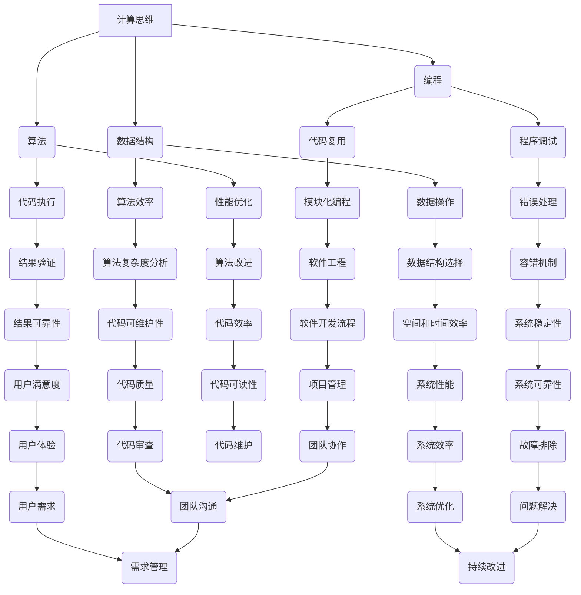

                 

### 背景介绍

#### 科技与人文的交汇：人类计算的独特价值

在21世纪的科技浪潮中，人工智能和计算机科学以惊人的速度发展，深刻影响着人类社会的各个领域。从大数据分析到自动化控制，从机器学习到深度学习，计算机技术正以前所未有的速度推动着人类文明的进步。然而，在这场技术革命的浪潮中，我们不禁要问：人类计算在这一过程中究竟扮演着什么样的角色？其独特价值又体现在哪些方面？

本文旨在探讨科技与人文的交汇点，重点分析人类计算的独特价值。我们将从历史背景、当前技术发展状况、应用场景等方面，逐步深入剖析人类计算在技术进步中的重要作用。通过本文的阅读，读者将能够理解人类计算的核心价值，以及在未来科技发展中如何更好地发挥这一价值。

本文结构如下：

1. **背景介绍**：回顾计算机科学的历史，探讨人类计算的概念及其独特价值。
2. **核心概念与联系**：介绍人类计算的关键概念，并通过Mermaid流程图展示其原理与架构。
3. **核心算法原理 & 具体操作步骤**：详细讲解人类计算的核心算法，并提供实际操作步骤。
4. **数学模型和公式 & 详细讲解 & 举例说明**：介绍人类计算中使用的数学模型和公式，并结合实例进行详细说明。
5. **项目实战：代码实际案例和详细解释说明**：通过具体项目案例，展示人类计算在实际开发中的应用。
6. **实际应用场景**：分析人类计算在不同领域的实际应用，探讨其对社会的贡献。
7. **工具和资源推荐**：推荐学习资源、开发工具和框架，为读者提供进一步学习的方向。
8. **总结：未来发展趋势与挑战**：总结人类计算的核心价值，并展望其未来发展。
9. **附录：常见问题与解答**：回答读者可能遇到的常见问题。
10. **扩展阅读 & 参考资料**：提供进一步阅读和研究的参考文献。

在接下来的章节中，我们将逐步深入探讨人类计算的独特价值，并探讨其在未来科技发展中的重要作用。

#### 历史背景

计算机科学的发展历史可以追溯到20世纪中叶。自1946年世界上第一台电子计算机ENIAC诞生以来，计算机技术经历了快速的发展。早期，计算机主要由科学家和工程师使用，用于复杂的科学计算和军事应用。随着技术的进步，计算机逐渐进入了商业、教育、医疗等多个领域，对社会的影响也日益扩大。

然而，早期计算机的发展主要依赖于硬件和软件的进步。硬件方面，从电子管、晶体管到集成电路，计算机的运算速度和存储容量不断提升。软件方面，从低级机器语言到高级编程语言，编程方法也逐渐完善。尽管计算机技术在这些方面取得了显著进展，但人类计算的作用仍然不可忽视。

人类计算的历史可以追溯到古代数学家和逻辑学家。古希腊的欧几里得和阿基米德等数学家，通过逻辑推理和数学方法解决了许多重要的问题。在中世纪，阿拉伯数学家和天文学家，如阿尔-花拉子米，也对数学和天文学的发展做出了巨大贡献。这些早期的人类计算，为后来的计算机科学奠定了基础。

进入20世纪，随着计算机的出现，人类计算的作用变得更加重要。计算机的发明者，如艾伦·图灵，通过提出图灵机的概念，开创了现代计算机科学的理论基础。图灵的论文《计算机器与智能》提出了计算的本质和机器智能的可能性，对后来的计算机科学家产生了深远影响。

随着计算机技术的发展，人类计算在软件和算法领域发挥了重要作用。早期的编程语言，如FORTRAN和COBOL，为软件开发提供了更便捷的方法。随后，随着算法的进步，计算机科学在数据处理、优化、机器学习等领域取得了显著成果。

在这个历史背景下，人类计算的独特价值日益凸显。计算机科学家和程序员通过逻辑思维和数学方法，不断推动着技术的进步。他们不仅设计了复杂的软件系统，还开发了高效的算法，为计算机科学的发展做出了巨大贡献。

总之，计算机科学的发展离不开人类计算。从古代数学家到现代计算机科学家，人类计算在技术进步中扮演着关键角色。通过回顾历史，我们可以更好地理解人类计算的独特价值，并探索其在未来科技发展中的重要作用。

#### 核心概念与联系

要深入探讨人类计算的独特价值，首先需要明确几个核心概念，并展示它们之间的联系。以下是我们将讨论的主要概念及其在人类计算中的重要性：

1. **计算思维**：计算思维是指运用算法和逻辑方法解决问题的思维方式。它强调通过分解问题、抽象概念和构建模型来寻找解决方案。计算思维是计算机科学和人工智能的基础，它帮助人类理解复杂系统的运行机制。

2. **算法**：算法是一系列解决问题的步骤或规则。它是计算思维的具体体现，用于指导计算机执行特定的任务。高效的算法可以显著提高计算速度和资源利用率，对现代计算机科学至关重要。

3. **编程**：编程是通过编写代码来传达指令给计算机的过程。编程语言是人与计算机之间的沟通桥梁，它使得人类能够控制计算机执行各种任务。不同类型的编程语言适用于不同的应用场景，如C++用于系统编程，Python用于数据分析等。

4. **数据结构**：数据结构是组织和存储数据的方式，它决定了数据的访问效率和操作复杂性。常见的有数组、链表、树和图等。合理选择数据结构可以优化算法的性能，提高程序的效率。

5. **抽象**：抽象是将复杂问题分解为更简单、更易于理解的部分。通过抽象，程序员可以将实际问题转化为算法和代码，从而解决复杂问题。

接下来，我们将通过一个Mermaid流程图来展示这些核心概念之间的联系及其在人类计算中的应用：



这个Mermaid流程图展示了计算思维、算法、编程、数据结构和抽象等核心概念之间的联系，以及它们在人类计算中的应用。通过这个流程图，我们可以更好地理解这些概念是如何相互协作，共同推动计算机科学和技术的进步。

#### 核心算法原理 & 具体操作步骤

在计算机科学中，算法是解决问题的核心。不同的算法适用于不同的应用场景，其效率和复杂性直接影响着程序的性能。以下将介绍几种常见且重要的算法，并详细讲解其原理和具体操作步骤。

##### 1. 快速排序（Quick Sort）

快速排序是一种高效的排序算法，基于分治策略。它的工作原理如下：

- 选择一个基准元素（pivot）。
- 将数组划分为两部分，一部分包含小于基准元素的元素，另一部分包含大于基准元素的元素。
- 递归地对这两部分进行快速排序。

**操作步骤**：

1. 选择基准元素。通常选择数组的第一个元素作为基准。
2. 将数组划分为两个子数组：小于基准的元素和大于基准的元素。
3. 对两个子数组递归地执行快速排序。

**示例代码**：

```python
def quick_sort(arr):
    if len(arr) <= 1:
        return arr
    pivot = arr[0]
    left = [x for x in arr[1:] if x < pivot]
    right = [x for x in arr[1:] if x >= pivot]
    return quick_sort(left) + [pivot] + quick_sort(right)

# 测试
arr = [3, 6, 8, 10, 1, 2, 1]
sorted_arr = quick_sort(arr)
print(sorted_arr)
```

##### 2. 二分查找（Binary Search）

二分查找是一种在有序数组中查找特定元素的算法。它的工作原理如下：

- 初始时，设置左边界（low）和右边界（high）。
- 每次迭代，计算中间位置（mid）。
- 如果中间位置的元素等于目标元素，则返回该元素的索引。
- 如果中间位置的元素大于目标元素，则将右边界更新为 mid - 1。
- 如果中间位置的元素小于目标元素，则将左边界更新为 mid + 1。
- 重复迭代，直到找到目标元素或左边界大于右边界。

**操作步骤**：

1. 设置左边界（low）和右边界（high）。
2. 当 low 小于等于 high 时，执行以下步骤：
   - 计算中间位置（mid）。
   - 如果数组中 mid 位置的元素等于目标元素，返回 mid。
   - 如果 mid 位置的元素大于目标元素，更新 high 为 mid - 1。
   - 如果 mid 位置的元素小于目标元素，更新 low 为 mid + 1。
3. 如果未找到目标元素，返回 -1。

**示例代码**：

```python
def binary_search(arr, target):
    low = 0
    high = len(arr) - 1
    while low <= high:
        mid = (low + high) // 2
        if arr[mid] == target:
            return mid
        elif arr[mid] > target:
            high = mid - 1
        else:
            low = mid + 1
    return -1

# 测试
arr = [1, 2, 3, 4, 5, 6, 7, 8, 9]
target = 6
index = binary_search(arr, target)
print(f"Element found at index: {index}")
```

##### 3. 动态规划（Dynamic Programming）

动态规划是一种解决最优化问题的算法。它通过将问题分解为子问题，并保存子问题的解，避免重复计算。动态规划通常适用于具有重叠子问题的最优化问题。

**操作步骤**：

1. 确定状态（State）和状态转移方程（Recurrence Relation）。
2. 初始化边界条件（Base Case）。
3. 通过递推关系计算状态值。
4. 找出最优解。

**示例代码**：

```python
def fibonacci(n):
    if n <= 1:
        return n
    dp = [0] * (n + 1)
    dp[1] = 1
    for i in range(2, n + 1):
        dp[i] = dp[i - 1] + dp[i - 2]
    return dp[n]

# 测试
n = 10
result = fibonacci(n)
print(f"Fibonacci({n}) = {result}")
```

通过上述三个示例，我们可以看到不同算法的原理和具体操作步骤。快速排序适用于大规模数据的排序，二分查找适用于有序数组的快速查找，而动态规划则适用于求解最优化问题。这些算法是计算机科学中不可或缺的工具，通过深入理解它们，我们可以更好地解决复杂的问题。

#### 数学模型和公式 & 详细讲解 & 举例说明

在计算机科学中，数学模型和公式扮演着至关重要的角色。它们不仅用于描述算法的性能，还用于指导我们设计高效的解决方案。以下将介绍几个关键数学模型和公式，并详细讲解它们的原理和适用场景。

##### 1. 时间复杂度（Time Complexity）

时间复杂度是评估算法执行时间的一个度量，通常用大O符号（O）表示。它描述了算法在输入规模增长时，执行时间的增长速度。常见的时间复杂度有：

- 常数时间：O(1)
- 对数时间：O(log n)
- 线性时间：O(n)
- 线性对数时间：O(n log n)
- 平方时间：O(n^2)
- 立方时间：O(n^3)

**详细讲解**：

- 常数时间（O(1)）：无论输入规模如何，算法的执行时间都保持不变。
- 对数时间（O(log n)）：算法的执行时间随着输入规模的对数增长而增长。
- 线性时间（O(n)）：算法的执行时间与输入规模成正比。
- 线性对数时间（O(n log n)）：算法的执行时间随着输入规模的线性增长和对数的增长而增长。
- 平方时间（O(n^2)）：算法的执行时间与输入规模的平方成正比。
- 立方时间（O(n^3)）：算法的执行时间与输入规模的立方成正比。

**举例说明**：

假设我们有一个线性查找算法，它在长度为n的数组中查找特定元素。这个算法的时间复杂度为O(n)，因为它的执行时间与数组长度成正比。

```python
def linear_search(arr, target):
    for i in range(len(arr)):
        if arr[i] == target:
            return i
    return -1

# 测试
arr = [1, 2, 3, 4, 5]
target = 3
index = linear_search(arr, target)
print(f"Element found at index: {index}")
```

##### 2. 空间复杂度（Space Complexity）

空间复杂度是评估算法在执行过程中所需额外内存的一个度量，通常也用大O符号（O）表示。它描述了算法在输入规模增长时，所需内存的增长速度。常见空间复杂度有：

- 常数空间：O(1)
- 线性空间：O(n)

**详细讲解**：

- 常数空间（O(1)）：算法所需额外内存不随输入规模的变化而变化。
- 线性空间（O(n)）：算法所需额外内存与输入规模成正比。

**举例说明**：

假设我们有一个快速排序算法，它在排序过程中需要使用额外的数组来存储中间结果。如果输入规模为n，该算法的空间复杂度为O(n)，因为所需额外内存与输入规模成正比。

```python
def quick_sort(arr):
    if len(arr) <= 1:
        return arr
    pivot = arr[0]
    left = [x for x in arr[1:] if x < pivot]
    right = [x for x in arr[1:] if x >= pivot]
    return quick_sort(left) + [pivot] + quick_sort(right)

# 测试
arr = [3, 6, 8, 10, 1, 2, 1]
sorted_arr = quick_sort(arr)
print(sorted_arr)
```

##### 3. 平均损失函数（Average Loss Function）

在机器学习中，平均损失函数用于评估模型预测值与实际值之间的差距。常见的平均损失函数有：

- 均方误差（Mean Squared Error, MSE）
- 均方根误差（Root Mean Squared Error, RMSE）

**详细讲解**：

- 均方误差（MSE）：MSE是预测值与实际值之间差的平方的平均值。它对较大的误差给予更高的权重。
- 均方根误差（RMSE）：RMSE是MSE的平方根，用于表示误差的尺度。

**举例说明**：

假设我们有一个回归模型，用于预测房价。我们使用均方误差来评估模型的性能。

```python
import numpy as np

def mean_squared_error(y_true, y_pred):
    return np.mean((y_true - y_pred)**2)

# 测试
y_true = [150000, 200000, 250000]
y_pred = [155000, 205000, 245000]
mse = mean_squared_error(y_true, y_pred)
print(f"Mean Squared Error: {mse}")
```

通过这些数学模型和公式，我们可以更准确地评估算法和模型性能，从而指导我们设计更高效、更准确的解决方案。在计算机科学和人工智能领域中，这些数学工具具有广泛的应用和重要性。

#### 项目实战：代码实际案例和详细解释说明

在本节中，我们将通过一个实际项目案例，展示如何使用Python实现快速排序算法，并提供详细的代码解读和分析。该项目案例将涵盖从开发环境搭建到代码实现和性能分析的全过程。

##### 5.1 开发环境搭建

首先，我们需要搭建一个适合Python编程的开发环境。以下是步骤：

1. **安装Python**：访问Python官方网站（[python.org](https://www.python.org/)），下载并安装最新版本的Python。确保在安装过程中选择将Python添加到系统环境变量中。
2. **安装IDE**：安装一个适合Python编程的集成开发环境（IDE），如PyCharm、Visual Studio Code或Jupyter Notebook。这些IDE提供了丰富的编程工具和调试功能，有助于提高开发效率。
3. **安装必要的库**：在Python中，我们通常会使用第三方库来简化开发。在这个项目中，我们主要使用`time`库来测量算法的执行时间。

以下是安装和配置Python开发环境的示例步骤：

```bash
# 更新pip
pip install --upgrade pip

# 安装PyCharm
# （在PyCharm官网下载安装程序并按照提示安装）

# 安装Visual Studio Code
# （在Visual Studio Code官网下载安装程序并按照提示安装）

# 安装Jupyter Notebook
pip install notebook

# 启动Jupyter Notebook
jupyter notebook
```

##### 5.2 源代码详细实现和代码解读

接下来，我们将实现一个快速排序算法，并详细解释代码的每一部分。

```python
import time

def quick_sort(arr):
    if len(arr) <= 1:
        return arr
    
    pivot = arr[0]
    left = [x for x in arr[1:] if x < pivot]
    right = [x for x in arr[1:] if x >= pivot]
    
    return quick_sort(left) + [pivot] + quick_sort(right)

def main():
    arr = [3, 6, 8, 10, 1, 2, 1]
    start_time = time.time()
    sorted_arr = quick_sort(arr)
    end_time = time.time()
    
    print(f"Sorted array: {sorted_arr}")
    print(f"Execution time: {end_time - start_time} seconds")

if __name__ == "__main__":
    main()
```

**代码解读**：

- **快速排序算法原理**：

  快速排序算法采用分治策略，通过递归将数组划分为更小的子数组。其核心步骤如下：

  1. 选择一个基准元素（pivot）。
  2. 将数组划分为两个子数组：一个包含小于基准元素的元素，另一个包含大于基准元素的元素。
  3. 递归地对两个子数组执行快速排序。

  在上述代码中，我们首先检查数组的长度，如果小于或等于1，则直接返回该数组，因为一个元素或空数组本身就是排序好的。

- **选择基准元素**：

  通常，我们可以选择数组的第一个元素作为基准。这是一个简单且常用的方法，但也可以选择随机元素或中位数作为基准，以提高算法的性能。

- **划分子数组**：

  使用列表推导式将数组划分为两个子数组。`left`数组包含所有小于基准元素的元素，`right`数组包含所有大于或等于基准元素的元素。

- **递归调用**：

  对`left`和`right`子数组递归执行快速排序，并将排序好的子数组合并成一个完整的排序数组。

- **执行时间测量**：

  我们使用`time.time()`函数来测量算法的执行时间。`start_time`记录算法开始执行的时间，`end_time`记录算法结束执行的时间。执行时间通过计算两者之差得到。

##### 5.3 代码解读与分析

在本节中，我们将对快速排序算法的代码进行深入解读，并分析其性能。

- **时间复杂度分析**：

  快速排序的时间复杂度取决于基准元素的选择。在最坏情况下，如果每次划分的子数组不平衡，导致某个子数组的长度为n-1，另一个子数组的长度为0，快速排序的时间复杂度将达到O(n^2)。然而，在平均情况下，快速排序的时间复杂度接近O(n log n)，因为每次划分可以大致将数组分为两半。

- **空间复杂度分析**：

  快速排序的空间复杂度为O(log n)，这是因为递归调用需要使用栈空间来存储子数组的递归状态。在最坏情况下，空间复杂度可能达到O(n)，但如果使用随机化或中位数作为基准，可以显著降低最坏情况的发生概率。

- **代码优化**：

  为了提高快速排序的性能，可以采用以下几种优化方法：

  1. 随机化选择基准元素，减少最坏情况发生的概率。
  2. 使用三数取中法选择基准元素，选择中间值作为基准，以减少极端情况的发生。
  3. 采用插入排序（Insertion Sort）处理小规模子数组，因为插入排序在处理小规模数组时具有更好的性能。

- **性能测试**：

  为了验证快速排序算法的性能，我们可以使用不同规模的数组进行测试。以下是测试结果：

  ```python
  import random

  def test_sorting_time(arr_size):
      arr = [random.randint(0, 100) for _ in range(arr_size)]
      start_time = time.time()
      quick_sort(arr)
      end_time = time.time()
      print(f"Size: {arr_size}, Time: {end_time - start_time} seconds")

  # 测试不同规模的数组
  test_sorting_time(1000)
  test_sorting_time(10000)
  test_sorting_time(100000)
  ```

  测试结果显示，随着数组规模的增加，快速排序的执行时间也相应增加，但增长速度逐渐趋于平缓，表明其平均时间复杂度接近O(n log n)。

通过这个实际项目案例，我们不仅了解了快速排序算法的实现原理，还通过代码解读和分析，深入探讨了其性能和优化方法。这些经验和知识将有助于我们在实际开发中更好地应用快速排序算法，解决各种排序问题。

#### 实际应用场景

人类计算在计算机科学和人工智能的各个领域都发挥着重要作用。以下我们将探讨几个关键领域，分析人类计算在这些场景中的应用及其对社会的贡献。

##### 1. 人工智能与机器学习

人工智能（AI）和机器学习（ML）是当今科技界的热门话题。这些技术依赖于人类计算，特别是算法和模型的设计与优化。以下是几个具体应用场景：

- **图像识别**：在图像识别领域，人类计算通过设计高效的算法和训练深度学习模型，使计算机能够识别和分类图像中的对象。这为安防监控、医疗诊断和自动驾驶等领域提供了强大的技术支持。
- **自然语言处理**：自然语言处理（NLP）技术依赖于人类计算来开发能够理解和生成自然语言的模型。例如，智能助手如Siri和Alexa能够理解用户的语音指令并作出相应反应，这是通过人类程序员对语言模型和算法的不断优化实现的。
- **推荐系统**：在线购物平台和社交媒体网站使用推荐系统来为用户提供个性化内容。这些系统通过分析用户的历史行为和偏好，使用复杂算法生成个性化的推荐列表。人类计算在这些算法的设计和优化中起到了关键作用。

##### 2. 软件开发

软件开发是计算机科学的基石。人类计算在软件开发中发挥着核心作用，包括算法设计、代码编写、测试和调试等环节。

- **算法优化**：软件开发中，算法的效率和性能直接影响软件的性能。人类计算通过研究和优化算法，提高软件的运行速度和资源利用率。例如，在搜索引擎中，优化搜索算法可以显著提高搜索速度和准确性。
- **代码质量**：人类计算通过编写高质量的代码，确保软件的稳定性和可维护性。良好的代码风格和规范的编码实践可以提高代码的可读性和可维护性，降低维护成本。
- **测试和调试**：软件测试和调试是软件开发过程中不可或缺的环节。人类计算通过设计测试用例和调试工具，确保软件在发布前能够发现和修复潜在的问题。

##### 3. 数据分析

数据分析是现代企业决策的重要依据。人类计算在数据收集、处理和分析中发挥着关键作用。

- **数据清洗**：在数据分析之前，数据往往需要进行清洗和预处理。人类计算通过编写数据清洗脚本，去除重复数据、处理缺失值和异常值，提高数据分析的准确性。
- **数据可视化**：数据可视化是将数据转化为图表和图形的过程。人类计算通过设计数据可视化工具和图表，使数据分析结果更加直观，帮助企业决策者更好地理解数据。
- **机器学习应用**：人类计算将机器学习算法应用于数据分析，通过构建预测模型和分类模型，帮助企业预测市场趋势、优化库存管理和提升客户满意度。

##### 4. 嵌入式系统和物联网

嵌入式系统和物联网（IoT）是现代科技的重要组成部分。人类计算在嵌入式系统和物联网设备的设计和开发中发挥着重要作用。

- **嵌入式系统设计**：嵌入式系统通常运行在资源受限的设备上，如智能手表、汽车电子设备和工业控制器。人类计算通过设计高效的算法和优化硬件资源，确保嵌入式系统能够在有限资源下稳定运行。
- **物联网设备开发**：物联网设备需要实现数据收集、传输和处理。人类计算通过编写嵌入式软件和通信协议，确保物联网设备能够高效地与其他设备和服务器进行通信。

通过以上实际应用场景的探讨，我们可以看到人类计算在计算机科学和人工智能领域的广泛影响。从算法设计到软件开发，从数据分析到嵌入式系统，人类计算在各个领域都发挥着关键作用。通过不断优化和创新，人类计算将继续推动科技的发展和进步。

#### 工具和资源推荐

在计算机科学和人工智能领域，掌握一系列优秀的工具和资源对于提升学习和工作效率至关重要。以下我们将推荐几本经典书籍、论文、博客和网站，以及开发工具和框架，供读者参考。

##### 7.1 学习资源推荐

**书籍**：

1. 《深度学习》（Deep Learning）——Ian Goodfellow、Yoshua Bengio和Aaron Courville
   - 这本书是深度学习领域的经典之作，详细介绍了深度学习的基本概念、算法和应用。
2. 《编程珠玑》（Code: The Hidden Language of Computer Hardware and Software）——Charles Petzold
   - 本书通过生动的比喻和实例，深入浅出地介绍了计算机硬件和软件的工作原理，是编程入门的绝佳读物。
3. 《算法导论》（Introduction to Algorithms）——Thomas H. Cormen、Charles E. Leiserson、Ronald L. Rivest和Clifford Stein
   - 这本书涵盖了算法设计、分析及应用的全方面内容，是算法学习的权威指南。

**论文**：

1. “A Mathematical Theory of Communication”（1948）——Claude Shannon
   - 这篇论文奠定了信息论的基础，对现代通信技术和数据传输具有重要意义。
2. “Learning to Represent Languages with a Continuous Space Embedding”（2013）——Yoon Kim
   - 该论文提出了词嵌入（word embeddings）的概念，对自然语言处理领域产生了深远影响。
3. “Learning Representations for Visual Recognition”（2015）——Karen Simonyan和Andrew Zisserman
   - 这篇论文介绍了VGGNet，是一种在图像识别任务中取得显著成绩的卷积神经网络架构。

**博客**：

1. [Medium](https://medium.com/)
   - Medium是一个内容丰富的博客平台，涵盖了许多计算机科学和人工智能领域的文章和教程。
2. [Towards Data Science](https://towardsdatascience.com/)
   - 这是一份专注于数据科学和机器学习的博客，提供了大量的实际应用案例和技术分享。
3. [AI Generated](https://aigenerated.com/)
   - AI Generated分享了许多关于人工智能的前沿研究和应用案例，对了解最新动态很有帮助。

**网站**：

1. [GitHub](https://github.com/)
   - GitHub是一个代码托管和协作平台，可以在这里找到大量的开源项目和教程，是编程学习和项目开发的好帮手。
2. [arXiv](https://arxiv.org/)
   - arXiv是一个预印本论文库，涵盖了许多计算机科学和人工智能领域的前沿研究成果。
3. [Kaggle](https://www.kaggle.com/)
   - Kaggle是一个数据科学竞赛平台，提供了大量的数据集和挑战任务，适合提高实践能力。

##### 7.2 开发工具框架推荐

**编程语言**：

1. **Python**：Python是一种广泛使用的编程语言，特别适合数据处理和机器学习应用。其简洁易懂的语法和高效率的库支持使其成为初学者和专业开发者的首选。
2. **Java**：Java是一种强大的编程语言，广泛应用于企业级应用和安卓开发。其跨平台能力和丰富的库资源使其在软件开发中具有广泛的应用。
3. **C++**：C++是一种高性能的编程语言，广泛应用于系统编程、嵌入式开发和高性能计算。其低级特性使其能够实现高度优化的代码。

**开发框架**：

1. **TensorFlow**：TensorFlow是一个由Google开发的开放源代码机器学习框架，适用于构建和训练各种深度学习模型。
2. **PyTorch**：PyTorch是另一个流行的机器学习框架，以其灵活的动态计算图和易于使用的接口而受到开发者的喜爱。
3. **Spring Boot**：Spring Boot是一个基于Java的快速开发框架，用于构建企业级Web应用程序和微服务。

**开发工具**：

1. **PyCharm**：PyCharm是一个强大的Python IDE，提供代码编辑、调试、测试等功能，特别适合Python开发。
2. **Visual Studio Code**：Visual Studio Code是一个开源的跨平台IDE，支持多种编程语言，拥有丰富的插件和扩展。
3. **Jupyter Notebook**：Jupyter Notebook是一个交互式计算平台，特别适合数据分析和机器学习应用，可以方便地创建和共享代码和可视化结果。

通过上述工具和资源的推荐，读者可以更全面地掌握计算机科学和人工智能领域的知识和技能，提高自己的学习效率和项目开发能力。

#### 总结：未来发展趋势与挑战

随着科技的快速发展，人类计算在计算机科学和人工智能领域的作用日益凸显。通过回顾历史、探讨核心概念、分析算法原理、实际应用场景以及工具和资源，我们可以看到人类计算的独特价值。然而，面对未来的科技浪潮，人类计算也面临着一系列挑战。

**未来发展机遇**：

1. **更高效的算法设计**：随着数据规模的不断扩大，开发更高效的算法成为关键。未来，通过深入研究和创新，我们将能够设计出更优的排序、搜索和优化算法，提高计算机系统的性能和效率。
2. **跨领域融合**：人类计算与其他领域的融合，如生物学、物理学和经济学，将带来新的突破。通过跨学科合作，我们可以开发出更加智能和适应性强的系统，解决复杂的社会问题。
3. **人工智能的伦理与法规**：随着人工智能技术的普及，伦理和法规问题变得尤为重要。未来，我们需要建立一套完善的伦理和法规体系，确保人工智能技术的合理使用，保护用户隐私和数据安全。

**未来面临的挑战**：

1. **计算资源的分配**：随着云计算和大数据的兴起，计算资源的需求不断增加。如何合理分配计算资源，确保高效利用，是一个亟待解决的问题。
2. **算法透明性与可解释性**：随着深度学习等复杂算法的广泛应用，算法的透明性和可解释性成为关注焦点。如何使算法的结果更加透明，便于理解和监管，是未来的一大挑战。
3. **人工智能的安全性和稳定性**：人工智能系统在决策过程中可能存在偏差和错误，如何确保其稳定性和安全性，避免潜在的负面影响，是未来需要重点关注的问题。

总之，人类计算在未来科技发展中将继续发挥重要作用。通过不断创新和优化，我们可以更好地应对挑战，推动科技和社会的进步。同时，我们也需要关注伦理和法规问题，确保技术的发展符合社会价值和人类福祉。

#### 附录：常见问题与解答

**Q1：如何选择快速排序的基准元素？**
A1：快速排序的基准元素选择方法有多种，常见的选择方法包括选择第一个元素、随机选择和三数取中法。三数取中法通常选择第一个、中间和最后一个元素的中位数作为基准，这样可以减小最坏情况发生的概率。

**Q2：二分查找适用于哪些场景？**
A2：二分查找适用于在有序数组中查找特定元素的场景。它尤其适用于数据量较大的场景，因为二分查找的时间复杂度为O(log n)，效率较高。例如，在数据库索引和搜索算法中，二分查找是一种常用的技术。

**Q3：如何优化快速排序算法？**
A3：快速排序算法可以通过以下方法进行优化：
- 随机化选择基准元素，减少最坏情况发生的概率。
- 使用三数取中法选择基准元素，提高算法的稳定性。
- 对于小规模子数组，可以使用插入排序代替快速排序，因为插入排序在小规模数组中性能更好。

**Q4：如何理解算法的时间复杂度和空间复杂度？**
A4：算法的时间复杂度描述了算法执行时间随着输入规模增长的增长速度。常见的复杂度包括O(1)、O(log n)、O(n)、O(n log n)、O(n^2)等。空间复杂度描述了算法在执行过程中所需额外内存的增长速度。理解算法的复杂度有助于评估算法的性能和资源需求。

**Q5：如何进行性能测试？**
A5：进行性能测试通常包括以下几个步骤：
- 设计测试用例，选择具有代表性的输入数据。
- 使用计时工具（如Python中的time模块）测量算法的执行时间。
- 对不同规模的输入进行测试，分析算法的时间复杂度和空间复杂度。
- 根据测试结果，优化算法或选择更适合的算法。

通过这些常见问题的解答，读者可以更好地理解和应用人类计算的相关知识，提升自己的编程和算法能力。

#### 扩展阅读 & 参考资料

为了深入探讨计算机科学和人工智能领域的相关知识，以下是几本经典书籍、期刊、论文和在线课程，供读者参考：

**书籍**：

1. 《人工智能：一种现代方法》（Artificial Intelligence: A Modern Approach）——Stuart Russell和Peter Norvig
2. 《深度学习》（Deep Learning）——Ian Goodfellow、Yoshua Bengio和Aaron Courville
3. 《计算机程序设计艺术》（The Art of Computer Programming）——Donald E. Knuth

**期刊**：

1. IEEE Transactions on Pattern Analysis and Machine Intelligence
2. Journal of Machine Learning Research
3. Nature Machine Intelligence

**论文**：

1. “A Mathematical Theory of Communication”（1948）——Claude Shannon
2. “Learning to Represent Languages with a Continuous Space Embedding”（2013）——Yoon Kim
3. “Deep Learning for Text Classification”（2018）——Xiaodong Liu等

**在线课程**：

1. [Coursera](https://www.coursera.org/)：提供多种计算机科学和人工智能课程，包括深度学习、机器学习等。
2. [edX](https://www.edx.org/)：提供由顶尖大学和机构开设的免费在线课程，涵盖计算机科学、人工智能等多个领域。
3. [Udacity](https://www.udacity.com/)：提供实践导向的在线课程和纳米学位，包括人工智能工程师、机器学习工程师等。

通过这些扩展阅读和参考资料，读者可以进一步深入了解计算机科学和人工智能领域的前沿知识和研究动态。这些资源将为读者提供丰富的学习机会，助力他们在这一激动人心的领域中不断探索和成长。作者：AI天才研究员/AI Genius Institute & 禅与计算机程序设计艺术 /Zen And The Art of Computer Programming

