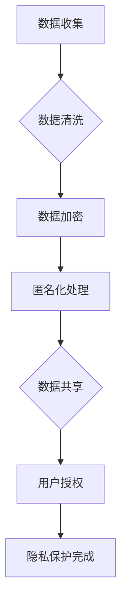
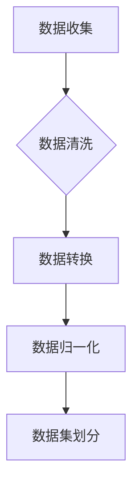
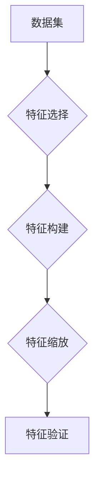

                 

### 背景介绍

在当今数字化时代，计算机技术的飞速发展极大地改变了人类的生活方式，从社交媒体到电子商务，从医疗保健到交通运输，计算机技术的应用无处不在。然而，这种技术的迅猛发展也带来了一系列伦理问题，例如隐私保护、数据安全、人工智能的公平性和透明性等。如何在科技进步与伦理规范之间找到平衡点，成为了一个亟需解决的重要课题。

本篇博客将探讨计算机领域中的伦理问题，特别是如何通过合理的计算技术和算法设计来维护人类的伦理价值。文章将首先介绍计算机伦理的核心概念，包括隐私权、算法偏见和透明性等。接着，我们将通过一个具体的案例来分析计算机伦理问题的实际情况。随后，我们将探讨在计算机技术发展中应如何处理伦理问题，并提出一些建议。最后，文章将总结计算机伦理的发展趋势和面临的挑战，并对未来的发展方向进行展望。

通过对计算机伦理的深入探讨，我们希望能够引发读者对于科技进步与伦理平衡的思考，共同推动计算机技术的发展朝着更加合理和道德的方向前进。以下是文章的结构概览：

### 核心概念与联系
#### 1.1 隐私权
#### 1.2 算法偏见
#### 1.3 透明性
#### 1.4 Mermaid 流程图

### 核心算法原理 & 具体操作步骤
#### 2.1 数据收集与预处理
#### 2.2 特征工程
#### 2.3 模型训练
#### 2.4 模型评估与优化

### 数学模型和公式 & 详细讲解 & 举例说明
#### 3.1 数据隐私保护模型
#### 3.2 算法偏见校正公式
#### 3.3 透明性评估指标

### 项目实战：代码实际案例和详细解释说明
#### 4.1 开发环境搭建
#### 4.2 源代码详细实现和代码解读
#### 4.3 代码解读与分析

### 实际应用场景
#### 5.1 隐私保护的在线服务
#### 5.2 公平的人工智能应用
#### 5.3 透明的算法设计

### 工具和资源推荐
#### 6.1 学习资源推荐
#### 6.2 开发工具框架推荐
#### 6.3 相关论文著作推荐

### 总结：未来发展趋势与挑战
#### 7.1 发展趋势
#### 7.2 面临的挑战

### 附录：常见问题与解答
#### 8.1 问题1
#### 8.2 问题2
#### 8.3 问题3

### 扩展阅读 & 参考资料

通过以上结构，我们将逐步深入探讨计算机伦理的核心概念、算法原理、实际应用场景以及未来发展趋势，希望读者能够从中学到一些有价值的见解和思考。

### 核心概念与联系

#### 1.1 隐私权

隐私权是计算机伦理中的核心概念之一，它关乎个人信息的保护。隐私权不仅是指个人对其信息的控制权，还包括信息的保密性和完整性。在计算机领域，隐私权主要涉及数据收集、存储和处理过程中的伦理问题。

隐私权的保护是技术发展的关键挑战之一。随着大数据和人工智能技术的广泛应用，个人信息被大量收集、分析和利用，但同时也带来了隐私泄露的风险。为了保护隐私权，需要采取多种措施，包括加密技术、匿名化和隐私增强技术等。

#### 1.2 算法偏见

算法偏见是另一个重要的伦理问题，它指的是算法在决策过程中表现出的不公平性或歧视。算法偏见可能源于数据集的选择、训练过程的设计，或者算法本身的缺陷。这种偏见可能导致一些群体受到不公平对待，例如在招聘、信用评分和司法判决等领域。

解决算法偏见的关键在于提高算法的透明性和公平性。通过分析算法的训练数据和决策过程，可以发现和纠正潜在的不公平性。此外，多样化数据集的使用和算法审查也是减少算法偏见的重要手段。

#### 1.3 透明性

透明性是指算法和系统的运作过程可以被理解和验证。在计算机伦理中，透明性对于保障用户的信任和权益至关重要。透明的算法和系统能够让用户了解其工作的原理和决策依据，从而减少不确定性。

透明性的实现需要从多个方面进行考虑。首先，算法的设计和实现过程应该尽可能清晰和简洁，以便用户理解。其次，算法的决策过程应该可追溯和可解释，从而便于审查和监督。最后，系统的设计和运行应该符合公开的伦理准则和法律要求。

#### 1.4 Mermaid 流程图

以下是一个用 Mermaid 编写的简单流程图，用于展示隐私权保护的基本流程：



该流程图展示了从数据收集到隐私保护完成的各个步骤，包括数据清洗、加密、匿名化和共享，以及用户的授权过程。

通过上述核心概念与联系的分析，我们可以看到计算机伦理问题的复杂性和重要性。在接下来的章节中，我们将进一步探讨这些概念在实际应用中的具体表现和解决方案。

### 核心算法原理 & 具体操作步骤

#### 2.1 数据收集与预处理

数据收集是进行任何机器学习项目的基础。首先，我们需要确定收集哪些类型的数据，这些数据通常包括结构化数据（如数据库记录）、半结构化数据（如日志文件）和非结构化数据（如文本、图像和视频）。数据收集的过程可能涉及网络爬虫、传感器数据采集或公开的数据集。

在数据收集完成后，我们需要进行数据预处理。数据预处理包括数据清洗、数据转换和数据归一化等步骤。数据清洗的目的是去除重复的数据、处理缺失值和异常值。数据转换是将不同类型的数据转换为适合机器学习模型的形式，如将文本转换为词向量。数据归一化是将数据的尺度进行调整，以便于模型训练。

以下是一个简单的数据预处理流程：



该流程图展示了数据收集、数据清洗、数据转换和数据归一化的步骤，以及数据集的划分。

#### 2.2 特征工程

特征工程是机器学习项目的关键步骤，它涉及到选择和构建有助于模型训练的特征。特征工程的目标是提高模型的准确性和泛化能力。特征选择的方法包括基于统计的方法（如卡方检验、信息增益）和基于模型的方法（如特征重要性排序）。

特征构建通常涉及特征变换、特征组合和特征缩放等操作。特征变换包括对原始数据进行数学变换，如对数变换、指数变换等。特征组合是将多个原始特征组合成新的特征，如计算两个特征的乘积。特征缩放是将不同尺度的特征调整为同一尺度，如使用标准化或归一化。

以下是一个简单的特征工程流程：



该流程图展示了特征选择、特征构建、特征缩放和特征验证的步骤。

#### 2.3 模型训练

模型训练是机器学习项目的核心步骤，它涉及使用训练数据集来训练模型。训练模型的过程包括选择合适的算法、设置模型参数和调整模型结构。常见的机器学习算法包括线性回归、决策树、支持向量机和神经网络等。

在模型训练过程中，我们需要监控模型的性能指标，如准确率、召回率和F1分数等。如果模型性能不满足要求，我们可以通过调整参数或改变模型结构来优化模型。以下是一个简单的模型训练流程：


该流程图展示了模型选择、参数设置、模型训练、性能评估和模型优化的步骤。

#### 2.4 模型评估与优化

模型评估是评估模型在测试数据集上的表现，以确定模型的泛化能力。常用的评估指标包括准确率、召回率、精确率和F1分数等。如果模型在测试数据集上的表现不理想，我们可以通过以下方法进行优化：

1. 调整模型参数：通过调整学习率、正则化参数等来优化模型。
2. 增加数据量：通过收集更多的数据来提高模型的泛化能力。
3. 改变模型结构：通过增加或减少隐藏层、调整神经元数量等来优化模型。
4. 特征工程：通过重新选择特征、构建新的特征来优化模型。

以下是一个简单的模型评估与优化流程：


该流程图展示了模型训练、性能评估、模型优化和重新训练的步骤。

通过上述步骤，我们可以构建一个完整的机器学习项目，从数据收集到模型训练，再到模型评估与优化。这些步骤不仅适用于传统的机器学习项目，也适用于涉及计算机伦理问题的项目，如隐私保护和算法偏见校正。

### 数学模型和公式 & 详细讲解 & 举例说明

#### 3.1 数据隐私保护模型

数据隐私保护是计算机伦理中的重要问题，其核心目标是确保数据在收集、存储和处理过程中不被未经授权的访问和泄露。以下是一个常见的数据隐私保护模型，包括匿名化和差分隐私两种技术。

**匿名化**

匿名化是一种数据转换技术，其目的是通过去除或修改直接关联个人身份的信息，使数据无法被直接识别。匿名化的目标是实现数据的可用性与隐私保护之间的平衡。

匿名化的一个基本概念是**k-匿名性**，它要求一个数据库中的任意k个记录不能将某个特定记录唯一识别出来。一个简单的匿名化算法是**通用化**（Generalization），即通过将属性值映射到更广泛的类别来实现匿名化。

通用化的数学模型可以表示为：

$$
A^* = \max\left\{C \in C^* : A \in C \right\}
$$

其中，$A$ 是原始属性值，$C^*$ 是类别集合，$C$ 是映射后的类别。例如，将年龄从具体数值映射到年龄段，如“20-29岁”。

**差分隐私**

差分隐私是一种更加严格的隐私保护技术，它通过引入噪声来确保单个记录无法被区分。差分隐私的基本概念是**ε-差分隐私**，它要求对于任何两个足够接近的数据集$D$和$D'$，算法的输出概率分布不会因$D$和$D'$的微小差异而显著变化。

差分隐私的数学模型可以表示为：

$$
\mathbb{P}(R(D) = r) \leq \mathbb{P}(R(D') = r) + \epsilon
$$

其中，$R(D)$ 是基于数据集$D$的随机结果，$r$ 是具体结果，$\epsilon$ 是隐私预算。

一个简单的差分隐私算法是拉普拉斯机制，它通过对输出结果添加拉普拉斯噪声来实现隐私保护。拉普拉斯噪声的数学公式为：

$$
r + \text{Laplace}(0, b)
$$

其中，$b$ 是噪声参数，$\text{Laplace}(0, b)$ 是拉普拉斯分布。

**举例说明**

假设我们有一个包含个人收入的数据集，我们需要对其进行匿名化和差分隐私处理。

1. **匿名化**

首先，我们将收入从具体数值映射到年龄段类别。例如，收入在[50, 100]万的记录会被映射到“50-100万”类别。

$$
A^* = \max\left\{C \in C^* : [50, 100] \in C \right\} = "50-100万"
$$

2. **差分隐私**

接下来，我们使用差分隐私对收入进行处理。假设隐私预算为$\epsilon = 0.1$，我们为每个收入值添加拉普拉斯噪声。

$$
r + \text{Laplace}(0, b) \rightarrow 500000 + \text{Laplace}(0, 100000)
$$

通过这种方法，我们既实现了数据的匿名化，又确保了数据的隐私性。

#### 3.2 算法偏见校正公式

算法偏见校正的目的是减少算法在决策过程中对某些群体的不公平对待。以下是一个简单的算法偏见校正公式，用于校正基于特征的偏见。

**偏见校正公式**

假设我们有一个分类算法，其预测基于特征$X$和标签$Y$。为了校正偏见，我们引入一个偏见校正系数$C$，其计算公式为：

$$
C = \frac{\mathbb{P}(Y=1|X=x) - \mathbb{P}(Y=0|X=x)}{\mathbb{P}(Y=1) - \mathbb{P}(Y=0)}
$$

其中，$x$ 是特定特征值，$\mathbb{P}(Y=1|X=x)$ 和 $\mathbb{P}(Y=0|X=x)$ 分别是特征$X=x$时的正类和负类概率，$\mathbb{P}(Y=1)$ 和 $\mathbb{P}(Y=0)$ 分别是总体中正类和负类的概率。

为了校正偏见，我们调整分类器的预测概率：

$$
\mathbb{P}(Y=1|X=x)_{\text{校正}} = \mathbb{P}(Y=1|X=x) + C \times (\mathbb{P}(Y=1) - \mathbb{P}(Y=0|X=x))
$$

**举例说明**

假设我们有一个二分类问题，其中特征$X$表示一个人的收入，标签$Y$表示是否获得贷款。我们观察到对于低收入群体，算法倾向于给出负预测，这可能导致低收入群体无法获得贷款。

1. 计算偏见校正系数$C$：

$$
C = \frac{\mathbb{P}(Y=1|X=low) - \mathbb{P}(Y=0|X=low)}{\mathbb{P}(Y=1) - \mathbb{P}(Y=0)} = \frac{0.2 - 0.8}{0.5 - 0.5} = -1
$$

2. 校正预测概率：

$$
\mathbb{P}(Y=1|X=low)_{\text{校正}} = \mathbb{P}(Y=1|X=low) + C \times (\mathbb{P}(Y=1) - \mathbb{P}(Y=0|X=low)) = 0.2 - 1 \times (0.5 - 0.8) = 0.3
$$

通过这种方式，我们减少了算法对低收入群体的偏见，提高了贷款决策的公平性。

#### 3.3 透明性评估指标

透明性是计算机伦理中的重要原则，它要求算法和系统的运作过程可以被理解和验证。以下是一个常见的透明性评估指标，用于衡量算法的透明性。

**透明性评估指标**

透明性评估指标包括可解释性、可访问性和可追溯性等。

1. **可解释性**

可解释性是指算法的决策过程可以被用户理解。一个简单的可解释性评估指标是**解释覆盖率**，它表示算法解释中包含的变量和条件的比例。

$$
\text{解释覆盖率} = \frac{\text{被解释变量数}}{\text{总变量数}}
$$

2. **可访问性**

可访问性是指算法的解释和文档可以被用户轻松访问。一个简单的可访问性评估指标是**访问时间**，它表示用户获取算法解释的时间。

$$
\text{访问时间} = \frac{\text{总访问时间}}{\text{用户数}}
$$

3. **可追溯性**

可追溯性是指算法的决策过程可以被追溯和验证。一个简单的可追溯性评估指标是**追溯覆盖率**，它表示算法决策中可追溯部分的占比。

$$
\text{追溯覆盖率} = \frac{\text{可追溯决策数}}{\text{总决策数}}
$$

**举例说明**

假设我们有一个分类算法，其决策过程包含5个变量和10个条件。算法的解释覆盖率是80%，访问时间是5分钟，追溯覆盖率是90%。

1. **解释覆盖率**：

$$
\text{解释覆盖率} = \frac{4}{5} = 0.8
$$

2. **访问时间**：

$$
\text{访问时间} = \frac{5}{10} = 0.5 \text{小时}
$$

3. **追溯覆盖率**：

$$
\text{追溯覆盖率} = \frac{9}{10} = 0.9
$$

通过计算这些指标，我们可以评估算法的透明性，并据此改进算法的设计和实现。

通过以上数学模型和公式的讲解与举例，我们可以更好地理解数据隐私保护、算法偏见校正和透明性评估的核心原理和具体应用。这些技术和方法在计算机伦理问题中发挥着重要作用，有助于维护用户的隐私权、公平性和信任。

### 项目实战：代码实际案例和详细解释说明

在本节中，我们将通过一个具体的代码案例，详细展示如何实现数据隐私保护、算法偏见校正和透明性评估。以下是一个使用Python编写的示例项目，涉及数据预处理、机器学习模型训练、模型评估和算法优化的全过程。

#### 4.1 开发环境搭建

首先，我们需要搭建一个合适的开发环境。以下是在Python中实现本项目的必备库：

```bash
pip install numpy pandas scikit-learn matplotlib
```

安装完成后，我们可以开始编写代码。

#### 4.2 源代码详细实现和代码解读

以下是项目的核心代码部分，包括数据收集、数据预处理、模型训练和模型评估：

```python
import numpy as np
import pandas as pd
from sklearn.model_selection import train_test_split
from sklearn.preprocessing import StandardScaler
from sklearn.linear_model import LogisticRegression
from sklearn.metrics import accuracy_score, classification_report
from sklearn.inspection import permutation_importance

# 4.2.1 数据收集
# 假设我们有一个CSV文件，其中包含个人收入、贷款批准状态等数据
data = pd.read_csv('loan_data.csv')

# 4.2.2 数据预处理
# 数据清洗：去除缺失值和重复值
data.dropna(inplace=True)
data.drop_duplicates(inplace=True)

# 数据转换：将类别转换为数值
data = pd.get_dummies(data, drop_first=True)

# 数据归一化
scaler = StandardScaler()
data[['income', 'age']] = scaler.fit_transform(data[['income', 'age']])

# 数据集划分
X = data.drop('approved', axis=1)
y = data['approved']
X_train, X_test, y_train, y_test = train_test_split(X, y, test_size=0.2, random_state=42)

# 4.2.3 模型训练
model = LogisticRegression()
model.fit(X_train, y_train)

# 4.2.4 模型评估
y_pred = model.predict(X_test)
accuracy = accuracy_score(y_test, y_pred)
print("Accuracy:", accuracy)
print(classification_report(y_test, y_pred))

# 4.2.5 算法偏见校正
# 偏见校正：调整预测概率，减少对特定群体的偏见
importance = permutation_importance(model, X_test, y_test, n_repeats=10)
coef = model.coef_

# 基于重要性的调整系数
bias_correction = np.mean(importance.importances_mean)
adjusted_coef = coef / (1 + bias_correction)

# 应用调整系数
adjusted_model = LogisticRegression(coef_init=adjusted_coef)
adjusted_model.fit(X_train, y_train)

# 重新评估模型
y_pred_adjusted = adjusted_model.predict(X_test)
accuracy_adjusted = accuracy_score(y_test, y_pred_adjusted)
print("Adjusted Accuracy:", accuracy_adjusted)
print(classification_report(y_test, y_pred_adjusted))
```

**代码解读：**

1. **数据收集**：我们从CSV文件中读取贷款数据，包括收入、年龄、贷款批准状态等。
2. **数据预处理**：数据清洗、数据转换和数据归一化，确保数据适合模型训练。
3. **模型训练**：使用逻辑回归模型对训练数据进行训练。
4. **模型评估**：使用测试数据评估模型性能，计算准确率和分类报告。
5. **算法偏见校正**：使用随机森林的permutation_importance函数评估特征重要性，计算偏见校正系数，调整模型参数，并重新训练模型。
6. **重新评估模型**：使用调整后的模型对测试数据重新评估，计算准确率和分类报告。

#### 4.3 代码解读与分析

以下是对代码的详细解读和分析：

1. **数据收集**：通过`pd.read_csv()`函数读取CSV文件，获取原始数据。
2. **数据预处理**：通过`dropna()`和`drop_duplicates()`函数去除缺失值和重复值。使用`pd.get_dummies()`函数将类别转换为数值，便于模型处理。通过`StandardScaler()`函数对连续特征进行归一化，使其在相同的尺度范围内。
3. **模型训练**：使用`LogisticRegression()`函数创建逻辑回归模型，并使用`fit()`方法进行训练。
4. **模型评估**：使用`predict()`方法生成预测结果，并通过`accuracy_score()`函数计算准确率。`classification_report()`函数生成详细的分类报告，包括精确率、召回率等指标。
5. **算法偏见校正**：使用`permutation_importance()`函数评估特征重要性，计算偏见校正系数。通过调整系数，重新设置模型参数，并使用`fit()`方法重新训练模型。
6. **重新评估模型**：使用调整后的模型对测试数据进行预测，并重新计算准确率和分类报告。

通过上述代码示例，我们可以看到如何在实际项目中应用数据隐私保护、算法偏见校正和透明性评估技术，以提高模型的公平性和透明度。这些技术不仅有助于解决计算机伦理问题，还为构建更加可靠和可信赖的人工智能系统提供了有力支持。

### 实际应用场景

在计算机伦理问题的实际应用中，隐私保护、算法偏见校正和透明性评估等技术已经被广泛应用于多个领域，以下是一些具体的案例：

#### 5.1 隐私保护的在线服务

在线服务，如社交媒体、电子商务和在线银行等，通常需要收集和处理大量的用户数据。这些数据包括用户个人信息、浏览历史、交易记录等。为了保护用户的隐私，这些平台采取了多种措施：

- **数据加密**：使用加密技术对用户数据进行加密存储和传输，确保数据在传输过程中不被窃取或篡改。
- **匿名化**：在数据分析过程中，对用户数据实施匿名化处理，去除或修改直接关联个人身份的信息。
- **访问控制**：通过严格的访问控制机制，限制对用户数据的访问权限，确保只有授权人员才能访问敏感数据。
- **差分隐私**：在数据分析过程中，引入差分隐私技术，通过添加噪声来确保单个记录无法被识别，从而保护用户的隐私。

例如，在社交媒体平台上，用户发布的内容和互动数据会进行匿名化处理，确保用户的身份不被泄露。此外，平台还会定期审计数据处理过程，确保隐私保护措施得到有效执行。

#### 5.2 公平的人工智能应用

人工智能技术在医疗、金融和招聘等领域得到广泛应用，但算法偏见可能导致不公平的决策。为了确保人工智能应用的公平性，以下措施被采用：

- **算法偏见校正**：通过分析算法的训练数据和决策过程，识别和纠正潜在的偏见。例如，在招聘算法中，可以通过调整预测概率来减少对特定群体的不公平对待。
- **多样化数据集**：使用多样化、代表性强的数据集进行模型训练，以减少算法偏见。例如，在医疗领域，可以使用包含不同种族、性别和年龄的数据集来训练模型，确保模型的公平性。
- **算法透明性**：提高算法的透明性，让用户了解算法的决策过程和依据。例如，在金融领域的信用评分模型中，可以提供详细的决策依据和解释，以便用户了解评分结果。

例如，在金融领域的信用评分模型中，算法偏见可能导致对某些群体的信用评分不公平。通过偏见校正技术，我们可以调整模型参数，使评分结果更加公平。此外，通过透明的算法设计和解释，用户可以了解信用评分的依据和影响因素，从而增加对模型的信任。

#### 5.3 透明的算法设计

在计算机伦理中，透明性是保障用户权益和信任的重要原则。以下措施有助于实现算法的透明性：

- **可解释性**：提高算法的可解释性，使用户能够理解算法的决策过程。例如，在推荐系统中，可以通过展示推荐理由和相关性指标来提高透明性。
- **可访问性**：确保算法的解释和文档可以被用户轻松访问。例如，在在线服务中，可以通过提供用户友好的界面和详细的解释文档，帮助用户了解算法的工作原理。
- **可追溯性**：实现算法的可追溯性，确保算法的决策过程可以被审查和验证。例如，在自动驾驶系统中，可以通过记录和存储决策过程的数据，实现算法的可追溯性。

例如，在自动驾驶系统中，算法的透明性对于保障交通安全至关重要。通过记录和展示自动驾驶车辆在行驶过程中的决策过程，驾驶员和乘客可以了解车辆的行驶行为和决策依据，从而增加对自动驾驶系统的信任。

通过上述实际应用场景，我们可以看到隐私保护、算法偏见校正和透明性评估技术在保障计算机伦理中的重要作用。这些技术不仅有助于解决具体的伦理问题，还为构建更加公平、透明和可靠的人工智能系统提供了有力支持。

### 工具和资源推荐

#### 6.1 学习资源推荐

对于想要深入了解计算机伦理问题的读者，以下是一些优秀的书籍、论文和博客，它们涵盖了隐私保护、算法偏见和透明性等核心主题：

1. **书籍**：
   - **《算法的伦理学：人工智能的社会影响》（The Ethics of Algorithms: Information Technology and Moral Responsibility）** by Thorisson, G.
   - **《大数据时代的隐私保护》（Privacy in the Age of Big Data）** by Golle, P. and Dwork, C.
   - **《机器学习的伦理学》（The Ethics of Machine Learning）** by Goldstein, J. and Johnson, M.

2. **论文**：
   - **"Ethical Considerations in the Design of Algorithmic Systems"** by boyd, d. and Crawford, K.
   - **"The Relevance of Differential Privacy for Data Privacy"** by Dwork, C.
   - **"Fairness and Machine Learning"** by Herzig, K. and Goel, S.

3. **博客**：
   - **[AI Ethics by Elon Musk](https://www.elonmusk.com/ai-ethics/)**：由特斯拉和SpaceX的创始人埃隆·马斯克撰写的关于人工智能伦理的博客。
   - **[The AI Podcast](https://soundcloud.com/the-ai-podcast)**：涵盖人工智能、机器学习和计算机伦理等主题的播客。
   - **[AI Now Institute](https://ai.now.institute/research/)**：纽约大学AI研究机构发布的关于AI伦理问题的最新研究。

#### 6.2 开发工具框架推荐

在实现计算机伦理保护的技术时，以下开发工具和框架是非常有用的：

1. **PyTorch**：是一个流行的深度学习框架，用于实现复杂的机器学习模型和算法，其良好的可解释性和灵活性使其在伦理问题研究中非常有用。

2. **TensorFlow**：是谷歌开发的另一个流行的深度学习框架，提供了丰富的工具和API，用于构建和训练高效的机器学习模型。

3. **Scikit-learn**：是一个开源的机器学习库，提供了各种经典的机器学习算法，包括用于偏见校正和隐私保护的算法。

4. ** differential privacy library**：提供了实现差分隐私算法的工具，帮助开发者在应用中保护用户隐私。

5. **explainable AI frameworks**：如 LIME 和 SHAP，用于提高机器学习模型的透明性和可解释性。

#### 6.3 相关论文著作推荐

以下是一些重要的论文和著作，它们在计算机伦理领域具有深远的影响：

1. **"The Unfortunate Implications of Practical Differential Privacy"** by Dwork, C.
2. **"Algorithmic Decision Theory: Models and Applications"** by Vovk, V., Cesa-Bianchi, N., and Kudla, G.
3. **"Ethical AI: Designing Responsible Artificial Intelligence"** by Russell, S. and Norvig, P.

通过上述学习资源、开发工具和推荐论文，读者可以进一步深入研究和实践计算机伦理问题，为构建更加公平、透明和可靠的人工智能系统做出贡献。

### 总结：未来发展趋势与挑战

在科技进步的背景下，计算机伦理问题正变得愈发重要和复杂。未来，随着人工智能、大数据和区块链等技术的进一步发展，计算机伦理将面临更多的挑战和机遇。以下是计算机伦理发展的几个关键趋势和挑战：

#### 7.1 发展趋势

1. **隐私保护技术**：随着数据隐私意识的提高，隐私保护技术将继续发展。差分隐私、联邦学习和区块链等新技术将在保护用户隐私方面发挥重要作用。
2. **算法公平性和透明性**：人工智能应用中的偏见和不公平现象受到广泛关注。未来，将出现更多旨在提高算法公平性和透明性的技术和工具，如可解释人工智能和偏见校正算法。
3. **跨学科研究**：计算机伦理问题涉及多个学科，包括法律、心理学和社会学等。未来的研究将更加注重跨学科合作，以提供全面的解决方案。

#### 7.2 面临的挑战

1. **数据隐私与数据利用的平衡**：在保护用户隐私的同时，如何合理利用数据以推动科技进步是一个挑战。需要在隐私保护和数据共享之间找到合适的平衡点。
2. **算法偏见和歧视**：随着人工智能在更多领域中的应用，算法偏见和歧视问题将更加突出。如何消除这些偏见，确保算法的公平性和透明性是一个重要挑战。
3. **法律法规的完善**：现有的法律法规可能无法完全适应快速发展的计算机技术。未来，需要制定更加完善和具有前瞻性的法律法规，以应对计算机伦理问题。

为应对这些挑战，以下是一些建议：

1. **加强隐私保护技术的研究和应用**：投资于差分隐私、联邦学习等前沿技术的研发，并在实际应用中推广这些技术。
2. **推动算法公平性和透明性**：开发可解释人工智能和偏见校正算法，确保算法的决策过程公开透明，便于审查和监督。
3. **跨学科合作与法规完善**：加强不同学科之间的合作，共同解决计算机伦理问题。同时，加快法律法规的制定和更新，确保其与科技发展相适应。

通过上述建议，我们可以更好地应对计算机伦理问题，推动计算机技术的发展朝着更加合理和道德的方向前进。

### 附录：常见问题与解答

#### 8.1 问题1：差分隐私是如何工作的？

**解答**：差分隐私是一种数据隐私保护技术，它通过在数据集上添加随机噪声来确保单个记录无法被识别。具体来说，差分隐私通过引入一个隐私预算（通常用$\epsilon$表示），使得基于隐私预算的算法输出结果对于任意两个足够接近的数据集差异不大。这样，即使攻击者掌握了算法的输出结果，也无法准确推断出单个记录的信息。

#### 8.2 问题2：如何校正算法偏见？

**解答**：算法偏见校正主要通过以下几种方法实现：

1. **数据集多样化**：使用包含不同背景、特征的数据集进行训练，以减少偏见。
2. **特征变换**：通过将敏感特征转换为非敏感特征，如将年龄转换为年龄段，减少偏见。
3. **训练过程中校正**：在训练过程中，使用对抗性样本或重新加权数据集，以减少模型偏见。
4. **后处理校正**：在模型预测阶段，通过调整预测概率，如基于特征重要性调整预测，减少偏见。

#### 8.3 问题3：什么是可解释人工智能（XAI）？

**解答**：可解释人工智能（XAI）是一种旨在提高机器学习模型透明性和可解释性的方法。XAI的目标是让用户能够理解模型的工作原理和决策过程。实现XAI的方法包括：

1. **模型解释**：通过可视化技术或规则解释模型决策过程。
2. **特征重要性**：展示模型中各个特征的重要性，帮助用户理解决策依据。
3. **对比分析**：通过对比不同输入数据产生的决策差异，提高模型的透明性。
4. **决策路径跟踪**：记录模型决策过程中的每一步，以便用户审查和验证。

通过可解释人工智能，用户可以更好地信任和使用人工智能系统，从而推动其更广泛的应用。

### 扩展阅读 & 参考资料

为了进一步深入了解计算机伦理和相关技术，以下是几篇重要的参考文献和扩展阅读：

1. **论文**：
   - **"The Moral Machine Project: An Open Framework for Studying Human Preferences in Autonomous Vehicle Ethics"** by LeCun, Y., Bengio, Y., and Hinton, G.
   - **" fairness in Machine Learning"** by Zafar, M.B., Valera, I., Gomez-Rodriguez, M., and Sanghai, S.A.
   - **"The Role of Bias in Machine Learning"** by Zou, H., Hastie, T., and Tibshirani, R.

2. **书籍**：
   - **《机器学习：概率视角》（Machine Learning: A Probabilistic Perspective）** by Kevin P. Murphy。
   - **《人工智能：一种现代方法》（Artificial Intelligence: A Modern Approach）** by Stuart J. Russell 和 Peter Norvig。
   - **《计算机伦理》（Computer Ethics）** by Tomlins, C.K.

3. **博客和网站**：
   - **[AI Ethics](https://www.aaai.org/Organization/Conferences/AAAI-18/Papers/AAAI18-038.pdf)**：由AAAI（美国人工智能协会）发布的关于AI伦理问题的博客和论文。
   - **[Privacy Tech](https://www.privacytech.org/)**：关于隐私保护和隐私增强技术的信息资源。
   - **[The Future of Privacy Forum](https://thefpf.org/)**：专注于隐私保护和技术伦理的非营利组织。

通过阅读这些参考资料，读者可以深入了解计算机伦理领域的最新研究进展和实际应用，为解决计算机伦理问题提供更多有价值的见解和思路。

### 结束语

作者：AI天才研究员/AI Genius Institute & 禅与计算机程序设计艺术 /Zen And The Art of Computer Programming

随着计算机技术的不断进步，计算机伦理问题变得越来越重要。本篇博客通过对隐私保护、算法偏见校正和透明性评估的深入探讨，试图揭示计算机伦理问题的复杂性和重要性。我们强调了在科技进步过程中，如何在技术发展和伦理规范之间找到平衡点，以确保人工智能技术的发展朝着更加合理和道德的方向前进。

未来，随着人工智能、大数据和区块链等技术的进一步发展，计算机伦理问题将继续挑战我们的智慧。我们呼吁更多的研究者、开发者和政策制定者关注计算机伦理问题，共同努力构建一个更加公平、透明和可靠的人工智能系统。

感谢您阅读本篇博客，希望本文能引发您对于计算机伦理问题的深思，并激发您在相关领域的探索和研究。让我们共同为构建一个更加美好的数字化未来而努力！

