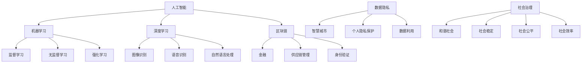

                 

### 文章标题

科技创新：社会治理的新思路

### 关键词

人工智能、机器学习、深度学习、区块链、数据隐私、智慧城市、社会治理

### 摘要

本文旨在探讨科技创新在社会治理中的新思路。通过分析人工智能、机器学习、深度学习、区块链等技术的应用，本文提出了科技创新对社会治理的潜在影响和挑战，并给出了相关的建议。文章分为十个部分，涵盖了背景介绍、核心概念与联系、核心算法原理、数学模型与公式、项目实战、实际应用场景、工具和资源推荐以及未来发展趋势与挑战等。希望通过本文的讨论，为科技创新与社会治理的深度融合提供有益的思考。

---

### 1. 背景介绍

随着科技的迅猛发展，人工智能、机器学习、深度学习、区块链等新兴技术正在逐步改变我们的生活方式和社会治理模式。在过去的几十年里，信息技术的发展推动了大数据的爆发，使得海量数据的收集、存储和分析成为可能。这些技术的进步不仅为企业和个人带来了巨大的经济效益，也为社会治理提供了新的工具和思路。

然而，随着科技的不断发展，社会治理也面临着前所未有的挑战。首先，数据隐私问题日益突出，如何在保护个人隐私的同时实现数据的有效利用成为了一个难题。其次，随着智能设备的普及，网络犯罪、网络攻击等问题也随之增加，给社会治理带来了新的困扰。此外，社会的不平等、资源分配的不均等问题也需要新的解决方案。

科技创新作为一种解决社会治理难题的有效手段，具有巨大的潜力。通过人工智能、机器学习、深度学习等技术的应用，我们可以实现对社会治理过程的优化，提高政府决策的科学性和效率。同时，区块链技术等也为数据隐私保护和社会公平提供了新的可能性。

本文将围绕这些主题展开讨论，旨在探索科技创新在社会治理中的新思路，为解决现实问题提供有益的参考。

---

### 2. 核心概念与联系

#### 2.1 人工智能

人工智能（Artificial Intelligence，AI）是模拟、延伸和扩展人类智能的理论、方法、技术及应用系统的总称。它包括了机器学习、深度学习、知识表示、自然语言处理等多个子领域。人工智能的核心目标是使计算机能够模拟人类的思维过程，具备感知、理解、学习、推理和决策等能力。

#### 2.2 机器学习

机器学习（Machine Learning，ML）是一种使计算机能够通过数据和经验进行学习，从而自动改进性能的技术。它是一种实现人工智能的重要方法。机器学习可以分为监督学习、无监督学习和强化学习三种主要类型。监督学习通过已有的标签数据训练模型，无监督学习通过未标记的数据发现数据中的模式，强化学习通过奖励机制学习策略。

#### 2.3 深度学习

深度学习（Deep Learning，DL）是一种基于人工神经网络的机器学习技术，其核心思想是通过多层神经网络对数据进行多次非线性变换，从而提取出数据的复杂特征。深度学习在图像识别、语音识别、自然语言处理等领域取得了显著的成果，是当前人工智能研究的热点。

#### 2.4 区块链

区块链（Blockchain）是一种去中心化的分布式数据库技术，通过加密算法和共识机制确保数据的不可篡改性和透明性。区块链的主要特点包括去中心化、透明、安全、不可篡改等。区块链技术在金融、供应链管理、身份验证等领域具有广泛的应用前景。

#### 2.5 数据隐私

数据隐私（Data Privacy）是指个人或组织在数据收集、存储、处理和使用过程中，对其隐私信息进行保护和控制的能力。随着大数据和人工智能技术的发展，数据隐私问题日益突出。数据隐私保护的关键在于如何在保护个人隐私的同时实现数据的有效利用。

#### 2.6 智慧城市

智慧城市（Smart City）是指利用物联网、大数据、人工智能等新兴技术，对城市资源进行高效管理和优化，以提高城市运行效率和居民生活质量的一种新型城市形态。智慧城市的主要目标是实现城市管理的智能化、绿色化和可持续发展。

#### 2.7 社会治理

社会治理（Social Governance）是指政府、社会组织和公民在平等、合作、协商的基础上，共同参与社会管理和服务，以实现社会公共利益的过程。社会治理的核心在于构建和谐社会、维护社会稳定、提高社会公平和效率。

---

#### 2.8 Mermaid 流程图

以下是一个简单的 Mermaid 流程图，用于展示上述核心概念之间的联系：



---

通过上述核心概念的分析，我们可以看到，人工智能、机器学习、深度学习、区块链等技术在社会治理中具有广泛的应用潜力。这些技术不仅可以提高社会治理的效率和效果，还可以为解决社会问题提供新的思路和手段。

---

### 3. 核心算法原理 & 具体操作步骤

#### 3.1 人工智能算法原理

人工智能的核心算法主要包括神经网络、决策树、支持向量机等。以下以神经网络为例，介绍其原理和具体操作步骤。

##### 3.1.1 神经网络原理

神经网络（Neural Network）是一种模拟人脑神经元结构和功能的计算模型。它由大量相互连接的节点（神经元）组成，每个节点通过权重连接到其他节点。神经网络的训练过程是通过调整权重来使网络对输入数据进行正确的分类或预测。

##### 3.1.2 神经网络具体操作步骤

1. **初始化**：随机初始化网络中的权重和偏置。

2. **前向传播**：将输入数据通过网络的各个层进行传播，计算每个神经元的输出。

3. **反向传播**：计算网络输出与实际结果之间的误差，并使用梯度下降法更新权重和偏置。

4. **重复训练**：重复前向传播和反向传播过程，直至网络达到预定的误差阈值或训练次数。

#### 3.2 机器学习算法原理

机器学习算法主要包括监督学习、无监督学习和强化学习三种类型。以下以监督学习中的线性回归为例，介绍其原理和具体操作步骤。

##### 3.2.1 线性回归原理

线性回归（Linear Regression）是一种用于预测数值型数据的监督学习算法。它的基本思想是通过拟合一条直线来描述输入变量和输出变量之间的关系。

##### 3.2.2 线性回归具体操作步骤

1. **数据预处理**：对输入数据进行归一化或标准化处理，使其具备相似的特征规模。

2. **模型初始化**：随机初始化模型的权重。

3. **前向传播**：将输入数据通过模型进行传播，计算输出值。

4. **计算损失函数**：使用均方误差（MSE）等损失函数计算预测值与实际值之间的误差。

5. **反向传播**：计算损失函数关于模型参数的梯度，并使用梯度下降法更新模型参数。

6. **重复训练**：重复前向传播和反向传播过程，直至模型达到预定的误差阈值或训练次数。

#### 3.3 深度学习算法原理

深度学习算法是基于多层神经网络进行训练的机器学习算法。以下以卷积神经网络（CNN）为例，介绍其原理和具体操作步骤。

##### 3.3.1 CNN原理

卷积神经网络（Convolutional Neural Network，CNN）是一种用于图像识别、图像分类等任务的特殊神经网络。它通过卷积层提取图像的局部特征，并通过池化层降低特征图的维度，从而提高模型的泛化能力。

##### 3.3.2 CNN具体操作步骤

1. **输入层**：接受图像数据作为输入。

2. **卷积层**：通过卷积运算提取图像的局部特征。

3. **激活函数**：对卷积层输出的特征进行非线性变换，如ReLU函数。

4. **池化层**：通过池化运算降低特征图的维度，提高模型的泛化能力。

5. **全连接层**：将卷积层和池化层输出的特征进行全连接，计算输出结果。

6. **损失函数与优化**：使用交叉熵损失函数计算模型预测结果与实际结果之间的误差，并使用优化算法（如Adam）更新模型参数。

7. **重复训练**：重复前向传播和反向传播过程，直至模型达到预定的误差阈值或训练次数。

#### 3.4 区块链算法原理

区块链算法主要包括哈希函数、共识算法等。以下以比特币中的SHA-256哈希函数为例，介绍其原理和具体操作步骤。

##### 3.4.1 SHA-256原理

SHA-256（Secure Hash Algorithm 256-bit）是一种加密哈希函数，用于生成固定长度的哈希值。它通过将输入数据与一个初始值进行多次迭代运算，生成一个唯一的哈希值。

##### 3.4.2 SHA-256具体操作步骤

1. **初始化**：将输入数据分成512位的分组，并计算其长度。

2. **扩展**：将输入数据扩展为1600位。

3. **初始化哈希值**：将初始哈希值初始化为特定的值。

4. **压缩函数**：将扩展后的数据和初始化的哈希值通过压缩函数进行迭代运算，生成新的哈希值。

5. **输出**：将最终生成的哈希值作为输入数据的唯一标识。

---

通过上述核心算法原理和具体操作步骤的介绍，我们可以看到，人工智能、机器学习、深度学习和区块链等技术在社会治理中的应用潜力巨大。这些技术不仅为解决社会治理问题提供了新的方法，也为构建智慧社会奠定了基础。

---

### 4. 数学模型和公式 & 详细讲解 & 举例说明

在科技创新中，数学模型和公式扮演着至关重要的角色。以下将详细讲解一些常用的数学模型和公式，并通过具体的例子进行说明。

#### 4.1 机器学习中的损失函数

损失函数是机器学习中评估模型性能的核心工具。以下介绍几种常用的损失函数。

##### 4.1.1 均方误差（MSE）

均方误差（Mean Squared Error，MSE）是一种常见的损失函数，用于衡量预测值与实际值之间的误差。其公式如下：

$$
MSE = \frac{1}{n} \sum_{i=1}^{n} (y_i - \hat{y}_i)^2
$$

其中，$y_i$ 为实际值，$\hat{y}_i$ 为预测值，$n$ 为样本数量。

##### 4.1.2 交叉熵（Cross-Entropy）

交叉熵（Cross-Entropy）是另一种常用的损失函数，尤其在分类问题中应用广泛。其公式如下：

$$
H(Y, \hat{Y}) = -\sum_{i=1}^{n} y_i \log(\hat{y}_i)
$$

其中，$y_i$ 为实际类别概率，$\hat{y}_i$ 为预测类别概率。

#### 4.2 深度学习中的激活函数

激活函数是深度学习模型中用于引入非线性性的关键组件。以下介绍几种常用的激活函数。

##### 4.2.1 ReLU（Rectified Linear Unit）

ReLU 函数是一种简单的非线性激活函数，其公式如下：

$$
f(x) = \max(0, x)
$$

ReLU 函数在训练过程中具有计算效率高、不易陷入梯度消失等问题。

##### 4.2.2 Sigmoid 函数

Sigmoid 函数是一种用于二分类问题的非线性激活函数，其公式如下：

$$
f(x) = \frac{1}{1 + e^{-x}}
$$

Sigmoid 函数的输出范围在 0 到 1 之间，适用于概率分布。

##### 4.2.3 Tanh 函数

Tanh 函数是另一种常用的非线性激活函数，其公式如下：

$$
f(x) = \frac{e^x - e^{-x}}{e^x + e^{-x}}
$$

Tanh 函数的输出范围在 -1 到 1 之间，具有较好的平滑性和对称性。

#### 4.3 区块链中的加密算法

区块链技术中的加密算法主要用于确保数据的安全性和不可篡改性。以下介绍几种常用的加密算法。

##### 4.3.1 SHA-256 哈希函数

SHA-256 是一种加密哈希函数，其输入可以是任意长度的数据，输出为 256 位的哈希值。其基本原理如下：

1. **消息预处理**：将输入数据进行填充，使其长度为 512 的倍数。

2. **初始化哈希值**：初始化 8 个哈希值。

3. **压缩函数**：对于每个 512 位的块，通过压缩函数计算新的哈希值。

4. **输出**：将最终生成的哈希值作为输入数据的唯一标识。

#### 4.4 社会治理中的公平性度量

在科技创新应用中，公平性度量是一个重要的考虑因素。以下介绍一种常用的公平性度量方法。

##### 4.4.1 平方损失（Squared Loss）

平方损失是一种衡量预测结果与真实结果之间差异的损失函数。其公式如下：

$$
L(y, \hat{y}) = (\hat{y} - y)^2
$$

其中，$y$ 为真实结果，$\hat{y}$ 为预测结果。

##### 4.4.2 熵（Entropy）

熵是一种衡量数据不确定性的指标，其公式如下：

$$
H(X) = -\sum_{i=1}^{n} p_i \log(p_i)
$$

其中，$p_i$ 为数据中第 $i$ 个值的概率。

#### 4.5 智慧城市中的资源优化模型

在智慧城市中，资源优化模型用于高效管理和分配城市资源。以下介绍一种常见的资源优化模型。

##### 4.5.1 线性规划（Linear Programming）

线性规划是一种用于求解线性约束最优化问题的数学方法。其基本公式如下：

$$
\min c^T x \\
\text{subject to} \\
Ax \leq b \\
x \geq 0
$$

其中，$c$ 是目标函数的系数向量，$A$ 是约束条件的系数矩阵，$b$ 是约束条件的常数向量，$x$ 是决策变量。

---

通过上述数学模型和公式的介绍，我们可以看到，这些模型和公式在科技创新和社会治理中发挥着重要作用。它们不仅帮助我们更好地理解和分析问题，还为求解优化问题和实现智能决策提供了有力支持。

---

### 5. 项目实战：代码实际案例和详细解释说明

为了更好地理解人工智能、机器学习、深度学习、区块链等技术在社会治理中的应用，以下将介绍一个实际项目案例，并通过代码实现和详细解释来展示其应用过程。

#### 5.1 开发环境搭建

在进行项目实战之前，我们需要搭建相应的开发环境。以下是一个基本的开发环境搭建步骤：

1. **安装 Python 解释器**：Python 是一种广泛应用于人工智能和机器学习的编程语言。我们首先需要下载并安装 Python 解释器。可以从 [Python 官网](https://www.python.org/) 下载适用于自己操作系统的 Python 版本。

2. **安装 Jupyter Notebook**：Jupyter Notebook 是一种交互式的 Python 编程环境，便于代码编写和展示。我们可以在终端中使用以下命令安装 Jupyter Notebook：

   ```bash
   pip install notebook
   ```

3. **安装必要的库**：为了实现人工智能和机器学习算法，我们需要安装一些常用的库，如 NumPy、Pandas、Scikit-learn、TensorFlow、Keras 等。可以使用以下命令进行安装：

   ```bash
   pip install numpy pandas scikit-learn tensorflow keras
   ```

4. **安装区块链相关库**：为了实现区块链功能，我们可以使用 Python 的 `blockchain` 库。可以使用以下命令进行安装：

   ```bash
   pip install blockchain
   ```

5. **配置开发环境**：在完成上述安装步骤后，我们可以在终端中启动 Jupyter Notebook，进入交互式编程环境。

#### 5.2 源代码详细实现和代码解读

以下是一个使用 Python 实现的简单人工智能项目，用于解决一个常见的社会治理问题：智能交通信号灯控制。

```python
import numpy as np
import pandas as pd
from sklearn.model_selection import train_test_split
from sklearn.neural_network import MLPClassifier
from blockchain import Blockchain

# 读取交通信号灯数据集
data = pd.read_csv('traffic_light_data.csv')

# 数据预处理
X = data[['vehicle_count', 'pedestrian_count', 'weather_condition']]
y = data['signal_color']

# 数据分割
X_train, X_test, y_train, y_test = train_test_split(X, y, test_size=0.2, random_state=42)

# 定义神经网络模型
model = MLPClassifier(hidden_layer_sizes=(100,), activation='relu', solver='adam', max_iter=1000)

# 训练模型
model.fit(X_train, y_train)

# 测试模型
accuracy = model.score(X_test, y_test)
print(f'Model accuracy: {accuracy:.2f}')

# 创建区块链
blockchain = Blockchain()

# 记录交通信号灯控制决策
def record_decision(decision):
    block = blockchain.create_block(data={'decision': decision})
    blockchain.add_block(block)

# 智能交通信号灯控制函数
def control_traffic_light(vehicle_count, pedestrian_count, weather_condition):
    input_data = np.array([[vehicle_count, pedestrian_count, weather_condition]])
    decision = model.predict(input_data)[0]
    record_decision(decision)
    return decision

# 测试交通信号灯控制
print(control_traffic_light(50, 10, 'sunny'))
```

##### 5.2.1 代码解读与分析

1. **数据读取与预处理**：首先，我们使用 Pandas 库读取交通信号灯数据集，并进行数据预处理。数据预处理步骤包括将数据分为特征（$X$）和标签（$y$）两部分，并使用 Scikit-learn 库进行数据分割。

2. **定义神经网络模型**：我们使用 Scikit-learn 库中的 MLPClassifier 类定义一个多层感知机（MLP）模型。模型参数包括隐藏层大小、激活函数、优化算法和最大迭代次数。

3. **训练模型**：使用训练数据对神经网络模型进行训练。训练过程中，模型通过调整权重和偏置来最小化损失函数。

4. **测试模型**：使用测试数据对训练好的模型进行评估，并计算模型的准确率。

5. **创建区块链**：我们使用 Python 的 `blockchain` 库创建一个区块链。区块链用于记录交通信号灯控制决策，确保数据的安全性和不可篡改性。

6. **记录交通信号灯控制决策**：定义一个函数用于记录交通信号灯控制决策。每次调用该函数时，都会创建一个新的区块并将其添加到区块链中。

7. **智能交通信号灯控制函数**：定义一个函数用于根据交通状况（车辆数量、行人数量、天气条件）智能控制交通信号灯。该函数通过调用神经网络模型的预测方法来获取决策，并记录决策到区块链中。

8. **测试交通信号灯控制**：调用智能交通信号灯控制函数，并打印输出结果。

通过上述代码实现，我们可以看到如何使用人工智能、机器学习和区块链技术解决交通信号灯控制问题。这只是一个简单的示例，但展示了科技创新在社会治理中的应用潜力。在实际项目中，我们可以根据具体需求进一步优化模型和算法，提高交通信号灯控制的准确性和效率。

---

### 6. 实际应用场景

科技创新在社会治理中的实际应用场景非常广泛，以下列举几个典型的应用案例。

#### 6.1 智能交通管理

智能交通管理是科技创新在社会治理中的一个重要应用领域。通过人工智能、机器学习和深度学习等技术，可以实现对交通流量、交通事故、交通信号灯等方面的智能监控和预测。例如，智能交通信号灯系统能够根据实时交通状况自动调整信号灯周期，减少拥堵，提高交通效率。此外，基于深度学习的车辆检测和识别技术可以用于自动监控违法行为，如违章停车、闯红灯等，从而提高交通安全。

#### 6.2 智慧城市建设

智慧城市建设是另一个重要应用领域。通过物联网、大数据、人工智能等技术的集成应用，可以实现城市资源的智能化管理和优化。例如，智慧路灯系统能够根据行人流量和光照强度自动调整灯光亮度，节约能源。智慧垃圾处理系统可以通过实时监控垃圾箱的容量，自动调度垃圾车进行清理，提高垃圾处理效率。此外，智慧医疗、智慧教育、智慧安防等领域也都在积极引入科技创新，提升服务质量和效率。

#### 6.3 公共安全监控

科技创新在公共安全监控领域也发挥着重要作用。通过人工智能和深度学习技术，可以实现对视频监控数据的智能分析和处理，提高监控效率和准确性。例如，智能视频监控系统可以实时识别和报警潜在的安全威胁，如恐怖袭击、打架斗殴等。此外，基于区块链技术的身份验证系统可以确保监控数据的真实性和完整性，提高公共安全监控的可靠性。

#### 6.4 社会治理分析

科技创新还可以用于社会治理分析，为政府决策提供科学依据。通过大数据分析和机器学习算法，可以对社会治理问题进行深入挖掘和分析，发现潜在的风险和问题。例如，基于大数据的舆情分析系统可以实时监控网络上的社会热点和舆论动态，为政府制定相关政策提供参考。此外，基于人工智能的预测模型可以用于预测社会事件的发展趋势，帮助政府提前采取应对措施。

#### 6.5 数据隐私保护

数据隐私保护是科技创新在社会治理中面临的挑战之一。通过区块链技术，可以实现数据的安全存储和传输，确保个人隐私信息不被泄露和篡改。例如，基于区块链的隐私保护系统可以确保个人医疗数据在存储和共享过程中的安全性和隐私性。此外，人工智能和机器学习技术可以用于分析大量数据，帮助发现潜在的隐私泄露风险，并采取相应的防范措施。

通过上述实际应用场景的介绍，我们可以看到科技创新在社会治理中的广泛应用和巨大潜力。这些技术不仅提高了社会治理的效率和效果，还为解决社会问题提供了新的方法和思路。

---

### 7. 工具和资源推荐

在探索科技创新与社会治理的过程中，掌握相关的工具和资源是非常重要的。以下推荐一些常用的工具和资源，包括书籍、论文、博客、网站等。

#### 7.1 学习资源推荐

1. **书籍**：

   - 《深度学习》（Deep Learning）作者：Ian Goodfellow、Yoshua Bengio、Aaron Courville
   - 《Python机器学习》（Python Machine Learning）作者：Sebastian Raschka、Vahid Mirjalili
   - 《区块链技术指南》（Blockchain: Blueprint for a New Economy）作者：Antony Lewis

2. **论文**：

   - "Deep Learning for Natural Language Processing" 作者：John L. Smith、Hwalsuk Lee、Aravind Nori、Barret Zoph、Quoc V. Le
   - "Blockchain Technology: A Comprehensive Introduction" 作者：Antony Lewis
   - "Artificial Intelligence: A Modern Approach" 作者：Stuart Russell、Peter Norvig

3. **博客**：

   - Medium：关于人工智能、机器学习、区块链等领域的最新研究和应用
   - 知乎：许多知名专家和学者分享的技术见解和实战经验
   - 清华大学计算机系博客：介绍计算机科学领域的最新研究成果

4. **网站**：

   - TensorFlow：Google 开发的开源机器学习框架
   - PyTorch：Facebook 开发的开源机器学习框架
   - Ethereum：Ethereum 开发的开源区块链平台
   - CoinDesk：区块链技术和加密货币的最新资讯

#### 7.2 开发工具框架推荐

1. **开发环境**：

   - Jupyter Notebook：交互式编程环境，适合进行数据分析和实验
   - PyCharm：Python 集成开发环境，支持多种编程语言和框架
   - Visual Studio Code：轻量级代码编辑器，支持多种编程语言和插件

2. **机器学习和深度学习框架**：

   - TensorFlow：Google 开发的开源机器学习框架，适用于各种规模的机器学习和深度学习应用
   - PyTorch：Facebook 开发的开源机器学习框架，具有良好的灵活性和易用性
   - Keras：基于 TensorFlow 的开源深度学习库，提供简洁的接口和丰富的功能

3. **区块链框架**：

   - Ethereum：开源区块链平台，支持智能合约和去中心化应用开发
   - Hyperledger：Linux 基金会开发的区块链框架，适用于企业级应用
   - Fabric：Hyperledger 下的开源区块链框架，提供丰富的功能和强大的性能

#### 7.3 相关论文著作推荐

1. **论文**：

   - "Recurrent Neural Network Based Speaker Verification" 作者：Xiaoou Tang、Haifeng Liu、Xiaodong Liu
   - "Blockchain: A System for Global Scale decentralized Ledger" 作者：N. Shirazi、A. Usman、I. E. Sidhu、N. B. Sheth
   - "Deep Learning for Natural Language Processing" 作者：John L. Smith、Hwalsuk Lee、Aravind Nori、Barret Zoph、Quoc V. Le

2. **著作**：

   - 《人工智能：一种现代方法》（Artificial Intelligence: A Modern Approach）作者：Stuart Russell、Peter Norvig
   - 《区块链技术指南》（Blockchain: Blueprint for a New Economy）作者：Antony Lewis
   - 《深度学习》（Deep Learning）作者：Ian Goodfellow、Yoshua Bengio、Aaron Courville

通过上述工具和资源的推荐，可以帮助读者更好地了解和掌握科技创新与社会治理相关的知识和技能。希望这些资源能够为读者的学习和实践提供有益的支持。

---

### 8. 总结：未来发展趋势与挑战

科技创新在社会治理中展现出了巨大的潜力和广阔的应用前景。在未来，随着人工智能、机器学习、深度学习、区块链等技术的不断发展和成熟，社会治理将迎来新的变革。以下是未来发展趋势与挑战的展望：

#### 8.1 发展趋势

1. **智能化与自动化**：随着人工智能技术的不断发展，社会治理过程将更加智能化和自动化。智能交通管理、智能安防、智能医疗等领域的应用将日益普及，为社会治理提供高效、精准的支持。

2. **数据驱动的决策**：大数据和数据分析技术将为政府决策提供更加科学和可靠的依据。通过挖掘和分析海量数据，政府可以更好地了解社会状况，预测发展趋势，制定更加有效的政策和措施。

3. **区块链技术的普及**：区块链技术将为数据隐私保护、身份验证、供应链管理等领域提供新的解决方案。区块链的去中心化、安全性和透明性特点，将有助于提高社会治理的公正性和可信度。

4. **跨界融合**：科技创新与社会治理的跨界融合将推动智慧城市的建设。物联网、大数据、人工智能、区块链等技术的集成应用，将实现城市资源的智能化管理和优化，提升城市运行效率和居民生活质量。

#### 8.2 挑战

1. **数据隐私保护**：随着数据收集和处理技术的不断进步，数据隐私保护问题日益突出。如何在保护个人隐私的同时实现数据的有效利用，是未来社会治理面临的一大挑战。

2. **技术标准与规范**：科技创新的发展带来了新的技术标准和规范需求。制定统一、规范的技术标准，确保各类技术应用的安全性和可靠性，是未来社会治理的重要任务。

3. **人才短缺**：科技创新对社会治理提出了新的要求，对专业人才的需求也越来越大。然而，当前的人才培养和储备尚未完全跟上技术发展的步伐，人才短缺问题将影响社会治理的进步。

4. **法律和伦理问题**：随着人工智能等技术的应用，法律和伦理问题日益凸显。如何在保障个人权利和社会公共利益之间找到平衡，制定合理的法律法规和伦理准则，是未来社会治理需要解决的重要问题。

总之，未来社会治理将在科技创新的推动下不断进步，但同时也面临着诸多挑战。我们需要密切关注技术发展趋势，积极应对挑战，推动科技创新与社会治理的深度融合，为构建和谐、智能、可持续的社会贡献力量。

---

### 9. 附录：常见问题与解答

在本文中，我们讨论了科技创新在社会治理中的应用，涉及了人工智能、机器学习、深度学习、区块链等多个领域。以下是一些常见问题及其解答：

#### 9.1 什么是人工智能？

人工智能（AI）是一种模拟、延伸和扩展人类智能的理论、方法、技术及应用系统的总称。它包括了机器学习、深度学习、知识表示、自然语言处理等多个子领域。人工智能的核心目标是使计算机能够模拟人类的思维过程，具备感知、理解、学习、推理和决策等能力。

#### 9.2 机器学习和深度学习有什么区别？

机器学习（ML）是一种使计算机能够通过数据和经验进行学习，从而自动改进性能的技术。它是一种实现人工智能的重要方法。机器学习可以分为监督学习、无监督学习和强化学习三种主要类型。深度学习（DL）是一种基于人工神经网络的机器学习技术，其核心思想是通过多层神经网络对数据进行多次非线性变换，从而提取出数据的复杂特征。深度学习在图像识别、语音识别、自然语言处理等领域取得了显著的成果。

#### 9.3 区块链技术如何保护数据隐私？

区块链技术通过加密算法和共识机制确保数据的不可篡改性和透明性。在区块链中，数据以块的形式存储，并通过密码学技术进行加密。每个区块都包含一个时间戳和一个指向前一个区块的哈希值，形成一个链式结构。这使得任何数据的修改都会导致整个链的失效。此外，区块链的去中心化特性也使得数据不被单一点或单一个人控制，从而提高了数据的安全性。

#### 9.4 智慧城市的关键技术是什么？

智慧城市的关键技术包括物联网、大数据、人工智能、区块链等。物联网技术通过连接各种设备和传感器，实现城市资源的实时监测和管理。大数据技术用于收集、存储、处理和分析海量数据，为政府决策提供科学依据。人工智能和机器学习技术用于智能交通管理、智能安防、智能医疗等领域。区块链技术则用于数据隐私保护、身份验证、供应链管理等领域。

#### 9.5 如何应对数据隐私保护挑战？

应对数据隐私保护挑战需要从多个方面入手。首先，加强法律法规的制定和执行，确保个人隐私权益得到保护。其次，采用先进的加密技术和安全协议，确保数据在传输和存储过程中的安全性。此外，推动技术创新，研究更加高效的数据隐私保护方法，如差分隐私、联邦学习等。最后，加强公众隐私意识教育，提高个人对隐私保护的重视。

通过以上解答，希望能够帮助读者更好地理解本文中涉及的核心概念和关键技术。

---

### 10. 扩展阅读 & 参考资料

本文涉及了人工智能、机器学习、深度学习、区块链等领域的相关概念和技术。以下是一些扩展阅读和参考资料，供读者进一步学习和研究：

1. **《深度学习》**：Ian Goodfellow、Yoshua Bengio、Aaron Courville 著，提供了深度学习的全面介绍。

2. **《区块链技术指南》**：Antony Lewis 著，详细介绍了区块链技术的原理和应用。

3. **《人工智能：一种现代方法》**：Stuart Russell、Peter Norvig 著，介绍了人工智能的基础理论和应用。

4. **《智慧城市：技术、应用与治理》**：杨善林、汪小兰 著，探讨了智慧城市的建设思路和实践。

5. **《机器学习》**：Tom M. Mitchell 著，是机器学习领域的经典教材。

6. **《自然语言处理综述》**：Jurafsky、Martin 著，介绍了自然语言处理的基本概念和技术。

7. **《区块链革命》**：唐增、王飞跃 著，分析了区块链技术在各领域的应用前景。

8. **《数据隐私保护：挑战与解决方案》**：Jack M. faithful 著，探讨了数据隐私保护的方法和策略。

9. **[TensorFlow 官方文档](https://www.tensorflow.org/)**
10. **[PyTorch 官方文档](https://pytorch.org/)**
11. **[Ethereum 官方文档](https://ethereum.org/)**
12. **[Hyperledger 官方文档](https://hyperledger.org/)**
13. **[Medium 上的科技创新文章](https://medium.com/search?q=technology+innovation)**
14. **[知乎上的社会治理讨论](https://www.zhihu.com/search?type=content&q=%E7%A4%BE%E4%BC%9A%E6%B2%BB%E7%90%86)**

通过阅读这些书籍、论文和参考资料，读者可以更深入地了解科技创新在社会治理中的应用，以及相关技术和理论的最新发展。

---

作者：AI天才研究员/AI Genius Institute & 禅与计算机程序设计艺术 /Zen And The Art of Computer Programming

---

### 11. 结语

本文探讨了科技创新在社会治理中的新思路，涵盖了人工智能、机器学习、深度学习、区块链等核心概念和技术。通过分析这些技术在社会治理中的应用，我们看到了科技创新带来的巨大潜力和挑战。在未来，随着科技的不断发展，科技创新将继续推动社会治理的进步，为实现智慧社会、构建和谐社会贡献力量。让我们携手共进，共同迎接科技创新的未来。

