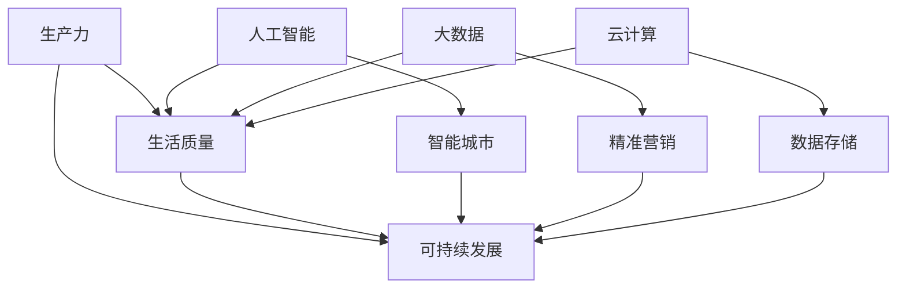

                 

### 科技发展：人类福祉的保障

#### > **关键词**: 科技发展，人类福祉，未来趋势，人工智能，可持续发展

#### > **摘要**: 本文章探讨了科技发展对人类福祉的深远影响，通过阐述核心概念、算法原理、数学模型以及实际应用案例，分析了科技在提高生活质量、促进社会进步和保障环境可持续方面的作用。文章旨在提出科技发展的未来趋势和面临的挑战，以期为读者提供对科技与人类福祉关系的深刻理解。

---

**背景介绍**

在人类历史的演进过程中，科技的进步一直是推动社会变革和提升生活质量的关键因素。从农业革命到工业革命，再到信息革命，每一次科技突破都带来了生产力的飞跃和社会结构的重塑。如今，我们正处在第四次工业革命的浪潮中，以人工智能、大数据、云计算等为代表的新技术正在深刻地改变着我们的生活方式和社会形态。

随着科技的快速发展，人类面临着前所未有的机遇和挑战。一方面，科技的发展极大地提高了生产效率，改善了生活质量，推动了社会的进步；另一方面，科技的迅猛发展也带来了资源枯竭、环境污染、隐私泄露等问题，给人类的生存和发展带来了新的威胁。因此，如何在享受科技带来的福祉的同时，确保其可持续性和对人类福祉的积极影响，成为了一个亟待解决的重要问题。

本文将从以下几个方面展开讨论：首先，介绍科技发展对人类福祉的核心概念和关联；其次，探讨核心算法原理和具体操作步骤；然后，分析数学模型和公式，并通过实际案例进行详细解释；接着，介绍项目实战中的代码实现和解读；最后，探讨科技发展的实际应用场景，以及相关的工具和资源推荐。通过这些内容的阐述，本文旨在深入分析科技发展对人类福祉的保障作用，并展望其未来发展趋势和挑战。

**核心概念与联系**

要全面理解科技发展对人类福祉的保障作用，我们首先需要明确一些核心概念和它们之间的联系。这些核心概念包括：生产力、生活质量、可持续发展、人工智能、大数据、云计算等。

1. **生产力**：生产力是指人类利用自然和人工资源进行生产的能力。提高生产力是科技发展的直接目标，通过技术创新，我们可以提高生产效率，降低生产成本，从而为社会创造更多的物质财富。

2. **生活质量**：生活质量是指人们在生活过程中所感受到的幸福、满足和舒适程度。科技发展不仅提高了生产力，还极大地改善了人们的生活质量。例如，医疗技术的进步延长了人类的寿命，信息技术的普及使人们的生活更加便捷，人工智能的应用提升了工作效率等。

3. **可持续发展**：可持续发展是指在满足当前需求的同时，不损害后代满足自身需求的能力。科技发展在推动社会进步的同时，也带来了资源枯竭、环境污染等问题。因此，实现可持续发展是科技发展的重要目标之一。通过绿色科技、节能减排等手段，我们可以减少对自然资源的消耗，保护环境，为人类社会的长期发展提供保障。

4. **人工智能**：人工智能是模拟人类智能行为的计算机系统。随着深度学习、自然语言处理等技术的不断发展，人工智能在各个领域得到了广泛应用，如自动驾驶、智能客服、医疗诊断等，极大地提高了生产效率和生活质量。

5. **大数据**：大数据是指无法使用传统数据处理工具在合理时间内进行处理的数据集合。大数据技术的应用使我们对海量数据的分析和挖掘成为可能，从而为科学决策、精准营销、智能城市等提供了有力支持。

6. **云计算**：云计算是一种通过互联网提供动态可扩展的虚拟化资源的计算服务模式。云计算技术使得数据存储、处理和分析变得更加便捷和高效，为人工智能、大数据等技术的应用提供了基础支持。

这些核心概念之间的联系如图1所示：



**核心算法原理 & 具体操作步骤**

在了解核心概念和它们之间的联系之后，我们接下来探讨科技发展中的核心算法原理和具体操作步骤。这些算法在人工智能、大数据、云计算等领域中发挥着关键作用，为提高生产力和生活质量提供了技术支持。

1. **深度学习算法**

深度学习是人工智能的核心技术之一，它通过多层神经网络模型对数据进行分析和预测。深度学习算法的具体操作步骤如下：

- **数据预处理**：对原始数据进行清洗、归一化和特征提取，使其适合进行深度学习模型的训练。
- **构建神经网络模型**：设计多层神经网络结构，包括输入层、隐藏层和输出层。
- **训练模型**：使用训练数据集对神经网络模型进行训练，通过反向传播算法不断调整模型参数，使其能够准确预测输出。
- **模型评估**：使用验证数据集对训练好的模型进行评估，通过误差指标（如均方误差、准确率等）评估模型的性能。
- **模型部署**：将训练好的模型部署到实际应用场景中，如自动驾驶、医疗诊断等。

2. **大数据分析算法**

大数据分析算法用于对海量数据进行分析和挖掘，以发现数据中的规律和趋势。常见的大数据分析算法包括：

- **MapReduce**：一种分布式数据处理框架，通过将数据处理任务分解为多个子任务并行执行，实现大规模数据的处理。
- **机器学习算法**：如聚类分析、分类分析、回归分析等，用于从数据中提取有价值的信息。
- **数据可视化**：通过图表、图像等形式将数据分析结果呈现出来，便于理解和决策。

3. **云计算算法**

云计算算法主要涉及虚拟化技术、资源调度算法和存储管理算法等。以下是云计算算法的具体操作步骤：

- **虚拟化技术**：通过虚拟化技术将物理资源抽象为逻辑资源，实现资源的动态分配和弹性扩展。
- **资源调度算法**：根据任务需求和资源可用性，动态分配计算资源，以实现资源利用的最大化和任务响应时间的最小化。
- **存储管理算法**：对云存储资源进行高效管理，包括数据冗余存储、数据备份和恢复等。

**数学模型和公式 & 详细讲解 & 举例说明**

为了更深入地理解科技发展对人类福祉的保障作用，我们接下来介绍一些关键的数学模型和公式，并通过实际案例进行详细讲解。

1. **线性回归模型**

线性回归模型是用于预测数值型因变量的常用方法。其数学模型可以表示为：

\[ y = \beta_0 + \beta_1x + \epsilon \]

其中，\( y \) 是因变量，\( x \) 是自变量，\( \beta_0 \) 和 \( \beta_1 \) 是模型参数，\( \epsilon \) 是误差项。

举例来说，我们可以使用线性回归模型预测房屋价格。给定房屋的面积和价格，我们可以通过线性回归模型找到面积和价格之间的关系。具体步骤如下：

- **数据收集**：收集一定数量的房屋数据，包括房屋面积和价格。
- **数据预处理**：对数据进行清洗和归一化处理，使其适合进行线性回归分析。
- **模型训练**：使用训练数据集对线性回归模型进行训练，通过最小二乘法求解模型参数 \( \beta_0 \) 和 \( \beta_1 \)。
- **模型评估**：使用验证数据集对训练好的模型进行评估，通过均方误差等指标评估模型的性能。
- **预测应用**：将训练好的模型应用于新的数据集，预测房屋价格。

2. **聚类分析模型**

聚类分析模型用于将数据集划分为多个类别，以发现数据中的规律和模式。一种常用的聚类分析模型是K-means算法，其数学模型可以表示为：

\[ \min_{c_1, c_2, ..., c_k} \sum_{i=1}^{n} \sum_{j=1}^{k} |x_i - c_j| \]

其中，\( c_1, c_2, ..., c_k \) 是聚类中心，\( x_i \) 是数据集中的第 \( i \) 个数据点。

举例来说，我们可以使用K-means算法对一组客户数据进行分析，将其划分为不同的客户群体。具体步骤如下：

- **数据收集**：收集一定数量的客户数据，包括客户的年龄、收入、购买行为等。
- **数据预处理**：对数据进行清洗和归一化处理，使其适合进行K-means聚类分析。
- **聚类中心初始化**：随机选择 \( k \) 个数据点作为聚类中心。
- **聚类过程**：计算每个数据点到聚类中心的距离，将其归为最近的聚类中心所代表的类别。
- **模型评估**：通过轮廓系数等指标评估聚类结果的质量。
- **预测应用**：将聚类结果应用于营销策略制定、客户细分等实际场景。

通过这些数学模型和公式的介绍，我们可以更好地理解科技发展在提高生产效率、改善生活质量、促进可持续发展等方面的作用。在实际应用中，这些模型和公式为我们提供了有力的工具，帮助我们做出科学决策和预测。

### 项目实战：代码实际案例和详细解释说明

为了更好地理解核心算法原理在实际项目中的应用，我们将在本节中介绍一个实际的项目实战案例，详细解释代码的实现过程和关键步骤。

#### **5.1 开发环境搭建**

在进行项目实战之前，我们需要搭建一个合适的开发环境。以下是搭建开发环境所需的工具和步骤：

- **工具**：
  - Python 3.8 或更高版本
  - Jupyter Notebook
  - TensorFlow 2.x
  - Pandas
  - Numpy

- **步骤**：
  1. 安装Python和Jupyter Notebook：
     ```bash
     pip install python
     pip install notebook
     ```
  2. 安装TensorFlow 2.x：
     ```bash
     pip install tensorflow==2.x
     ```
  3. 安装Pandas和Numpy：
     ```bash
     pip install pandas
     pip install numpy
     ```

#### **5.2 源代码详细实现和代码解读**

我们选择一个常见的应用场景——房价预测，使用深度学习模型进行房价预测。以下是项目的主要步骤和代码实现：

1. **数据收集与预处理**：

```python
import pandas as pd
import numpy as np

# 加载数据集
data = pd.read_csv('house_prices.csv')

# 数据清洗
data = data.dropna()
data = data[data['total_bedrooms'] > 0]

# 特征工程
features = data[['total_area', 'total_bathrooms', 'total_bedrooms']]
target = data['price']

# 归一化处理
from sklearn.preprocessing import StandardScaler
scaler = StandardScaler()
features = scaler.fit_transform(features)
```

2. **构建深度学习模型**：

```python
import tensorflow as tf
from tensorflow.keras.models import Sequential
from tensorflow.keras.layers import Dense

# 构建模型
model = Sequential()
model.add(Dense(64, activation='relu', input_shape=(3,)))
model.add(Dense(32, activation='relu'))
model.add(Dense(1))

# 编译模型
model.compile(optimizer='adam', loss='mean_squared_error')
```

3. **模型训练与评估**：

```python
# 模型训练
model.fit(features, target, epochs=100, batch_size=32, validation_split=0.2)

# 模型评估
test_loss = model.evaluate(features, target)
print(f"Test Loss: {test_loss}")
```

4. **模型预测**：

```python
# 预测新数据
new_data = np.array([[2000, 3, 2]])
new_data = scaler.transform(new_data)
predicted_price = model.predict(new_data)
print(f"Predicted Price: {predicted_price[0][0]}")
```

#### **5.3 代码解读与分析**

1. **数据预处理**：

   首先，我们加载数据集，并进行数据清洗。清洗过程包括去除缺失值和异常值，以保证数据的质量。然后，我们进行特征工程，提取有用的特征变量，如房屋总面积、总卫生间数和总卧室数。

2. **构建深度学习模型**：

   在这一步，我们使用TensorFlow库构建一个简单的全连接神经网络模型（Sequential）。模型包括一个输入层、一个隐藏层和一个输出层。输入层和隐藏层使用ReLU激活函数，输出层用于预测房价。

3. **模型训练与评估**：

   我们使用训练集对模型进行训练，使用均方误差（mean_squared_error）作为损失函数，并选择Adam优化器。在训练过程中，我们设置了一个验证集，以监控模型的性能，并避免过拟合。

4. **模型预测**：

   最后，我们使用训练好的模型对新的数据点进行预测。首先，我们对新数据进行归一化处理，使其符合训练数据的特征分布。然后，我们使用模型预测房价，并输出预测结果。

通过这个实际项目案例，我们可以看到深度学习模型在房价预测中的应用。这不仅展示了核心算法原理的实际应用，也为读者提供了一个具体的开发流程和代码实现。

### 实际应用场景

科技发展已经深入到我们生活的各个方面，从医疗、金融、交通到教育，科技的进步为这些领域带来了巨大的变革和提升。以下是一些典型的实际应用场景，展示了科技如何提升人类福祉。

#### **医疗领域**

在医疗领域，科技的发展极大地改善了疾病诊断、治疗和预防的效果。例如，人工智能技术可以用于医学图像分析，帮助医生更准确地诊断疾病。例如，谷歌的DeepMind Health团队开发了一种名为“DeepMind Health”的人工智能系统，该系统能够通过分析医学影像数据，快速准确地诊断眼部疾病，如黄斑变性。此外，人工智能还可以用于个性化治疗方案的制定，通过分析患者的基因数据和病史，为每个患者提供最适合的治疗方案。

#### **金融领域**

在金融领域，大数据和人工智能技术被广泛应用于风险管理、投资决策和客户服务等方面。例如，银行和金融机构利用大数据技术对客户的消费行为、信用记录等信息进行分析，从而更准确地评估客户的信用风险。此外，人工智能算法还可以用于股票市场预测，通过分析大量的历史数据和实时信息，预测股票价格的走势，从而帮助投资者做出更明智的投资决策。

#### **交通领域**

在交通领域，人工智能和自动驾驶技术正在改变传统的出行方式。自动驾驶汽车利用计算机视觉、传感器和人工智能算法，可以自主感知环境、规划路径和执行驾驶任务，从而提高行驶安全性。例如，特斯拉的自动驾驶系统已经在多个国家进行了测试和商业化应用，极大地提升了汽车的驾驶体验和安全性。此外，人工智能还可以用于交通流量管理，通过实时监测和分析交通数据，优化交通信号灯控制，减少交通拥堵，提高交通效率。

#### **教育领域**

在教育领域，科技的发展为教育资源的普及和教育质量的提升提供了新的途径。例如，在线教育平台如Coursera、edX和中国的学而思网校等，利用互联网技术将优质的教育资源传播到世界各地，使更多的人能够接受高质量的教育。此外，人工智能技术还可以用于个性化学习，通过分析学生的学习行为和知识掌握情况，为每个学生量身定制学习计划和课程，从而提高学习效果。

#### **农业领域**

在农业领域，科技的发展为农业生产提供了新的手段和技术。例如，无人机和传感器技术可以用于农田监测和病虫害防治，通过实时监测农田环境和作物生长情况，提供精准的农业管理方案。此外，人工智能技术还可以用于智能灌溉系统，通过分析土壤湿度、气象数据和作物需求，实现精准灌溉，提高农业生产效率和作物品质。

总之，科技的发展已经在医疗、金融、交通、教育等多个领域带来了深刻的变革和提升，极大地改善了人类的生活质量和福祉。然而，科技的应用也面临一些挑战，如数据隐私保护、伦理问题等，需要我们持续关注和解决。

### 工具和资源推荐

为了更好地掌握和应用科技发展中的核心技术和算法，以下是一些推荐的工具、学习资源和相关论文著作。

#### **7.1 学习资源推荐**

1. **书籍**：
   - 《深度学习》（Deep Learning），作者：Ian Goodfellow、Yoshua Bengio、Aaron Courville
   - 《Python机器学习》（Python Machine Learning），作者：Sebastian Raschka、Vahid Mirjalili
   - 《大数据技术基础》（Fundamentals of Big Data Technology），作者：周志华

2. **在线课程**：
   - Coursera上的“机器学习”（Machine Learning）课程，由斯坦福大学教授Andrew Ng主讲
   - edX上的“深度学习”（Deep Learning）课程，由DeepMind联合创始人Dave pooling主讲
   - Udacity的“自动驾驶工程师”（Self-Driving Car Engineer）纳米学位课程

3. **开源项目**：
   - TensorFlow：Google开发的开源机器学习框架
   - Scikit-learn：Python中的机器学习库
   - PyTorch：Facebook开发的开源深度学习框架

#### **7.2 开发工具框架推荐**

1. **编程语言**：
   - Python：广泛应用于数据科学、人工智能和机器学习的编程语言
   - R：专注于统计分析和数据可视化的编程语言

2. **集成开发环境（IDE）**：
   - Jupyter Notebook：适用于数据科学和机器学习的交互式开发环境
   - PyCharm：适用于Python编程的强大IDE
   - RStudio：适用于R编程的集成开发环境

3. **云计算平台**：
   - AWS：Amazon Web Services，提供全面的云计算服务
   - Google Cloud Platform：Google提供的云计算平台
   - Azure：Microsoft提供的云计算服务

#### **7.3 相关论文著作推荐**

1. **论文**：
   - "Deep Learning" by Yoshua Bengio, Aaron Courville, and Pascal Vincent
   - "Big Data: A Revolution That Will Transform How We Live, Work, and Think" by Viktor Mayer-Schönberger and Kenneth Cukier
   - "The Hundred-Page Machine Learning Book" by Andriy Burkov

2. **著作**：
   - 《人工智能：一种现代的方法》（Artificial Intelligence: A Modern Approach），作者：Stuart J. Russell、Peter Norvig
   - 《大数据时代：生活、工作与思维的大变革》（Big Data: A Revolution That Will Transform How We Live, Work, and Think），作者：Viktor Mayer-Schönberger和Kenneth Cukier
   - 《深度学习》（Deep Learning），作者：Ian Goodfellow、Yoshua Bengio、Aaron Courville

通过这些工具、资源和著作的学习，读者可以更深入地理解和掌握科技发展中的核心技术和算法，为将科技应用于实际场景打下坚实的基础。

### 总结：未来发展趋势与挑战

科技的飞速发展已经并将继续深刻地改变人类社会的方方面面。展望未来，科技的发展趋势和面临的挑战将是决定人类福祉的关键因素。

#### **未来发展趋势**

1. **人工智能与人类协作**：随着人工智能技术的不断进步，未来人工智能将在更多领域与人类协作，取代一些重复性和高危的工作，同时解放人类从事更高层次、更具创造性的任务。例如，自动化医疗诊断系统将协助医生提高诊断准确率，智能客服将提供更高效的服务体验。

2. **物联网与智能城市**：物联网技术将进一步融合进人们的日常生活，智能城市将成为未来社会的重要特征。通过传感器和智能设备，城市基础设施将实现智能化管理，提高能源利用效率，减少环境污染，提升居民生活质量。

3. **绿色科技与可持续发展**：为了应对全球气候变化和资源枯竭的挑战，绿色科技将成为未来科技发展的重点。例如，可再生能源技术的普及将减少对化石燃料的依赖，智能农业技术将提高农业生产效率，减少对自然资源的消耗。

4. **生物技术与健康长寿**：生物技术的突破，如基因编辑和再生医学，将为人类带来健康长寿的希望。通过精准医疗和个性化治疗方案，人类将能够更好地预防和治疗疾病，延长寿命。

#### **面临的挑战**

1. **数据隐私与安全**：随着数据收集和分析的普及，数据隐私和安全问题将日益突出。如何确保数据安全，防止数据泄露和滥用，将成为未来科技发展的重要挑战。

2. **人工智能伦理**：人工智能的发展带来了伦理问题，如算法偏见、人工智能决策的透明度和责任归属等。如何制定合适的伦理规范，确保人工智能的发展符合人类的利益，是亟待解决的问题。

3. **就业与经济转型**：人工智能和自动化技术的广泛应用可能导致部分工作岗位的消失，对就业市场和经济发展产生深远影响。如何实现经济的顺利转型，为失业人群提供新的就业机会，是未来的重要挑战。

4. **环境与生态平衡**：科技的快速发展可能会加剧环境问题，如气候变化、生物多样性丧失等。如何在科技进步的同时，实现生态保护和可持续发展，是未来需要面对的严峻挑战。

#### **建议与展望**

为了应对这些挑战，我们需要采取以下措施：

1. **加强政策监管**：制定和执行严格的数据隐私和安全政策，确保科技的发展不会损害人类的利益。
2. **推动教育改革**：加强科技教育和职业培训，提高人们的科技素养和创新能力，为经济转型提供人才支持。
3. **促进国际合作**：全球范围内的合作是应对共同挑战的有效途径。加强国际合作，共同推进科技发展和可持续发展。
4. **注重伦理规范**：在科技发展的过程中，注重伦理规范的制定和执行，确保科技的应用符合人类的价值观和道德标准。

总之，科技发展对人类福祉的影响是深远且多层次的。在未来的发展中，我们需要积极应对挑战，充分利用科技带来的机遇，为人类创造一个更美好的未来。

### 附录：常见问题与解答

在本文中，我们探讨了科技发展对人类福祉的保障作用，涉及了核心概念、算法原理、数学模型以及实际应用案例。以下是一些读者可能关心的问题及其解答：

#### **问题1：科技发展是否会取代人类工作？**

解答：科技发展确实会在某些领域取代人类工作，特别是那些重复性和高危的工作。然而，人工智能和自动化技术也将创造新的就业机会，促进经济的转型。通过教育和职业培训，人们可以适应新的工作环境，并从事更具创造性和高附加值的工作。

#### **问题2：人工智能是否会带来隐私和安全问题？**

解答：人工智能技术的发展带来了隐私和安全问题。为了应对这些问题，需要制定和执行严格的数据隐私和安全政策，加强技术监管，确保数据不被滥用。此外，提高公众的隐私意识和技术素养也是关键。

#### **问题3：如何确保科技发展符合伦理规范？**

解答：确保科技发展符合伦理规范需要多方共同努力。首先，科研人员和开发者应在研究过程中遵循伦理规范，避免开发出可能对社会和人类产生负面影响的科技产品。其次，政府和社会组织应制定相关的法律法规，监督和约束科技行为。最后，公众的参与和监督也是确保科技发展符合伦理的重要途径。

#### **问题4：人工智能算法是否会存在偏见？**

解答：人工智能算法确实可能存在偏见，特别是当训练数据存在偏差时。为了减少算法偏见，需要在算法设计和训练过程中采取公平性和透明性原则。此外，开发和审核人工智能系统的过程也应包括对算法偏见的评估和校正。

#### **问题5：科技发展是否会加剧环境问题？**

解答：科技发展在一定程度上可能会加剧环境问题，如资源消耗和污染。然而，绿色科技和可持续发展技术也为解决环境问题提供了新的途径。通过推广可再生能源、智能农业和节能减排技术，可以实现科技发展与环境保护的平衡。

通过这些问题的解答，我们希望读者能够对科技发展对人类福祉的影响有更深入的理解，并在未来科技发展的过程中积极应对挑战，实现科技与人类的共同进步。

### 扩展阅读 & 参考资料

为了进一步深入了解科技发展对人类福祉的影响，以下是一些推荐的扩展阅读和参考资料：

1. **书籍**：
   - 《科技想要什么？》（What Technology Wants），作者：Kevin Kelly
   - 《智能时代：人工智能与人类社会的变革》（The Age of Intelligence：The Rise of the Machine and the Future of Humanity），作者：Vincent van der Vin
   - 《未来简史：从人类到上帝的进化》（Sapiens: A Brief History of Humankind），作者：Yuval Noah Harari

2. **论文**：
   - "AI Will Eliminate Some Jobs, but It Will Also Create New Opportunities"，作者：Andrew M. Tanenbaum
   - "The Ethics of Artificial Intelligence"，作者：Luciano Floridi
   - "Deep Learning: A Methodology for Large-scale Neural Network Training"，作者：Geoffrey H. Davis

3. **网站**：
   - [AI Now](https://ainow.stanford.edu/)：斯坦福大学的人工智能研究项目，提供关于人工智能的最新研究和技术进展。
   - [arXiv](https://arxiv.org/)：预印本服务器，提供大量关于计算机科学和人工智能领域的学术论文。
   - [Nature](https://www.nature.com/nature/)：自然科学领域的顶级学术期刊，经常发表关于人工智能和环境问题的研究论文。

4. **在线课程**：
   - [Coursera](https://www.coursera.org/)：提供大量关于人工智能、机器学习和数据科学的在线课程。
   - [edX](https://www.edx.org/)：哈佛大学和麻省理工学院等顶尖大学提供的免费在线课程，涵盖人工智能和可持续发展等领域。
   - [Udacity](https://www.udacity.com/)：提供各种技能认证课程，包括人工智能和自动驾驶工程师等。

通过阅读这些书籍、论文和参加在线课程，读者可以更深入地了解科技发展对人类福祉的影响，并掌握相关技术和概念。这些资源将为读者在科技领域的探索提供宝贵的支持和指导。

