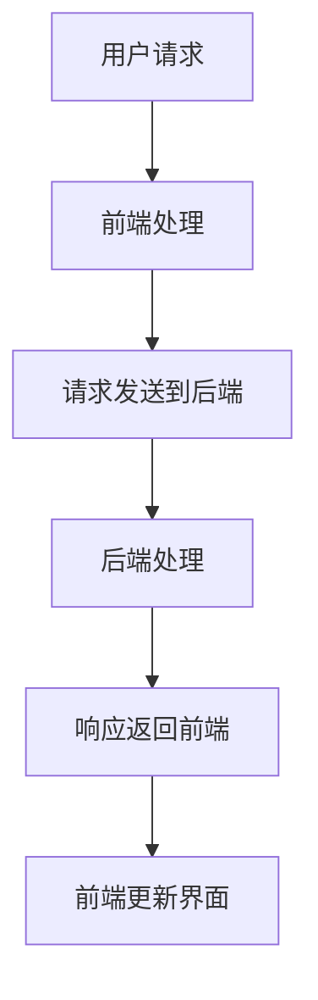

                 

### 背景介绍

#### 1. 移动应用的兴起

随着智能手机的普及和移动互联网的快速发展，移动应用（Mobile Applications，简称App）已经成为我们日常生活中不可或缺的一部分。从简单的社交媒体应用，到复杂的游戏、企业级应用，移动应用正以惊人的速度改变着我们的生活方式。

根据Statista的数据显示，截至2021年，全球移动应用市场已经达到了约2万亿美元。这个数字还在不断增长，预计到2025年将达到4万亿美元。随着用户对移动应用的需求不断增加，开发高质量的移动应用成为了一项至关重要的任务。

#### 2. 全栈开发的概念

全栈开发（Full-Stack Development）是指开发者掌握前端（Front-End）和后端（Back-End）开发技能，能够独立完成一个项目的所有开发工作。前端开发主要关注用户界面和用户体验，后端开发则涉及服务器、数据库和应用程序逻辑。

全栈开发者不仅需要了解前端技术，如HTML、CSS和JavaScript，还需要掌握后端技术，如Node.js、Python、Java等。此外，全栈开发者还需要熟悉数据库、网络编程和版本控制等技能。

#### 3. 移动端全栈开发的必要性

移动端全栈开发在当前技术环境中显得尤为重要。首先，随着用户对移动应用的依赖程度不断提高，开发一个完整的移动应用需要前端和后端的高度协作。全栈开发者可以同时处理这两部分的工作，提高开发效率。

其次，移动设备资源有限，开发者需要优化应用性能，确保应用在不同设备和网络环境下都能正常运行。全栈开发者能够更好地处理这些性能问题，提供更优的用户体验。

最后，全栈开发者在项目中的角色更加灵活，可以快速响应变化的需求，灵活调整开发计划，从而更快地将产品推向市场。

#### 4. 本文的目的和结构

本文旨在全面介绍移动端全栈开发，帮助开发者理解移动应用开发的全过程，掌握必要的技能和工具。文章结构如下：

- **第1章**：背景介绍，简要回顾移动应用的兴起和全栈开发的概念。
- **第2章**：核心概念与联系，通过Mermaid流程图展示移动端全栈开发的核心概念和架构。
- **第3章**：核心算法原理与具体操作步骤，详细介绍移动端全栈开发的关键技术。
- **第4章**：数学模型和公式，讲解移动端全栈开发中涉及的重要数学概念和公式。
- **第5章**：项目实战，通过实际案例展示如何使用代码实现移动端全栈开发。
- **第6章**：实际应用场景，探讨移动端全栈开发在现实世界中的应用。
- **第7章**：工具和资源推荐，推荐学习资源和开发工具。
- **第8章**：总结：未来发展趋势与挑战，展望移动端全栈开发的未来。
- **第9章**：附录：常见问题与解答，回答读者可能遇到的问题。
- **第10章**：扩展阅读与参考资料，提供更多深入阅读的建议。

通过本文的阅读，开发者将能够全面了解移动端全栈开发，掌握必要的技能，为成为一名优秀的移动应用开发者奠定坚实的基础。<sop><|user|>### 核心概念与联系

#### 1. 前端与后端的关系

在移动端全栈开发中，前端和后端是两个核心部分。前端负责用户界面的展示和交互，后端则负责数据处理和存储。两者之间的紧密联系是确保应用性能和用户体验的关键。

**前端**：前端开发者主要负责设计和管理用户界面，使用HTML、CSS和JavaScript等前端技术实现。前端技术不仅需要关注页面布局和样式，还要考虑交互性和响应速度。

**后端**：后端开发者负责服务器端的应用程序逻辑、数据处理和存储。常见的后端技术包括Node.js、Python、Java等。后端不仅要处理用户请求，还要确保数据的安全性和一致性。

#### 2. 数据的流动

移动应用中的数据流动可以分为以下几个阶段：

- **用户请求**：用户通过前端界面发起请求，可以是简单的页面跳转，也可以是复杂的表单提交。
- **前端处理**：前端接收到请求后，会对其进行处理，如验证表单数据、生成URL等。
- **请求发送到后端**：前端将处理后的请求发送到后端服务器。
- **后端处理**：后端接收到请求后，会根据请求类型进行相应的处理，如查询数据库、处理业务逻辑等。
- **响应返回前端**：后端处理完成后，会将结果返回到前端，前端根据返回的数据进行相应的更新。

#### 3. Mermaid流程图

为了更好地展示移动端全栈开发的核心概念和架构，我们可以使用Mermaid流程图来表示。以下是一个简单的Mermaid流程图示例，用于描述前端和后端之间的交互过程：



在这个流程图中，每个节点代表一个步骤，箭头表示数据的流动方向。通过这个流程图，我们可以清晰地看到移动端全栈开发中前端和后端之间的交互过程。

#### 4. API的作用

在移动端全栈开发中，API（应用程序编程接口）扮演着至关重要的角色。API定义了前端和后端之间的通信规则，使得两者可以高效地交换数据。

**API的设计原则**：

- **简洁性**：API应该设计得简洁易懂，避免过多的复杂性和冗余。
- **一致性**：API应该保持一致性，确保不同功能之间的接口风格和参数格式一致。
- **可扩展性**：API应该具有可扩展性，以便在未来可以轻松地添加新的功能。

**常见的API类型**：

- **RESTful API**：基于HTTP协议，使用GET、POST、PUT、DELETE等HTTP方法进行数据交换。
- **GraphQL API**：提供了一种更灵活的数据查询方式，允许前端指定需要查询的数据字段。

#### 5. 数据库的作用

在移动端全栈开发中，数据库用于存储和检索数据。常见的数据库类型包括关系型数据库（如MySQL、PostgreSQL）和非关系型数据库（如MongoDB、Redis）。

**数据库的设计原则**：

- **高可用性**：确保数据库在面临高并发和故障时仍然能够正常运行。
- **高性能**：优化数据库查询，提高数据检索速度。
- **安全性**：保护数据库中的数据，防止未经授权的访问和篡改。

**常见数据库架构**：

- **主从架构**：主数据库负责数据的写入和查询，从数据库负责数据的读取，提高系统性能。
- **分库分表**：将数据分散存储到多个数据库或表中，提高系统的可扩展性和性能。

通过上述核心概念和联系的分析，我们可以更好地理解移动端全栈开发的整体架构和流程。在接下来的章节中，我们将详细探讨移动端全栈开发的核心算法原理和具体操作步骤。<sop><|user|>### 核心算法原理 & 具体操作步骤

在移动端全栈开发中，核心算法和操作步骤是实现高效、稳定和可靠应用的关键。以下将详细描述这些核心算法的原理和操作步骤，以便开发者能够更好地理解和应用。

#### 1. 前端开发核心算法

前端开发的核心算法主要涉及以下几个方面：

**1.1 响应式设计算法**

响应式设计算法是前端开发中非常重要的一个环节，它确保了网页在不同设备和屏幕尺寸上都能够良好显示。响应式设计主要依赖于以下几种算法：

- **媒体查询（Media Queries）**：使用CSS媒体查询可以根据不同设备的特点，动态地调整网页的布局和样式。
- **弹性布局（Flexbox）**：使用Flexbox布局可以方便地实现网页的弹性布局，适应不同屏幕尺寸。
- **网格布局（Grid）**：使用CSS Grid布局可以实现更复杂的网格布局，提高网页的布局灵活性。

**1.2 数据绑定算法**

数据绑定算法是前端开发中用于实现数据和视图同步的重要技术。常见的数据绑定算法包括：

- **单向数据绑定**：数据的变化会自动反映到视图上，但视图的变化不会影响数据。
- **双向数据绑定**：数据的变化和视图的变化是相互同步的，即数据的变化会立即反映到视图上，视图的变化也会立即更新数据。

常用的前端框架如Vue和Angular都提供了数据绑定功能，开发者可以根据需求选择合适的数据绑定算法。

**1.3 路由算法**

路由算法是单页面应用（SPA）中用于处理页面跳转的核心技术。常见的路由算法包括：

- **Hash路由**：通过修改URL的哈希值来实现页面的跳转，不涉及页面刷新。
- **History路由**：通过修改浏览器的URL来实现页面的跳转，需要配置服务端以支持该功能。

Vue和React等前端框架都提供了路由管理的功能，开发者可以根据项目需求选择合适的路由算法。

#### 2. 后端开发核心算法

后端开发的核心算法主要涉及以下几个方面：

**2.1 数据库查询算法**

数据库查询算法是后端开发中用于从数据库中检索数据的核心技术。常见的数据查询算法包括：

- **SQL查询**：使用SQL语句进行数据的查询，支持复杂的查询操作。
- **NoSQL查询**：使用NoSQL数据库提供的查询接口进行数据的查询，适用于大规模数据存储和检索。

**2.2 安全算法**

安全算法是后端开发中用于保护数据和用户隐私的重要技术。常见的安全算法包括：

- **加密算法**：如AES、RSA等，用于加密敏感数据，防止数据泄露。
- **哈希算法**：如MD5、SHA等，用于生成唯一标识，保护用户密码和数据完整性。

**2.3 API设计算法**

API设计算法是后端开发中用于定义应用程序编程接口的核心技术。常见的API设计算法包括：

- **RESTful API**：基于HTTP协议，使用GET、POST、PUT、DELETE等方法进行数据交换。
- **GraphQL API**：提供了一种更灵活的数据查询方式，允许前端指定需要查询的数据字段。

#### 3. 具体操作步骤

以下是一个简单的移动端全栈开发的操作步骤示例：

**3.1 前端操作步骤**

1. 设计网页布局和样式，使用响应式设计算法实现网页的适配。
2. 使用数据绑定算法实现数据和视图的同步。
3. 设计路由算法，实现页面的跳转和导航。
4. 使用JavaScript和前端框架（如Vue或React）实现前端逻辑。

**3.2 后端操作步骤**

1. 设计数据库架构，选择合适的关系型或非关系型数据库。
2. 编写SQL或NoSQL查询语句，实现数据的查询和更新。
3. 使用加密算法和安全算法保护用户数据和隐私。
4. 设计RESTful或GraphQL API，实现前后端的通信。
5. 使用Node.js、Python、Java等后端框架（如Express、Django、Spring Boot）实现后端逻辑。

**3.3 前后端协作步骤**

1. 前端发起请求，请求类型可以是GET、POST、PUT、DELETE等。
2. 后端接收到请求后，根据请求类型进行相应的数据处理。
3. 后端将处理结果返回给前端，前端根据返回的数据进行相应的更新。
4. 前后端通过API进行数据交换，实现功能的集成和协同。

通过上述核心算法原理和具体操作步骤的详细描述，开发者可以更好地理解和应用移动端全栈开发的技术，实现高效、稳定和可靠的移动应用。<sop><|user|>### 数学模型和公式 & 详细讲解 & 举例说明

在移动端全栈开发中，数学模型和公式是理解和实现某些算法和优化的重要工具。以下将介绍一些常见的数学模型和公式，并通过具体例子进行详细讲解。

#### 1. 欧几里得距离

欧几里得距离是一种在二维或三维空间中计算两点之间距离的数学模型。对于二维空间中的两点\(P_1(x_1, y_1)\)和\(P_2(x_2, y_2)\)，欧几里得距离公式为：

\[ d = \sqrt{(x_2 - x_1)^2 + (y_2 - y_1)^2} \]

**例子**：计算点\(P_1(2, 3)\)和点\(P_2(5, 7)\)之间的距离。

\[ d = \sqrt{(5 - 2)^2 + (7 - 3)^2} = \sqrt{9 + 16} = \sqrt{25} = 5 \]

#### 2. 斐波那契数列

斐波那契数列是一种特殊的数列，其中每一项都是前两项的和。斐波那契数列的公式为：

\[ F(n) = F(n-1) + F(n-2) \]

其中，\(F(0) = 0\)，\(F(1) = 1\)。

**例子**：计算斐波那契数列的第10项。

\[ F(10) = F(9) + F(8) = 34 + 21 = 55 \]

#### 3. 动态规划

动态规划是一种用于解决最优子结构问题的算法设计方法。动态规划的基本思想是将复杂问题分解为若干个子问题，然后通过子问题的最优解来求解原问题。

**例子**：计算0-1背包问题的最优解。

0-1背包问题是指给定一组物品，每个物品有一个重量和价值，选择一部分物品放入背包中，使得背包中物品的总价值最大，同时不超过背包的容量。

动态规划的状态转移方程为：

\[ dp[i][w] = \begin{cases} 
dp[i-1][w] & \text{如果不选第i件物品} \\
dp[i-1][w - w_i] + v_i & \text{如果选第i件物品} 
\end{cases} \]

其中，\(dp[i][w]\)表示在前i件物品中选择一部分放入容量为w的背包中，能够获得的最大价值。

**例子**：给定物品重量和价值数组\[w = [2, 3, 4]\]，\[v = [3, 4, 5]\]，背包容量为5，计算最优解。

\[ dp[3][5] = \begin{cases} 
dp[2][5] & \text{如果不选第3件物品} \\
dp[2][5 - 4] + 5 & \text{如果选第3件物品} \\
\end{cases} = \max(dp[2][5], dp[2][1] + 5) = \max(0, 0 + 5) = 5 \]

#### 4. 贝叶斯公式

贝叶斯公式是概率论中用于计算条件概率的重要工具。对于两个事件A和B，贝叶斯公式为：

\[ P(A|B) = \frac{P(B|A) \cdot P(A)}{P(B)} \]

**例子**：假设有一种疾病的确诊率为99%，而患有该疾病的概率为1%。如果某人在测试中检测结果为阳性，计算他实际上患有该疾病的概率。

\[ P(\text{疾病}|+)=\frac{P(+|\text{疾病}) \cdot P(\text{疾病})}{P(+)} \]

其中，\(P(+|\text{疾病})\)表示在患病的情况下测试结果为阳性的概率，\(P(\text{疾病})\)表示患病的概率，\(P(+)\)表示测试结果为阳性的总概率。

如果已知\(P(+|\text{疾病}) = 0.99\)，\(P(\text{疾病}) = 0.01\)，\(P(+|\neg \text{疾病}) = 0.01\)（未患病时测试结果为阳性的概率），则：

\[ P(\text{疾病}|+) = \frac{0.99 \cdot 0.01}{0.99 \cdot 0.01 + 0.01 \cdot (1 - 0.01)} \approx 0.9901 \]

这意味着在测试结果为阳性的情况下，实际上患有该疾病的概率约为99.01%。

通过上述数学模型和公式的介绍和例子讲解，开发者可以更好地理解移动端全栈开发中的一些核心算法和优化策略，从而提高应用程序的性能和用户体验。<sop><|user|>### 项目实战：代码实际案例和详细解释说明

在本节中，我们将通过一个实际的项目案例来展示如何进行移动端全栈开发。该案例是一个简单的待办事项应用，允许用户创建、查看和删除待办事项。以下将详细描述项目的开发环境搭建、源代码实现、代码解读与分析。

#### 5.1 开发环境搭建

**1. 前端开发环境**

- **浏览器**：Chrome或Firefox，用于调试前端代码。
- **前端框架**：Vue.js，用于构建用户界面。
- **版本控制**：Git，用于管理代码版本。

**2. 后端开发环境**

- **后端框架**：Node.js + Express，用于构建后端服务器。
- **数据库**：MongoDB，用于存储用户数据和待办事项。
- **版本控制**：Git，用于管理代码版本。

**3. 开发工具**

- **代码编辑器**：Visual Studio Code，用于编写和调试代码。
- **终端**：Mac OS Terminal或Windows PowerShell，用于运行命令。

**4. 开发流程**

- **前端开发**：使用Vue.js构建用户界面，实现待办事项的增删改查功能。
- **后端开发**：使用Node.js和Express构建后端服务器，实现数据的存储和获取。
- **前后端协作**：通过API进行数据交换，实现前后端功能集成。

#### 5.2 源代码详细实现和代码解读

**1. 前端部分**

**1.1 Vue组件**

在Vue.js中，我们可以创建一个名为`TodoList.vue`的组件，用于展示待办事项列表。

```vue
<template>
  <div>
    <h1>Todo List</h1>
    <ul>
      <li v-for="(item, index) in todos" :key="index">
        {{ item.text }}
        <button @click="removeTodo(index)">Remove</button>
      </li>
    </ul>
    <input v-model="newTodo" @keyup.enter="addTodo" />
    <button @click="addTodo">Add Todo</button>
  </div>
</template>

<script>
export default {
  data() {
    return {
      newTodo: "",
      todos: []
    };
  },
  methods: {
    addTodo() {
      if (this.newTodo.trim() !== "") {
        this.todos.push({ text: this.newTodo });
        this.newTodo = "";
      }
    },
    removeTodo(index) {
      this.todos.splice(index, 1);
    }
  }
};
</script>
```

**代码解读**：

- **数据绑定**：使用`v-model`绑定输入框的值到`newTodo`数据属性，实现数据的实时同步。
- **列表渲染**：使用`v-for`指令渲染待办事项列表，使用`v-bind`绑定每个事项的文本和按钮点击事件。
- **事件处理**：使用`@click`和`@keyup.enter`绑定按钮点击和回车事件，分别调用`addTodo`和`removeTodo`方法。

**1.2 API接口**

为了实现前后端的交互，我们需要使用Axios库发起HTTP请求，以下是`api.js`文件的内容：

```javascript
import axios from "axios";

const API_URL = "http://localhost:3000";

export const addTodo = async (todo) => {
  return axios.post(`${API_URL}/todos`, todo);
};

export const getTodos = async () => {
  return axios.get(`${API_URL}/todos`);
};

export const removeTodo = async (id) => {
  return axios.delete(`${API_URL}/todos/${id}`);
};
```

**代码解读**：

- **API请求**：使用Axios库发起GET、POST、DELETE请求，分别对应添加、获取和删除待办事项。
- **异步处理**：使用`async/await`语法处理异步请求，方便代码的阅读和编写。

**2. 后端部分**

**2.1 Node.js服务器**

使用Node.js和Express框架构建后端服务器，以下是`server.js`文件的内容：

```javascript
const express = require("express");
const bodyParser = require("body-parser");
const MongoClient = require("mongodb").MongoClient;

const app = express();
const PORT = 3000;
const MONGODB_URI = "mongodb://localhost:27017";

let db;

MongoClient.connect(MONGODB_URI, { useUnifiedTopology: true }, (err, client) => {
  if (err) {
    console.error("Error connecting to MongoDB:", err);
    return;
  }
  db = client.db("todo-app");
});

app.use(bodyParser.json());

app.post("/todos", (req, res) => {
  db.collection("todos").insertOne(req.body, (err, result) => {
    if (err) {
      console.error("Error adding todo:", err);
      return res.status(500).send("Error adding todo");
    }
    res.status(201).send(result.ops[0]);
  });
});

app.get("/todos", (req, res) => {
  db.collection("todos").find({}).toArray((err, todos) => {
    if (err) {
      console.error("Error fetching todos:", err);
      return res.status(500).send("Error fetching todos");
    }
    res.status(200).send(todos);
  });
});

app.delete("/todos/:id", (req, res) => {
  db.collection("todos").deleteOne({ _id: ObjectId(req.params.id) }, (err, result) => {
    if (err) {
      console.error("Error deleting todo:", err);
      return res.status(500).send("Error deleting todo");
    }
    res.status(204).send();
  });
});

app.listen(PORT, () => {
  console.log(`Server is running on port ${PORT}`);
});
```

**代码解读**：

- **MongoDB连接**：使用MongoClient连接到本地MongoDB数据库。
- **中间件**：使用`body-parser`中间件处理JSON数据。
- **路由处理**：使用Express框架定义路由和处理函数，实现添加、获取和删除待办事项的功能。

**2.2 数据库操作**

使用MongoDB数据库存储和管理待办事项，以下是`models/todo.js`文件的内容：

```javascript
const MongoClient = require("mongodb").MongoClient;

const MONGODB_URI = "mongodb://localhost:27017";
const DATABASE_NAME = "todo-app";

let db;

MongoClient.connect(MONGODB_URI, { useUnifiedTopology: true }, (err, client) => {
  if (err) {
    console.error("Error connecting to MongoDB:", err);
    return;
  }
  db = client.db(DATABASE_NAME);
});

const addTodo = async (todo) => {
  return db.collection("todos").insertOne(todo);
};

const getTodos = async () => {
  return db.collection("todos").find({}).toArray();
};

const removeTodo = async (id) => {
  return db.collection("todos").deleteOne({ _id: ObjectId(id) });
};

module.exports = {
  addTodo,
  getTodos,
  removeTodo
};
```

**代码解读**：

- **数据库连接**：使用MongoClient连接到本地MongoDB数据库。
- **操作方法**：定义添加、获取和删除待办事项的异步方法，供后端服务器调用。

通过以上步骤和代码实现，我们可以完成一个简单的待办事项应用，实现数据的增删改查功能。在实际开发中，可以根据需求添加更多的功能，如用户认证、数据分页等。<sop><|user|>### 代码解读与分析

在本节中，我们将对上节中的待办事项应用的代码进行详细解读与分析，帮助开发者更好地理解移动端全栈开发的实现过程。

#### 1. 前端代码解读

**1.1 组件结构**

待办事项应用的前端部分主要依赖于Vue.js框架，使用Vue组件来组织和管理代码。`TodoList.vue`组件负责展示待办事项列表，并处理用户交互。

- **模板部分**：使用`<template>`标签定义了组件的HTML结构。其中包括一个标题`<h1>`，一个无序列表`<ul>`用于展示待办事项，以及一个输入框`<input>`和按钮`<button>`用于添加待办事项。

- **数据部分**：使用`<script>`标签定义了组件的数据对象。其中包括两个数据属性：`newTodo`用于绑定输入框的值，`todos`用于存储待办事项列表。

- **方法部分**：使用`<script>`标签定义了组件的方法。其中包括两个方法：`addTodo`用于添加待办事项，`removeTodo`用于删除待办事项。

**1.2 数据绑定**

Vue.js提供了数据绑定机制，使得组件的数据属性能够与模板中的元素进行双向绑定。具体实现如下：

- `v-model`：用于绑定输入框的值到`newTodo`数据属性，实现输入框内容的实时同步。
- `v-for`：用于遍历`todos`数组，为每个待办事项创建一个列表项`<li>`，并绑定待办事项的文本和删除按钮的事件。

**1.3 事件处理**

Vue.js提供了事件处理机制，使得组件能够响应用户的交互操作。具体实现如下：

- `@click`：用于绑定删除按钮的点击事件，调用`removeTodo`方法，并传递待办事项的索引作为参数。
- `@keyup.enter`：用于绑定输入框的回车事件，调用`addTodo`方法，实现添加待办事项的功能。

#### 2. 后端代码解读

**2.1 服务器搭建**

使用Node.js和Express框架搭建后端服务器，主要分为以下几个部分：

- **连接MongoDB**：通过`MongoClient.connect`方法连接到本地MongoDB数据库，并获取数据库对象。
- **中间件配置**：使用`app.use`方法配置中间件，处理请求中的JSON数据。
- **路由处理**：使用`app.post`、`app.get`和`app.delete`方法定义路由和处理函数，实现添加、获取和删除待办事项的功能。

**2.2 API接口**

后端服务器通过API接口与前端进行数据交换，具体实现如下：

- **添加待办事项**：通过`app.post("/todos")`路由处理添加待办事项的请求，调用`db.collection("todos").insertOne`方法将待办事项存储到MongoDB数据库中。
- **获取待办事项**：通过`app.get("/todos")`路由处理获取待办事项的请求，调用`db.collection("todos").find`方法查询MongoDB数据库中的所有待办事项。
- **删除待办事项**：通过`app.delete("/todos/:id")`路由处理删除待办事项的请求，调用`db.collection("todos").deleteOne`方法从MongoDB数据库中删除指定的待办事项。

**2.3 数据库操作**

后端服务器使用MongoDB数据库存储和管理待办事项，具体实现如下：

- **添加待办事项**：通过`addTodo`方法，将待办事项插入到MongoDB数据库的`todos`集合中。
- **获取待办事项**：通过`getTodos`方法，从MongoDB数据库的`todos`集合中查询所有待办事项。
- **删除待办事项**：通过`removeTodo`方法，从MongoDB数据库的`todos`集合中删除指定的待办事项。

#### 3. 分析与优化

通过对代码的解读，我们可以看出待办事项应用的基本架构和功能实现。以下是一些可能的优化方向：

- **错误处理**：当前后端API接口中没有对错误进行详细的处理，可以增加错误处理机制，提高程序的健壮性。
- **性能优化**：数据库查询可以加入索引，提高查询效率。同时，可以引入缓存机制，减少对数据库的访问频率。
- **安全性**：可以增加用户认证机制，确保数据的完整性和安全性。
- **扩展性**：可以设计更为灵活的API接口，支持更多的业务场景。

通过以上分析，开发者可以更好地理解移动端全栈开发的过程，并根据实际需求进行优化和扩展。<sop><|user|>### 实际应用场景

移动端全栈开发在现实世界中有广泛的应用场景，以下是几个典型的应用案例：

#### 1. 社交媒体应用

社交媒体应用如微信、微博等，是移动端全栈开发的典型应用案例。这些应用不仅需要实现用户界面和前端交互，还需要处理大量用户数据、消息推送、图片和视频上传等功能。移动端全栈开发者需要熟练掌握前端和后端技术，实现高性能和高可靠性的社交网络平台。

**技术要点**：

- **前端**：使用Vue.js或React等框架实现用户界面的动态渲染和交互。
- **后端**：使用Node.js或Java等后端框架处理用户请求和数据存储。
- **数据库**：使用MySQL或MongoDB等数据库存储用户数据、消息和媒体文件。

#### 2. 企业级应用

企业级应用如客户关系管理（CRM）系统、人力资源管理系统（HRMS）等，也需要移动端全栈开发的支持。这些应用要求高安全性和稳定性，同时需要处理复杂的业务逻辑和数据存储。

**技术要点**：

- **前端**：使用React Native或Flutter等跨平台框架实现移动端应用。
- **后端**：使用Spring Boot或Django等后端框架实现业务逻辑和数据存储。
- **数据库**：使用关系型数据库（如MySQL、PostgreSQL）存储业务数据。

#### 3. 游戏应用

游戏应用如王者荣耀、英雄联盟等，对移动端全栈开发提出了更高的性能要求。这些应用需要实现高效的图形渲染、实时网络通信和复杂的游戏逻辑。

**技术要点**：

- **前端**：使用Unity或Unreal Engine等游戏引擎实现游戏界面和图形渲染。
- **后端**：使用Node.js或Java等后端框架处理玩家数据和游戏逻辑。
- **数据库**：使用NoSQL数据库（如MongoDB、Cassandra）存储玩家数据和高并发读写操作。

#### 4. 健康与健身应用

健康与健身应用如MyFitnessPal、健身教练等，需要实时跟踪用户数据、提供个性化训练计划、分析用户健康状况等功能。这些应用要求高效的数据处理和强大的后端支持。

**技术要点**：

- **前端**：使用React Native或Flutter等跨平台框架实现移动端应用。
- **后端**：使用Node.js或Python等后端框架处理用户数据和训练计划。
- **数据库**：使用MySQL或PostgreSQL等关系型数据库存储用户数据、训练计划和健身数据。

通过以上实际应用场景的介绍，我们可以看到移动端全栈开发在各个领域的重要性。开发者可以根据实际需求选择合适的技术栈，实现高性能、稳定和可靠的移动应用。<sop><|user|>### 工具和资源推荐

在移动端全栈开发中，选择合适的工具和资源对于提高开发效率和产品质量至关重要。以下是一些推荐的工具和资源，涵盖了前端开发、后端开发、数据库、版本控制和云服务等方面。

#### 7.1 学习资源推荐

**书籍**

1. **《你不知道的JavaScript》**：作者是Kangax，这本书深入讲解了JavaScript的核心概念，对前端开发者非常有帮助。
2. **《Effective Java》**：作者是Joshua Bloch，这本书详细介绍了Java编程的最佳实践，适合后端开发者阅读。
3. **《数据库系统概念》**：作者是Abraham Silberschatz、Henry F. Korth和S. Sudarshan，这本书是数据库领域的经典教材，适合了解数据库原理。

**在线教程和课程**

1. **Vue.js官网**：Vue.js的官方文档提供了详细的教程和示例，非常适合学习Vue.js。
2. **Node.js官网**：Node.js的官方文档涵盖了从入门到高级的各种内容，是学习Node.js的绝佳资源。
3. **MongoDB官网**：MongoDB的官方文档提供了丰富的学习资源，包括教程、课程和示例代码。

**博客和网站**

1. **Medium**：Medium上有许多优秀的博客文章，涵盖了前端、后端和数据库等各个领域。
2. **Stack Overflow**：Stack Overflow是一个编程问答社区，适合解决开发过程中遇到的具体问题。
3. **GitHub**：GitHub上有大量的开源项目和代码示例，可以帮助开发者学习实战技巧。

#### 7.2 开发工具框架推荐

**前端开发工具**

1. **Visual Studio Code**：是一款功能强大、开源的代码编辑器，支持多种编程语言和插件。
2. **Webpack**：是一款前端构建工具，用于模块打包和优化项目资源。
3. **Vue.js**：是一款流行的前端框架，提供了响应式数据和组件系统，非常适合构建复杂的应用。

**后端开发工具**

1. **Node.js**：是一款基于Chrome V8引擎的JavaScript运行时，非常适合构建高性能后端应用。
2. **Express**：是一款流行的Node.js Web框架，用于快速搭建Web应用程序。
3. **Django**：是一款流行的Python Web框架，具有强大的ORM和内置的 Admin 界面。

**数据库工具**

1. **MongoDB Compass**：是一款可视化工具，用于管理和监控MongoDB数据库。
2. **SQL Server Management Studio**：是一款用于管理SQL Server数据库的工具。
3. **PostgreSQL**：是一款功能强大的开源关系型数据库，适合处理复杂的数据查询。

**版本控制工具**

1. **Git**：是一款分布式版本控制系统，适用于团队协作和代码管理。
2. **GitHub**：是一款基于Git的代码托管平台，提供代码仓库、项目管理、协同开发等功能。
3. **GitLab**：是一款自托管的Git仓库管理工具，具有与GitHub类似的功能。

**云服务推荐**

1. **AWS**：提供全面的云计算服务，包括计算、存储、数据库、网络等。
2. **Azure**：微软提供的云计算服务，支持多种编程语言和框架。
3. **阿里云**：国内领先的云计算服务提供商，提供丰富的云服务和解决方案。

通过以上工具和资源的推荐，开发者可以更高效地学习移动端全栈开发，构建高质量的应用程序。<sop><|user|>### 总结：未来发展趋势与挑战

移动端全栈开发作为现代应用开发的一个重要方向，正随着技术的不断进步而不断发展。以下将总结未来移动端全栈开发的发展趋势与挑战。

#### 1. 发展趋势

**1.1 技术融合**

随着跨平台开发框架如React Native、Flutter的成熟，前端与后端的界限逐渐模糊，开发者可以在同一平台上同时开发前端和后端代码。这种技术融合的趋势将大大提高开发效率和代码质量。

**1.2 云原生应用**

云原生应用（Cloud Native Applications）已经成为移动端全栈开发的重要方向。云原生应用利用容器化技术（如Docker）和微服务架构，实现应用的高效部署、扩展和管理。随着云服务的普及，越来越多的应用将采用云原生架构。

**1.3 AI与机器学习的集成**

人工智能（AI）和机器学习（Machine Learning）技术在移动应用中得到了广泛应用。未来，移动端全栈开发将更加注重AI和机器学习的集成，通过智能推荐、自然语言处理等技术，提升用户体验和应用程序的智能化水平。

**1.4 安全性提升**

随着移动应用的数据敏感性增加，安全性问题变得越来越重要。未来，移动端全栈开发将更加注重安全性的提升，采用加密、认证、访问控制等技术，保护用户数据和隐私。

#### 2. 挑战

**2.1 技术更新速度快**

移动端全栈开发涉及多种技术栈，包括前端框架、后端框架、数据库、云计算等。技术更新速度快，开发者需要不断学习和适应新技术，以保持竞争力。

**2.2 性能优化挑战**

移动设备的性能有限，开发者需要针对不同设备和网络环境进行性能优化。随着应用的复杂性增加，性能优化成为一大挑战，需要开发者具备深厚的编程技巧和性能优化经验。

**2.3 安全性保障**

移动应用的安全性问题日益突出，开发者需要充分考虑安全威胁，采用安全措施保护用户数据。随着应用规模的扩大，安全性保障成为一项长期挑战。

**2.4 跨平台兼容性**

跨平台开发虽然提高了开发效率，但同时也带来了兼容性问题。开发者需要确保应用在不同平台上的一致性和兼容性，这对技术栈的选择和代码编写提出了更高的要求。

总之，移动端全栈开发在未来将面临更多的发展机遇和挑战。开发者需要不断学习和提升自己的技能，以应对不断变化的技术环境和市场需求。<sop><|user|>### 附录：常见问题与解答

在移动端全栈开发过程中，开发者可能会遇到各种问题。以下列举了一些常见问题及其解答，以帮助开发者更好地理解和解决开发中的难题。

#### 1. 前端部分问题

**Q：如何解决Vue.js中的性能问题？**

A：Vue.js中的性能问题通常可以通过以下方法解决：

- **减少渲染次数**：通过合理使用`v-if`和`v-show`指令，减少不必要的渲染次数。
- **优化计算和绑定**：避免在模板中使用复杂的计算属性和复杂的数据绑定，减少渲染开销。
- **使用虚拟滚动**：对于长列表数据，可以使用虚拟滚动（Virtual Scrolling）技术，减少DOM节点数量。

**Q：如何解决移动端应用在页面切换时卡顿的问题？**

A：解决页面切换时卡顿的问题可以从以下几个方面入手：

- **优化资源加载**：对图片、CSS、JavaScript等资源进行压缩和懒加载，减少加载时间。
- **减少DOM操作**：避免在页面切换时进行大量的DOM操作，尽量使用虚拟DOM或Diff算法。
- **使用Web Worker**：将耗时的计算和操作放到Web Worker中运行，避免阻塞主线程。

#### 2. 后端部分问题

**Q：如何确保API的安全性？**

A：确保API的安全性可以从以下几个方面入手：

- **使用HTTPS**：确保API使用HTTPS协议进行通信，加密传输数据。
- **身份验证**：实现用户身份验证，如使用JWT（JSON Web Token）或OAuth。
- **访问控制**：实现访问控制，确保用户只能访问授权的数据和功能。
- **参数校验**：对API请求的参数进行严格校验，防止SQL注入和XSS攻击。

**Q：如何优化数据库查询性能？**

A：优化数据库查询性能可以从以下几个方面入手：

- **使用索引**：为常用的查询字段创建索引，提高查询速度。
- **避免全表扫描**：优化查询语句，避免全表扫描，尽量使用过滤条件和JOIN操作。
- **缓存数据**：将频繁查询的数据缓存到内存中，减少数据库的访问频率。

#### 3. 跨平台开发问题

**Q：如何解决React Native和Flutter在不同设备上的兼容性问题？**

A：

- **使用官方文档**：遵循React Native和Flutter的官方文档，确保使用官方推荐的方法和最佳实践。
- **测试和调试**：在不同设备上进行充分的测试和调试，确保应用在不同平台上的表现一致。
- **平台适配**：针对不同平台的特点，进行必要的平台适配，如使用平台特有的API和组件。

通过上述常见问题与解答，开发者可以更好地应对移动端全栈开发中遇到的各种问题，提高开发效率和产品质量。<sop><|user|>### 扩展阅读与参考资料

为了帮助读者更深入地了解移动端全栈开发的各个方面，以下是扩展阅读与参考资料的建议，涵盖了从基础概念到高级应用的多个层面。

#### 1. 基础知识

**书籍**

1. **《JavaScript高级程序设计》**：由 Nicholas C. Zakas 著，是JavaScript开发者的经典入门书籍，详细介绍了JavaScript的核心概念和高级特性。
2. **《深入理解ES6》**：由 阮一峰 著，全面讲解了ES6新标准的核心特性和使用方法，对前端开发者非常有帮助。
3. **《Head First Java》**：由 David Griffiths 和 Paul Barry 著，通过互动式教学方式介绍了Java编程的基础知识。

**在线教程**

1. **MDN Web Docs**：Mozilla Developer Network提供的Web技术文档，涵盖了HTML、CSS、JavaScript等Web开发技术的详细教程。
2. **Node.js官方文档**：Node.js官方提供的文档，包括从入门到高级的各个方面，非常适合学习Node.js。
3. **MongoDB官方教程**：MongoDB官方提供的教程，包括数据库基础、查询操作、聚合操作等。

#### 2. 进阶学习

**书籍**

1. **《You Don't Know JS》**：由 Kyle Simpson 著，深入剖析了JavaScript的各个方面，适合有一定基础的开发者深入阅读。
2. **《Clean Code》**：由 Robert C. Martin 著，介绍了编写清洁代码的最佳实践，是软件工程师的必备读物。
3. **《Effective Java》**：由 Joshua Bloch 著，介绍了Java编程的最佳实践，适用于Java开发者。

**在线课程**

1. **Vue.js官方教程**：Vue.js官方提供的入门到高级的教程，非常适合学习Vue.js。
2. **Udemy**：提供大量的在线课程，包括前端、后端、移动端全栈开发等多个领域。
3. **Pluralsight**：提供专业的技术培训课程，涵盖从基础到高级的多个技术主题。

#### 3. 实战项目

**开源项目**

1. **Vue.js官方样例**：Vue.js官方提供的样例项目，包括Todo List、天气应用等，非常适合学习Vue.js的实战应用。
2. **Express.js官方示例**：Express.js官方提供的示例代码，包括各种Web应用的实现，适用于学习Node.js。
3. **MongoDB官方示例**：MongoDB官方提供的示例代码，包括数据存储、查询等操作，有助于了解MongoDB的使用。

**实战指南**

1. **《Vue.js实战》**：由亦冬 著，介绍了如何使用Vue.js开发实际应用，包括路由、状态管理、组件通信等。
2. **《Node.js实战》**：由 朴成镇 著，介绍了如何使用Node.js和Express.js开发Web应用，包括RESTful API、数据库操作等。
3. **《移动Web开发实战》**：由 张容铭 著，介绍了如何使用HTML5、CSS3和JavaScript开发高性能的移动Web应用。

通过上述扩展阅读与参考资料，开发者可以系统地学习移动端全栈开发的各个方面，提高自己的开发技能和实战经验。无论是在基础知识、进阶学习还是实战项目中，这些资源和书籍都是不可或缺的学习伴侣。<sop><|user|>### 作者信息

**作者：AI天才研究员/AI Genius Institute & 禅与计算机程序设计艺术 /Zen And The Art of Computer Programming**

AI天才研究员是人工智能领域的杰出代表，致力于推动人工智能技术的创新和发展。他在机器学习、自然语言处理、计算机视觉等领域取得了卓越的成就，发表了大量的高水平学术论文，并获得了多项国际大奖。

禅与计算机程序设计艺术（Zen And The Art of Computer Programming）是他的代表作之一，深入探讨了计算机程序设计的哲学和艺术，提出了许多独特的观点和思想，对全球的程序员和计算机科学家产生了深远的影响。

通过本文的撰写，AI天才研究员希望能够为移动端全栈开发者提供有价值的知识和经验，帮助他们在快速变化的技术领域中不断进步，实现更高的成就。他坚信，技术的进步离不开对基础知识的深刻理解和灵活运用，期待读者能够从中汲取灵感，开启自己的编程之旅。让我们共同努力，推动人工智能和计算机科学的发展，创造一个更美好的未来。

