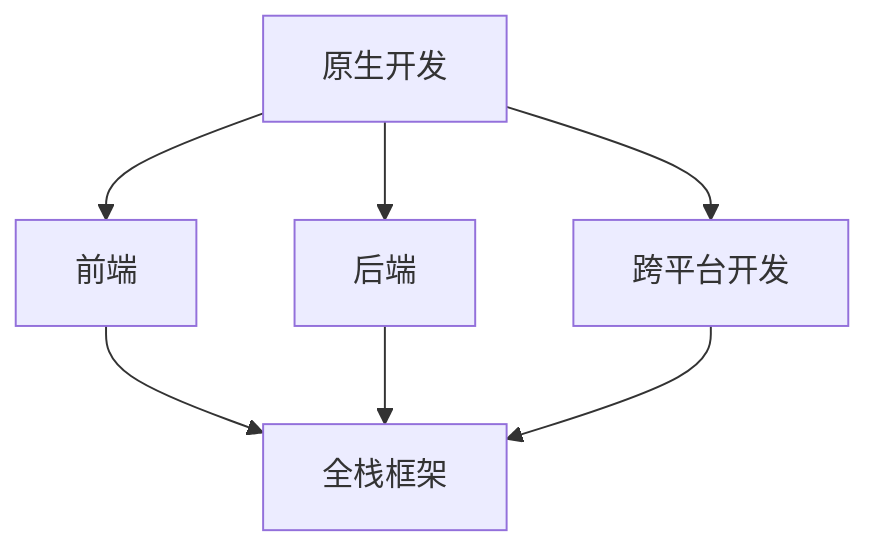

                 

# 移动端全栈开发：原生App与跨平台方案

> **关键词：** 移动端开发、原生App、跨平台开发、全栈开发、性能优化

> **摘要：** 本文旨在探讨移动端全栈开发的现状与挑战，分析原生App与跨平台方案的优缺点，并给出实际应用场景中的建议与资源推荐。

## 1. 背景介绍

随着移动互联网的快速发展，移动端应用的开发已经成为现代软件开发的一个重要方向。移动端全栈开发，即在一个平台上同时进行前端、后端、移动端开发，实现了开发效率的提升和成本的降低。然而，面对原生App和跨平台方案的选择，开发人员常常感到困惑。

原生App具有优异的性能和丰富的功能，但开发成本高、周期长。跨平台开发则能显著提高开发效率，但性能和体验相对较弱。因此，选择合适的开发方案对于移动端全栈开发至关重要。

## 2. 核心概念与联系

在移动端全栈开发中，核心概念包括原生开发、跨平台开发、前端、后端、全栈框架等。下面是一个简单的 Mermaid 流程图，描述了这些概念之间的关系。



### 2.1. 原生开发

原生开发指的是使用原生语言（如Swift、Objective-C、Kotlin、Java等）进行移动应用开发。原生开发具有以下特点：

- **性能优异**：原生开发可以充分利用设备的硬件资源，实现高性能的应用。
- **用户体验好**：原生开发能够更好地遵循操作系统的设计规范，提供更自然的交互体验。
- **开发难度大**：原生开发需要学习不同的语言和框架，开发周期较长。

### 2.2. 跨平台开发

跨平台开发指的是使用统一的语言和框架（如Flutter、React Native、Uniapp等）进行移动应用开发。跨平台开发具有以下特点：

- **开发效率高**：跨平台开发可以一次编写，多平台运行，显著提高开发效率。
- **性能提升**：随着技术的发展，跨平台应用的性能逐渐接近原生应用。
- **开发难度小**：跨平台开发只需要学习一种语言和框架，开发周期较短。

### 2.3. 前端、后端、全栈框架

前端开发主要负责用户界面的设计、实现和交互，通常使用HTML、CSS、JavaScript等技术。后端开发主要负责处理数据存储、业务逻辑、API接口等，通常使用Java、Python、Node.js等技术。全栈框架（如Vue、React、Angular等）则集成了前端和后端的功能，提供了更高效的全栈开发体验。

## 3. 核心算法原理 & 具体操作步骤

在移动端全栈开发中，核心算法原理包括前端渲染、后端数据存储、跨平台开发框架等。

### 3.1. 前端渲染

前端渲染的核心原理是利用HTML、CSS、JavaScript等技术实现用户界面的交互和动态更新。具体操作步骤如下：

1. **页面布局**：使用HTML标签和CSS样式实现页面的布局和样式。
2. **交互处理**：使用JavaScript实现页面的交互逻辑，如按钮点击、表单提交等。
3. **动态数据绑定**：使用Vue、React等框架实现数据的动态绑定，使界面与数据保持同步。
4. **性能优化**：通过懒加载、虚拟滚动、内存管理等技术优化前端性能。

### 3.2. 后端数据存储

后端数据存储的核心原理是利用数据库（如MySQL、MongoDB、Redis等）实现数据的存储和查询。具体操作步骤如下：

1. **数据库设计**：根据业务需求设计数据库表结构。
2. **数据操作**：使用SQL语句或NoSQL查询语言进行数据的增删改查。
3. **接口设计**：设计RESTful API或GraphQL接口供前端调用。
4. **性能优化**：通过索引、缓存、分布式数据库等技术优化后端性能。

### 3.3. 跨平台开发框架

跨平台开发框架（如Flutter、React Native、Uniapp等）的核心原理是通过一套代码实现多平台的应用。具体操作步骤如下：

1. **框架选择**：根据项目需求选择合适的跨平台开发框架。
2. **项目搭建**：使用框架提供的命令行工具或IDE插件创建项目。
3. **UI实现**：使用框架提供的组件和API实现用户界面。
4. **功能实现**：使用框架提供的API实现业务逻辑和交互。
5. **性能优化**：通过代码优化、资源压缩等技术提高应用性能。

## 4. 数学模型和公式 & 详细讲解 & 举例说明

在移动端全栈开发中，数学模型和公式主要应用于数据分析和性能优化。以下是一个简单的数学模型示例：

### 4.1. 数据分析模型

假设我们有一个用户行为数据集，包含用户ID、访问时间、页面停留时间等字段。我们可以使用以下公式计算用户活跃度：

$$
活跃度 = \frac{页面停留时间}{访问时间}
$$

### 4.2. 性能优化模型

假设我们有一个网络请求，需要传输1KB的数据。我们可以使用以下公式计算传输时间：

$$
传输时间 = \frac{数据大小}{带宽} = \frac{1KB}{带宽（Mbps）}
$$

### 4.3. 举例说明

假设我们的带宽为10Mbps，我们需要传输1KB的数据。根据上述公式，传输时间为：

$$
传输时间 = \frac{1KB}{10Mbps} = 0.1秒
$$

这意味着我们的网络请求需要大约0.1秒才能完成传输。

## 5. 项目实战：代码实际案例和详细解释说明

### 5.1. 开发环境搭建

在本案例中，我们使用Flutter作为跨平台开发框架，搭建一个简单的天气应用。开发环境搭建步骤如下：

1. 安装Flutter SDK：在[Flutter官网](https://flutter.dev/)下载并安装Flutter SDK。
2. 配置环境变量：将Flutter SDK路径添加到系统环境变量中。
3. 安装Flutter工具：在命令行执行`flutter doctor`命令，检查Flutter环境是否配置正确。
4. 创建项目：在命令行执行`flutter create weather_app`命令，创建一个名为`weather_app`的新项目。

### 5.2. 源代码详细实现和代码解读

#### 5.2.1. Flutter组件

在Flutter中，组件（Widget）是构建用户界面的基本单位。以下是一个简单的天气组件：

```dart
import 'package:flutter/material.dart';

class WeatherWidget extends StatelessWidget {
  final String cityName;
  final double temperature;

  WeatherWidget({required this.cityName, required this.temperature});

  @override
  Widget build(BuildContext context) {
    return Container(
      margin: EdgeInsets.symmetric(horizontal: 16, vertical: 8),
      decoration: BoxDecoration(
        color: Colors.white,
        borderRadius: BorderRadius.circular(8),
        boxShadow: [
          BoxShadow(
            color: Colors.grey.withOpacity(0.5),
            spreadRadius: 5,
            blurRadius: 7,
            offset: Offset(0, 3),
          ),
        ],
      ),
      child: Padding(
        padding: EdgeInsets.all(16),
        child: Column(
          crossAxisAlignment: CrossAxisAlignment.start,
          children: [
            Text(
              cityName,
              style: TextStyle(fontSize: 24, fontWeight: FontWeight.bold),
            ),
            SizedBox(height: 8),
            Text(
              '${temperature}°C',
              style: TextStyle(fontSize: 48, fontWeight: FontWeight.bold),
            ),
          ],
        ),
      ),
    );
  }
}
```

#### 5.2.2. 数据获取

我们使用一个简单的API获取天气数据。首先，在`lib`目录下创建一个名为`weather_api.dart`的文件，然后实现以下代码：

```dart
import 'dart:convert';
import 'package:http/http.dart' as http;

Future<Map<String, dynamic>> getWeatherData(String cityName) async {
  final response = await http.get(
    Uri.parse('https://api.weatherapi.com/v1/current.json?key=YOUR_API_KEY&q=$cityName'),
  );

  if (response.statusCode == 200) {
    return jsonDecode(response.body);
  } else {
    throw Exception('Failed to load weather data');
  }
}
```

#### 5.2.3. 主界面

在`lib`目录下创建一个名为`main.dart`的文件，然后实现以下代码：

```dart
import 'package:flutter/material.dart';
import 'weather_api.dart';
import 'weather_widget.dart';

void main() {
  runApp(MyApp());
}

class MyApp extends StatelessWidget {
  @override
  Widget build(BuildContext context) {
    return MaterialApp(
      title: 'Weather App',
      theme: ThemeData(
        primarySwatch: Colors.blue,
      ),
      home: MyHomePage(),
    );
  }
}

class MyHomePage extends StatefulWidget {
  @override
  _MyHomePageState createState() => _MyHomePageState();
}

class _MyHomePageState extends State<MyHomePage> {
  String cityName = '';
  double temperature = 0.0;

  @override
  void initState() {
    super.initState();
    _fetchWeatherData();
  }

  void _fetchWeatherData() async {
    try {
      final weatherData = await getWeatherData(cityName);
      setState(() {
        temperature = weatherData['current']['temp_c'];
      });
    } catch (e) {
      print(e);
    }
  }

  @override
  Widget build(BuildContext context) {
    return Scaffold(
      appBar: AppBar(
        title: Text('Weather App'),
      ),
      body: Center(
        child: Column(
          mainAxisAlignment: MainAxisAlignment.center,
          children: [
            WeatherWidget(
              cityName: cityName,
              temperature: temperature,
            ),
          ],
        ),
      ),
      floatingActionButton: FloatingActionButton(
        onPressed: () {
          setState(() {
            cityName = 'Shanghai';
            _fetchWeatherData();
          });
        },
        tooltip: 'Fetch Weather',
        child: Icon(Icons.refresh),
      ),
    );
  }
}
```

### 5.3. 代码解读与分析

#### 5.3.1. Flutter组件

在`WeatherWidget`组件中，我们使用了`Container`、`Padding`、`Text`等基本组件构建了一个简单的天气展示界面。通过设置边距、背景颜色、阴影等属性，我们实现了美观且具有层次感的界面。

#### 5.3.2. 数据获取

在`weather_api.dart`文件中，我们使用`http.get`方法从第三方API获取天气数据。通过解析JSON响应，我们获取了城市的天气数据，并将其传递给主界面。

#### 5.3.3. 主界面

在`MyHomePage`组件中，我们通过`initState`方法初始化天气数据，并在`onPressed`事件中更新天气数据。通过调用`WeatherWidget`组件，我们实现了实时显示天气信息的功能。

## 6. 实际应用场景

### 6.1. 商业应用

在商业应用中，如电商平台、社交媒体、金融应用等，原生App通常更具优势。原生App可以提供更流畅的交互体验和更高的安全性，有利于吸引和留住用户。

### 6.2. 个人项目

对于个人项目或小型团队，跨平台开发是一个较好的选择。跨平台开发可以降低开发成本，提高开发效率，适用于快速迭代和功能丰富的项目。

### 6.3. 企业内部应用

企业内部应用（如ERP、CRM等）通常需要高度定制化和高性能，因此原生开发是更合适的选择。原生开发可以充分利用企业的特定需求，实现更好的性能和用户体验。

## 7. 工具和资源推荐

### 7.1. 学习资源推荐

- **书籍**：《Flutter实战》、《React Native实战》
- **论文**：搜索“移动端跨平台开发”或“原生App开发”相关的学术论文。
- **博客**：关注Flutter、React Native等技术社区，如Flutter中文网、React Native中文网。

### 7.2. 开发工具框架推荐

- **开发工具**：Visual Studio Code、Android Studio、Xcode。
- **框架**：Flutter、React Native、Uniapp。
- **API服务**：第三方天气API、地图API等。

### 7.3. 相关论文著作推荐

- **论文**：《移动应用跨平台框架性能分析》、《移动应用原生开发与跨平台开发的比较研究》。
- **著作**：《移动应用开发实战》、《跨平台移动应用开发技术》。

## 8. 总结：未来发展趋势与挑战

移动端全栈开发面临着性能优化、开发效率、安全性等多方面的挑战。未来发展趋势包括：

- **性能优化**：随着硬件性能的提升和跨平台技术的进步，跨平台应用的性能将逐步接近原生应用。
- **开发效率**：全栈框架和工具的不断完善将进一步提高开发效率，降低开发成本。
- **安全性**：随着网络安全威胁的增加，开发人员需要更加关注应用的安全性。

## 9. 附录：常见问题与解答

### 9.1. 问题1：跨平台应用性能如何优化？

**解答**：可以通过以下方法优化跨平台应用性能：

- **代码优化**：减少冗余代码，提高代码复用率。
- **资源压缩**：压缩图片、音频、视频等资源，减少应用大小。
- **懒加载**：按需加载组件和数据，提高应用启动速度。
- **缓存机制**：合理使用缓存机制，减少网络请求次数。

### 9.2. 问题2：原生开发与跨平台开发的优缺点是什么？

**解答**：

**原生开发优点**：

- **性能优异**：原生开发可以充分利用设备的硬件资源。
- **用户体验好**：原生开发能够更好地遵循操作系统的设计规范。

**原生开发缺点**：

- **开发成本高**：需要学习不同的语言和框架。
- **开发周期长**：需要为不同的平台分别开发。

**跨平台开发优点**：

- **开发效率高**：可以一次编写，多平台运行。
- **开发难度小**：只需要学习一种语言和框架。

**跨平台开发缺点**：

- **性能相对较弱**：跨平台应用性能逐渐接近原生应用，但仍有差距。
- **用户体验有限**：跨平台应用在某些方面无法完全模拟原生应用。

## 10. 扩展阅读 & 参考资料

- **参考资料**：《Flutter实战》、《React Native实战》、《移动应用开发实战》。
- **社区**：Flutter中文网、React Native中文网、Android开发者社区。
- **论文**：搜索“移动端跨平台开发”或“原生App开发”相关的学术论文。

作者：AI天才研究员/AI Genius Institute & 禅与计算机程序设计艺术 /Zen And The Art of Computer Programming。

