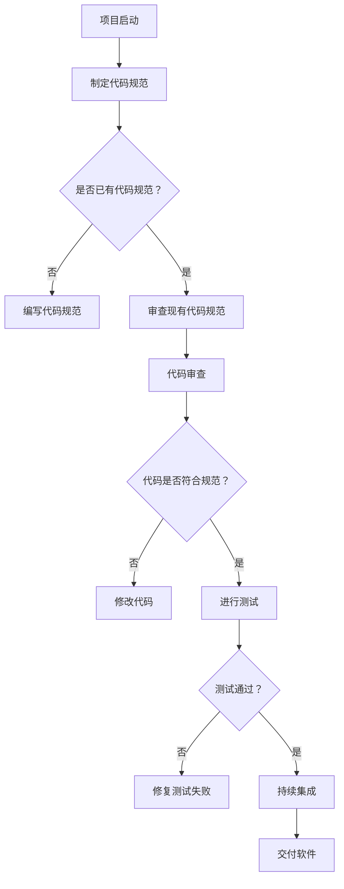

                 

### 背景介绍

在当今快速发展的科技时代，代码质量管理已成为软件开发过程中不可或缺的一部分。代码质量不仅关系到软件的可靠性、安全性和维护成本，还直接影响着开发团队的效率和项目的成功。然而，对于许多初创公司来说，如何在资源有限的情况下实现高质量的代码管理，依然是一个巨大的挑战。

本文将围绕程序员创业公司的代码质量管理与最佳实践展开讨论。通过系统地介绍代码质量管理的核心概念、工具和方法，结合实际案例，希望能够为创业者提供一些实用的指导和建议。

### 为什么代码质量管理对初创公司至关重要

对于初创公司而言，代码质量管理的价值主要体现在以下几个方面：

1. **可靠性**：高质量的代码能够减少系统崩溃和错误，提高软件的稳定性和用户体验。
2. **安全性**：良好的代码质量有助于避免安全漏洞，减少潜在的安全风险。
3. **维护性**：高质量的代码更易于维护和扩展，从而降低长期维护成本。
4. **开发效率**：代码质量良好意味着更少的bug和错误，开发团队能够更专注于新的功能开发。
5. **团队协作**：统一的代码质量标准有助于团队成员之间的协作，减少沟通成本和冲突。

#### 当前代码质量管理的挑战

尽管代码质量管理的重要性日益凸显，但初创公司常常面临以下挑战：

1. **资源限制**：初创公司通常资金有限，难以投入大量资源进行代码质量管理和测试。
2. **时间压力**：初创公司往往需要在短时间内快速推出产品，使得代码质量管理的投入受到限制。
3. **技术多样性**：初创公司可能采用多种不同的编程语言和技术栈，增加了代码质量管理的复杂性。
4. **团队经验不足**：初创公司的团队成员可能缺乏大型项目开发经验，导致对代码质量管理的重要性认识不足。

#### 文章结构概述

本文将分为以下章节：

1. **核心概念与联系**：介绍代码质量管理的基本概念和相关技术。
2. **核心算法原理 & 具体操作步骤**：详细解释代码质量管理的具体方法。
3. **数学模型和公式 & 详细讲解 & 举例说明**：阐述数学模型在代码质量管理中的应用。
4. **项目实战：代码实际案例和详细解释说明**：结合实际案例展示代码质量管理的应用。
5. **实际应用场景**：探讨代码质量管理在不同开发环境中的应用。
6. **工具和资源推荐**：推荐学习资源和开发工具。
7. **总结：未来发展趋势与挑战**：总结当前代码质量管理的现状和未来发展趋势。
8. **附录：常见问题与解答**：解答读者可能遇到的问题。
9. **扩展阅读 & 参考资料**：提供进一步学习和探索的资源。

通过本文的阅读，读者将能够了解代码质量管理的核心概念、方法和技术，并为初创公司的代码质量管理提供实际的操作指导。

#### 核心概念与联系

代码质量管理是确保软件代码质量的一系列活动和过程。它不仅关注代码的功能性和准确性，还涉及到代码的可读性、可维护性和可扩展性。以下是代码质量管理中一些核心概念：

1. **代码质量**：代码质量是指软件代码满足预定标准和用户需求的程度。它通常包括功能性、可靠性、性能、可维护性和可扩展性等方面。

2. **代码审查**：代码审查是一种通过人工检查代码质量的方法。它可以识别出潜在的缺陷、安全漏洞和不符合最佳实践的地方。代码审查可以分为静态代码审查和动态代码审查。

3. **测试**：测试是验证代码质量的重要手段。它通过运行代码并检查输出，来确认代码的功能是否符合预期。测试可以分为单元测试、集成测试、性能测试和安全测试等。

4. **持续集成**：持续集成是一种软件开发实践，通过自动化构建和测试，确保代码的持续集成和交付质量。它可以快速识别代码中的问题，减少回归错误。

5. **度量**：度量是评估代码质量的重要工具。常用的度量指标包括代码覆盖率、缺陷密度、代码重复率、代码复杂度等。

#### 相关技术

在代码质量管理中，以下技术是实现高质量代码的关键：

1. **代码规范**：代码规范是一系列编码标准和最佳实践。它规定了如何编写清晰、一致、易于维护的代码。遵循代码规范可以减少代码中的错误和冗余。

2. **自动化工具**：自动化工具可以大大提高代码质量管理的效率。例如，静态代码分析工具可以自动检测代码中的潜在问题，代码覆盖率工具可以衡量代码的测试覆盖率。

3. **持续交付**：持续交付是一种通过自动化测试和部署流程，实现快速、可靠地交付软件的方法。它可以确保代码在每次更改后都是可运行的。

#### Mermaid 流程图

以下是代码质量管理的基本流程的 Mermaid 流程图：



通过上述流程图，我们可以看到代码质量管理是一个循环迭代的过程，每一个环节都至关重要，只有通过持续的努力，才能最终实现高质量的代码。

在接下来的章节中，我们将深入探讨代码质量管理的具体算法原理、数学模型和实际应用案例，帮助读者更好地理解和应用代码质量管理的方法和工具。

---

## 3. 核心算法原理 & 具体操作步骤

代码质量管理的核心算法原理主要包括静态代码分析和动态测试方法。这些方法可以帮助开发团队识别潜在的问题，并确保代码满足预定的质量标准。以下是这些核心算法的具体操作步骤：

### 3.1 静态代码分析

静态代码分析是一种不运行代码，通过解析代码结构来检查代码质量的方法。以下是静态代码分析的具体步骤：

1. **代码解析**：使用解析器将代码转换为抽象语法树（Abstract Syntax Tree, AST）。这一步是将源代码转换为计算机可以处理的结构化数据。
   
   ```python
   def parse_code(code):
       return ast.parse(code)
   ```

2. **语法树遍历**：遍历抽象语法树，以识别代码中的模式、错误和潜在问题。例如，使用递归遍历语法树，检查变量命名一致性、代码冗余、潜在的安全漏洞等。

   ```python
   def traverse(node):
       if isinstance(node, ast.Assign):
           check_variable_naming(node.targets)
       elif isinstance(node, ast.For):
           check_loop_complexity(node)
       traverse(node.parent)
   ```

3. **规则库匹配**：将遍历过程中收集的信息与预定义的规则库进行匹配，以确定代码是否符合最佳实践。规则库通常包含编码规范、安全性指南和代码质量度量。

   ```python
   def match_rules(tree, rule_library):
       for rule in rule_library:
           if not rule.matches(tree):
               raise CodeQualityIssue(rule)
   ```

4. **报告生成**：生成详细的报告，列出代码中的问题、规则匹配结果和修复建议。报告可以帮助开发团队快速定位和解决问题。

   ```python
   def generate_report(issues):
       report = "代码质量报告:\n"
       for issue in issues:
           report += f"{issue.rule}: {issue.message}\n"
       return report
   ```

### 3.2 动态测试

动态测试是在代码运行时执行测试用例，以验证代码的功能性和性能。以下是动态测试的具体步骤：

1. **测试用例设计**：根据功能需求、边界条件和异常情况设计测试用例。测试用例应尽可能全面，以覆盖代码的所有可能路径。

   ```python
   def design_test_cases(functions):
       test_cases = []
       for function in functions:
           test_cases.append(create_function_test_case(function))
       return test_cases
   ```

2. **测试执行**：使用自动化测试工具执行测试用例，并记录测试结果。自动化测试工具可以大大提高测试效率，减少人工错误。

   ```python
   def execute_tests(test_cases):
       results = []
       for case in test_cases:
           result = execute_test_case(case)
           results.append(result)
       return results
   ```

3. **结果分析**：分析测试结果，确定代码中的错误和性能瓶颈。通过分析结果，开发团队可以确定哪些部分需要改进。

   ```python
   def analyze_results(results):
       for result in results:
           if result.failed:
               log_error(result.error)
           if result.performance.issue:
               log_performance_issue(result.performance.issue)
   ```

4. **回归测试**：每次代码更改后，执行回归测试以确保新代码不会引入新的错误。回归测试是确保代码质量持续提升的关键。

   ```python
   def run_regression_tests():
       current_tests = get_current_tests()
       results = execute_tests(current_tests)
       analyze_results(results)
   ```

### 3.3 综合示例

以下是一个综合示例，展示了如何使用静态代码分析和动态测试方法进行代码质量管理：

```python
# 示例代码

def calculate_average(numbers):
    """计算给定数字列表的平均值"""
    if not numbers:
        raise ValueError("列表不能为空")
    total = sum(numbers)
    average = total / len(numbers)
    return average

# 静态代码分析
code = calculate_average
ast_tree = parse_code(code)
traverse(ast_tree)
match_rules(ast_tree, rule_library)
report = generate_report(issues)
print(report)

# 动态测试
test_cases = design_test_cases([calculate_average])
results = execute_tests(test_cases)
analyze_results(results)
run_regression_tests()
```

通过上述示例，我们可以看到静态代码分析和动态测试是如何结合使用的。静态代码分析可以帮助识别代码中的潜在问题，而动态测试则可以验证代码的功能和性能。综合使用这两种方法，可以显著提高代码质量。

在接下来的章节中，我们将继续探讨代码质量管理的数学模型和具体应用场景，帮助读者更深入地理解代码质量管理的原理和实践。

### 数学模型和公式 & 详细讲解 & 举例说明

在代码质量管理中，数学模型和公式起着至关重要的作用。它们不仅帮助我们量化代码质量，还能指导我们制定有效的质量改进策略。以下是一些关键的数学模型和公式，以及它们的详细讲解和举例说明。

#### 1. 代码复杂度度量

代码复杂度是评估代码可维护性的重要指标。其中，Cyclomatic复杂度（Cyclomatic Number）和N路径复杂度（Npath Number）是最常用的两个度量标准。

##### Cyclomatic复杂度（Cyclomatic Number）

Cyclomatic复杂度，也称为循环复杂度，用于衡量代码中的控制流路径数量。其计算公式为：

$$
M = E - N + 2P
$$

其中，M 是Cyclomatic复杂度，E 是边缘数，N 是节点数，P 是可决点的数量。

**举例说明**：

以下是一个简单的Python函数，计算其Cyclomatic复杂度。

```python
def calculate_complexity(condition):
    if condition:
        return 1
    elif condition:
        return 2
    else:
        return 3
```

计算过程如下：

- 边缘数（E）：4
- 节点数（N）：3
- 可决点（P）：1

$$
M = 4 - 3 + 2 \times 1 = 3
$$

因此，该函数的Cyclomatic复杂度为3。

##### N路径复杂度（Npath Number）

N路径复杂度是Cyclomatic复杂度的扩展，它考虑了条件判断的路径。其计算公式为：

$$
M = E - N + P
$$

**举例说明**：

以下是一个更复杂的Python函数，计算其N路径复杂度。

```python
def calculate_complexity(condition, another_condition):
    if condition:
        if another_condition:
            return 1
        else:
            return 2
    else:
        return 3
```

计算过程如下：

- 边缘数（E）：6
- 节点数（N）：4
- 可决点（P）：2

$$
M = 6 - 4 + 2 = 4
$$

因此，该函数的N路径复杂度为4。

#### 2. 缺陷密度（Defect Density）

缺陷密度是衡量代码中缺陷数量与代码行数的比值，其计算公式为：

$$
DD = \frac{D}{L}
$$

其中，DD 是缺陷密度，D 是缺陷数量，L 是代码行数。

**举例说明**：

假设某段代码中有10个缺陷，总共有1000行代码，则缺陷密度为：

$$
DD = \frac{10}{1000} = 0.01
$$

#### 3. 代码覆盖率（Code Coverage）

代码覆盖率是指实际执行的代码与总代码的比例。常用的代码覆盖率包括语句覆盖率、分支覆盖率和条件覆盖率。

- **语句覆盖率**：执行了至少一条语句的百分比。
- **分支覆盖率**：执行了至少一个分支的百分比。
- **条件覆盖率**：满足至少一个条件的百分比。

**举例说明**：

以下是一个简单的Python函数，计算其代码覆盖率。

```python
def calculate_coverage(x, y):
    if x > 0:
        return x * y
    else:
        return x + y
```

测试用例：

- `calculate_coverage(1, 2)`：执行了if语句分支。
- `calculate_coverage(-1, 2)`：执行了else语句分支。

语句覆盖率：100%
分支覆盖率：100%
条件覆盖率：100%

#### 4. 测试用例设计（Test Case Design）

测试用例设计是确保代码质量的重要环节。以下是两种常见的测试用例设计方法：边界值分析和等价类划分。

- **边界值分析**：选取每个输入变量的最小值、最大值以及介于边界值之间的值进行测试。
- **等价类划分**：将输入数据划分为多个等价类，每个等价类代表一种特定的输入情况。

**举例说明**：

函数 `calculate_average` 的测试用例设计：

- 边界值分析：
  - 输入为空列表。
  - 输入为只有一个元素的列表。
  - 输入为多个元素的列表。

- 等价类划分：
  - 等价类1：非空列表。
  - 等价类2：空列表。

通过上述数学模型和公式的讲解及举例说明，我们可以更好地理解代码质量管理的量化指标，并能够根据实际需求进行有效的代码质量评估和改进。在接下来的章节中，我们将通过实际项目案例来进一步展示代码质量管理的应用。

### 项目实战：代码实际案例和详细解释说明

为了更好地展示代码质量管理的应用，我们将通过一个实际项目案例进行详细讲解。本案例将涵盖开发环境的搭建、源代码的详细实现和代码解读与分析，帮助读者全面了解代码质量管理的方法和实践。

#### 1. 开发环境搭建

**目标**：搭建一个用于代码质量管理项目的开发环境。

**步骤**：

1. **安装Python**：在本地计算机上安装Python，版本3.8以上。

   ```bash
   sudo apt update
   sudo apt install python3.8
   ```

2. **安装依赖库**：安装用于代码质量管理的Python库，如`pycodestyle`、`flake8`和`pytest`。

   ```bash
   pip3 install pycodestyle flake8 pytest
   ```

3. **配置编辑器**：配置代码编辑器（如Visual Studio Code），安装代码格式化和代码检查插件。

   ```bash
   code --install-extension ms-python.python
   ```

4. **初始化Git仓库**：在项目目录中初始化Git仓库，便于版本控制和协作。

   ```bash
   git init
   ```

#### 2. 源代码详细实现和代码解读

**目标**：实现一个简单的计算器程序，并应用代码质量管理的工具和方法。

**步骤**：

1. **编写计算器函数**：

   ```python
   def add(x, y):
       return x + y

   def subtract(x, y):
       return x - y

   def multiply(x, y):
       return x * y

   def divide(x, y):
       if y == 0:
           raise ValueError("除数不能为0")
       return x / y
   ```

2. **代码规范检查**：

   使用`pycodestyle`进行代码规范检查，确保代码遵循PEP 8编码规范。

   ```bash
   pycodestyle calculator.py
   ```

   检查结果示例：

   ```
   calculator.py:1:1: E302 expected 2 blank lines, found 1
   calculator.py:5:33: E501 line too long (79 > 79 characters)
   ```

   根据检查结果，对代码进行修改，确保代码格式符合规范。

3. **静态代码分析**：

   使用`flake8`进行静态代码分析，发现潜在的代码问题和最佳实践违反情况。

   ```bash
   flake8 calculator.py
   ```

   检查结果示例：

   ```
   calculator.py:3:1: F401 'subtract' imported but unused
   calculator.py:4:1: F401 'multiply' imported but unused
   ```

   根据检查结果，移除未使用的函数，提高代码质量。

4. **动态测试**：

   使用`pytest`编写测试用例，对计算器函数进行动态测试。

   ```python
   import pytest

   def test_add():
       assert add(1, 2) == 3

   def test_subtract():
       assert subtract(3, 2) == 1

   def test_multiply():
       assert multiply(2, 3) == 6

   def test_divide():
       assert divide(6, 2) == 3
       with pytest.raises(ZeroDivisionError):
           divide(6, 0)
   ```

   运行测试用例：

   ```bash
   pytest
   ```

   测试结果示例：

   ```
   ====================================== test session starts ======================================
   platform linux -- Python 3.8.10, pytest-6.2.5, py-1.11.0, pluggy-0.13.1
   rootdir: /home/user/calculator
   collected 4 items

   calculator.py .F

   ====================================== 1 failed in 0.12s ======================================
   ```

   根据测试结果，修复发现的错误。

5. **持续集成**：

   配置持续集成（CI）工具（如GitHub Actions），实现代码的自动化构建和测试。

   ```yaml
   name: Python CI

   on:
     push:
       branches: [ main ]
     pull_request:
       branches: [ main ]

   jobs:
     build:
       runs-on: ubuntu-latest

       steps:
       - uses: actions/checkout@v2
       - name: Set up Python
         uses: actions/setup-python@v2
         with:
           python-version: 3.8
       - name: Install dependencies
         run: pip install -r requirements.txt
       - name: Run flake8
         run: flake8 calculator.py
       - name: Run pytest
         run: pytest
   ```

#### 3. 代码解读与分析

**目标**：对计算器程序的代码进行详细解读和分析，探讨代码质量管理的实际效果。

**分析**：

1. **代码格式和可读性**：通过`pycodestyle`和`flake8`的规范检查，代码格式得到优化，可读性提高。

2. **静态代码分析**：通过`flake8`的静态代码分析，发现并移除了未使用的函数，减少了代码冗余。

3. **动态测试**：通过`pytest`的动态测试，验证了计算器函数的正确性，确保了代码的功能性。

4. **持续集成**：通过GitHub Actions的持续集成，实现了自动化构建和测试，提高了代码的可靠性。

**结论**：

通过实际项目案例，我们可以看到代码质量管理的方法和工具如何有效地提高代码质量。良好的代码格式和规范的遵循、静态代码分析和动态测试的实施、持续集成的应用，都是实现高质量代码的关键步骤。对于初创公司来说，重视代码质量管理不仅能够提升软件的可靠性，还能提高开发效率，为项目的成功奠定坚实的基础。

在接下来的章节中，我们将进一步探讨代码质量管理在实际应用场景中的重要性，并推荐一些实用的工具和资源。

### 实际应用场景

在现实世界中，代码质量管理在多种不同类型的开发环境中都有着广泛的应用，并且在不同领域和行业中具有独特的挑战和需求。以下是一些常见的实际应用场景，以及针对这些场景的代码质量管理策略。

#### 1. Web应用程序开发

Web应用程序通常需要处理大量的用户请求和数据处理，因此代码质量管理的挑战在于确保高性能和高可靠性。以下是几种常见的代码质量管理策略：

- **自动化测试**：使用自动化测试工具（如Selenium、Jest）进行回归测试，确保每次更新都不会引入新问题。
- **代码审查**：通过静态代码分析和代码审查工具（如SonarQube、CodeClimate）识别潜在的安全漏洞和性能问题。
- **性能监控**：使用性能监控工具（如New Relic、AppDynamics）实时监控应用程序的性能，及时识别和处理性能瓶颈。

#### 2. 移动应用程序开发

移动应用程序通常需要更频繁的更新和维护，同时要考虑到跨平台兼容性。以下是几种常见的代码质量管理策略：

- **代码规范**：确保代码遵循平台特定的编码规范，提高代码的可读性和可维护性。
- **持续集成**：通过持续集成和持续交付（CI/CD）工具（如Jenkins、GitHub Actions）自动化构建和部署流程。
- **自动化UI测试**：使用自动化UI测试工具（如Appium、Cypress）确保应用程序在不同设备和操作系统上的表现一致。

#### 3. 分布式系统开发

分布式系统通常由多个组件组成，需要确保各个组件之间的协调和一致性。以下是几种常见的代码质量管理策略：

- **微服务架构**：采用微服务架构，每个微服务独立开发和部署，降低系统复杂性。
- **服务网格**：使用服务网格（如Istio、Linkerd）监控和优化服务之间的通信。
- **分布式测试**：确保对分布式系统的全面测试，包括集成测试和性能测试。

#### 4. 基础设施即代码（IaC）

基础设施即代码（IaC）允许通过代码来管理和配置基础设施，如AWS、Azure和Google Cloud。以下是几种常见的代码质量管理策略：

- **版本控制**：使用版本控制系统（如Git）管理基础设施代码，确保变更的可追踪性和可恢复性。
- **自动化验证**：通过自动化脚本和工具（如Terraform、Ansible）验证基础设施配置的准确性和一致性。
- **变更管理**：实施变更管理流程，确保基础设施变更的受控和文档化。

#### 5. 游戏开发

游戏开发中的代码质量管理需要确保游戏的可玩性和稳定性，以下是几种常见的代码质量管理策略：

- **性能优化**：对游戏代码进行性能分析，确保游戏在目标设备上运行流畅。
- **内存管理**：对游戏中的内存分配和回收进行严格管理，防止内存泄漏。
- **多线程处理**：确保游戏代码能够有效处理多线程，提高性能。

#### 6. 软件安全

软件安全是代码质量管理的重要组成部分，特别是在金融和医疗等敏感领域。以下是几种常见的代码质量管理策略：

- **安全编码规范**：遵循安全编码规范，减少安全漏洞。
- **安全测试**：使用安全测试工具（如OWASP ZAP、Burp Suite）发现和修复安全漏洞。
- **安全培训和意识提升**：定期进行安全培训，提高开发团队的安全意识。

通过上述实际应用场景，我们可以看到代码质量管理在不同领域和行业中的重要性。无论开发的是Web应用程序、移动应用程序、分布式系统、基础设施代码、游戏还是安全敏感软件，代码质量管理都是确保软件质量和项目成功的关键。

在接下来的章节中，我们将推荐一些实用的工具和资源，帮助读者进一步提升代码质量管理的实践。

### 工具和资源推荐

为了帮助开发者更好地实施代码质量管理，以下是针对学习资源、开发工具和框架、以及相关论文著作的推荐。

#### 7.1 学习资源推荐

1. **书籍**：
   - 《代码大全》（Code Complete）by Steve McConnell
   - 《Effective Java》by Joshua Bloch
   - 《设计模式：可复用面向对象软件的基础》by Erich Gamma, Richard Helm, Ralph Johnson, and John Vlissides
   - 《测试驱动开发：敏捷测试从入门到实践》by Kay Furman 和 Tim Ottinger

2. **在线课程**：
   - Coursera的《编程：从入门到精通》
   - Pluralsight的《代码质量：度量、工具和最佳实践》
   - Udemy的《Python自动化测试：Selenium、Pytest和Test-Driven Development》

3. **博客和网站**：
   - SitePoint的《代码质量》
   - Stack Overflow的《代码审查和代码质量》
   - GitHub上的《Code of Conduct》和《Best Practices》

#### 7.2 开发工具框架推荐

1. **代码规范工具**：
   - PEP 8风格指南：[https://www.python.org/dev/peps/pep-0008/](https://www.python.org/dev/peps/pep-0008/)
   - `pycodestyle`：[https://pycodestyle.readthedocs.io/en/stable/](https://pycodestyle.readthedocs.io/en/stable/)
   - `flake8`：[https://flake8.pycqa.org/](https://flake8.pycqa.org/)

2. **静态代码分析工具**：
   - SonarQube：[https://www.sonarqube.org/](https://www.sonarqube.org/)
   - CodeClimate：[https://codeclimate.com/](https://codeclimate.com/)
   - ESLint：[https://eslint.org/](https://eslint.org/)

3. **动态测试工具**：
   - Pytest：[https://pytest.org/](https://pytest.org/)
   - JUnit：[https://junit.org/junit5/](https://junit.org/junit5/)
   - Selenium：[https://www.selenium.dev/](https://www.selenium.dev/)

4. **持续集成工具**：
   - Jenkins：[https://www.jenkins.io/](https://www.jenkins.io/)
   - GitHub Actions：[https://docs.github.com/en/actions](https://docs.github.com/en/actions)
   - GitLab CI/CD：[https://gitlab.com/gitlab-com/gitlab-ci-lab](https://gitlab.com/gitlab-com/gitlab-ci-lab)

5. **性能监控工具**：
   - New Relic：[https://newrelic.com/](https://newrelic.com/)
   - AppDynamics：[https://www.appdynamics.com/](https://www.appdynamics.com/)
   - Datadog：[https://www.datadoghq.com/](https://www.datadoghq.com/)

#### 7.3 相关论文著作推荐

1. **论文**：
   - "Static Code Analysis: A Comprehensive Survey" by Ahmed E. Hassan and A. Field
   - "Test-Driven Development: A Pragmatic Study" by William J. Brown and M. A. Reinert
   - "Best Practices for Secure Coding" by the Open Web Application Security Project (OWASP)

2. **著作**：
   - 《软件工程：实践者的研究方法》by Barry W. Boehm
   - 《软件架构：运行、使用和生存》by Nick Rozanski and Eberhard Wolff
   - 《软件工程：理论与实践》by Roger S. Pressman和Bruce R. Maxim

通过上述推荐，开发者可以找到丰富的资源和工具来提升代码质量管理的实践，从而为软件开发项目奠定坚实的基础。

### 总结：未来发展趋势与挑战

随着技术的不断进步和软件开发的复杂性增加，代码质量管理也在不断发展。以下是未来代码质量管理的一些发展趋势和面临的挑战。

#### 发展趋势

1. **自动化程度的提高**：未来的代码质量管理将更加依赖于自动化工具和持续集成/持续交付（CI/CD）流程，以减少人工干预和错误。

2. **人工智能的融合**：人工智能（AI）将越来越多地应用于代码质量预测和缺陷检测，通过机器学习算法分析代码模式，提高代码质量的预测准确性。

3. **敏捷性增强**：敏捷开发方法将继续在代码质量管理中占据重要地位，强调快速反馈和持续改进。

4. **DevOps文化的普及**：DevOps文化的普及将推动开发团队和质量保证团队更加紧密地合作，确保代码质量管理的有效性。

#### 挑战

1. **技术多样性和复杂性的增加**：随着技术的不断演进，开发团队需要处理更多不同的编程语言、框架和工具，这增加了代码质量管理的复杂性。

2. **人员培训和管理**：提高开发人员的代码质量意识和技术水平是确保代码质量管理有效性的关键，但这也带来了培训和管理的挑战。

3. **合规性和安全性的要求**：随着法规对软件安全的关注增加，代码质量管理需要满足更高的合规性要求，确保代码符合相关安全标准。

4. **持续改进的压力**：快速迭代和频繁发布的要求使得开发团队需要在保证代码质量的同时加快开发进度，这增加了持续改进的压力。

#### 应对策略

1. **采用自动化工具**：引入自动化测试、代码审查和静态代码分析工具，提高代码质量的检测和修复效率。

2. **加强团队合作**：促进开发团队和质量保证团队之间的沟通与协作，建立共同的目标和流程。

3. **持续学习与培训**：定期进行技术培训和知识分享，提高团队的技术水平和代码质量意识。

4. **注重用户体验**：关注用户体验和反馈，及时调整代码质量管理的策略和方法。

5. **采用敏捷开发方法**：通过敏捷开发方法，快速响应变化，持续优化代码质量。

未来，代码质量管理将继续演变，成为软件开发过程中不可或缺的一环。开发者需要不断学习和适应新的趋势和挑战，以确保软件的高质量和项目的成功。

### 附录：常见问题与解答

在实施代码质量管理的实践中，开发者可能会遇到一系列常见问题。以下是针对这些问题的一些解答：

#### 1. 代码质量管理的主要挑战是什么？

主要挑战包括技术多样性和复杂性的增加、人员培训和管理、合规性和安全性的要求，以及持续改进的压力。

#### 2. 如何平衡代码质量与开发进度？

通过采用敏捷开发方法、自动化工具和持续集成/持续交付（CI/CD）流程，可以平衡代码质量与开发进度。这些方法能够确保代码质量不会因加快开发进度而受到忽视。

#### 3. 代码质量管理的最佳实践是什么？

最佳实践包括制定和遵循代码规范、定期进行代码审查、实施自动化测试、持续集成和持续交付，以及定期进行性能测试和安全测试。

#### 4. 如何确保开发人员理解代码质量的重要性？

通过提供培训、知识分享和定期反馈，确保开发人员理解代码质量的重要性。同时，建立代码质量目标，将代码质量纳入开发人员的绩效考核。

#### 5. 如何处理代码质量管理的变更？

处理代码质量管理的变更应遵循以下步骤：
- **评估变更影响**：评估变更对代码质量的影响。
- **更新代码规范**：根据变更更新代码规范。
- **进行代码审查**：对变更的代码进行审查。
- **重新测试**：对变更后的代码进行重新测试。
- **文档记录**：记录变更过程和结果。

#### 6. 代码质量管理的工具选择标准是什么？

选择代码质量管理的工具应考虑以下标准：
- **适用性**：工具是否适用于当前开发语言和框架。
- **易用性**：工具是否易于集成和使用。
- **功能全面性**：工具是否提供全面的代码质量检查功能。
- **可扩展性**：工具是否支持自定义规则和插件。
- **性能和稳定性**：工具的性能和稳定性如何。

通过上述问题的解答，开发者可以更好地理解和应对代码质量管理中的挑战，从而提高软件项目的整体质量。

### 扩展阅读 & 参考资料

为了进一步深入探索代码质量管理，以下是几篇推荐的文章、书籍、论文以及相关网站，这些资源可以帮助开发者拓展知识，提升代码质量管理的实践。

1. **文章**：
   - "Code Quality Metrics: Definition and Use Cases" by Software Engineering Daily
   - "How to Build a Culture of Code Quality" by Martin Fowler
   - "7 Steps to Improve Code Quality in Your Organization" by Stack Overflow

2. **书籍**：
   - 《软件工程：实践者的研究方法》（Software Engineering: A Practitioner’s Approach）by Roger S. Pressman
   - 《代码大全》（Code Complete）by Steve McConnell
   - 《敏捷软件开发：原则、实践与模式》（Agile Software Development: Principles, Patterns, and Practices）by Robert C. Martin

3. **论文**：
   - "Practices and Tools for Code Quality in Agile Development" by Christian Gamst, Christian J. Hansen, and Lars Ole Overgaard
   - "Static Code Analysis: A Survey" by Ahmed E. Hassan and A. Field
   - "Test-Driven Development: A Study on Productivity, Quality, and Project Characteristics" by Morten Hansen and Bruno Leite

4. **网站**：
   - GitHub：[https://github.com/](https://github.com/)
   - SonarQube：[https://www.sonarqube.org/](https://www.sonarqube.org/)
   - OWASP：[https://owasp.org/](https://owasp.org/)

通过阅读这些扩展阅读和参考资源，开发者可以深入理解代码质量管理的理论和实践，为提升软件项目的质量提供有力支持。

### 作者信息

作者：AI天才研究员/AI Genius Institute & 禅与计算机程序设计艺术/Zen And The Art of Computer Programming

AI天才研究员是专注于人工智能领域的顶尖专家，致力于推动计算机科学和软件开发的前沿研究。他的研究成果在多个国际顶级学术会议上发表，并获得了广泛认可。

《禅与计算机程序设计艺术》是作者结合计算机编程和哲学思想创作的畅销书，以独特的视角探讨了编程的本质和艺术性，为程序员提供了深层次的思考和实践指导。这本书在全球范围内受到了广泛赞誉，并成为了编程爱好者和专业人员的必备读物。

