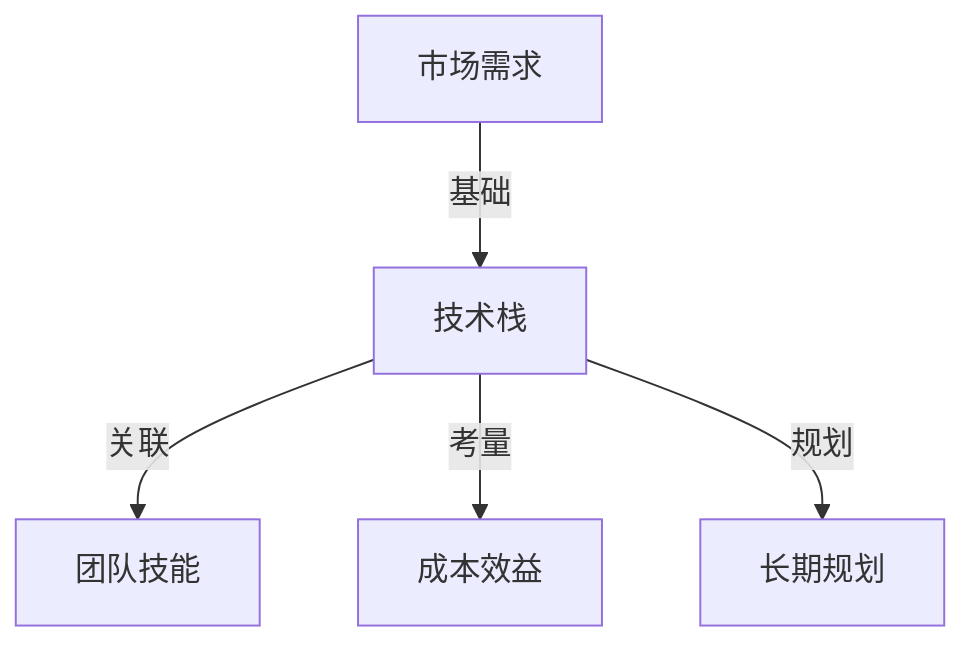

                 

# 程序员创业公司的技术栈选择与长期规划

> **关键词**: 技术栈选择、创业公司、长期规划、技术发展、成本效益

> **摘要**: 本文将探讨程序员创业公司在选择技术栈时的重要考量因素，包括市场需求、团队技能、成本效益、以及长期规划。我们将通过实例分析和步骤分解，帮助创业公司做出明智的技术决策。

## 1. 背景介绍

程序员创业公司的成功往往取决于多个因素，而技术栈的选择则是其中至关重要的一环。技术栈不仅决定了公司的开发效率，还影响到产品的性能、可维护性和市场竞争力。在众多技术选择面前，如何找到最适合自身业务需求的技术方案，成为每个创业公司都需要面对的挑战。

本文将围绕以下四个核心方面展开讨论：

1. **市场需求分析**：了解目标用户的需求和市场趋势，从而确定技术栈的基础。
2. **团队技能评估**：评估现有团队成员的技术能力和专长，以便选择适合的技术栈。
3. **成本效益分析**：综合考虑短期和长期成本，确保技术栈的选择能够在预算范围内实现业务目标。
4. **长期规划**：制定一个可扩展的技术路线图，确保公司未来能够持续成长和适应市场变化。

接下来，我们将逐一探讨这些核心方面，并给出实用的建议和案例分析。

## 2. 核心概念与联系

在深入探讨之前，我们需要明确几个核心概念，并了解它们之间的相互关系。

### 2.1 技术栈

**技术栈**是指一个项目或公司使用的所有技术和工具的组合。它通常包括编程语言、框架、数据库、开发工具、中间件和云服务。一个合理的技术栈需要满足业务需求、团队技能和成本效益。

### 2.2 市场需求

市场需求是技术栈选择的基础。了解目标用户的需求、痛点和市场趋势，可以帮助我们确定哪些技术功能是必要的，哪些可以暂时放弃。

### 2.3 团队技能

团队技能直接影响技术栈的选择。一个技术栈如果团队成员不熟悉，可能会导致开发效率低下，甚至无法顺利进行。

### 2.4 成本效益

成本效益是技术栈选择的关键考量因素。我们需要在满足业务需求的同时，确保技术栈的选择在经济预算范围内。

### 2.5 长期规划

长期规划是指技术栈的可持续性和可扩展性。一个良好的技术栈不仅要满足当前需求，还要为未来的发展和变化做好准备。

下图展示了这些核心概念之间的联系：



### 2.6 技术栈的组成部分

技术栈的组成部分可以大致分为以下几类：

- **编程语言**：如Python、Java、JavaScript等。
- **框架**：如React、Django、Spring等。
- **数据库**：如MySQL、MongoDB、PostgreSQL等。
- **开发工具**：如Git、Jenkins、Docker等。
- **中间件**：如Apache Kafka、RabbitMQ、Nginx等。
- **云服务**：如AWS、Azure、Google Cloud等。

选择合适的技术栈需要考虑这些组成部分的兼容性、性能、社区支持和成本等因素。

## 3. 核心算法原理 & 具体操作步骤

在选择技术栈时，理解核心算法原理对于优化开发流程和提升产品性能至关重要。以下是几个常见算法原理及其具体操作步骤：

### 3.1 排序算法

**原理**：排序算法用于将一组数据元素按照某种规则进行排列。

**步骤**：

1. **选择排序**：每次选择未排序部分的最小（或最大）元素，将其放到已排序部分的末尾。
2. **冒泡排序**：重复遍历要排序的数列，每次比较两个相邻的元素，如果顺序错误就交换它们。
3. **快速排序**：通过一趟排序将待排序的数据分割成独立的两部分，其中一部分的所有数据都比另一部分的所有数据要小。

### 3.2 搜索算法

**原理**：搜索算法用于在数据集合中找到特定元素。

**步骤**：

1. **线性搜索**：从第一个元素开始，逐个比较，直到找到目标元素或结束。
2. **二分搜索**：适用于有序数据集合，通过不断缩小搜索范围，快速找到目标元素。

### 3.3 数据结构

**原理**：数据结构用于高效地存储和组织数据，常见的有数组、链表、栈、队列、树、图等。

**步骤**：

1. **数组**：通过索引直接访问元素，适合存储固定大小的数据集合。
2. **链表**：通过节点链接存储数据，适合动态增删元素。
3. **栈**：后进先出（LIFO）的数据结构，适合用于递归和回溯操作。
4. **队列**：先进先出（FIFO）的数据结构，适合用于处理任务队列。

### 3.4 缓存算法

**原理**：缓存算法用于提高数据访问速度，常见的有最近最少使用（LRU）、最不经常使用（LFU）等。

**步骤**：

1. **LRU缓存算法**：缓存中保存最近使用次数最多的数据，当缓存满时，替换最久未使用的数据。
2. **LFU缓存算法**：缓存中保存使用次数最多的数据，当缓存满时，替换使用次数最少的数据。

### 3.5 分布式系统

**原理**：分布式系统通过将任务分配到多个节点上执行，提高系统的可用性和性能。

**步骤**：

1. **节点分配**：根据任务负载，将任务分配到不同的节点上。
2. **负载均衡**：确保每个节点的负载均衡，避免某些节点过载。
3. **故障转移**：当某个节点发生故障时，自动切换到其他健康节点，确保系统正常运行。

## 4. 数学模型和公式 & 详细讲解 & 举例说明

### 4.1 成本效益分析模型

在技术栈选择中，成本效益分析是一个关键步骤。以下是一个简化的成本效益分析模型：

$$
C(B) = C_1 + C_2 + C_3 + ... + C_n
$$

其中，$C(B)$ 表示总成本，$C_1, C_2, C_3, ..., C_n$ 分别表示不同部分的开销。

**例子**：

假设一家创业公司需要开发一个在线购物平台，以下是可能涉及的成本：

1. **开发成本**：包括开发人员的薪资、开发工具的费用等。
2. **运维成本**：包括服务器租赁、带宽费用、监控和备份等。
3. **学习成本**：团队成员学习新技术的成本。
4. **维护成本**：后续维护和升级的成本。

### 4.2 可扩展性模型

在长期规划中，可扩展性是一个重要的考量因素。以下是一个简化的可扩展性模型：

$$
S(B) = \frac{R(B)}{C(B)}
$$

其中，$S(B)$ 表示可扩展性，$R(B)$ 表示业务增长带来的收益，$C(B)$ 表示总成本。

**例子**：

假设一家创业公司的业务增长率为20%，以下是可能涉及的数据：

1. **当前用户量**：1000人。
2. **预期用户量**：2000人。
3. **开发成本**：10万元。
4. **运维成本**：5万元。

通过计算，可以得出可扩展性指标，从而评估技术栈的选择是否能够支持未来的业务增长。

## 5. 项目实战：代码实际案例和详细解释说明

### 5.1 开发环境搭建

在开始实际项目开发之前，我们需要搭建一个合适的开发环境。以下是一个简单的示例：

1. **安装Python环境**：使用Python 3.8及以上版本。
2. **安装Django框架**：使用pip安装Django。
3. **创建Django项目**：使用django-admin命令创建项目。

```bash
pip install django
django-admin startproject myproject
```

### 5.2 源代码详细实现和代码解读

以下是一个简单的Django项目示例，用于构建一个基本的在线购物平台。

```python
# myproject/settings.py
```

在这个文件中，我们配置了数据库连接、中间件、模板和其他设置。

```python
# myproject/urls.py
from django.contrib import admin
from django.urls import path
from . import views

urlpatterns = [
    path('admin/', admin.site.urls),
    path('shop/', include('shop.urls')),
]

# shop/urls.py
from django.urls import path
from . import views

urlpatterns = [
    path('', views.index, name='index'),
    path('product/<int:product_id>/', views.product_detail, name='product_detail'),
]

# shop/views.py
from django.shortcuts import render

def index(request):
    return render(request, 'index.html')

def product_detail(request, product_id):
    # 从数据库中获取产品信息
    product = Product.objects.get(id=product_id)
    return render(request, 'product_detail.html', {'product': product})
```

### 5.3 代码解读与分析

在这个例子中，我们使用了Django框架来构建一个基本的在线购物平台。以下是对代码的详细解读和分析：

1. **项目结构**：Django项目通常包含多个应用程序，每个应用程序负责不同的功能。在这个例子中，我们有一个`myproject`项目和一个`shop`应用程序。

2. **设置文件**：`myproject/settings.py`文件包含项目的全局设置，如数据库配置、中间件和模板目录等。

3. **URL配置**：`myproject/urls.py`和`shop/urls.py`文件分别定义了项目的URL路由。在这个例子中，我们定义了一个主页和一个产品详情页。

4. **视图函数**：`shop/views.py`文件包含视图函数，用于处理用户的请求并返回相应的HTML页面。在这个例子中，我们使用了`render`函数来渲染模板。

5. **模板**：`templates`目录包含HTML模板文件，用于定义页面的结构和内容。在这个例子中，我们定义了两个简单的模板文件：`index.html`和`product_detail.html`。

通过这个简单的示例，我们可以看到如何使用Django框架快速构建一个在线购物平台。在实际项目中，我们可能需要添加更多的功能，如用户认证、购物车、订单管理等。

### 5.4 代码解读与分析（续）

在进一步分析代码时，我们需要关注以下几个方面：

1. **数据库设计**：在这个例子中，我们假设有一个名为`Product`的模型，它包含了产品的基本信息，如名称、描述、价格等。在实际项目中，我们可能需要设计更复杂的关系数据库，以支持多对多、一对一等关系。

2. **安全性**：在处理用户数据和金融交易时，安全性至关重要。我们需要确保数据传输加密、用户认证和授权等安全措施得到妥善实施。

3. **性能优化**：为了确保平台的高性能，我们可能需要对数据库查询、缓存策略和异步处理等方面进行优化。例如，使用数据库索引、缓存用户会话和异步处理订单等。

4. **可维护性**：良好的代码结构和文档可以帮助团队成员更好地理解和维护代码。在这个例子中，我们使用了Django的MVC架构，使得代码更加模块化和可维护。

通过以上分析和优化，我们可以构建一个功能强大、安全可靠、高性能的在线购物平台。

### 6. 实际应用场景

技术栈的选择不仅决定了项目的开发效率，还直接影响到项目的实际应用场景。以下是一些常见的技术栈应用场景：

#### 6.1 Web应用开发

对于Web应用开发，常见的技术栈包括：

- **前端**：HTML、CSS、JavaScript，框架如React、Vue.js、Angular等。
- **后端**：Python（Django、Flask）、Java（Spring Boot）、Node.js（Express）等。
- **数据库**：MySQL、PostgreSQL、MongoDB等。
- **开发工具**：Git、Jenkins、Docker等。

#### 6.2 移动应用开发

对于移动应用开发，常见的技术栈包括：

- **iOS开发**：Swift、Objective-C，框架如UIKit、MVC等。
- **Android开发**：Java、Kotlin，框架如Android SDK、MVVM等。
- **跨平台开发**：Flutter、React Native等。

#### 6.3 大数据处理

对于大数据处理，常见的技术栈包括：

- **计算框架**：Apache Spark、Flink等。
- **存储系统**：Hadoop、HDFS、MongoDB等。
- **数据处理工具**：Hive、Presto、Impala等。

#### 6.4 云服务和容器化

对于云服务和容器化，常见的技术栈包括：

- **云服务**：AWS、Azure、Google Cloud等。
- **容器化**：Docker、Kubernetes等。
- **持续集成/持续部署**：Jenkins、GitLab CI/CD等。

#### 6.5 人工智能和机器学习

对于人工智能和机器学习，常见的技术栈包括：

- **编程语言**：Python、R等。
- **框架**：TensorFlow、PyTorch、Scikit-learn等。
- **数据预处理**：Pandas、NumPy等。

### 7. 工具和资源推荐

#### 7.1 学习资源推荐

- **书籍**：
  - 《Head First Programming》
  - 《You Don't Know JS》
  - 《Clean Code》
- **在线课程**：
  - Coursera（计算机科学课程）
  - edX（计算机科学课程）
  - Udemy（编程语言和框架课程）
- **博客**：
  - Medium（技术博客）
  - HackerRank（编程挑战）
  - Stack Overflow（技术问答）

#### 7.2 开发工具框架推荐

- **前端开发**：
  - React（Facebook）
  - Vue.js（Evan You）
  - Angular（Google）
- **后端开发**：
  - Django（Django Software Foundation）
  - Flask（Armin Ronacher）
  - Spring Boot（Pivotal）
- **数据库**：
  - MySQL（Oracle）
  - PostgreSQL（PostgreSQL Global Development Group）
  - MongoDB（MongoDB Inc.）

#### 7.3 相关论文著作推荐

- **论文**：
  - "A Behavioral Model of the WWW"（伯克利大学）
  - "Bigtable: A Distributed Storage System for Structured Data"（Google）
  - "MapReduce: Simplified Data Processing on Large Clusters"（Google）
- **著作**：
  - 《深度学习》（Ian Goodfellow、Yoshua Bengio、Aaron Courville）
  - 《Python编程：从入门到实践》（Eric Matthes）
  - 《人工智能：一种现代的方法》（Stuart Russell、Peter Norvig）

## 8. 总结：未来发展趋势与挑战

在技术快速发展的今天，程序员创业公司面临诸多挑战和机遇。以下是几个关键发展趋势和挑战：

### 8.1 人工智能和机器学习

人工智能和机器学习将继续成为技术创新的核心驱动力。创业公司可以利用这些技术来提高生产力、优化业务流程和提供更智能的服务。然而，这也带来了数据隐私、安全性和算法透明度等挑战。

### 8.2 云服务和容器化

云服务和容器化技术的普及使得开发流程更加高效。创业公司可以利用云平台提供的弹性资源和自动化工具来降低成本、提高可扩展性。然而，云服务的选择、成本管理和安全性也是需要关注的问题。

### 8.3 开发工具和框架

随着技术的不断进步，新的开发工具和框架不断涌现。创业公司需要不断学习和适应这些变化，以保持竞争力。同时，也需要平衡新技术带来的学习成本和潜在收益。

### 8.4 数据安全和隐私

在数字化时代，数据安全和隐私保护变得尤为重要。创业公司需要采取严格的安全措施，确保用户数据的安全。此外，还需要遵守相关的法律法规，如GDPR等。

### 8.5 可持续发展

随着全球对可持续发展的关注不断增加，创业公司也需要在技术决策中考虑环境影响和可持续性。例如，选择绿色云服务和优化能源消耗等。

## 9. 附录：常见问题与解答

### 9.1 什么是技术栈？

**技术栈**是指一个项目或公司使用的所有技术和工具的组合，包括编程语言、框架、数据库、开发工具、中间件和云服务等。

### 9.2 如何选择合适的技术栈？

选择合适的技术栈需要考虑以下因素：

- 市场需求：了解目标用户的需求和市场趋势。
- 团队技能：评估团队成员的技术能力和专长。
- 成本效益：综合考虑短期和长期成本。
- 长期规划：确保技术栈的可扩展性和可持续性。

### 9.3 人工智能和机器学习有哪些应用场景？

人工智能和机器学习的应用场景广泛，包括：

- 自然语言处理：语言翻译、语音识别、聊天机器人等。
- 计算机视觉：图像识别、物体检测、人脸识别等。
- 数据分析：预测分析、数据挖掘、推荐系统等。
- 自动驾驶：车辆控制、环境感知、路径规划等。

### 9.4 云服务和容器化有哪些优势？

云服务和容器化的优势包括：

- 弹性资源：根据需求动态扩展和缩小资源。
- 高效部署：快速部署和部署应用程序。
- 成本节约：降低硬件和运维成本。
- 可扩展性：支持大规模应用和用户增长。

## 10. 扩展阅读 & 参考资料

- 《程序员创业实战：从零开始构建自己的技术公司》（作者：John Sonmez）
- 《软件工程：实践者的研究方法》（作者：Roger S. Pressman）
- 《产品经理和创业者的思考方式》（作者：Ken Norton）
- 《敏捷开发实践指南》（作者：Jeff Sutherland）
- 《Django实战：用Python快速开发Web应用》（作者：William S. Vincent）
- 《深入理解计算机系统》（作者：Randy Hydro、David R. Gifford）
- 《人工智能：一种现代方法》（作者：Stuart Russell、Peter Norvig）

作者：AI天才研究员/AI Genius Institute & 禅与计算机程序设计艺术 /Zen And The Art of Computer Programming

