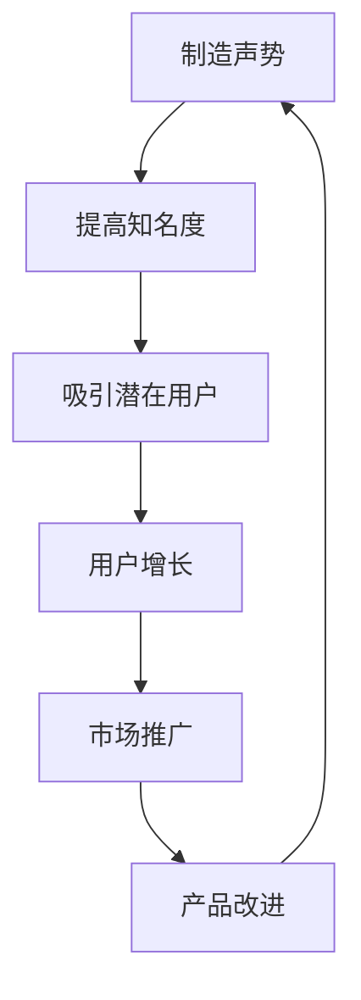

                 

# 程序员创业者的产品发布策略：如何制造声势

> **关键词：** 程序员创业，产品发布策略，制造声势，市场营销，用户增长。

> **摘要：** 本文将探讨程序员创业者如何在有限资源下，通过有效的产品发布策略，制造出足够的声势，吸引潜在用户的关注，从而实现产品的市场推广和用户增长。

## 1. 背景介绍

在当今竞争激烈的市场环境中，产品发布策略的成败往往决定了初创企业的生死。作为程序员创业者，您可能面临资源有限、市场经验不足的挑战。因此，制定一个高效的产品发布策略显得尤为重要。本文将围绕如何制造声势，探讨一些实用的策略和方法，帮助您在发布产品时吸引更多的关注。

## 2. 核心概念与联系

### 2.1 制造声势的概念

制造声势，指的是通过一系列的市场推广活动，提高产品的知名度和影响力，从而吸引潜在用户的关注。这包括但不限于广告、社交媒体宣传、线下活动等。

### 2.2 市场营销与用户增长的关系

市场营销是产品发布策略的核心，而用户增长则是市场营销的目标。有效的市场营销活动能够帮助您吸引更多的用户，提高产品的市场占有率。用户增长又反过来促进产品的改进和优化，形成良性循环。

### 2.3 Mermaid 流程图



## 3. 核心算法原理 & 具体操作步骤

### 3.1 算法原理

制造声势的核心在于如何有效地将有限的资源投入到最能产生影响力的市场推广活动中。这需要遵循以下几个原则：

1. **精准定位**：明确目标用户群体，了解他们的需求和痛点。
2. **差异化优势**：突出产品的独特卖点和差异化优势。
3. **持续创新**：不断尝试新的市场推广方式，以保持品牌的活力和吸引力。

### 3.2 操作步骤

1. **市场调研**：通过问卷调查、用户访谈等方式，了解目标用户的需求和偏好。
2. **制定市场推广计划**：根据市场调研结果，制定具体的推广策略，包括广告投放、社交媒体运营、线下活动等。
3. **执行与监测**：按照推广计划执行市场推广活动，并实时监测效果，及时调整策略。
4. **用户反馈**：收集用户反馈，了解产品的优缺点，持续优化产品。

## 4. 数学模型和公式 & 详细讲解 & 举例说明

### 4.1 数学模型

在制造声势的过程中，我们可以使用以下数学模型来衡量市场推广效果：

- **用户增长模型**：\( \text{用户增长量} = \text{市场推广效果} \times \text{目标用户规模} \)

### 4.2 详细讲解

- **市场推广效果**：衡量市场推广活动对用户增长的影响，通常用点击率、转化率等指标来表示。
- **目标用户规模**：指的是潜在用户的数量，可以通过市场调研来确定。

### 4.3 举例说明

假设一个产品有1000名目标用户，市场推广效果为10%（即每100名用户中有10名通过市场推广活动成为产品的用户），那么：

- **用户增长量** = 10% \(\times\) 1000 = 100名用户

这意味着，通过有效的市场推广活动，该产品可以在短时间内吸引100名新用户。

## 5. 项目实战：代码实际案例和详细解释说明

### 5.1 开发环境搭建

在本节中，我们将使用Python语言和Markdown编辑器（如VS Code）来编写和运行示例代码。确保您已经安装了Python和Markdown编辑器。

### 5.2 源代码详细实现和代码解读

以下是一个简单的Python脚本，用于生成一个包含市场推广效果的文本报告。

```python
# market_pricing_report.py

def calculate_user_growth(market_promotion_effect, target_user_size):
    """
    计算用户增长量
    :param market_promotion_effect: 市场推广效果（百分比）
    :param target_user_size: 目标用户规模
    :return: 用户增长量
    """
    user_growth = market_promotion_effect / 100 * target_user_size
    return user_growth

# 示例数据
market_promotion_effect = 10  # 市场推广效果（10%）
target_user_size = 1000      # 目标用户规模

# 计算用户增长量
user_growth = calculate_user_growth(market_promotion_effect, target_user_size)

# 打印报告
print(f"市场推广效果: {market_promotion_effect}%")
print(f"目标用户规模: {target_user_size}人")
print(f"用户增长量: {user_growth}人")
```

### 5.3 代码解读与分析

- **函数定义**：`calculate_user_growth` 函数用于计算用户增长量。它接受两个参数：市场推广效果（以百分比表示）和目标用户规模。
- **计算过程**：使用简单的数学运算，将市场推广效果除以100（转换为小数），再乘以目标用户规模，得到用户增长量。
- **示例数据**：在示例中，市场推广效果为10%，目标用户规模为1000人。通过调用 `calculate_user_growth` 函数，我们计算出了用户增长量为100人。

## 6. 实际应用场景

制造声势的策略适用于各种产品发布场景，包括但不限于：

- **软件应用**：通过社交媒体宣传、技术博客文章、线上演示等方式，吸引潜在用户的关注。
- **硬件产品**：通过举办发布会、线下体验活动、社交媒体互动等方式，提高产品的知名度和美誉度。
- **互联网服务**：通过精准投放广告、SEO优化、合作伙伴推广等方式，增加产品的曝光率。

## 7. 工具和资源推荐

### 7.1 学习资源推荐

- **书籍**：
  - 《精益创业》（The Lean Startup）
  - 《创业维艰》（Hard Things About Hard Things）
- **论文**：
  - “Marketing in the Age of Disruption”（《颠覆时代的营销》）
  - “A Theoretical Foundation for Data-Driven Marketing”（《数据驱动营销的理论基础》）
- **博客**：
  - growthhackers.com
  - marketingprofs.com
- **网站**：
  - entrepreneur.com
  - startup Digest

### 7.2 开发工具框架推荐

- **Python**：用于编写市场推广效果计算脚本。
- **Markdown**：用于编写和格式化技术博客文章。
- **Jupyter Notebook**：用于交互式编写和运行Python脚本。

### 7.3 相关论文著作推荐

- **论文**：
  - “Data-Driven Marketing: Why Now Is the Time to Act”（《数据驱动营销：为何现在是采取行动的时候》）
  - “Marketing Analytics for Data-Driven Decisions”（《营销分析：数据驱动决策》）
- **著作**：
  - 《数据驱动营销：方法与应用》（Data-Driven Marketing: Methods and Applications）

## 8. 总结：未来发展趋势与挑战

在未来，随着数据技术的不断进步和用户需求的多样化，制造声势的策略将变得更加精细化和智能化。挑战在于如何准确捕捉用户需求，并利用数据优化市场推广活动。此外，初创企业还需要不断创新，以适应快速变化的市场环境。

## 9. 附录：常见问题与解答

### Q: 如何制定一个有效的市场推广计划？

A: 制定有效的市场推广计划需要以下几个步骤：
1. 明确目标用户群体。
2. 分析竞争对手的市场推广策略。
3. 确定市场推广目标和预算。
4. 制定具体的推广活动和渠道。

### Q: 市场推广效果如何评估？

A: 市场推广效果的评估通常通过以下指标进行：
1. 点击率（CTR）：衡量广告或内容被点击的频率。
2. 转化率（CVR）：衡量用户从浏览到购买或注册的过程中的成功率。
3. 用户留存率：衡量用户持续使用产品的比例。

## 10. 扩展阅读 & 参考资料

- **参考资料**：
  - 《精益创业方法论：如何打造用户喜爱的产品》（The Lean Startup）
  - 《增长黑客：如何用数据驱动产品和创业》（Growth Hacker Marketing）
- **网站**：
  - [Startup Digest](https://www.startupdigest.com/)
  - [MarketingProfs](https://www.marketingprofs.com/)

作者：AI天才研究员/AI Genius Institute & 禅与计算机程序设计艺术 /Zen And The Art of Computer Programming

