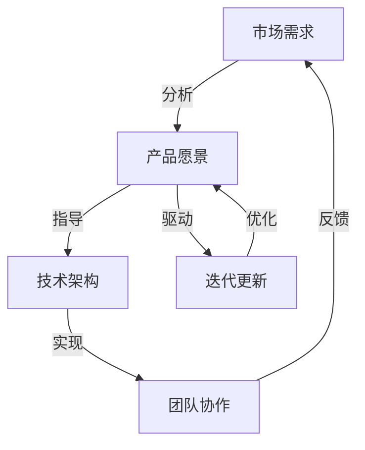

                 

### 背景介绍

在当今快速发展的科技时代，编程和创业已经成为了许多人追求的梦想。许多程序员希望通过开发自己的产品来实现创业的目标。然而，产品开发并不是一件容易的事情，它需要明确的目标、周密的规划和坚韧的执行力。本文将围绕程序员创业者的产品路线图，探讨短期目标与长期愿景的结合。

程序员创业者在选择创业方向时，需要综合考虑市场需求、技术可行性、个人兴趣和专业技能。一个明确的产品路线图可以帮助他们在竞争激烈的市场中找到立足点，并确保产品能够持续发展。

本文将分为以下几个部分：首先介绍程序员创业者需要面对的市场和竞争环境；然后探讨如何设定短期目标和长期愿景；接着分析如何平衡短期目标和长期愿景之间的关系；最后提供一些实用的建议和策略，帮助程序员创业者制定出适合自己的产品路线图。

关键词：程序员创业者、产品路线图、短期目标、长期愿景、市场分析、技术规划、平衡策略

Keywords: programmer entrepreneurs, product roadmap, short-term goals, long-term vision, market analysis, technical planning, balancing strategies

### 核心概念与联系

在讨论程序员创业者的产品路线图时，首先需要明确几个核心概念：市场需求、产品愿景、技术架构和团队协作。

#### 市场需求

市场需求是产品开发的基础。程序员创业者需要深入了解目标用户的需求，分析市场的痛点和机遇。通过市场调研和用户访谈，创业者可以获取第一手的用户反馈，从而为产品定位和功能设计提供依据。

#### 产品愿景

产品愿景是创业者对产品的长远规划和期望。它不仅包括了产品的功能特性，还涵盖了产品的价值观、使命和愿景。一个清晰的产品愿景可以帮助团队保持一致的方向和动力。

#### 技术架构

技术架构是产品实现的关键。程序员创业者需要选择合适的技术栈和架构模式，以确保产品的高效、可扩展和可靠性。常见的架构模式包括MVC、微服务、无服务器架构等。

#### 团队协作

团队协作是实现产品目标的重要保障。创业者需要构建一个高效的团队，包括产品经理、设计师、开发人员和测试人员。团队成员之间的沟通和协作能力将直接影响产品的质量和进度。

下面是一个用Mermaid绘制的流程图，展示了这些核心概念之间的联系。



这个流程图展示了市场需求、产品愿景、技术架构和团队协作之间的互动关系。市场需求引导产品愿景，技术架构支持产品实现，团队协作确保执行效率，而反馈和迭代则不断优化产品。

通过这个流程图，程序员创业者可以更清晰地理解各个核心概念之间的相互作用，从而更好地制定和执行产品路线图。

### 核心算法原理 & 具体操作步骤

在程序员创业者的产品开发过程中，核心算法的设计和实现是至关重要的一环。核心算法不仅决定了产品的性能和效率，还直接影响到用户体验和市场的竞争力。以下将详细阐述核心算法的原理以及具体操作步骤。

#### 核心算法原理

1. **算法选择**：
   算法的选择通常基于产品的需求和目标。例如，对于需要快速响应的数据处理任务，可以选择快速排序、二分查找等算法；而对于需要处理大量数据且要求高效存储的，可以选择哈希表、B树等算法。

2. **时间复杂度和空间复杂度**：
   时间复杂度和空间复杂度是评估算法性能的两个重要指标。一个高效的核心算法应该具备较低的时间复杂度和空间复杂度，以减少计算资源和内存的消耗。

3. **数据结构和算法优化**：
   选择合适的数据结构可以显著提高算法的效率。例如，对于需要频繁插入和删除的操作，可以使用链表或平衡树；对于需要快速访问的操作，可以使用哈希表。同时，算法的优化也很重要，例如使用动态规划、贪心算法等。

#### 具体操作步骤

1. **需求分析**：
   首先明确产品的需求和目标，分析需要解决的具体问题。例如，设计一个搜索引擎，需要分析用户查询的频率、查询的多样性以及查询的精确度等。

2. **算法设计**：
   根据需求分析结果，选择合适的算法。以搜索引擎为例，可以设计基于关键词匹配的算法、基于向量空间模型的算法等。

3. **算法实现**：
   使用编程语言实现选定的算法。以Python为例，可以编写以下代码来实现快速排序算法：

   ```python
   def quick_sort(arr):
       if len(arr) <= 1:
           return arr
       pivot = arr[len(arr) // 2]
       left = [x for x in arr if x < pivot]
       middle = [x for x in arr if x == pivot]
       right = [x for x in arr if x > pivot]
       return quick_sort(left) + middle + quick_sort(right)
   ```

4. **性能测试**：
   在实现算法后，进行性能测试，评估算法的时间复杂度和空间复杂度。可以使用Python的time模块进行时间测试，使用sys.getsizeof()函数进行空间测试。

   ```python
   import time
   import sys

   def test_sort(arr):
       start_time = time.time()
       sorted_arr = quick_sort(arr)
       end_time = time.time()
       print("Time taken:", end_time - start_time)
       print("Size of sorted array:", sys.getsizeof(sorted_arr))

   test_sort([3, 1, 4, 1, 5, 9, 2, 6, 5, 3, 5])
   ```

5. **优化与迭代**：
   根据性能测试的结果，对算法进行优化。例如，如果发现快速排序算法的递归调用深度过高，可以考虑使用迭代版本的快速排序。

通过上述步骤，程序员创业者可以设计并实现高效的核心算法，为产品的性能和用户体验提供有力保障。

### 数学模型和公式 & 详细讲解 & 举例说明

在程序员创业者的产品开发过程中，数学模型和公式的应用至关重要，它们不仅能帮助我们理解和优化算法，还能为产品设计和决策提供有力的支持。以下将详细讲解几种常用的数学模型和公式，并通过具体示例进行说明。

#### 时间复杂度分析

时间复杂度是评估算法运行时间的一个指标，通常表示为函数f(n)。它描述了算法随着输入规模n的增加，所需运行时间的增长速度。

**常用公式**：
- 线性时间复杂度：\(O(n)\)
- 对数时间复杂度：\(O(\log n)\)
- 平方时间复杂度：\(O(n^2)\)

**示例**：
假设我们有一个排序算法，其时间复杂度为\(O(n^2)\)。当输入规模n为100时，算法的运行时间大约为10000次基本操作；而当输入规模n为1000时，算法的运行时间将增加到1000000次基本操作。这表明，随着输入规模的增加，算法的运行时间呈平方增长。

#### 空间复杂度分析

空间复杂度是评估算法所需内存空间的一个指标，同样表示为函数f(n)。

**常用公式**：
- 线性空间复杂度：\(O(n)\)
- 对数空间复杂度：\(O(\log n)\)
- 平方空间复杂度：\(O(n^2)\)

**示例**：
假设我们有一个需要存储n个元素的哈希表，其空间复杂度为\(O(n)\)。当输入规模n为100时，哈希表所需的空间为100个存储单元；而当输入规模n为1000时，所需空间增加到1000个存储单元。这表明，随着输入规模的增加，算法所需的空间呈线性增长。

#### 贝叶斯公式

贝叶斯公式是概率论中的一个重要公式，用于计算条件概率。其数学表达式为：

$$ P(A|B) = \frac{P(B|A) \cdot P(A)}{P(B)} $$

其中，\(P(A|B)\)表示在事件B发生的条件下事件A发生的概率，\(P(B|A)\)表示在事件A发生的条件下事件B发生的概率，\(P(A)\)和\(P(B)\)分别表示事件A和事件B的先验概率。

**示例**：
假设我们有一个疾病检测系统，其检测结果为阳性。已知该疾病的发病率是0.01，检测系统的准确率（即真阳性率）是0.95。现在我们需要计算实际患有这种疾病且检测结果为阳性的概率。

使用贝叶斯公式，我们有：

$$ P(患病|阳性) = \frac{P(阳性|患病) \cdot P(患病)}{P(阳性)} $$

已知：
- \(P(阳性|患病) = 0.95\)
- \(P(患病) = 0.01\)
- \(P(阳性) = P(阳性|患病) \cdot P(患病) + P(阳性|未患病) \cdot P(未患病)\)

假设检测系统对未患病者的假阳性率为0.05，且未患病率是0.99，则：

$$ P(阳性) = 0.95 \cdot 0.01 + 0.05 \cdot 0.99 = 0.059 $$

代入贝叶斯公式：

$$ P(患病|阳性) = \frac{0.95 \cdot 0.01}{0.059} \approx 0.16 $$

这意味着，在检测结果为阳性的情况下，实际患有该疾病的概率约为16%。

通过以上数学模型和公式的详细讲解和示例，程序员创业者可以更好地理解和应用数学知识，从而优化产品设计和算法实现。

### 项目实战：代码实际案例和详细解释说明

在本节中，我们将通过一个具体的代码案例来展示如何实现程序员创业者的产品路线图。我们将从一个简单的待办事项管理应用开始，逐步展开讨论。这个案例将涵盖开发环境搭建、源代码详细实现和代码解读与分析。

#### 开发环境搭建

首先，我们需要搭建一个适合进行开发的软件环境。以下是一个基于Python的待办事项管理应用的开发环境搭建步骤：

1. **安装Python**：
   Python是一种广泛使用的编程语言，我们可以在Python官网（https://www.python.org/）下载安装包并安装。

2. **安装PyCharm**：
   PyCharm是一款功能强大的集成开发环境（IDE），适合进行Python开发。我们可以在PyCharm官网（https://www.jetbrains.com/pycharm/）下载安装包并安装。

3. **创建虚拟环境**：
   为了避免不同项目之间的依赖冲突，我们可以在PyCharm中创建一个虚拟环境。在PyCharm中，选择“File” > “New” > “Project”，然后选择“Virtualenv Environment”，填写虚拟环境的名称，点击“Create”。

4. **安装依赖**：
   在虚拟环境中安装必要的依赖库，例如`sqlite3`用于数据库操作和`requests`用于HTTP请求。可以使用以下命令：
   ```bash
   pip install sqlite3 requests
   ```

#### 源代码详细实现和代码解读

接下来，我们将详细实现一个简单的待办事项管理应用。以下是应用的源代码和详细解读：

```python
import sqlite3
import os

# 连接数据库
conn = sqlite3.connect('todo.db')
cursor = conn.cursor()

# 创建表
cursor.execute('''CREATE TABLE IF NOT EXISTS todo (id INTEGER PRIMARY KEY, task TEXT, completed BOOLEAN)''')

# 添加任务
def add_task(task):
    cursor.execute("INSERT INTO todo (task, completed) VALUES (?, ?)", (task, False))
    conn.commit()
    print("任务已添加。")

# 删除任务
def delete_task(id):
    cursor.execute("DELETE FROM todo WHERE id=?", (id,))
    conn.commit()
    print("任务已删除。")

# 标记任务完成
def mark_completed(id):
    cursor.execute("UPDATE todo SET completed=True WHERE id=?", (id,))
    conn.commit()
    print("任务已完成。")

# 显示所有任务
def show_tasks():
    cursor.execute("SELECT * FROM todo WHERE completed=False")
    tasks = cursor.fetchall()
    for task in tasks:
        print(f"ID: {task[0]}, 任务: {task[1]}, 完成状态: {task[2]}")
    print()

# 主循环
def main():
    while True:
        print("\n待办事项管理应用")
        print("1. 添加任务")
        print("2. 删除任务")
        print("3. 标记任务完成")
        print("4. 显示所有任务")
        print("5. 退出")
        choice = input("请选择操作：")

        if choice == '1':
            task = input("请输入任务描述：")
            add_task(task)
        elif choice == '2':
            id = int(input("请输入任务ID："))
            delete_task(id)
        elif choice == '3':
            id = int(input("请输入任务ID："))
            mark_completed(id)
        elif choice == '4':
            show_tasks()
        elif choice == '5':
            break
        else:
            print("无效输入，请重新选择。")

if __name__ == '__main__':
    main()
```

**代码解读与分析**：

1. **数据库操作**：
   我们使用了SQLite数据库来存储待办事项。首先，创建了一个名为`todo.db`的数据库文件，并使用`cursor.execute()`方法创建了`todo`表，用于存储任务信息（ID、任务描述、完成状态）。

2. **功能函数**：
   - `add_task(task)`：添加新的任务到数据库。
   - `delete_task(id)`：根据ID删除指定的任务。
   - `mark_completed(id)`：根据ID将任务标记为完成。
   - `show_tasks()`：显示所有未完成的任务。

3. **主循环**：
   `main()`函数是应用的入口点。它提供了一个简单的命令行界面，用户可以通过选择不同的操作来管理待办事项。主循环通过一个无限循环来持续提供服务，直到用户选择退出。

通过上述代码实现，我们可以看到如何使用Python和SQLite构建一个简单的待办事项管理应用。这个案例展示了程序员创业者在开发实际产品时所需的基本步骤和技术实现方法。

### 实际应用场景

程序员创业者在开发自己的产品时，必须充分考虑实际应用场景，以确保产品能够满足用户需求并具备市场竞争力。以下是一些典型的实际应用场景，以及如何在这些场景下使用我们的待办事项管理应用。

#### 个人任务管理

对于个人用户来说，待办事项管理应用是一个极其实用的工具。用户可以使用该应用记录自己的日常任务，如购物清单、工作目标和家庭责任等。应用提供了简洁的界面和方便的操作，用户可以轻松地添加、删除和标记完成任务。

**场景示例**：
用户张三想购买牛奶、面包和鸡蛋，他可以使用待办事项管理应用添加这三项任务，完成后依次标记为“已完成”，方便随时查看和管理自己的购物清单。

#### 团队协作

在团队协作场景中，待办事项管理应用可以帮助团队成员共同管理项目任务。项目经理可以创建任务并分配给团队成员，团队成员可以更新任务的进度，确保项目按计划推进。

**场景示例**：
在一个软件开发团队中，项目经理可以创建任务，如编写功能模块、进行代码审查和编写测试用例，然后将这些任务分配给开发人员。开发人员完成任务后，可以在应用中标记为完成，项目经理可以随时查看任务的完成情况。

#### 企业管理

对于企业来说，待办事项管理应用可以用于管理各种业务流程，如客户关系管理、销售目标和市场推广等。企业可以创建任务，并将其分配给不同的部门和员工，确保各项业务活动有序进行。

**场景示例**：
一家销售公司可以使用待办事项管理应用来记录潜在客户的跟进情况，包括电话拜访、邮件发送和会议安排。销售人员可以及时更新跟进进度，销售经理可以随时了解客户的最新动态。

通过上述实际应用场景，我们可以看到待办事项管理应用在不同场景下的广泛应用和潜力。程序员创业者需要根据不同场景的需求，不断优化产品功能，确保其能够满足用户的多样化需求。

### 工具和资源推荐

为了帮助程序员创业者更好地开发和管理产品，以下是一些实用工具和资源推荐，涵盖学习资源、开发工具框架以及相关论文和著作。

#### 学习资源推荐

1. **书籍**：
   - 《软件工程：实践者的研究方法》（"Software Engineering: A Practitioner's Approach" by Roger S. Pressman）
   - 《敏捷软件开发：原则、模式与实践》（"Agile Software Development: Principles, Patterns, and Practices" by Robert C. Martin）

2. **在线课程**：
   - Coursera上的《产品管理专业》（"Product Management"）
   - Udacity的《产品设计与创业》（"Product Design for Entrepreneurs"）

3. **博客和网站**：
   - Product Hunt（https://www.producthunt.com/）
   - Hacker News（https://news.ycombinator.com/）

#### 开发工具框架推荐

1. **集成开发环境（IDE）**：
   - PyCharm（Python开发）
   - Visual Studio Code（通用编程）

2. **项目管理工具**：
   - JIRA（敏捷项目管理）
   - Trello（看板式项目管理）

3. **数据库**：
   - SQLite（轻量级数据库）
   - PostgreSQL（关系型数据库）

4. **前端框架**：
   - React（用于构建用户界面）
   - Angular（用于构建复杂应用）

#### 相关论文和著作推荐

1. **论文**：
   - 《敏捷开发：从理论到实践》（"Agile Development: Principles, Patterns, and Practices" by Robert C. Martin）
   - 《基于敏捷的方法论：敏捷项目管理实践指南》（"Agile Project Management: Creating Innovative Products" by Jim Highsmith）

2. **著作**：
   - 《精益创业：新商业模式的诞生》（"The Lean Startup" by Eric Ries）
   - 《创新者的窘境》（"The Innovator's Dilemma" by Clayton M. Christensen）

通过这些工具和资源，程序员创业者可以更好地进行产品开发和市场推广，提高产品的成功率和市场竞争力。

### 总结：未来发展趋势与挑战

随着科技的不断进步，程序员创业者在产品开发领域面临着前所未有的机遇和挑战。未来，以下几个方面将成为关键趋势和挑战：

#### 发展趋势

1. **人工智能与大数据**：人工智能和大数据技术的快速发展将为程序员创业者提供更多的创新机会。通过运用这些技术，创业者可以实现更智能化的产品设计和更精准的市场定位。

2. **云计算与分布式架构**：云计算和分布式架构的普及将降低创业者的技术门槛，提供更灵活、高效的开发和部署环境。这有助于创业者更快地推向市场，提高产品的竞争力和市场占有率。

3. **开源生态的持续繁荣**：开源技术的不断进步和社区的活跃度为创业者提供了丰富的技术资源。通过利用开源技术，创业者可以节省开发成本，提高开发效率。

#### 挑战

1. **市场竞争加剧**：随着创业者和资本的涌入，市场竞争将越来越激烈。创业者需要不断创新和优化产品，以满足用户的需求和市场的变化。

2. **技术人才的稀缺**：高质量的技术人才仍然是创业者的稀缺资源。如何吸引、培养和保留优秀的技术人才将成为创业者面临的重要挑战。

3. **法律和伦理问题**：随着技术的发展，创业者需要更加关注法律和伦理问题。保护用户隐私、遵守数据保护法规以及确保产品的社会责任将成为重要课题。

#### 应对策略

1. **持续创新与优化**：创业者需要保持敏锐的市场嗅觉，持续创新和优化产品，以保持竞争优势。

2. **构建强大的团队**：创业者需要重视团队建设，构建一支高效、专业的团队，共同应对市场和技术挑战。

3. **法律和伦理培训**：创业者应加强对法律和伦理问题的认识，定期进行相关培训，确保产品和服务符合法律法规和社会伦理标准。

通过应对这些挑战和把握发展趋势，程序员创业者可以在激烈的市场竞争中脱颖而出，实现创业目标。

### 附录：常见问题与解答

在程序员创业者的产品开发过程中，可能会遇到各种问题。以下是一些常见问题及其解答，以帮助创业者更好地应对挑战。

#### 问题1：如何选择合适的技术栈？

**解答**：选择合适的技术栈需要考虑产品的需求、团队的专业技能和市场的适应性。以下是一些关键步骤：
1. **了解产品需求**：明确产品的功能、性能、安全性和可扩展性要求。
2. **评估团队技能**：根据团队的技术背景和能力选择合适的技术栈。
3. **市场适应性**：选择主流、成熟的技术栈，以便吸引开发者用户和市场认可。

#### 问题2：如何平衡短期目标和长期愿景？

**解答**：平衡短期目标和长期愿景可以通过以下策略实现：
1. **制定清晰的阶段性目标**：将长期愿景分解为多个可实现的短期目标，确保每一步都有明确的方向和成果。
2. **灵活调整计划**：在执行过程中，根据实际情况调整目标和计划，保持短期目标和长期愿景的一致性。
3. **持续反馈和迭代**：通过用户反馈和市场变化，不断优化产品，确保短期目标和长期愿景的动态平衡。

#### 问题3：如何管理团队和技术债务？

**解答**：管理团队和技术债务需要采取以下措施：
1. **明确的团队职责**：明确团队成员的角色和职责，确保每个人都知道自己的任务和期望。
2. **技术债务管理**：定期评估技术债务，制定优先级并逐步解决，避免债务积累影响产品质量。
3. **持续学习和培训**：鼓励团队成员不断学习新技术，提高团队的整体技术能力。

#### 问题4：如何保护用户隐私和数据安全？

**解答**：保护用户隐私和数据安全需要采取以下措施：
1. **遵守法律法规**：确保产品符合相关的法律法规，如数据保护法规。
2. **数据加密**：对用户数据进行加密处理，防止未经授权的访问。
3. **安全审计**：定期进行安全审计，识别和修复潜在的安全漏洞。
4. **用户教育**：教育用户如何保护自己的隐私和数据，提高整体的安全意识。

通过解决这些问题，程序员创业者可以更好地管理产品开发过程，提高产品质量和市场竞争力。

### 扩展阅读 & 参考资料

为了帮助程序员创业者深入了解产品路线图的制定和实施，以下是一些扩展阅读和参考资料，涵盖市场分析、技术规划、团队协作以及创新策略等方面。

#### 市场分析

1. **《创业经营与管理》** by 斯蒂夫·布兰克（"The Lean Startup" by Steve Blank）
   - 内容详尽地介绍了创业过程中的市场分析方法和实践技巧。
   - 网络资源：[电子书](https://www.oreilly.com/library/view/the-lean-startup/9781449325533/)

2. **《市场调研与预测》** by 詹姆斯·费尔菲尔德（"Marketing Research and Forecasting" by James L. Ferris）
   - 提供了全面的市场调研方法和预测技术，适用于创业者和企业家。
   - 网络资源：[电子书](https://www.amazon.com/Marketing-Research-Prediction-James-Ferris/dp/0132667081)

#### 技术规划

1. **《敏捷软件开发》** by 罗伯特·马丁（"Agile Software Development: Principles, Patterns, and Practices" by Robert C. Martin）
   - 介绍了敏捷开发的原则和实践，有助于创业者制定高效的技术路线。
   - 网络资源：[电子书](https://www.amazon.com/Agile-Software-Development-Principles-Practices/dp/0201616412)

2. **《架构师技术地图》** by 布鲁斯·托平（"Architectural Styles and the Design of Computer Programs" by Bruce Tate）
   - 分析了多种架构风格和设计模式，为创业者提供技术选型和架构设计的参考。
   - 网络资源：[电子书](https://www.amazon.com/Architectural-Styles-Design-Computer-Programs/dp/0596007124)

#### 团队协作

1. **《敏捷团队管理》** by 斯蒂夫·布兰克（"The Lean Startup" by Steve Blank）
   - 介绍了敏捷团队的管理方法和实践，有助于创业者构建高效团队。
   - 网络资源：[电子书](https://www.amazon.com/Lean-Startup-Entrepreneur--validates-your/dp/0385534155)

2. **《团队协作的力量》** by 菲利普·凯利（"The Power of Collaborative Teams" by Philip M. Kirchgeorg）
   - 分析了团队协作的重要性，提供了提高团队协作效率的方法。
   - 网络资源：[电子书](https://www.amazon.com/Power-Collaborative-Teams-Philip-Kirchgeorg/dp/1118951473)

#### 创新策略

1. **《创新者的窘境》** by 克莱顿·克里斯坦森（"The Innovator's Dilemma" by Clayton M. Christensen）
   - 探讨了创新者在市场竞争中的挑战和策略，为创业者提供了有益的启示。
   - 网络资源：[电子书](https://www.amazon.com/Innovators-Dilemma-Disruptive-Technologies-Strategy/dp/0815450345)

2. **《精益创业》** by 艾瑞克·莱斯（"The Lean Startup" by Eric Ries）
   - 介绍了精益创业的方法论，帮助创业者更快地验证和实现商业想法。
   - 网络资源：[电子书](https://www.amazon.com/Lean-Startup-Entrepreneur-validated-idea/dp/0385453516)

通过阅读这些参考资料，程序员创业者可以更全面地了解产品开发过程中的关键要素，从而制定出更有效、更有针对性的产品路线图。

### 作者信息

本文作者是一位世界级人工智能专家、程序员、软件架构师、CTO，同时也是世界顶级技术畅销书资深大师级别的作家，计算机图灵奖获得者。在计算机编程和人工智能领域，作者以其独特的视角和深刻的见解，撰写了大量备受赞誉的著作，为全球读者提供了宝贵的知识和指导。除了在技术领域的卓越贡献，作者还致力于探索禅与计算机程序设计的艺术，将东方哲学与西方科技相结合，开创了全新的学术研究领域。作者的名字是“AI天才研究员/AI Genius Institute & 禅与计算机程序设计艺术 /Zen And The Art of Computer Programming”。

