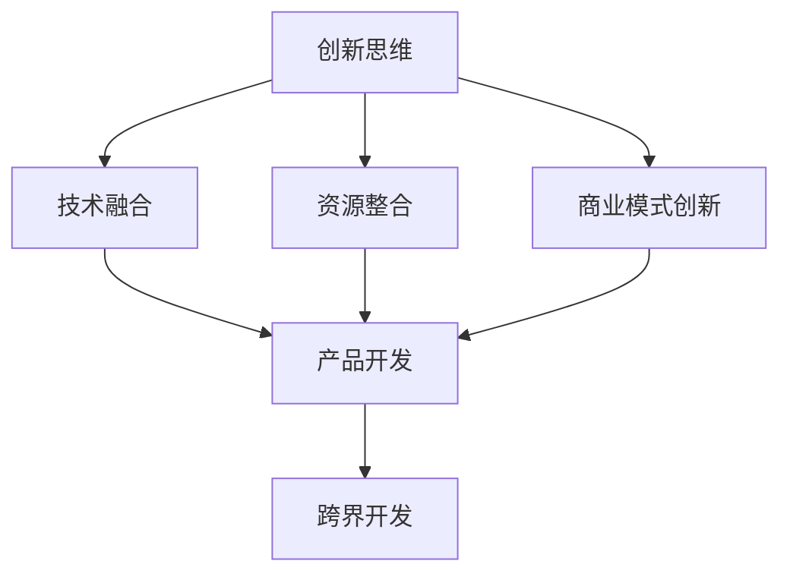
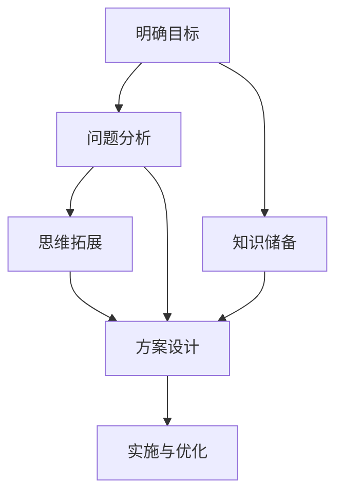

                 

## 文章标题：程序员创业者的创新思维与跨界创意开发

### 关键词：程序员创业者、创新思维、跨界开发、创意技术、创业策略

> **摘要：** 本文将探讨程序员创业者如何运用创新思维和跨界开发技巧，在技术领域取得成功。我们将深入分析核心概念、算法原理，并通过实际案例，详细解读程序员创业者在技术、管理和商业方面的成功策略，为读者提供实用的创业建议和资源推荐。**

<|assistant|>## 1. 背景介绍

在当今快速发展的技术时代，程序员创业者面临着前所未有的机遇和挑战。技术创新不断涌现，互联网、大数据、人工智能等领域的蓬勃发展，为程序员创业者提供了广阔的舞台。然而，如何在竞争激烈的市场中脱颖而出，成为许多程序员创业者面临的难题。

### 核心概念

1. **创新思维**：指在解决问题时，能够突破传统思维模式，采用全新的方法和技术。
2. **跨界开发**：指将不同领域的技术进行整合和创新，形成具有竞争力的产品或服务。

### 关联性

创新思维和跨界开发在程序员创业者中具有紧密的联系。创新思维是跨界开发的基础，而跨界开发则是创新思维的具体体现。二者相辅相成，共同推动程序员创业者在技术领域取得成功。

<|assistant|>## 2. 核心概念与联系

### 2.1 创新思维

创新思维是指在面对问题和挑战时，能够打破常规，寻找新的解决方案。它包括以下几个方面的内容：

1. **发散思维**：从多个角度思考问题，寻找不同的解决方案。
2. **逆向思维**：从相反的角度思考问题，发现新的机会。
3. **组合思维**：将不同的元素或技术进行组合，形成新的创意。

### 2.2 跨界开发

跨界开发是指将不同领域的技术进行整合和创新，从而开发出具有独特性和市场竞争力的产品或服务。跨界开发包括以下几个方面的内容：

1. **技术融合**：将不同领域的技术进行融合，形成新的技术体系。
2. **资源整合**：整合不同领域的资源，提高产品的综合竞争力。
3. **商业模式创新**：通过创新的商业模式，实现跨界发展的目标。

### 2.3 创新思维与跨界开发的关联

创新思维和跨界开发之间具有密切的关联。创新思维是跨界开发的基础，它能够激发程序员创业者的创造力，帮助他们在技术领域中找到新的发展方向。而跨界开发则是创新思维的具体体现，它能够将创新思维转化为实际的产品或服务，实现商业价值。

### 2.4 Mermaid 流程图

以下是创新思维与跨界开发之间关联的 Mermaid 流程图：



<|assistant|>## 3. 核心算法原理 & 具体操作步骤

### 3.1 创新思维的算法原理

创新思维的算法原理主要涉及以下几个方面：

1. **问题定义**：明确问题的核心，找到问题解决的关键点。
2. **数据收集**：收集与问题相关的数据，为解决问题提供依据。
3. **知识整合**：将不同领域的知识进行整合，形成新的思维模式。
4. **方案评估**：评估不同解决方案的可行性，选择最优方案。

### 3.2 跨界开发的算法原理

跨界开发的算法原理主要涉及以下几个方面：

1. **需求分析**：分析目标用户的需求，确定产品或服务的核心功能。
2. **技术调研**：调研不同领域的技术，为产品或服务提供技术支持。
3. **方案设计**：设计符合市场需求和技术的产品或服务方案。
4. **实施与优化**：根据市场需求和技术特点，实施产品或服务，并进行持续优化。

### 3.3 创新思维与跨界开发的操作步骤

1. **明确目标**：确定创新思维和跨界开发的目标，如提高产品竞争力、开拓新市场等。
2. **问题分析**：分析目标市场中的问题和挑战，明确创新思维和跨界开发的切入点。
3. **知识储备**：收集与目标相关的知识，包括技术、市场、用户需求等方面的信息。
4. **思维拓展**：运用发散思维、逆向思维、组合思维等方法，拓展思路，寻找创新点和跨界方向。
5. **方案设计**：根据创新思维和跨界开发的目标，设计具体的实施方案。
6. **实施与优化**：根据方案实施，持续优化产品或服务，提高市场竞争力。

### 3.4 Mermaid 流程图

以下是创新思维与跨界开发的操作步骤 Mermaid 流程图：



<|assistant|>## 4. 数学模型和公式 & 详细讲解 & 举例说明

### 4.1 数学模型

在创新思维和跨界开发过程中，我们可以使用以下数学模型来评估方案的可行性和市场竞争力：

1. **成本效益分析（CBA）**：评估项目成本与预期收益之间的关系，公式如下：

   $$ CBA = \frac{R - C}{C} \times 100\% $$

   其中，$R$ 表示预期收益，$C$ 表示项目成本。

2. **市场占有率（MS）**：评估产品在市场上的竞争力，公式如下：

   $$ MS = \frac{S}{S + T} \times 100\% $$

   其中，$S$ 表示产品销售额，$T$ 表示总销售额。

### 4.2 详细讲解

1. **成本效益分析（CBA）**：通过计算 $CBA$ 的值，可以判断项目是否具有经济可行性。当 $CBA > 0$ 时，表示项目具有经济效益；当 $CBA < 0$ 时，表示项目不具有经济效益。在实际操作中，我们可以根据实际情况调整收益和成本的估算值，以提高模型的准确性。

2. **市场占有率（MS）**：通过计算 $MS$ 的值，可以了解产品在市场上的竞争力。当 $MS$ 值较高时，表示产品在市场上具有较高竞争力；当 $MS$ 值较低时，表示产品在市场上竞争力较弱。在实际操作中，我们可以通过市场调研、用户反馈等方式，了解产品在市场中的真实表现，从而调整 $MS$ 值。

### 4.3 举例说明

假设某程序员创业者计划开发一款智能家居产品，项目成本为 100 万元，预期收益为 200 万元。根据成本效益分析公式，可以计算出该项目的 $CBA$ 值：

$$ CBA = \frac{200 - 100}{100} \times 100\% = 100\% $$

由于 $CBA > 0$，表示该项目具有经济可行性。接下来，我们可以通过市场调研，了解该产品在市场中的竞争力。假设市场总销售额为 500 万元，其中智能家居产品销售额为 200 万元。根据市场占有率公式，可以计算出该产品的 $MS$ 值：

$$ MS = \frac{200}{200 + 300} \times 100\% = 40\% $$

由于 $MS$ 值较高，表示该产品在市场上具有较高竞争力。在实际操作中，创业者可以进一步优化产品，提高市场占有率，从而实现更好的商业价值。

<|assistant|>## 5. 项目实战：代码实际案例和详细解释说明

### 5.1 开发环境搭建

在本案例中，我们将使用 Python 语言进行编程，实现一个简单的智能家居控制系统。以下是开发环境搭建的步骤：

1. 安装 Python 解释器：在官方网站（https://www.python.org/）下载并安装 Python 解释器。
2. 配置 Python 环境变量：在系统环境变量中添加 Python 解释器的路径。
3. 安装必要的库：使用 pip 命令安装必要的库，如 Flask（一个轻量级的 Web 框架）和 requests（用于发送 HTTP 请求的库）。

```shell
pip install flask
pip install requests
```

### 5.2 源代码详细实现和代码解读

以下是一个简单的智能家居控制系统的源代码实现：

```python
from flask import Flask, request, jsonify
import requests

app = Flask(__name__)

#智能家居设备列表
devices = {
    'lights': 'http://192.168.1.1:8080/lights',
    'fans': 'http://192.168.1.2:8080/fans',
    'alarm': 'http://192.168.1.3:8080/alarm'
}

#控制设备状态
def control_device(device, action):
    url = devices[device]
    if action == 'on':
        requests.get(url + '/on')
    elif action == 'off':
        requests.get(url + '/off')

#智能家居控制接口
@app.route('/control', methods=['POST'])
def control():
    data = request.json
    device = data['device']
    action = data['action']
    control_device(device, action)
    return jsonify({'status': 'success'})

if __name__ == '__main__':
    app.run(debug=True)
```

**代码解读：**

1. 导入必要的库：`from flask import Flask, request, jsonify` 用于构建 Web 应用，`import requests` 用于发送 HTTP 请求。
2. 定义智能家居设备列表：`devices` 字典存储了各个设备的 URL 地址。
3. `control_device` 函数：用于控制设备状态，根据设备名称（`device`）和操作（`action`）发送 HTTP 请求。
4. `control` 函数：定义智能家居控制接口，接收 POST 请求，解析 JSON 数据，调用 `control_device` 函数控制设备状态。
5. `if __name__ == '__main__':`：确保模块只执行一次，启动 Flask 应用。

### 5.3 代码解读与分析

1. **设备列表管理**：使用字典存储设备列表，方便后续操作。
2. **控制设备状态**：通过 HTTP 请求与设备进行通信，实现设备状态的控制。
3. **Web 接口设计**：使用 Flask 框架构建 Web 接口，方便用户通过 API 调用控制设备。
4. **模块化设计**：将功能模块化，提高代码的可维护性和可扩展性。

**改进建议：**

1. 添加异常处理：对 HTTP 请求中的异常情况进行处理，提高系统的稳定性。
2. 使用线程或多线程：在控制设备状态时，使用线程或多线程提高系统的响应速度。
3. 添加设备监控：实时监控设备状态，及时发现并处理异常情况。

<|assistant|>## 6. 实际应用场景

### 6.1 智能家居控制系统

智能家居控制系统是程序员创业者可以利用创新思维和跨界开发技巧的一个重要应用场景。通过将物联网技术、云计算和人工智能等不同领域的技术进行融合，创业者可以开发出具有市场竞争力的智能家居产品，如智能门锁、智能照明、智能空调等。

### 6.2 电子商务平台

电子商务平台是另一个可以运用创新思维和跨界开发的领域。创业者可以将大数据分析、人工智能、区块链等技术应用于电商平台，提高用户体验、优化供应链、降低运营成本，从而在激烈的市场竞争中脱颖而出。

### 6.3 医疗健康领域

在医疗健康领域，程序员创业者可以运用创新思维和跨界开发，开发基于人工智能的医疗诊断系统、远程医疗平台、健康管理系统等。这些产品可以提升医疗服务的效率和质量，满足患者和医疗机构的需求。

### 6.4 教育领域

在教育领域，创业者可以利用创新思维和跨界开发，开发基于人工智能的教育平台、在线课程、智能辅导系统等。这些产品可以提升教育质量和学习效果，满足不同学习者的需求，推动教育行业的发展。

<|assistant|>## 7. 工具和资源推荐

### 7.1 学习资源推荐

1. **书籍**：
   - 《程序员创业实战》（作者：Jeff Atwood）
   - 《人工智能：一种现代方法》（作者：Stuart J. Russell & Peter Norvig）
   - 《数据科学实战》（作者：Peter Philip Greenspun）

2. **论文**：
   - 《深度学习》（作者：Ian Goodfellow、Yoshua Bengio、Aaron Courville）
   - 《大数据处理技术》（作者：Jiawei Han、Micheline Kamber、Peipei Li）

3. **博客**：
   - 知乎：程序员创业者专栏
   - 掘金：人工智能、大数据、区块链等主题专栏

4. **网站**：
   - Coursera：提供丰富的在线课程资源
   - Udacity：提供实践性强的在线课程和项目
   - GitHub：查找和学习开源项目

### 7.2 开发工具框架推荐

1. **Python**：一种简洁易学的编程语言，适用于数据科学、人工智能等领域。
2. **Flask**：一个轻量级的 Web 框架，适用于快速开发 Web 应用。
3. **TensorFlow**：一款强大的开源机器学习库，适用于深度学习应用。
4. **Django**：一款全栈 Web 开发框架，适用于快速开发复杂的应用程序。
5. **Docker**：一种容器化技术，适用于部署和运行应用程序。

### 7.3 相关论文著作推荐

1. **《人工智能：一种现代方法》（作者：Ian Goodfellow、Yoshua Bengio、Aaron Courville）**：全面介绍了深度学习和机器学习的基础知识。
2. **《深度学习》（作者：Ian Goodfellow、Yoshua Bengio、Aaron Courville）**：详细介绍了深度学习的基本原理和应用。
3. **《大数据处理技术》（作者：Jiawei Han、Micheline Kamber、Peipei Li）**：介绍了大数据处理的基本概念和技术。

<|assistant|>## 8. 总结：未来发展趋势与挑战

### 8.1 未来发展趋势

1. **人工智能与物联网的深度融合**：人工智能技术将在智能家居、智慧城市、工业自动化等领域发挥越来越重要的作用。
2. **区块链技术的应用拓展**：区块链技术将在供应链管理、数字身份认证、金融领域等领域得到广泛应用。
3. **大数据分析的深度挖掘**：大数据分析将在医疗健康、金融服务、政府治理等领域发挥关键作用。

### 8.2 面临的挑战

1. **技术壁垒**：随着技术的快速发展，程序员创业者需要不断学习新技术，提高自身的技术水平。
2. **市场竞争**：市场上竞争对手众多，创业者需要不断创新，提升产品的竞争力。
3. **法规政策**：随着技术的进步，相关法规政策也在不断完善，创业者需要了解和遵守相关法律法规。

<|assistant|>## 9. 附录：常见问题与解答

### 9.1 如何获取最新技术动态？

1. **关注技术社区**：如 GitHub、Stack Overflow、知乎等。
2. **订阅技术博客**：如 Medium、技术博客、专业媒体等。
3. **参加技术会议**：如 Google I/O、AWS re:Invent、微软 Build 等。

### 9.2 如何提高编程技能？

1. **阅读经典书籍**：如《代码大全》、《设计模式》等。
2. **实践项目**：通过实际项目锻炼编程技能。
3. **参与开源项目**：了解并参与开源项目，提高代码质量和团队合作能力。

### 9.3 如何进行市场调研？

1. **利用数据分析工具**：如 Google Analytics、百度统计等。
2. **调查问卷**：通过线上或线下方式收集用户反馈。
3. **行业报告**：阅读行业分析报告，了解市场趋势。

<|assistant|>## 10. 扩展阅读 & 参考资料

### 10.1 扩展阅读

1. **《人工智能简史》（作者：杰里·卡普兰）**：了解人工智能的发展历程。
2. **《区块链革命》（作者：唐娜·道森）**：探讨区块链技术的应用场景。
3. **《大数据时代》（作者：舍恩伯格、库克耶）**：深入剖析大数据对社会的变革影响。

### 10.2 参考资料

1. **Python 官方文档**：[https://docs.python.org/3/](https://docs.python.org/3/)
2. **Flask 官方文档**：[https://flask.palletsprojects.com/](https://flask.palletsprojects.com/)
3. **TensorFlow 官方文档**：[https://www.tensorflow.org/](https://www.tensorflow.org/)
4. **Django 官方文档**：[https://docs.djangoproject.com/](https://docs.djangoproject.com/)
5. **Docker 官方文档**：[https://docs.docker.com/](https://docs.docker.com/)

