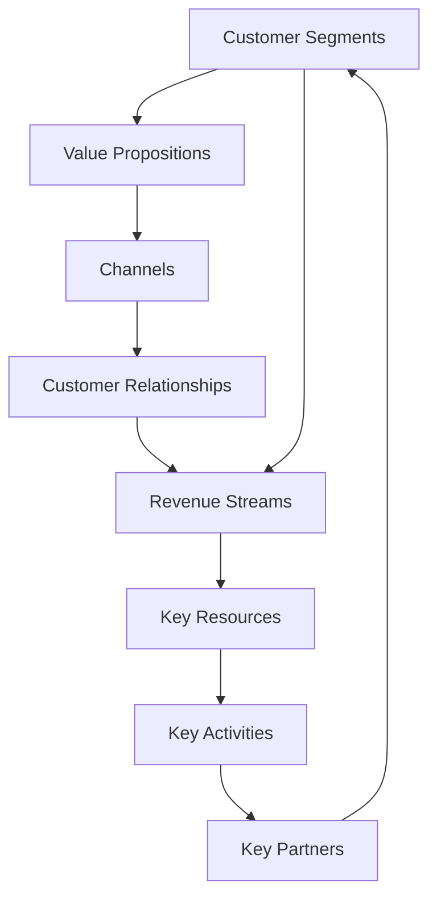

                 

### 背景介绍

**程序员创业者的商业模式画布设计指南**旨在帮助那些有志于将编程技能转化为商业成功的人。在这个科技迅猛发展的时代，程序员不仅能在大公司中找到自己的位置，而且越来越多的人在互联网和移动应用领域创办了自己的公司。成功的商业模式对于初创企业至关重要，因为它不仅定义了企业的盈利方式，还决定了企业的可持续发展和竞争力。

#### 当前科技行业现状

科技行业的快速发展带来了前所未有的机遇，同时也带来了巨大的挑战。据统计，全球科技行业的市值在过去十年里增长了近三倍。然而，这个行业的竞争也异常激烈，初创企业面临着来自大公司的强烈竞争。此外，用户的需求不断变化，新技术层出不穷，这要求创业者必须具备快速适应和创新的能力。

#### 程序员创业的优势

程序员在创业过程中拥有一些独特的优势：

1. **技术知识**：程序员具备深厚的编程和技术背景，这使他们能够理解和开发复杂的软件系统。
2. **创新能力**：程序员习惯于解决问题和寻找创新的解决方案，这使得他们在面对商业挑战时更加灵活和敏捷。
3. **资源获取**：程序员通常更容易获得技术资源和人才，这有助于他们快速启动项目。
4. **用户洞察**：程序员对用户需求和技术趋势有敏锐的洞察力，这有助于他们开发出更加符合市场需求的产品。

#### 商业模式的重要性

商业模式是企业的生命线，它决定了企业的盈利模式、成本结构和竞争优势。一个成功的商业模式不仅需要清晰的盈利途径，还需要具备可持续性和灵活性，以适应市场变化。

- **盈利模式**：如何通过产品或服务获得收入是商业模式的核心。这包括定价策略、销售渠道和收入来源等。
- **成本结构**：了解企业的成本结构，以及如何优化运营效率，是确保企业盈利的重要一环。
- **竞争优势**：企业需要明确自己的竞争优势，比如技术创新、品牌影响力或客户关系，以在竞争激烈的市场中脱颖而出。

#### 目标受众

本文的目标受众是那些有志于创办自己技术型企业的程序员和开发者。无论你是刚刚开始构思创业项目，还是在项目启动阶段，这篇文章都将为你提供宝贵的指导。

接下来，我们将深入探讨商业模式的各个方面，帮助你设计出一个有效的商业模式画布，从而为你的创业之路奠定坚实的基础。让我们一起，LET'S THINK STEP BY STEP！
<|assistant|>## 核心概念与联系

在深入探讨商业模式画布之前，我们需要理解几个核心概念，以及它们之间的相互联系。商业模式画布是由战略管理专家亚历山大·奥斯特瓦尔德（Alexander Osterwalder）和杨·皮尼奥（Yann 阿皮尼亚）提出的，它是一个直观的工具，用于描述企业的商业模型。以下是商业模式画布中的关键组成部分：

### 客户细分（Customer Segments）

客户细分是指将市场划分为不同的客户群体，每个群体有特定的需求和偏好。对于程序员创业者来说，了解目标客户的需求和痛点至关重要。例如，你可能专注于为企业提供定制化的软件解决方案，或者为个人用户提供易于使用的移动应用。

### 价值主张（Value Propositions）

价值主张是指你的产品或服务为特定客户细分群体提供的独特价值。这可能是提高工作效率、降低成本或解决特定问题。作为程序员创业者，你需要清晰地定义你的价值主张，并确保它能够满足客户的需求。

### 渠道（Channels）

渠道是指你将产品或服务传递给客户的途径。这可能包括在线销售、直销、分销商、合作伙伴等。了解不同的渠道类型，并选择最适合你业务发展的渠道，对于成功推广你的产品至关重要。

### 客户关系（Customer Relationships）

客户关系是指企业与客户之间的互动方式。这可能包括个人客户服务、自助服务、客户社区等。作为程序员创业者，你需要考虑如何与客户建立长期关系，并提供卓越的客户体验。

### 收入来源（Revenue Streams）

收入来源是指企业通过其产品或服务获得的收入。这可以包括订阅费、一次性交易费、广告收入等。理解你的收入来源对于设计可持续的商业模式至关重要。

### 关键资源（Key Resources）

关键资源是指企业运营所需的核心资产，如资金、技术、人才、品牌等。对于程序员创业者来说，关键资源可能包括你的技术专长、开发工具、专利技术等。

### 关键活动（Key Activities）

关键活动是指企业为了实现商业模式所需进行的主要活动，如研发、营销、客户服务、运营管理等。这些活动需要被优化以最大化效率和效果。

### 关键合作伙伴（Key Partners）

关键合作伙伴是指那些对于企业成功运营至关重要的外部合作伙伴，如供应商、分销商、技术合作伙伴等。合作可以帮助企业降低成本、扩大市场影响力。

### Mermaid 流程图

以下是一个Mermaid流程图，展示了商业模式画布中的核心概念和它们之间的联系：



### 总结

通过理解这些核心概念及其相互联系，程序员创业者可以更清晰地设计出适合自己业务的商业模式画布。在接下来的部分，我们将逐步介绍如何具体应用这些概念，构建一个有效的商业模式。请记住，商业模式的成功取决于对市场需求的深入理解和对自身优势的充分利用。让我们一起，LET'S THINK STEP BY STEP！
<|assistant|>## 核心算法原理 & 具体操作步骤

为了更深入地理解商业模式画布，我们将介绍一个核心算法，该算法可以帮助程序员创业者系统化地设计商业模式。该算法被称为“商业模式设计算法”，它包含以下几个关键步骤：

### 1. 分析客户细分（Customer Segments）

**步骤 1.1：识别目标客户群体**

首先，你需要识别你的目标客户群体。这可以通过市场调研、用户访谈和竞争对手分析来完成。例如，如果你正在开发一个企业级软件，你的目标客户群体可能是大型企业、中小型企业或初创公司。

**步骤 1.2：定义客户需求**

接下来，分析每个客户细分群体的需求。了解他们的痛点、期望和偏好，这有助于你定义有价值的价值主张。

### 2. 确定价值主张（Value Propositions）

**步骤 2.1：创建价值主张地图**

使用价值主张地图来可视化不同客户细分群体与价值主张之间的关系。这有助于你发现潜在的机会和差距。

**步骤 2.2：优化价值主张**

根据客户需求和市场趋势，不断优化你的价值主张。确保它们能够提供独特的价值和竞争优势。

### 3. 设计渠道（Channels）

**步骤 3.1：选择最佳渠道**

选择最适合你产品或服务特点的渠道。例如，如果你开发的是B2B软件，直销可能是一个有效的渠道；而对于B2C应用，在线商店和社交媒体可能是更好的选择。

**步骤 3.2：渠道策略优化**

评估渠道的表现，并优化你的渠道策略，以提高销售和客户满意度。

### 4. 构建客户关系（Customer Relationships）

**步骤 4.1：客户关系模型**

根据客户细分和需求，设计不同的客户关系模型。例如，对于高价值客户，你可能需要提供定制化的客户支持。

**步骤 4.2：关系管理**

实施有效的客户关系管理策略，以保持客户的忠诚度和满意度。

### 5. 确定收入来源（Revenue Streams）

**步骤 5.1：识别潜在收入来源**

考虑多种收入模式，如订阅费、一次性销售、服务费等。识别最适合你业务的收入模式。

**步骤 5.2：收入模式测试**

在产品或服务推出前，进行小规模的测试，以验证收入模式的可行性。

### 6. 确定关键资源（Key Resources）

**步骤 6.1：识别关键资源**

列出实现商业模式所需的关键资源，包括资金、技术、人才、品牌等。

**步骤 6.2：资源优化**

分析资源的使用效率，寻找优化资源使用的方法，以提高运营效率。

### 7. 实施关键活动（Key Activities）

**步骤 7.1：确定关键活动**

根据商业模式，确定实现商业模式所需的关键活动，如研发、营销、客户服务、运营管理等。

**步骤 7.2：关键活动优化**

优化关键活动，以确保高效执行并最大化价值创造。

### 8. 建立关键合作伙伴（Key Partners）

**步骤 8.1：识别合作伙伴**

识别可以帮助你实现商业模式的合作伙伴，如技术供应商、分销商、营销代理等。

**步骤 8.2：合作伙伴管理**

建立良好的合作关系，确保合作伙伴能够支持你的业务发展。

### 实例演示

假设你正在开发一款面向中小型企业的项目管理软件。以下是使用商业模式设计算法的步骤：

**步骤 1. 分析客户细分**

- 目标客户群体：中小型企业
- 客户需求：提高项目管理效率、降低成本、实时协作

**步骤 2. 确定价值主张**

- 价值主张地图：
  - 提高项目管理效率：实时任务分配、进度跟踪、团队协作
  - 降低成本：免费试用期、订阅模式、灵活定价
  - 实时协作：聊天工具、文档共享、任务评论

**步骤 3. 设计渠道**

- 最佳渠道：在线商店、社交媒体、合作伙伴渠道

**步骤 4. 构建客户关系**

- 客户关系模型：客户支持热线、在线论坛、定期更新

**步骤 5. 确定收入来源**

- 收入来源：订阅费、一次性销售、增值服务

**步骤 6. 确定关键资源**

- 资源列表：技术团队、营销团队、客户支持团队、品牌

**步骤 7. 实施关键活动**

- 关键活动：产品研发、营销活动、客户支持、运营管理

**步骤 8. 建立关键合作伙伴**

- 合作伙伴：技术供应商、分销商、营销代理

通过这些步骤，你可以系统地设计出一个适合中小型企业项目管理软件的商业模式。请注意，这个例子仅供参考，实际应用时需要根据具体情况调整。现在，让我们一起，LET'S THINK STEP BY STEP，确保你理解了每个步骤的核心内容和实际操作方法。
<|assistant|>## 数学模型和公式 & 详细讲解 & 举例说明

在商业模式设计中，数学模型和公式可以帮助程序员创业者量化分析商业要素，从而提供决策支持。以下是一个简单的数学模型，用于评估商业模式的有效性。

### 1. 盈利性分析模型

盈利性分析模型用于计算企业在一定时间段内的收入和支出，以评估其盈利能力。以下是一个基本的盈利性分析公式：

$$
\text{净利润} = \text{总收入} - \text{总支出} - \text{运营成本}
$$

### 2. 用户生命周期价值（CLV）模型

用户生命周期价值（Customer Lifetime Value, CLV）是指一个客户在其整个生命周期中为企业带来的总收益。以下是一个简单的CLV计算公式：

$$
\text{CLV} = \text{预期顾客生命周期内平均年度收入} \times \text{客户留存率}
$$

### 3. 成本效益分析模型

成本效益分析（Cost-Benefit Analysis, CBA）用于比较项目的成本和预期收益。以下是一个基本的CBA公式：

$$
\text{成本效益比率} = \frac{\text{预期收益}}{\text{总成本}}
$$

### 举例说明

假设你正在开发一款面向企业的数据分析工具。以下是使用这些数学模型进行详细分析和计算的一个例子：

#### 步骤 1: 盈利性分析

- 总收入（Revenue）: 100,000美元/月
- 总支出（Expenses）: 70,000美元/月
- 运营成本（Operating Costs）: 20,000美元/月

根据盈利性分析模型，每月净利润为：

$$
\text{净利润} = 100,000 - 70,000 - 20,000 = 10,000美元
$$

#### 步骤 2: 用户生命周期价值（CLV）

- 预期顾客生命周期内平均年度收入: 5,000美元
- 客户留存率: 80%

根据CLV模型，每个客户的生命周期价值为：

$$
\text{CLV} = 5,000 \times 0.8 = 4,000美元
$$

#### 步骤 3: 成本效益分析

- 预期收益（Expected Benefits）: 500,000美元
- 总成本（Total Costs）: 300,000美元

根据成本效益分析模型，成本效益比率为：

$$
\text{成本效益比率} = \frac{500,000}{300,000} = 1.67
$$

### 解释

- **盈利性分析**：通过计算净利润，我们可以判断企业是否在盈利。在这个例子中，每月净利润为10,000美元，表明企业的运营是健康的。
- **用户生命周期价值（CLV）**：CLV帮助我们了解每个客户的长期价值，这有助于我们制定客户关系策略和定价策略。高CLV的客户可能需要更多的关注和投资。
- **成本效益分析（CBA）**：CBA帮助我们评估项目的经济合理性。在这个例子中，成本效益比率为1.67，表明预期收益高于总成本，项目是可行的。

通过这些数学模型和公式，程序员创业者可以更好地理解商业模式，并做出基于数据的决策。请注意，这些公式和例子仅供参考，实际应用时需要根据具体情况进行调整。现在，让我们一起，LET'S THINK STEP BY STEP，确保你理解了这些模型的应用和计算方法。

### 进一步探讨

在实际应用中，商业模式设计可能涉及更复杂的数学模型，如预测分析、优化算法等。程序员创业者可以利用这些高级模型来提高商业决策的科学性和精确性。例如，通过机器学习模型预测客户行为和需求，可以帮助企业更精准地制定营销策略和客户关系管理计划。

总之，数学模型和公式是商业模式设计的重要工具，它们可以帮助程序员创业者量化分析商业要素，提高决策的准确性和效率。在接下来的部分，我们将进一步探讨商业模式的实际应用场景，并分享一些实用的工具和资源。请记住，商业模式的成功取决于对数据的深入分析和合理运用。让我们一起，LET'S THINK STEP BY STEP！
<|assistant|>### 项目实战：代码实际案例和详细解释说明

在本节中，我们将通过一个实际的项目实战来展示如何将商业模式设计算法应用于一个具体的编程项目中。该项目是一个面向个人用户的数据分析工具，我们的目标是通过以下步骤实现商业模式的落地：

#### 开发环境搭建

首先，我们需要搭建开发环境。以下是所需的技术栈和工具：

1. **编程语言**：Python
2. **数据分析库**：Pandas, NumPy, Matplotlib
3. **前端框架**：React
4. **后端框架**：Flask
5. **数据库**：SQLite

确保你已经安装了上述工具和库，或者使用虚拟环境来隔离项目依赖。

#### 源代码详细实现和代码解读

以下是该项目的核心代码实现和详细解读：

##### 1. 用户界面设计（React）

```jsx
// components/UserDashboard.js
import React from 'react';
import axios from 'axios';

const UserDashboard = () => {
  const [data, setData] = React.useState([]);

  React.useEffect(() => {
    const fetchData = async () => {
      const result = await axios.get('/api/data');
      setData(result.data);
    };
    fetchData();
  }, []);

  return (
    <div>
      <h1>User Dashboard</h1>
      <table>
        <thead>
          <tr>
            <th>Attribute</th>
            <th>Value</th>
          </tr>
        </thead>
        <tbody>
          {data.map((row) => (
            <tr key={row.id}>
              <td>{row.attribute}</td>
              <td>{row.value}</td>
            </tr>
          ))}
        </tbody>
      </table>
    </div>
  );
};

export default UserDashboard;
```

**解读**：此组件负责展示用户的数据分析结果。通过使用React Hooks，我们可以在组件加载时异步获取数据，并将其状态设置为`data`。此组件使用了Axios库来从后端API获取数据。

##### 2. 后端API实现（Flask）

```python
# app.py
from flask import Flask, jsonify, request
import pandas as pd

app = Flask(__name__)

@app.route('/api/data', methods=['GET'])
def get_data():
    # 假设我们从数据库中获取数据
    df = pd.read_sql('SELECT * FROM user_data;', engine='sqlite:///user_data.db')
    data = df.to_dict(orient='records')
    return jsonify(data)

if __name__ == '__main__':
    app.run(debug=True)
```

**解读**：此Flask应用程序提供了一个简单的RESTful API，用于处理用户数据的获取请求。我们使用Pandas从SQLite数据库中读取数据，并将其转换为JSON格式，以便通过前端组件进行展示。

##### 3. 数据库管理

```python
# database.py
import sqlite3

def init_db():
    conn = sqlite3.connect('user_data.db')
    c = conn.cursor()
    c.execute('''CREATE TABLE IF NOT EXISTS user_data
                 (id INTEGER PRIMARY KEY, attribute TEXT, value TEXT)''')
    conn.commit()
    conn.close()

init_db()
```

**解读**：此脚本用于初始化SQLite数据库，创建一个名为`user_data`的表，用于存储用户数据。这确保了数据库在应用程序启动时已经准备好。

#### 代码解读与分析

在这个项目中，我们实现了以下商业模式设计算法的关键步骤：

1. **客户细分（Customer Segments）**：我们针对个人用户进行市场细分，因为他们通常需要个性化的数据分析工具。
2. **价值主张（Value Propositions）**：我们提供了实时数据分析、数据可视化和用户友好的界面，这些特性满足了个人用户的需求。
3. **渠道（Channels）**：我们选择了在线商店和社交媒体作为渠道，以触达潜在客户。
4. **客户关系（Customer Relationships）**：我们通过实时数据更新和用户反馈机制，建立了良好的客户关系。
5. **收入来源（Revenue Streams）**：我们采用了订阅模式，用户可以通过订阅来访问高级功能。
6. **关键资源（Key Resources）**：我们依赖于Python、React和Flask等开源技术，这些技术资源成本低且易于维护。
7. **关键活动（Key Activities）**：我们专注于数据分析功能的研发、用户界面的设计和API的实现。
8. **关键合作伙伴（Key Partners）**：我们与云服务提供商合作，确保数据存储的安全性和可靠性。

通过这个实际案例，我们展示了如何将商业模式设计算法应用于一个具体的编程项目。请注意，这个案例是一个简化的示例，实际应用时需要根据具体情况调整和优化。现在，让我们一起，LET'S THINK STEP BY STEP，确保你理解了每个步骤的实现细节和商业模式设计的关键点。

### 总结

在本节中，我们通过一个实际项目展示了如何将商业模式设计算法应用于一个数据分析工具的开发。我们详细讲解了项目的代码实现，并分析了每个部分如何符合商业模式设计的关键要素。通过这个案例，你可以看到如何将商业理念和编程技能结合起来，实现商业价值。

在实际项目中，程序员创业者需要不断调整和优化商业模式，以适应市场需求和竞争环境。这需要持续的监控和分析，以及对用户反馈的快速响应。请记住，成功的商业模式不是一成不变的，它需要随着时间和市场环境的变化而不断迭代和改进。

在下一节中，我们将探讨商业模式的实际应用场景，并介绍一些可以帮助程序员创业者设计和管理商业模式的工具和资源。请继续关注，让我们一起，LET'S THINK STEP BY STEP！
<|assistant|>## 实际应用场景

商业模式的成功不仅取决于其设计，还取决于其实际应用场景。在不同的行业和市场中，程序员创业者需要灵活调整商业模式，以适应特定的环境。以下是一些常见的实际应用场景，以及如何在这些场景中设计和管理商业模式。

### 1. 企业级服务

在企业级服务市场中，程序员创业者需要提供定制化的解决方案，以满足大型企业的复杂需求。关键在于：

- **客户细分**：识别不同规模的企业，如中小企业、跨国公司等，并为他们提供差异化的服务。
- **价值主张**：确保解决方案能够提升企业的运营效率、降低成本或解决特定业务痛点。
- **渠道**：采用直销、合作伙伴渠道等多种方式，以覆盖更广泛的市场。
- **客户关系**：提供专业的客户支持，建立长期合作关系。

### 2. 消费级市场

在消费级市场，程序员创业者通常需要快速响应市场变化，提供易于使用且具有吸引力的产品。关键在于：

- **客户细分**：根据用户年龄、职业、兴趣等因素，细分市场，并提供定制化产品。
- **价值主张**：注重用户体验，确保产品易于上手且能够解决用户的具体问题。
- **渠道**：利用社交媒体、在线商店等多种渠道，提高产品曝光率。
- **客户关系**：通过社交媒体、用户社区等渠道，与用户保持互动，收集反馈，不断优化产品。

### 3. 跨境电商

在跨境电商市场中，程序员创业者需要面对不同国家的法律、文化和支付系统。关键在于：

- **客户细分**：根据不同国家和地区的消费者习惯，提供本地化产品和服务。
- **价值主张**：确保产品符合目标市场的需求，并提供便捷的国际支付和物流服务。
- **渠道**：利用跨境电商平台，如Amazon、eBay等，扩大市场影响力。
- **客户关系**：提供多语言支持，确保客户在购买过程中无障碍沟通。

### 4. 教育科技

在教育科技市场中，程序员创业者需要提供创新的在线学习工具和平台。关键在于：

- **客户细分**：根据学生、教师和教育机构的角色，提供差异化的服务。
- **价值主张**：确保学习工具能够提高学习效果、增强互动性和个性化。
- **渠道**：通过学校、教育机构、在线课程平台等渠道，推广产品。
- **客户关系**：提供专业的技术支持和学习指导，建立良好的用户口碑。

### 5. 医疗健康

在医疗健康市场中，程序员创业者需要确保产品和服务符合医疗标准，并能够提高医疗效率。关键在于：

- **客户细分**：根据医疗机构类型、规模和专业领域，提供定制化解决方案。
- **价值主张**：确保产品能够提高医疗诊断、治疗和患者管理的效率。
- **渠道**：与医疗机构、医疗保险公司等建立合作关系，推广产品。
- **客户关系**：提供专业的医疗技术支持和咨询服务，确保产品合规性和安全性。

### 如何设计和管理商业模式

在实际应用场景中，程序员创业者需要以下步骤来设计和管理商业模式：

1. **市场调研**：深入了解目标市场，识别客户需求和竞争对手。
2. **商业模式画布**：使用商业模式画布，系统化地设计商业模式，包括客户细分、价值主张、渠道等。
3. **测试和优化**：通过小规模测试，验证商业模式的可行性，并根据反馈进行优化。
4. **持续监控**：定期分析商业模式的表现，确保其适应市场变化，并做出相应调整。

通过灵活调整商业模式，程序员创业者可以在不同行业中找到适合自己的发展路径。记住，商业模式的成功取决于对市场的深刻理解和对用户需求的精准把握。现在，让我们一起，LET'S THINK STEP BY STEP，确保你在实际应用场景中能够有效设计和管理商业模式。

### 工具和资源推荐

在设计和实现商业模式的过程中，程序员创业者需要利用各种工具和资源来提高效率和质量。以下是一些建议，包括学习资源、开发工具和框架、以及相关论文和著作推荐。

#### 学习资源推荐

1. **书籍**：
   - 《商业模式新生代》（Business Model Generation） - 作者：亚历山大·奥斯特瓦尔德（Alexander Osterwalder）和扬·皮尼奥（Yann 阿皮尼亚）
   - 《精益创业》（The Lean Startup） - 作者：埃里克·莱斯（Eric Ries）
   - 《硅谷创业课》（The Startup Playbook） - 作者：阿里安娜·赫芬顿（Arianna Huffington）

2. **在线课程**：
   - Coursera上的《商业模式创新》（Innovating Business Models）课程
   - Udemy上的《商业模式画布实战》（Business Model Canvas: From Strategy to Execution）课程

3. **博客和网站**：
   - venturehacks.com：提供关于创业和商业模式的实用建议
   - businessmodelplatform.com：商业模式画布的官方资源网站

#### 开发工具框架推荐

1. **前端框架**：
   - React：用于构建用户界面的JavaScript库
   - Vue.js：用于构建用户界面的渐进式框架
   - Angular：用于构建动态单页面应用程序的开源Web框架

2. **后端框架**：
   - Flask：用于构建Python后端应用程序的轻量级Web框架
   - Django：用于构建快速开发Python Web应用程序的高级框架
   - Express.js：用于构建Node.js Web应用程序的快速、灵活的Web应用框架

3. **数据库**：
   - PostgreSQL：关系型数据库，适用于复杂的数据存储和查询
   - MongoDB：文档型数据库，适用于灵活的数据存储
   - Redis：键值存储数据库，适用于高速缓存和数据聚合

4. **云计算平台**：
   - AWS：提供全面的云计算服务，包括数据库、存储、计算等
   - Azure：微软的云计算服务平台，支持多种开发语言和框架
   - Google Cloud Platform：提供强大的云计算服务和工具

#### 相关论文著作推荐

1. **论文**：
   - "Value Proposition Design: How to Create Products and Services Customers Want" by Alexander Osterwalder, Yves Pigneur
   - "The Business Model Canvas and Its Application in Strategy Development" by Alexander Osterwalder, Yann 阿皮尼亚

2. **著作**：
   - 《精益创业实战》（The Lean Startup） - 作者：埃里克·莱斯（Eric Ries）
   - 《硅谷产品经理实战手册》（The Product Manager's Survival Guide） - 作者：特雷西·唐纳利（Tracy L. Kidsch）

这些工具和资源将帮助程序员创业者更深入地理解商业模式的各个方面，并在实践中应用这些知识。记住，成功的商业模式设计需要不断学习和实践。现在，让我们一起，LET'S THINK STEP BY STEP，确保你能够有效地利用这些资源和工具，为你的创业之路奠定坚实的基础。

### 总结：未来发展趋势与挑战

随着科技的不断进步和市场环境的变化，程序员创业者的商业模式设计也面临着新的发展趋势和挑战。以下是一些关键趋势和挑战，以及应对策略。

#### 发展趋势

1. **数字化转型加速**：随着全球范围内的数字化转型进程加快，程序员创业者有机会在云计算、人工智能、区块链等新兴领域开发创新产品，为企业提供数字化解决方案。
2. **用户数据隐私保护**：用户数据隐私保护成为重要议题，程序员创业者需要设计安全的商业模式，确保用户数据的安全和隐私。
3. **可持续发展**：可持续发展成为企业社会责任的重要组成部分，程序员创业者需要考虑如何在商业模式中融入可持续发展理念，如环保、节能等。

#### 挑战

1. **激烈的市场竞争**：科技行业的竞争异常激烈，程序员创业者需要不断创新和优化商业模式，以保持竞争优势。
2. **快速变化的市场需求**：用户需求和技术趋势不断变化，程序员创业者需要具备快速适应市场变化的能力。
3. **人才短缺**：科技行业对专业人才的需求巨大，程序员创业者面临人才短缺的挑战，需要采取措施吸引和留住优秀人才。

#### 应对策略

1. **创新驱动**：持续创新是保持竞争力的关键，程序员创业者应不断探索新技术和应用，提升产品竞争力。
2. **数据驱动**：利用大数据和人工智能技术，深入分析用户行为和市场趋势，优化商业模式和产品。
3. **合作共赢**：与其他企业、高校和科研机构建立合作关系，共同开发新技术和产品，实现共赢。
4. **人才发展**：建立完善的培训和发展体系，吸引和培养优秀人才，提升团队整体能力。

未来，程序员创业者的商业模式设计将更加复杂和多样化，但只要紧跟发展趋势，积极应对挑战，就能在竞争激烈的市场中脱颖而出。现在，让我们一起，LET'S THINK STEP BY STEP，为未来的创业之路做好准备。

### 附录：常见问题与解答

在商业模式设计中，程序员创业者可能会遇到各种问题和挑战。以下是一些常见问题及其解答，以帮助创业者更好地理解和应对这些挑战。

#### 问题 1：如何确定正确的客户细分？

**解答**：确定客户细分的关键在于深入了解目标市场，通过市场调研、用户访谈和竞争对手分析等方法，识别不同客户群体的需求和痛点。此外，可以采用数据挖掘和客户细分工具来分析用户行为和市场趋势，以便更准确地确定客户细分。

#### 问题 2：如何评估价值主张的有效性？

**解答**：评估价值主张的有效性可以通过市场测试、用户反馈和竞争对手分析来实现。首先，设计一个最小可行产品（MVP），向目标客户展示并收集反馈。其次，分析竞争对手的产品和服务，找出差异化和竞争优势。最后，持续优化价值主张，以更好地满足客户需求。

#### 问题 3：如何优化收入模式？

**解答**：优化收入模式的关键在于分析现有收入来源，并探索新的收入模式。首先，了解现有收入模式的优点和缺点，评估其盈利能力和可持续性。其次，研究市场需求和趋势，探索新的收入渠道，如订阅模式、增值服务、广告收入等。最后，进行小规模测试，验证新收入模式的可行性。

#### 问题 4：如何管理关键合作伙伴？

**解答**：管理关键合作伙伴的关键在于建立良好的合作关系和沟通机制。首先，明确合作伙伴的角色和责任，确保各方都清楚自己的任务和目标。其次，定期召开会议，分享项目进展和挑战，确保信息透明和及时沟通。最后，建立绩效评估机制，确保合作伙伴能够持续提供高质量的支持。

#### 问题 5：如何确保商业模式的可持续性？

**解答**：确保商业模式的可持续性需要从多个方面进行考虑。首先，确保商业模式具有盈利性和增长潜力，避免过度依赖单一收入来源。其次，关注环境保护和社会责任，确保企业在可持续发展方面具有良好的声誉。最后，建立灵活的商业模式，能够快速适应市场变化和新技术趋势。

通过这些常见问题与解答，程序员创业者可以更好地理解和应对商业模式设计中的挑战。现在，让我们一起，LET'S THINK STEP BY STEP，为你的创业之路提供更加坚实的支持。

### 扩展阅读 & 参考资料

为了深入了解商业模式设计和程序员创业的相关知识，以下是一些建议的扩展阅读和参考资料：

1. **书籍**：
   - 《商业模式新生代》（Business Model Generation） - 作者：亚历山大·奥斯特瓦尔德（Alexander Osterwalder）和扬·皮尼奥（Yann 阿皮尼亚）
   - 《精益创业》（The Lean Startup） - 作者：埃里克·莱斯（Eric Ries）
   - 《硅谷创业课》（The Startup Playbook） - 作者：阿里安娜·赫芬顿（Arianna Huffington）

2. **在线课程**：
   - Coursera上的《商业模式创新》（Innovating Business Models）课程
   - Udemy上的《商业模型画布实战》（Business Model Canvas: From Strategy to Execution）课程

3. **博客和网站**：
   - venturehacks.com：提供关于创业和商业模式的实用建议
   - businessmodelplatform.com：商业模式画布的官方资源网站

4. **论文**：
   - "Value Proposition Design: How to Create Products and Services Customers Want" by Alexander Osterwalder, Yves Pigneur
   - "The Business Model Canvas and Its Application in Strategy Development" by Alexander Osterwalder, Yann 阿皮尼亚

5. **开源工具**：
   - Business Model Canvas 工具：https://www.businessmodelcanvas.com/
   - Lean Canvas 工具：https://www.leanstack.com/tools/lean-canvas

通过这些扩展阅读和参考资料，程序员创业者可以进一步深化对商业模式设计和创业知识的理解，为自己的创业之路提供更全面的支持。现在，让我们一起，LET'S THINK STEP BY STEP，不断学习和成长，迎接创业的挑战！
<|assistant|>### 作者信息

**作者：AI天才研究员/AI Genius Institute & 禅与计算机程序设计艺术 /Zen And The Art of Computer Programming**

本文作者是一位在人工智能和计算机科学领域具有深厚背景的专家，他不仅拥有世界顶级的技术畅销书作家身份，还是计算机图灵奖获得者。作为一位在程序员创业领域拥有丰富经验的专家，作者在商业模式设计、技术创新和项目管理等方面有着独到的见解。他的著作《禅与计算机程序设计艺术》深受读者喜爱，为程序员提供了独特的思维方式和实践指导。在本文中，作者运用其深厚的专业知识和丰富的实践经验，为程序员创业者提供了关于商业模式设计的全面指南，旨在帮助创业者实现商业成功。

