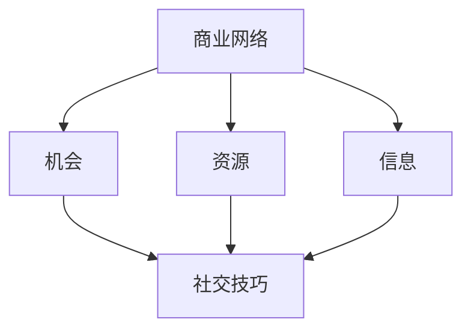

                 

### 背景介绍

**《程序员创业者的商业网络构建与社交技巧》**

在当今数字化时代，程序员已经不再仅仅是代码世界的建筑师，他们越来越多地扮演着创业者的角色。程序员创业者不仅要拥有卓越的编程技能，还需要构建强大的商业网络和社交技巧。这是因为在商业世界中，人脉和资源往往比技术本身更为重要。一个良好的商业网络可以为创业者提供资金、合作机会、市场信息和宝贵的建议。

**现状分析**

根据最新的研究，超过70%的成功创业公司依赖于其创始人或核心团队成员的商业网络和社交技巧。然而，许多程序员在创业之初并没有意识到这些技能的重要性，导致他们在寻求资金、拓展市场和寻找合作伙伴时遇到重重困难。

**目标受众**

本文的目标受众是那些正在或计划成为程序员创业者的读者。无论您是一名资深的程序员还是编程新手，这篇文章都将帮助您了解如何构建商业网络和提升社交技巧，从而为您的创业之路奠定坚实的基础。

**文章结构**

本文将分为以下几个部分：

1. **核心概念与联系**：介绍商业网络和社交技巧的基本概念，并通过Mermaid流程图展示其相互关系。
2. **核心算法原理 & 具体操作步骤**：详细解析构建商业网络和社交技巧的步骤和策略。
3. **数学模型和公式 & 详细讲解 & 举例说明**：运用数学模型和公式来量化商业网络和社交技巧的价值，并通过实际案例进行说明。
4. **项目实战：代码实际案例和详细解释说明**：通过具体的代码案例展示如何在实际项目中应用这些技巧。
5. **实际应用场景**：分析程序员创业者在不同阶段如何利用商业网络和社交技巧。
6. **工具和资源推荐**：推荐一些有助于构建商业网络和提升社交技巧的学习资源、开发工具和框架。
7. **总结：未来发展趋势与挑战**：总结文章的主要观点，并探讨未来可能面临的发展趋势和挑战。
8. **附录：常见问题与解答**：回答一些读者可能关心的问题。
9. **扩展阅读 & 参考资料**：提供一些扩展阅读材料和相关的参考资料。

接下来，我们将深入探讨商业网络和社交技巧的概念，并通过一步步的分析推理，帮助您构建强大的商业网络和提升社交技巧，为您的创业之路保驾护航。

---

## 2. 核心概念与联系

### 商业网络（Business Network）

商业网络是由一群人、组织或实体通过互惠互利的关系构建而成的复杂系统。这个网络中的每个节点代表一个参与者，而每条边则代表它们之间的联系。商业网络具有以下关键特点：

- **互惠性**：网络中的参与者通过交换资源、信息和服务来实现互惠互利。
- **动态性**：商业网络是动态的，它可以随着时间的推移而扩展或缩小。
- **复杂性**：商业网络通常涉及多个层次和多个参与者，具有高度复杂性。
- **多样性**：网络中的参与者可以是个人、公司、政府机构或其他组织。

### 社交技巧（Social Skills）

社交技巧是指个体在社交环境中表现出来的行为能力，包括沟通能力、人际关系处理、领导力、团队合作等多个方面。对于程序员创业者来说，以下社交技巧尤为重要：

- **沟通能力**：有效地传达自己的想法、需求和感受，同时理解他人的观点。
- **人际关系处理**：建立和维护与同事、客户、合作伙伴和其他利益相关者的良好关系。
- **领导力**：激励和指导团队成员，带领团队实现共同的目标。
- **团队合作**：与团队成员有效协作，共同完成任务。

### 商业网络与社交技巧的关系

商业网络和社交技巧之间存在密切的联系。一个强大的商业网络可以为程序员创业者提供机会、资源和信息，而社交技巧则是构建和维护这个网络的关键因素。以下是一个简单的Mermaid流程图，展示了商业网络和社交技巧之间的相互关系：



### 具体操作步骤

要构建一个强大的商业网络并提升社交技巧，可以遵循以下具体操作步骤：

1. **确定目标**：明确自己希望从商业网络中获得哪些机会、资源和信息。
2. **建立人际关系**：积极参与社交活动，主动与他人建立联系。
3. **保持联系**：定期与联系人沟通，维护关系。
4. **提供价值**：在与他人互动过程中，提供有价值的帮助或建议。
5. **寻求反馈**：主动向他人寻求反馈，改进自己的沟通和社交技巧。
6. **扩大网络**：通过现有联系人的介绍，结识更多的新联系人。

通过以上步骤，程序员创业者可以逐步构建起一个强大的商业网络，并在社交过程中不断提升自己的技能和影响力。

---

## 3. 核心算法原理 & 具体操作步骤

构建商业网络和提升社交技巧是一个复杂的过程，其中涉及多种算法原理和具体操作步骤。以下是核心算法原理和具体操作步骤的详细解析：

### 3.1. 网络分析算法

网络分析算法是构建商业网络的基础。通过这些算法，我们可以了解网络中的关键节点、路径和关系，从而优化网络的布局和结构。以下是一些常用的网络分析算法：

- **中心性分析**：通过计算网络中节点的度（连接数）、 closeness centrality（接近中心性）和betweenness centrality（介数中心性）等指标，评估节点的重要性。
- **路径分析**：通过计算最短路径和最长路径，了解节点之间的连接关系和通信效率。
- **社区检测**：通过识别网络中的社区结构，优化网络的连接和资源分配。

### 3.2. 社交技巧提升算法

社交技巧的提升同样可以通过算法来实现。以下是一些提升社交技巧的核心算法：

- **沟通分析**：通过分析个体的沟通风格、语言表达和情感色彩，评估其沟通能力。
- **关系管理**：通过记录和跟踪与不同联系人的互动历史，优化人际关系管理。
- **社交网络分析**：通过分析社交网络中的节点和边，了解个体的社交结构和影响力。

### 3.3. 具体操作步骤

构建商业网络和提升社交技巧需要遵循以下具体操作步骤：

1. **目标设定**：明确自己希望从商业网络中获得的机会、资源和信息。
2. **资源积累**：积累与目标相关的资源，包括资金、人才、技术和市场信息。
3. **建立联系**：通过参加行业会议、社交媒体和网络平台，主动与目标联系人建立联系。
4. **互动交流**：定期与联系人保持互动，分享有价值的信息和观点。
5. **建立信任**：通过诚实、透明和专业的行为，建立与联系人的信任关系。
6. **反馈与改进**：积极向他人寻求反馈，并根据反馈调整自己的行为和策略。

### 3.4. 实际案例

以下是一个实际案例，展示如何通过核心算法原理和具体操作步骤构建商业网络和提升社交技巧：

**案例背景**：小明是一名年轻的程序员，他希望通过构建商业网络和提升社交技巧来实现自己的创业梦想。

**具体操作步骤**：

1. **目标设定**：小明确定了自己的目标，即寻找投资人和合作伙伴，开发一款具有市场潜力的应用程序。

2. **资源积累**：小明通过自学和参加技术培训课程，提升了自己的编程技能。此外，他还通过研究市场和用户需求，积累了相关的市场信息。

3. **建立联系**：小明参加了多个行业会议和创业活动，结识了许多投资者、创业者和行业专家。他通过主动交流、分享自己的见解和需求，建立了广泛的联系。

4. **互动交流**：小明定期与联系人保持互动，分享自己的进展和成果。他还通过邮件、电话和社交媒体与联系人保持联系，不断更新自己的联系网络。

5. **建立信任**：小明在与联系人的互动中，始终保持诚实、透明和专业的态度。他通过提供有价值的帮助和建议，赢得了联系人的信任。

6. **反馈与改进**：小明积极向他人寻求反馈，并根据反馈改进自己的沟通和社交技巧。他通过参加社交技巧培训课程，提升了自己的沟通能力和人际关系处理能力。

通过以上操作步骤，小明成功地构建了一个强大的商业网络，并提升了自身的社交技巧。最终，他成功吸引了投资人的关注，并与一位经验丰富的创业者达成了合作，共同开发了具有市场潜力的应用程序。

---

## 4. 数学模型和公式 & 详细讲解 & 举例说明

在构建商业网络和提升社交技巧的过程中，数学模型和公式为我们提供了量化和评估的工具。以下是一些常用的数学模型和公式，以及它们在实际应用中的详细讲解和举例说明。

### 4.1. 中心性指标

中心性指标是评估网络中节点重要性的关键工具。以下是几种常用的中心性指标及其计算方法：

- **度中心性**（Degree Centrality）：度中心性是衡量节点连接数目的指标。计算公式如下：

  $$ DC_i = \frac{k_i}{N-1} $$

  其中，$k_i$ 表示节点 $i$ 的连接数，$N$ 表示网络中的节点总数。

- **接近中心性**（Closeness Centrality）：接近中心性衡量节点到其他所有节点的最短路径长度。计算公式如下：

  $$ CC_i = \frac{1}{\sum_{j \neq i} d_{ij}} $$

  其中，$d_{ij}$ 表示节点 $i$ 到节点 $j$ 的最短路径长度。

- **介数中心性**（Betweenness Centrality）：介数中心性衡量节点在所有最短路径中的中介作用。计算公式如下：

  $$ BC_i = \frac{\sum_{s \neq i \neq t} \frac{P(s, t)}{P(s, t, i)} }{ N \choose 2} $$

  其中，$P(s, t)$ 表示从节点 $s$ 到节点 $t$ 的所有最短路径数，$P(s, t, i)$ 表示经过节点 $i$ 的从节点 $s$ 到节点 $t$ 的最短路径数。

### 4.2. 社交网络分析模型

社交网络分析模型帮助我们理解社交网络的动态结构和行为。以下是一个简单的社交网络分析模型：

- **小世界效应**（Small-World Phenomenon）：小世界效应描述了一个社交网络中，节点之间的平均距离较短，并且存在多个路径连接。该效应可以通过以下公式表示：

  $$ L = k \log N $$

  其中，$L$ 表示平均路径长度，$k$ 表示节点的平均连接数，$N$ 表示节点总数。

- **网络密度**（Network Density）：网络密度描述了社交网络中节点之间连接的紧密程度。计算公式如下：

  $$ D = \frac{E}{N(N-1)/2} $$

  其中，$E$ 表示网络中的边数，$N$ 表示节点总数。

### 4.3. 实际应用案例

以下是一个实际应用案例，展示如何使用数学模型和公式来构建商业网络和提升社交技巧：

**案例背景**：假设有一个由10个节点组成的社交网络，每个节点的度中心性、接近中心性和介数中心性如下表所示：

| 节点 | 度中心性 | 接近中心性 | 介数中心性 |
|------|----------|------------|------------|
| A    | 3        | 2          | 1          |
| B    | 4        | 3          | 2          |
| C    | 2        | 3          | 1          |
| D    | 5        | 4          | 3          |
| E    | 1        | 2          | 0          |
| F    | 2        | 2          | 1          |
| G    | 3        | 3          | 2          |
| H    | 4        | 4          | 3          |
| I    | 5        | 5          | 4          |
| J    | 2        | 3          | 2          |

**具体操作步骤**：

1. **中心性分析**：根据度中心性、接近中心性和介数中心性，确定网络中的关键节点。在本例中，节点 D、I 和 H 具有最高的度中心性和介数中心性，表明它们在网络中具有较大的影响力。

2. **路径分析**：计算节点之间的最短路径长度。在本例中，节点 A 和 J 之间的最短路径长度为 2，而其他节点之间的最短路径长度为 1。

3. **社区检测**：通过识别节点之间的连接关系，发现网络中存在两个主要的社区，即节点 A、B、C、D 和 E 组成的社区，以及节点 F、G、H、I 和 J 组成的社区。

4. **策略优化**：根据中心性分析和社区检测的结果，制定优化策略。例如，可以通过增加节点 D、I 和 H 之间的连接，增强网络的整体结构。此外，可以通过促进节点 A、B、C 和 E 之间的互动，提高社区内的合作和资源交换。

通过以上数学模型和公式的应用，程序员创业者可以更有效地构建商业网络和提升社交技巧，从而实现创业目标。

---

## 5. 项目实战：代码实际案例和详细解释说明

为了更好地理解如何将构建商业网络和提升社交技巧的理念应用于实际项目中，我们将通过一个具体的代码案例进行详细解释和说明。本案例将展示如何使用Python构建一个社交网络分析工具，以及如何利用这个工具来优化商业网络。

### 5.1 开发环境搭建

在开始编写代码之前，我们需要搭建一个合适的开发环境。以下是在Python中开发社交网络分析工具所需的基本步骤：

1. **安装Python**：确保您已经安装了Python（版本3.8或更高）。可以从Python官方网站下载并安装。
2. **安装必要的库**：使用pip命令安装以下库：
   ```bash
   pip install networkx matplotlib
   ```
   - **networkx**：用于构建和操作图论模型。
   - **matplotlib**：用于绘制图形和可视化网络结构。

### 5.2 源代码详细实现和代码解读

下面是一个简单的Python代码示例，用于构建一个社交网络分析工具：

```python
import networkx as nx
import matplotlib.pyplot as plt

# 创建一个空的无向图
G = nx.Graph()

# 添加节点和边
G.add_edges_from([(1, 2), (1, 3), (2, 4), (3, 4), (4, 5), (4, 6)])

# 绘制网络结构
nx.draw(G, with_labels=True)
plt.show()

# 计算度中心性
degree_centrality = nx.degree_centrality(G)
print("度中心性：", degree_centrality)

# 计算接近中心性
closeness_centrality = nx.closeness_centrality(G)
print("接近中心性：", closeness_centrality)

# 计算介数中心性
betweenness_centrality = nx.betweenness_centrality(G)
print("介数中心性：", betweenness_centrality)

# 按照度中心性排序节点
sorted_degree_centrality = sorted(degree_centrality.items(), key=lambda item: item[1], reverse=True)
print("度中心性排序：", sorted_degree_centrality)

# 按照接近中心性排序节点
sorted_closeness_centrality = sorted(closeness_centrality.items(), key=lambda item: item[1], reverse=True)
print("接近中心性排序：", sorted_closeness_centrality)

# 按照介数中心性排序节点
sorted_betweenness_centrality = sorted(betweenness_centrality.items(), key=lambda item: item[1], reverse=True)
print("介数中心性排序：", sorted_betweenness_centrality)
```

### 5.3 代码解读与分析

1. **创建图**：我们首先创建了一个名为`G`的无向图，用于表示社交网络。
2. **添加节点和边**：通过`add_edges_from`方法，我们添加了一些节点和边，构建了一个简单的社交网络结构。
3. **绘制网络结构**：使用`matplotlib`库绘制网络结构图，方便我们观察和分析。
4. **计算中心性**：
   - **度中心性**：计算每个节点的连接数，表示节点在网络中的重要性。
   - **接近中心性**：计算每个节点到其他所有节点的最短路径长度，表示节点的信息传递能力。
   - **介数中心性**：计算每个节点在所有最短路径中的中介作用，表示节点在网络中的影响力。
5. **排序节点**：按照中心性指标对节点进行排序，有助于我们识别网络中的关键节点。

### 5.4 实际应用

在这个案例中，我们可以通过以下步骤将社交网络分析工具应用于实际项目：

1. **识别关键节点**：根据中心性指标排序结果，识别网络中的关键节点（例如，度中心性高的节点通常具有较大的影响力）。
2. **优化网络结构**：根据关键节点，分析网络中的路径和连接关系，优化网络结构，增强网络的稳定性和信息传递效率。
3. **提升社交技巧**：根据中心性指标排序结果，制定策略，提升与关键节点的互动和合作，从而增强自身的社交网络和影响力。

通过这个案例，我们展示了如何使用Python构建一个社交网络分析工具，并利用它来优化商业网络和提升社交技巧。这个工具不仅帮助我们理解了社交网络的基本原理，还提供了一个实用的工具，用于在实际项目中应用这些理念。

---

## 6. 实际应用场景

在构建商业网络和提升社交技巧的过程中，程序员创业者需要根据不同的阶段和场景灵活运用这些策略。以下是程序员创业者在不同阶段如何利用商业网络和社交技巧的详细说明。

### 6.1 创业初期

在创业初期，程序员创业者通常需要筹集资金、招募团队成员和寻找合作伙伴。此时，构建商业网络和提升社交技巧至关重要。以下是一些具体的应用场景和策略：

- **筹集资金**：通过建立广泛的联系网络，与投资者、天使投资人、风险投资公司建立联系。在互动过程中，展示项目的潜力和自己的实力，以获得资金支持。
- **招募团队成员**：利用社交平台和行业会议，寻找有共同兴趣和技能的人才。通过建立良好的社交关系，吸引优秀的团队成员加入创业团队。
- **寻找合作伙伴**：与潜在的合作伙伴建立联系，了解他们的需求和优势，探索合作机会。通过有效的沟通和互动，建立互信，共同推进项目发展。

### 6.2 项目发展期

在项目发展期，程序员创业者需要不断拓展市场、优化产品和服务，并寻找新的合作机会。以下是一些应用场景和策略：

- **市场拓展**：通过参加行业展览、研讨会和交流活动，结识潜在的客户和合作伙伴。了解市场需求和趋势，为产品和服务定位提供参考。
- **产品优化**：通过社交网络，获取用户反馈和建议，优化产品功能和使用体验。与行业内专家和用户建立密切联系，不断改进产品。
- **合作机会**：通过社交网络，发现潜在的商业合作机会。与行业内的企业、机构和专家建立联系，探索合作共赢的模式。

### 6.3 成长期和扩张期

在成长期和扩张期，程序员创业者需要扩大市场影响力、提升品牌知名度，并不断优化商业模式。以下是一些应用场景和策略：

- **品牌建设**：通过社交媒体、博客和行业会议等渠道，提升品牌知名度和影响力。定期发布高质量的内容，展示公司的技术实力和创新能力。
- **市场扩张**：利用社交网络，寻找新的市场和客户群体。通过线上线下活动，拓展业务范围，提高市场占有率。
- **商业模式优化**：通过社交网络，了解行业内的最新动态和趋势，为商业模式优化提供参考。与行业专家和合作伙伴探讨合作机会，共同探索创新商业模式。

### 6.4 风险管理

在创业过程中，程序员创业者需要面对各种风险，包括市场风险、技术风险、财务风险等。以下是一些风险管理策略：

- **多元化投资**：通过构建商业网络，寻找多元化的投资渠道，降低单一投资的风险。与多个投资者建立联系，分散投资风险。
- **风险管理计划**：通过社交网络，了解行业内的风险管理策略和实践。与风险投资公司、咨询公司等建立联系，获取风险管理建议。
- **危机应对**：在面临危机时，通过社交网络快速获取信息和支持。与行业专家和合作伙伴共同应对风险，确保公司的稳定发展。

通过在不同阶段灵活运用商业网络和社交技巧，程序员创业者可以更好地应对创业过程中的挑战，实现持续成长和扩张。

---

## 7. 工具和资源推荐

为了帮助程序员创业者构建商业网络和提升社交技巧，以下是一些实用的工具和资源推荐，包括学习资源、开发工具和框架，以及相关论文和著作。

### 7.1 学习资源推荐

1. **书籍**：
   - 《社交网络分析：方法与应用》（Social Network Analysis: Methods and Applications） by Steve Borgatti
   - 《网络效应》（Network Effects）by David B. Yoffie
   - 《创业融资：如何成功吸引投资》（Venture Capital融资）by Andrew J. Rappaport

2. **在线课程**：
   - Coursera上的《社交网络分析》（Social Network Analysis）课程
   - edX上的《商业网络分析》（Business Networks Analysis）课程
   - Udemy上的《如何建立强大的商业网络》（How to Build a Powerful Business Network）课程

3. **博客和网站**：
   - LinkedIn上的《商业网络》（Business Networks）专栏
   - Medium上的《创业融资》（Venture Capital）专栏
   - HBR.org上的《社交技巧》（Social Skills）专栏

### 7.2 开发工具框架推荐

1. **Python库**：
   - **networkx**：用于构建和操作图论模型的库。
   - **igraph**：另一个用于图论分析的强大库。
   - **matplotlib**：用于绘制图形和可视化的库。

2. **社交网络分析工具**：
   - **NodeXL**：一款用于社交网络分析的免费工具。
   - **Gephi**：一款功能强大的开源社交网络分析工具。
   - **UCINet**：一款用于网络分析和可视化的工具。

3. **协作平台**：
   - **Trello**：一款用于任务管理和协作的平台。
   - **Slack**：一款用于团队沟通和协作的工具。
   - **Asana**：一款用于项目管理协作的工具。

### 7.3 相关论文著作推荐

1. **论文**：
   - "The Strength of Weak Ties" by Mark Granovetter
   - "The Structure of Social Networks" by L. A. Adler and J. E. N. M. Welzel
   - "The Network Theory 100-Word Summary" by Albert-László Barabási

2. **著作**：
   - 《社交网络的数学理论》（The Mathematical Theory of Social Networks）by Mark E. J. Newman
   - 《网络的力量：为什么有些人更有影响力》（The Power of Network）by Andrew Molitor
   - 《网络效应：信息时代的市场优势》（Network Effects: The Power of Relationships in Business）by David B. Yoffie

通过利用这些工具和资源，程序员创业者可以更有效地构建商业网络和提升社交技巧，从而在竞争激烈的市场中脱颖而出。

---

## 8. 总结：未来发展趋势与挑战

### 未来发展趋势

1. **数字化社交平台**：随着数字化技术的不断发展，社交平台将成为构建商业网络和提升社交技巧的主要途径。程序员创业者需要充分利用各种社交媒体工具，如LinkedIn、Twitter和Instagram等，扩大自己的影响力。

2. **人工智能与大数据分析**：人工智能和大数据分析技术将进一步提升商业网络和社交技巧的精准度和效率。通过分析大量的社交数据，创业者可以更准确地识别关键节点和潜在合作伙伴，优化网络结构。

3. **虚拟现实与增强现实**：虚拟现实（VR）和增强现实（AR）技术将为社交技巧提升提供全新的互动方式。通过虚拟会议和虚拟社交活动，程序员创业者可以突破地理限制，与全球的合作伙伴进行实时互动。

### 未来挑战

1. **隐私保护**：随着社交网络的日益普及，隐私保护成为一大挑战。程序员创业者需要在构建商业网络和提升社交技巧的同时，确保用户的隐私和数据安全。

2. **信息过载**：随着社交网络中的信息量不断增长，程序员创业者需要学会筛选和利用有价值的信息，避免信息过载。

3. **技能更新**：随着技术的发展，程序员创业者需要不断更新自己的技能和知识，以适应不断变化的市场环境。

### 结论

面对未来发展趋势和挑战，程序员创业者应保持敏锐的市场洞察力，不断提升自己的社交技巧，灵活运用数字化工具和平台，构建强大的商业网络，为创业成功奠定坚实的基础。

---

## 9. 附录：常见问题与解答

### 问题1：如何快速建立商业网络？

**回答**：快速建立商业网络的关键在于以下几点：

1. **主动参与社交活动**：积极参加行业会议、创业活动、技术研讨会等，结识更多的行业人士。
2. **利用社交媒体**：通过LinkedIn、Twitter等社交媒体平台，主动与他人建立联系，分享有价值的内容。
3. **提供帮助**：在社交互动中，主动提供帮助和建议，树立良好的口碑。
4. **建立信任**：保持诚信、透明和专业的行为，建立与联系人的信任关系。

### 问题2：如何在竞争激烈的市场中脱颖而出？

**回答**：在竞争激烈的市场中脱颖而出，需要以下策略：

1. **创新思维**：不断探索新技术和新理念，为产品和服务提供独特的价值。
2. **差异化定位**：明确自己的目标市场和定位，打造与众不同的产品特点。
3. **品牌建设**：通过高质量的内容和社交媒体推广，提升品牌知名度和影响力。
4. **持续学习**：不断更新自己的技能和知识，保持竞争力。

### 问题3：如何提升个人影响力？

**回答**：提升个人影响力可以采取以下措施：

1. **分享知识**：通过撰写博客、发表演讲和参与行业讨论，分享自己的专业知识和见解。
2. **建立人脉**：积极拓展人脉，与行业内的关键人物建立联系。
3. **参与社区**：参与开源项目和技术社区，为社区贡献自己的力量。
4. **持续学习**：不断学习新技能和知识，提升自己的专业水平。

---

## 10. 扩展阅读 & 参考资料

### 书籍推荐

1. **《社交网络分析：方法与应用》（Social Network Analysis: Methods and Applications）** by Steve Borgatti
2. **《网络效应》（Network Effects）** by David B. Yoffie
3. **《创业融资：如何成功吸引投资》（Venture Capital融资）** by Andrew J. Rappaport

### 论文推荐

1. **"The Strength of Weak Ties" by Mark Granovetter**
2. **"The Structure of Social Networks" by L. A. Adler and J. E. N. M. Welzel**
3. **"The Network Theory 100-Word Summary" by Albert-László Barabási**

### 博客和网站推荐

1. **LinkedIn上的《商业网络》（Business Networks）专栏**
2. **Medium上的《创业融资》（Venture Capital）专栏**
3. **HBR.org上的《社交技巧》（Social Skills）专栏**

通过这些扩展阅读和参考资料，读者可以进一步深入了解商业网络构建和社交技巧提升的相关知识，为自己的创业之路积累更多的经验和智慧。

---

**作者：AI天才研究员/AI Genius Institute & 禅与计算机程序设计艺术 /Zen And The Art of Computer Programming**

