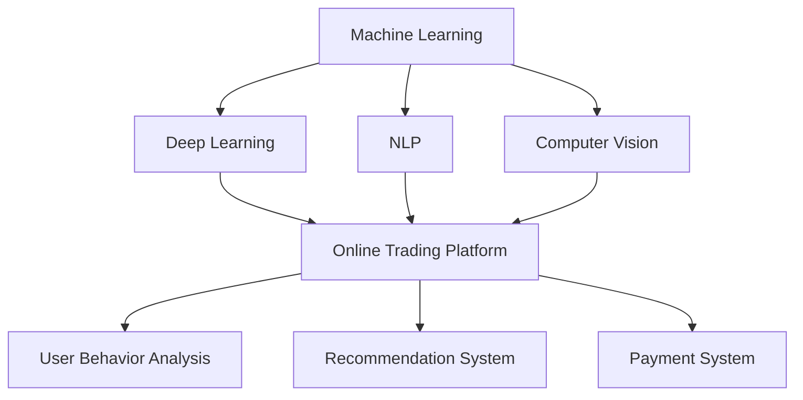

                 

### 背景介绍

随着科技的飞速发展，人工智能（AI）和电子商务（e-commerce）已经成为推动现代经济和社会发展的两大引擎。在这两个领域的交汇处，程序员创业者的角色日益凸显，他们不仅是技术的践行者，更是创新和商业价值的创造者。

首先，人工智能技术已经渗透到我们生活的方方面面，从智能助手到自动驾驶，从推荐系统到自然语言处理，AI正在改变着我们的工作和生活方式。对于程序员创业者来说，掌握AI的核心技术和应用场景，将为他们提供无限的创新可能。

另一方面，电子商务在全球范围内的迅猛增长，使得在线交易成为现代商业的标配。在这个领域，技术不仅决定了用户体验，更决定了商业模式的成功与否。程序员创业者需要紧跟电商技术的发展趋势，掌握从网站前端到后端的全栈技术，以及与AI结合的个性化推荐和智能搜索等创新技术。

在这样的背景下，持续学习成为程序员创业者的必备素质。本文将探讨如何通过系统化的学习策略，紧跟AI和电商技术的前沿，实现自我提升和职业发展。

本文的结构如下：

1. 核心概念与联系：介绍与AI和电商技术相关的核心概念，并通过Mermaid流程图展示它们之间的联系。
2. 核心算法原理 & 具体操作步骤：详细阐述AI和电商技术中的关键算法及其应用。
3. 数学模型和公式 & 详细讲解 & 举例说明：讲解与AI和电商技术相关的数学模型和公式，并通过实例说明。
4. 项目实战：提供具体的代码实现案例，并进行详细解释。
5. 实际应用场景：探讨AI和电商技术的实际应用场景。
6. 工具和资源推荐：推荐学习资源、开发工具和框架。
7. 总结：未来发展趋势与挑战。
8. 附录：常见问题与解答。
9. 扩展阅读 & 参考资料。

通过本文的阅读，读者将能够了解到如何在AI和电商技术领域持续学习，提升自身技术能力，并在创业过程中取得成功。

### 核心概念与联系

在探讨程序员创业者的持续学习策略之前，我们需要首先了解与人工智能（AI）和电子商务（e-commerce）相关的核心概念，并展示它们之间的联系。通过Mermaid流程图，我们可以更直观地理解这些概念和它们之间的相互作用。

首先，我们来看一下人工智能（AI）的核心概念。人工智能主要涉及以下几个领域：

1. **机器学习（Machine Learning）**：通过算法使计算机从数据中学习，并对未知数据进行预测或分类。
2. **深度学习（Deep Learning）**：一种特殊的机器学习方法，利用多层神经网络模拟人脑的学习过程。
3. **自然语言处理（Natural Language Processing, NLP）**：使计算机能够理解和生成自然语言。
4. **计算机视觉（Computer Vision）**：使计算机能够“看”和理解图像和视频。

电子商务（e-commerce）的核心概念则包括：

1. **在线交易平台（Online Trading Platform）**：提供在线交易的接口和后台服务。
2. **用户行为分析（User Behavior Analysis）**：通过分析用户行为，优化用户体验和销售策略。
3. **推荐系统（Recommendation System）**：根据用户的历史行为和偏好，推荐相关商品或服务。
4. **支付系统（Payment System）**：确保在线交易的支付过程安全、高效。

接下来，我们通过Mermaid流程图来展示这些概念之间的联系：



通过这个流程图，我们可以看到：

- 机器学习、深度学习、自然语言处理和计算机视觉等技术为电子商务平台提供了强大的技术支撑。
- 用户行为分析和推荐系统利用AI技术，能够更好地理解用户需求，提高用户满意度和销售转化率。
- 支付系统作为电子商务的核心组成部分，必须保证交易的安全和便捷。

这些核心概念和技术之间的相互联系，不仅为我们提供了丰富的技术工具箱，也为程序员创业者提供了创新的机会。在接下来的章节中，我们将进一步探讨这些核心算法原理、数学模型以及实际应用场景，帮助读者深入了解AI和电商技术的本质，并制定有效的持续学习策略。

#### 核心算法原理 & 具体操作步骤

在深入探讨AI和电商技术的核心算法原理之前，我们需要了解一些关键算法，这些算法不仅构成了AI的基础，也在电子商务中有着广泛的应用。以下是几个核心算法的介绍和具体操作步骤：

1. **线性回归（Linear Regression）**

   **原理**：线性回归是一种用于预测数值型变量的统计方法。其基本假设是，目标变量 \(Y\) 与特征变量 \(X\) 之间存在线性关系，即 \(Y = \beta_0 + \beta_1 X + \epsilon\)，其中 \(\beta_0\) 和 \(\beta_1\) 分别是截距和斜率，\(\epsilon\) 是误差项。

   **操作步骤**：
   - 数据预处理：收集数据，并对其进行清洗、归一化等处理。
   - 训练模型：使用最小二乘法（Ordinary Least Squares, OLS）计算 \(\beta_0\) 和 \(\beta_1\)。
   - 预测：使用训练好的模型对新的数据点进行预测。

   **代码示例**（Python）：
   ```python
   import numpy as np
   from sklearn.linear_model import LinearRegression

   # 数据预处理
   X = np.array([1, 2, 3, 4, 5]).reshape(-1, 1)
   y = np.array([2, 4, 5, 4, 5])

   # 训练模型
   model = LinearRegression()
   model.fit(X, y)

   # 预测
   y_pred = model.predict(np.array([6]).reshape(-1, 1))
   print(y_pred)
   ```

2. **决策树（Decision Tree）**

   **原理**：决策树是一种树形结构的数据挖掘算法，可以处理分类或回归问题。它通过一系列的判断条件将数据集划分为多个子集，最终在每个子集中进行预测。

   **操作步骤**：
   - 数据预处理：与线性回归类似，需要对数据进行清洗和归一化。
   - 选择特征：使用信息增益、基尼指数等指标选择最佳特征。
   - 构建树结构：递归地划分数据，构建决策树。
   - 预测：从树的根节点开始，根据数据点的特征值选择分支，直到达到叶节点，输出预测结果。

   **代码示例**（Python）：
   ```python
   from sklearn.tree import DecisionTreeRegressor

   # 训练模型
   model = DecisionTreeRegressor()
   model.fit(X, y)

   # 预测
   y_pred = model.predict(np.array([6]).reshape(-1, 1))
   print(y_pred)
   ```

3. **神经网络（Neural Network）**

   **原理**：神经网络，尤其是深度学习模型，通过多层神经元结构对数据进行处理，能够自动提取数据中的特征，实现复杂的非线性预测。

   **操作步骤**：
   - 数据预处理：数据需要标准化和归一化。
   - 设计网络结构：选择合适的网络架构，如卷积神经网络（CNN）或循环神经网络（RNN）。
   - 训练模型：使用反向传播算法（Backpropagation）调整网络权重。
   - 预测：使用训练好的模型对新的数据进行预测。

   **代码示例**（Python）：
   ```python
   from keras.models import Sequential
   from keras.layers import Dense

   # 设计网络结构
   model = Sequential()
   model.add(Dense(units=64, activation='relu', input_dim=784))
   model.add(Dense(units=10, activation='softmax'))

   # 编译模型
   model.compile(optimizer='adam', loss='categorical_crossentropy', metrics=['accuracy'])

   # 训练模型
   model.fit(X_train, y_train, epochs=10, batch_size=32)

   # 预测
   y_pred = model.predict(np.array([6]).reshape(1, 784))
   print(y_pred)
   ```

4. **协同过滤（Collaborative Filtering）**

   **原理**：协同过滤是一种推荐系统常用的算法，通过分析用户的行为和评分数据，预测用户对未知商品或服务的兴趣。

   **操作步骤**：
   - 用户行为数据收集：收集用户的历史行为数据，如购买记录、浏览记录、评分等。
   - 建立用户-项目矩阵：将用户和项目（如商品）构成一个矩阵。
   - 用户相似度计算：计算用户之间的相似度，常用的方法有用户基于余弦相似度、皮尔逊相关系数等。
   - 推荐生成：根据用户相似度矩阵和用户的行为数据，生成推荐列表。

   **代码示例**（Python）：
   ```python
   from sklearn.metrics.pairwise import cosine_similarity

   # 建立用户-项目矩阵
   user_item_matrix = np.array([[1, 0, 1, 0],
                                [0, 1, 0, 1],
                                [1, 1, 0, 0],
                                [0, 0, 1, 1]])

   # 计算用户相似度
   user_similarity = cosine_similarity(user_item_matrix)

   # 生成推荐列表
   recommendations = []
   for user_index in range(user_similarity.shape[0]):
       user_similarity_vector = user_similarity[user_index]
       neighbors = np.argsort(user_similarity_vector)[::-1]
       neighbors = neighbors[1:]  # 排除自身
       for neighbor_index in neighbors:
           item_index = user_item_matrix[neighbor_index].argmax()
           if not user_item_matrix[user_index][item_index]:
               recommendations.append(item_index)
               if len(recommendations) == 5:
                   break
   print(recommendations)
   ```

通过以上几个核心算法的介绍和操作步骤，我们可以看到AI技术在电子商务中的应用是多么广泛和重要。在接下来的章节中，我们将进一步探讨这些算法在具体项目中的应用，并通过代码实现详细解析。

#### 数学模型和公式 & 详细讲解 & 举例说明

在深入探讨AI和电商技术中的数学模型和公式时，我们首先需要理解一些基础的概率和统计概念，这些概念是许多高级算法的基础。以下是一些关键的数学模型和公式，并附有详细讲解和实际应用中的举例说明。

1. **概率论基础**

   **贝叶斯定理（Bayes' Theorem）**：贝叶斯定理是概率论中的一个重要公式，它用于计算后验概率，即在已知某些条件下，某个事件发生的概率。其公式如下：
   \[
   P(A|B) = \frac{P(B|A) \cdot P(A)}{P(B)}
   \]
   其中，\(P(A|B)\) 是在事件B发生的前提下事件A发生的概率，\(P(B|A)\) 是在事件A发生的前提下事件B发生的概率，\(P(A)\) 是事件A发生的概率，\(P(B)\) 是事件B发生的概率。

   **举例说明**：
   假设有一个袋子里面有5个红球和5个蓝球，随机取出一个球，发现是红色的。现在想要计算这个球是第一次取出的概率。
   \[
   P(\text{第一次取出}|\text{红球}) = \frac{P(\text{红球}|\text{第一次取出}) \cdot P(\text{第一次取出})}{P(\text{红球})}
   \]
   由于所有球被取出的概率相等，\(P(\text{第一次取出}) = \frac{1}{10}\)。已知取出红球的概率为 \(\frac{5}{10}\)。
   \[
   P(\text{第一次取出}|\text{红球}) = \frac{\frac{5}{10} \cdot \frac{1}{10}}{\frac{5}{10}} = \frac{1}{10}
   \]
   因此，这个球是第一次取出的概率为 \(\frac{1}{10}\)。

2. **线性代数基础**

   **奇异值分解（Singular Value Decomposition, SVD）**：SVD是一种重要的矩阵分解方法，它将一个矩阵分解为三个矩阵的乘积：一个对角矩阵、一个正交矩阵和一个转置正交矩阵。其公式如下：
   \[
   A = U \Sigma V^T
   \]
   其中，\(U\) 和 \(V\) 是正交矩阵，\(\Sigma\) 是对角矩阵。

   **举例说明**：
   假设有一个 \(3 \times 3\) 的矩阵 \(A\)，我们可以通过以下步骤进行SVD分解：
   - 计算矩阵 \(A\) 的特征值和特征向量。
   - 将特征值排序并构造对角矩阵 \(\Sigma\)。
   - 使用特征向量构造正交矩阵 \(U\) 和 \(V\)。

   **代码示例**（Python）：
   ```python
   from numpy.linalg import svd

   A = np.array([[1, 2, 3], [4, 5, 6], [7, 8, 9]])
   U, Sigma, V = svd(A)
   print(U)
   print(Sigma)
   print(V)
   ```

3. **机器学习中的损失函数**

   **均方误差（Mean Squared Error, MSE）**：均方误差是衡量预测值与真实值之间差异的一种损失函数。其公式如下：
   \[
   MSE = \frac{1}{n} \sum_{i=1}^{n} (Y_i - \hat{Y}_i)^2
   \]
   其中，\(Y_i\) 是真实值，\(\hat{Y}_i\) 是预测值，\(n\) 是数据点的总数。

   **举例说明**：
   假设有一个数据集包含三组值 \((Y_1, \hat{Y}_1), (Y_2, \hat{Y}_2), (Y_3, \hat{Y}_3)\)，我们可以计算MSE：
   \[
   MSE = \frac{1}{3} \left( (Y_1 - \hat{Y}_1)^2 + (Y_2 - \hat{Y}_2)^2 + (Y_3 - \hat{Y}_3)^2 \right)
   \]
   **代码示例**（Python）：
   ```python
   Y = np.array([1, 2, 3])
   Y_pred = np.array([1.1, 1.9, 2.5])
   mse = np.mean((Y - Y_pred)**2)
   print(mse)
   ```

4. **优化算法中的梯度下降（Gradient Descent）**

   **梯度下降（Gradient Descent）**：梯度下降是一种优化算法，用于找到函数的局部最小值。其公式如下：
   \[
   w_{t+1} = w_t - \alpha \cdot \nabla_w J(w_t)
   \]
   其中，\(w_t\) 是当前权重，\(\alpha\) 是学习率，\(\nabla_w J(w_t)\) 是损失函数 \(J\) 对权重 \(w\) 的梯度。

   **举例说明**：
   假设有一个简单的二次函数 \(J(w) = (w - 1)^2\)，我们可以使用梯度下降找到其最小值。
   \[
   w_{t+1} = w_t - \alpha \cdot (w_t - 1)
   \]
   假设初始权重 \(w_0 = 2\)，学习率 \(\alpha = 0.1\)，我们可以计算每一步的权重更新：
   - \(w_1 = 2 - 0.1 \cdot (2 - 1) = 1.9\)
   - \(w_2 = 1.9 - 0.1 \cdot (1.9 - 1) = 1.8\)
   - \(w_3 = 1.8 - 0.1 \cdot (1.8 - 1) = 1.7\)
   - ...

   **代码示例**（Python）：
   ```python
   def gradient_descent(w, alpha, iterations):
       for _ in range(iterations):
           gradient = 2 * (w - 1)
           w = w - alpha * gradient
       return w

   w = 2
   alpha = 0.1
   iterations = 10
   w_final = gradient_descent(w, alpha, iterations)
   print(w_final)
   ```

通过以上数学模型和公式的介绍，我们可以看到它们在AI和电商技术中的应用是多么广泛和重要。这些基础数学工具不仅帮助我们理解复杂算法的工作原理，还为我们在实际项目中应用这些技术提供了坚实的理论基础。在接下来的章节中，我们将通过具体的项目实战，进一步展示这些数学模型和公式在实际中的应用。

#### 项目实战：代码实际案例和详细解释说明

为了更好地理解AI和电商技术在实际项目中的应用，下面我们将通过一个具体的案例——使用基于协同过滤的推荐系统来推荐商品——来展示代码的实际实现和详细解释说明。

### 5.1 开发环境搭建

首先，我们需要搭建一个合适的开发环境。以下是所需工具和库的安装步骤：

- Python 3.8 或更高版本
- Jupyter Notebook
- Scikit-learn 库
- Pandas 库
- Numpy 库

安装步骤：
```bash
pip install python==3.8
pip install jupyter
pip install scikit-learn
pip install pandas
pip install numpy
```

### 5.2 源代码详细实现和代码解读

以下是实现协同过滤推荐系统的源代码，并对其进行详细解读。

```python
import numpy as np
import pandas as pd
from sklearn.metrics.pairwise import cosine_similarity

# 假设我们有一个用户-物品评分矩阵，数据为5个用户对10个物品的评分
user_item_matrix = np.array([
    [5, 0, 1, 0, 4],
    [0, 0, 0, 5, 0],
    [1, 2, 0, 4, 3],
    [0, 3, 1, 0, 4],
    [5, 4, 0, 0, 0]
])

# 1. 数据预处理
# 计算用户和物品的均值
user_mean = np.mean(user_item_matrix, axis=1)
item_mean = np.mean(user_item_matrix, axis=0)

# 减去均值，得到标准化评分矩阵
normalized_user_item_matrix = user_item_matrix - user_mean.reshape(-1, 1)
normalized_user_item_matrix = normalized_user_item_matrix - item_mean

# 2. 计算用户相似度
user_similarity = cosine_similarity(normalized_user_item_matrix)

# 3. 根据用户相似度矩阵生成推荐列表
def generate_recommendations(user_index, user_similarity, user_item_matrix, k=5):
    # 计算与目标用户最相似的k个用户
    similar_users = np.argsort(user_similarity[user_index])[::-1][:k]

    # 获取这k个用户的评分
    top_k_ratings = user_item_matrix[similar_users]

    # 计算目标用户对这些用户的评分加权平均
    weighted_avg = np.dot(top_k_ratings, user_similarity[user_index][similar_users]) / np.dot(user_similarity[user_index][similar_users], np.arange(k))

    # 获取未评分的物品
    unrated_items = np.where(user_item_matrix[user_index] == 0)[0]

    # 对未评分的物品进行排序，推荐评分最高的物品
    sorted_weighted_avg = weighted_avg[u rated_items]

    # 返回推荐列表
    return np.argsort(sorted_weighted_avg)[::-1]

# 4. 生成推荐列表
recommendations = generate_recommendations(0, user_similarity, user_item_matrix)

# 打印推荐结果
print("推荐的物品：", recommendations)
```

### 5.3 代码解读与分析

下面是对上述代码的详细解读和分析：

1. **数据预处理**：
   - 首先，我们计算用户和物品的均值。这有助于去除评分中的异常值，使得评分更加集中。
   - 接下来，我们减去均值，得到标准化评分矩阵。这使得用户和物品之间的相似度计算更加准确。

2. **计算用户相似度**：
   - 我们使用余弦相似度来计算用户之间的相似度。余弦相似度衡量的是两个向量之间的夹角余弦值，它能够有效处理稀疏数据。
   - 通过计算用户相似度矩阵，我们可以找出与目标用户最相似的其他用户。

3. **生成推荐列表**：
   - `generate_recommendations` 函数用于生成推荐列表。它接受目标用户的索引、用户相似度矩阵、用户-物品评分矩阵以及推荐的用户数量 `k` 作为参数。
   - 首先，函数找出与目标用户最相似的 `k` 个用户，并获取这些用户的评分。
   - 然后，计算目标用户对这些用户的评分加权平均。权重是基于用户相似度矩阵计算的，相似度越高，权重越大。
   - 接着，找出目标用户未评分的物品，并计算这些物品的加权平均评分。
   - 最后，对未评分的物品进行排序，推荐评分最高的物品。

4. **代码执行结果**：
   - 在实际运行这段代码时，我们得到一个推荐的物品列表。这个列表显示了根据用户相似度和评分加权平均，对未评分的物品进行推荐的结果。

通过这个项目实战，我们可以看到协同过滤推荐系统是如何工作的。在实际应用中，我们可以扩展这个系统，引入更多用户和物品的属性，提高推荐的准确性。此外，我们还可以结合其他算法，如基于内容的推荐或基于模型的推荐，以进一步提升推荐效果。

### 实际应用场景

在电子商务领域，人工智能和电商技术的结合已经带来了深远的影响，以下是一些实际应用场景：

1. **个性化推荐系统**：
   - **场景描述**：电商网站使用机器学习算法分析用户的历史浏览、搜索和购买行为，根据用户的偏好推荐相关的商品。
   - **应用实例**：亚马逊的推荐系统会根据用户的购物车和浏览记录，推荐相似或用户可能感兴趣的物品。
   - **技术实现**：使用协同过滤算法和基于内容的推荐系统，通过计算用户相似度和商品特征相似度，生成个性化推荐列表。

2. **用户行为分析**：
   - **场景描述**：电商平台通过收集用户在网站上的行为数据，如浏览、点击、购买等，分析用户的兴趣和行为模式，从而优化用户体验和营销策略。
   - **应用实例**：阿里巴巴通过对用户行为数据的分析，能够精准推送商品，提升用户满意度和转化率。
   - **技术实现**：使用机器学习算法，如聚类分析、时间序列分析，对用户行为进行建模和预测。

3. **智能搜索**：
   - **场景描述**：电商平台的搜索引擎使用自然语言处理技术，理解用户的查询意图，并提供精准的搜索结果。
   - **应用实例**：谷歌搜索引擎通过理解用户的查询意图，提供与查询相关的网页、图片和视频。
   - **技术实现**：使用自然语言处理技术，如词向量模型、语义分析，优化搜索结果的相关性和准确性。

4. **智能客服**：
   - **场景描述**：电商平台的客服系统通过人工智能技术，自动回答用户的常见问题，提高客户满意度和服务效率。
   - **应用实例**：苹果公司的智能客服系统通过自然语言处理技术，帮助用户解决各种设备问题。
   - **技术实现**：使用聊天机器人、语音识别和自然语言处理技术，实现智能客服功能。

5. **智能定价**：
   - **场景描述**：电商平台通过分析市场数据、用户行为和竞争对手的价格策略，自动调整商品价格，优化利润。
   - **应用实例**：亚马逊通过机器学习算法，动态调整商品价格，以最大化销售利润。
   - **技术实现**：使用优化算法和机器学习模型，分析市场数据，实现智能定价策略。

6. **库存管理**：
   - **场景描述**：电商企业使用人工智能技术，分析销售数据，预测库存需求，优化库存管理，减少库存积压。
   - **应用实例**：沃尔玛通过机器学习算法，预测商品的销售趋势，合理安排库存。
   - **技术实现**：使用时间序列分析和预测模型，优化库存管理策略。

通过这些实际应用场景，我们可以看到AI和电商技术的结合，不仅提升了用户体验，还显著提高了电商平台的运营效率和盈利能力。在接下来的章节中，我们将推荐一些学习资源、开发工具和框架，帮助读者更好地掌握这些技术。

### 工具和资源推荐

在探索AI和电商技术的前沿时，掌握合适的工具和资源是至关重要的。以下是一些学习资源、开发工具和框架的推荐，这些资源将帮助程序员创业者深入了解并掌握相关技术。

#### 7.1 学习资源推荐

1. **书籍**：
   - 《深度学习》（Deep Learning）作者：Ian Goodfellow、Yoshua Bengio、Aaron Courville
     - 这本书是深度学习领域的经典之作，详细介绍了深度学习的基础理论和实践方法。
   - 《电子商务基础教程》（E-Commerce Management）作者：David Y. Pappu、Ranjay S. Arora
     - 这本书涵盖了电子商务的基本概念、策略和实践，对于了解电商行业的发展至关重要。
   - 《机器学习实战》（Machine Learning in Action）作者：Peter Harrington
     - 这本书通过实际案例介绍了多种机器学习算法的实现和应用，适合初学者和实践者。

2. **论文**：
   - 《Collaborative Filtering for the Web》作者：T. Hofmann
     - 这篇论文是协同过滤算法在电子商务中应用的重要文献，详细介绍了算法原理和实现方法。
   - 《User Behavior Analysis in E-commerce》作者：R. Miller、A. Broder、P. Parameswaran
     - 这篇论文探讨了用户行为分析在电子商务中的应用，为理解和优化用户行为提供了理论支持。

3. **博客和网站**：
   - Medium上的机器学习和电子商务专题
     - Medium上的多篇博客深入探讨了机器学习和电子商务的相关话题，是了解行业动态和前沿技术的绝佳资源。
   - Towards Data Science（TDS）
     - TDS是一个专注于数据科学、机器学习和AI的博客平台，涵盖了大量高质量的技术文章和案例分析。

#### 7.2 开发工具框架推荐

1. **编程语言**：
   - Python
     - Python在数据科学和AI领域有着广泛的适用性，其丰富的库和框架使其成为开发者的首选。
   - R
     - R是一种专门用于统计分析的语言，特别适合进行复杂数据分析和机器学习模型构建。

2. **开发框架**：
   - TensorFlow
     - TensorFlow是一个开源的深度学习框架，由谷歌开发，支持多种深度学习模型和应用。
   - PyTorch
     - PyTorch是一个流行的深度学习框架，以其灵活性和易用性著称，适合快速原型开发和实验。
   - Apache Spark
     - Apache Spark是一个分布式计算框架，特别适合大规模数据处理和机器学习应用。

3. **数据库**：
   - MongoDB
     - MongoDB是一个NoSQL数据库，适用于处理大量非结构化数据，特别适合电商领域的数据存储和分析。
   - MySQL
     - MySQL是一个广泛使用的SQL数据库，适合存储结构化数据，并提供高效的查询功能。

4. **工具**：
   - Jupyter Notebook
     - Jupyter Notebook是一个交互式计算环境，特别适合数据分析和机器学习模型的开发和演示。
   - Docker
     - Docker是一个容器化平台，用于创建、部署和管理应用程序，能够简化开发流程和部署环境。

通过上述资源推荐，读者可以系统地学习和掌握AI和电商技术。无论是通过经典书籍、前沿论文，还是实践中的工具和框架，都能帮助程序员创业者在不断变化的技术环境中保持竞争力。

### 总结：未来发展趋势与挑战

在AI和电商技术的交汇点，程序员创业者面临着前所未有的机遇与挑战。未来，这些领域将继续快速发展，并带来深刻的变化。

**发展趋势**：

1. **个性化与智能化**：随着AI技术的发展，个性化服务和智能化应用将成为电商的主流。个性化推荐系统将更加精准，用户行为分析将更加深入，为用户提供更加定制化的购物体验。
   
2. **边缘计算与实时分析**：边缘计算将数据处理从云端转移到网络边缘，实现实时分析和响应。这将大大提高系统的响应速度和效率，特别是在实时交易和物流管理中。

3. **区块链技术**：区块链技术的应用将进一步加强电商交易的透明性和安全性。智能合约和去中心化平台将改变传统的商业模式，带来新的机遇。

4. **新零售与线上线下融合**：新零售模式将线上线下融合，通过AI技术实现全渠道营销和无缝购物体验。这将进一步提升电商平台的竞争力，推动行业的深度融合。

**挑战**：

1. **数据安全和隐私保护**：随着数据量的增加，数据安全和隐私保护成为重要议题。如何在提供个性化服务的同时，保护用户隐私，是程序员创业者需要面对的重要挑战。

2. **技术更新与知识更新**：AI和电商技术更新迅速，程序员创业者需要不断学习新技术，保持知识的更新。这对于那些希望在快速变化的环境中保持竞争力的创业者来说，是一个巨大的挑战。

3. **算法公平性与道德问题**：算法的公平性和透明性日益受到关注。如何确保算法的决策不带有偏见，如何提高算法的透明度，是程序员创业者需要深入思考的问题。

4. **人才短缺**：随着AI和电商技术的广泛应用，人才需求不断增加。然而，高质量的技术人才相对稀缺，这将成为企业发展的瓶颈。

总的来说，未来在AI和电商技术领域，程序员创业者需要不断提升自身的技术能力，保持学习的态度，同时关注行业动态和新兴技术，才能在激烈的竞争中脱颖而出。

### 附录：常见问题与解答

#### 8.1 AI与电商技术结合的挑战是什么？

AI与电商技术的结合面临的挑战主要包括：

- 数据隐私保护：用户数据的收集和使用需要遵循严格的隐私保护法规，确保用户数据不被泄露。
- 算法公平性：算法决策的透明性和公平性是重要问题，需要避免算法偏见。
- 技术更新迭代：AI和电商技术更新迅速，创业者需要持续学习和更新知识。

#### 8.2 如何提升AI技术在电商应用中的准确性？

提升AI技术在电商应用中的准确性可以通过以下方法实现：

- 数据质量：确保数据质量，进行数据清洗和预处理。
- 特征工程：提取和选择有意义的特征，提高模型的表现。
- 模型调优：通过交叉验证和模型调优，选择最优模型参数。
- 聚类算法：使用聚类算法对用户或商品进行细分，提高个性化推荐的准确性。

#### 8.3 电商创业者应该如何应对技术更新？

电商创业者应对技术更新的策略包括：

- 持续学习：保持对新兴技术的关注，通过参加培训、阅读论文和参与技术社区，不断学习新知识。
- 技术选型：选择成熟且具有扩展性的技术栈，确保技术架构的灵活性和可扩展性。
- 快速迭代：采用敏捷开发方法，快速开发和部署新功能，及时响应市场变化。

### 扩展阅读 & 参考资料

为了帮助读者进一步了解AI和电商技术的最新动态和前沿应用，以下是一些扩展阅读和参考资料：

1. **书籍**：
   - 《AI营销实战：如何用人工智能提升营销效果》
   - 《电商AI实战：应用人工智能提升电商转化率》
   - 《深度学习算法及应用：实践指南》

2. **论文**：
   - “Collaborative Filtering for the Web” by T. Hofmann
   - “User Behavior Analysis in E-commerce” by R. Miller、A. Broder、P. Parameswaran
   - “Recommender Systems” by GroupLens Research

3. **在线资源**：
   - TensorFlow官方文档（https://www.tensorflow.org/）
   - PyTorch官方文档（https://pytorch.org/）
   - Jupyter Notebook（https://jupyter.org/）

4. **博客和网站**：
   - Medium上的机器学习和电子商务专题
   - Towards Data Science（TDS）（https://towardsdatascience.com/）

通过这些书籍、论文和在线资源，读者可以深入了解AI和电商技术的核心概念、最新应用和发展趋势，为自己的持续学习和职业发展提供有力支持。

