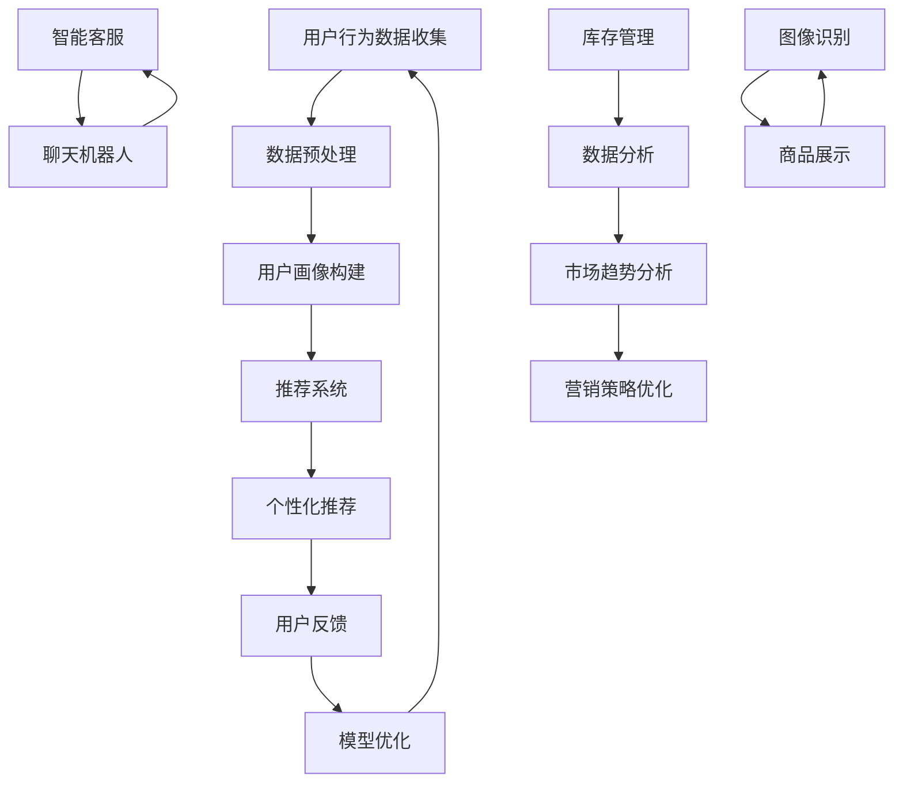

                 

# 程序员创业者的融资指南：如何向投资者推销AI电商项目

## 引言

在当前的技术时代，人工智能（AI）正逐步改变着各行各业的运作模式，特别是在电商领域。AI电商项目通过自动化和智能化的技术手段，为企业提供了更精准的市场分析、个性化推荐、智能客服等功能，从而大大提升了运营效率和客户满意度。然而，对于许多程序员创业者来说，如何将AI电商项目的潜力转化为投资者的兴趣和资本支持，仍然是一个巨大的挑战。

本文将围绕如何向投资者推销AI电商项目，提供一系列的指南和建议。首先，我们将介绍AI电商项目的背景和现状，帮助创业者理解市场机会。接下来，我们将深入探讨如何构建一个具有吸引力的商业计划书，并详细说明如何向投资者展示项目的技术优势和潜在收益。此外，我们还将提供一些实际的沟通技巧，帮助创业者更好地与投资者互动。

最后，我们将讨论AI电商项目的未来发展趋势和潜在挑战，帮助投资者和创业者共同规划项目的发展方向。通过本文的阅读，程序员创业者将获得一个全面的融资指南，以更好地把握市场机遇，实现项目的成功。

## 背景介绍

### 人工智能与电商的融合

人工智能（AI）技术的发展为电商行业带来了前所未有的变革。AI的应用不仅使得电商平台能够更精准地了解用户需求，还能大幅提升运营效率和客户体验。以下是一些AI在电商领域的主要应用：

1. **个性化推荐**：通过机器学习和大数据分析，AI可以为每位用户生成个性化的商品推荐，从而提高转化率和用户满意度。例如，Amazon和淘宝等电商平台都广泛应用了这一技术。

2. **智能客服**：利用自然语言处理（NLP）和聊天机器人技术，AI能够提供24/7的智能客服服务，解答用户疑问，降低人工成本，并提高响应速度和满意度。

3. **库存管理**：AI可以通过预测模型和数据分析，帮助电商企业更准确地预测市场需求，优化库存管理，减少滞销和缺货问题。

4. **欺诈检测**：利用异常检测算法，AI能够识别并预防电商交易中的欺诈行为，提高交易安全性。

### 电商市场的现状与增长潜力

电商市场在过去几年中经历了显著的增长。根据Statista的数据，全球电商市场规模在2021年已达到4.9万亿美元，预计到2025年将达到6.8万亿美元。这一快速增长主要得益于以下几个方面：

1. **移动设备的普及**：随着智能手机和移动网络的普及，越来越多的消费者通过移动设备进行购物，这为电商平台提供了更多的流量和销售机会。

2. **线上购物的便捷性**：相比传统购物方式，电商购物更加便捷，消费者可以随时随地进行购物，这使得电商市场的潜力进一步扩大。

3. **后疫情时代的影响**：新冠疫情的爆发加速了线上购物的普及，许多消费者开始习惯于在线购物，这一趋势预计将长期持续。

### AI电商项目的市场机会

AI电商项目的市场机会主要体现在以下几个方面：

1. **提升用户体验**：通过个性化推荐、智能客服等AI技术，电商企业可以大幅提升用户体验，增加用户粘性和忠诚度。

2. **优化运营效率**：AI技术可以帮助电商企业更准确地预测市场需求，优化库存管理和供应链，降低运营成本。

3. **增加收入和利润**：AI电商项目可以通过提高销售转化率和优化营销策略，帮助电商企业实现更高的收入和利润。

4. **扩大市场覆盖**：AI技术可以帮助电商企业更好地了解不同地区和不同群体的用户需求，从而扩大市场覆盖范围。

综上所述，AI电商项目不仅具有显著的技术优势，还拥有广阔的市场前景。对于程序员创业者来说，抓住这一市场机遇，通过有效的融资策略，实现项目的商业化和规模化，是一个值得追求的目标。

## 核心概念与联系

### AI电商项目的核心组成部分

要成功地推销AI电商项目，首先需要明确其核心组成部分，这些组成部分包括：

1. **推荐系统**：推荐系统是AI电商项目的核心组件，通过机器学习和大数据分析技术，为用户生成个性化的商品推荐。推荐系统的目标是提高用户的购物体验和增加销售额。

2. **自然语言处理（NLP）**：NLP技术用于构建智能客服和聊天机器人，使得电商平台能够实现24/7的客户服务，提高用户满意度和降低运营成本。

3. **图像识别与处理**：图像识别技术可以帮助电商平台更好地展示商品，识别用户上传的图片，提供相关推荐，从而提升用户体验。

4. **数据挖掘与分析**：通过数据挖掘和分析技术，电商企业可以深入了解用户行为和市场趋势，优化库存管理和营销策略。

### 技术原理与架构

为了更清晰地理解AI电商项目的技术原理和架构，我们可以借助Mermaid流程图来展示其关键节点和流程。



### Mermaid流程图解释

1. **用户行为数据收集**：电商平台通过收集用户在网站上的行为数据，如浏览记录、搜索历史、购买行为等。

2. **数据预处理**：对收集到的数据进行清洗、去噪和处理，以便用于后续分析和建模。

3. **用户画像构建**：通过数据分析技术，构建用户的兴趣偏好和行为特征模型。

4. **推荐系统**：基于用户画像和商品特征，利用协同过滤、内容推荐等技术生成个性化推荐列表。

5. **个性化推荐**：将个性化推荐结果展示给用户，提高用户的购物体验和满意度。

6. **用户反馈**：收集用户对推荐结果的评价和反馈，用于模型优化。

7. **模型优化**：根据用户反馈不断优化推荐算法，提高推荐准确性。

8. **智能客服**：利用NLP技术构建聊天机器人，提供24/7的客户服务。

9. **库存管理**：通过数据分析预测市场需求，优化库存管理和供应链。

10. **图像识别与处理**：利用图像识别技术，为用户提供更丰富的商品展示体验。

11. **市场趋势分析**：分析市场数据，了解行业趋势和竞争状况，为营销策略提供支持。

12. **营销策略优化**：根据市场趋势和用户反馈，调整营销策略，提高销售额和利润。

通过上述核心概念和流程图的展示，创业者可以更好地理解AI电商项目的技术原理和架构，从而在向投资者推销时能够清晰、有逻辑地阐述项目的价值。

## 核心算法原理 & 具体操作步骤

### 个性化推荐算法

#### 1. 协同过滤算法

**原理**：协同过滤算法是一种基于用户行为数据的推荐算法，通过分析用户之间的相似性来推荐商品。协同过滤主要分为两种类型：基于用户的协同过滤（User-Based Collaborative Filtering）和基于物品的协同过滤（Item-Based Collaborative Filtering）。

- **基于用户的协同过滤**：找到与目标用户兴趣相似的其它用户，推荐这些用户喜欢的商品。
- **基于物品的协同过滤**：找到与目标商品相似的其它商品，推荐给用户。

**步骤**：

1. **用户行为数据收集**：收集用户在电商平台的浏览、搜索、购买等行为数据。
2. **数据预处理**：对用户行为数据进行清洗和去噪，提取用户-商品交互矩阵。
3. **用户相似性计算**：计算用户之间的相似度，常用的方法包括余弦相似度、皮尔逊相关系数等。
4. **推荐商品选择**：根据用户相似性矩阵，为每个用户推荐那些与相似用户有共同喜好商品的其他用户。

#### 2. 内容推荐算法

**原理**：内容推荐算法通过分析商品的特征和属性，将具有相似属性的物品推荐给用户。这种算法适用于商品描述丰富且特征明显的场景。

**步骤**：

1. **商品特征提取**：从商品描述中提取关键特征，如品牌、颜色、尺寸等。
2. **用户特征提取**：提取用户的行为特征，如浏览记录、购买历史等。
3. **相似度计算**：计算商品特征与用户特征之间的相似度，常用方法包括余弦相似度、欧氏距离等。
4. **推荐商品选择**：根据用户特征与商品特征的相似度，为用户推荐相似的商品。

### 智能客服与聊天机器人

#### 1. 自然语言处理（NLP）

**原理**：NLP是一种用于处理人类自然语言数据的技术，包括文本分类、情感分析、实体识别等。

**步骤**：

1. **文本预处理**：清洗文本数据，去除停用词、标点符号等无关信息。
2. **词向量表示**：将文本转换为词向量表示，常用的方法包括Word2Vec、BERT等。
3. **模型训练**：使用NLP模型对文本进行分类、情感分析等任务，常用的模型包括循环神经网络（RNN）、长短期记忆网络（LSTM）等。
4. **模型应用**：利用训练好的模型对用户输入的文本进行分析和响应。

#### 2. 聊天机器人

**原理**：聊天机器人利用NLP技术实现与用户的自然语言交互，能够回答用户的问题、提供帮助等。

**步骤**：

1. **意图识别**：通过NLP技术识别用户的意图，如查询商品信息、退货政策等。
2. **实体识别**：从用户输入的文本中提取关键信息，如商品名称、订单号等。
3. **响应生成**：根据用户的意图和提取的实体信息，生成合适的回复，可以使用规则引擎或机器学习模型。
4. **交互反馈**：根据用户对回复的反馈，不断优化聊天机器人的响应效果。

### 图像识别与处理

#### 1. 卷积神经网络（CNN）

**原理**：卷积神经网络是一种用于图像识别和处理的深度学习模型，通过多层卷积和池化操作，提取图像的特征。

**步骤**：

1. **图像预处理**：对输入图像进行归一化、缩放等处理，使其符合网络输入要求。
2. **特征提取**：通过卷积层和池化层，提取图像的低级和高级特征。
3. **分类器训练**：使用训练好的分类器对图像进行分类，常用的分类器包括全连接层、softmax层等。
4. **模型评估**：使用验证集和测试集评估模型的性能，调整模型参数，优化模型。

#### 2. 目标检测

**原理**：目标检测是一种用于识别图像中的多个对象及其位置的技术，常用于商品识别和图像分类。

**步骤**：

1. **目标检测算法**：使用目标检测算法，如R-CNN、YOLO、SSD等，对图像中的目标进行定位和分类。
2. **边界框标注**：对目标检测算法的输出进行边界框标注，标记每个目标的类别和位置。
3. **模型训练**：使用标注数据训练目标检测模型，优化模型参数。
4. **模型评估**：使用测试集评估模型的性能，调整模型参数，优化模型。

### 数学模型和公式

在AI电商项目中，常用的数学模型和公式包括：

#### 1. 协同过滤算法

$$
\text{相似度} = \frac{\text{用户A与用户B的交互相似度}}{\sqrt{\text{用户A与所有用户的交互相似度之和} \times \text{用户B与所有用户的交互相似度之和}}
$$

#### 2. 内容推荐算法

$$
\text{相似度} = \frac{\sum_{i=1}^{n} x_i y_i}{\sqrt{\sum_{i=1}^{n} x_i^2} \times \sqrt{\sum_{i=1}^{n} y_i^2}}
$$

其中，$x_i$ 和 $y_i$ 分别表示用户和商品的属性向量。

#### 3. 自然语言处理

$$
\text{意图识别概率} = \text{softmax}(\text{模型输出})
$$

其中，softmax函数将模型的输出转换为概率分布。

#### 4. 卷积神经网络

$$
\text{激活函数} = \text{ReLU}(x) = \max(0, x)
$$

ReLU（Rectified Linear Unit）是一种常用的激活函数，可以加速神经网络的训练过程。

通过上述算法和数学模型，AI电商项目能够实现高效的推荐、智能客服和图像识别等功能，从而提升用户体验和运营效率。

### 项目实战：代码实际案例和详细解释说明

#### 5.1 开发环境搭建

在开始编写代码之前，我们需要搭建一个合适的开发环境。以下是搭建开发环境的基本步骤：

1. **安装Python**：确保安装了Python 3.7或更高版本。

2. **安装依赖库**：使用pip命令安装以下依赖库：

```bash
pip install numpy scipy pandas scikit-learn tensorflow matplotlib
```

3. **安装Jupyter Notebook**：Jupyter Notebook是一个交互式的开发环境，可以帮助我们更好地编写和运行代码。

```bash
pip install notebook
```

#### 5.2 源代码详细实现和代码解读

下面我们通过一个简单的示例来演示如何使用Python实现个性化推荐系统。我们将使用协同过滤算法来实现这一功能。

**示例代码**：

```python
import numpy as np
import pandas as pd
from sklearn.metrics.pairwise import cosine_similarity

# 用户-商品交互矩阵
user_item_matrix = [
    [1, 1, 0, 1],
    [0, 1, 1, 0],
    [1, 1, 1, 0],
    [0, 1, 1, 1],
    [1, 1, 0, 1]
]

# 计算用户之间的相似度
user_similarity = cosine_similarity(user_item_matrix)

# 为用户推荐商品
def recommend_items(user_index, similarity_matrix, user_item_matrix, k=2):
    # 计算相似用户和目标用户的交互差值
    sim_diff = similarity_matrix[user_index] - np.mean(similarity_matrix[user_index])
    # 选择最相似的k个用户
    similar_users = np.argsort(sim_diff)[1:k+1]
    # 计算推荐商品得分
    item_scores = []
    for u in similar_users:
        user_ratings = user_item_matrix[u]
        for i, rating in enumerate(user_ratings):
            if rating == 0 and user_item_matrix[user_index][i] == 1:
                item_scores.append(similarity_matrix[user_index][u] * (1 - user_ratings[i]))
    # 返回得分最高的商品
    if item_scores:
        return np.argmax(item_scores)
    else:
        return None

# 测试推荐系统
print(recommend_items(0, user_similarity, user_item_matrix))

```

**代码解读**：

1. **用户-商品交互矩阵**：我们使用一个二维数组表示用户-商品交互矩阵，其中1表示用户对商品进行了评分，0表示未评分。

2. **计算用户相似度**：使用余弦相似度计算用户之间的相似度。余弦相似度通过计算两个向量的点积和各自长度的乘积来衡量相似性。

3. **推荐商品**：`recommend_items`函数通过以下步骤进行商品推荐：

   - 计算相似用户和目标用户的交互差值。
   - 选择最相似的k个用户。
   - 计算推荐商品得分，得分越高表示推荐的可能性越大。
   - 返回得分最高的商品。

#### 5.3 代码解读与分析

1. **用户-商品交互矩阵**：用户-商品交互矩阵是推荐系统的基础，它记录了每个用户对每个商品的评分情况。在我们的示例中，矩阵元素为1表示用户对商品进行了评分，为0表示未评分。

2. **相似度计算**：相似度计算是推荐系统的关键步骤，它决定了哪些用户与目标用户相似。在我们的示例中，我们使用余弦相似度来计算用户之间的相似度。余弦相似度通过计算两个向量的点积和各自长度的乘积来衡量相似性。点积越大，相似度越高。

3. **商品推荐**：商品推荐是通过计算相似用户对商品的评分，然后为目标用户推荐那些评分较高的商品。在我们的示例中，我们首先计算相似用户和目标用户的交互差值，然后选择最相似的k个用户，并计算这些用户对商品的评分。得分越高表示推荐的可能性越大。

通过上述代码示例和解读，我们可以看到如何使用协同过滤算法实现一个简单的个性化推荐系统。在实际项目中，我们可以根据具体需求扩展和优化算法，例如引入更多用户和商品特征，或者使用更复杂的推荐算法如矩阵分解等。

### 实际应用场景

#### 个性化推荐

个性化推荐是AI电商项目中最重要的应用场景之一。通过个性化推荐，电商平台能够为每位用户生成量身定制的商品推荐，从而提高用户满意度和购物转化率。以下是一个实际案例：

**案例**：假设一个电商平台，用户A喜欢购买数码产品和运动装备。当用户A登录平台时，系统会根据其历史购买记录和浏览行为，为其推荐类似的产品。例如，如果用户A最近浏览了智能手机，系统可能会推荐新款手机、手机壳和耳机等配件。通过这种方式，个性化推荐不仅能够提升用户的购物体验，还能增加平台的销售额。

#### 智能客服

智能客服在电商领域同样具有重要意义。通过NLP和聊天机器人技术，电商平台能够实现24/7的智能客服服务，提高用户满意度和降低运营成本。以下是一个实际案例：

**案例**：当用户在电商平台遇到问题时，如订单状态查询、退货政策咨询等，可以随时通过聊天机器人与平台客服进行交互。聊天机器人能够快速识别用户的问题并给出相应的回答，如“您的订单已经发货，预计3天内到达”，“根据我们的退货政策，您可以申请退回商品”。这不仅提高了客服效率，还降低了人力成本。

#### 库存管理

库存管理是电商平台运营的重要一环。通过AI技术，电商企业能够更准确地预测市场需求，优化库存管理，减少滞销和缺货问题。以下是一个实际案例：

**案例**：某电商平台通过分析历史销售数据、季节性因素和市场趋势，使用AI算法预测未来几个月的销售额。根据预测结果，平台会提前调整库存，确保热门商品有充足的供应，避免因缺货而错失销售机会。同时，对于销售预测较低的商品，平台会采取降价促销或库存清仓等措施，降低库存压力。

#### 欺诈检测

在电商交易中，欺诈行为是一个严重的问题。通过AI技术，电商企业能够实时监测交易行为，识别和预防欺诈行为，保障用户和平台的安全。以下是一个实际案例：

**案例**：某电商平台使用异常检测算法，监控用户的交易行为，如支付方式、支付时间、订单金额等。当检测到异常行为时，如某用户的支付时间异常集中在深夜或订单金额异常大，系统会自动发出预警，并要求用户进行身份验证或暂停交易。通过这种方式，平台能够有效降低欺诈风险。

#### 市场营销

AI电商项目还可以帮助电商平台优化市场营销策略。通过分析用户数据和行为，电商平台能够更精准地定位目标客户，制定个性化的营销方案。以下是一个实际案例：

**案例**：某电商平台通过分析用户的购物历史和行为，识别出高价值客户群体。平台会为这些客户群体定制专属的营销活动，如优惠券、限时折扣等。同时，平台还会通过社交媒体和邮件推送等方式，将营销信息精准地传达给目标客户，提高营销效果。

通过上述实际应用场景，我们可以看到AI电商项目在提升用户体验、优化运营效率和增加收入方面的巨大潜力。这些应用场景不仅展示了AI技术在电商领域的广泛应用，也为创业者提供了丰富的商业机会。

### 工具和资源推荐

#### 7.1 学习资源推荐

对于希望深入了解AI电商项目的程序员创业者来说，以下是一些推荐的学习资源：

1. **书籍**：
   - 《人工智能：一种现代方法》（第三版） - Stuart Russell & Peter Norvig
   - 《机器学习》（第二版） - Tom Mitchell
   - 《深入理解计算机图灵奖获得者的机器学习》（第一版） - 周志华

2. **论文**：
   - "Recommender Systems Handbook" - Chapter 4: Content-Based Filtering
   - "Deep Learning for Text Data" - Yiming Cui, Ziwei Wang, and Xuechen Zhang
   - "Multi-Label Text Classification with Attention Mechanism" - Yoon Kim

3. **博客**：
   - Medium：关注AI、机器学习和电商相关的技术博客，如“AI in Action”、”Machine Learning Mastery“
   - 知乎：在知乎上关注相关领域的专家和热门话题，获取最新的行业动态和见解

4. **网站**：
   - Coursera、edX：在线课程平台，提供丰富的AI和机器学习课程
   - Kaggle：数据科学竞赛平台，提供大量的AI和机器学习项目实战机会

#### 7.2 开发工具框架推荐

在开发和实现AI电商项目时，以下工具和框架是必不可少的：

1. **编程语言**：
   - Python：广泛应用于AI和机器学习领域，有丰富的库和框架支持
   - R：适用于数据分析和统计建模

2. **深度学习框架**：
   - TensorFlow：Google开发的开源深度学习框架，功能强大且社区活跃
   - PyTorch：Facebook开发的开源深度学习框架，灵活且易用

3. **推荐系统框架**：
   - LightFM：基于因子分解机的开源推荐系统框架
   - ALS Recsys：基于交替最小二乘法的推荐系统框架

4. **自然语言处理库**：
   - NLTK：Python的文本处理库，提供多种文本处理功能
   - spaCy：高效的NLP库，适用于实体识别、命名实体识别等任务

5. **数据存储和数据处理工具**：
   - MongoDB：灵活的文档型数据库，适用于存储用户行为数据
   - Hadoop：大数据处理平台，适用于大规模数据处理和分析

6. **API接口**：
   - Amazon S3：用于存储和检索大量数据的云存储服务
   - Google Cloud Platform：提供丰富的AI和机器学习服务，如AutoML、TensorFlow Serving

通过利用这些工具和资源，程序员创业者可以更加高效地开发出具有竞争力的AI电商项目，并顺利实现融资和商业化。

### 总结：未来发展趋势与挑战

#### 未来发展趋势

1. **技术融合**：随着AI技术的不断进步，未来AI电商项目将更加注重跨领域的融合。例如，结合区块链技术，实现更透明、可信的电商交易；结合物联网技术，实现更加智能化的供应链管理。

2. **个性化体验**：用户需求的个性化趋势将不断强化，电商项目将通过更精准的数据分析和更先进的AI算法，为用户提供更加个性化的购物体验。

3. **自动化与智能化**：电商项目将进一步实现自动化和智能化，减少人工干预，提高运营效率。例如，自动化库存管理和自动化客服系统将大幅降低运营成本。

4. **数据驱动**：数据将成为电商项目的核心资产，通过大数据分析和人工智能技术，企业将能够更好地理解用户行为和市场趋势，制定更精准的营销策略。

#### 面临的挑战

1. **数据隐私和安全**：随着数据收集和分析的深度增加，数据隐私和安全问题日益突出。电商项目需要采取严格的措施保护用户数据，避免数据泄露和滥用。

2. **算法透明性和公平性**：AI算法在推荐系统和决策支持中起着关键作用，但算法的透明性和公平性仍是一个挑战。项目需要确保算法的公正性和可解释性，以赢得用户和监管机构的信任。

3. **技术更新换代**：AI技术发展迅速，电商项目需要不断跟进最新技术趋势，进行技术升级和迭代。这要求团队具备强大的技术能力和持续的学习能力。

4. **市场饱和与竞争**：电商市场竞争激烈，新的AI电商项目需要具备独特的优势和核心竞争力，以在市场中脱颖而出。

总之，未来AI电商项目的发展将充满机遇和挑战。程序员创业者需要紧跟技术趋势，同时关注市场动态和用户需求，不断提升项目的技术实力和市场竞争力。

### 附录：常见问题与解答

#### 问题1：如何确保AI电商项目的数据隐私和安全？

**解答**：确保数据隐私和安全是AI电商项目的重要任务。以下是一些关键措施：

1. **数据加密**：在数据存储和传输过程中，使用先进的加密技术，如AES加密，确保数据不被未授权人员访问。

2. **访问控制**：实施严格的访问控制策略，只允许授权用户访问敏感数据。

3. **数据匿名化**：对用户数据进行匿名化处理，隐藏用户真实身份，减少数据泄露的风险。

4. **数据审计**：定期进行数据审计，监控数据访问和使用情况，及时发现潜在的安全问题。

5. **合规性**：确保项目符合相关法律法规，如GDPR、CCPA等，避免因数据隐私问题遭受法律制裁。

#### 问题2：AI电商项目的技术迭代如何进行？

**解答**：技术迭代是AI电商项目持续发展的重要环节。以下是一些关键步骤：

1. **需求分析**：定期分析用户需求和市场趋势，确定需要迭代的功能和技术。

2. **优先级排序**：根据需求分析结果，对迭代项目进行优先级排序，确定哪些功能和技术需要优先实施。

3. **技术评估**：对候选技术进行评估，选择最适合项目需求的技术方案。

4. **团队协作**：确保开发团队具备足够的技术能力和资源，确保迭代项目能够按计划实施。

5. **测试与反馈**：在迭代项目完成后，进行充分的测试，收集用户反馈，不断优化和改进。

#### 问题3：如何应对市场饱和与竞争？

**解答**：面对市场饱和与竞争，AI电商项目可以从以下几个方面着手：

1. **差异化定位**：明确项目的独特价值，打造差异化竞争优势。

2. **技术创新**：不断引入新技术，提升项目的技术实力和市场竞争力。

3. **用户体验**：注重用户体验，通过个性化推荐、智能客服等手段提升用户满意度。

4. **市场推广**：利用多种营销手段，扩大项目知名度，提高市场份额。

5. **合作伙伴关系**：建立与供应链、物流、支付等合作伙伴的关系，共同应对市场挑战。

### 扩展阅读 & 参考资料

1. **书籍**：
   - 《人工智能：一种现代方法》（第三版） - Stuart Russell & Peter Norvig
   - 《机器学习实战》 - Peter Harrington
   - 《Python机器学习》 - Michael Bowles

2. **论文**：
   - "Recommender Systems Handbook"
   - "Deep Learning for Text Data"
   - "Multi-Label Text Classification with Attention Mechanism"

3. **在线课程**：
   - Coursera的“机器学习”课程
   - edX的“深度学习”课程
   - Udacity的“深度学习工程师”纳米学位课程

4. **博客**：
   - Medium上的“AI in Action”博客
   - 知乎上的“机器学习”话题
   - AI相关领域的知名博客，如“AI Trends”

5. **网站**：
   - Kaggle：提供AI和机器学习竞赛和项目
   - arXiv：提供最新的AI和机器学习论文
   - GitHub：查找AI和机器学习项目的源代码

通过这些扩展阅读和参考资料，程序员创业者可以进一步提升自己的技术水平和商业洞察力，更好地应对AI电商项目中的挑战和机遇。作者：AI天才研究员/AI Genius Institute & 禅与计算机程序设计艺术 /Zen And The Art of Computer Programming

