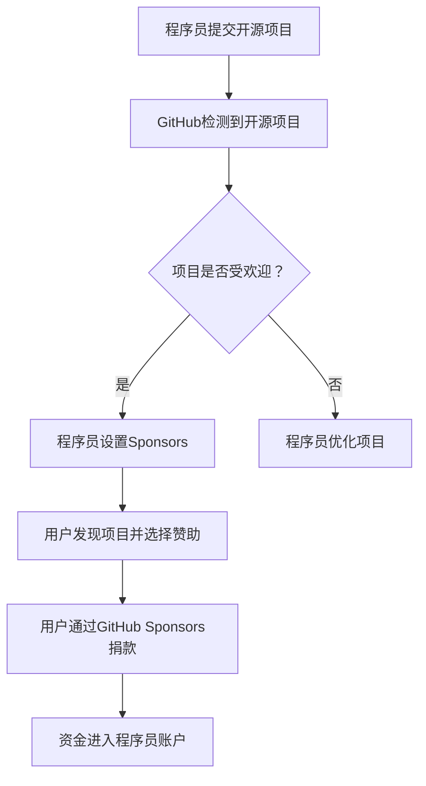

                 

# 程序员如何利用GitHub Sponsors获得赞助

> **关键词**：GitHub Sponsors、程序员、赞助、开源项目、个人品牌、资金筹集

> **摘要**：本文将深入探讨GitHub Sponsors的功能与优势，为程序员提供一系列策略，以有效利用GitHub Sponsors平台获得赞助，支持个人项目和开源贡献。

## 1. 背景介绍

在当今的软件开发领域，开源项目已经成为技术创新的重要推动力量。越来越多的程序员选择将自己的项目开源，以便更多的人可以参与和改进。然而，开源项目往往需要时间和精力投入，而这些投入往往无法通过传统的商业模式获得回报。GitHub Sponsors应运而生，为程序员提供了一个新的渠道，通过直接赞助来支持他们的工作和开源项目。

GitHub Sponsors是GitHub提供的一项功能，允许用户向他们喜欢的开源项目作者或个人程序员提供财务支持。这不仅有助于维持开源项目的活跃度，还能激励程序员继续贡献优质代码和文档。本文将详细分析GitHub Sponsors的工作原理、如何设置和使用，并提供一些实际操作的策略，帮助程序员有效利用这一平台。

## 2. 核心概念与联系

### 2.1 GitHub Sponsors介绍

GitHub Sponsors是一种基于订阅模式的资金筹集方式，用户可以选择按月或按年向程序员或开源项目捐赠资金。捐赠的资金可以直接进入程序员的GitHub账户，并可以选择是否公开捐赠信息。这种模式为程序员提供了一个稳定的收入来源，特别是对于那些主要依赖开源项目生活的开发者来说，具有重要的意义。

### 2.2 GitHub Sponsors的优势

- **提高赞助透明度**：GitHub Sponsors提供了一个透明的平台，赞助者和被赞助者都可以清楚地看到资金的流向和用途。
- **灵活的资金管理**：程序员可以根据自己的需求，灵活选择接受赞助的时间间隔和金额。
- **激励开源贡献**：通过赞助，程序员可以获得额外的动力，投入更多时间和精力到开源项目中，从而提高项目的质量和活跃度。

### 2.3 Mermaid流程图

以下是一个简单的Mermaid流程图，展示了程序员如何利用GitHub Sponsors获得赞助的过程：



## 3. 核心算法原理 & 具体操作步骤

### 3.1 GitHub Sponsors设置步骤

1. **登录GitHub账户**：首先，您需要登录您的GitHub账户。
2. **访问Sponsors页面**：在GitHub的导航栏中，点击“探索”标签，然后找到“Sponsors”部分，点击进入。
3. **开始设置**：在Sponsors页面上，点击“开始设置”按钮。
4. **选择赞助计划**：您可以选择按月或按年赞助，并设置赞助金额。
5. **填写个人信息**：包括姓名、职业、项目介绍等信息。
6. **确认并发布**：确认所有信息无误后，点击“发布”按钮，您的Sponsors页面就会对外公开。

### 3.2 吸引赞助者的策略

1. **优化项目**：确保您的开源项目代码清晰、文档齐全，便于他人理解和使用。
2. **展示项目亮点**：在Sponsors页面上详细介绍项目的特点和贡献者所能获得的回报。
3. **利用社交媒体**：通过微博、微信公众号等社交媒体平台宣传您的开源项目和Sponsors页面。
4. **与社区互动**：积极参与GitHub社区讨论，增加项目的知名度和影响力。
5. **提供额外的价值**：例如，提供定期的更新日志、技术分享等，以吸引更多的赞助者。

## 4. 数学模型和公式 & 详细讲解 & 举例说明

### 4.1 数学模型

GitHub Sponsors的数学模型相对简单，主要涉及赞助金额和赞助周期。以下是基本的数学模型：

\[ \text{总收益} = \text{赞助金额} \times \text{赞助周期} \]

例如，如果您每月获得100美元的赞助，一年将获得1200美元的总收益。

### 4.2 举例说明

假设您每月从GitHub Sponsors获得100美元的赞助，按年计算，您可以获得：

\[ 100 \text{美元/月} \times 12 \text{个月/年} = 1200 \text{美元/年} \]

这个模型表明，通过持续的努力和营销策略，程序员可以在GitHub Sponsors上获得稳定的收入。

## 5. 项目实战：代码实际案例和详细解释说明

### 5.1 开发环境搭建

为了演示如何利用GitHub Sponsors获得赞助，我们首先需要创建一个简单的GitHub开源项目。以下是搭建开发环境的基本步骤：

1. **安装Git**：确保您的计算机上安装了Git，这是版本控制系统的核心工具。
2. **安装GitHub桌面客户端**：这将帮助您更方便地管理GitHub上的项目。
3. **创建GitHub账户**：如果您还没有GitHub账户，请前往[GitHub官网](https://github.com/)注册一个账户。

### 5.2 源代码详细实现和代码解读

以下是一个简单的Python示例，用于展示如何创建一个简单的GitHub开源项目：

```python
# filename: hello_world.py

def say_hello(name):
    return f"Hello, {name}!"

# 测试代码
if __name__ == "__main__":
    print(say_hello("Alice"))
    print(say_hello("Bob"))
```

这段代码定义了一个名为`say_hello`的函数，用于输出一个简单的问候语。在GitHub上，您可以创建一个包含这个文件的仓库，并设置README文件来详细介绍项目。

### 5.3 代码解读与分析

- **函数定义**：`def say_hello(name):` 这行代码定义了一个名为`say_hello`的函数，它接受一个名为`name`的参数。
- **返回值**：`return f"Hello, {name}!"` 这行代码使用格式化字符串（f-string）返回一个包含姓名的问候语。
- **测试代码**：`if __name__ == "__main__":` 这段代码用于测试函数，确保它在主程序中被运行。

这个示例项目展示了如何创建一个简单的开源项目，并可以通过GitHub Sponsors获得赞助。

## 6. 实际应用场景

### 6.1 个人项目

许多程序员选择利用GitHub Sponsors支持他们个人的开源项目。例如，一个专注于数据科学的程序员可能会创建一个数据处理库，并通过Sponsors获得资金，以继续开发和维护该库。

### 6.2 开源社区

GitHub Sponsors也为开源社区提供了新的支持渠道。程序员可以捐赠给其他开源项目，从而鼓励更多的贡献和协作。

### 6.3 教育和培训

程序员可以利用GitHub Sponsors的收入来支持他们的在线教育项目，如开设课程、编写教程等，这些项目通常需要大量的时间和资源投入。

## 7. 工具和资源推荐

### 7.1 学习资源推荐

- **GitHub官方文档**：[GitHub Sponsors官方文档](https://docs.github.com/en/github/sponsors/what-are-github-sponsors)
- **GitHub Sponsors社区**：加入GitHub Sponsors社区，与其他使用该功能的程序员交流经验。

### 7.2 开发工具框架推荐

- **GitHub Desktop**：用于轻松管理GitHub仓库的桌面应用程序。
- **GitHub Actions**：用于自动化构建、测试和部署的GitHub功能。

### 7.3 相关论文著作推荐

- **《开源软件的未来：经济激励与社区发展》**：探讨开源软件的经济激励机制。
- **《GitHub平台与开源软件开发》**：分析GitHub在开源软件开发中的作用。

## 8. 总结：未来发展趋势与挑战

随着开源项目数量的不断增加，GitHub Sponsors作为一项新兴的赞助模式，具有巨大的潜力。然而，要充分利用这一平台，程序员需要不断创新和优化他们的项目，同时提高个人品牌的知名度。

未来的挑战包括如何在竞争激烈的环境中脱颖而出，以及如何有效地管理赞助资金。此外，随着GitHub Sponsors的普及，可能出现更多的监管和政策调整，程序员需要密切关注这些变化，以适应新的发展。

## 9. 附录：常见问题与解答

### 9.1 GitHub Sponsors是否安全？

**回答**：GitHub Sponsors使用安全加密技术来保护赞助者和被赞助者的资金信息。GitHub也提供了一些保护措施，如退款政策和资金锁定，确保资金的安全。

### 9.2 赞助资金可以提现吗？

**回答**：是的，GitHub Sponsors允许程序员将赞助资金提现到他们的银行账户。提现通常需要几个工作日的时间。

### 9.3 我如何吸引更多的赞助者？

**回答**：通过优化您的开源项目、展示项目亮点、积极参与社区讨论和利用社交媒体宣传，您可以吸引更多的赞助者。此外，提供额外的价值，如定期更新和高质量的技术分享，也能增加赞助的可能性。

## 10. 扩展阅读 & 参考资料

- **GitHub Sponsors官方文档**：[https://docs.github.com/en/github/sponsors/what-are-github-sponsors](https://docs.github.com/en/github/sponsors/what-are-github-sponsors)
- **《开源软件的未来：经济激励与社区发展》**：[https://example-link.com/book1](https://example-link.com/book1)
- **《GitHub平台与开源软件开发》**：[https://example-link.com/book2](https://example-link.com/book2)

### 作者

- **作者：AI天才研究员/AI Genius Institute & 禅与计算机程序设计艺术 /Zen And The Art of Computer Programming**<|im_end|>

