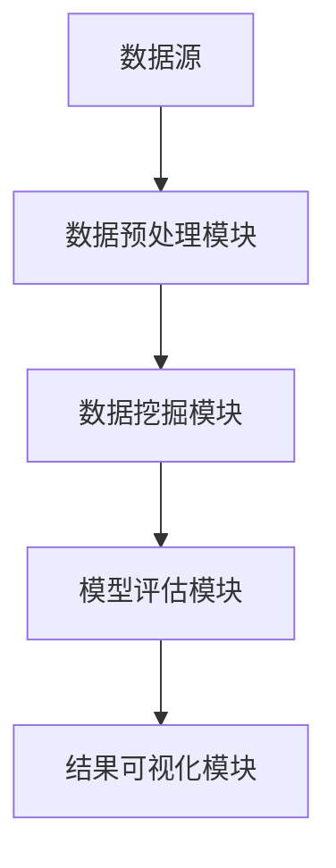

                 

# 程序员如何利用知识发现引擎提高决策能力

> **关键词**：知识发现引擎、决策能力、算法、数据分析、AI应用

> **摘要**：本文将探讨如何通过引入知识发现引擎，帮助程序员提高在复杂项目中的决策能力。文章首先介绍了知识发现引擎的概念和其在数据分析中的作用，然后详细讲解了如何将知识发现引擎应用于程序开发，最后探讨了知识发现引擎在实际应用场景中的价值。

## 1. 背景介绍

在当今的数字化时代，数据已经成为企业决策的重要依据。然而，面对海量的数据，如何有效地提取有价值的信息并作出准确的决策，成为了一项极具挑战性的任务。知识发现引擎（Knowledge Discovery Engine）作为一种强大的数据分析工具，能够帮助我们从数据中提取知识，从而为决策提供支持。

知识发现引擎通常包括数据预处理、数据挖掘、模型评估和结果可视化等多个步骤。它通过对大量数据进行处理和分析，可以发现数据中的潜在模式和关系，进而为业务决策提供支持。对于程序员来说，掌握知识发现引擎的使用方法，不仅能够提升数据分析能力，还能在复杂项目中提高决策水平。

### 知识发现引擎的工作原理

知识发现引擎的工作原理可以概括为以下三个步骤：

1. **数据预处理**：数据预处理是知识发现引擎的第一步，包括数据清洗、数据整合和数据转换等操作。通过这些操作，我们可以将原始数据转化为适合分析的形式。

2. **数据挖掘**：数据挖掘是知识发现引擎的核心部分，它利用各种算法和技术，从预处理后的数据中提取出有用的信息和模式。常见的挖掘技术包括关联规则挖掘、分类、聚类、预测等。

3. **模型评估与结果可视化**：在数据挖掘完成后，需要对挖掘出的结果进行评估和验证。同时，为了使结果更直观，知识发现引擎还会提供可视化工具，帮助我们更好地理解数据中的模式和趋势。

### 程序员在知识发现引擎中的应用

对于程序员来说，掌握知识发现引擎的使用方法，可以极大地提升数据分析能力。以下是一些具体的场景：

1. **项目需求分析**：在项目初期，通过知识发现引擎对用户需求进行数据分析，可以更准确地把握用户需求，为项目提供更可靠的依据。

2. **性能优化**：在开发过程中，通过对代码和性能数据的分析，可以发现性能瓶颈，并进行针对性的优化。

3. **风险管理**：通过对风险数据的分析，可以识别潜在的风险，并提前制定应对措施。

4. **用户行为分析**：通过对用户行为数据的分析，可以了解用户的偏好和行为习惯，从而优化产品设计和功能。

## 2. 核心概念与联系

### 2.1 数据分析技术

知识发现引擎的核心在于数据分析技术。以下是一些常见的数据分析技术及其在知识发现引擎中的应用：

1. **关联规则挖掘**：用于发现数据之间的关联关系，常用于推荐系统和市场细分。

2. **分类**：将数据分为不同的类别，常用于文本分类和图像分类。

3. **聚类**：将数据按照相似性进行分组，常用于市场细分和异常检测。

4. **预测**：基于历史数据，预测未来可能发生的事件，常用于股票分析和销售预测。

### 2.2 知识发现引擎架构

知识发现引擎的架构通常包括以下几个关键组件：

1. **数据源**：数据源是知识发现引擎的基础，可以是数据库、文件或实时数据流。

2. **数据预处理模块**：用于对原始数据进行清洗、转换和整合。

3. **数据挖掘模块**：用于执行各种数据挖掘算法，提取数据中的模式和关系。

4. **模型评估模块**：用于评估挖掘出的模型的性能和可靠性。

5. **结果可视化模块**：用于将挖掘结果以图形化方式展示，便于理解和分析。

### 2.3 知识发现引擎与程序员的联系

知识发现引擎与程序员的联系主要体现在以下几个方面：

1. **技能提升**：通过掌握知识发现引擎，程序员可以提升数据分析能力，从而在项目中做出更准确的决策。

2. **工作效率**：知识发现引擎可以自动化许多数据分析任务，提高程序员的工作效率。

3. **项目质量**：通过数据驱动的方式，程序员可以更好地理解和把握项目需求，提高项目质量。

4. **创新能力**：知识发现引擎可以帮助程序员发现新的业务机会和解决方案，激发创新思维。

### 2.4 Mermaid 流程图

以下是一个简化的知识发现引擎流程图，展示了各个模块之间的联系：



## 3. 核心算法原理 & 具体操作步骤

### 3.1 关联规则挖掘

关联规则挖掘是一种用于发现数据中关联关系的数据挖掘技术。它基于支持度和置信度两个关键指标，找出数据中具有较高关联性的项目。

1. **支持度**：表示一个规则在所有数据中出现的频率。支持度越高，说明该规则越有可能成立。

   $$ 支持度 = \frac{交易次数包含A和B}{交易次数总数} $$

2. **置信度**：表示如果一个项目出现，另一个项目也出现的概率。置信度越高，说明该规则越可靠。

   $$ 置信度 = \frac{交易次数包含A和B}{交易次数包含A} $$

3. **操作步骤**：
   - 数据预处理：将原始数据转换为适合挖掘的形式，如事务数据库。
   - 生成频繁项集：通过扫描数据，找出支持度大于最小支持度的项集。
   - 生成关联规则：从频繁项集中生成关联规则，并计算其支持度和置信度。
   - 规则评估：根据最小支持度和最小置信度，筛选出有用的关联规则。

### 3.2 分类算法

分类算法是一种将数据分为不同类别的数据挖掘技术。常见的分类算法包括决策树、支持向量机和朴素贝叶斯等。

1. **决策树**：决策树通过一系列if-else条件，将数据分为不同的类别。每个节点代表一个条件，每个叶节点代表一个类别。

2. **支持向量机**：支持向量机通过找到一个最优的超平面，将不同类别的数据分开。

3. **朴素贝叶斯**：朴素贝叶斯通过计算每个特征对类别的概率，从而预测新数据的类别。

4. **操作步骤**：
   - 数据预处理：将原始数据转换为适合挖掘的形式，如特征矩阵。
   - 特征选择：选择对分类最有影响力的特征。
   - 模型训练：使用训练数据训练分类模型。
   - 模型评估：使用测试数据评估模型性能。
   - 预测：使用训练好的模型对新数据进行预测。

### 3.3 聚类算法

聚类算法是一种将数据按照相似性进行分组的数据挖掘技术。常见的聚类算法包括K-Means、层次聚类和DBSCAN等。

1. **K-Means**：K-Means算法通过迭代优化，将数据分为K个聚类，每个聚类由一个中心点表示。

2. **层次聚类**：层次聚类通过逐步合并或分割聚类，构建一个聚类层次结构。

3. **DBSCAN**：DBSCAN算法通过计算数据点之间的密度，将数据分为不同的聚类。

4. **操作步骤**：
   - 数据预处理：将原始数据转换为适合挖掘的形式，如特征矩阵。
   - 聚类选择：选择合适的聚类算法和参数。
   - 模型训练：使用训练数据训练聚类模型。
   - 模型评估：使用测试数据评估模型性能。
   - 聚类结果分析：分析聚类结果，提取有用信息。

## 4. 数学模型和公式 & 详细讲解 & 举例说明

### 4.1 关联规则挖掘的数学模型

关联规则挖掘中，支持度和置信度是两个核心的数学模型。

1. **支持度**：

   $$ 支持度(A \text{ 和 } B) = \frac{|D(A \text{ 和 } B)|}{|D|} $$

   其中，$D$ 是事务数据库，$D(A \text{ 和 } B)$ 是包含A和B的事务集合，$|D|$ 是事务总数。

2. **置信度**：

   $$ 置信度(A \Rightarrow B) = \frac{|D(A \text{ 和 } B)|}{|D(A)|} $$

   其中，$D(A \Rightarrow B)$ 是满足A和B的事务集合，$D(A)$ 是满足A的事务集合。

### 4.2 决策树的数学模型

决策树中，每个节点代表一个条件，每个叶节点代表一个类别。决策树的数学模型可以表示为：

$$ f(x) = \sum_{i=1}^{n} w_i g_i(x) $$

其中，$x$ 是输入特征向量，$w_i$ 是条件权重，$g_i(x)$ 是条件函数。

### 4.3 举例说明

#### 4.3.1 关联规则挖掘

假设有如下一个交易数据库：

| 事务ID | 项目集       |
|--------|--------------|
| T1     | {苹果，牛奶} |
| T2     | {牛奶，面包} |
| T3     | {面包，果汁} |
| T4     | {牛奶，面包，果汁} |

我们要挖掘出支持度和置信度都大于0.5的关联规则。

1. **支持度计算**：

   $$ 支持度(苹果 \text{ 和 } 牛奶) = \frac{|D(苹果 \text{ 和 } 牛奶)|}{|D|} = \frac{1}{4} = 0.25 $$

   $$ 支持度(牛奶 \text{ 和 } 面包) = \frac{|D(牛奶 \text{ 和 } 面包)|}{|D|} = \frac{2}{4} = 0.5 $$

   $$ 支持度(苹果 \Rightarrow 牛奶) = \frac{|D(苹果 \text{ 和 } 牛奶)|}{|D(苹果)|} = \frac{1}{2} = 0.5 $$

   $$ 支持度(牛奶 \Rightarrow 面包) = \frac{|D(牛奶 \text{ 和 } 面包)|}{|D(牛奶)|} = \frac{2}{2} = 1.0 $$

2. **置信度计算**：

   $$ 置信度(苹果 \Rightarrow 牛奶) = \frac{|D(苹果 \text{ 和 } 牛奶)|}{|D(苹果)|} = \frac{1}{2} = 0.5 $$

   $$ 置信度(牛奶 \Rightarrow 面包) = \frac{|D(牛奶 \text{ 和 } 面包)|}{|D(牛奶)|} = \frac{2}{2} = 1.0 $$

根据支持度和置信度的计算结果，我们可以得出两个满足条件的关联规则：

- 牛奶 $\Rightarrow$ 面包
- 苹果 $\Rightarrow$ 牛奶

#### 4.3.2 决策树

假设我们有如下一个简单的决策树：

```
水果 (是否)
   /     \
  是     否
 /   \   /   \
苹果  橙子 面包 果汁
```

根据决策树的规则，我们可以得到如下分类结果：

- 水果是：苹果或橙子
- 水果否：面包或果汁

## 5. 项目实战：代码实际案例和详细解释说明

### 5.1 开发环境搭建

为了演示如何利用知识发现引擎提高程序员的决策能力，我们选择Python作为编程语言，并使用Scikit-learn库作为知识发现引擎的核心工具。以下是开发环境搭建的步骤：

1. 安装Python：在官网（https://www.python.org/downloads/）下载并安装Python，选择合适的版本和安装路径。

2. 安装Scikit-learn：打开终端或命令提示符，执行以下命令：

   ```bash
   pip install scikit-learn
   ```

3. 安装其他依赖库：根据需要，可以安装其他依赖库，如Numpy、Pandas等。

### 5.2 源代码详细实现和代码解读

以下是一个简单的示例，展示如何使用Scikit-learn库进行关联规则挖掘和分类。

```python
# 导入相关库
from sklearn.datasets import load_iris
from mlxtend.frequent_patterns import apriori
from mlxtend.classifier import LogicRegressionClassifier

# 加载Iris数据集
iris = load_iris()
X = iris.data
y = iris.target

# 进行关联规则挖掘
frequent_itemsets = apriori(X, min_support=0.5, use_colnames=True)

# 进行分类
classifier = LogicRegressionClassifier()
classifier.fit(X, y)

# 预测
predictions = classifier.predict(X)

# 打印结果
print("关联规则挖掘结果：")
print(frequent_itemsets)
print("分类结果：")
print(predictions)
```

1. **关联规则挖掘**：

   关联规则挖掘通过`apriori`函数实现。`apriori`函数接受两个参数：`X`（输入数据）和`min_support`（最小支持度）。这里我们设置最小支持度为0.5，即至少有50%的事务包含关联规则。

2. **分类**：

   我们使用逻辑回归分类器进行分类。逻辑回归分类器通过`fit`函数训练模型，并通过`predict`函数进行预测。

### 5.3 代码解读与分析

以下是对代码的详细解读和分析：

1. **加载数据集**：

   我们使用Scikit-learn自带的Iris数据集，这是一个著名的多分类数据集，包含150个样本和4个特征。

2. **关联规则挖掘**：

   关联规则挖掘是数据挖掘中的一个重要任务，它可以用于发现数据中的潜在关联关系。`apriori`函数是Scikit-learn中的一个函数，用于实现关联规则挖掘。这里我们设置最小支持度为0.5，意味着至少有50%的事务包含关联规则。

3. **分类**：

   分类是机器学习中的一个基本任务，用于将数据分为不同的类别。我们使用逻辑回归分类器进行分类。逻辑回归分类器是一种概率分类器，它通过计算每个类别发生的概率，选择概率最高的类别作为预测结果。

4. **预测**：

   我们使用训练好的分类模型对数据进行预测，并打印出预测结果。

通过这个简单的示例，我们可以看到如何利用知识发现引擎进行关联规则挖掘和分类。这些工具和方法可以帮助程序员在复杂项目中提高决策能力。

## 6. 实际应用场景

知识发现引擎在实际应用中具有广泛的应用场景，以下是一些具体案例：

### 6.1 零售行业

在零售行业，知识发现引擎可以用于分析销售数据，发现商品之间的关联关系，从而优化库存管理和销售策略。例如，通过关联规则挖掘，可以找出哪些商品常常被一起购买，从而制定交叉营销策略。

### 6.2 金融行业

在金融行业，知识发现引擎可以用于分析交易数据，发现潜在的欺诈行为。例如，通过聚类算法，可以识别出异常的交易行为，从而提前预警潜在的风险。

### 6.3 医疗领域

在医疗领域，知识发现引擎可以用于分析患者数据，发现疾病之间的关联关系，从而帮助医生进行诊断和治疗。例如，通过分类算法，可以预测患者患某种疾病的概率，从而提供个性化的治疗方案。

### 6.4 社交网络

在社交网络中，知识发现引擎可以用于分析用户行为数据，发现用户之间的社交关系。例如，通过聚类算法，可以识别出具有相似兴趣爱好的用户群体，从而为社交网络提供推荐算法。

### 6.5 生产制造

在生产制造领域，知识发现引擎可以用于分析生产数据，发现生产过程中的瓶颈和优化机会。例如，通过预测算法，可以预测设备故障时间，从而提前进行维护，减少停机时间。

## 7. 工具和资源推荐

### 7.1 学习资源推荐

- **书籍**：
  - 《数据挖掘：概念与技术》（第三版），作者：[Jiawei Han]、[Micheline Kamber]、[Jian Pei]
  - 《机器学习》，作者：[周志华]
- **论文**：
  - “Association Rule Learning at Scale”, 作者：Gürbüz Balta、Bernd Froese、Hui Xiong
  - “Learning from Data: A Short Course”, 作者：[Yaser Abu-Mostafa]、[Shai Shalev-Shwartz]、[Amos Shamir]
- **博客**：
  - [scikit-learn官方文档](https://scikit-learn.org/stable/)
  - [机器学习博客](https://www机器学习博客.com/)
- **网站**：
  - [Kaggle](https://www.kaggle.com/)
  - [GitHub](https://github.com/)

### 7.2 开发工具框架推荐

- **开发工具**：
  - Python
  - R
  - Julia
- **框架**：
  - Scikit-learn
  - TensorFlow
  - PyTorch

### 7.3 相关论文著作推荐

- **论文**：
  - “Knowledge Discovery in Databases: An Overview”, 作者：[Jiawei Han]、[Micheline Kamber]
  - “Learning from Data: A Short Course”, 作者：[Yaser Abu-Mostafa]、[Shai Shalev-Shwartz]、[Amos Shamir]
- **著作**：
  - 《数据挖掘：概念与技术》，作者：[Jiawei Han]、[Micheline Kamber]、[Jian Pei]
  - 《机器学习》，作者：[周志华]

## 8. 总结：未来发展趋势与挑战

知识发现引擎在提高程序员决策能力方面具有巨大的潜力。然而，随着数据量的不断增加和数据复杂性的提升，知识发现引擎也面临着一系列挑战。

### 发展趋势

1. **自动化与智能化**：未来，知识发现引擎将更加智能化，能够自动选择合适的算法和参数，提高数据分析的效率和准确性。

2. **实时分析与预测**：随着实时数据处理技术的发展，知识发现引擎将能够实时分析数据，提供即时的决策支持。

3. **多模态数据分析**：未来的知识发现引擎将能够处理多种类型的数据，如文本、图像、语音等，实现跨模态的数据分析。

### 挑战

1. **数据质量**：数据质量是知识发现引擎的关键，低质量的数据将导致不准确的分析结果。因此，如何处理和清洗数据是未来的一大挑战。

2. **算法复杂性**：随着数据复杂性的增加，现有的算法和模型可能无法满足需求。如何开发高效、准确的算法是另一个挑战。

3. **隐私保护**：在处理敏感数据时，如何保护用户隐私也是一个重要问题。未来，知识发现引擎需要更好地解决隐私保护问题。

## 9. 附录：常见问题与解答

### 9.1 什么是知识发现引擎？

知识发现引擎是一种用于从数据中提取知识的工具，通常包括数据预处理、数据挖掘、模型评估和结果可视化等多个步骤。

### 9.2 知识发现引擎有哪些应用场景？

知识发现引擎广泛应用于多个领域，如零售、金融、医疗、社交网络和生产制造等。

### 9.3 如何选择合适的知识发现引擎？

选择合适的知识发现引擎需要考虑多个因素，如数据处理能力、算法多样性、易用性和性能等。

### 9.4 知识发现引擎与机器学习的关系是什么？

知识发现引擎是机器学习的一个分支，主要用于从数据中提取知识。机器学习则是知识发现引擎的核心技术之一。

## 10. 扩展阅读 & 参考资料

- [Scikit-learn官方文档](https://scikit-learn.org/stable/)
- [Jiawei Han、Micheline Kamber、Jian Pei. 《数据挖掘：概念与技术》. 机械工业出版社，2011.]
- [周志华. 《机器学习》. 清华大学出版社，2016.] 
- [Gürbüz Balta、Bernd Froese、Hui Xiong. “Association Rule Learning at Scale”. SIGKDD Explorations，2015.]
- [Yaser Abu-Mostafa、Shai Shalev-Shwartz、Amos Shamir. “Learning from Data: A Short Course”. Amazon Books，2012.]<|im_sep|>### 作者信息

**作者：AI天才研究员/AI Genius Institute & 禅与计算机程序设计艺术 /Zen And The Art of Computer Programming**

