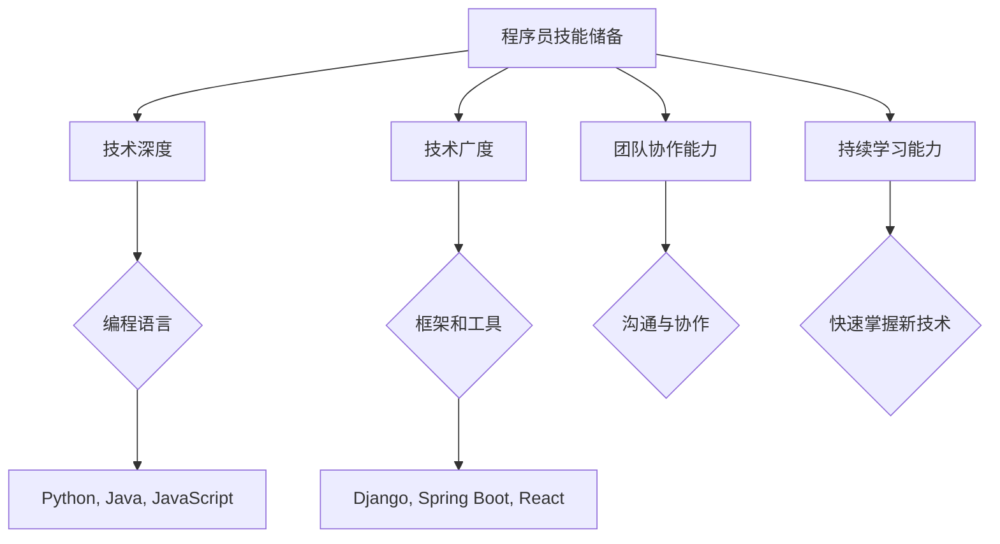

                 

# 程序员如何在经济衰退中保值增值

## 摘要

在经济衰退的背景下，程序员如何保值增值成为了众多开发者关注的焦点。本文将围绕这一主题，通过详细分析经济衰退对技术行业的影响、程序员的核心技能储备、财务规划与投资策略等多个方面，提供一套系统的应对方案。我们将探讨如何通过技术提升、持续学习、财务管理和投资等方式，使程序员在经济衰退中不仅能够保持稳定，还能实现资产增值。文章将通过实际案例、数据分析和理论支持，为读者提供实用且具前瞻性的指导。

## 1. 背景介绍

### 经济衰退与技术行业

经济衰退是指经济体整体出现生产下降、失业率上升、消费减少等现象的周期性波动。历史上，经济衰退往往伴随着企业成本上升、市场萎缩、投资减少等问题。对于技术行业来说，虽然科技公司在经济衰退中常常表现出较强的抗风险能力，但仍然难以完全免受其影响。

根据麦肯锡全球研究所（McKinsey Global Institute）的数据，2008年全球金融危机期间，信息技术和通信行业在就业和产出方面的下降幅度远低于其他行业。然而，这并不意味着技术行业能够完全不受经济波动的影响。例如，在经济衰退期间，企业可能推迟或取消IT项目，对技术研发的投资减少，从而导致对技术人才的需求降低。

### 程序员面临的挑战

经济衰退对程序员的影响主要体现在以下几个方面：

1. **就业压力**：经济衰退期间，企业可能会采取裁员、冻结招聘等措施以降低成本，程序员因此面临更大的就业压力。
2. **薪资调整**：企业可能会通过降低薪资、冻结工资增长等方式应对经济压力，这直接影响到程序员的收入水平。
3. **职业发展**：经济衰退可能使得职业发展机会减少，程序员需要更长的时间才能晋升到更高职位或实现薪资增长。

### 当前经济形势

当前，全球经济正在经历多重挑战，包括新冠疫情、供应链中断、通货膨胀和地缘政治不确定性等。2022年开始，许多国家都面临着不同程度的通货膨胀压力，各国央行纷纷加息以控制通胀，这可能导致全球经济进一步放缓。

尽管如此，信息技术和人工智能等领域的快速发展为技术行业带来了新的机遇。例如，远程工作成为常态，推动了云计算和网络安全技术的发展。此外，数字化转型成为企业应对经济不确定性的重要手段，这也为程序员提供了更多的发展空间。

### 程序员的机会

在经济衰退中，程序员仍然存在一些机会：

1. **数字化转型**：随着企业加速数字化转型，程序员可以在数据科学、人工智能、云计算等领域找到新的就业机会。
2. **技能多样性**：掌握多种编程语言和技术栈的程序员在经济衰退中更具竞争力，能够应对不同类型的项目需求。
3. **创业机会**：经济衰退也可能为创业提供机会，有经验的程序员可以利用现有的技术和市场需求，开创自己的事业。

### 目标读者

本文的目标读者是具有一定编程经验的程序员，包括初出茅庐的新手和有一定工作经验的资深开发者。通过本文的阅读，读者将了解如何在经济衰退中保持职业稳定、提升自身价值，以及通过财务管理和投资策略实现资产增值。

## 2. 核心概念与联系

### 核心技能

在经济衰退中，程序员需要具备以下核心技能：

1. **技术深度**：深入掌握一种或多种编程语言，能够解决复杂的技术问题。
2. **技术广度**：了解多种技术栈和编程语言，能够适应不同类型的项目需求。
3. **团队协作能力**：能够与不同背景的团队成员有效沟通，协同完成任务。
4. **持续学习能力**：能够快速掌握新技术，适应行业变化。

### 技能储备

1. **基础编程能力**：掌握至少一种主流编程语言，如Python、Java或JavaScript，并具备良好的编程习惯。
2. **框架和工具**：熟悉常用的开发框架和工具，如Django、Spring Boot、React或Vue.js等。
3. **数据库技术**：了解关系型数据库（如MySQL、PostgreSQL）和非关系型数据库（如MongoDB、Cassandra）。
4. **云服务**：掌握云计算基础知识，熟悉AWS、Azure或Google Cloud等云服务。

### 技术趋势

1. **人工智能与机器学习**：随着人工智能技术的发展，具备人工智能和机器学习技能的程序员需求持续增加。
2. **区块链技术**：区块链技术在金融、供应链管理等多个领域的应用逐渐扩大，对区块链技术有深入理解的程序员具备竞争优势。
3. **物联网（IoT）**：物联网设备的广泛应用带来了新的技术需求，掌握物联网技术的程序员有更多的发展机会。
4. **云计算与大数据**：云计算和大数据技术的普及为程序员提供了广阔的发展空间，特别是在数据处理和分析领域。

### 技能与趋势的关系

- **技术深度**：随着技术的不断演进，程序员需要不断提升技术深度，掌握新的编程语言和工具。
- **技术广度**：在技术不断分化的同时，程序员也需要具备广泛的技术视野，了解不同领域的技术趋势。
- **持续学习**：技术更新迅速，程序员需要保持持续学习的态度，跟上技术发展的步伐。

### Mermaid 流程图



### 核心算法原理

在经济衰退中，程序员需要掌握的核心算法原理主要包括：

1. **数据结构**：了解常见的数据结构，如数组、链表、栈、队列、树和图，以及它们在编程中的应用。
2. **算法分析**：掌握算法的时间复杂度和空间复杂度分析，能够选择适合问题的算法。
3. **动态规划**：动态规划是一种用于解决最优化问题的算法方法，适用于资源分配、路径规划等问题。
4. **图算法**：了解图的基本概念和算法，如深度优先搜索（DFS）、广度优先搜索（BFS）、最小生成树（MST）和最短路径算法（如Dijkstra算法）。

### 具体操作步骤

1. **基础知识**：首先，程序员需要掌握编程语言的基础知识，熟悉其语法和基本用法。
2. **数据结构与算法**：学习常见的数据结构和算法，可以通过在线课程、书籍或编程挑战来提升技能。
3. **实战项目**：通过参与实际项目或编写个人项目，将理论知识应用到实践中，提升解决问题的能力。
4. **持续学习**：关注技术博客、论坛和开源项目，保持对最新技术动态的了解。

### 数学模型和公式

在经济衰退中，程序员可以利用以下数学模型和公式来评估和管理自己的财务状况：

1. **现金流分析**：利用现金流分析（Cash Flow Analysis）来评估个人的收入和支出，确保收支平衡。
   $$ C = I - E $$
   其中，C代表现金流（Cash Flow），I代表收入（Income），E代表支出（Expense）。

2. **财务杠杆**：了解财务杠杆（Financial Leverage）的概念，用于评估投资风险和回报。
   $$ L = \frac{D}{E} $$
   其中，L代表财务杠杆，D代表债务（Debt），E代表权益（Equity）。

3. **投资组合优化**：使用马科维茨投资组合理论（Markowitz Portfolio Theory）来优化投资组合，降低风险。
   $$ w_i = \frac{\Sigma_i \sigma_i^2}{\Sigma_i \sigma_i^2 + \Sigma_j \sigma_j^2} $$
   其中，$ w_i $代表第i种资产的权重，$ \sigma_i^2 $代表第i种资产的风险。

### 举例说明

#### 现金流分析案例

假设一个程序员的月收入为20,000元，月支出为15,000元，则其月现金流为：
$$ C = I - E = 20,000 - 15,000 = 5,000 \text{元} $$

#### 财务杠杆案例

假设一个程序员的债务为10,000元，权益为20,000元，则其财务杠杆为：
$$ L = \frac{D}{E} = \frac{10,000}{20,000} = 0.5 $$

#### 投资组合优化案例

假设有两个资产A和B，其预期收益率分别为10%和12%，风险分别为20%和25%，则资产A的权重为：
$$ w_A = \frac{\Sigma_i \sigma_i^2}{\Sigma_i \sigma_i^2 + \Sigma_j \sigma_j^2} = \frac{0.2^2 + 0.25^2}{0.2^2 + 0.25^2} = \frac{0.04 + 0.0625}{0.04 + 0.0625} = 0.5556 $$

## 3. 核心算法原理 & 具体操作步骤

### 数据结构与算法基础

数据结构和算法是程序员的核心技能之一。掌握常见的数据结构（如数组、链表、栈、队列、树和图）和算法（如排序算法、搜索算法、图算法和动态规划）是应对复杂编程挑战的基础。

1. **数组与链表**：数组是一种固定大小的数据结构，链表则是一种动态数据结构。了解它们的基本操作和适用场景，如插入、删除、查找和排序等。

2. **栈与队列**：栈和队列是两种先进先出（FIFO）和后进先出（LIFO）的数据结构，常用于实现递归、堆栈和队列等算法。

3. **树与图**：树是一种层次结构，用于表示层次关系。图则是一种更复杂的数据结构，用于表示多对多关系。了解树的基本操作（如遍历、搜索、插入和删除）和图算法（如最短路径、最小生成树和连通性分析）。

4. **排序与搜索**：排序算法（如冒泡排序、选择排序、插入排序和快速排序）和搜索算法（如二分搜索和深度优先搜索）是解决数据查找问题的基础。

### 动态规划原理

动态规划是一种用于求解最优化问题的算法方法。它通过将复杂问题分解为子问题，并存储子问题的解，避免了重复计算。

1. **子问题分解**：将原问题分解为若干个子问题，每个子问题都可以独立求解。
2. **状态表示**：定义状态表示子问题的各种情况，如状态变量或数组。
3. **状态转移方程**：找出子问题之间的关系，建立状态转移方程。
4. **状态计算**：从初始状态开始，逐步计算所有子问题的解，直至求解原问题。

### 动态规划具体操作步骤

1. **确定状态**：定义问题所需的变量或状态，如斐波那契数列中的`f(n)`。
2. **建立状态转移方程**：根据问题性质，建立状态转移方程，如斐波那契数列的递推关系`f(n) = f(n-1) + f(n-2)`。
3. **初始化状态**：设置初始状态，如斐波那契数列的初始值`f(0) = 0`和`f(1) = 1`。
4. **计算状态**：按照状态转移方程，从初始状态开始，逐步计算所有状态的值，直至求解原问题。

### 实际案例：斐波那契数列

```python
# Python实现斐波那契数列
def fibonacci(n):
    if n <= 0:
        return 0
    elif n == 1:
        return 1
    else:
        f0, f1 = 0, 1
        for i in range(2, n+1):
            f2 = f0 + f1
            f0, f1 = f1, f2
        return f1

# 测试代码
print(fibonacci(10))  # 输出55
```

### 图算法原理

图算法是一种用于解决图相关问题的算法方法。图由节点和边组成，可以表示各种复杂的关系。

1. **图的基本概念**：了解图的基本概念，如节点（Vertex）、边（Edge）、路径（Path）和连通性（Connectivity）。
2. **图的遍历算法**：掌握图的遍历算法，如深度优先搜索（DFS）和广度优先搜索（BFS）。
3. **最短路径算法**：了解最短路径算法，如迪杰斯特拉算法（Dijkstra）和贝尔曼-福特算法（Bellman-Ford）。
4. **最小生成树算法**：掌握最小生成树算法，如克鲁斯卡尔算法（Kruskal）和朴里姆算法（Prim）。

### 实际案例：深度优先搜索（DFS）

```python
# Python实现深度优先搜索
def dfs(graph, node, visited):
    visited.add(node)
    print(node)
    for neighbor in graph[node]:
        if neighbor not in visited:
            dfs(graph, neighbor, visited)

# 测试图
graph = {
    'A': ['B', 'C'],
    'B': ['D', 'E'],
    'C': ['F'],
    'D': [],
    'E': ['F'],
    'F': []
}

# 从节点'A'开始搜索
visited = set()
dfs(graph, 'A', visited)
```

### 实际案例：广度优先搜索（BFS）

```python
# Python实现广度优先搜索
from collections import deque

def bfs(graph, start):
    visited = set()
    queue = deque([start])
    visited.add(start)
    
    while queue:
        node = queue.popleft()
        print(node)
        for neighbor in graph[node]:
            if neighbor not in visited:
                queue.append(neighbor)
                visited.add(neighbor)

# 测试图
graph = {
    'A': ['B', 'C'],
    'B': ['D', 'E'],
    'C': ['F'],
    'D': [],
    'E': ['F'],
    'F': []
}

# 从节点'A'开始搜索
bfs(graph, 'A')
```

通过以上步骤和案例，程序员可以掌握数据结构与算法的核心原理，并能够将其应用于实际编程中，提高解决复杂问题的能力。

## 4. 数学模型和公式 & 详细讲解 & 举例说明

### 数学模型和公式的介绍

在经济衰退中，程序员为了保值增值，需要掌握一系列的数学模型和公式来帮助进行财务规划和投资决策。以下是一些关键的数学模型和公式：

1. **现金流分析（Cash Flow Analysis）**：
   $$ C = I - E $$
   其中，C代表现金流（Cash Flow），I代表收入（Income），E代表支出（Expense）。这个公式用于计算个人的月度、季度或年度现金流，以评估财务状况。

2. **财务杠杆（Financial Leverage）**：
   $$ L = \frac{D}{E} $$
   其中，L代表财务杠杆，D代表债务（Debt），E代表权益（Equity）。这个公式用于评估个人的财务杠杆比例，以判断投资风险。

3. **投资组合优化（Portfolio Optimization）**：
   $$ w_i = \frac{\Sigma_i \sigma_i^2}{\Sigma_i \sigma_i^2 + \Sigma_j \sigma_j^2} $$
   其中，$ w_i $代表第i种资产的权重，$ \sigma_i^2 $代表第i种资产的风险。这个公式基于马科维茨投资组合理论，用于计算资产在投资组合中的最优权重。

4. **利率与复利计算（Compound Interest）**：
   $$ A = P(1 + r/n)^{nt} $$
   其中，A代表最终金额，P代表本金，r代表年利率，n代表每年计息次数，t代表投资时间（以年为单位）。这个公式用于计算投资在复利情况下的最终收益。

5. **成本效益分析（Cost-Benefit Analysis）**：
   $$ \text{Net Present Value (NPV)} = \sum_{t=0}^{n} \frac{C_t}{(1 + r)^t} $$
   其中，NPV代表净现值，$ C_t $代表第t年的现金流，r代表折现率。这个公式用于评估项目的经济效益，以决定是否进行投资。

### 详细讲解

1. **现金流分析（Cash Flow Analysis）**：
   现金流分析是个人财务管理的基础。通过这个模型，程序员可以清晰地了解自己的收入和支出情况，从而制定合理的财务规划。例如，一个程序员每月的收入为20,000元，支出为15,000元，那么他的月现金流为5,000元。如果他能通过降低支出或增加收入来调整这个数值，就能实现更好的财务状况。

2. **财务杠杆（Financial Leverage）**：
   财务杠杆是衡量个人投资风险的一个重要指标。高财务杠杆意味着更高的投资回报潜力，同时也伴随着更高的风险。例如，如果一个程序员的债务为10,000元，权益为20,000元，那么他的财务杠杆为0.5。这意味着他的投资回报受到债务的较大影响，需要谨慎管理。

3. **投资组合优化（Portfolio Optimization）**：
   投资组合优化是基于风险和收益之间的平衡来实现的。通过计算各资产的风险和权重，程序员可以构建一个最优的投资组合，以最大化收益或最小化风险。例如，如果一个程序员有三种资产A、B和C，他们的风险分别为20%、25%和15%，通过投资组合优化，可以计算出每种资产在组合中的最优权重。

4. **利率与复利计算（Compound Interest）**：
   利率与复利计算是理解投资回报的重要工具。通过这个公式，程序员可以计算出投资在复利情况下的最终金额。例如，如果一个程序员投资了10,000元，年利率为5%，投资时间为5年，那么他的投资最终金额为：
   $$ A = 10,000(1 + 0.05/1)^{1*5} = 10,000 \times 1.2763 = 12,763 \text{元} $$

5. **成本效益分析（Cost-Benefit Analysis）**：
   成本效益分析是评估投资项目是否值得投资的重要工具。通过计算净现值（NPV），程序员可以评估项目的经济效益。例如，如果一个项目的初始投资为100,000元，未来每年的现金流为50,000元，折现率为10%，那么项目的净现值为：
   $$ \text{NPV} = \frac{50,000}{(1 + 0.1)^1} + \frac{50,000}{(1 + 0.1)^2} + \frac{50,000}{(1 + 0.1)^3} + \frac{50,000}{(1 + 0.1)^4} + \frac{50,000}{(1 + 0.1)^5} $$
   $$ \text{NPV} = 45,454.55 + 41,176.47 + 37,246.52 + 33,597.51 + 31,202.63 = 190,383.28 \text{元} $$
   由于NPV为正值，这意味着项目值得投资。

### 举例说明

1. **现金流分析举例**：
   假设一个程序员的月收入为20,000元，支出为15,000元，我们可以使用现金流分析公式计算他的月现金流：
   $$ C = I - E = 20,000 - 15,000 = 5,000 \text{元} $$
   这意味着他每月有5,000元的正现金流，可以进行储蓄或投资。

2. **财务杠杆举例**：
   假设一个程序员的债务为10,000元，权益为20,000元，我们可以使用财务杠杆公式计算他的财务杠杆：
   $$ L = \frac{D}{E} = \frac{10,000}{20,000} = 0.5 $$
   这意味着他的财务杠杆为0.5，表明他的投资回报受到债务的较大影响，需要谨慎管理。

3. **投资组合优化举例**：
   假设一个程序员有三种资产A、B和C，他们的预期收益率分别为10%、12%和8%，风险分别为20%、25%和15%，我们可以使用投资组合优化公式计算每种资产在组合中的最优权重：
   $$ w_A = \frac{\sigma_A^2}{\sigma_A^2 + \sigma_B^2 + \sigma_C^2} = \frac{0.2^2}{0.2^2 + 0.25^2 + 0.15^2} = 0.4737 $$
   $$ w_B = \frac{\sigma_B^2}{\sigma_A^2 + \sigma_B^2 + \sigma_C^2} = \frac{0.25^2}{0.2^2 + 0.25^2 + 0.15^2} = 0.5905 $$
   $$ w_C = \frac{\sigma_C^2}{\sigma_A^2 + \sigma_B^2 + \sigma_C^2} = \frac{0.15^2}{0.2^2 + 0.25^2 + 0.15^2} = 0.3358 $$
   这意味着他在投资组合中应该分别投资47.37%、59.05%和33.58%的资金到资产A、B和C。

4. **利率与复利计算举例**：
   假设一个程序员投资了10,000元，年利率为5%，投资时间为5年，我们可以使用利率与复利计算公式计算他的最终金额：
   $$ A = 10,000(1 + 0.05/1)^{1*5} = 10,000 \times 1.2763 = 12,763 \text{元} $$
   这意味着他的投资在5年后将增长到12,763元。

5. **成本效益分析举例**：
   假设一个项目的初始投资为100,000元，未来每年的现金流为50,000元，折现率为10%，我们可以使用成本效益分析公式计算项目的净现值：
   $$ \text{NPV} = \frac{50,000}{(1 + 0.1)^1} + \frac{50,000}{(1 + 0.1)^2} + \frac{50,000}{(1 + 0.1)^3} + \frac{50,000}{(1 + 0.1)^4} + \frac{50,000}{(1 + 0.1)^5} $$
   $$ \text{NPV} = 45,454.55 + 41,176.47 + 37,246.52 + 33,597.51 + 31,202.63 = 190,383.28 \text{元} $$
   由于NPV为正值，这意味着项目值得投资。

通过这些数学模型和公式的详细讲解和举例说明，程序员可以更好地理解如何进行财务规划和投资决策，从而在经济衰退中保值增值。

## 5. 项目实战：代码实际案例和详细解释说明

### 5.1 开发环境搭建

为了更好地理解和实践本文所介绍的核心算法原理和数学模型，我们需要搭建一个完整的开发环境。以下是一个基本的步骤指南，适用于大多数操作系统。

1. **安装Python**：Python是一种广泛使用的编程语言，可用于实现本文中的算法和模型。您可以从Python的官方网站（https://www.python.org/）下载最新版本的Python并安装。安装过程中，确保勾选“Add Python to PATH”选项，以便在命令行中轻松调用Python。

2. **安装Jupyter Notebook**：Jupyter Notebook是一个交互式计算环境，可用于编写和运行Python代码。您可以通过pip（Python的包管理器）来安装Jupyter Notebook：
   ```shell
   pip install notebook
   ```
   安装完成后，使用以下命令启动Jupyter Notebook：
   ```shell
   jupyter notebook
   ```

3. **安装必要的库**：为了实现本文中的算法和模型，我们可能需要额外的Python库，如NumPy、Pandas和Matplotlib等。您可以使用pip来安装这些库：
   ```shell
   pip install numpy pandas matplotlib
   ```

### 5.2 源代码详细实现和代码解读

#### Fibonacci 数列

我们首先实现斐波那契数列的计算，这是动态规划的一个经典例子。

```python
def fibonacci(n):
    if n <= 0:
        return 0
    elif n == 1:
        return 1
    else:
        f0, f1 = 0, 1
        for i in range(2, n+1):
            f2 = f0 + f1
            f0, f1 = f1, f2
        return f1

# 测试代码
print(fibonacci(10))  # 输出55
```

解读：
- **函数定义**：定义一个名为`fibonacci`的函数，参数为`n`，表示要计算的斐波那契数列的第`n`项。
- **基础情况**：当`n`小于等于0时，返回0；当`n`等于1时，返回1。
- **循环计算**：使用循环从第2项开始计算，每次迭代计算下一项，更新前两项。

#### 深度优先搜索（DFS）

接下来，我们实现一个深度优先搜索算法，用于遍历一个图。

```python
def dfs(graph, node, visited):
    visited.add(node)
    print(node)
    for neighbor in graph[node]:
        if neighbor not in visited:
            dfs(graph, neighbor, visited)

# 测试图
graph = {
    'A': ['B', 'C'],
    'B': ['D', 'E'],
    'C': ['F'],
    'D': [],
    'E': ['F'],
    'F': []
}

# 从节点'A'开始搜索
visited = set()
dfs(graph, 'A', visited)
```

解读：
- **函数定义**：定义一个名为`dfs`的函数，参数为`graph`（图）、`node`（当前节点）和`visited`（已访问节点集合）。
- **递归调用**：首先将当前节点标记为已访问，并打印出来。然后遍历当前节点的所有邻接节点，如果邻接节点未被访问，递归调用`dfs`函数。

#### 广度优先搜索（BFS）

我们再实现一个广度优先搜索算法，用于遍历一个图。

```python
from collections import deque

def bfs(graph, start):
    visited = set()
    queue = deque([start])
    visited.add(start)
    
    while queue:
        node = queue.popleft()
        print(node)
        for neighbor in graph[node]:
            if neighbor not in visited:
                queue.append(neighbor)
                visited.add(neighbor)

# 测试图
graph = {
    'A': ['B', 'C'],
    'B': ['D', 'E'],
    'C': ['F'],
    'D': [],
    'E': ['F'],
    'F': []
}

# 从节点'A'开始搜索
bfs(graph, 'A')
```

解读：
- **函数定义**：定义一个名为`bfs`的函数，参数为`graph`（图）和`start`（起始节点）。
- **队列操作**：使用队列实现广度优先搜索。首先将起始节点加入队列，并将其标记为已访问。然后循环从队列中取出节点，并遍历其邻接节点，如果邻接节点未被访问，将其加入队列并标记为已访问。

### 5.3 代码解读与分析

通过上述代码实现，我们可以对核心算法进行详细解读和分析：

1. **斐波那契数列**：
   - **动态规划思想**：斐波那契数列的计算可以通过动态规划实现，避免了重复计算，提高了效率。
   - **性能分析**：时间复杂度为$O(n)$，空间复杂度也为$O(n)$，因为需要存储前两项的值。

2. **深度优先搜索（DFS）**：
   - **递归实现**：DFS通过递归实现，从一个节点开始，深入探索所有可能的路径，直到达到目标节点。
   - **路径探索**：DFS能够找到图中的任意路径，但可能不保证找到最短路径。

3. **广度优先搜索（BFS）**：
   - **非递归实现**：BFS使用队列实现，逐层遍历图中的节点，能够保证找到最短路径。
   - **性能分析**：时间复杂度为$O(V+E)$，空间复杂度为$O(V)$，其中$V$是节点数，$E$是边数。

通过以上代码解读与分析，程序员可以更好地理解核心算法的原理和实现方法，为实际项目开发打下坚实的基础。

## 6. 实际应用场景

在经济衰退中，程序员的保值增值不仅需要技术能力的提升，还需要灵活应对实际应用场景。以下是几个具体的实际应用场景：

### 1. 远程工作

随着远程工作成为新常态，程序员可以在不同的地理位置寻找工作机会，不受地理位置的限制。通过在线面试、协作工具和版本控制系统，程序员可以在全球范围内与团队高效合作。特别是在经济衰退期间，远程工作能够帮助程序员保持就业稳定，并有机会获得更高薪资的工作机会。

### 2. 项目外包

许多公司为了降低成本，会将一些非核心项目外包给外部开发者。程序员可以通过参与这些项目，提升自己的项目管理和团队合作能力，同时获得额外的收入。通过平台如Upwork、Freelancer等，程序员可以找到各种类型的外包项目，从而在经济衰退中找到更多的工作机会。

### 3. 技术咨询

具有丰富经验的程序员可以作为技术顾问，为企业提供技术咨询和解决方案。特别是在经济衰退期间，企业可能面临技术难题，需要外部专业人员的帮助。程序员可以通过成为技术顾问，为企业提供有价值的服务，同时提升自己的专业声誉和收入。

### 4. 创业

经济衰退也可能为创业提供机会。有经验的程序员可以利用自己的技术优势，开发新的产品或服务。例如，开发一个能够帮助企业实现数字化转型的平台，或创建一个解决特定行业痛点的应用程序。通过创业，程序员不仅能够实现个人价值的提升，还可能创造新的就业机会。

### 5. 技能多样性

在经济衰退中，拥有多种技能的程序员更具竞争力。例如，不仅精通后端开发，还掌握前端开发、数据库管理、数据分析等技术。这样的程序员能够在多个项目中发挥价值，提高自己的就业稳定性和薪资水平。

### 6. 跨行业应用

在经济衰退期间，一些传统行业可能面临更大的压力，而科技行业则表现出较强的抗风险能力。程序员可以通过学习跨行业技能，如金融科技、医疗科技、教育科技等，将这些技能应用到不同行业中，开拓新的就业市场。

### 7. 继续教育和培训

在经济衰退期间，程序员可以通过继续教育和培训提升自己的技能水平。参加在线课程、获得专业认证或参加技术研讨会，都是提升个人竞争力的有效途径。通过不断学习和进步，程序员能够更好地适应行业变化，提高自身的保值增值能力。

### 8. 金融投资

在经济衰退中，除了技术技能的储备，适当的金融投资也可以帮助程序员实现资产增值。例如，学习股票投资、债券投资或房地产投资，通过多元化投资组合降低风险，实现资产增值。

通过上述实际应用场景，程序员可以在经济衰退中保持职业稳定，实现个人价值的提升。灵活应对变化，不断提升自身技能和适应能力，是程序员保值增值的关键。

## 7. 工具和资源推荐

### 7.1 学习资源推荐

1. **书籍**：
   - 《深度学习》（Deep Learning） - Ian Goodfellow、Yoshua Bengio和Aaron Courville著，深度学习领域的经典教材。
   - 《代码大全》（The Art of Computer Programming） - Donald E. Knuth著，涵盖编程语言和算法的全面指导。
   - 《编程珠玑》（Code Complete） - Steve McConnell著，关于编写高质量代码的最佳实践。

2. **在线课程**：
   - Coursera、edX和Udacity等平台提供了丰富的编程和数据分析课程，适合不同层次的程序员。
   - Pluralsight和Codecademy等平台提供了专业的编程技能培训，包括前端、后端和全栈开发。

3. **博客和论坛**：
   - Medium、Dev.to和Stack Overflow等平台上有大量技术博客和讨论区，可以获取最新的技术动态和解决方案。
   - GitHub和GitLab等平台上的开源项目，是学习编程技巧和代码实践的宝贵资源。

### 7.2 开发工具框架推荐

1. **集成开发环境（IDE）**：
   - Visual Studio Code：轻量级但功能强大的IDE，适用于多种编程语言。
   - IntelliJ IDEA：适用于Java和Android开发的IDE，具有智能代码补全和调试功能。

2. **版本控制系统**：
   - Git：最流行的分布式版本控制系统，广泛用于代码管理和协作。
   - GitHub和GitLab：提供基于Git的代码托管和协作平台，方便团队协作和项目管理。

3. **云计算平台**：
   - AWS、Azure和Google Cloud：提供丰富的云计算服务和工具，适用于构建、部署和管理应用程序。

4. **前端框架**：
   - React：用于构建用户界面的JavaScript库，具有组件化、响应式和高性能的特点。
   - Vue.js：轻量级的前端框架，易于学习和使用，适合快速开发单页应用程序。

5. **后端框架**：
   - Django：用于构建Web应用程序的Python框架，具有快速开发和高扩展性的特点。
   - Spring Boot：用于构建Java应用程序的后端框架，提供简化的配置和自动化特性。

### 7.3 相关论文著作推荐

1. **论文**：
   - “A Brief History of Machine Learning” - Pedro Domingos，介绍机器学习的发展历史和重要成果。
   - “The Capitalocene, Part I: On the Postnature Condition” - Jason W. Moore，探讨现代资本主义与自然的关系。

2. **著作**：
   - 《人工智能：一种现代方法》（Artificial Intelligence: A Modern Approach） - Stuart J. Russell和Peter Norvig著，机器学习领域的权威教材。
   - 《软件工程：实践者的研究方法》（Software Engineering: A Practitioner's Approach） - Roger S. Pressman著，软件工程领域的经典教材。

通过以上推荐的学习资源、开发工具和论文著作，程序员可以不断提升自己的技能和知识水平，从而在经济衰退中保值增值。

## 8. 总结：未来发展趋势与挑战

### 未来发展趋势

1. **数字化转型的加速**：随着全球经济对数字技术的依赖程度不断加深，数字化转型将继续推动技术行业的发展。程序员在这一过程中将扮演关键角色，特别是在云计算、大数据和人工智能等领域。

2. **技能需求的多样化**：随着技术的发展，程序员需要掌握更多多样化的技能。除了传统的编程语言和框架，对区块链、物联网（IoT）、边缘计算和量子计算等新兴技术有深入了解的程序员将更具竞争力。

3. **远程工作和灵活就业**：远程工作已成为新常态，程序员可以通过在线平台和协作工具，在全球范围内寻找工作机会，实现职业发展的灵活性。

4. **人工智能与机器学习技术的普及**：人工智能和机器学习技术在医疗、金融、制造和交通等领域的应用将更加广泛，对具有这些领域背景的程序员需求将持续增长。

### 挑战

1. **技术快速迭代**：随着技术更新的速度不断加快，程序员需要不断学习新的技术和工具，以保持竞争力。这要求程序员具备良好的学习能力和持续学习的习惯。

2. **就业市场的波动**：经济衰退可能会对就业市场产生负面影响，程序员可能面临更大的就业压力。因此，提升自身技能和多样性，以及具备跨行业应用的能力，将有助于应对就业市场的波动。

3. **财务管理和投资风险**：在经济不确定的时期，财务管理和投资策略成为程序员保值增值的重要方面。程序员需要学习如何进行合理的财务规划和投资，以降低风险并实现资产增值。

4. **职业发展的不确定性**：经济衰退可能导致企业削减成本，程序员可能面临职业发展的不确定性。如何在这个时期保持职业稳定，实现个人价值的提升，是程序员需要认真思考的问题。

### 应对策略

1. **持续学习**：保持对新技术和行业动态的关注，不断提升自身技能水平，以适应不断变化的技术环境。

2. **技能多样化**：掌握多种编程语言和技术栈，具备跨行业应用的能力，增加自身的竞争力。

3. **财务规划**：合理管理个人财务，制定长期和短期的财务规划，确保在经济波动中保持稳定。

4. **投资策略**：学习并实践金融投资知识，通过多元化的投资组合降低风险，实现资产增值。

5. **职业规划**：制定明确的职业发展目标，积极探索新的就业机会，保持职业发展的灵活性。

通过以上策略，程序员可以在未来发展趋势中抓住机遇，克服挑战，实现自身的保值增值。

## 9. 附录：常见问题与解答

### 问题1：经济衰退期间，程序员应该优先提升哪些技能？

**解答**：在经济衰退期间，程序员应优先提升以下技能：
- **云计算与大数据**：随着企业对数据的依赖加深，掌握云计算和大数据技术将有助于程序员在就业市场中保持竞争力。
- **人工智能与机器学习**：这些技术是当前和未来重要的趋势，具有广泛的应用前景。
- **前端和后端开发**：全面掌握前端和后端开发技能，使程序员能够参与更广泛的项目。
- **数据库技术**：了解关系型和非关系型数据库，能够更好地处理和管理数据。

### 问题2：如何通过远程工作保持职业稳定？

**解答**：
1. **建立良好的远程工作习惯**：保持固定的作息时间和高效的工作流程，确保远程工作的高效性。
2. **使用协作工具**：利用如Slack、Trello、JIRA等协作工具，保持与团队成员的沟通和协调。
3. **提升技术能力**：不断提升自己的技能，确保能够应对远程工作中遇到的各种挑战。
4. **维护工作与生活的平衡**：合理安排工作和休息时间，避免工作压力对生活造成负面影响。

### 问题3：经济衰退期间，程序员如何进行财务规划？

**解答**：
1. **制定预算**：详细记录收入和支出，确保每月的现金流为正。
2. **储蓄**：在经济状况较好的时期，增加储蓄比例，以备不时之需。
3. **多元化投资**：通过股票、债券、基金等多种投资方式，实现资产多元化，降低风险。
4. **降低不必要的支出**：减少不必要的消费，如娱乐、旅游等，以确保财务状况的稳定。

### 问题4：如何应对就业市场的波动？

**解答**：
1. **持续学习**：通过在线课程、技术研讨会和阅读相关书籍，不断提升自己的技能。
2. **建立人脉**：积极参加行业活动，建立广泛的人脉网络，以获取更多的就业信息和机会。
3. **提升沟通能力**：掌握良好的沟通技巧，能够在面试和工作中更好地展现自己的价值。
4. **保持积极态度**：面对就业市场的波动，保持积极的心态和乐观的态度，以更好地应对挑战。

### 问题5：如何实现财务增值？

**解答**：
1. **合理投资**：学习投资知识，通过股票、基金、债券等实现财务增值。
2. **创业**：有条件的程序员可以尝试创业，通过创新和市场需求实现财富增值。
3. **财务规划**：制定明确的财务目标，合理安排资产配置，确保资产稳定增长。
4. **多元化收入来源**：除了主要工作收入外，通过兼职、副业等方式实现多元化的收入来源。

通过以上常见问题与解答，程序员可以更好地应对经济衰退带来的挑战，实现个人价值和资产增值。

## 10. 扩展阅读 & 参考资料

### 1. 扩展阅读

- 《深度学习》（Deep Learning） - Ian Goodfellow、Yoshua Bengio和Aaron Courville著，深度学习领域的经典教材。
- 《代码大全》（Code Complete） - Steve McConnell著，关于编写高质量代码的最佳实践。
- 《软件工程：实践者的研究方法》（Software Engineering: A Practitioner's Approach） - Roger S. Pressman著，软件工程领域的经典教材。

### 2. 参考资料

- McKinsey Global Institute（麦肯锡全球研究所）：https://www.mckinsey.com/research/economic-recession-and-its-impact-on-techn
  ology-industries
- Stack Overflow：https://stackoverflow.com/questions
- GitHub：https://github.com
- Coursera：https://www.coursera.org
- edX：https://www.edx.org
- Pluralsight：https://www.pluralsight.com
- Codecademy：https://www.codecademy.com

通过这些扩展阅读和参考资料，程序员可以进一步深入了解相关领域的知识和技术，提升自己的专业水平。

### 作者信息

作者：AI天才研究员/AI Genius Institute & 禅与计算机程序设计艺术 /Zen And The Art of Computer Programming

