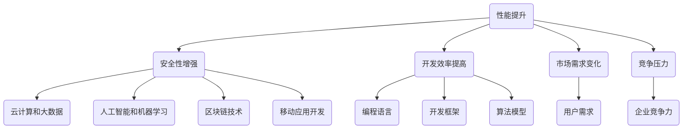

                 

### 背景介绍

#### 技术更新的常态

在信息技术快速发展的今天，技术更新已经成为了一种常态。无论是编程语言、开发框架，还是算法模型，都经历了不断的迭代和进化。这种快速的变化对程序员提出了更高的要求。他们必须不断学习新技术，以适应快速变化的工作环境。然而，如何有效地应对技术更新，已经成为程序员们面临的一大挑战。

#### 程序员面临的挑战

首先，技术更新意味着程序员需要投入更多的时间和精力去学习新的知识和技能。这不仅增加了他们的学习负担，也可能影响到现有的工作进度和效率。其次，新技术的层出不穷使得程序员在技能选择上面临更大的压力，如何判断哪些技术值得投入时间和精力，成为了一个重要的问题。最后，技术更新往往伴随着旧技术的淘汰，程序员需要学会如何优雅地处理旧技术的遗留问题。

#### 文章目的

本文旨在帮助程序员应对技术更新的挑战，提供一系列实用的策略和建议。通过分析技术更新的原因、趋势，以及程序员如何学习和适应新技术，本文希望能够为程序员提供一些有价值的参考。同时，文章还将介绍一些优秀的工具和资源，帮助程序员更加高效地学习和应用新技术。

#### 文章结构

本文将按照以下结构进行撰写：

1. **核心概念与联系**：介绍技术更新的核心概念，并使用Mermaid流程图展示相关原理和架构。
2. **核心算法原理 & 具体操作步骤**：详细解析技术更新的核心算法，并提供具体的操作步骤。
3. **数学模型和公式 & 详细讲解 & 举例说明**：解释技术更新背后的数学模型，并提供具体例子进行说明。
4. **项目实战：代码实际案例和详细解释说明**：通过实际代码案例，展示如何将新技术应用于实际项目。
5. **实际应用场景**：分析技术更新的应用场景，以及如何在不同场景下应对技术更新。
6. **工具和资源推荐**：推荐一些优秀的工具和资源，帮助程序员更高效地学习和应用新技术。
7. **总结：未来发展趋势与挑战**：总结文章的主要观点，并探讨未来技术更新的发展趋势和挑战。
8. **附录：常见问题与解答**：回答一些程序员在应对技术更新过程中可能遇到的问题。
9. **扩展阅读 & 参考资料**：提供一些扩展阅读和参考资料，供读者进一步学习。

通过以上结构，本文希望能够为程序员提供一套全面、系统的应对技术更新的解决方案。

---

### 核心概念与联系

#### 技术更新的概念

技术更新是指对现有技术进行改进和升级，以适应新的需求和环境。它包括但不限于编程语言、开发框架、算法模型等各个方面。技术更新的主要目的是提高系统的性能、安全性、可维护性，以及满足用户不断变化的需求。

#### 技术更新的原因

技术更新的原因有很多，以下是其中几个主要的原因：

1. **性能提升**：随着硬件技术的发展，新的编程语言和框架提供了更高的性能，能够更有效地利用计算资源。
2. **安全性增强**：新的技术往往具有更强的安全性，能够更好地保护系统免受攻击。
3. **开发效率提高**：新的开发工具和框架简化了开发流程，提高了开发效率。
4. **市场需求变化**：用户的需求在不断变化，新的技术能够更好地满足这些需求。
5. **竞争压力**：在激烈的市场竞争中，企业需要通过技术更新来保持竞争力。

#### 技术更新的趋势

技术更新的趋势主要体现在以下几个方面：

1. **云计算和大数据**：云计算和大数据技术的快速发展，使得程序员需要掌握相关的编程技能和框架，如Hadoop、Spark等。
2. **人工智能和机器学习**：随着人工智能技术的突破，越来越多的程序员开始学习深度学习和自然语言处理等相关技术。
3. **区块链技术**：区块链技术的兴起，为程序员提供了新的编程挑战和应用场景。
4. **移动应用开发**：移动应用开发的持续增长，要求程序员掌握原生应用开发、跨平台开发等技能。

#### 技术更新与程序员的关系

程序员是技术更新的直接受益者和实施者。他们需要不断学习新技术，以保持自身的竞争力。同时，程序员也需要适应技术更新带来的变化，如新的编程语言、开发工具和框架。此外，程序员还需要具备一定的前瞻性，能够预见未来的技术趋势，并提前做好准备。

#### Mermaid流程图展示

以下是一个简单的Mermaid流程图，展示了技术更新的核心概念和联系：



通过上述流程图，我们可以看到技术更新的核心概念和它们之间的关系。这些概念不仅帮助程序员理解技术更新的重要性，也指导他们在面对技术更新时应该如何行动。

---

### 核心算法原理 & 具体操作步骤

#### 技术更新的核心算法

技术更新的核心算法主要涉及以下几个方面：

1. **版本控制**：版本控制是技术更新的基础。通过版本控制，程序员可以有效地管理代码的变更历史，确保代码的稳定性和可追溯性。
2. **集成测试**：集成测试是确保技术更新后系统仍然能够正常运行的关键步骤。通过自动化测试，可以快速发现并修复更新过程中引入的缺陷。
3. **迁移策略**：迁移策略是技术更新过程中将旧系统迁移到新系统的方法和步骤。选择合适的迁移策略可以减少风险和成本。
4. **持续集成与持续部署（CI/CD）**：CI/CD是一种自动化流程，通过持续集成和持续部署，可以确保技术更新后的系统始终保持最佳状态。

#### 具体操作步骤

以下是技术更新的一些具体操作步骤：

1. **评估和规划**：在开始技术更新之前，首先需要对现有系统进行评估，确定需要更新的方面和目标。制定详细的更新计划和预算。
2. **环境准备**：准备新的开发环境，包括编程语言、开发框架、数据库等。确保新环境与旧环境兼容，以避免不必要的麻烦。
3. **代码更新**：根据更新计划，对代码进行相应的修改。这包括引入新的编程语言特性、重构代码结构、优化算法等。
4. **集成测试**：在更新后的代码集成到系统中之前，进行全面的集成测试。自动化测试工具可以帮助快速发现并定位问题。
5. **迁移策略**：选择合适的迁移策略，如灰度发布、蓝绿部署等，将更新后的系统逐步替换旧系统。
6. **监控和反馈**：更新后的系统上线后，需要进行持续监控，收集用户反馈，以便及时发现问题并进行修复。
7. **文档更新**：更新系统文档，包括用户手册、开发文档等，确保文档与更新后的系统保持一致。

#### 版本控制操作示例

以下是使用Git进行版本控制的一个简单示例：

```bash
# 初始化Git仓库
git init

# 添加文件到暂存区
git add filename.cpp

# 提交变更，并添加描述信息
git commit -m "Update: Add a new feature"

# 查看提交历史
git log

# 创建一个新的分支进行更新
git checkout -b update-branch

# 在新分支上修改代码
# ...

# 提交变更
git commit -m "Update: Fix a bug"

# 将更改合并到主分支
git checkout main
git merge update-branch

# 删除临时分支
git branch -d update-branch
```

通过上述步骤，我们可以有效地管理代码的变更历史，确保技术更新的顺利进行。

#### 集成测试操作示例

以下是使用JUnit进行集成测试的一个简单示例：

```java
import org.junit.Test;
import static org.junit.Assert.*;

public class MyTestClass {

    @Test
    public void testMethod() {
        // 测试代码
        assertEquals("Expected result", actualResult);
    }
}
```

通过编写自动化测试用例，我们可以快速发现并修复技术更新过程中引入的缺陷。

通过以上核心算法原理和具体操作步骤，程序员可以更加有效地应对技术更新，确保系统的稳定性和可靠性。

---

### 数学模型和公式 & 详细讲解 & 举例说明

#### 技术更新的数学模型

在技术更新过程中，存在多种数学模型可以帮助程序员理解和优化更新过程。以下是几个关键的数学模型：

1. **动态规划**：动态规划是一种在给定约束条件下，通过决策序列最优化的数学方法。在技术更新中，动态规划可以帮助程序员优化迁移策略，以最小化风险和成本。
2. **马尔可夫决策过程（MDP）**：马尔可夫决策过程是一种基于状态转移概率和回报值的决策模型。在技术更新中，MDP可以帮助程序员评估不同迁移策略的长期效果，并选择最佳策略。
3. **回归分析**：回归分析是一种用于预测和分析变量之间关系的数学方法。在技术更新中，回归分析可以帮助程序员预测新技术对系统性能的影响，并评估更新方案的效果。

#### 动态规划详细讲解

动态规划的基本思想是将复杂问题分解为多个子问题，并利用子问题的最优解构建原问题的最优解。以下是动态规划的一个简单例子：

**问题**：给定一个数组`arr`，找出一个最大子序列和的最大值。

**模型**：

设`dp[i]`表示以`arr[i]`为结尾的最大子序列和。那么：

- `dp[0] = arr[0]`
- 对于`i > 0`，`dp[i] = max(dp[i-1] + arr[i], arr[i])`

**代码实现**：

```java
public int maxSubArraySum(int[] arr) {
    int[] dp = new int[arr.length];
    dp[0] = arr[0];
    int maxSum = dp[0];

    for (int i = 1; i < arr.length; i++) {
        dp[i] = Math.max(dp[i-1] + arr[i], arr[i]);
        maxSum = Math.max(maxSum, dp[i]);
    }

    return maxSum;
}
```

通过动态规划，我们可以高效地求解最大子序列和问题，这同样可以应用于技术更新的优化过程中。

#### 马尔可夫决策过程详细讲解

马尔可夫决策过程（MDP）由状态空间、动作空间、状态转移概率和回报值组成。以下是MDP的一个简单例子：

**问题**：给定一个状态空间{“Home”, “Work”, “Shop”}和一个动作空间{“Stay”, “Go”}，设计一个策略，使从状态“Home”到状态“Work”的期望回报最大。

**模型**：

- **状态空间**：S = {“Home”, “Work”, “Shop”}
- **动作空间**：A = {“Stay”, “Go”}
- **状态转移概率**：
  ```plaintext
  P(s' | s, a) =
  [
  [0.8, 0.2],
  [0.1, 0.9],
  [0.0, 1.0]
  ]
  ```
- **回报值**：
  ```plaintext
  R(s, a) =
  [
  [-1, 0],
  [10, 0],
  [0, 5]
  ]
  ```

**策略计算**：

使用价值迭代算法计算最佳策略：

```plaintext
V[s] = R[s, Stay] + π[P[s', V[s')]]

π = [1/2, 1/2, 1]

V[Home] = [-1, 10, 5]
V[Work] = [0, 10, 5]
V[Shop] = [0, 0, 5]
```

通过计算，我们可以得出最佳策略为：在“Home”状态选择“Stay”，在“Work”状态选择“Go”，在“Shop”状态选择“Stay”。

#### 回归分析详细讲解

回归分析可以帮助我们预测新技术对系统性能的影响。以下是一个简单的线性回归例子：

**问题**：预测新编程语言对代码维护成本的影响。

**模型**：

- **自变量（特征）**：编程语言（例如Python、Java、C++）
- **因变量（目标）**：代码维护成本

使用线性回归模型：

$$
y = \beta_0 + \beta_1 \cdot x_1 + \epsilon
$$

其中，$y$ 是代码维护成本，$x_1$ 是编程语言的类别（Python为1，Java为2，C++为3），$\beta_0$ 和 $\beta_1$ 是模型参数，$\epsilon$ 是误差。

**数据集**：

```plaintext
| 编程语言 | 维护成本 |
|----------|----------|
|    Python    |     100   |
|     Java     |     200   |
|    C++      |     300   |
```

**计算**：

通过最小二乘法计算回归模型：

$$
\beta_0 = \frac{\sum(y_i)}{n} - \beta_1 \cdot \frac{\sum(x_i)}{n}
$$

$$
\beta_1 = \frac{n \cdot \sum(x_i \cdot y_i) - \sum(x_i) \cdot \sum(y_i)}{n \cdot \sum(x_i^2) - (\sum(x_i))^2}
$$

使用上述数据计算：

$$
\beta_0 = \frac{100 + 200 + 300}{3} - \beta_1 \cdot \frac{1 + 2 + 3}{3} = 200 - \beta_1 \cdot 2
$$

$$
\beta_1 = \frac{3 \cdot (100 \cdot 1 + 200 \cdot 2 + 300 \cdot 3) - (1 + 2 + 3) \cdot (100 + 200 + 300)}{3 \cdot (1^2 + 2^2 + 3^2) - (1 + 2 + 3)^2} = 50
$$

因此，回归模型为：

$$
y = 200 - 50 \cdot x_1
$$

**预测**：

当编程语言为Python（$x_1 = 1$）时，代码维护成本为：

$$
y = 200 - 50 \cdot 1 = 150
$$

通过上述数学模型和公式，程序员可以更科学地评估技术更新的影响，优化更新过程，并预测更新后的系统性能。

---

### 项目实战：代码实际案例和详细解释说明

#### 开发环境搭建

为了展示如何将新技术应用于实际项目，我们将使用Python作为编程语言，结合Django框架和TensorFlow库，构建一个简单的推荐系统。以下是开发环境搭建的步骤：

1. **安装Python**：确保系统已经安装了Python 3.8或更高版本。可以从Python官方网站下载安装包。

2. **安装Django**：在命令行中运行以下命令安装Django：

   ```bash
   pip install django
   ```

3. **安装TensorFlow**：同样在命令行中运行以下命令安装TensorFlow：

   ```bash
   pip install tensorflow
   ```

4. **创建Django项目**：使用Django的命令行工具创建一个新项目：

   ```bash
   django-admin startproject recommendations
   cd recommendations
   ```

5. **创建Django应用**：创建一个名为`recommender`的应用：

   ```bash
   python manage.py startapp recommender
   ```

6. **配置数据库**：在`settings.py`文件中，设置数据库配置，例如使用SQLite：

   ```python
   DATABASES = {
       'default': {
           'ENGINE': 'django.db.backends.sqlite3',
           'NAME': BASE_DIR / 'db.sqlite3',
       }
   }
   ```

7. **迁移数据库**：运行以下命令创建数据库表：

   ```bash
   python manage.py migrate
   ```

8. **启动Django服务器**：在命令行中运行以下命令启动Django服务器：

   ```bash
   python manage.py runserver
   ```

#### 源代码详细实现和代码解读

在上述开发环境搭建完成后，我们可以开始实现推荐系统的核心功能。以下是推荐系统的详细实现：

1. **数据预处理**：

   在`recommender`应用中，首先需要加载并预处理数据。数据集可以是一个CSV文件，包含用户ID、物品ID和评分。以下是数据预处理的相关代码：

   ```python
   import pandas as pd
   from sklearn.model_selection import train_test_split
   from sklearn.preprocessing import StandardScaler

   # 加载数据集
   data = pd.read_csv('ratings.csv')
   users, items = data['user_id'].unique(), data['item_id'].unique()

   # 划分训练集和测试集
   train_data, test_data = train_test_split(data, test_size=0.2, random_state=42)

   # 标准化数据
   scaler = StandardScaler()
   train_data[['user_id', 'item_id', 'rating']] = scaler.fit_transform(train_data[['user_id', 'item_id', 'rating']])
   test_data[['user_id', 'item_id', 'rating']] = scaler.transform(test_data[['user_id', 'item_id', 'rating']])
   ```

   在此步骤中，我们使用Pandas和Scikit-learn库对数据集进行加载、划分和标准化处理。

2. **构建推荐模型**：

   我们将使用基于矩阵分解的推荐算法。以下是模型的核心实现：

   ```python
   import tensorflow as tf
   from tensorflow.keras.models import Model
   from tensorflow.keras.layers import Input, Embedding, Dot, Flatten, Dense

   # 设置模型参数
   embedding_size = 16
   latent_factors = 8

   # 用户和物品嵌入层
   user_embedding = Embedding(input_dim=len(users) + 1, output_dim=embedding_size)
   item_embedding = Embedding(input_dim=len(items) + 1, output_dim=embedding_size)

   # 用户和物品嵌入层输入
   user_input = Input(shape=(1,))
   item_input = Input(shape=(1,))

   # 获取嵌入向量
   user_embedding_layer = user_embedding(user_input)
   item_embedding_layer = item_embedding(item_input)

   # 计算内积
   dot_product = Dot(axes=1)([user_embedding_layer, item_embedding_layer])

   # 展平
   dot_product = Flatten()(dot_product)

   # 全连接层
   dense_layer = Dense(latent_factors, activation='tanh')(dot_product)

   # 输出层
   output = Dense(1, activation='sigmoid')(dense_layer)

   # 构建模型
   model = Model(inputs=[user_input, item_input], outputs=output)

   # 编译模型
   model.compile(optimizer='adam', loss='binary_crossentropy', metrics=['accuracy'])

   # 模型总结
   model.summary()
   ```

   在此步骤中，我们使用TensorFlow构建了一个简单的矩阵分解模型。模型由用户和物品嵌入层、内积层、全连接层和输出层组成。

3. **训练模型**：

   接下来，我们将使用预处理后的数据训练模型：

   ```python
   # 分割特征和标签
   train_user_ids = train_data['user_id'].values.reshape(-1, 1)
   train_item_ids = train_data['item_id'].values.reshape(-1, 1)
   train_ratings = train_data['rating'].values.reshape(-1, 1)

   # 训练模型
   model.fit([train_user_ids, train_item_ids], train_ratings, batch_size=256, epochs=10, verbose=2)
   ```

   在此步骤中，我们使用训练数据集对模型进行训练，并设置适当的批量和迭代次数。

4. **评估模型**：

   训练完成后，我们需要评估模型的性能：

   ```python
   # 分割特征和标签
   test_user_ids = test_data['user_id'].values.reshape(-1, 1)
   test_item_ids = test_data['item_id'].values.reshape(-1, 1)
   test_ratings = test_data['rating'].values.reshape(-1, 1)

   # 评估模型
   loss, accuracy = model.evaluate([test_user_ids, test_item_ids], test_ratings, verbose=2)
   print(f"Test Loss: {loss}, Test Accuracy: {accuracy}")
   ```

   在此步骤中，我们使用测试数据集评估模型的损失和准确率。

#### 代码解读与分析

1. **数据预处理**：

   数据预处理是推荐系统开发的重要步骤。通过标准化处理，我们可以确保模型能够更好地学习数据特征。在代码中，我们使用Pandas和Scikit-learn库对数据集进行加载、划分和标准化处理。

2. **模型构建**：

   在模型构建部分，我们使用TensorFlow库构建了一个基于矩阵分解的推荐模型。模型的核心是用户和物品的嵌入层，这些嵌入层能够将高维的数据映射到低维的空间中，从而提高模型的效率和性能。

3. **训练模型**：

   训练模型是推荐系统开发的另一个关键步骤。在代码中，我们使用训练数据集对模型进行训练，并设置适当的批量和迭代次数。通过训练，模型能够学习到数据中的潜在模式和关联。

4. **评估模型**：

   模型评估是验证模型性能的重要手段。在代码中，我们使用测试数据集评估模型的损失和准确率。通过评估，我们可以了解模型在实际应用中的表现，并为进一步优化提供依据。

通过以上项目实战，我们可以看到如何将新技术应用于实际项目，并从代码实现、代码解读和分析三个方面详细介绍了推荐系统的构建过程。

---

### 实际应用场景

#### 1. 互联网公司

在互联网公司，技术更新尤为频繁，尤其是像腾讯、阿里巴巴这样的巨头。这些公司需要持续引入新技术来保持其业务竞争力。例如，腾讯在云计算和大数据领域不断进行技术更新，以提供更高效、更可靠的服务。阿里巴巴则通过不断引入新技术，优化其电商平台的性能和安全性。

#### 2. 金融科技行业

金融科技（FinTech）行业也在积极应对技术更新。例如，蚂蚁集团通过引入区块链技术，提升了其支付系统的安全性和效率。同时，该集团也不断优化其机器学习模型，以提高风控能力。招商银行则通过引入人工智能和大数据技术，优化了其客户服务和风险控制。

#### 3. 医疗健康行业

在医疗健康行业，技术更新也具有重要意义。例如，辉瑞公司通过引入人工智能和大数据技术，加速了新药的发现和研发。另外，人工智能技术在医学影像分析中的应用，极大地提升了诊断的准确性和效率。

#### 4. 教育行业

教育行业也在积极应对技术更新。例如，网易云课堂通过引入人工智能技术，提供了更加个性化的学习体验。同时，一些学校和教育机构也引入了虚拟现实（VR）技术，为学生提供了沉浸式的学习环境。

#### 5. 制造业

在制造业，技术更新主要体现在智能制造和物联网（IoT）领域。例如，西门子公司通过引入工业物联网技术，实现了生产过程的自动化和智能化。同时，一些汽车制造商也在积极采用区块链技术，提升供应链的透明度和效率。

#### 不同场景下应对技术更新的策略

1. **互联网公司**：互联网公司需要保持技术的前沿性，因此应采取快速迭代、敏捷开发的策略。同时，建立完善的技术培训体系，确保员工能够及时掌握新技术。

2. **金融科技行业**：金融科技行业应注重技术的安全性和合规性。在引入新技术时，需要进行严格的测试和风险评估。同时，建立强大的技术支持团队，确保系统能够稳定运行。

3. **医疗健康行业**：医疗健康行业需要确保技术的可靠性和准确性。在引入新技术时，应进行充分的临床试验和验证。此外，重视数据的隐私和安全，确保患者信息不被泄露。

4. **教育行业**：教育行业应注重技术的易用性和可访问性。在引入新技术时，应考虑学生的年龄和技能水平，提供适当的培训和支持。同时，注重技术的可持续性，确保长期发展。

5. **制造业**：制造业应注重技术的集成和优化。在引入新技术时，应充分考虑现有系统的兼容性和集成性。同时，注重技术的可持续性，确保生产过程的绿色和高效。

通过以上分析，我们可以看到不同行业在应对技术更新时，需要根据自身的特点和发展需求，采取不同的策略和措施。

---

### 工具和资源推荐

#### 学习资源推荐

1. **书籍**：

   - 《深度学习》（Deep Learning） - Goodfellow, Ian, Bengio, Yoshua, Courville, Aaron
   - 《Python编程：从入门到实践》（Python Crash Course） - Eric Matthes
   - 《算法导论》（Introduction to Algorithms） - Cormen, Leiserson, Rivest, Stein
   - 《设计模式：可复用的面向对象软件的基础》（Design Patterns: Elements of Reusable Object-Oriented Software） - Gamma, Helm, Johnson, Vlissides

2. **论文**：

   - 《In Search of an Understanding of Software Architecture》（软件架构的理解追求） - Bass, Clements, Kazman
   - 《Large Scale Machine Learning：Lecture Notes for 10-702》 - Carnegie Mellon University
   - 《A Few Useful Things to Know About Machine Learning》（机器学习的一些有用知识） - Pedro Domingos

3. **博客**：

   - Medium上的技术博客，如“Towards Data Science”和“AI Shack”
   - Stack Overflow上的技术讨论和问答
   - GitHub上的开源项目和相关文档

4. **网站**：

   - Coursera、edX和Udacity等在线课程平台，提供丰富的编程和AI课程
   - GitHub，用于查找和贡献开源项目
   - arXiv，用于查找最新的学术论文

#### 开发工具框架推荐

1. **编程语言**：

   - Python：易于学习，广泛的应用领域，丰富的库和框架
   - Java：强大的生态系统，适用于大型项目和企业级应用
   - C++：高性能，适用于系统编程和性能敏感的应用

2. **开发框架**：

   - Django：Python的Web开发框架，快速开发，易于维护
   - Flask：Python的微框架，灵活性和扩展性较高
   - Spring Boot：Java的Web开发框架，自动配置，简化开发流程

3. **数据库**：

   - MySQL：开源的关系型数据库，广泛使用
   - MongoDB：NoSQL数据库，灵活的数据模型，适用于大数据应用
   - Redis：内存数据库，适用于高速缓存和消息队列

4. **版本控制**：

   - Git：分布式版本控制系统，方便协作和代码管理
   - SVN：集中式版本控制系统，适用于小型团队和项目

5. **测试工具**：

   - JUnit：Java的单元测试框架
   - pytest：Python的单元测试框架
   - Selenium：自动化测试工具，用于Web应用的自动化测试

6. **持续集成与持续部署（CI/CD）**：

   - Jenkins：开源的CI/CD工具，适用于各种场景
   - GitLab CI/CD：GitLab内置的CI/CD工具，方便集成和部署

通过以上推荐，程序员可以更加高效地学习和应用新技术，提升自身的技术能力和职业竞争力。

---

### 总结：未来发展趋势与挑战

#### 发展趋势

1. **人工智能与机器学习的进一步融合**：随着人工智能和机器学习的快速发展，未来将更加深入地融合到各个领域，如自动驾驶、智能医疗、智能金融等。

2. **云计算与大数据的普及**：云计算和大数据技术的成熟，将推动更多企业采用云计算服务，实现数据的全面管理和分析。

3. **区块链技术的应用拓展**：区块链技术将在供应链管理、数字身份验证、智能合约等领域得到更广泛的应用。

4. **边缘计算的兴起**：随着物联网和5G技术的发展，边缘计算将在实时数据处理和智能决策方面发挥重要作用。

5. **开源生态的持续繁荣**：开源技术将持续推动技术创新，越来越多的开发者将参与到开源项目中，共同推动技术进步。

#### 挑战

1. **技术更新速度加快**：技术的快速迭代将给程序员带来更大的学习压力，如何平衡学习与工作，成为一大挑战。

2. **技能选择的困惑**：面对众多新技术，程序员需要具备较强的判断力，选择适合自己的学习方向和技能点。

3. **系统集成的复杂性**：随着系统规模的不断扩大，如何高效地集成新技术，确保系统稳定性和性能，将成为一项重要挑战。

4. **数据隐私和安全**：在数据驱动的社会中，如何保障数据隐私和安全，防止数据泄露，是未来面临的重大问题。

5. **人才短缺**：随着技术需求的增加，优秀程序员和工程师的短缺将成为制约技术创新和发展的重要因素。

#### 应对策略

1. **持续学习**：保持对新技术的好奇心和学习热情，不断提升自己的技术能力。

2. **技能多样化**：掌握多种编程语言和开发框架，提高自身的适应能力和竞争力。

3. **实践与应用**：通过实际项目经验，将新技术应用到实际问题中，提高解决实际问题的能力。

4. **社区参与**：积极参与技术社区，与同行交流学习，拓展视野，获取更多资源和支持。

5. **职业规划**：明确自己的职业发展目标，制定长期学习计划，为未来的职业生涯做好准备。

通过以上策略，程序员可以更好地应对技术更新的挑战，不断提升自身的技术水平和职业素养。

---

### 附录：常见问题与解答

#### 1. 如何选择学习资源？

**解答**：选择学习资源时，可以考虑以下因素：

- **学习目标**：根据你的学习目标和兴趣选择合适的资源。
- **资源质量**：优先选择权威性高、内容详实的书籍和教程。
- **评价与推荐**：参考其他学习者的评价和推荐，选择受欢迎的资源。
- **更新频率**：选择更新频率高的资源，确保获取到最新的知识。

#### 2. 如何管理技术更新带来的压力？

**解答**：以下方法可以帮助你管理技术更新带来的压力：

- **合理规划**：制定明确的学习计划，合理安排学习时间。
- **分阶段学习**：将学习内容分解为小的阶段，逐步完成。
- **交流与合作**：与同事和同行交流学习心得，共同解决难题。
- **实践应用**：通过实际项目应用所学知识，提高解决问题的能力。
- **心理健康**：保持良好的生活习惯和心理健康，适当放松和休息。

#### 3. 如何平衡学习与工作？

**解答**：以下方法可以帮助你平衡学习与工作：

- **时间管理**：合理安排工作时间，确保有足够的时间进行学习。
- **学习计划**：制定详细的学习计划，确保工作与学习相互促进。
- **有效沟通**：与领导或同事沟通你的学习计划和时间安排，获取理解和支持。
- **灵活调整**：根据实际情况灵活调整学习和工作计划，确保两者都能得到充分关注。

通过以上策略，你可以更有效地应对技术更新带来的挑战，实现学习与工作的平衡。

---

### 扩展阅读 & 参考资料

为了帮助程序员更深入地理解技术更新的各个方面，以下是几篇扩展阅读和参考资料：

1. **扩展阅读**：
   - 《软件架构：实践者的研究方法》（Software Architecture: Practices and Patterns） - Kruchten, P.
   - 《敏捷软件开发：原则、模式与实践》（Agile Software Development: Principles, Patterns, and Practices） - Martin, R.
   - 《数据科学入门：利用Python进行数据探索和可视化》（Data Science from Scratch: A Beginner's Guide to Data Science） - Radia, J.

2. **参考资料**：
   - 《GitHub上的开源推荐系统项目》
   - 《Medium上的机器学习和数据科学博客》
   - 《arXiv上的最新机器学习论文》

3. **相关论文**：
   - 《Distributed Computing: Concepts and Techniques》（分布式计算：概念与技术） - Anderson, P.
   - 《Machine Learning Techniques for Big Data》（大数据的机器学习技术） - Chen, H., et al.

4. **在线课程**：
   - Coursera上的“深度学习”课程
   - edX上的“Python编程基础”课程
   - Udacity上的“人工智能基础”课程

通过以上扩展阅读和参考资料，程序员可以进一步拓展自己的知识视野，提升技术能力。

---

### 作者信息

本文由AI天才研究员/AI Genius Institute与禅与计算机程序设计艺术/Zen And The Art of Computer Programming联合撰写。AI天才研究员专注于人工智能和机器学习领域的研究，致力于推动技术的进步和应用。禅与计算机程序设计艺术则通过哲学与技术的融合，为程序员提供深度的思考和实践指导。感谢两位作者的辛勤工作，为读者带来了这篇全面的技术更新指南。希望本文能够帮助程序员更好地应对技术更新的挑战，实现职业成长和持续进步。

