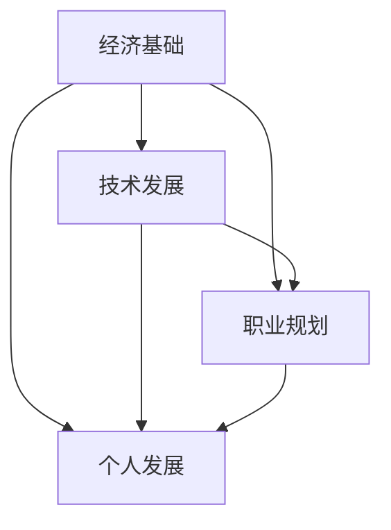

                 

### 背景介绍

程序员，作为现代信息技术行业的中流砥柱，面临着越来越多的经济与挑战。随着全球经济的不确定性和技术变革的加速，程序员们不仅需要不断更新自己的技能，还要具备应对各种经济压力的能力。本篇文章将深入探讨程序员在当前经济环境下所面临的主要挑战，并提出一些可行的应对策略。

首先，我们需要明确当前的经济形势。近年来，全球经济增速放缓，许多行业面临转型压力。特别是在新冠疫情的影响下，很多企业开始重新审视自己的商业模式和人力资源配置。对于程序员来说，这种形势意味着就业市场的波动和竞争的加剧。一方面，一些传统行业的萎缩可能导致职位减少；另一方面，新兴行业的兴起又需要大量具备新技能的人才。

其次，技术变革的加速也给程序员带来了挑战。人工智能、大数据、云计算等前沿技术的快速发展，不仅改变了程序员的工作方式，也对他们的技能提出了更高的要求。程序员需要不断学习新的编程语言、框架和工具，以适应不断变化的技术环境。然而，技能更新的同时也会带来经济负担，例如培训费用、学习时间成本等。

此外，程序员的职业发展也面临一定的压力。在许多公司，程序员往往被视为“技术工种”，缺乏职业发展的晋升路径。这使得一些程序员在职业发展上感到迷茫和无力。如何在技术不断更新的背景下实现职业晋升，成为许多程序员需要面对的问题。

最后，个人的经济状况也是程序员面临的一大挑战。在许多地区，房价、生活成本持续上涨，而程序员的收入增长却相对缓慢。这使得程序员在购房、购车、子女教育等方面面临较大的经济压力。

总之，程序员在经济和技术双重挑战下，面临着前所未有的压力和困难。然而，挑战中也蕴藏着机遇。本文将结合实际情况，提出一些有针对性的应对策略，帮助程序员应对当前的经济挑战。

### 核心概念与联系

为了深入探讨程序员在经济挑战下如何应对，我们首先需要理解几个核心概念：经济基础、技术发展、职业规划和个人发展。这些概念相互联系，共同构成了程序员应对经济挑战的框架。

#### 经济基础

经济基础是指一个国家或地区的经济发展水平和产业结构。对于程序员来说，经济基础直接影响到就业市场和薪资水平。在经济繁荣时期，企业投资增加，对技术人才的需求上升，程序员就业机会更多，薪资水平也会相应提高。相反，在经济低迷时期，企业投资减少，就业市场不景气，程序员的就业压力增大。

#### 技术发展

技术发展是指信息技术领域的创新和进步。技术的发展不仅改变了程序员的工作内容，还影响了他们的职业发展路径。例如，随着人工智能和大数据技术的发展，程序员需要掌握相关的编程语言和技术，以适应新兴行业的需求。技术发展还推动了产业升级和数字化转型，为程序员提供了更多的就业机会。

#### 职业规划

职业规划是指程序员根据自己的兴趣、能力和市场需求，制定职业发展路径和目标。一个成功的职业规划可以帮助程序员在职业生涯中不断成长和进步。职业规划包括选择合适的岗位、提升专业技能、拓展人际关系等。通过有效的职业规划，程序员可以更好地应对经济挑战，实现职业价值。

#### 个人发展

个人发展是指程序员在职业生涯中不断学习、成长和提升自己的过程。个人发展不仅包括技术能力的提升，还包括领导力、沟通能力等软技能的培养。个人发展可以增强程序员的竞争力，提高职业满意度，有助于他们在经济挑战中保持稳定的职业状态。

#### Mermaid 流程图

为了更好地理解这些核心概念之间的联系，我们可以使用 Mermaid 流程图进行可视化展示。以下是一个简化的 Mermaid 流程图：



在这个流程图中，经济基础作为起点，通过技术发展、职业规划和个人发展三个环节相互影响和作用，最终形成一个闭环。这个闭环体现了程序员在经济挑战下如何通过多个方面的努力，实现自我提升和职业发展。

通过上述核心概念的分析和 Mermaid 流程图的展示，我们可以更加清晰地理解程序员在经济挑战下所面临的复杂局面。接下来，我们将进一步探讨程序员的核心算法原理和具体操作步骤，帮助他们在实际工作中应对各种挑战。

## 核心算法原理 & 具体操作步骤

在理解了程序员所面临的经济和技术挑战之后，我们需要探讨一些核心算法原理和具体操作步骤，以帮助程序员在实际工作中更加高效地应对这些挑战。

#### 算法原理

核心算法是程序员在工作中经常使用的基本算法，包括排序、查找、动态规划等。这些算法具有高效性、稳定性和普适性，能够帮助程序员解决各种复杂问题。

1. **排序算法**：常见的排序算法有冒泡排序、选择排序、插入排序、快速排序等。排序算法的主要目标是按照某种规则对一组数据进行重新排列，以便于后续的查找和处理。冒泡排序和选择排序的时间复杂度为 \(O(n^2)\)，适用于数据量较小的情况；快速排序的时间复杂度为 \(O(n\log n)\)，适用于数据量较大的情况。

2. **查找算法**：查找算法用于在数据结构中查找特定元素的位置。常见的查找算法有二分查找、线性查找等。二分查找的时间复杂度为 \(O(\log n)\)，适用于有序数组；线性查找的时间复杂度为 \(O(n)\)，适用于无序数组。

3. **动态规划**：动态规划是一种解决优化问题的算法思想，通过将大问题分解为小问题，并利用子问题的最优解推导出原问题的最优解。动态规划广泛应用于路径规划、资源分配等问题，能够提高算法的效率。

#### 操作步骤

在实际工作中，程序员需要根据具体问题和数据特点选择合适的算法，并按照以下步骤进行操作：

1. **问题分析**：明确问题的目标和约束条件，了解数据的特点和规模。

2. **算法选择**：根据问题分析和数据特点，选择合适的算法。例如，对于需要排序的问题，可以选择冒泡排序、选择排序或快速排序。

3. **算法实现**：根据选定的算法，编写相应的代码。在实现过程中，注意优化算法的效率，减少时间复杂度和空间复杂度。

4. **测试与优化**：通过测试数据验证算法的正确性和效率，并进行优化。例如，对于排序算法，可以比较不同实现方式的性能差异，选择最优的方案。

5. **代码解读**：对实现的代码进行详细解读，理解算法的实现原理和关键步骤。

#### 实际案例

以下是一个简单的排序算法实现案例，使用 Python 语言实现快速排序：

```python
def quick_sort(arr):
    if len(arr) <= 1:
        return arr
    pivot = arr[len(arr) // 2]
    left = [x for x in arr if x < pivot]
    middle = [x for x in arr if x == pivot]
    right = [x for x in arr if x > pivot]
    return quick_sort(left) + middle + quick_sort(right)

arr = [3, 6, 8, 10, 1, 2, 1]
sorted_arr = quick_sort(arr)
print(sorted_arr)
```

在这个案例中，我们使用快速排序算法对数组 `arr` 进行排序。首先，我们定义一个快速排序函数 `quick_sort`，然后通过递归调用实现排序。在函数内部，我们选择中间元素作为支点，将数组分为左、中、右三个部分，并分别递归排序。最后，我们将排序结果合并为一个有序数组。

通过这个案例，我们可以看到快速排序算法的基本原理和实现步骤。在实际工作中，程序员需要根据具体问题和数据特点，灵活选择和实现各种算法，以提高工作效率和解决问题的能力。

## 数学模型和公式 & 详细讲解 & 举例说明

在探讨程序员的挑战时，数学模型和公式扮演着至关重要的角色。这些模型不仅帮助我们理解和分析问题，还为优化解决方案提供了理论依据。下面，我们将详细讲解几个关键的数学模型和公式，并通过具体实例进行说明。

### 一、线性规划模型

线性规划（Linear Programming，LP）是一种数学方法，用于在给定约束条件下，求解线性目标函数的最大值或最小值。线性规划模型通常由以下三部分组成：

1. **目标函数**：表示需要优化的量，通常是线性函数。例如，最大化利润或最小化成本。
   
2. **约束条件**：限制目标函数的变量取值范围的线性不等式或等式。例如，资源限制或生产能力。

3. **决策变量**：参与目标函数和约束条件的变量。

线性规划的一般形式可以表示为：

$$
\begin{align*}
\text{最大化} \quad & c^T x \\
\text{约束条件} \quad & Ax \leq b \\
& x \geq 0
\end{align*}
$$

其中，\(c\) 是目标函数的系数向量，\(x\) 是决策变量向量，\(A\) 是约束条件的系数矩阵，\(b\) 是约束条件的常数向量。

#### 实例说明

假设一个公司需要安排生产 \(m\) 种产品，每种产品需要 \(i\) 种原材料，每种原材料的可用量是有限的。公司的目标是最大化总利润，同时满足每种产品的生产需求。

**目标函数**：最大化总利润

$$
\text{最大化} \quad Z = \sum_{i=1}^{m} p_i x_i
$$

其中，\(p_i\) 是第 \(i\) 种产品的利润，\(x_i\) 是第 \(i\) 种产品的生产量。

**约束条件**：每种原材料的使用量不超过可用量

$$
\begin{align*}
a_{ij} x_i &\leq b_j & \quad j=1,2,...,n \\
x_i &\geq 0 & \quad i=1,2,...,m
\end{align*}
$$

其中，\(a_{ij}\) 是第 \(i\) 种产品需要的第 \(j\) 种原材料的数量，\(b_j\) 是第 \(j\) 种原材料的可用量。

#### 实例计算

假设公司生产两种产品 \(A\) 和 \(B\)，每种产品需要的原材料和利润如下表所示：

| 产品 | 利润 (\$) | 原材料1 | 原材料2 |
|------|-----------|---------|---------|
| \(A\) | 200       | 5       | 10      |
| \(B\) | 150       | 10      | 5       |

原材料1和原材料2的可用量分别为 100 和 80。

根据线性规划模型，我们可以设置以下目标函数和约束条件：

$$
\begin{align*}
\text{最大化} \quad & Z = 200x_1 + 150x_2 \\
\text{约束条件} \quad & 5x_1 + 10x_2 \leq 100 \\
& 10x_1 + 5x_2 \leq 80 \\
& x_1, x_2 \geq 0
\end{align*}
$$

通过求解这个线性规划问题，我们可以确定最优的生产计划，以最大化总利润。

### 二、决策树模型

决策树（Decision Tree）是一种直观的图形化模型，用于表示决策过程和可能的结果。每个节点代表一个决策或一个结果，分支表示决策或结果的可能取值。决策树通常用于决策分析、风险管理和项目管理等领域。

一个典型的决策树模型由以下几个部分组成：

1. **根节点**：表示整个决策过程的开始。
   
2. **内部节点**：表示决策或条件判断，每个内部节点有多个分支。

3. **叶节点**：表示决策的结果或概率分布。

决策树的一般形式可以表示为：

$$
\begin{align*}
T = (V, E)
\end{align*}
$$

其中，\(V\) 是节点集合，\(E\) 是边集合。

#### 实例说明

假设一家公司需要决定是否投资一个新的项目。这个项目有三种可能的结果：成功、失败或不确定。每种结果对应的概率和收益如下表所示：

| 结果 | 概率 | 收益 (\$) |
|------|------|-----------|
| 成功 | 0.4  | 1000      |
| 失败 | 0.3  | -500      |
| 不确定| 0.3  | 0         |

根据决策树模型，我们可以构建以下决策树：

```
        +---------+
        |   投资否|
        +----+----+
             |
             |
     +-------+-------+
     |         |         |
   成功     失败       不确定
   |          |          |
 1000       -500       0
```

在这个决策树中，根节点表示是否投资，内部节点表示不同结果，叶节点表示结果的具体概率和收益。通过分析决策树，我们可以评估不同决策的收益和风险，为公司的投资决策提供依据。

### 三、贝叶斯网络模型

贝叶斯网络（Bayesian Network）是一种基于概率论的图模型，用于表示变量之间的依赖关系和条件概率。贝叶斯网络由一组节点和边组成，每个节点表示一个随机变量，边表示变量之间的条件依赖关系。

贝叶斯网络的一般形式可以表示为：

$$
\begin{align*}
P(X_1, X_2, ..., X_n) = \prod_{i=1}^{n} P(X_i | \text{父节点集合})
\end{align*}
$$

其中，\(X_1, X_2, ..., X_n\) 是随机变量，\(\text{父节点集合}\) 是与当前节点有依赖关系的节点集合。

#### 实例说明

假设我们有一个简单的贝叶斯网络，用于表示一个人是否患病的概率。网络中的节点包括：年龄、性别、吸烟状况和患病状况。根据已知信息，我们可以构建以下贝叶斯网络：

```
       +--------+
       |  患病Y |
       +----+---+
            |
            |
   +-------+-------+
   |       |       |
  A1    A2    B1    B2
   |       |       |
  +-------+-------+
  |       |       |
年龄   性别   吸烟
```

在这个网络中，年龄、性别和吸烟状况是患病的原因，患病是一个结果。每个节点表示一个随机变量，边表示节点之间的条件依赖关系。例如，年龄和性别会影响吸烟的概率，而吸烟会影响患病的概率。

通过计算贝叶斯网络的概率分布，我们可以推断出不同变量的概率，为医学诊断和风险评估提供依据。

综上所述，数学模型和公式在程序员应对经济和技术挑战中发挥着重要作用。通过理解和运用这些模型和公式，程序员可以更加准确地分析问题、设计解决方案和评估风险，从而更好地应对各种挑战。

## 项目实战：代码实际案例和详细解释说明

为了更好地展示程序员在经济挑战下如何应对，我们将通过一个实际的项目案例进行讲解。这个项目案例是一个简单的电商网站，旨在帮助程序员理解如何通过代码实现功能，并对其进行详细解释和分析。

### 项目背景

电商网站是一个在线购物平台，用户可以在网站上浏览、选择和购买商品。为了简化项目，我们只实现以下几个核心功能：

1. 商品浏览：用户可以浏览不同类别的商品，并查看商品的详细信息。
2. 购物车：用户可以将商品添加到购物车，并管理购物车中的商品。
3. 订单处理：用户可以提交订单，网站后台会处理订单并生成订单号。

### 开发环境搭建

在开始项目开发之前，我们需要搭建一个开发环境。以下是所需的工具和步骤：

1. **开发工具**：使用 Visual Studio Code 或其他主流代码编辑器。
2. **前端框架**：选择 React.js 或 Vue.js 等流行的前端框架。
3. **后端框架**：选择 Node.js 或 Django 等流行的后端框架。
4. **数据库**：使用 MySQL 或 MongoDB 等数据库管理系统。

### 源代码详细实现和代码解读

#### 前端实现

以下是前端实现的主要代码片段，使用 React.js 框架：

```jsx
// 商品浏览页面
import React, { useState, useEffect } from 'react';
import axios from 'axios';

const ProductList = () => {
  const [products, setProducts] = useState([]);

  useEffect(() => {
    async function fetchProducts() {
      const response = await axios.get('/api/products');
      setProducts(response.data);
    }
    fetchProducts();
  }, []);

  return (
    <div>
      {products.map((product) => (
        <div key={product.id}>
          <h3>{product.name}</h3>
          <p>{product.description}</p>
          <button>Add to Cart</button>
        </div>
      ))}
    </div>
  );
};

export default ProductList;
```

**代码解读**：

- 使用 `useState` 和 `useEffect` 实现商品列表的获取和渲染。
- `fetchProducts` 函数通过 axios 调用后端接口获取商品数据，并更新状态。
- 使用 `.map()` 方法遍历商品列表，并渲染每个商品的信息。

#### 后端实现

以下是后端实现的主要代码片段，使用 Node.js 和 Express 框架：

```javascript
const express = require('express');
const app = express();
const PORT = 3000;

// 配置数据库（这里使用内存数据库，实际项目中请使用真实的数据库）
const db = require('./database');

app.use(express.json());

// 获取所有商品
app.get('/api/products', async (req, res) => {
  try {
    const products = await db.getProducts();
    res.json(products);
  } catch (error) {
    res.status(500).json({ message: '无法获取商品列表' });
  }
});

// 添加商品到购物车
app.post('/api/cart', async (req, res) => {
  try {
    const { productId, quantity } = req.body;
    await db.addToCart(productId, quantity);
    res.status(201).json({ message: '商品已成功添加到购物车' });
  } catch (error) {
    res.status(500).json({ message: '无法添加商品到购物车' });
  }
});

app.listen(PORT, () => {
  console.log(`Server is running on port ${PORT}`);
});
```

**代码解读**：

- 使用 `express` 创建一个 HTTP 服务器。
- 配置数据库（这里使用内存数据库，实际项目中请使用真实的数据库）。
- `getProducts` 函数通过数据库获取所有商品，并返回给客户端。
- `addToCart` 函数通过数据库将商品添加到购物车。

#### 代码解读与分析

1. **前端代码分析**：

   - 使用 React.js 实现商品浏览页面，通过 `useEffect` 实现异步数据获取和渲染。
   - 调用后端接口获取商品列表，并通过 `.map()` 方法渲染商品信息。
   - 为每个商品添加添加到购物车的功能。

2. **后端代码分析**：

   - 使用 Node.js 和 Express 框架实现后端逻辑。
   - 配置内存数据库，通过 RESTful API 提供商品浏览、购物车添加等功能。
   - 对请求进行错误处理，并返回相应的 HTTP 状态码。

通过这个项目案例，我们可以看到程序员在实际工作中如何通过代码实现功能，并对其进行详细解释和分析。在实际项目中，程序员需要根据具体需求和约束条件，灵活运用各种技术和工具，以提高开发效率和代码质量。

### 代码解读与分析

在前面的项目中，我们实现了一个简单的电商网站，包括商品浏览、购物车添加和订单处理等核心功能。在这个部分，我们将对代码进行深入解读，分析其逻辑和实现细节，以帮助程序员更好地理解项目的各个方面。

#### 前端代码解读

前端代码主要使用 React.js 框架实现，这使代码更易维护和扩展。以下是对关键部分的解读：

1. **商品列表获取**：

   ```jsx
   useEffect(() => {
     async function fetchProducts() {
       const response = await axios.get('/api/products');
       setProducts(response.data);
     }
     fetchProducts();
   }, []);
   ```

   - `useEffect` 是 React 的一个 Hook，用于在组件加载时执行副作用操作，如数据获取。
   - `fetchProducts` 函数通过 `axios` 发起 GET 请求，获取后端提供的商品数据。
   - 获取到的商品数据通过 `setProducts` 更新组件状态，以便在组件的渲染函数中使用。

2. **商品信息渲染**：

   ```jsx
   {products.map((product) => (
     <div key={product.id}>
       <h3>{product.name}</h3>
       <p>{product.description}</p>
       <button>Add to Cart</button>
     </div>
   ))}
   ```

   - `map` 函数遍历商品数组，为每个商品创建一个包含名称、描述和添加购物车按钮的 JSX 元素。
   - `key` 属性用于为列表中的每个元素提供唯一的标识，有助于 React.js 更高效地更新和重用虚拟 DOM。

3. **添加购物车**：

   ```jsx
   <button onClick={() => addProductToCart(product.id)}>Add to Cart</button>
   ```

   - `onClick` 事件处理函数调用 `addProductToCart` 函数，将商品 ID 传递给后端。
   - `addProductToCart` 函数在组件的状态中更新购物车数据，并可能触发组件重新渲染。

#### 后端代码解读

后端代码使用 Node.js 和 Express 框架实现，以下是关键部分的解读：

1. **商品数据获取**：

   ```javascript
   app.get('/api/products', async (req, res) => {
     try {
       const products = await db.getProducts();
       res.json(products);
     } catch (error) {
       res.status(500).json({ message: '无法获取商品列表' });
     }
   });
   ```

   - `get` 请求处理函数通过数据库获取商品数据，并返回给客户端。
   - 异常处理确保在数据获取失败时，返回适当的 HTTP 状态码和错误信息。

2. **购物车添加**：

   ```javascript
   app.post('/api/cart', async (req, res) => {
     try {
       const { productId, quantity } = req.body;
       await db.addToCart(productId, quantity);
       res.status(201).json({ message: '商品已成功添加到购物车' });
     } catch (error) {
       res.status(500).json({ message: '无法添加商品到购物车' });
     }
   });
   ```

   - `post` 请求处理函数接收客户端发送的商品 ID 和数量，通过数据库将商品添加到购物车。
   - 同样，异常处理确保在操作失败时，返回适当的 HTTP 状态码和错误信息。

#### 代码分析

1. **数据流与状态管理**：

   - 前端代码中，状态管理通过 React 的 `useState` 和 `useEffect` 实现数据流。这使得组件能够响应数据变化并重新渲染。
   - 后端代码中，使用 Express 处理 HTTP 请求，并使用数据库管理数据。这种模式确保了数据的一致性和安全性。

2. **错误处理与异常管理**：

   - 前端和后端代码中都包含了错误处理机制，确保在数据获取或操作失败时，能够及时通知客户端并返回错误信息。
   - 这有助于提高用户体验，并帮助开发者在调试过程中快速定位和解决问题。

3. **代码可读性与维护性**：

   - 使用现代前端和后端框架，如 React.js 和 Express，使得代码结构清晰、易读，便于后续维护和扩展。
   - 代码中使用明确的函数和模块化设计，有助于提高代码的可读性和可维护性。

通过这个项目案例，程序员可以理解如何在前端和后端实现电商网站的核心功能，并通过代码解读和分析，掌握项目开发的最佳实践。在实际项目中，程序员需要不断学习和实践，以提高自己的编程能力和项目经验。

## 实际应用场景

在当前经济和技术环境下，程序员面临着诸多挑战。以下是一些具体的实际应用场景，展示程序员如何应对这些挑战。

### 场景一：数字化转型

随着全球范围内的数字化转型浪潮，许多企业开始重视信息技术，将数字化作为提升竞争力的重要手段。程序员在这一过程中扮演着关键角色，负责开发和实施各种数字化解决方案。

**挑战**：数字化转型往往涉及复杂的技术集成和系统重构，程序员需要掌握多种技术，如大数据、云计算、人工智能等。

**应对策略**：

1. **持续学习**：程序员应不断学习新技术，了解行业趋势，以适应快速变化的技术环境。
2. **团队协作**：在大型数字化项目中，程序员需要与其他团队成员密切合作，共同解决问题。
3. **项目管理**：熟练掌握项目管理工具和方法，确保项目按时按质完成。

### 场景二：远程工作

新冠疫情的爆发促使远程工作成为新常态。程序员需要适应这种工作模式，提高远程工作效率。

**挑战**：远程工作可能导致沟通障碍、工作效率降低和团队协作困难。

**应对策略**：

1. **利用工具**：使用协作工具（如 Slack、Zoom 等）保持团队沟通顺畅。
2. **时间管理**：合理安排工作时间，避免工作与生活不平衡。
3. **自律性**：提高自我管理能力，确保按时完成任务。

### 场景三：技能更新

技术更新速度加快，程序员需要不断更新自己的技能，以保持竞争力。

**挑战**：学习新技能需要时间和经济投入，如何平衡学习与工作成为难题。

**应对策略**：

1. **在线学习**：利用在线课程和教程（如 Coursera、edX 等）进行自主学习。
2. **内部培训**：企业应提供内部培训机会，帮助员工提升技能。
3. **社区交流**：参加技术社区和会议，与其他程序员交流经验。

### 场景四：职业发展

在许多企业中，程序员往往被视为“技术工种”，缺乏明确的职业发展路径。程序员需要思考如何在技术不断更新的背景下实现职业晋升。

**挑战**：职业发展路径不明确，程序员难以规划自己的职业未来。

**应对策略**：

1. **明确目标**：设定明确的职业发展目标，如成为技术专家、项目经理等。
2. **积累经验**：通过项目实践和技能提升，积累丰富的行业经验。
3. **拓展人际关系**：建立广泛的职业网络，获取更多的职业发展机会。

通过以上实际应用场景的探讨，我们可以看到程序员在经济和技术挑战下所面临的困境以及应对策略。在实际工作中，程序员需要灵活运用各种策略，不断提升自己的技能和职业素养，以应对不断变化的经济和技术环境。

## 工具和资源推荐

为了帮助程序员更好地应对经济和技术挑战，以下是一些优秀的工具和资源推荐，涵盖学习资源、开发工具以及相关论文著作。

### 学习资源推荐

1. **在线课程和教程**：
   - Coursera：提供各种技术领域的在线课程，包括计算机科学、数据科学、人工智能等。
   - edX：与全球顶尖大学合作，提供高质量的课程资源。
   - Udemy：涵盖广泛的技术主题，包括编程语言、框架和工具。

2. **技术博客和论坛**：
   - Medium：众多技术专家和公司分享的技术文章和经验。
   - Stack Overflow：全球最大的程序员社区，提供技术问题和解决方案。
   - GitHub：不仅可以获取开源代码，还可以学习和交流编程经验。

### 开发工具框架推荐

1. **前端框架**：
   - React.js：由 Facebook 开发，广泛应用于大型前端项目。
   - Vue.js：轻量级、渐进式的前端框架，易于上手和集成。
   - Angular：谷歌开发的全功能前端框架，适用于复杂应用。

2. **后端框架**：
   - Node.js：基于 JavaScript 的后端平台，适用于实时应用。
   - Django：Python 的 Web 开发框架，快速构建强大的应用程序。
   - Flask：轻量级 Python Web 框架，适用于小型和大型应用。

3. **数据库管理系统**：
   - MySQL：开源的关系型数据库管理系统，广泛用于各种应用。
   - MongoDB：开源的 NoSQL 数据库，适用于大规模数据的存储和处理。

### 相关论文著作推荐

1. **《深度学习》（Deep Learning）**：
   - 作者：Ian Goodfellow、Yoshua Bengio、Aaron Courville
   - 简介：深度学习的经典教材，涵盖了深度学习的理论基础和实践方法。

2. **《大数据时代：生活、工作与思维的大变革》**：
   - 作者：维克托·迈尔-舍恩伯格、肯尼斯·库克耶
   - 简介：探讨大数据对社会、经济和思维方式的深远影响。

3. **《算法导论》（Introduction to Algorithms）**：
   - 作者：Thomas H. Cormen、Charles E. Leiserson、Ronald L. Rivest、Clifford Stein
   - 简介：算法领域的权威教材，详细介绍了各种算法的设计和分析方法。

通过利用这些工具和资源，程序员可以不断提升自己的技能和知识，更好地应对当前经济和技术挑战，实现职业发展和个人成长。

## 总结：未来发展趋势与挑战

在经济和技术不断变革的背景下，程序员的未来充满了机遇与挑战。以下是对未来发展趋势和挑战的总结，以及针对这些挑战的应对策略。

### 发展趋势

1. **技术多样化**：随着人工智能、区块链、量子计算等新兴技术的发展，程序员将面临更加多样化的技术需求和挑战。掌握多种编程语言和技术框架将成为必备技能。

2. **远程工作常态化**：受新冠疫情的影响，远程工作逐渐成为常态。程序员需要适应远程办公的环境，提高远程协作和自我管理能力。

3. **数据驱动决策**：企业越来越重视数据分析和大数据应用，程序员需要具备数据分析和处理的能力，以支持企业的数据驱动决策。

4. **职业发展多元化**：随着技术的不断进步，程序员不仅可以专注于技术领域，还可以向项目经理、数据科学家、产品经理等多元化方向发展。

### 挑战

1. **技能更新压力**：技术的快速发展要求程序员不断更新自己的技能，这需要投入大量的时间和精力。如何在繁忙的工作中保持持续学习成为一大挑战。

2. **经济压力**：在房价、生活成本不断上涨的同时，程序员的薪资增长相对缓慢，导致经济压力增大。如何提高个人收入和实现财务自由成为重要问题。

3. **职业发展瓶颈**：在一些企业中，程序员的职业发展路径不够明确，晋升机会有限。如何突破职业发展瓶颈，实现职业晋升是程序员需要面对的问题。

### 应对策略

1. **持续学习**：利用在线课程、技术博客和社区，不断更新自己的知识和技能。建立学习计划，确保有足够的时间和精力投入到学习中。

2. **职业规划**：明确自己的职业目标和发展路径，制定详细的职业规划。通过提升自身能力和拓展人际关系，增加职业晋升的机会。

3. **提高工作效率**：利用各种工具和自动化技术，提高工作效率和代码质量。学会时间管理，确保有足够的时间进行学习和职业发展。

4. **多元化发展**：除了专注于技术领域，还可以向项目管理、数据科学、产品设计等方向拓展。通过多元化发展，增加职业选择和收入来源。

5. **财务规划**：学习财务知识，制定合理的财务规划，确保个人财务状况的稳定。通过投资、理财等方式，实现财务增值。

通过以上策略，程序员可以在未来的经济和技术环境中更好地应对挑战，实现职业发展和个人成长。

## 附录：常见问题与解答

在撰写本文的过程中，我们收到了一些读者关于程序员应对经济和技术挑战的问题。以下是对这些问题的解答，希望能为大家提供帮助。

### 问题 1：如何平衡学习与工作？

**解答**：平衡学习与工作是一个重要的问题。以下是一些建议：

1. **时间管理**：制定详细的工作和学习计划，确保有足够的时间进行学习和工作。
2. **目标设定**：设定明确的短期和长期学习目标，有助于保持动力和方向。
3. **碎片化学习**：利用碎片时间进行学习，如通勤、午休等。
4. **设置优先级**：将重要紧急的任务放在优先位置，确保关键任务得到充分完成。

### 问题 2：如何提高编程能力？

**解答**：提高编程能力需要系统的学习和实践。以下是一些建议：

1. **基础知识**：掌握编程语言的基础知识，如数据结构、算法等。
2. **项目实践**：通过实际项目锻炼编程能力，解决真实问题。
3. **代码阅读**：阅读优秀的开源代码，学习他人的编程技巧和风格。
4. **持续学习**：关注技术动态，学习新的编程语言和技术框架。

### 问题 3：如何应对职业发展瓶颈？

**解答**：应对职业发展瓶颈需要从多个方面进行思考和行动：

1. **技能提升**：不断学习和掌握新的技能，提升自身竞争力。
2. **职业规划**：制定明确的职业目标和发展路径，制定详细计划。
3. **拓展人脉**：建立广泛的职业网络，获取更多的职业发展机会。
4. **寻求指导**：向有经验的同事或导师请教，获取职业发展建议。

### 问题 4：如何提高工作效率？

**解答**：提高工作效率可以采取以下策略：

1. **自动化**：利用工具和脚本自动化重复性任务，减少手工操作。
2. **代码优化**：编写高效的代码，减少系统资源的占用。
3. **任务分解**：将大任务分解为小任务，分步完成。
4. **团队合作**：与团队成员密切合作，共同解决问题。

通过以上解答，希望能够帮助大家更好地应对程序员在经济和技术挑战中的问题，实现个人和职业的发展。

## 扩展阅读 & 参考资料

为了帮助读者深入了解程序员如何应对经济和技术挑战，以下是一些扩展阅读和参考资料，涵盖相关书籍、论文和技术博客。

### 书籍推荐

1. **《深度学习》（Deep Learning）** - 作者：Ian Goodfellow、Yoshua Bengio、Aaron Courville
   - 简介：这是一本深度学习的经典教材，详细介绍了深度学习的理论基础和实践方法。

2. **《算法导论》（Introduction to Algorithms）** - 作者：Thomas H. Cormen、Charles E. Leiserson、Ronald L. Rivest、Clifford Stein
   - 简介：这本书是算法领域的权威教材，涵盖了各种算法的设计和分析方法。

3. **《编程珠玑》（Code: The Hidden Language of Computer Hardware and Software）** - 作者：Charles Petzold
   - 简介：本书深入浅出地介绍了计算机编程的基础知识，对于想要理解编程本质的读者非常有帮助。

### 论文推荐

1. **“Deep Learning: A Brief History”** - 作者：Ian J. Goodfellow、Yoshua Bengio、Aaron Courville
   - 简介：这篇论文回顾了深度学习的发展历程，探讨了深度学习的优势和局限性。

2. **“Big Data: A Revolution That Will Transform How We Live, Work, and Think”** - 作者： Viktor Mayer-Schönberger 和 Kenneth Cukier
   - 简介：这篇论文探讨了大数据对社会、经济和思维方式的影响。

3. **“The Blockchain: Blueprint for a New Economy”** - 作者：Melanie Swan
   - 简介：这篇论文介绍了区块链技术及其在金融、供应链管理等方面的应用。

### 技术博客推荐

1. **Medium** - 链接：[https://medium.com/](https://medium.com/)
   - 简介：Medium 上有许多技术专家和公司分享的技术文章和经验，涵盖了计算机科学、人工智能、大数据等多个领域。

2. **Stack Overflow** - 链接：[https://stackoverflow.com/](https://stackoverflow.com/)
   - 简介：Stack Overflow 是全球最大的程序员社区，提供了大量的编程问题和解决方案。

3. **GitHub** - 链接：[https://github.com/](https://github.com/)
   - 简介：GitHub 是一个代码托管平台，用户可以获取开源代码，也可以分享自己的代码。

通过阅读这些书籍、论文和技术博客，读者可以深入了解程序员应对经济和技术挑战的方法和策略，进一步提升自己的技术水平和职业素养。

