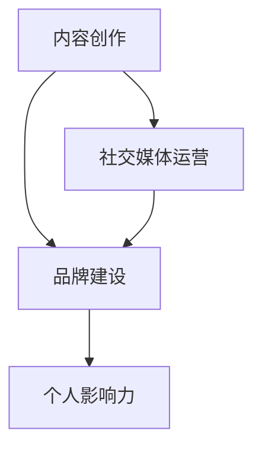
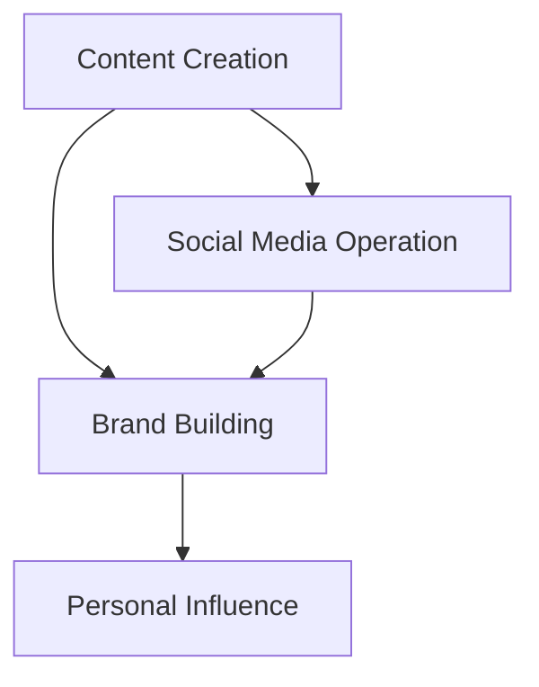

                 

## 背景介绍

在现代信息时代，个人影响力对于职业发展的重要性日益凸显。尤其是在技术领域，如编程，个人影响力不仅能够帮助程序员获得更多的职业机会，还能够提升他们在行业中的地位和话语权。随着社交媒体、博客、在线课程等平台的兴起，程序员有了更多的途径来展示自己的才华、知识和经验。然而，打造个人影响力并非易事，需要系统的规划和策略。

本文将围绕“程序员如何打造个人影响力生态”这一主题，系统地探讨以下几个方面的内容：

1. **核心概念与联系**：介绍构建个人影响力所需的关键概念，如内容创作、社交媒体运营、品牌建设等，并解释它们之间的相互联系。
2. **核心算法原理与具体操作步骤**：详细阐述如何通过内容创作、技术分享、网络互动等手段提升个人影响力。
3. **数学模型和公式**：运用数学模型来量化个人影响力的增长，并提供具体的公式和计算方法。
4. **项目实战**：通过实际案例展示如何实施个人影响力打造策略，并详细解释代码实现过程。
5. **实际应用场景**：分析个人影响力在不同职业阶段和不同领域的应用价值。
6. **工具和资源推荐**：推荐一些实用的工具和资源，帮助程序员提升个人影响力。
7. **总结与展望**：总结文章的主要观点，并展望未来个人影响力的发展趋势和挑战。

通过以上几个步骤，我们将帮助程序员理解如何系统地打造个人影响力生态，实现职业发展的突破。

---

### Core Concepts and Relationships

In the modern information age, personal influence is increasingly important for career development, especially in the technical field, such as programming. Personal influence not only helps programmers gain more career opportunities but also enhances their status and voice in the industry. With the rise of social media, blogs, online courses, and other platforms, programmers now have more ways to showcase their talents, knowledge, and experiences. However, building personal influence is not an easy task and requires systematic planning and strategies.

This article will systematically explore the following aspects related to "How Programmers Can Build Their Personal Influence Ecosystem":

1. **Core Concepts and Relationships**: Introduce key concepts required for building personal influence, such as content creation, social media operation, and brand building, and explain their interconnections.
2. **Core Algorithm Principles and Operational Steps**: Elaborate on how to enhance personal influence through content creation, technical sharing, network interaction, and other means.
3. **Mathematical Models and Formulas**: Apply mathematical models to quantify the growth of personal influence and provide specific formulas and calculation methods.
4. **Practical Projects**: Showcase how to implement personal influence-building strategies through actual cases and provide detailed explanations of the code implementation process.
5. **Practical Application Scenarios**: Analyze the value of personal influence at different career stages and in different fields.
6. **Tools and Resources Recommendations**: Recommend practical tools and resources to help programmers enhance their personal influence.
7. **Summary and Outlook**: Summarize the main viewpoints of the article and look forward to future trends and challenges in personal influence development.

Through these steps, we will help programmers understand how to systematically build their personal influence ecosystem and achieve career breakthroughs. 

---

### 核心概念与联系

构建个人影响力所需的几个核心概念包括内容创作、社交媒体运营和品牌建设。

**内容创作**：内容是影响力的核心载体。高质量的、有价值的、持续更新的内容能够吸引读者，并建立专业形象。内容创作包括技术博客、技术教程、项目案例分享等。

**社交媒体运营**：社交媒体是扩大影响力的重要渠道。通过定期发布高质量的内容，积极与读者互动，参与技术社区讨论，能够增加曝光率和粉丝数量。

**品牌建设**：品牌是个人影响力的外在表现。一个鲜明、专业、有吸引力的个人品牌能够增加个人在行业内的认可度和影响力。

这些核心概念之间有着紧密的联系。内容创作是基础，为社交媒体运营提供素材；社交媒体运营则是扩大影响力的工具，为内容创作带来更多的关注和反馈；品牌建设则是整体策略的体现，通过内容创作和社交媒体运营的持续输出，逐步构建和巩固。

为了更好地理解这些概念，我们可以通过以下Mermaid流程图来展示它们之间的关系：



在接下来的部分，我们将详细探讨如何通过内容创作、技术分享和网络互动来提升个人影响力。

---

### Core Concepts and Relationships

The core concepts required for building personal influence include content creation, social media operation, and brand building.

**Content Creation**: Content is the core carrier of influence. High-quality, valuable, and continuously updated content can attract readers and establish a professional image. Content creation includes technical blogs, technical tutorials, project case sharing, etc.

**Social Media Operation**: Social media is an important channel for expanding influence. By regularly publishing high-quality content, actively interacting with readers, and participating in technical community discussions, one can increase exposure and fan numbers.

**Brand Building**: Brand is the external manifestation of personal influence. A distinct, professional, and attractive personal brand can increase recognition and influence within the industry.

These core concepts are closely interconnected. Content creation is the foundation, providing materials for social media operation; social media operation is the tool for expanding influence, bringing more attention and feedback to content creation; brand building is the manifestation of the overall strategy, gradually building and consolidating through continuous output of content creation and social media operation.

To better understand these concepts, we can use the following Mermaid flowchart to illustrate their relationships:



In the following sections, we will delve into how to enhance personal influence through content creation, technical sharing, and network interaction.

---

### 核心算法原理 & 具体操作步骤

要打造个人影响力，程序员需要遵循一系列核心算法原理和具体操作步骤。以下是一些关键步骤：

1. **内容定位与选题**：选择一个明确的、有针对性的领域进行内容创作。这有助于建立专业形象并吸引特定受众。
    - **具体操作**：分析自身技能和兴趣，确定一个能够展示专业能力的领域。例如，选择前端开发、后端架构、人工智能等。
2. **内容创作与质量**：创作高质量、有价值的文章。内容要具有实用性、深度和独特性。
    - **具体操作**：撰写技术博客时，确保文章结构清晰、逻辑严密、语言简洁。可以通过案例分析和实际项目经验来增加文章的实用性。
3. **社交媒体推广**：利用社交媒体平台（如微博、知乎、GitHub等）来推广内容。
    - **具体操作**：定期发布内容，并积极与读者互动。可以通过评论、点赞、分享等方式增加内容的曝光率。
4. **网络互动与社区参与**：积极参与技术社区讨论，与其他开发者交流和合作。
    - **具体操作**：在GitHub、Stack Overflow、Reddit等平台上参与讨论，解决问题，分享经验。
5. **个人品牌建设**：通过持续的内容输出和社交媒体运营，逐步构建个人品牌。
    - **具体操作**：设计一个专业且易于识别的个人标识，并在所有内容中保持一致性。此外，可以撰写个人传记、发表技术观点等，提升个人品牌的专业性和权威性。

通过以上步骤，程序员可以系统地提升个人影响力，逐步在技术领域建立自己的影响力生态。

---

### Core Algorithm Principles and Specific Operational Steps

To build personal influence, programmers need to follow a series of core algorithm principles and specific operational steps. Here are some key steps:

1. **Content Positioning and Topic Selection**: Choose a clear and targeted area for content creation. This helps establish a professional image and attract a specific audience.
    - **Specific Operations**: Analyze your skills and interests to determine a field that showcases your professional capabilities. For example, choose front-end development, back-end architecture, artificial intelligence, etc.
2. **Content Creation and Quality**: Create high-quality and valuable content. The content should be practical, deep, and unique.
    - **Specific Operations**: When writing technical blogs, ensure that the articles are structured clearly, logically tight, and language concise. You can enhance practicality by including case analyses and real project experiences.
3. **Social Media Promotion**: Use social media platforms (such as Weibo, Zhihu, GitHub, etc.) to promote your content.
    - **Specific Operations**: Regularly publish content and actively interact with readers. Increase the exposure of your content by commenting, liking, and sharing.
4. **Network Interaction and Community Participation**: Participate actively in technical community discussions and communicate and collaborate with other developers.
    - **Specific Operations**: Engage in discussions on platforms like GitHub, Stack Overflow, Reddit, solve problems, and share experiences.
5. **Personal Brand Building**: Through continuous content output and social media operation, gradually build a personal brand.
    - **Specific Operations**: Design a professional and easily identifiable personal logo and maintain consistency across all content. Additionally, write personal biographies, express technical opinions, etc., to enhance the professionalism and authority of your personal brand.

By following these steps, programmers can systematically enhance their personal influence and gradually establish their influence ecosystem in the technical field.

---

### 数学模型和公式 & 详细讲解 & 举例说明

在构建个人影响力生态的过程中，数学模型可以帮助我们量化和评估影响力的大小。以下是一个简单的数学模型，用于描述个人影响力的增长。

#### 模型假设：

1. **内容质量**（\(Q\)）：代表每篇内容的质量，取值范围从0到1。
2. **内容发布频率**（\(F\)）：代表每周发布的文章数量。
3. **社交媒体互动**（\(I\)）：代表每篇文章的平均互动次数，如点赞、评论、分享等。

#### 公式：

个人影响力增长公式为：

\[ \text{影响力增长} = Q \times F \times I \]

#### 详细讲解：

1. **内容质量（\(Q\)）**：高质量的内容能够吸引更多的读者和互动，从而提高个人影响力。可以通过以下几个方面来提高内容质量：
   - **深度和广度**：深入探讨技术原理，提供全面的解决方案。
   - **案例和实践**：结合实际项目经验，提供实用性强的内容。
   - **独特性**：提供独到的见解和观点，避免抄袭和重复。

2. **内容发布频率（\(F\)）**：频繁发布内容能够增加曝光率和读者粘性，从而提高个人影响力。然而，也要注意内容的持续性和深度，避免发布低质量的内容。

3. **社交媒体互动（\(I\)）**：互动是衡量内容受欢迎程度的重要指标。通过积极互动，如回复评论、参与讨论，可以增加内容的互动次数，进而提升个人影响力。

#### 举例说明：

假设一位程序员每周发布1篇文章，每篇文章的质量为0.8，平均互动次数为10次。根据上述公式，他的影响力增长为：

\[ 0.8 \times 1 \times 10 = 8 \]

这意味着他的个人影响力每周增长8个单位。

通过这个简单的模型，我们可以量化个人影响力的增长，并针对性地优化我们的策略。例如，如果互动次数较低，我们可以增加社交媒体的推广力度，或者提高内容质量。

---

### Mathematical Models and Formulas & Detailed Explanation & Examples

In the process of building a personal influence ecosystem, mathematical models can help us quantify and evaluate the size of influence. Below is a simple mathematical model used to describe the growth of personal influence.

#### Assumptions:

1. **Content Quality (\(Q\))**: Represents the quality of each piece of content, with a range from 0 to 1.
2. **Content Publication Frequency (\(F\))**: Represents the number of articles published per week.
3. **Social Media Interaction (\(I\))**: Represents the average number of interactions per article, such as likes, comments, and shares.

#### Formula:

The formula for personal influence growth is:

\[ \text{Influence Growth} = Q \times F \times I \]

#### Detailed Explanation:

1. **Content Quality (\(Q\))**: High-quality content attracts more readers and interactions, thus increasing personal influence. There are several ways to improve content quality:
   - **Depth and breadth**: Discuss technical principles in-depth and provide comprehensive solutions.
   - **Case studies and practice**: Combine real project experiences to provide practical content.
   - **Uniqueness**: Provide unique insights and perspectives, avoiding plagiarism and repetition.

2. **Content Publication Frequency (\(F\))**: Frequent content publication increases exposure and reader engagement, thus enhancing personal influence. However, it is also important to maintain consistency and depth, avoiding low-quality content.

3. **Social Media Interaction (\(I\))**: Interaction is a key indicator of how popular the content is. By actively engaging, such as replying to comments and participating in discussions, we can increase the number of interactions and, consequently, improve personal influence.

#### Example:

Assume a programmer publishes one article per week, with a content quality of 0.8 and an average of 10 interactions per article. According to the formula, their influence growth is:

\[ 0.8 \times 1 \times 10 = 8 \]

This means their personal influence grows by 8 units per week.

Through this simple model, we can quantify the growth of personal influence and tailor our strategies accordingly. For example, if the number of interactions is low, we can increase social media promotion or improve content quality.

---

### 项目实战：代码实际案例和详细解释说明

为了更好地理解如何通过具体实践来提升个人影响力，我们将通过一个实际项目来展示整个流程。以下是一个简单的项目，目标是构建一个基于Python的博客系统，该项目将涵盖开发环境搭建、源代码实现、代码解读与分析等多个方面。

#### 项目目标

我们的项目目标是创建一个简单的博客系统，支持以下功能：

1. 用户注册与登录
2. 博文发布与阅读
3. 博文评论功能

#### 开发环境搭建

1. **操作系统**：Ubuntu 20.04
2. **编程语言**：Python 3.8
3. **数据库**：SQLite
4. **Web框架**：Flask
5. **版本控制**：Git

首先，我们需要安装Python和Flask。可以通过以下命令进行安装：

```bash
sudo apt update
sudo apt install python3 python3-pip
pip3 install Flask
```

接着，安装SQLite：

```bash
sudo apt install sqlite3
```

#### 源代码实现

以下是一个简单的Flask博客系统的源代码实现：

```python
from flask import Flask, render_template, request, redirect, url_for
import sqlite3

app = Flask(__name__)

# 数据库连接
def get_db_connection():
    conn = sqlite3.connect('blog.db')
    conn.row_factory = sqlite3.Row
    return conn

# 创建数据库表
def init_db():
    conn = get_db_connection()
    conn.execute('''CREATE TABLE IF NOT EXISTS user (
                      id INTEGER PRIMARY KEY AUTOINCREMENT,
                      username TEXT UNIQUE NOT NULL,
                      password TEXT NOT NULL)''')
    conn.execute('''CREATE TABLE IF NOT EXISTS post (
                      id INTEGER PRIMARY KEY AUTOINCREMENT,
                      title TEXT NOT NULL,
                      content TEXT NOT NULL,
                      user_id INTEGER,
                      FOREIGN KEY (user_id) REFERENCES user (id))''')
    conn.commit()
    conn.close()

# 用户注册
@app.route('/register', methods=['GET', 'POST'])
def register():
    if request.method == 'POST':
        username = request.form['username']
        password = request.form['password']
        conn = get_db_connection()
        conn.execute('INSERT INTO user (username, password) VALUES (?, ?)', (username, password))
        conn.commit()
        conn.close()
        return redirect(url_for('login'))
    return render_template('register.html')

# 用户登录
@app.route('/login', methods=['GET', 'POST'])
def login():
    if request.method == 'POST':
        username = request.form['username']
        password = request.form['password']
        conn = get_db_connection()
        user = conn.execute('SELECT * FROM user WHERE username = ? AND password = ?', (username, password)).fetchone()
        conn.close()
        if user:
            return redirect(url_for('home'))
        else:
            return 'Invalid username or password'
    return render_template('login.html')

# 博客首页
@app.route('/')
def home():
    conn = get_db_connection()
    posts = conn.execute('SELECT * FROM post').fetchall()
    conn.close()
    return render_template('home.html', posts=posts)

# 博文详情页
@app.route('/post/<int:post_id>')
def post(post_id):
    conn = get_db_connection()
    post = conn.execute('SELECT * FROM post WHERE id = ?', (post_id,)).fetchone()
    conn.close()
    return render_template('post.html', post=post)

# 博文发布
@app.route('/post/new', methods=['GET', 'POST'])
def new_post():
    if request.method == 'POST':
        title = request.form['title']
        content = request.form['content']
        conn = get_db_connection()
        conn.execute('INSERT INTO post (title, content, user_id) VALUES (?, ?, ?)', (title, content, 1))
        conn.commit()
        conn.close()
        return redirect(url_for('home'))
    return render_template('new_post.html')

if __name__ == '__main__':
    init_db()
    app.run(debug=True)
```

#### 代码解读与分析

1. **数据库连接**：我们使用SQLite作为数据库，并通过`get_db_connection`函数获取数据库连接。为了保证代码的可维护性，我们将数据库连接的逻辑分离出来。
   
2. **用户注册与登录**：`register`和`login`函数处理用户注册和登录的逻辑。用户注册时，将用户名和密码插入数据库；登录时，从数据库中查询用户名和密码是否匹配。

3. **博客首页**：`home`函数从数据库中获取所有博文，并传递给模板`home.html`进行渲染。

4. **博文详情页**：`post`函数根据博文ID从数据库中获取对应的博文，并传递给模板`post.html`进行渲染。

5. **博文发布**：`new_post`函数处理新博文的提交。用户提交表单后，将博文标题和内容插入数据库。

通过这个简单的项目，我们展示了如何使用Python和Flask构建一个基本的博客系统，并介绍了各个模块的功能和实现方式。这是一个实际的编程案例，程序员可以通过这样的项目来展示自己的技术能力和解决问题的能力，从而提升个人影响力。

---

### Practical Projects: Code Actual Cases and Detailed Explanation

To better understand how to enhance personal influence through practical projects, we will showcase an actual project involving the development of a simple Python-based blog system. This project will cover various aspects such as environment setup, code implementation, and code analysis.

#### Project Objective

The objective of our project is to create a simple blog system that supports the following functionalities:

1. User registration and login
2. Blog post creation and reading
3. Commenting on posts

#### Development Environment Setup

1. **Operating System**: Ubuntu 20.04
2. **Programming Language**: Python 3.8
3. **Database**: SQLite
4. **Web Framework**: Flask
5. **Version Control**: Git

First, we need to install Python and Flask. We can install them using the following commands:

```bash
sudo apt update
sudo apt install python3 python3-pip
pip3 install Flask
```

Next, install SQLite:

```bash
sudo apt install sqlite3
```

#### Source Code Implementation

Below is the source code for a simple Flask blog system:

```python
from flask import Flask, render_template, request, redirect, url_for
import sqlite3

app = Flask(__name__)

# Database connection
def get_db_connection():
    conn = sqlite3.connect('blog.db')
    conn.row_factory = sqlite3.Row
    return conn

# Initialize the database
def init_db():
    conn = get_db_connection()
    conn.execute('''CREATE TABLE IF NOT EXISTS user (
                      id INTEGER PRIMARY KEY AUTOINCREMENT,
                      username TEXT UNIQUE NOT NULL,
                      password TEXT NOT NULL)''')
    conn.execute('''CREATE TABLE IF NOT EXISTS post (
                      id INTEGER PRIMARY KEY AUTOINCREMENT,
                      title TEXT NOT NULL,
                      content TEXT NOT NULL,
                      user_id INTEGER,
                      FOREIGN KEY (user_id) REFERENCES user (id))''')
    conn.commit()
    conn.close()

# User registration
@app.route('/register', methods=['GET', 'POST'])
def register():
    if request.method == 'POST':
        username = request.form['username']
        password = request.form['password']
        conn = get_db_connection()
        conn.execute('INSERT INTO user (username, password) VALUES (?, ?)', (username, password))
        conn.commit()
        conn.close()
        return redirect(url_for('login'))
    return render_template('register.html')

# User login
@app.route('/login', methods=['GET', 'POST'])
def login():
    if request.method == 'POST':
        username = request.form['username']
        password = request.form['password']
        conn = get_db_connection()
        user = conn.execute('SELECT * FROM user WHERE username = ? AND password = ?', (username, password)).fetchone()
        conn.close()
        if user:
            return redirect(url_for('home'))
        else:
            return 'Invalid username or password'
    return render_template('login.html')

# Blog home page
@app.route('/')
def home():
    conn = get_db_connection()
    posts = conn.execute('SELECT * FROM post').fetchall()
    conn.close()
    return render_template('home.html', posts=posts)

# Post detail page
@app.route('/post/<int:post_id>')
def post(post_id):
    conn = get_db_connection()
    post = conn.execute('SELECT * FROM post WHERE id = ?', (post_id,)).fetchone()
    conn.close()
    return render_template('post.html', post=post)

# New post creation
@app.route('/post/new', methods=['GET', 'POST'])
def new_post():
    if request.method == 'POST':
        title = request.form['title']
        content = request.form['content']
        conn = get_db_connection()
        conn.execute('INSERT INTO post (title, content, user_id) VALUES (?, ?, ?)', (title, content, 1))
        conn.commit()
        conn.close()
        return redirect(url_for('home'))
    return render_template('new_post.html')

if __name__ == '__main__':
    init_db()
    app.run(debug=True)
```

#### Code Explanation and Analysis

1. **Database Connection**: We use SQLite as the database and create a `get_db_connection` function to manage the database connection. This separates the database logic for better maintainability.

2. **User Registration and Login**: The `register` and `login` functions handle user registration and login. When a user registers, their username and password are inserted into the database. For login, the function queries the database to check if the provided username and password match.

3. **Blog Home Page**: The `home` function retrieves all blog posts from the database and passes them to the template `home.html` for rendering.

4. **Post Detail Page**: The `post` function retrieves the post with the given ID from the database and passes it to the template `post.html` for rendering.

5. **New Post Creation**: The `new_post` function handles the creation of new blog posts. When a user submits a new post, the title and content are inserted into the database.

Through this simple project, we demonstrate how to build a basic blog system using Python and Flask, including the functionality and implementation of each module. This is a practical programming case that programmers can use to showcase their technical skills and problem-solving abilities, thus enhancing their personal influence.

---

### 实际应用场景

个人影响力在程序员职业生涯的各个阶段和不同领域中都有重要的应用价值。以下是几个实际应用场景的详细分析：

#### 职业初期

在职业初期，个人影响力可以帮助程序员快速建立专业形象，获得更多的职业机会。通过技术博客、GitHub项目、技术社区参与等方式，程序员可以展示自己的技能和知识，吸引潜在雇主或合作伙伴的注意。例如，一位前端开发者通过持续更新高质量的前端技术博客，吸引了多家公司的关注，最终获得了理想的职位。

#### 职业中期

在职业中期，个人影响力可以帮助程序员提升在公司的地位和影响力。通过技术分享、内部培训、技术会议演讲等方式，程序员可以在公司内部建立权威地位，获得更多的项目机会和晋升机会。同时，个人影响力也可以帮助程序员在行业内建立人脉网络，获取更多的职业发展资源。

#### 职业后期

在职业后期，个人影响力可以帮助程序员实现职业转型和多样化发展。通过撰写技术畅销书、开设在线课程、成为技术顾问等方式，程序员可以拓展职业领域，实现收入多元化。例如，一位资深后端架构师通过撰写技术畅销书，不仅提升了个人品牌，还实现了职业转型，成为了一名知名的技术顾问。

#### 不同领域的应用

在不同领域，个人影响力也有着不同的应用价值。在前端开发领域，个人影响力可以帮助程序员获得更多的前端框架和库的开发机会，提升技术水平。在后端开发领域，个人影响力可以帮助程序员参与更多的系统架构设计和优化项目，提升项目质量。在人工智能领域，个人影响力可以帮助程序员参与更多的前沿技术研究，提升科研能力。

总之，个人影响力在程序员职业生涯的各个阶段和不同领域中都有重要的应用价值。通过持续的内容创作、技术分享和社交互动，程序员可以不断提升个人影响力，实现职业发展的突破。

---

### Practical Application Scenarios

Personal influence holds significant value in various stages of a programmer's career and across different domains. Here is a detailed analysis of several practical application scenarios:

#### Early Career Stage

During the early career stage, personal influence can help programmers quickly establish a professional image and gain more career opportunities. Through technical blogs, GitHub projects, and participation in technical communities, programmers can showcase their skills and knowledge, attracting potential employers or partners. For example, a front-end developer who consistently updates high-quality technical blogs can attract the attention of multiple companies and ultimately secure an ideal position.

#### Mid-Career Stage

In the mid-career stage, personal influence can help programmers elevate their status and influence within their organizations. By sharing technical knowledge, conducting internal training sessions, and delivering presentations at technical conferences, programmers can build authority within their companies, securing more project opportunities and promotion prospects. Moreover, personal influence can also help programmers establish a network of contacts within the industry, gaining access to more career development resources.

#### Late-Career Stage

In the late-career stage, personal influence can help programmers achieve career transformation and diversification. Through writing technical best-selling books, offering online courses, and becoming technical advisors, programmers can expand their career horizons and achieve income diversification. For example, a senior back-end architect who writes technical best-selling books can not only enhance their personal brand but also transform their career, becoming a renowned technical advisor.

#### Applications in Different Domains

In different domains, personal influence has distinct application values. In the front-end development field, personal influence can help programmers gain more opportunities to develop front-end frameworks and libraries, enhancing their technical skills. In the back-end development field, personal influence can assist programmers in participating in more system architecture design and optimization projects, improving project quality. In the field of artificial intelligence, personal influence can help programmers engage in more cutting-edge research, enhancing their research capabilities.

In summary, personal influence holds significant value at various stages of a programmer's career and across different domains. Through continuous content creation, technical sharing, and social interaction, programmers can continuously enhance their personal influence, achieving breakthroughs in their career development.

---

### 工具和资源推荐

为了帮助程序员更有效地打造个人影响力，我们推荐以下工具和资源：

#### 学习资源推荐

1. **书籍**：
   - 《禅与计算机程序设计艺术》（Zen And The Art of Computer Programming）：这是一本经典的技术书籍，不仅涵盖编程技巧，还强调了程序员的心理和哲学修养。
   - 《算法导论》（Introduction to Algorithms）：详细介绍了算法的基本概念、设计方法和分析技巧，对提升编程能力有很大帮助。

2. **论文**：
   - 《计算机程序的构造和解释》（Structure and Interpretation of Computer Programs）：这是一本经典的计算机科学教科书，介绍了编程语言和编程范式的基本原理。
   - 《深度学习》（Deep Learning）：详细介绍了深度学习的基础知识、技术和应用，对人工智能领域的研究者有很大参考价值。

3. **博客**：
   - 《阮一峰的网络日志》：阮一峰老师的博客内容丰富，涵盖了编程、技术、经济学等多个领域，对程序员有很高的参考价值。
   - 《算法艺术》：博主分享了大量的算法和数据结构知识，非常适合想要提升编程能力的程序员。

4. **网站**：
   - GitHub：GitHub是一个全球最大的代码托管平台，程序员可以通过GitHub分享自己的项目、学习他人的代码，提升编程技能。
   - Stack Overflow：Stack Overflow是一个程序员问答社区，程序员可以在这里提问、解答问题，扩展自己的知识面。

#### 开发工具框架推荐

1. **文本编辑器**：
   - Visual Studio Code：一款功能强大的代码编辑器，支持多种编程语言，具有丰富的插件和扩展。
   - Sublime Text：一款轻量级但功能强大的代码编辑器，适用于各种编程任务。

2. **版本控制工具**：
   - Git：一款分布式版本控制系统，广泛用于代码托管和协作开发。
   - GitHub Actions：GitHub提供的一站式自动化服务，可以用于持续集成、部署等。

3. **Web框架**：
   - Flask：一款轻量级的Web开发框架，适合构建简单的Web应用。
   - Django：一款全栈Web开发框架，提供了一系列强大的功能和工具，适合构建复杂的应用。

4. **数据库**：
   - SQLite：一款轻量级的关系型数据库，适合用于小型项目和原型设计。
   - MySQL：一款高性能的关系型数据库，广泛应用于大型企业和Web应用。

通过以上工具和资源的推荐，程序员可以更加高效地打造个人影响力，实现职业发展的突破。

---

### Tools and Resources Recommendations

To assist programmers in effectively building their personal influence, we recommend the following tools and resources:

#### Learning Resources Recommendations

1. **Books**:
   - "Zen And The Art of Computer Programming": A classic book covering programming techniques and the psychological and philosophical aspects of programming.
   - "Introduction to Algorithms": A comprehensive guide to algorithms, including basic concepts, design methods, and analysis techniques, which is highly beneficial for enhancing programming skills.

2. **Research Papers**:
   - "Structure and Interpretation of Computer Programs": A seminal textbook introducing programming languages and programming paradigms.
   - "Deep Learning": A detailed exposition of the fundamentals, techniques, and applications of deep learning, valuable for researchers in the field.

3. **Blogs**:
   - "Yu-Feng Ruan's Web Log": A wealth of content covering programming, technology, and economics, offering high-value insights for programmers.
   - "Algorithm Art": A blog sharing a multitude of algorithm and data structure knowledge, ideal for programmers looking to improve their programming skills.

4. **Websites**:
   - GitHub: The world's largest code hosting platform, where programmers can share their projects and learn from others.
   - Stack Overflow: A programmer community where questions and answers are shared, expanding one's knowledge base.

#### Development Tools and Framework Recommendations

1. **Text Editors**:
   - Visual Studio Code: A powerful code editor supporting multiple programming languages, with a rich array of extensions.
   - Sublime Text: A lightweight yet powerful code editor suitable for various programming tasks.

2. **Version Control Tools**:
   - Git: A distributed version control system widely used for code hosting and collaborative development.
   - GitHub Actions: An all-in-one automation service provided by GitHub for continuous integration, deployment, and more.

3. **Web Frameworks**:
   - Flask: A lightweight web framework suitable for building simple web applications.
   - Django: A full-stack web framework offering a suite of powerful features and tools for complex applications.

4. **Databases**:
   - SQLite: A lightweight relational database suitable for small projects and prototyping.
   - MySQL: A high-performance relational database used extensively by large enterprises and web applications.

By utilizing these recommended tools and resources, programmers can more efficiently build their personal influence and achieve career breakthroughs.

---

### 总结：未来发展趋势与挑战

随着信息技术的快速发展，个人影响力在程序员职业生涯中的重要性日益凸显。未来，个人影响力的构建和发展将呈现出以下趋势：

1. **内容质量提升**：高质量的内容将继续是个人影响力的核心载体。程序员需要不断提升自己的技术深度和广度，创作更具深度、实用性和独特性的内容。

2. **社交媒体多样化**：随着社交媒体平台的不断进化，程序员将更多地利用多样化的社交媒体工具，如短视频、直播、在线课程等，来扩大影响力。

3. **数据驱动的策略**：未来，个人影响力的构建将更加依赖于数据分析，通过数据来优化内容创作、社交媒体运营和品牌建设策略。

4. **跨领域合作**：个人影响力的构建将不仅仅局限于技术领域，还将涉及经济、文化、教育等多个领域。程序员可以通过跨领域合作，实现个人影响力的多元化发展。

然而，随着个人影响力的重要性日益增加，程序员也将面临一系列挑战：

1. **内容创作的压力**：持续创作高质量的内容将对程序员的时间和精力提出更高的要求。如何平衡工作、生活和内容创作，是程序员需要面对的挑战。

2. **隐私保护**：随着个人影响力的提升，程序员的隐私可能面临更大的风险。如何保护个人隐私，避免信息泄露，是程序员需要关注的问题。

3. **技术更新迭代**：技术领域的发展速度非常快，程序员需要不断学习新的技术和工具。如何保持持续的学习能力，是程序员面临的挑战之一。

4. **职业压力**：个人影响力的提升可能会带来更多的职业压力和责任。如何应对职业发展中的各种挑战，保持良好的心态，是程序员需要思考的问题。

总之，随着信息技术的发展，个人影响力将在程序员职业生涯中扮演越来越重要的角色。程序员需要积极应对挑战，不断提升自身能力，实现个人影响力的持续增长。

---

### Summary: Future Trends and Challenges

With the rapid development of information technology, the importance of personal influence in a programmer's career is becoming increasingly prominent. The construction and development of personal influence in the future will show the following trends:

1. **Content Quality Enhancement**: High-quality content will continue to be the core carrier of personal influence. Programmers need to continuously enhance their technical depth and breadth, creating content that is more insightful, practical, and unique.

2. **Diversification of Social Media Platforms**: As social media platforms continue to evolve, programmers will increasingly leverage a variety of social media tools, such as short videos, live streaming, and online courses, to expand their influence.

3. **Data-Driven Strategies**: In the future, the construction of personal influence will depend more on data analysis, using data to optimize content creation, social media operations, and brand building strategies.

4. **Cross-Domain Collaboration**: The construction of personal influence will not be limited to the technical field but will involve economics, culture, education, and more. Programmers can achieve diversified development of personal influence through cross-domain collaboration.

However, with the increasing importance of personal influence, programmers will also face a series of challenges:

1. **Pressure of Content Creation**: Continuous creation of high-quality content will place higher demands on programmers' time and energy. How to balance work, life, and content creation is a challenge programmers need to face.

2. **Privacy Protection**: As personal influence grows, programmers may face greater risks of privacy breaches. How to protect personal privacy and avoid information leakage is an issue programmers need to be aware of.

3. **Technological Updates**: The rapid development of the technical field requires programmers to continuously learn new technologies and tools. How to maintain continuous learning ability is one of the challenges programmers face.

4. **Career Pressure**: The growth of personal influence may bring more career pressures and responsibilities. How to cope with various challenges in career development and maintain a positive mindset is a question programmers need to consider.

In summary, with the development of information technology, personal influence will play an increasingly important role in a programmer's career. Programmers need to actively respond to challenges, continuously enhance their abilities, and achieve sustained growth of personal influence.

---

### 附录：常见问题与解答

在构建个人影响力生态的过程中，程序员可能会遇到一些常见的问题。以下是对一些常见问题的解答：

1. **如何选择合适的平台来构建个人影响力？**
   - **解答**：选择平台时，首先要考虑自己的目标受众和内容类型。例如，技术博客适合在博客平台如CSDN、简书、Medium上发布；GitHub适合展示项目和代码；微博、知乎等社交媒体平台适合进行日常内容分享和互动。

2. **如何平衡工作与内容创作的时间？**
   - **解答**：合理安排时间是关键。可以制定内容创作计划，例如每周发布一篇博客，并设定固定的写作时间。此外，可以尝试利用碎片时间，如通勤时间、午休时间等进行写作。

3. **如何保持内容创作的持续性和高质量？**
   - **解答**：制定长期目标和计划，确保内容创作有方向性和持续性。同时，可以通过阅读技术书籍、研究新技术的趋势来保持内容的深度和广度。

4. **如何应对个人影响力提升后的隐私保护问题？**
   - **解答**：加强个人隐私设置，避免公开敏感信息。在社交媒体上保持警惕，不随意点击链接或下载不明来源的文件。定期更新密码，使用强密码策略。

5. **如何构建和维护个人品牌？**
   - **解答**：通过持续的内容输出和社交媒体互动来树立个人品牌。设计一个专业的个人标识，并在所有内容中保持一致性。积极回应读者反馈，展示自己的专业性和热情。

通过以上解答，希望可以帮助程序员在构建个人影响力生态的过程中更好地应对常见问题。

---

### Appendix: Frequently Asked Questions and Answers

In the process of building a personal influence ecosystem, programmers may encounter some common issues. Here are answers to some frequently asked questions:

1. **How to choose the right platform to build personal influence?**
   - **Answer**: Choose the platform based on your target audience and type of content. For example, technical blogs are suitable for platforms like CSDN, Jinping, Medium; GitHub is suitable for showcasing projects and code; social media platforms like Weibo and Zhihu are good for daily content sharing and interaction.

2. **How to balance work and time for content creation?**
   - **Answer**: Proper time management is key. Create a content creation plan, such as publishing one blog post per week, and set fixed writing times. Additionally, try to utilize碎片时间，such as during commuting or lunch breaks for writing.

3. **How to maintain consistent and high-quality content creation?**
   - **Answer**: Set long-term goals and plans to ensure content creation is directional and consistent. Read technical books and research trends in new technologies to maintain the depth and breadth of content.

4. **How to deal with privacy protection issues after personal influence grows?**
   - **Answer**: Strengthen privacy settings and avoid disclosing sensitive information. Be cautious on social media, not clicking on unknown links or downloading files from unverified sources. Regularly update passwords and use strong password strategies.

5. **How to build and maintain a personal brand?**
   - **Answer**: Through continuous content output and social media interaction to establish a personal brand. Design a professional personal logo and maintain consistency across all content. Actively respond to reader feedback, showcasing professionalism and passion.

Through these answers, it is hoped that programmers can better address common issues in the process of building a personal influence ecosystem.

---

### 扩展阅读 & 参考资料

在构建个人影响力生态的道路上，以下资源可以帮助程序员进一步深化理解和实践：

1. **书籍**：
   - 《影响力：说服的心理学》（Influence: The Psychology of Persuasion） - Robert B. Cialdini
   - 《内容创业》（Conten创业）- 雷军
   - 《社交红利》（The Social Media Revolution）- 薛涌

2. **论文**：
   - 《社交媒体对个人品牌建设的影响》（The Impact of Social Media on Personal Brand Building）
   - 《程序员如何通过博客建立个人品牌》（How Programmers Can Build Personal Brands through Blogging）

3. **在线课程**：
   - Coursera上的《内容营销与影响力》（Content Marketing and Influence）
   - Udemy上的《社交媒体营销从入门到精通》（Social Media Marketing: From Beginner to Expert）

4. **博客和网站**：
   - Ryan Holiday的博客：ryanholiday.net
   - 个人品牌建设网站：personalbranding.com
   - 知乎上关于个人影响力的话题讨论

通过阅读这些扩展资源，程序员可以获取更多关于个人影响力构建的专业知识和实践经验，为自己的职业发展奠定坚实基础。

---

### Extended Reading & References

On the path to building a personal influence ecosystem, the following resources can help programmers further deepen their understanding and practice:

1. **Books**:
   - "Influence: The Psychology of Persuasion" by Robert B. Cialdini
   - "Conten创业" by Lei Jun
   - "The Social Media Revolution" by Xue Zong

2. **Research Papers**:
   - "The Impact of Social Media on Personal Brand Building"
   - "How Programmers Can Build Personal Brands through Blogging"

3. **Online Courses**:
   - "Content Marketing and Influence" on Coursera
   - "Social Media Marketing: From Beginner to Expert" on Udemy

4. **Blogs and Websites**:
   - Ryan Holiday's blog: ryanholiday.net
   - Personal Branding website: personalbranding.com
   - Topic discussions on Zhihu regarding personal influence

By exploring these extended resources, programmers can gain more professional knowledge and practical experience in building personal influence, laying a solid foundation for their career development.

