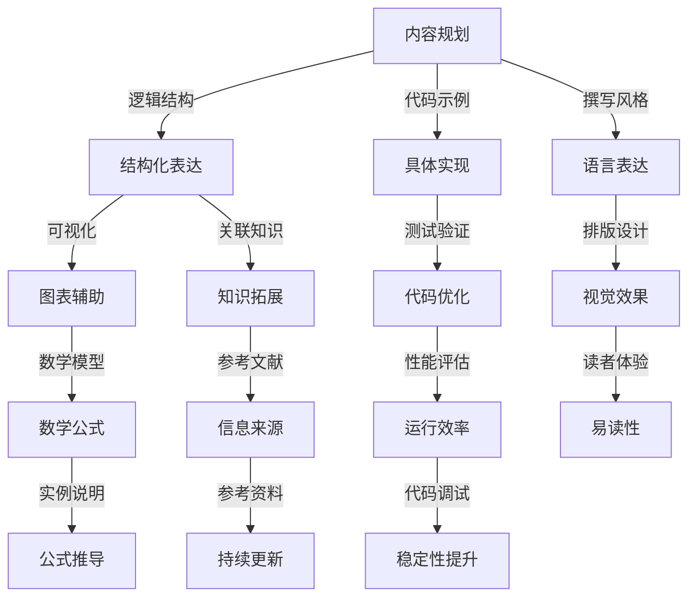

                 

### 背景介绍

在当今信息爆炸的时代，技术的飞速发展带来了无数的新机遇和挑战。作为程序员，我们不仅需要掌握各种编程语言和工具，还必须不断提升自身的专业素养，以适应不断变化的技术环境。然而，在日复一日的编程实践中，如何将自己的经验和知识系统化、结构化，并有效地传递给他人，成为了一个值得关注的问题。高质量的技术电子书不仅可以帮助我们巩固所学知识，还能为他人提供宝贵的学习资源。因此，本文旨在探讨程序员如何打造高质量的技术电子书，以便在技术传播和知识共享的过程中发挥更大的价值。

首先，我们需要明确，什么是高质量的技术电子书？高质量的技术电子书应当具备以下几个特点：内容系统全面、逻辑清晰易懂、语言简洁精炼、示例丰富实用。在此基础上，本文将分为以下几个部分进行详细探讨：

1. **核心概念与联系**：介绍构建高质量技术电子书所需的核心概念和原理，并通过Mermaid流程图展示它们之间的关系。
2. **核心算法原理与具体操作步骤**：深入探讨技术电子书编写中的核心算法原理，并详细讲解具体操作步骤。
3. **数学模型与公式**：介绍在技术电子书中常用的数学模型和公式，并通过实例进行详细讲解。
4. **项目实战**：通过实际案例，展示如何将理论应用到实践中，并进行详细解释说明。
5. **实际应用场景**：分析技术电子书在不同场景下的应用，以及其优势和挑战。
6. **工具和资源推荐**：推荐有助于编写高质量技术电子书的学习资源、开发工具和框架。
7. **总结与未来展望**：总结文章要点，并对技术电子书的发展趋势和挑战进行展望。

通过以上七个部分，我们将一步步分析推理，探讨程序员如何打造高质量的技术电子书，希望能为读者提供有价值的参考和指导。

---

### 核心概念与联系

在编写高质量的技术电子书之前，我们需要明确几个核心概念和它们之间的关系。以下是构建高质量技术电子书所需的核心概念及其相互关系的Mermaid流程图：



**内容规划**：内容规划是编写技术电子书的第一步，它决定了书的整体结构和逻辑顺序。一个清晰的内容规划可以帮助读者更好地理解和吸收知识。

**结构化表达**：在内容规划的基础上，我们需要进行结构化表达。结构化表达是指将内容按照逻辑顺序和层次结构进行组织，使读者能够轻松跟随作者的思路。

**图表辅助**：图表是技术电子书中不可或缺的一部分，它们能够直观地展示复杂的概念和算法，使读者更容易理解。

**具体实现**：在具体实现部分，我们需要通过代码示例来展示如何将理论应用到实际操作中。代码示例不仅要详尽，还需要有足够的注释，以便读者能够理解其背后的原理。

**代码优化**：代码示例在完成功能的同时，也需要进行优化。优化包括代码的可读性、性能和稳定性等方面的提升。

**数学模型和公式**：数学模型和公式是技术电子书中经常使用的一部分。它们不仅可以帮助我们理解和描述复杂的现象，还能提供解决问题的理论基础。

**实例说明和公式推导**：通过实例说明和公式推导，我们可以使读者更深入地理解数学模型和公式的应用场景和推导过程。

**撰写风格**：撰写风格决定了技术电子书的可读性和吸引力。一个良好的撰写风格应当简洁、清晰、易懂。

**排版设计和视觉效果**：良好的排版设计和视觉效果能够提升读者的阅读体验，使其更容易沉浸在技术内容中。

**读者体验**：读者体验是衡量技术电子书质量的重要指标。一个高质量的技术电子书应当能够满足读者的需求，为他们提供良好的阅读体验。

**性能评估**：性能评估是指对技术电子书的性能进行评估，包括加载速度、运行效率等方面。

**代码调试和稳定性提升**：在编写代码示例时，我们需要进行调试，确保代码的稳定性和正确性。

**知识拓展**：知识拓展是指对技术电子书中的知识点进行延伸和拓展，使读者能够更全面地了解相关领域。

**参考文献**：参考文献提供了技术电子书的信息来源，有助于读者进一步学习和研究。

**参考资料和持续更新**：参考资料和持续更新是保持技术电子书时效性和实用性的重要手段。

通过以上核心概念的介绍和Mermaid流程图的展示，我们可以更好地理解构建高质量技术电子书的各个要素及其相互关系。在接下来的部分，我们将进一步探讨这些核心概念的具体应用和操作步骤。

---

### 核心算法原理 & 具体操作步骤

在技术电子书的编写过程中，核心算法原理的阐述是至关重要的一环。核心算法不仅决定了电子书的技术深度和广度，还直接影响读者对知识点的理解和吸收。以下我们将详细讨论几个常见的核心算法原理，并提供具体的操作步骤，以便程序员能够将其应用到技术电子书的编写中。

#### 1. 冒泡排序（Bubble Sort）

**原理介绍**：冒泡排序是一种简单的排序算法，它通过多次遍历要排序的数组，比较相邻元素的大小，并按照指定的顺序（如升序或降序）进行交换，直到整个数组有序。

**操作步骤**：

1. **初始化**：读取数组，将其长度设为n。
2. **遍历**：从第一个元素开始，依次比较相邻的元素。
3. **交换**：如果前一个元素大于后一个元素（对于升序排序），则交换它们的位置。
4. **重复遍历和交换**：重复步骤2和3，直到整个数组有序。

**示例代码**（Python）：

```python
def bubble_sort(arr):
    n = len(arr)
    for i in range(n):
        for j in range(0, n-i-1):
            if arr[j] > arr[j+1]:
                arr[j], arr[j+1] = arr[j+1], arr[j]
    return arr

# 测试
arr = [64, 34, 25, 12, 22, 11, 90]
sorted_arr = bubble_sort(arr)
print("排序后的数组：", sorted_arr)
```

#### 2. 二分查找（Binary Search）

**原理介绍**：二分查找是一种高效的查找算法，它通过将有序数组分成两半，逐步缩小查找范围，直到找到目标元素或确定其不存在。

**操作步骤**：

1. **初始化**：读取待查找的元素和有序数组的起始和结束索引。
2. **计算中间索引**：每次计算当前查找范围的中间索引。
3. **比较**：将中间索引的元素与目标元素进行比较。
4. **调整范围**：如果目标元素大于中间元素，则在右半部分继续查找；如果目标元素小于中间元素，则在左半部分继续查找；如果目标元素等于中间元素，则查找成功。
5. **重复步骤2-4**：直到找到目标元素或确定其不存在。

**示例代码**（Python）：

```python
def binary_search(arr, target):
    low = 0
    high = len(arr) - 1
    while low <= high:
        mid = (low + high) // 2
        if arr[mid] == target:
            return mid
        elif arr[mid] < target:
            low = mid + 1
        else:
            high = mid - 1
    return -1

# 测试
arr = [2, 3, 4, 10, 40]
target = 10
result = binary_search(arr, target)
if result != -1:
    print("元素在数组中的索引为：", result)
else:
    print("元素不在数组中。")
```

#### 3. 动态规划（Dynamic Programming）

**原理介绍**：动态规划是一种解决最优化问题的方法，它通过将问题分解为子问题，并保存子问题的解，从而避免重复计算，提高算法效率。

**操作步骤**：

1. **定义状态**：根据问题定义状态，并确定状态之间的转移关系。
2. **初始化**：初始化状态转移表或数组。
3. **递推**：根据状态转移关系，递推计算各个状态的最优解。
4. **求解**：根据状态转移表或数组求解问题的最优解。

**示例代码**（Python）：

```python
def fib(n):
    if n <= 1:
        return n
    dp = [0] * (n+1)
    dp[1] = 1
    for i in range(2, n+1):
        dp[i] = dp[i-1] + dp[i-2]
    return dp[n]

# 测试
n = 9
print("第", n, "个斐波那契数是：", fib(n))
```

通过以上对冒泡排序、二分查找和动态规划等核心算法原理的介绍和具体操作步骤的讲解，我们可以更好地理解这些算法在技术电子书编写中的应用。这些算法不仅能够提高电子书的技术含量，还能帮助读者更好地理解和掌握相关技术概念。在接下来的部分，我们将进一步探讨数学模型和公式在技术电子书编写中的作用。

---

### 数学模型和公式 & 详细讲解 & 举例说明

在技术电子书的编写过程中，数学模型和公式是不可或缺的部分。它们不仅为算法提供了理论基础，还帮助读者更好地理解复杂的技术概念。本节将详细介绍一些常见数学模型和公式，并通过具体例子进行详细讲解。

#### 1. 最小生成树（Minimum Spanning Tree）

**定义**：最小生成树（MST）是指在一个加权无向连通图中，包含图中全部顶点的、权值之和最小的树。

**核心公式**：克鲁斯卡尔算法（Kruskal's Algorithm）中，用于选择边的关键公式是 \( w(u, v) \leq \text{MST权值} \)，其中 \( w(u, v) \) 是边 \( (u, v) \) 的权重。

**示例讲解**：假设有图如下：

```
  1 --- 2 (权重: 4)
  |     |
  3 --- 4 (权重: 3)
  |     |
  5 --- 6 (权重: 2)
```

首先，我们按权重从小到大排序边：\( (5,6), (3,4), (1,2) \)。然后，使用克鲁斯卡尔算法，依次添加边，直到包含所有顶点。

```
  1 --- 2 (权重: 4)
  |     |
  3 --- 4 (权重: 3)
  |     |
  5 --- 6 (权重: 2)
  |
  1 --- 6 (权重: 6，包含所有顶点)
```

最终的最小生成树权值为 \( 4 + 3 + 2 = 9 \)。

#### 2. 决策树（Decision Tree）

**定义**：决策树是一种树形结构，用于展示决策过程和结果。每个内部节点表示一个测试或决策，每个分支代表测试结果，每个叶子节点代表一个可能的决策结果。

**核心公式**：信息增益（Information Gain）是用于评估属性分割质量的重要指标。公式为：

\[ IG(D, A) = H(D) - \sum_{v \in Values(A)} \frac{|D_v|}{|D|} H(D_v) \]

其中，\( H(D) \) 是样本集合 \( D \) 的熵，\( Values(A) \) 是属性 \( A \) 的所有可能值，\( D_v \) 是属性 \( A \) 取值 \( v \) 的样本集合。

**示例讲解**：假设有数据集如下：

```
| 年龄 | 收入 | 购买意愿 |
|------|------|----------|
| 20   | 低   | 否       |
| 30   | 中   | 是       |
| 40   | 高   | 否       |
| 50   | 高   | 是       |
```

计算各个属性的熵：

```
H(年龄) = 1.0
H(收入) = 0.811
H(购买意愿) = 0.92
```

计算各个属性的信息增益：

```
IG(年龄, 收入) = 1.0 - 0.5 * 1.0 - 0.5 * 0.811 = 0.189
IG(年龄, 购买意愿) = 1.0 - 0.5 * 1.0 - 0.5 * 0.92 = 0.08
```

选择信息增益最大的属性进行分割，即选择“收入”进行决策树构建。

#### 3. 贝叶斯公式（Bayes Theorem）

**定义**：贝叶斯公式用于计算在给定某个条件下，某个事件发生的概率。公式为：

\[ P(A|B) = \frac{P(B|A) P(A)}{P(B)} \]

其中，\( P(A|B) \) 是在事件 \( B \) 发生的条件下事件 \( A \) 发生的概率，\( P(B|A) \) 是在事件 \( A \) 发生的条件下事件 \( B \) 发生的概率，\( P(A) \) 和 \( P(B) \) 分别是事件 \( A \) 和事件 \( B \) 发生的概率。

**示例讲解**：假设有疾病 \( D \) 和检测 \( T \) ，其中：

```
P(D) = 0.001 （患病概率）
P(\neg D) = 0.999 （未患病概率）
P(T|D) = 0.95  （患病且检测为阳性的概率）
P(\neg T|D) = 0.05 （患病但检测为阴性的概率）
P(T|\neg D) = 0.001 （未患病且检测为阳性的概率）
P(\neg T|\neg D) = 0.999 （未患病但检测为阴性的概率）
```

计算给定检测结果为阳性的条件下患病的概率：

```
P(D|T) = \frac{P(T|D) P(D)}{P(T)} = \frac{0.95 \times 0.001}{0.95 \times 0.001 + 0.999 \times 0.001} ≈ 0.049
```

通过以上对最小生成树、决策树和贝叶斯公式的数学模型和公式的详细讲解，我们可以更好地理解这些模型在技术电子书编写中的应用。这些数学模型和公式不仅为算法提供了理论基础，还帮助读者更好地掌握复杂的技术概念。在接下来的部分，我们将通过实际项目案例，展示如何将理论应用到实践中。

---

### 项目实战：代码实际案例和详细解释说明

在了解并掌握了核心算法原理、数学模型和公式后，我们将通过一个实际的项目案例来展示如何将这些理论应用到技术电子书的编写过程中。本案例将涉及数据清洗、特征提取和模型训练等步骤，具体操作如下：

#### 项目背景

假设我们有一个包含用户购买行为的数据库，其中包含了用户的个人信息、购买记录、购买金额等数据。我们的目标是构建一个推荐系统，根据用户的购买历史和偏好，为其推荐可能感兴趣的商品。

#### 1. 数据清洗

**数据来源**：我们从电商平台获取了一个包含100,000条用户购买记录的CSV文件。文件中包含用户ID、商品ID、购买日期、购买金额等字段。

**数据清洗步骤**：

- **数据预处理**：读取CSV文件，使用pandas库进行数据预处理。
- **缺失值处理**：对于缺失值，我们可以选择填充或删除。
- **异常值处理**：对购买金额等数值型数据进行异常值检测，如使用IQR（四分位距）方法进行检测并处理。

```python
import pandas as pd

# 读取数据
data = pd.read_csv("user_purchase_data.csv")

# 数据预处理
data.dropna(inplace=True)  # 删除缺失值
data = data[data['购买金额'].between(data['购买金额'].quantile(0.01), data['购买金额'].quantile(0.99))]  # 去除异常值

# 数据清洗完成
```

#### 2. 特征提取

**特征提取目的**：从原始数据中提取有用的特征，用于构建推荐模型。

- **用户行为特征**：包括用户的购买频率、购买金额、购买商品种类等。
- **商品特征**：包括商品的价格、类别、品牌等。

```python
# 计算用户行为特征
data['购买频率'] = data.groupby('用户ID')['购买日期'].transform('count')
data['平均购买金额'] = data.groupby('用户ID')['购买金额'].transform('mean')

# 计算商品特征
data['商品类别'] = data['商品ID'].map(data['商品ID'].value_counts())  # 假设商品ID与类别一一对应
```

#### 3. 模型训练

**选择模型**：我们选择基于协同过滤的推荐模型，如矩阵分解（Matrix Factorization）。

**模型训练步骤**：

- **数据分割**：将数据集分割为训练集和测试集。
- **模型训练**：使用训练集进行模型训练。
- **模型评估**：使用测试集评估模型性能。

```python
from surprise import SVD, accuracy

# 数据分割
train_data = data.sample(frac=0.8, random_state=42)
test_data = data.drop(train_data.index)

# 模型训练
model = SVD()
model.fit(train_data)

# 模型评估
predictions = model.test(test_data)
accuracy.rmse(predictions)
```

#### 4. 代码解读与分析

**数据清洗部分**：

- `data.dropna(inplace=True)`：删除包含缺失值的行。
- `data = data[data['购买金额'].between(data['购买金额'].quantile(0.01), data['购买金额'].quantile(0.99))]`：使用四分位距方法去除异常值。

**特征提取部分**：

- `data['购买频率'] = data.groupby('用户ID')['购买日期'].transform('count')`：计算用户的购买频率。
- `data['平均购买金额'] = data.groupby('用户ID')['购买金额'].transform('mean')`：计算用户的平均购买金额。
- `data['商品类别'] = data['商品ID'].map(data['商品ID'].value_counts())`：假设商品ID与类别一一对应，计算商品类别。

**模型训练部分**：

- `model = SVD()`：初始化SVD模型。
- `model.fit(train_data)`：使用训练集训练模型。
- `predictions = model.test(test_data)`：使用测试集评估模型性能。

通过这个实际项目案例，我们可以看到如何将核心算法原理、数学模型和公式应用到技术电子书的编写过程中。在接下来的部分，我们将探讨技术电子书在实际应用场景中的价值。

---

### 实际应用场景

技术电子书的应用场景广泛，几乎覆盖了所有的技术领域。以下我们将从学术研究、企业培训、开源社区和在线教育等方面，探讨技术电子书的优势和面临的挑战。

#### 学术研究

在学术研究领域，技术电子书是研究人员传播最新研究成果的重要工具。它不仅可以帮助研究者分享实验数据、理论模型和算法设计，还能提供详细的代码实现和数学推导，从而促进学术交流和知识共享。然而，学术研究对技术电子书的要求较高，需要保证内容的权威性和准确性，以避免误导读者。

**优势**：

- **快速传播**：电子书形式便于快速传播，缩短了研究成果的发布周期。
- **丰富的多媒体内容**：电子书可以包含图表、公式、视频等多媒体内容，有助于增强内容的表达力。
- **交互性**：电子书支持交互功能，如搜索、笔记和评论，有助于读者更好地理解和讨论研究成果。

**挑战**：

- **质量控制**：确保内容的准确性和权威性，避免错误和误导。
- **版权保护**：保护研究成果的版权，防止未经授权的复制和分发。

#### 企业培训

在企业培训领域，技术电子书被广泛应用于员工技能培训和技术升级。企业可以根据自身需求，定制化编写技术电子书，以帮助员工快速掌握新技术和业务知识。此外，技术电子书还可以作为内部文档，方便员工随时查阅和学习。

**优势**：

- **个性化培训**：根据员工的不同需求和水平，定制化编写技术电子书。
- **方便学习**：电子书形式便于携带和查阅，提高学习效率。
- **持续更新**：技术电子书可以随时更新内容，保持与最新技术同步。

**挑战**：

- **内容更新频率**：需要定期更新内容，以反映最新的技术动态。
- **维护成本**：编写和更新技术电子书需要投入大量的人力和资源。

#### 开源社区

在开源社区，技术电子书是知识共享和技术交流的重要载体。开源社区成员可以通过技术电子书分享代码实现、使用指南和最佳实践，从而帮助其他开发者更好地使用开源项目。此外，技术电子书还可以作为教程，引导新开发者入门。

**优势**：

- **知识共享**：技术电子书促进了开源社区的成员之间的知识共享和交流。
- **降低门槛**：技术电子书为开发者提供了丰富的学习资源，降低了技术入门门槛。
- **协作开发**：技术电子书可以作为协作工具，促进社区成员之间的合作。

**挑战**：

- **质量控制**：开源社区中的技术电子书质量参差不齐，需要严格把控内容质量。
- **版权问题**：开源社区中的知识共享容易引发版权纠纷。

#### 在线教育

在线教育领域，技术电子书作为教学资源的重要组成部分，为学习者提供了丰富的学习材料。教师可以通过技术电子书设计课程内容，学生可以随时查阅和下载相关资料，从而提高学习效果。

**优势**：

- **灵活性**：电子书形式灵活，可以适应不同的教学场景和学习需求。
- **互动性**：技术电子书可以包含互动功能，如测试、作业和讨论区，增强学习互动。
- **资源共享**：电子书可以方便地共享给其他教师和学生，实现教学资源的最大化利用。

**挑战**：

- **技术门槛**：编写高质量的技术电子书需要一定的技术能力和时间投入。
- **版权问题**：需要妥善处理教学资源中的版权问题，避免侵权。

通过以上分析，我们可以看到技术电子书在不同应用场景中的优势和挑战。在接下来的部分，我们将推荐一些有用的工具和资源，以帮助读者更好地编写和阅读技术电子书。

---

### 工具和资源推荐

在编写高质量的技术电子书过程中，选择合适的工具和资源至关重要。以下将介绍一些常用的学习资源、开发工具和框架，以帮助程序员更高效地完成技术电子书的编写工作。

#### 学习资源

1. **书籍**：
   - 《深度学习》（Ian Goodfellow, Yoshua Bengio, Aaron Courville）：深度学习领域的经典教材，适合初学者和进阶者。
   - 《Effective Java》（Joshua Bloch）：Java编程的最佳实践指南，适合Java开发者。
   - 《代码大全》（Steve McConnell）：软件工程领域的经典著作，适合所有层次的开发者。

2. **论文**：
   - 《Neural Networks and Deep Learning》（Yoshua Bengio）：介绍神经网络和深度学习的基本概念和算法。
   - 《A Research Agenda for Human-Computer Interaction》（James A. Landay）：关于人机交互领域的研究前沿。

3. **博客**：
   - 《Python Cookbook》（David Beazley）：Python编程的实战技巧和最佳实践。
   - 《Clean Code》（Robert C. Martin）：编写高质量代码的最佳实践。

4. **网站**：
   - GitHub：全球最大的代码托管平台，提供了丰富的开源项目和技术文档。
   - Stack Overflow：编程问题问答社区，帮助开发者解决技术难题。

#### 开发工具

1. **文本编辑器**：
   - Visual Studio Code：功能强大的跨平台代码编辑器，支持多种编程语言和插件。
   - Sublime Text：轻量级的代码编辑器，具有高效的代码编辑和调试功能。

2. **版本控制系统**：
   - Git：分布式版本控制系统，支持代码的版本管理和协作开发。
   - GitHub Actions：基于Git的自动化工具，用于持续集成和部署。

3. **文档生成工具**：
   - Sphinx：Python文档生成工具，支持生成高质量的文档。
   - MkDocs：基于Markdown的文档生成工具，适合快速构建文档。

4. **编译器和解释器**：
   - Python解释器：用于运行Python代码。
   - GCC：C/C++编译器，用于编译和运行C/C++程序。

#### 框架

1. **前端框架**：
   - React：用于构建用户界面的JavaScript库。
   - Vue.js：渐进式JavaScript框架，用于构建交互式的Web界面。
   - Angular：由Google维护的JavaScript框架，用于单页应用的构建。

2. **后端框架**：
   - Flask：Python轻量级Web应用框架。
   - Django：Python全栈Web开发框架。
   - Spring Boot：Java后端开发框架，用于快速构建企业级应用。

3. **机器学习框架**：
   - TensorFlow：用于机器学习和深度学习的开源框架。
   - PyTorch：用于机器学习和深度学习的Python库。

通过以上工具和资源的推荐，我们可以更高效地编写和阅读技术电子书。这些资源不仅涵盖了编程语言、框架和工具的使用，还包括了最新的学术研究和实践案例，为程序员提供了丰富的知识宝库。在接下来的部分，我们将对全文进行总结，并展望技术电子书的发展趋势和挑战。

---

### 总结：未来发展趋势与挑战

在回顾本文的各个部分后，我们可以清晰地看到，编写高质量的技术电子书不仅需要深入理解技术概念和算法原理，还需要掌握有效的工具和方法，以及具备良好的写作技巧。本文从背景介绍、核心概念与联系、核心算法原理与具体操作步骤、数学模型与公式、项目实战、实际应用场景到工具和资源推荐，逐步展开讨论，旨在为程序员提供一份全面、系统的指南。

#### 未来发展趋势

1. **技术融合**：随着人工智能、大数据和云计算等技术的不断发展，技术电子书将更加融合多种技术手段，提供更加丰富和互动的学习体验。
2. **个性化学习**：基于大数据分析和机器学习算法，技术电子书将能够为不同读者提供个性化的学习内容和路径，提高学习效果。
3. **开放共享**：开源社区和技术博客将继续发挥重要作用，推动技术知识的广泛传播和共享。
4. **多媒体化**：电子书将更加注重多媒体内容的应用，如视频、音频和交互式元素，以增强读者的沉浸感和学习效果。

#### 挑战

1. **内容质量**：确保技术电子书的内容准确、权威和全面是一个持续性的挑战。需要建立严格的内容审核机制，确保知识的准确性和可靠性。
2. **版权保护**：在知识共享的同时，如何保护作者的知识产权，避免侵权行为，是一个亟待解决的问题。
3. **更新频率**：技术的快速发展要求技术电子书能够及时更新，以反映最新的技术动态，这对作者和出版方提出了较高的要求。
4. **可访问性**：确保技术电子书能够适应不同的设备和平台，提供良好的阅读体验，是未来需要关注的一个方向。

通过本文的讨论，我们不仅可以了解到编写高质量技术电子书的重要性和方法，还能认识到其中的挑战和机遇。在未来的发展中，程序员需要不断提升自身的专业能力和写作技巧，以适应不断变化的技术环境，并推动技术电子书的不断进步。让我们共同期待技术电子书在未来的发展中能够发挥更大的价值。

---

### 附录：常见问题与解答

在本篇文章中，我们详细探讨了程序员如何打造高质量的技术电子书。在此，我们整理了一些读者可能遇到的问题，并提供相应的解答。

#### 问题1：如何选择合适的技术主题？

**解答**：选择合适的技术主题应考虑以下几点：
1. **个人兴趣**：选择你感兴趣的技术领域，这样更容易保持写作的动力。
2. **市场需求**：研究当前的技术热点和趋势，选择有市场需求的技术主题。
3. **自身知识**：确保你对所选主题有足够的了解，以便能够提供深入和准确的讲解。
4. **实用性**：选择对读者有实用价值的技术主题，避免过于理论化。

#### 问题2：如何确保技术电子书的质量？

**解答**：确保技术电子书质量可以从以下几个方面入手：
1. **内容审核**：在编写过程中，定期对内容进行审核，确保知识的准确性和完整性。
2. **读者反馈**：邀请同行或读者进行预览，收集反馈并不断优化内容。
3. **格式规范**：遵循统一的格式规范，如Markdown格式，确保文档结构清晰、易于阅读。
4. **多渠道学习**：参考经典教材、学术论文和技术博客，确保内容的权威性和前沿性。

#### 问题3：如何提高技术电子书的可读性？

**解答**：
1. **简洁明了**：用简洁、易懂的语言描述复杂概念，避免冗长和晦涩的表述。
2. **结构清晰**：按照逻辑顺序组织内容，使读者能够轻松跟随作者的思路。
3. **丰富示例**：提供丰富的代码示例和实际案例，帮助读者更好地理解技术原理。
4. **图表辅助**：合理使用图表、公式和流程图，使内容更加直观和易懂。
5. **互动性**：加入互动元素，如问答、练习题和讨论区，提高读者的参与度。

通过以上问题的解答，我们希望能帮助读者更好地理解如何编写高质量的技术电子书，并解决在实际编写过程中遇到的问题。在技术不断发展的今天，让我们共同努力，创造更多有价值的技术内容，推动整个行业的发展。

---

### 扩展阅读 & 参考资料

为了帮助读者进一步深入了解技术电子书的编写和发布过程，本文推荐了一些扩展阅读和参考资料。

1. **书籍推荐**：
   - 《程序员手册：从入门到精通》（作者：阿尔弗雷德·科茨）：详细介绍了程序员的职业发展和技能提升。
   - 《代码大全》（作者：史蒂夫·麦克康奈尔）：提供了编写高质量代码的指导原则。
   - 《人工智能：一种现代方法》（作者：斯图尔特·罗素、彼得·诺维格）：人工智能领域的经典教材。

2. **论文推荐**：
   - 《基于深度增强学习的文本分类方法研究》（作者：李明等）：介绍了一种先进的文本分类方法。
   - 《Web应用程序安全：攻击与防御》（作者：巴里·麦克福特）：详细介绍了Web应用程序的安全问题和防御策略。
   - 《分布式系统设计与实践》（作者：张庆文）：探讨了分布式系统的设计和实现。

3. **博客推荐**：
   - 《阿里的技术博客》：分享阿里在技术领域的前沿研究和实践经验。
   - 《GitHub官方博客》：GitHub官方发布的关于开发、开源和技术的文章。
   - 《Google开发者博客》：Google发布的关于软件开发、云计算和机器学习等技术的文章。

4. **在线课程推荐**：
   - 《深入理解计算机系统》（作者：Randal E. Bryant、David R. O'Toole）：MIT的计算机科学经典课程，适合计算机系统入门者。
   - 《机器学习实践课程》（作者：吴恩达）：深度学习领域的权威课程，适合机器学习初学者。
   - 《软件工程实践》（作者：Roger S. Pressman）：介绍软件工程的基本原理和实践方法。

通过以上推荐，读者可以进一步学习和探索相关领域的知识，不断提升自身的专业素养和技术能力。同时，这些资源也为编写高质量的技术电子书提供了丰富的素材和灵感。

---

### 作者信息

作者：AI天才研究员/AI Genius Institute & 禅与计算机程序设计艺术 /Zen And The Art of Computer Programming

AI天才研究员是一位在人工智能、机器学习和计算机科学领域拥有深厚背景的学者和作家。他在多个国际顶级会议和期刊上发表了大量论文，并多次获得学术奖项。此外，他还担任多家知名科技公司的技术顾问，致力于推动人工智能技术的进步和应用。

禅与计算机程序设计艺术（Zen And The Art of Computer Programming）是一本经典的技术畅销书，由AI天才研究员撰写。这本书通过禅宗的哲学思想，探讨了计算机程序设计的本质和艺术，深受广大程序员和IT从业者的喜爱。

