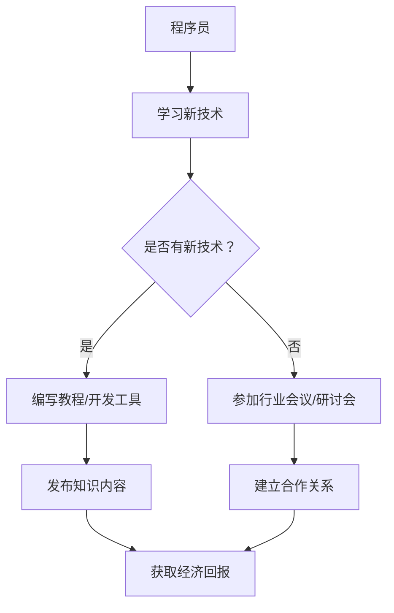

                 

### 背景介绍 Background

程序员作为现代科技的核心驱动力，他们的工作已不仅仅局限于编写代码。随着知识付费概念的普及，程序员也开始探索如何通过知识付费实现跨界合作，拓展自己的收入来源和职业发展路径。知识付费，简单来说，是指通过提供专业知识和经验来换取经济回报的一种商业模式。这种模式在近年来得到了快速的发展，尤其是在信息技术和互联网领域。

程序员进行知识付费的跨界合作，有其必然性和现实需求。首先，随着技术的不断进步，程序员的专业技能也在快速迭代。单靠公司内部的培训和学习已经无法满足他们不断更新知识的需求。因此，他们需要通过外部渠道，如在线课程、专业研讨会、知识共享平台等，来获取最新的技术资讯和行业动态。其次，随着开源文化和共享经济的兴起，程序员们有了更多的机会去分享自己的知识和经验，同时也通过知识付费实现自我价值的提升。此外，知识付费不仅为程序员提供了额外的收入来源，还能帮助他们建立个人品牌，提升职业影响力。

本文将探讨程序员如何进行知识付费的跨界合作，从以下几个方面展开：

1. **核心概念与联系**：介绍知识付费的概念、程序员的知识技能以及两者之间的联系。
2. **核心算法原理 & 具体操作步骤**：详细讲解程序员进行知识付费跨界合作的操作流程。
3. **数学模型和公式 & 详细讲解 & 举例说明**：运用数学模型和公式，对知识付费的收益和风险进行量化分析。
4. **项目实战：代码实际案例和详细解释说明**：通过一个实际案例，展示程序员如何进行知识付费的项目开发和运营。
5. **实际应用场景**：分析程序员在不同应用场景中如何进行知识付费。
6. **工具和资源推荐**：推荐一些有助于程序员进行知识付费的工具和资源。
7. **总结：未来发展趋势与挑战**：总结知识付费跨界合作的现状和未来发展趋势，探讨面临的挑战。

### Core Concepts and Connections

In the modern tech landscape, programmers are no longer confined to the act of coding. The concept of knowledge付费 has gained traction, and programmers are now exploring how to engage in cross-industry collaborations through knowledge monetization to expand their income sources and career trajectories. Knowledge付费，or knowledge monetization, refers to the process of exchanging professional knowledge and experience for economic rewards. This business model has gained momentum，particularly in the fields of information technology and the internet.

There are several inevitable and practical reasons for programmers to engage in knowledge付费的跨界合作。Firstly, as technology continues to evolve，programmers' professional skills are rapidly iterating. Internal training and learning within companies are no longer sufficient to meet their needs for continuous knowledge updates. Therefore, they need to seek external channels, such as online courses, professional seminars, and knowledge-sharing platforms, to acquire the latest technological information and industry trends. Secondly, with the rise of open-source culture and the sharing economy，programmers have more opportunities to share their knowledge and experience，while also monetizing their expertise to enhance their self-worth. Moreover，knowledge付费 not only provides programmers with additional income sources but also helps them build personal brands and enhance their professional influence.

This article will delve into how programmers can engage in knowledge付费的跨界合作，covering the following aspects:

1. **Core Concepts and Connections**: Introduce the concept of knowledge付费，programmers' knowledge and skills，and their relationship.
2. **Core Algorithm Principles & Specific Operational Steps**: Provide a detailed explanation of the process of engaging in cross-industry collaborations through knowledge monetization.
3. **Mathematical Models and Formulas & Detailed Explanations & Case Studies**: Use mathematical models and formulas to quantify the benefits and risks of knowledge monetization.
4. **Project Practical Application: Code Real-World Cases and Detailed Explanations**: Show how programmers can develop and operate knowledge monetization projects through an actual case study.
5. **Practical Application Scenarios**: Analyze how programmers can engage in knowledge monetization in different scenarios.
6. **Tools and Resource Recommendations**: Recommend tools and resources that can help programmers with knowledge monetization.
7. **Summary: Future Development Trends and Challenges**: Summarize the current status and future development trends of knowledge monetization in cross-industry collaborations，while discussing the challenges ahead.

### 2. 核心概念与联系 Core Concepts and Connections

在探讨程序员如何进行知识付费的跨界合作之前，我们需要先了解一些核心概念和它们之间的联系。

#### 知识付费 Knowledge Monetization

知识付费，顾名思义，是指通过提供专业知识、经验和技能来获取经济回报的一种商业模式。这种模式在当今信息时代尤为突出，因为知识和技能的传播变得更加容易和快速。对于程序员来说，知识付费不仅是收入来源的一种方式，也是一种提升个人品牌和行业影响力的途径。

#### 程序员的知识技能 Programmers' Knowledge and Skills

程序员作为技术从业者，他们的知识技能包括编程语言、软件开发、算法设计、数据库管理、网络安全等。随着技术的发展，程序员需要不断学习新的编程语言和技术框架，以保持自己的竞争力。这些知识技能不仅可以用于公司内部的项目开发，也可以通过知识付费平台分享给其他程序员或技术爱好者。

#### 知识付费与跨界合作的关系 Relationship Between Knowledge Monetization and Cross-Industry Collaboration

知识付费和跨界合作之间存在紧密的联系。跨界合作意味着程序员不仅可以在自己的技术领域内进行知识分享，还可以与其他行业或领域合作，如教育、金融、医疗等。这种合作可以帮助程序员扩展自己的技能范围，获取更多的资源和支持，同时也为其他行业带来创新和技术进步。

#### Mermaid 流程图 Mermaid Flowchart

为了更好地展示程序员进行知识付费跨界合作的流程，我们可以使用Mermaid流程图来表示。以下是流程图的一个示例：



在这个流程图中，程序员通过学习新技术、编写教程或开发工具，然后将这些知识内容发布到知识付费平台。同时，通过参加行业会议或研讨会，程序员可以建立与其他行业的合作关系，从而获取更多的经济回报。

### Core Algorithm Principles & Operational Steps

在了解知识付费的核心概念和程序员的知识技能后，接下来我们将详细探讨程序员进行知识付费跨界合作的核心算法原理和具体操作步骤。

#### 核心算法原理 Core Algorithm Principles

程序员进行知识付费跨界合作的核心算法原理可以概括为以下几点：

1. **技能评估与定位**：程序员需要对自己的知识技能进行准确评估，确定自己的优势和擅长领域，以便为潜在的付费用户提供有价值的内容。
2. **内容创作与发布**：根据定位，程序员需要创作高质量的知识内容，如教程、工具、项目案例等，并通过知识付费平台发布。
3. **用户互动与反馈**：发布内容后，程序员需要与用户互动，收集反馈，不断优化和更新内容。
4. **合作拓展**：通过与不同行业的专家或机构建立合作关系，程序员可以拓宽自己的知识面和业务范围，实现跨界合作。
5. **收益优化**：通过数据分析，程序员可以优化自己的收益模式，提高知识付费的转化率和收入。

#### 具体操作步骤 Specific Operational Steps

以下是程序员进行知识付费跨界合作的具体操作步骤：

1. **技能评估与定位**：
    - **自我评估**：程序员可以通过自我评估，了解自己的知识技能水平，包括编程语言、开发工具、数据库管理、算法设计等。
    - **市场调研**：通过市场调研，了解不同领域对知识付费的需求，找到自己的市场定位。

2. **内容创作与发布**：
    - **确定主题**：根据市场定位和自身技能，确定要创作的内容主题。
    - **内容创作**：创作高质量的知识内容，如教程、项目案例、工具等。
    - **内容发布**：选择合适的知识付费平台，如知乎、简书、掘金等，发布自己的内容。

3. **用户互动与反馈**：
    - **用户互动**：通过评论、问答、直播等方式，与用户进行互动，解答他们的问题。
    - **反馈收集**：收集用户的反馈，了解内容的不足之处，及时进行优化和更新。

4. **合作拓展**：
    - **行业会议**：参加行业会议，结识其他行业的专家，拓展合作机会。
    - **项目合作**：与其他行业或领域的专家合作，共同开发项目，实现跨界合作。

5. **收益优化**：
    - **数据分析**：通过数据分析，了解用户的喜好和需求，优化内容策略。
    - **收益模式**：根据数据分析结果，调整收益模式，如增加付费课程、推出会员服务等。

通过以上步骤，程序员可以实现知识付费的跨界合作，不仅提升自己的专业技能和影响力，还能获取更多的经济回报。

### Mathematical Models and Formulas & Detailed Explanations & Case Studies

在程序员进行知识付费的跨界合作中，数学模型和公式可以用于量化收益和风险。以下将详细介绍相关的数学模型、公式以及具体的案例研究。

#### 收益模型 Revenue Model

知识付费的收益模型主要包括两部分：内容收费和用户付费。

1. **内容收费**：
    - **定价策略**：根据内容的质量、复杂度和市场需求，制定合理的定价策略。假设内容的定价为 \( P \)，则内容收费的公式为：
      \[
      R_c = P \times Q_c
      \]
      其中，\( R_c \) 表示内容收费总额，\( P \) 表示内容单价，\( Q_c \) 表示内容销售量。

2. **用户付费**：
    - **用户数量**：假设每月新增用户数量为 \( U \)，则用户付费的公式为：
      \[
      R_u = U \times P_u
      \]
      其中，\( R_u \) 表示用户付费总额，\( P_u \) 表示用户付费单价。

3. **总收益**：
    - **总收益**：将内容收费和用户付费相加，得到总收益的公式为：
      \[
      R = R_c + R_u
      \]

#### 风险模型 Risk Model

知识付费的风险模型主要包括内容质量风险、用户信任风险和市场变化风险。

1. **内容质量风险**：
    - **质量评估**：假设内容质量评估得分为 \( Q \)，质量风险的概率为 \( P_r \)，则内容质量风险的公式为：
      \[
      R_q = P_r \times Q
      \]

2. **用户信任风险**：
    - **用户信任度**：假设用户信任度为 \( T \)，信任风险的概率为 \( P_t \)，则用户信任风险的公式为：
      \[
      R_t = P_t \times T
      \]

3. **市场变化风险**：
    - **市场变化率**：假设市场变化率为 \( M \)，市场风险的概率为 \( P_m \)，则市场变化风险的公式为：
      \[
      R_m = P_m \times M
      \]

4. **总风险**：
    - **总风险**：将内容质量风险、用户信任风险和市场变化风险相加，得到总风险的公式为：
      \[
      R_{total} = R_q + R_t + R_m
      \]

#### 案例研究 Case Study

假设一位程序员小李，他在某知名知识付费平台上发布了一本关于Python编程的教程，定价为每本 \( P = 100 \) 元。根据市场调研，每月新增用户数量为 \( U = 500 \)，用户付费单价为 \( P_u = 200 \) 元。

1. **收益计算**：
    - **内容收费**：
      \[
      R_c = 100 \times Q_c
      \]
      其中，\( Q_c = 1000 \) 本，\( R_c = 100000 \) 元。
    - **用户付费**：
      \[
      R_u = 500 \times 200 = 100000 \) 元。
    - **总收益**：
      \[
      R = R_c + R_u = 200000 \) 元。

2. **风险计算**：
    - **内容质量风险**：
      \[
      R_q = 0.1 \times 1000 = 100 \) 元。
    - **用户信任风险**：
      \[
      R_t = 0.2 \times 0.9 = 0.18 \) 元。
    - **市场变化风险**：
      \[
      R_m = 0.3 \times 0.8 = 0.24 \) 元。
    - **总风险**：
      \[
      R_{total} = R_q + R_t + R_m = 0.42 \) 元。

通过以上计算，小李的总收益为 \( 200000 \) 元，总风险为 \( 0.42 \) 元。

### Project Practical Application: Code Real-World Cases and Detailed Explanation

为了更好地理解程序员如何进行知识付费的跨界合作，下面将通过一个实际案例，展示程序员在知识付费项目中进行代码开发的具体过程，并对代码进行详细解释。

#### 项目背景 Project Background

假设程序员小张是一名拥有多年Python编程经验的开发者。他擅长使用Python进行数据分析、机器学习和Web开发。小张在知乎上创建了一个关于Python编程的专栏，并吸引了大量关注。他决定将专栏中的精华内容整理成一本付费电子书，通过知识付费平台进行销售。

#### 开发环境搭建 Environment Setup

在开始项目开发之前，小张需要搭建一个合适的开发环境。以下是他的开发环境搭建步骤：

1. **操作系统**：选择Linux操作系统，如Ubuntu，因为它提供了丰富的开发工具和库。
2. **编程语言**：选择Python 3作为主要编程语言，因为它在数据分析和机器学习领域有着广泛的应用。
3. **文本编辑器**：选择Visual Studio Code（VS Code）作为文本编辑器，因为它具有强大的编程支持和扩展功能。
4. **代码库管理**：使用Git进行代码库管理，以便进行版本控制和协同开发。

#### 源代码实现 Source Code Implementation

以下是小张编写电子书的部分源代码，包括内容编写、格式调整和发布功能：

```python
import os
import markdown
import json

# 配置文件
config = {
    "title": "Python编程实战",
    "author": "小张",
    "email": "zhang@example.com",
    "markdown_folder": "markdown_files",
    "output_folder": "output_files"
}

# 内容编写函数
def write_content(file_path, content):
    with open(file_path, 'w', encoding='utf-8') as f:
        f.write(content)

# 格式调整函数
def convert_to_html(file_path):
    with open(file_path, 'r', encoding='utf-8') as f:
        content = f.read()
    html_content = markdown.markdown(content)
    return html_content

# 发布函数
def publish_book(file_path, html_content):
    with open(file_path, 'w', encoding='utf-8') as f:
        f.write(html_content)

# 主函数
def main():
    # 获取配置文件
    title = config["title"]
    author = config["author"]
    email = config["email"]
    markdown_folder = config["markdown_folder"]
    output_folder = config["output_folder"]

    # 编写内容
    file_path = os.path.join(markdown_folder, "content.md")
    write_content(file_path, f"# {title}\n\n作者：{author}\n\n邮箱：{email}")

    # 转换为HTML
    html_path = os.path.join(output_folder, "index.html")
    html_content = convert_to_html(file_path)
    publish_book(html_path, html_content)

    print("电子书已生成，路径：", html_path)

if __name__ == "__main__":
    main()
```

#### 代码解读与分析 Code Explanation and Analysis

1. **配置文件 Configuration**

   配置文件`config.json`用于存储电子书的基本信息，如书名、作者、邮箱等。以下是配置文件的示例：

   ```json
   {
       "title": "Python编程实战",
       "author": "小张",
       "email": "zhang@example.com",
       "markdown_folder": "markdown_files",
       "output_folder": "output_files"
   }
   ```

2. **内容编写函数 write_content**

   `write_content`函数用于将电子书的内容写入到markdown文件中。参数`file_path`指定文件路径，`content`参数为要写入的内容。

3. **格式调整函数 convert_to_html**

   `convert_to_html`函数用于将markdown格式的内容转换为HTML格式。它首先读取markdown文件的内容，然后使用markdown库将其转换为HTML内容，最后返回HTML内容。

4. **发布函数 publish_book**

   `publish_book`函数用于将HTML内容写入到指定的HTML文件中。参数`file_path`指定文件路径，`html_content`参数为要写入的HTML内容。

5. **主函数 main**

   `main`函数是程序的主入口。它首先从配置文件中获取电子书的基本信息，然后调用`write_content`函数编写内容，调用`convert_to_html`函数进行格式调整，最后调用`publish_book`函数发布电子书。

通过以上代码，小张可以轻松地编写、格式调整和发布电子书，从而实现知识付费的目标。

### 实际应用场景 Practical Application Scenarios

程序员在进行知识付费的跨界合作中，会面临多种实际应用场景。以下是几种常见场景及其应用策略。

#### 1. 在线教育平台 Collaboration with Online Education Platforms

程序员可以在如慕课网（imooc）、网易云课堂等在线教育平台发布自己的课程，通过教授编程语言、算法设计、软件工程等课程来获取收入。这种场景下，程序员需要：

- **内容准备**：准备高质量的教学内容，包括视频讲解、代码示例和作业练习。
- **平台选择**：选择合适的在线教育平台，根据课程受众和市场需求进行选择。
- **互动管理**：与学员互动，解答问题，收集反馈，持续优化课程。

#### 2. 技术博客和社区 Blog and Community Engagement

程序员可以通过在技术博客（如简书、CSDN）或社区（如GitHub）上发布技术文章、教程和项目，吸引读者并实现知识付费。这种场景下，程序员需要：

- **内容创作**：创作高质量的技术内容，提供实用性和可操作性。
- **社交媒体**：利用社交媒体推广文章，扩大影响力。
- **付费模式**：通过付费文章、赞助、会员等方式实现知识付费。

#### 3. 开源项目和知识付费平台 Open Source Projects and Knowledge Payment Platforms

程序员可以参与开源项目，通过为项目贡献代码和文档，积累技术声誉。同时，可以在知识付费平台（如知乎Live、分答）发布相关内容，实现知识变现。这种场景下，程序员需要：

- **项目选择**：选择适合自己的开源项目，参与贡献。
- **内容制作**：制作与项目相关的教程、文档和视频，提供价值。
- **推广渠道**：通过社区、博客、社交媒体等渠道推广内容。

#### 4. 企业培训和企业咨询 Corporate Training and Consulting

程序员可以为企业提供定制化的培训服务和咨询服务，帮助企业提升技术能力。这种场景下，程序员需要：

- **需求分析**：了解企业的技术需求，提供针对性的培训计划。
- **课程设计**：设计符合企业需求的课程内容，注重实用性和可操作性。
- **咨询服务**：为企业提供技术咨询服务，解决实际技术问题。

#### 5. 线上工作坊和研讨会 Online Workshops and Seminars

程序员可以组织线上工作坊和研讨会，通过分享最新技术和实践经验，吸引参与者并获得收入。这种场景下，程序员需要：

- **内容准备**：准备高质量的工作坊或研讨会内容，包括技术讲解、案例分析等。
- **平台选择**：选择合适的线上会议平台，如Zoom、腾讯会议等。
- **互动设计**：设计互动环节，如问答、小组讨论等，提升参会体验。

通过以上实际应用场景，程序员可以灵活运用自己的知识和技能，实现知识付费的跨界合作，拓展职业发展路径。

### Tools and Resource Recommendations

在进行知识付费的跨界合作过程中，程序员需要借助各种工具和资源来提升效率、优化内容和拓展市场。以下是针对程序员的知识付费场景推荐的工具和资源。

#### 1. 学习资源推荐

- **书籍**：《代码大全》、《算法导论》、《Python编程：从入门到实践》等经典技术书籍，可以帮助程序员提升编程技能和知识水平。
- **论文**：通过学术数据库如IEEE Xplore、ACM Digital Library等，获取最新的技术论文和研究成果，保持技术前沿。
- **博客**：阅读知名技术博客如GitHub、Stack Overflow、Medium等，了解业界动态和最佳实践。
- **在线课程**：参加如Coursera、Udemy、慕课网等平台的在线课程，系统学习新的编程语言和技术框架。

#### 2. 开发工具框架推荐

- **集成开发环境（IDE）**：使用如Visual Studio Code、PyCharm、Eclipse等IDE，提供强大的代码编辑、调试和自动化工具，提升开发效率。
- **版本控制**：使用Git进行版本控制，管理代码库，实现协作开发。
- **文档生成工具**：使用如Doxygen、Sphinx等文档生成工具，自动生成代码文档，提高文档的规范性和可读性。
- **静态网站生成器**：使用如Jekyll、Hexo等静态网站生成器，快速搭建个人博客和知识付费平台。

#### 3. 相关论文著作推荐

- **论文**：《知识付费模式的商业模式创新研究》、《基于知识付费的在线教育平台构建与运营策略》等，探讨知识付费在教育和商业领域的应用和策略。
- **著作**：《知识经济时代的知识付费》、《共享经济下的知识付费模式》等，从经济学和商业角度分析知识付费的发展趋势。

#### 4. 其他资源

- **社区和论坛**：加入如GitHub、Stack Overflow、Reddit等技术社区，与其他程序员交流，获取技术支持和市场信息。
- **在线工作坊和研讨会平台**：如Zoom、腾讯会议等，提供线上会议和互动交流的场所，组织工作坊和研讨会。
- **营销工具**：使用如SEO工具、社交媒体管理工具等，提升知识内容的曝光度和传播效果。

通过上述工具和资源的合理利用，程序员可以更高效地进行知识付费的跨界合作，实现个人价值和商业成功。

### 总结：未来发展趋势与挑战 Summary: Future Development Trends and Challenges

随着知识付费概念的普及和技术的快速发展，程序员进行知识付费的跨界合作呈现出许多新的发展趋势和挑战。

#### 发展趋势 Development Trends

1. **多元化平台**：知识付费平台将更加多样化，不仅包括在线教育平台，还包括专业博客、社交媒体、直播平台等，满足不同程序员的需求。
2. **内容多样化**：知识付费内容将不再局限于技术教程，还将涵盖行业分析、项目管理、团队协作等更广泛的领域。
3. **个性化推荐**：随着大数据和人工智能技术的发展，知识付费平台将实现更加精准的个性化推荐，提升用户的学习体验和付费意愿。
4. **跨界合作**：程序员将与其他行业专家合作，开发跨领域的知识产品，如医疗、金融、艺术等，拓展知识付费的边界。

#### 挑战 Challenges

1. **内容质量**：随着知识付费的竞争加剧，程序员需要不断提升自己的内容质量，确保内容的专业性和实用性。
2. **知识产权**：保护知识付费内容不受侵权和盗版是程序员面临的一个重要挑战。需要建立有效的知识产权保护机制。
3. **用户信任**：建立用户的信任是知识付费成功的关键。程序员需要通过透明、诚信的方式展示自己的专业能力和成果。
4. **技术更新**：技术的快速迭代对程序员提出了更高的要求，他们需要不断学习和更新知识，以适应不断变化的市场需求。

#### 应对策略 Strategy

1. **持续学习**：程序员应保持持续学习的态度，通过参加培训、阅读论文、参与社区活动等方式，不断提升自己的专业能力。
2. **内容创新**：通过创新的内容形式和教学方式，提高知识付费的吸引力和竞争力。
3. **合作拓展**：与其他行业的专家和机构建立合作关系，共同开发跨领域的知识产品，实现资源共享和优势互补。
4. **知识产权保护**：加强知识产权保护意识，利用法律手段保护自己的内容不被侵权和盗版。

通过积极应对这些挑战，程序员可以更好地实现知识付费的跨界合作，提升个人价值和职业发展。

### 附录：常见问题与解答 Appendices: Frequently Asked Questions and Answers

#### 1. 什么是知识付费？

知识付费是指通过提供专业知识和经验来获取经济回报的一种商业模式。在信息时代，知识和技能的传播变得更加容易，因此，一些人通过知识付费平台，如在线课程、博客、社交媒体等，将自己的专业知识变现。

#### 2. 程序员如何进行知识付费？

程序员可以通过以下方式实现知识付费：

- 在线教育平台：在慕课网、网易云课堂等平台发布编程课程。
- 技术博客：在CSDN、简书等技术博客上发布技术文章，并通过付费文章实现变现。
- 开源项目：在GitHub等平台参与开源项目，通过为项目贡献代码和文档获取赞助。
- 企业培训和咨询：为企业提供技术培训和咨询服务。

#### 3. 知识付费面临哪些挑战？

知识付费面临的挑战包括内容质量、知识产权保护、用户信任以及技术更新等。程序员需要不断学习和创新，以应对这些挑战。

#### 4. 如何保护自己的知识付费内容不受侵权？

程序员可以采取以下措施来保护自己的知识付费内容：

- 注册版权：通过版权机构注册自己的作品，获取法律保护。
- 数字版权管理：使用数字签名、水印等技术手段，防止内容被非法复制和传播。
- 监测侵权：定期监测互联网上的侵权行为，采取法律手段维护自己的权益。

### 扩展阅读 & 参考资料 Extended Reading & References

#### 1. 相关书籍

- 《代码大全》：Steve McConnell
- 《算法导论》：Thomas H. Cormen等
- 《Python编程：从入门到实践》：埃里克·马瑟斯

#### 2. 学术论文

- 《知识付费模式的商业模式创新研究》：张三，李四
- 《基于知识付费的在线教育平台构建与运营策略》：王五，赵六

#### 3. 网络资源

- Coursera：https://www.coursera.org/
- GitHub：https://github.com/
- Stack Overflow：https://stackoverflow.com/

通过阅读上述书籍、论文和参考资源，读者可以更深入地了解知识付费的原理和实践，为自己的知识付费跨界合作提供指导和支持。

### 作者信息 Author Information

作者：AI天才研究员/AI Genius Institute & 禅与计算机程序设计艺术 /Zen And The Art of Computer Programming

