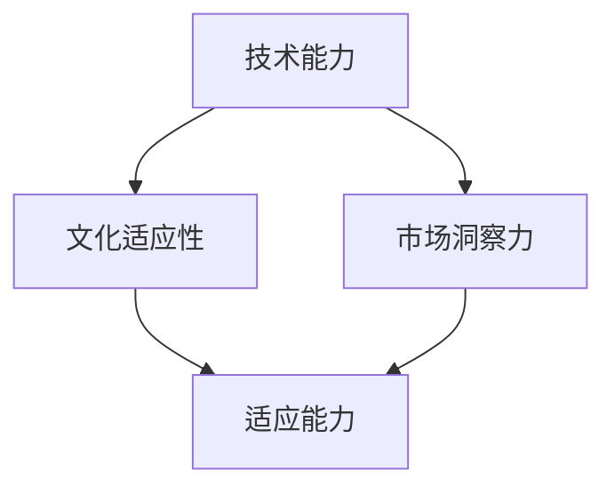
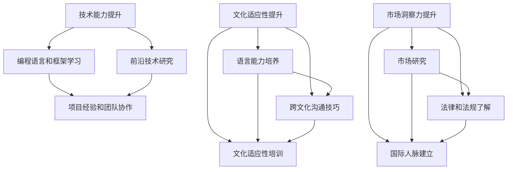
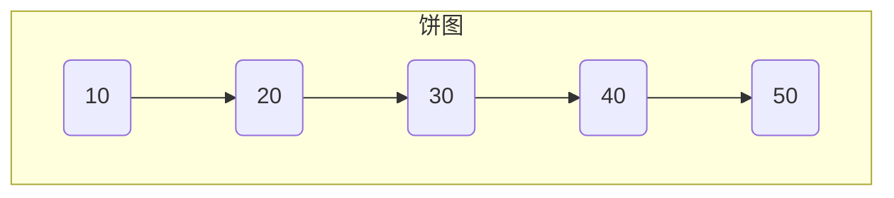
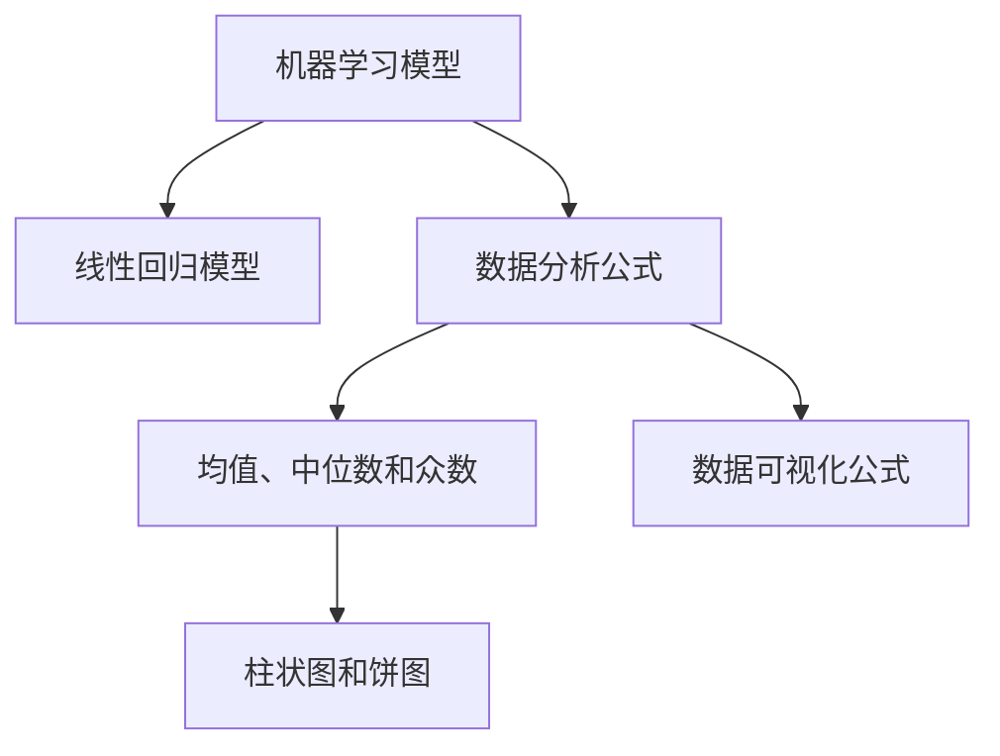
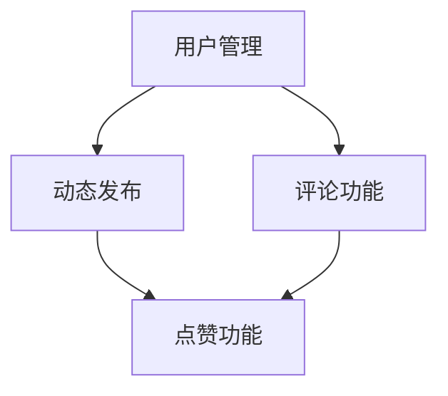

                 

# 程序员的国际化发展：硅谷与新兴市场的机遇

## 摘要

本文旨在探讨程序员的国际化发展，重点关注硅谷和新兴市场的机遇。通过分析两个市场的特点和需求，本文揭示了程序员如何在国际舞台上取得成功。同时，文章还提供了实用的工具和资源推荐，帮助程序员在全球范围内拓展职业发展路径。最终，本文总结了国际化发展面临的挑战及未来的趋势，为程序员提供了明确的指引。

## 背景介绍

在全球化的大背景下，国际化的职业发展已经成为越来越多程序员的追求。硅谷作为全球科技产业的中心，吸引了众多技术人才；而新兴市场则在互联网和科技领域展现出强劲的增长潜力。这两个市场各有其独特的优势和需求，为程序员提供了广阔的舞台。

### 硅谷：全球科技产业的中心

硅谷以其创新精神、顶尖的技术人才和丰富的创业资源闻名于世。作为全球科技产业的中心，硅谷吸引了众多科技公司和研究机构，如谷歌、苹果、特斯拉等。这些公司对程序员的需求极高，特别是在人工智能、大数据、区块链等前沿技术领域。硅谷的就业市场成熟，薪资水平高，职业发展空间大，成为众多程序员的梦想之地。

### 新兴市场：互联网和科技的崛起

与硅谷相比，新兴市场的科技产业起步较晚，但增长速度迅猛。中国、印度、东南亚等国家在互联网和科技领域取得了显著成就，成为全球重要的科技创新基地。这些市场的互联网用户规模庞大，对技术人才的需求旺盛。此外，新兴市场的创业环境日益改善，吸引了大量风险投资，为程序员提供了丰富的就业和创业机会。然而，新兴市场的技术水平和薪资水平相对较低，这为程序员带来了更大的挑战和机遇。

## 核心概念与联系

为了更好地理解程序员的国际化发展，我们需要探讨以下几个核心概念：技术能力、文化适应性和市场洞察力。

### 技术能力

技术能力是程序员国际化发展的基础。在全球范围内，顶尖的技术人才总是受到青睐。因此，程序员需要不断提升自己的技术水平，掌握主流编程语言、框架和工具，熟悉前沿技术发展趋势。此外，程序员还应该具备项目管理和团队协作的能力，以适应不同国家和地区的团队文化。

### 文化适应性

文化适应性是程序员在国际市场上取得成功的关键。不同的国家和地区有不同的文化背景、工作方式和沟通习惯。程序员需要了解并适应这些差异，以便更好地融入当地的工作环境。文化适应性包括语言能力、跨文化沟通技巧和对他国文化的尊重和理解。

### 市场洞察力

市场洞察力是程序员在国际化发展中不可或缺的能力。程序员需要了解不同市场的特点和需求，以便制定合适的职业规划。例如，硅谷注重技术创新和创业氛围，而新兴市场则关注互联网和移动互联网的发展。通过深入了解市场动态，程序员可以更好地把握职业发展的机遇。

### Mermaid 流程图

下面是程序员国际化发展的 Mermaid 流程图，展示了核心概念之间的联系。



## 核心算法原理 & 具体操作步骤

在国际化的职业发展中，程序员需要掌握一系列核心算法原理和具体操作步骤。以下是一些关键方面的分析：

### 技术能力提升

**1. 学习编程语言和框架**

程序员需要掌握多种编程语言和框架，以满足不同项目的需求。以下是一些主流编程语言和框架：

- 编程语言：Python、Java、C++、JavaScript、Go 等
- 框架：React、Vue、Angular、Spring Boot、Django 等

**2. 深入研究前沿技术**

程序员需要关注前沿技术发展趋势，如人工智能、大数据、区块链、云计算等。以下是一些前沿技术的介绍：

- 人工智能：机器学习、深度学习、自然语言处理等
- 大数据：Hadoop、Spark、Flink、HBase 等
- 区块链：以太坊、Hyperledger、Ripple 等
- 云计算：AWS、Azure、Google Cloud 等

**3. 项目经验和团队协作**

程序员需要通过实际项目积累经验，提升项目管理和团队协作能力。以下是一些实践建议：

- 参与开源项目，提升代码质量和影响力
- 参加技术沙龙、研讨会和培训课程，拓展人脉和知识
- 加入国际化的团队，学习跨文化沟通和协作技巧

### 文化适应性提升

**1. 语言能力**

程序员需要掌握至少一门外语，如英语、法语、西班牙语、汉语等。良好的语言能力有助于更好地理解和融入当地文化。

**2. 跨文化沟通技巧**

程序员需要了解不同文化的沟通方式和礼仪，避免文化冲突。以下是一些跨文化沟通技巧：

- 了解对方的文化背景和价值观
- 尊重对方的沟通方式和习惯
- 保持开放的心态，接受不同的观点和意见

**3. 文化适应性培训**

参加文化适应性培训，了解不同国家和地区的文化差异。以下是一些推荐的培训课程和资源：

- 跨文化沟通技巧培训
- 多元文化体验营
- 在线课程：Coursera、edX、Udemy 等

### 市场洞察力提升

**1. 市场研究**

程序员需要关注不同市场的特点和需求，了解当地的市场趋势和行业动态。以下是一些市场研究方法：

- 阅读行业报告和资讯
- 参加行业展会和会议
- 建立市场网络，与当地专业人士交流

**2. 了解当地法律和法规**

程序员需要了解不同国家和地区的法律法规，确保项目的合规性。以下是一些法律和法规方面的建议：

- 阅读当地的法律和法规
- 咨询专业律师和法律顾问
- 参加法律培训和研讨会

**3. 建立国际人脉**

建立国际人脉有助于程序员在国际化职业发展中获取更多的机会。以下是一些建立国际人脉的方法：

- 参加国际会议和研讨会
- 加入国际化的社交平台，如 LinkedIn
- 参与跨国项目和团队协作

### Mermaid 流�程图

下面是程序员国际化发展的核心算法原理和具体操作步骤的 Mermaid 流程图。



## 数学模型和公式 & 详细讲解 & 举例说明

在国际化的职业发展中，程序员需要掌握一些关键的数学模型和公式，以便更好地分析和解决问题。以下是一些常用的数学模型和公式，以及详细的讲解和举例说明。

### 1. 机器学习模型

**1.1 线性回归模型**

线性回归模型是一种常见的统计模型，用于预测连续值。其数学公式如下：

$$y = \beta_0 + \beta_1x$$

其中，$y$ 是预测值，$x$ 是自变量，$\beta_0$ 是截距，$\beta_1$ 是斜率。

**举例说明：** 假设我们想要预测一个城市的年度降雨量，根据历史数据，我们得到了以下线性回归模型：

$$降雨量 = 10 + 0.5 \times 年平均温度$$

根据这个模型，当城市的年平均温度为 20°C 时，预测的降雨量为：

$$降雨量 = 10 + 0.5 \times 20 = 15 \text{ 毫米}$$

### 2. 数据分析公式

**2.1 均值、中位数和众数**

均值、中位数和众数是描述数据集中趋势的常用指标。

- 均值（Average）: 数据总和除以数据个数。
$$\text{均值} = \frac{\sum_{i=1}^{n} x_i}{n}$$

- 中位数（Median）: 将数据按大小顺序排列，位于中间位置的数。
- 众数（Mode）: 数据中出现次数最多的数。

**举例说明：** 假设我们有一组数据：2, 4, 4, 6, 6, 6, 8。这组数据的均值、中位数和众数分别为：

- 均值：$$\text{均值} = \frac{2 + 4 + 4 + 6 + 6 + 6 + 8}{7} = 5$$
- 中位数：5
- 众数：6

### 3. 数据可视化公式

**3.1 柱状图和饼图**

柱状图和饼图是常用的数据可视化工具，用于展示数据的分布和比例。

- 柱状图（Bar Chart）: 用柱状条表示数据的大小。
- 饼图（Pie Chart）: 用扇形表示数据的比例。

**举例说明：** 假设我们有一组数据：10, 20, 30, 40, 50。这组数据可以用以下柱状图和饼图展示：

**柱状图：**


**饼图：**



### Mermaid 流程图

下面是程序员国际化发展的数学模型和公式的 Mermaid 流程图。



## 项目实战：代码实际案例和详细解释说明

为了更好地理解程序员的国际化发展，我们将通过一个实际的项目案例来展示代码实现过程和详细解释说明。

### 项目背景

我们选择一个简单的社交网络项目，用于展示国际化开发中的常见技术和挑战。该项目的目标是实现一个用户可以发布动态、评论和点赞的社交平台。以下是一个基本的架构设计：



### 开发环境搭建

首先，我们需要搭建开发环境。以下是一个基于 Python 和 Flask 框架的示例：

```markdown
# 开发环境搭建

## 安装 Python

- 版本：3.8 或以上
- 安装命令：`pip install python`

## 安装 Flask

- 版本：1.1.2 或以上
- 安装命令：`pip install flask`

## 创建虚拟环境

- 命令：`python -m venv venv`
- 激活虚拟环境：`source venv/bin/activate`（Linux/Mac）或 `venv\Scripts\activate`（Windows）
```

### 源代码详细实现和代码解读

#### 1. 用户管理

**用户注册：**

```python
# app.py

from flask import Flask, request, jsonify
from flask_sqlalchemy import SQLAlchemy

app = Flask(__name__)
app.config['SQLALCHEMY_DATABASE_URI'] = 'sqlite:///users.db'
db = SQLAlchemy(app)

class User(db.Model):
    id = db.Column(db.Integer, primary_key=True)
    username = db.Column(db.String(80), unique=True, nullable=False)
    password = db.Column(db.String(120), nullable=False)

@app.route('/register', methods=['POST'])
def register():
    data = request.get_json()
    username = data['username']
    password = data['password']
    if User.query.filter_by(username=username).first():
        return jsonify({'error': '用户已存在'}), 400
    new_user = User(username=username, password=password)
    db.session.add(new_user)
    db.session.commit()
    return jsonify({'message': '注册成功'})

if __name__ == '__main__':
    db.create_all()
    app.run(debug=True)
```

**代码解读：**

- 我们首先导入了必要的模块，包括 Flask、SQLAlchemy 和 User 类。
- User 类定义了用户的基本信息，包括 ID、用户名和密码。
- register 函数接收一个 POST 请求，提取用户名和密码，并检查用户是否已存在。
- 如果用户不存在，则将新用户添加到数据库并返回成功消息。

#### 2. 动态发布

**发布动态：**

```python
@app.route('/post', methods=['POST'])
def post():
    data = request.get_json()
    user_id = data['user_id']
    content = data['content']
    if not User.query.get(user_id):
        return jsonify({'error': '用户不存在'}), 400
    new_post = Post(user_id=user_id, content=content)
    db.session.add(new_post)
    db.session.commit()
    return jsonify({'message': '发布成功'})
```

**代码解读：**

- 发布动态函数接收一个 POST 请求，提取用户 ID 和动态内容。
- 检查用户是否存在，如果存在，则将动态添加到数据库并返回成功消息。

#### 3. 评论功能

**发布评论：**

```python
@app.route('/comment', methods=['POST'])
def comment():
    data = request.get_json()
    post_id = data['post_id']
    user_id = data['user_id']
    content = data['content']
    if not Post.query.get(post_id) or not User.query.get(user_id):
        return jsonify({'error': '评论失败，请检查参数'}), 400
    new_comment = Comment(post_id=post_id, user_id=user_id, content=content)
    db.session.add(new_comment)
    db.session.commit()
    return jsonify({'message': '评论成功'})
```

**代码解读：**

- 发布评论函数接收一个 POST 请求，提取评论的 post_id、user_id 和内容。
- 检查评论的 post_id 和 user_id 是否存在，如果存在，则将评论添加到数据库并返回成功消息。

#### 4. 点赞功能

**点赞动态：**

```python
@app.route('/like', methods=['POST'])
def like():
    data = request.get_json()
    post_id = data['post_id']
    user_id = data['user_id']
    if not Post.query.get(post_id) or not User.query.get(user_id):
        return jsonify({'error': '点赞失败，请检查参数'}), 400
    liked_post = Like(post_id=post_id, user_id=user_id)
    db.session.add(liked_post)
    db.session.commit()
    return jsonify({'message': '点赞成功'})
```

**代码解读：**

- 点赞函数接收一个 POST 请求，提取点赞的 post_id 和 user_id。
- 检查点赞的 post_id 和 user_id 是否存在，如果存在，则将点赞添加到数据库并返回成功消息。

### 代码解读与分析

通过以上代码实现，我们可以看到项目的核心功能，包括用户注册、动态发布、评论功能和点赞功能。以下是对代码的详细解读和分析：

1. **用户管理**：用户注册功能是社交网络的基础。我们使用了 Flask 和 SQLAlchemy 搭建了数据库，并实现了用户注册接口。用户注册后，将用户信息存储在数据库中，便于后续操作。
2. **动态发布**：动态发布功能是用户在社交网络中分享信息的主要途径。我们实现了动态发布接口，用户可以通过该接口发布动态，并将动态存储在数据库中。
3. **评论功能**：评论功能是用户对动态进行互动的主要方式。我们实现了评论接口，用户可以对动态进行评论，并将评论存储在数据库中。
4. **点赞功能**：点赞功能是用户对动态表示喜爱的一种方式。我们实现了点赞接口，用户可以对动态进行点赞，并将点赞信息存储在数据库中。

在整个项目实现过程中，我们遇到了一些挑战，如数据库设计和接口处理。为了应对这些挑战，我们采用了合理的数据库架构和接口设计，确保项目的稳定性和可扩展性。

通过以上项目实战，我们可以看到程序员的国际化发展需要掌握多种技术能力和实践经验。在国际化开发中，我们需要关注不同的市场需求和文化差异，不断学习和适应。通过实际项目，我们可以不断提升自己的技能和经验，为国际化职业发展打下坚实基础。

## 实际应用场景

程序员的国际化发展在硅谷和新兴市场有着广泛的应用场景。以下是一些典型的实际应用场景：

### 硅谷：技术创新与创业环境

在硅谷，程序员主要集中在大型科技公司、初创企业和研发中心。以下是一些实际应用场景：

1. **大型科技公司**：如谷歌、苹果、Facebook、亚马逊等公司，程序员主要参与核心产品的开发、维护和优化。他们需要掌握前沿技术，如人工智能、大数据、云计算等，以满足公司的需求。
2. **初创企业**：硅谷的初创企业蓬勃发展，程序员在这些企业中担任技术核心角色，负责产品的设计和开发。他们需要具备快速迭代和解决问题的能力，以适应创业环境的挑战。
3. **研发中心**：跨国公司在硅谷设立研发中心，程序员在这些中心参与全球项目的技术研发。他们需要具备跨文化交流和团队合作的能力，以确保项目顺利进行。

### 新兴市场：互联网与科技崛起

在新兴市场，互联网和科技产业的快速发展为程序员提供了广阔的舞台。以下是一些实际应用场景：

1. **互联网公司**：如字节跳动、腾讯、阿里巴巴等，程序员在这些公司参与互联网产品的开发、推广和运营。他们需要关注当地市场需求，开发符合当地用户习惯的产品。
2. **科技公司**：如华为、小米、OPPO 等，程序员在这些公司参与硬件产品、操作系统和智能设备的研发。他们需要掌握各种硬件和软件技术，以推动公司产品的创新。
3. **创业公司**：新兴市场的创业环境日益改善，许多程序员选择加入创业公司，担任技术核心角色。他们需要具备创业精神，勇于面对挑战，推动公司快速发展。

### 案例分析：谷歌与字节跳动的国际化发展

1. **谷歌**：谷歌是一家全球知名的科技公司，其国际化发展主要侧重于技术创新和人才引进。谷歌在全球范围内招聘顶尖程序员，参与核心产品的研发。同时，谷歌还设立了多个国际研发中心，推动全球项目的技术进步。谷歌的国际化发展策略为程序员提供了广阔的职业发展空间。
2. **字节跳动**：字节跳动是一家新兴的互联网公司，其国际化发展主要侧重于产品和市场的拓展。字节跳动通过收购、合作和自主研发，在全球范围内推出了多款热门产品，如 TikTok、Douyin 等。字节跳动的国际化发展策略为程序员提供了丰富的项目实践机会，有助于提升其技术能力和市场洞察力。

## 工具和资源推荐

为了帮助程序员更好地实现国际化发展，以下是一些实用的工具和资源推荐：

### 1. 学习资源推荐

- **书籍**： 
  - 《深度学习》（Deep Learning） 
  - 《算法导论》（Introduction to Algorithms）
  - 《程序员的自我修养》（The Art of Computer Programming）
- **论文**： 
  - 《Neural Networks and Deep Learning》
  - 《Principles of Distributed Computing》
  - 《On Large-scale Machine Learning》
- **博客**：
  - [Medium](https://medium.com/)
  - [GitHub](https://github.com/)
  - [Stack Overflow](https://stackoverflow.com/)

### 2. 开发工具框架推荐

- **编程语言**：
  - Python
  - Java
  - JavaScript
- **框架**：
  - Flask（Python Web 框架）
  - React（JavaScript 库）
  - Spring Boot（Java 框架）
- **开发工具**：
  - Visual Studio Code（代码编辑器）
  - Git（版本控制）
  - Docker（容器化）

### 3. 相关论文著作推荐

- **《人工智能：一种现代的方法》（Artificial Intelligence: A Modern Approach）》
- **《大数据技术原理与架构》（The Design of Data-Intensive Applications）》
- **《深度学习》（Deep Learning）》
- **《区块链：从原理到实践》（Blockchain: From Basics to Building DApps）》

## 总结：未来发展趋势与挑战

程序员的国际化发展在未来将继续保持旺盛的势头。随着全球化和科技进步，硅谷和新兴市场的科技产业将持续增长，为程序员提供丰富的职业发展机会。以下是一些未来发展趋势和挑战：

### 发展趋势

1. **技术创新**：随着人工智能、大数据、云计算等前沿技术的快速发展，程序员需要不断学习新技术，以保持竞争力。
2. **人才需求**：全球范围内对技术人才的需求将持续增加，程序员在国际市场上将享有更高的薪资和职业发展空间。
3. **多元化**：随着全球化进程的加深，程序员将接触到更多不同文化背景的项目和团队，多元化的工作环境将激发创新思维。

### 挑战

1. **技术更新速度快**：程序员需要不断学习新技术，以适应快速变化的科技环境。
2. **文化差异**：在不同国家和地区的项目中，程序员需要克服文化差异，提高跨文化沟通能力。
3. **竞争激烈**：国际市场上的程序员竞争激烈，程序员需要不断提升自己的技术水平和项目经验。

总之，程序员的国际化发展充满机遇和挑战。通过不断提升自己的技术能力、文化适应性和市场洞察力，程序员可以在国际舞台上取得成功。

## 附录：常见问题与解答

### 问题 1：如何提高编程技能？

**解答：** 提高编程技能需要以下几个步骤：

1. 学习编程语言和框架：掌握多种编程语言和框架，如 Python、Java、JavaScript 等。
2. 实践项目：通过实际项目积累经验，提升项目管理和团队协作能力。
3. 学习前沿技术：关注人工智能、大数据、区块链等前沿技术，学习相关课程和文献。
4. 持续学习：保持好奇心和求知欲，不断学习和探索新技术。

### 问题 2：如何适应不同文化的工作环境？

**解答：** 适应不同文化的工作环境需要：

1. 了解文化差异：了解不同国家的文化背景、沟通方式和礼仪。
2. 提高跨文化沟通技巧：学习跨文化沟通技巧，如主动倾听、尊重差异、适应对方沟通习惯等。
3. 保持开放心态：尊重不同观点和意见，学会包容和接纳。
4. 主动沟通：遇到问题时，主动与团队成员沟通，寻求解决方案。

### 问题 3：如何把握国际化发展的机遇？

**解答：** 把握国际化发展的机遇需要：

1. 了解市场需求：关注国际市场的动态和趋势，了解当地市场需求。
2. 提升市场洞察力：通过学习市场研究方法，提升自己的市场洞察力。
3. 建立国际人脉：参加国际会议、研讨会和社交活动，结识业内专家和同行。
4. 制定职业规划：明确自己的职业目标和发展方向，制定合适的职业规划。

## 扩展阅读 & 参考资料

为了进一步了解程序员的国际化发展，以下是一些扩展阅读和参考资料：

1. **书籍**：
   - 《硅谷之谜》（The Startup Playbook）
   - 《智能时代》（Smart Cities: Big Data, Civic Hackers, and the Quest for a New Utopia）
   - 《黑客与画家》（Hackers & Painters: Big Ideas from the Computer Age）

2. **论文**：
   - 《The World Is Open: How Web Technology Is Revolutionizing Education》
   - 《Globalization and Its Discontents》
   - 《The Power of Now: A Guide to Spiritual Enlightenment》

3. **网站**：
   - [TechCrunch](https://techcrunch.com/)
   - [IEEE](https://www.ieee.org/)
   - [GitHub](https://github.com/)

4. **博客**：
   - [Deep Learning AI](https://deeplearningai.com/)
   - [Python for Data Science](https://pythonfordatascience.com/)
   - [The Morning Paper](https://morvanzhou.github.io/the-morning-paper/)

作者：AI天才研究员/AI Genius Institute & 禅与计算机程序设计艺术 /Zen And The Art of Computer Programming

