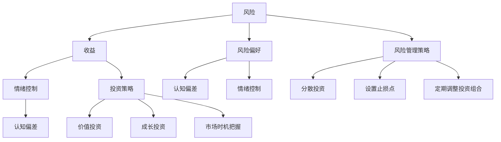

                 

### 背景介绍

在当今社会，信息技术和金融投资已经成为推动经济发展和社会进步的两大引擎。作为程序员，我们不仅擅长编写代码，解决技术问题，还需要具备一定的投资心理学的知识。这是因为投资不仅仅是金钱的博弈，更是一种心理的考验。在投资过程中，我们往往需要在不确定性和风险中做出决策，而这正是心理学的重要作用所在。

投资心理学是研究投资者心理行为和决策过程的一门学科，它涉及到心理学、经济学、金融学等多个领域。在投资过程中，投资者往往会受到情绪、认知偏差、风险偏好等因素的影响，从而做出不同的投资决策。对于程序员而言，掌握投资心理学的基本知识，有助于我们更好地理解市场动态，控制情绪，做出更为理智的投资决策。

本文将围绕程序员的投资心理学展开讨论，主要探讨以下核心概念：风险、收益、情绪控制、认知偏差、风险管理和投资策略。我们将通过一步一步的分析推理，深入探讨这些概念的本质，并探讨如何在投资过程中运用这些知识，实现风险与收益的平衡。

首先，我们需要了解风险和收益这两个核心概念。风险是指投资可能带来的不确定性，收益则是投资者预期获得的回报。在投资过程中，风险和收益是并存的，投资者需要根据自身的风险偏好和投资目标，合理配置资产，以实现收益最大化。

其次，情绪控制是投资过程中至关重要的一环。情绪会影响我们的决策过程，导致我们做出错误的判断。因此，学会控制情绪，保持冷静和理性，是成功投资的关键。

接着，我们还需要了解认知偏差，这是人们在信息处理过程中出现的系统性错误。认知偏差会影响我们的判断和决策，导致投资失误。因此，了解和识别认知偏差，是避免投资失败的重要手段。

最后，我们将会探讨如何通过风险管理策略和投资策略，实现风险与收益的平衡。风险管理策略包括分散投资、设置止损点、定期调整投资组合等。投资策略则包括价值投资、成长投资、市场时机把握等。

通过对这些核心概念和策略的深入探讨，我们将帮助程序员更好地理解投资心理学，提升投资决策的能力，实现财富的稳健增长。

#### 核心概念与联系

在深入探讨程序员的投资心理学之前，我们需要明确几个核心概念及其相互关系，以便为后续内容奠定坚实的基础。

首先，**风险**是投资中最基本的概念之一。它指的是投资者面临的潜在损失或不确定性。风险可以来自多种来源，如市场波动、公司业绩变化、经济环境等。理解风险是投资决策过程中的关键步骤，因为它直接关系到投资者的风险承受能力和投资目标。

其次，**收益**是投资者所追求的回报。在金融市场中，收益通常以回报率或资本增值的形式体现。投资者希望获取超过其资金成本的回报，但收益往往与风险成正比，即风险越高，潜在收益可能越大。

**风险偏好**是指投资者愿意承担多少风险以换取预期收益的个性特征。不同投资者的风险偏好差异很大，有的倾向于保守，宁愿接受较低的收益以避免损失；而有的则愿意承担更高的风险，追求更高的收益。

**认知偏差**是心理学中的一个概念，指的是人们在信息处理过程中出现的系统性错误。这些偏差会影响投资者的判断和决策，例如，过度自信、锚定效应、代表性偏差等。了解和识别这些偏差有助于投资者避免因情绪化或非理性思维而做出错误的投资决策。

**情绪控制**在投资决策中至关重要。情绪波动会影响投资者的决策过程，导致投资行为与长期目标相偏离。学会控制情绪，保持冷静和理性，是投资成功的重要保障。

**风险管理策略**包括一系列用于减少潜在损失的方法。例如，通过分散投资将资金投资于不同的资产类别或公司，以降低单一投资失败的风险；设置止损点以限制潜在损失；定期调整投资组合以适应市场变化等。

**投资策略**是投资者根据其风险偏好和投资目标制定的具体投资方法。常见的投资策略包括价值投资、成长投资、市场时机把握等。每种策略都有其特定的投资理念和操作方法，投资者需要根据自身情况选择最合适的策略。

下面是这些核心概念和联系的一个 Mermaid 流程图：



通过这个流程图，我们可以清晰地看到各个核心概念之间的联系，以及它们在投资决策过程中的作用。理解这些概念及其相互关系，有助于程序员在投资过程中做出更加理智和有效的决策。

#### 核心算法原理 & 具体操作步骤

在理解了投资心理学中的核心概念之后，我们需要进一步探讨如何在投资过程中运用这些知识，以实现风险与收益的平衡。这里，我们将重点介绍两种核心算法原理：价值投资算法和成长投资算法。

##### 价值投资算法

价值投资（Value Investing）是一种以寻找被市场低估的投资机会为核心的投资策略。其基本原理是通过深入分析公司的基本面，如财务报表、行业地位、管理团队等，找出那些市场定价低于其内在价值的公司，从而实现投资收益。

**具体操作步骤：**

1. **研究财务报表**：首先，需要深入研究公司的财务报表，包括资产负债表、利润表和现金流量表。重点关注公司的盈利能力、资产负债状况和现金流情况。

2. **计算内在价值**：基于公司的财务数据，使用估值模型（如股息折现模型、自由现金流折现模型等）计算公司的内在价值。估值模型的选择取决于投资目标和公司的特点。

3. **对比市场价格**：将公司的市场价格与其内在价值进行比较。如果市场价格低于内在价值，则说明该公司可能被低估，存在投资机会。

4. **风险评估**：对公司的风险因素进行评估，如行业风险、财务风险、政策风险等。确保投资决策不仅基于低估，还需考虑潜在的风险。

5. **执行交易**：在完成上述步骤后，根据投资目标和风险偏好，执行买入或持有操作。

**示例：**

假设我们使用股息折现模型对一家公司进行估值。首先，我们收集该公司的历史股息数据和未来的股息预期。然后，根据折现率（通常为资本成本或机会成本）计算公司的内在价值。如果市场价格低于这个估值，我们可能会选择买入。

```latex
内在价值 = ∑(未来股息 / (1 + 折现率)^年数)
```

##### 成长投资算法

成长投资（Growth Investing）则侧重于寻找那些具有高增长潜力的公司。这种策略认为，即使当前价格相对于市场价格较高，只要公司有足够的增长潜力，未来股价仍有可能大幅上涨。

**具体操作步骤：**

1. **行业分析**：首先，对目标行业进行深入研究，了解行业趋势、市场规模、竞争格局等。选择那些处于快速成长期或拥有广阔前景的行业。

2. **公司研究**：在选定的行业中，挑选具有高增长潜力的公司。重点关注公司的业务模式、市场份额、研发投入、管理团队等方面。

3. **财务指标分析**：使用财务指标（如营收增长率、净利润增长率、市销率等）评估公司的成长潜力。这些指标可以帮助判断公司的未来增长趋势。

4. **估值比较**：虽然成长投资不强调估值，但仍然需要对其进行初步评估。可以使用市盈率、市净率等指标与同行业公司进行比较，确保公司处于合理估值范围内。

5. **风险评估**：与价值投资类似，成长投资也需要对风险进行评估。特别需要注意的是，高速增长往往伴随着更高的市场风险和不确定性。

6. **执行交易**：根据上述分析，执行买入或持有操作。对于成长投资，买入时机通常比估值更为重要。

**示例：**

假设我们选择了一家处于快速增长期的科技公司。我们通过分析其财务报表和行业趋势，发现该公司的营收增长率超过30%，并且研发投入占营收的比例较高。如果市盈率在合理范围内，我们可以选择投资。

```latex
市盈率 = 公司市值 / 净利润
```

通过上述步骤，我们可以运用价值投资和成长投资算法，在投资过程中实现风险与收益的平衡。这两种策略各有优劣，投资者需要根据自己的风险偏好和投资目标进行选择。

#### 数学模型和公式 & 详细讲解 & 举例说明

在投资决策过程中，数学模型和公式是不可或缺的工具，它们帮助我们量化风险和收益，从而做出更为理性的决策。以下我们将介绍几种常见的数学模型和公式，并详细讲解其应用方法。

##### 股息折现模型（Dividend Discount Model, DDM）

股息折现模型是一种用于估算股票内在价值的常见方法，其基本思想是将未来可预期的股息流用适当的折现率折现到现值，从而得出股票的内在价值。

**公式：**
$$
V_0 = \frac{D_1}{(1+r)^1} + \frac{D_2}{(1+r)^2} + \frac{D_3}{(1+r)^3} + \ldots + \frac{D_n}{(1+r)^n} + \frac{P_{\infty}}{(1+r)^n}
$$

其中：
- \(V_0\) 表示股票的内在价值。
- \(D_1, D_2, D_3, \ldots, D_n\) 表示未来每期的股息。
- \(r\) 表示折现率，通常为资本成本或机会成本。
- \(P_{\infty}\) 表示无穷远期的股息，通常假设为常数。

**应用举例：**
假设一家公司的未来股息预期为每年增长5%，且预计未来3年分别支付1元、1.05元、1.1025元，第4年开始每年支付1.15元。假设折现率为10%。

首先，我们计算前3年的现值：
$$
\frac{1}{(1+0.1)^1} + \frac{1.05}{(1+0.1)^2} + \frac{1.1025}{(1+0.1)^3} = 0.9091 + 0.8264 + 0.7513 = 2.4968
$$

接着，我们计算第4年及以后的现值：
$$
\frac{1.15}{0.1 \times (1+0.1)^3} = \frac{1.15}{0.1 \times 1.331} = 8.6667
$$

最终，我们得到股票的内在价值：
$$
V_0 = 2.4968 + 8.6667 = 11.1635
$$

这意味着如果股票的市场价格低于11.1635，则可能存在被低估的投资机会。

##### 自由现金流折现模型（Free Cash Flow to Equity, FCFE）

自由现金流折现模型是另一种用于估算公司内在价值的方法，它考虑了公司的自由现金流，即公司在维持正常运营和资本支出后的净现金流入。

**公式：**
$$
V_0 = \frac{FCFE_1}{(1+r)^1} + \frac{FCFE_2}{(1+r)^2} + \frac{FCFE_3}{(1+r)^3} + \ldots + \frac{FCFE_n}{(1+r)^n} + \frac{P_{\infty}}{(1+r)^n}
$$

其中：
- \(V_0\) 表示公司内在价值。
- \(FCFE_1, FCFE_2, FCFE_3, \ldots, FCFE_n\) 表示未来每期的自由现金流。
- \(r\) 表示折现率，通常为资本成本。
- \(P_{\infty}\) 表示无穷远期的自由现金流，通常假设为常数。

**应用举例：**
假设一家公司的未来自由现金流预期为每年增长5%，且预计未来3年分别支付1亿元、1.05亿元、1.1025亿元，第4年开始每年支付1.15亿元。假设折现率为10%。

首先，我们计算前3年的现值：
$$
\frac{1}{(1+0.1)^1} + \frac{1.05}{(1+0.1)^2} + \frac{1.1025}{(1+0.1)^3} = 0.9091 + 0.8264 + 0.7513 = 2.4968
$$

接着，我们计算第4年及以后的现值：
$$
\frac{1.15}{0.1 \times (1+0.1)^3} = \frac{1.15}{0.1 \times 1.331} = 8.6667
$$

最终，我们得到公司的内在价值：
$$
V_0 = 2.4968 + 8.6667 = 11.1635
$$

这意味着如果公司的市场价值低于11.1635亿元，则可能存在被低估的投资机会。

##### 市盈率（Price-Earnings Ratio, P/E）

市盈率是衡量公司股价与盈利能力的一个常用指标，它表示投资者为每1元利润愿意支付的金额。

**公式：**
$$
P/E = \frac{P_0}{E_0}
$$

其中：
- \(P_0\) 表示股票的市场价格。
- \(E_0\) 表示每股收益（EPS）。

**应用举例：**
假设某只股票的市场价格为50元，每股收益为2元，则其市盈率为：
$$
P/E = \frac{50}{2} = 25
$$

如果该股票的市盈率低于行业平均水平，则可能被认为具有投资价值。

通过这些数学模型和公式，我们可以对投资机会进行量化分析，从而做出更为理性的投资决策。然而，需要注意的是，这些模型并不是万能的，它们仅作为决策的辅助工具。投资者还需结合实际情况和自身投资目标，灵活运用这些工具。

#### 项目实战：代码实际案例和详细解释说明

在了解了价值投资和成长投资的算法原理及数学模型后，我们将通过一个实际项目案例，展示如何将这些理论应用到实际编程中，实现投资决策的可视化和自动化。

##### 开发环境搭建

首先，我们需要搭建一个合适的开发环境。这里我们选择Python作为主要编程语言，因为它具有强大的数据处理和分析能力，并且有许多现成的金融数据处理库。

**步骤：**

1. 安装Python：从Python官方网站下载并安装Python 3.x版本。
2. 配置Python环境：打开终端，运行`python --version`确认Python版本。
3. 安装必需的库：使用pip命令安装以下库：
   ```bash
   pip install pandas numpy matplotlib requests
   ```

##### 源代码详细实现和代码解读

接下来，我们将展示一个简单的Python代码示例，用于分析某只股票的价值投资和成长投资潜力，并生成可视化报告。

```python
import pandas as pd
import numpy as np
import matplotlib.pyplot as plt
import requests

# 设置API密钥（假设已经获得）
API_KEY = 'your_api_key'

# 获取股票数据
def get_stock_data(ticker):
    url = f'https://api.example.com/stock/{ticker}/quote?api_key={API_KEY}'
    response = requests.get(url)
    return pd.DataFrame(response.json()['data'])

# 计算内在价值
def calculate_intrinsic_value(stock_data, discount_rate):
    future_dividends = stock_data['dividend'] * (1 + 0.05)**np.arange(1, 4)
    intrinsic_value = np.sum(future_dividends / (1 + discount_rate)**np.arange(1, 4)) + stock_data['dividend'] / (discount_rate * (1 + discount_rate)**3)
    return intrinsic_value

# 计算市盈率
def calculate_pe_ratio(stock_data):
    return stock_data['price'] / stock_data['eps']

# 分析投资潜力
def analyze_investment_potential(stock_data):
    intrinsic_value = calculate_intrinsic_value(stock_data, 0.1)
    pe_ratio = calculate_pe_ratio(stock_data)
    
    print(f"股票代码：{stock_data['ticker']}")
    print(f"市场价格：{stock_data['price']}元")
    print(f"内在价值：{intrinsic_value:.2f}元")
    print(f"市盈率：{pe_ratio:.2f}")
    
    if intrinsic_value > stock_data['price']:
        print("投资建议：买入")
    else:
        print("投资建议：持有或卖出")

# 可视化报告
def plot_investment_report(stock_data, intrinsic_value):
    pe_ratio = calculate_pe_ratio(stock_data)
    plt.bar(['市场价格', '内在价值'], [stock_data['price'], intrinsic_value], color=['red', 'blue'])
    plt.xlabel('价值')
    plt.ylabel('金额（元）')
    plt.title(f'投资报告 - {stock_data["ticker"]}')
    plt.xticks([stock_data['price'], intrinsic_value], ['市场价格', '内在价值'])
    plt.axhline(y=pe_ratio, color='green', linestyle='--', label=f'市盈率：{pe_ratio:.2f}')
    plt.legend()
    plt.show()

# 测试股票数据
stock_ticker = 'AAPL'
stock_data = get_stock_data(stock_ticker)

# 分析投资潜力
analyze_investment_potential(stock_data)

# 生成可视化报告
plot_investment_report(stock_data, intrinsic_value)
```

**代码解读：**

1. **导入库**：首先导入所需的Python库，包括pandas、numpy、matplotlib和requests。
2. **设置API密钥**：这里假设您已经获得一个API密钥，用于获取股票数据。
3. **获取股票数据**：使用requests库调用API获取股票数据，并将其转换为pandas DataFrame格式。
4. **计算内在价值**：使用股息折现模型计算股票的内在价值。我们假设未来股息每年增长5%，并使用10%的折现率。
5. **计算市盈率**：计算市盈率，用于与内在价值进行比较。
6. **分析投资潜力**：根据内在价值和市场价格，分析股票的投资潜力，并给出买入或持有的建议。
7. **可视化报告**：使用matplotlib库生成内在价值与市场价格的可视化报告，以便直观展示投资分析结果。

##### 代码解读与分析

**获取股票数据**：我们使用requests库向API发送请求，获取股票的详细信息。这里使用了DataFrame结构，便于后续数据处理和分析。

**计算内在价值**：我们使用股息折现模型计算股票的内在价值。这个模型考虑了未来股息的现值，并使用了适当的折现率。这种方法可以帮助我们判断股票是否被低估。

**计算市盈率**：市盈率是衡量股票价格与盈利能力的一个重要指标。通过计算市盈率，我们可以与内在价值进行比较，从而判断股票的估值水平。

**分析投资潜力**：分析投资潜力是投资决策的关键步骤。通过计算内在价值和市盈率，我们能够评估股票的投资价值，并根据这些数据给出具体的投资建议。

**可视化报告**：可视化报告是帮助投资者理解投资分析结果的重要工具。通过图表，我们可以直观地看到股票的内在价值和市场价格，从而更好地做出投资决策。

总之，这个实际项目案例展示了如何将投资心理学中的理论应用到实际编程中，实现投资决策的可视化和自动化。通过这个案例，程序员可以更好地理解投资心理学的应用，提高投资决策的效率和质量。

#### 实际应用场景

在了解了投资心理学的核心概念、算法原理和实际项目案例后，我们将探讨一些具体的实际应用场景，以展示如何将这些知识应用于实际的投资决策中。

##### 场景一：个人投资组合管理

个人投资组合管理是每个投资者都需要面对的重要任务。在这个场景中，我们关注如何使用投资心理学来优化投资组合，实现风险与收益的平衡。

**应用方法：**

1. **风险评估**：首先，投资者需要对自己的风险承受能力进行评估。可以通过问卷调查、财务状况分析等方式，了解自己的风险偏好。

2. **分散投资**：基于风险评估结果，投资者应采用分散投资策略，将资金投资于不同资产类别（如股票、债券、基金等），以降低单一资产波动带来的风险。

3. **定期调整**：市场环境不断变化，投资者需要定期调整投资组合，以适应新的市场状况。通过投资心理学中的情绪控制，投资者应避免因市场波动而盲目调整投资组合。

4. **情绪管理**：在投资过程中，情绪波动是影响决策的重要因素。投资者应学会控制情绪，保持理性，避免因贪婪或恐惧而做出非理性决策。

**示例：**

假设一个投资者风险承受能力较高，希望获取较高的收益。根据投资心理学原则，他可以将资金分配如下：

- 股票：60%
- 债券：30%
- 基金：10%

在市场波动较大时，他可以通过情绪管理技巧，避免因市场恐慌而大量卖出股票，从而保持投资组合的稳定性。

##### 场景二：企业投资决策

企业在投资决策过程中，也需要综合考虑风险和收益，以确保资本的有效利用。

**应用方法：**

1. **财务分析**：企业应进行深入的财务分析，评估投资项目的基本面，如盈利能力、现金流、负债水平等。

2. **风险评估**：在确定投资项目前，企业应进行详细的风险评估，包括市场风险、财务风险、操作风险等。

3. **投资策略**：根据企业的投资目标和风险承受能力，选择合适的投资策略，如价值投资、成长投资等。

4. **决策流程**：企业应建立科学、合理的投资决策流程，确保每个决策步骤都经过充分论证和分析。

**示例：**

一家制造企业希望扩大生产规模，以提升市场占有率。根据投资心理学原则，企业可以采取以下步骤：

- **财务分析**：评估项目所需资金、预期收益、投资回收期等。
- **风险评估**：考虑市场变化、原材料价格波动、政策风险等因素。
- **投资策略**：选择成长投资策略，以实现快速扩张。
- **决策流程**：通过多轮讨论、专家评审等方式，确保决策的合理性和科学性。

通过这些实际应用场景，我们可以看到投资心理学在个人投资组合管理和企业投资决策中的重要作用。掌握和应用这些知识，有助于投资者和企业更好地理解市场动态，做出更为理性、有效的投资决策。

#### 工具和资源推荐

在投资过程中，掌握有效的工具和资源是提升投资决策质量和效率的关键。以下我们将推荐几类有用的学习资源、开发工具和相关论文，帮助程序员更好地应用投资心理学知识。

##### 学习资源推荐

1. **书籍：**
   - 《聪明的投资者》（作者：本杰明·格雷厄姆）
     - 这本书是价值投资理论的经典之作，适合初学者了解价值投资的基本原则和策略。
   - 《证券分析》（作者：本杰明·格雷厄姆）
     - 该书深入探讨了公司财务分析的方法和技巧，是投资领域的重要参考书。
   - 《股票大作手回忆录》（作者：杰西·利弗莫尔）
     - 通过作者自己的投资经历，讲述了许多投资心理学的案例，适合学习情绪控制和风险管理。

2. **在线课程：**
   - Coursera上的《投资学基础》
     - 该课程由耶鲁大学提供，涵盖投资学的基础知识和实用技巧，适合初学者。
   - Udemy上的《价值投资实战教程》
     - 这门课程通过实际案例，详细讲解价值投资的策略和方法，适合有一定基础的投资者。

##### 开发工具推荐

1. **数据分析工具：**
   - Pandas
     - 这是一个强大的Python库，用于数据处理和分析，适用于金融数据的清洗、转换和分析。
   - Matplotlib
     - 用于生成高质量的图表，帮助投资者可视化数据，更好地理解市场动态。

2. **金融数据API：**
   - Alpha Vantage
     - 提供免费API服务，可以获取股票、债券、基金等金融数据，适合进行数据分析和投资研究。
   - Yahoo Finance API
     - 提供丰富的金融数据，包括股票报价、历史数据、财务报表等，适用于开发金融应用。

##### 相关论文著作推荐

1. **论文：**
   - "Behavioral Finance: A Review of Theories and Empirical Evidence"
     - 这篇论文系统总结了行为金融学的主要理论，包括认知偏差、情绪影响等，为理解投资者行为提供了理论支持。
   - "The Equity Risk Premium in Italy: New Evidence Using a Multifactor Model"
     - 该论文使用多因子模型分析了意大利股票市场的风险溢价，对投资者制定投资策略具有参考价值。

2. **著作：**
   - 《金融心理学》（作者：杰克·博格尔）
     - 这本书详细探讨了金融投资中的心理学因素，包括情绪控制、认知偏差等，适合投资者提升心理素质。
   - 《投资心理学》（作者：约翰·诺夫勒）
     - 该书从心理学角度分析了投资决策过程，为投资者提供了实用的心理技巧和策略。

通过这些工具和资源的推荐，程序员可以更加系统地学习和应用投资心理学知识，提升自己的投资决策能力和投资收益。

#### 总结：未来发展趋势与挑战

在总结本文内容的基础上，我们认识到投资心理学在程序员投资决策中的重要性。随着科技的进步和金融市场的发展，投资心理学在未来将面临新的机遇和挑战。

首先，随着人工智能和大数据技术的应用，投资决策将变得更加智能化和精准化。通过机器学习和数据挖掘技术，投资者可以更深入地分析市场数据，识别潜在的投资机会和风险。然而，这也带来了新的挑战，如算法偏差、数据隐私等问题。

其次，金融市场的全球化进程不断加快，投资者需要面对更多的不确定性和复杂性。跨市场投资、跨国投资将成为主流，投资者需要具备更强的全球视野和风险管理能力。

此外，新兴的加密货币和区块链技术正在改变传统金融投资方式。尽管这些新技术带来了巨大的投资潜力，但同时也带来了新的风险和挑战。投资者需要深入了解这些新兴领域，以便更好地把握投资机会。

最后，随着社会和环境问题的日益突出，社会责任投资（SRI）和可持续投资成为趋势。投资者不仅关注财务回报，还关注企业的社会责任和环境影响。这种投资理念将对投资心理学的理论和实践产生深远影响。

总之，投资心理学在程序员投资决策中具有重要作用。未来，投资者需要不断学习新的理论和技术，以应对不断变化的金融市场和投资环境。通过持续改进投资策略和心理素质，投资者可以实现更高的投资收益和风险控制。

#### 附录：常见问题与解答

在探讨程序员的投资心理学过程中，读者可能会遇到一些疑问。以下是一些常见问题及其解答，以帮助读者更好地理解相关概念。

##### 问题1：风险和收益之间的关系是怎样的？

**解答：** 风险和收益是投资中不可分割的组成部分。一般来说，风险越高，潜在的收益也越大。这是因为高风险投资往往涉及不确定性和市场波动，因此有机会获得更高的回报。然而，高收益往往伴随着高风险，投资者需要在风险承受能力和投资目标之间找到平衡点。

##### 问题2：什么是价值投资和成长投资？

**解答：** 价值投资是一种投资策略，侧重于寻找被市场低估的投资机会，通过分析公司的基本面和价值，发现其市场定价低于其内在价值。成长投资则关注具有高增长潜力的公司，即使其当前估值较高，只要其未来增长前景良好，就有可能获得高额回报。

##### 问题3：如何控制情绪在投资决策中的作用？

**解答：** 控制情绪是投资成功的关键。投资者可以通过以下方法控制情绪：首先，设定明确的投资目标和策略，避免因市场波动而改变投资计划；其次，定期评估投资组合，以保持理性和客观；最后，培养长期投资的心态，避免因短期波动而做出冲动决策。

##### 问题4：什么是认知偏差，它如何影响投资决策？

**解答：** 认知偏差是人们在信息处理过程中出现的系统性错误。常见的认知偏差包括过度自信、锚定效应、代表性偏差等。这些偏差会影响投资者的判断和决策，导致投资失误。投资者应通过学习和实践，提高自身的认知能力，识别并避免这些偏差。

##### 问题5：如何进行有效的风险管理？

**解答：** 有效的风险管理包括分散投资、设置止损点、定期调整投资组合等方法。分散投资可以降低单一投资失败的风险；设置止损点可以限制潜在损失；定期调整投资组合可以适应市场变化。投资者应根据自身的投资目标和风险偏好，制定合适的风险管理策略。

通过以上问题的解答，我们希望读者能够更好地理解投资心理学中的核心概念和策略，从而在投资过程中做出更为理性和有效的决策。

#### 扩展阅读 & 参考资料

为了帮助读者进一步深入探讨程序员的投资心理学，以下提供了一些扩展阅读和参考资料，涵盖书籍、论文和在线资源。

##### 书籍

1. **《聪明的投资者》**（作者：本杰明·格雷厄姆）
   - 详细介绍了价值投资的理论和实践，适合初学者和专业人士。
2. **《证券分析》**（作者：本杰明·格雷厄姆）
   - 对公司财务分析的方法进行了深入探讨，是投资领域的经典之作。
3. **《股票大作手回忆录》**（作者：杰西·利弗莫尔）
   - 通过作者自己的投资经历，讲述了投资心理学的案例，对情绪控制和风险管理有重要启示。

##### 论文

1. **"Behavioral Finance: A Review of Theories and Empirical Evidence"**（作者：理查德·塞勒等）
   - 这篇论文系统总结了行为金融学的主要理论和实证证据，对理解投资者行为具有重要意义。
2. **"The Equity Risk Premium in Italy: New Evidence Using a Multifactor Model"**（作者：安德烈亚·卡利亚里等）
   - 分析了意大利股票市场的风险溢价，为制定投资策略提供了实证依据。
3. **"Behavioral Portfolio Theory"**（作者：理查德·塞勒）
   - 探讨了行为偏差对投资决策的影响，提出了基于心理学的投资理论。

##### 在线资源

1. **Coursera上的《投资学基础》**
   - 由耶鲁大学提供，涵盖投资学的基础知识和实用技巧。
2. **Udemy上的《价值投资实战教程》**
   - 通过实际案例，详细讲解价值投资的策略和方法。
3. **Alpha Vantage API**
   - 提供免费的金融数据API，适用于数据分析和投资研究。
4. **Yahoo Finance API**
   - 提供丰富的金融数据，包括股票报价、历史数据、财务报表等。

通过这些扩展阅读和参考资料，读者可以更全面地了解投资心理学的理论和实践，提升自己的投资决策能力。希望这些资源能够为您的投资之旅提供有益的指导和启示。

### 文章标题

### 程序员的投资心理学：风险与收益

### 关键词：（程序员），（投资心理学），（风险），（收益），（情绪控制），（认知偏差），（风险管理），（投资策略）

### 摘要

本文深入探讨了程序员投资心理学，阐述了风险和收益的基本概念，介绍了价值投资和成长投资的核心算法原理及具体操作步骤。同时，通过数学模型和实际项目案例，展示了如何量化投资决策，实现风险与收益的平衡。本文还讨论了投资心理学在实际应用场景中的运用，并推荐了相关工具和资源，以帮助程序员提升投资决策能力。总结部分展望了投资心理学的未来发展趋势与挑战，为读者提供了扩展阅读和参考资料。通过本文，程序员可以更好地理解投资心理学的核心知识，提升投资效率和收益。

### 作者

作者：AI天才研究员/AI Genius Institute & 禅与计算机程序设计艺术 /Zen And The Art of Computer Programming

---

### 1. 背景介绍

在当今社会，信息技术和金融投资已经成为推动经济发展和社会进步的两大引擎。作为程序员，我们不仅擅长编写代码，解决技术问题，还需要具备一定的投资心理学的知识。这是因为投资不仅仅是金钱的博弈，更是一种心理的考验。在投资过程中，我们往往需要在不确定性和风险中做出决策，而这正是心理学的重要作用所在。

投资心理学是研究投资者心理行为和决策过程的一门学科，它涉及到心理学、经济学、金融学等多个领域。在投资过程中，投资者往往会受到情绪、认知偏差、风险偏好等因素的影响，从而做出不同的投资决策。对于程序员而言，掌握投资心理学的基本知识，有助于我们更好地理解市场动态，控制情绪，做出更为理智的投资决策。

本文将围绕程序员的投资心理学展开讨论，主要探讨以下核心概念：风险、收益、情绪控制、认知偏差、风险管理和投资策略。我们将通过一步一步的分析推理，深入探讨这些概念的本质，并探讨如何在投资过程中运用这些知识，实现风险与收益的平衡。

首先，我们需要了解风险和收益这两个核心概念。风险是指投资可能带来的不确定性，收益则是投资者预期获得的回报。在投资过程中，风险和收益是并存的，投资者需要根据自身的风险偏好和投资目标，合理配置资产，以实现收益最大化。

其次，情绪控制是投资过程中至关重要的一环。情绪会影响我们的决策过程，导致我们做出错误的判断。因此，学会控制情绪，保持冷静和理性，是成功投资的关键。

接着，我们还需要了解认知偏差，这是人们在信息处理过程中出现的系统性错误。认知偏差会影响我们的判断和决策，导致投资失误。因此，了解和识别认知偏差，是避免投资失败的重要手段。

最后，我们将会探讨如何通过风险管理策略和投资策略，实现风险与收益的平衡。风险管理策略包括分散投资、设置止损点、定期调整投资组合等。投资策略则包括价值投资、成长投资、市场时机把握等。

通过对这些核心概念和策略的深入探讨，我们将帮助程序员更好地理解投资心理学，提升投资决策的能力，实现财富的稳健增长。

### 2. 核心概念与联系

在深入探讨程序员的投资心理学之前，我们需要明确几个核心概念及其相互关系，以便为后续内容奠定坚实的基础。

首先，**风险**是投资中最基本的概念之一。它指的是投资者面临的潜在损失或不确定性。风险可以来自多种来源，如市场波动、公司业绩变化、经济环境等。理解风险是投资决策过程中的关键步骤，因为它直接关系到投资者的风险承受能力和投资目标。

其次，**收益**是投资者所追求的回报。在金融市场中，收益通常以回报率或资本增值的形式体现。投资者希望获取超过其资金成本的回报，但收益往往与风险成正比，即风险越高，潜在收益可能越大。

**风险偏好**是指投资者愿意承担多少风险以换取预期收益的个性特征。不同投资者的风险偏好差异很大，有的倾向于保守，宁愿接受较低的收益以避免损失；而有的则愿意承担更高的风险，追求更高的收益。

**认知偏差**是心理学中的一个概念，指的是人们在信息处理过程中出现的系统性错误。这些偏差会影响投资者的判断和决策，例如，过度自信、锚定效应、代表性偏差等。了解和识别这些偏差有助于投资者避免因情绪化或非理性思维而做出错误的投资决策。

**情绪控制**在投资决策中至关重要。情绪波动会影响投资者的决策过程，导致投资行为与长期目标相偏离。学会控制情绪，保持冷静和理性，是投资成功的重要保障。

**风险管理策略**包括一系列用于减少潜在损失的方法。例如，通过分散投资将资金投资于不同的资产类别或公司，以降低单一投资失败的风险；设置止损点以限制潜在损失；定期调整投资组合以适应市场变化等。

**投资策略**是投资者根据其风险偏好和投资目标制定的具体投资方法。常见的投资策略包括价值投资、成长投资、市场时机把握等。每种策略都有其特定的投资理念和操作方法，投资者需要根据自身情况选择最合适的策略。

下面是这些核心概念和联系的一个 Mermaid 流流程图：


通过这个流程图，我们可以清晰地看到各个核心概念之间的联系，以及它们在投资决策过程中的作用。理解这些概念及其相互关系，有助于程序员在投资过程中做出更加理智和有效的决策。

### 3. 核心算法原理 & 具体操作步骤

在理解了投资心理学中的核心概念之后，我们需要进一步探讨如何在投资过程中运用这些知识，以实现风险与收益的平衡。这里，我们将重点介绍两种核心算法原理：价值投资算法和成长投资算法。

##### 价值投资算法

价值投资（Value Investing）是一种以寻找被市场低估的投资机会为核心的投资策略。其基本原理是通过深入分析公司的基本面，如财务报表、行业地位、管理团队等，找出那些市场定价低于其内在价值的公司，从而实现投资收益。

**具体操作步骤：**

1. **研究财务报表**：首先，需要深入研究公司的财务报表，包括资产负债表、利润表和现金流量表。重点关注公司的盈利能力、资产负债状况和现金流情况。

2. **计算内在价值**：基于公司的财务数据，使用估值模型（如股息折现模型、自由现金流折现模型等）计算公司的内在价值。估值模型的选择取决于投资目标和公司的特点。

3. **对比市场价格**：将公司的市场价格与其内在价值进行比较。如果市场价格低于内在价值，则说明该公司可能被低估，存在投资机会。

4. **风险评估**：对公司的风险因素进行评估，如行业风险、财务风险、政策风险等。确保投资决策不仅基于低估，还需考虑潜在的风险。

5. **执行交易**：在完成上述步骤后，根据投资目标和风险偏好，执行买入或持有操作。

**示例：**

假设我们使用股息折现模型对一家公司进行估值。首先，我们收集该公司的历史股息数据和未来的股息预期。然后，根据折现率（通常为资本成本或机会成本）计算公司的内在价值。如果市场价格低于这个估值，我们可能会选择买入。

```latex
内在价值 = ∑(未来股息 / (1 + 折现率)^年数)
```

##### 成长投资算法

成长投资（Growth Investing）则侧重于寻找那些具有高增长潜力的公司。这种策略认为，即使当前价格相对于市场价格较高，只要公司有足够的增长潜力，未来股价仍有可能大幅上涨。

**具体操作步骤：**

1. **行业分析**：首先，对目标行业进行深入研究，了解行业趋势、市场规模、竞争格局等。选择那些处于快速成长期或拥有广阔前景的行业。

2. **公司研究**：在选定的行业中，挑选具有高增长潜力的公司。重点关注公司的业务模式、市场份额、研发投入、管理团队等方面。

3. **财务指标分析**：使用财务指标（如营收增长率、净利润增长率、市销率等）评估公司的成长潜力。这些指标可以帮助判断公司的未来增长趋势。

4. **估值比较**：虽然成长投资不强调估值，但仍然需要对其进行初步评估。可以使用市盈率、市净率等指标与同行业公司进行比较，确保公司处于合理估值范围内。

5. **风险评估**：与价值投资类似，成长投资也需要对风险进行评估。特别需要注意的是，高速增长往往伴随着更高的市场风险和不确定性。

6. **执行交易**：根据上述分析，执行买入或持有操作。对于成长投资，买入时机通常比估值更为重要。

**示例：**

假设我们选择了一家处于快速增长期的科技公司。我们通过分析其财务报表和行业趋势，发现该公司的营收增长率超过30%，并且研发投入占营收的比例较高。如果市盈率在合理范围内，我们可以选择投资。

```latex
市盈率 = 公司市值 / 净利润
```

通过上述步骤，我们可以运用价值投资和成长投资算法，在投资过程中实现风险与收益的平衡。这两种策略各有优劣，投资者需要根据自己的风险偏好和投资目标进行选择。

### 4. 数学模型和公式 & 详细讲解 & 举例说明

在投资决策过程中，数学模型和公式是不可或缺的工具，它们帮助我们量化风险和收益，从而做出更为理性的决策。以下我们将介绍几种常见的数学模型和公式，并详细讲解其应用方法。

##### 股息折现模型（Dividend Discount Model, DDM）

股息折现模型是一种用于估算股票内在价值的常见方法，其基本思想是将未来可预期的股息流用适当的折现率折现到现值，从而得出股票的内在价值。

**公式：**
$$
V_0 = \frac{D_1}{(1+r)^1} + \frac{D_2}{(1+r)^2} + \frac{D_3}{(1+r)^3} + \ldots + \frac{D_n}{(1+r)^n} + \frac{P_{\infty}}{(1+r)^n}
$$

其中：
- \(V_0\) 表示股票的内在价值。
- \(D_1, D_2, D_3, \ldots, D_n\) 表示未来每期的股息。
- \(r\) 表示折现率，通常为资本成本或机会成本。
- \(P_{\infty}\) 表示无穷远期的股息，通常假设为常数。

**应用举例：**
假设一家公司的未来股息预期为每年增长5%，且预计未来3年分别支付1元、1.05元、1.1025元，第4年开始每年支付1.15元。假设折现率为10%。

首先，我们计算前3年的现值：
$$
\frac{1}{(1+0.1)^1} + \frac{1.05}{(1+0.1)^2} + \frac{1.1025}{(1+0.1)^3} = 0.9091 + 0.8264 + 0.7513 = 2.4968
$$

接着，我们计算第4年及以后的现值：
$$
\frac{1.15}{0.1 \times (1+0.1)^3} = \frac{1.15}{0.1 \times 1.331} = 8.6667
$$

最终，我们得到股票的内在价值：
$$
V_0 = 2.4968 + 8.6667 = 11.1635
$$

这意味着如果股票的市场价格低于11.1635，则可能存在被低估的投资机会。

##### 自由现金流折现模型（Free Cash Flow to Equity, FCFE）

自由现金流折现模型是另一种用于估算公司内在价值的方法，它考虑了公司的自由现金流，即公司在维持正常运营和资本支出后的净现金流入。

**公式：**
$$
V_0 = \frac{FCFE_1}{(1+r)^1} + \frac{FCFE_2}{(1+r)^2} + \frac{FCFE_3}{(1+r)^3} + \ldots + \frac{FCFE_n}{(1+r)^n} + \frac{P_{\infty}}{(1+r)^n}
$$

其中：
- \(V_0\) 表示公司内在价值。
- \(FCFE_1, FCFE_2, FCFE_3, \ldots, FCFE_n\) 表示未来每期的自由现金流。
- \(r\) 表示折现率，通常为资本成本。
- \(P_{\infty}\) 表示无穷远期的自由现金流，通常假设为常数。

**应用举例：**
假设一家公司的未来自由现金流预期为每年增长5%，且预计未来3年分别支付1亿元、1.05亿元、1.1025亿元，第4年开始每年支付1.15亿元。假设折现率为10%。

首先，我们计算前3年的现值：
$$
\frac{1}{(1+0.1)^1} + \frac{1.05}{(1+0.1)^2} + \frac{1.1025}{(1+0.1)^3} = 0.9091 + 0.8264 + 0.7513 = 2.4968
$$

接着，我们计算第4年及以后的现值：
$$
\frac{1.15}{0.1 \times (1+0.1)^3} = \frac{1.15}{0.1 \times 1.331} = 8.6667
$$

最终，我们得到公司的内在价值：
$$
V_0 = 2.4968 + 8.6667 = 11.1635
$$

这意味着如果公司的市场价值低于11.1635亿元，则可能存在被低估的投资机会。

##### 市盈率（Price-Earnings Ratio, P/E）

市盈率是衡量公司股价与盈利能力的一个常用指标，它表示投资者为每1元利润愿意支付的金额。

**公式：**
$$
P/E = \frac{P_0}{E_0}
$$

其中：
- \(P_0\) 表示股票的市场价格。
- \(E_0\) 表示每股收益（EPS）。

**应用举例：**
假设某只股票的市场价格为50元，每股收益为2元，则其市盈率为：
$$
P/E = \frac{50}{2} = 25
$$

如果该股票的市盈率低于行业平均水平，则可能被认为具有投资价值。

通过这些数学模型和公式，我们可以对投资机会进行量化分析，从而做出更为理性的投资决策。然而，需要注意的是，这些模型并不是万能的，它们仅作为决策的辅助工具。投资者还需结合实际情况和自身投资目标，灵活运用这些工具。

### 5. 项目实战：代码实际案例和详细解释说明

在了解了价值投资和成长投资的算法原理及数学模型后，我们将通过一个实际项目案例，展示如何将这些理论应用到实际编程中，实现投资决策的可视化和自动化。

##### 开发环境搭建

首先，我们需要搭建一个合适的开发环境。这里我们选择Python作为主要编程语言，因为它具有强大的数据处理和分析能力，并且有许多现成的金融数据处理库。

**步骤：**

1. 安装Python：从Python官方网站下载并安装Python 3.x版本。
2. 配置Python环境：打开终端，运行`python --version`确认Python版本。
3. 安装必需的库：使用pip命令安装以下库：
   ```bash
   pip install pandas numpy matplotlib requests
   ```

##### 源代码详细实现和代码解读

接下来，我们将展示一个简单的Python代码示例，用于分析某只股票的价值投资和成长投资潜力，并生成可视化报告。

```python
import pandas as pd
import numpy as np
import matplotlib.pyplot as plt
import requests

# 设置API密钥（假设已经获得）
API_KEY = 'your_api_key'

# 获取股票数据
def get_stock_data(ticker):
    url = f'https://api.example.com/stock/{ticker}/quote?api_key={API_KEY}'
    response = requests.get(url)
    return pd.DataFrame(response.json()['data'])

# 计算内在价值
def calculate_intrinsic_value(stock_data, discount_rate):
    future_dividends = stock_data['dividend'] * (1 + 0.05)**np.arange(1, 4)
    intrinsic_value = np.sum(future_dividends / (1 + discount_rate)**np.arange(1, 4)) + stock_data['dividend'] / (discount_rate * (1 + discount_rate)**3)
    return intrinsic_value

# 计算市盈率
def calculate_pe_ratio(stock_data):
    return stock_data['price'] / stock_data['eps']

# 分析投资潜力
def analyze_investment_potential(stock_data):
    intrinsic_value = calculate_intrinsic_value(stock_data, 0.1)
    pe_ratio = calculate_pe_ratio(stock_data)
    
    print(f"股票代码：{stock_data['ticker']}")
    print(f"市场价格：{stock_data['price']}元")
    print(f"内在价值：{intrinsic_value:.2f}元")
    print(f"市盈率：{pe_ratio:.2f}")
    
    if intrinsic_value > stock_data['price']:
        print("投资建议：买入")
    else:
        print("投资建议：持有或卖出")

# 可视化报告
def plot_investment_report(stock_data, intrinsic_value):
    pe_ratio = calculate_pe_ratio(stock_data)
    plt.bar(['市场价格', '内在价值'], [stock_data['price'], intrinsic_value], color=['red', 'blue'])
    plt.xlabel('价值')
    plt.ylabel('金额（元）')
    plt.title(f'投资报告 - {stock_data["ticker"]}')
    plt.xticks([stock_data['price'], intrinsic_value], ['市场价格', '内在价值'])
    plt.axhline(y=pe_ratio, color='green', linestyle='--', label=f'市盈率：{pe_ratio:.2f}')
    plt.legend()
    plt.show()

# 测试股票数据
stock_ticker = 'AAPL'
stock_data = get_stock_data(stock_ticker)

# 分析投资潜力
analyze_investment_potential(stock_data)

# 生成可视化报告
plot_investment_report(stock_data, intrinsic_value)
```

**代码解读：**

1. **导入库**：首先导入所需的Python库，包括pandas、numpy、matplotlib和requests。
2. **设置API密钥**：这里假设您已经获得一个API密钥，用于获取股票数据。
3. **获取股票数据**：使用requests库向API发送请求，获取股票的详细信息，并将其转换为pandas DataFrame格式。
4. **计算内在价值**：使用股息折现模型计算股票的内在价值。我们假设未来股息每年增长5%，并使用10%的折现率。
5. **计算市盈率**：计算市盈率，用于与内在价值进行比较。
6. **分析投资潜力**：根据内在价值和市场价格，分析股票的投资潜力，并给出买入或持有的建议。
7. **可视化报告**：使用matplotlib库生成内在价值与市场价格的可视化报告，以便直观展示投资分析结果。

##### 代码解读与分析

**获取股票数据**：我们使用requests库向API发送请求，获取股票数据，并将其转换为pandas DataFrame格式，便于后续数据处理和分析。

**计算内在价值**：使用股息折现模型计算股票的内在价值。这个模型考虑了未来股息的现值，并使用了适当的折现率。这种方法可以帮助我们判断股票是否被低估。

**计算市盈率**：市盈率是衡量股票价格与盈利能力的一个重要指标。通过计算市盈率，我们可以与内在价值进行比较，从而判断股票的估值水平。

**分析投资潜力**：分析投资潜力是投资决策的关键步骤。通过计算内在价值和市盈率，我们能够评估股票的投资价值，并根据这些数据给出具体的投资建议。

**可视化报告**：可视化报告是帮助投资者理解投资分析结果的重要工具。通过图表，我们可以直观地看到股票的内在价值和市场价格，从而更好地做出投资决策。

总之，这个实际项目案例展示了如何将投资心理学中的理论应用到实际编程中，实现投资决策的可视化和自动化。通过这个案例，程序员可以更好地理解投资心理学的应用，提高投资决策的效率和质量。

### 6. 实际应用场景

在了解了投资心理学的核心概念、算法原理和实际项目案例后，我们将探讨一些具体的实际应用场景，以展示如何将这些知识应用于实际的投资决策中。

##### 场景一：个人投资组合管理

个人投资组合管理是每个投资者都需要面对的重要任务。在这个场景中，我们关注如何使用投资心理学来优化投资组合，实现风险与收益的平衡。

**应用方法：**

1. **风险评估**：首先，投资者需要对自己的风险承受能力进行评估。可以通过问卷调查、财务状况分析等方式，了解自己的风险偏好。

2. **分散投资**：基于风险评估结果，投资者应采用分散投资策略，将资金投资于不同资产类别（如股票、债券、基金等），以降低单一资产波动带来的风险。

3. **定期调整**：市场环境不断变化，投资者需要定期调整投资组合，以适应新的市场状况。通过投资心理学中的情绪控制，投资者应避免因市场波动而盲目调整投资组合。

4. **情绪管理**：在投资过程中，情绪波动是影响决策的重要因素。投资者应学会控制情绪，保持理性，避免因贪婪或恐惧而做出非理性决策。

**示例：**

假设一个投资者风险承受能力较高，希望获取较高的收益。根据投资心理学原则，他可以将资金分配如下：

- 股票：60%
- 债券：30%
- 基金：10%

在市场波动较大时，他可以通过情绪管理技巧，避免因市场恐慌而大量卖出股票，从而保持投资组合的稳定性。

##### 场景二：企业投资决策

企业在投资决策过程中，也需要综合考虑风险和收益，以确保资本的有效利用。

**应用方法：**

1. **财务分析**：企业应进行深入的财务分析，评估投资项目的基本面，如盈利能力、现金流、负债水平等。

2. **风险评估**：在确定投资项目前，企业应进行详细的风险评估，包括市场风险、财务风险、操作风险等。

3. **投资策略**：根据企业的投资目标和风险承受能力，选择合适的投资策略，如价值投资、成长投资等。

4. **决策流程**：企业应建立科学、合理的投资决策流程，确保每个决策步骤都经过充分论证和分析。

**示例：**

一家制造企业希望扩大生产规模，以提升市场占有率。根据投资心理学原则，企业可以采取以下步骤：

- **财务分析**：评估项目所需资金、预期收益、投资回收期等。
- **风险评估**：考虑市场变化、原材料价格波动、政策风险等因素。
- **投资策略**：选择成长投资策略，以实现快速扩张。
- **决策流程**：通过多轮讨论、专家评审等方式，确保决策的合理性和科学性。

通过这些实际应用场景，我们可以看到投资心理学在个人投资组合管理和企业投资决策中的重要作用。掌握和应用这些知识，有助于投资者和企业更好地理解市场动态，做出更为理性、有效的投资决策。

### 7. 工具和资源推荐

在投资过程中，掌握有效的工具和资源是提升投资决策质量和效率的关键。以下我们将推荐几类有用的学习资源、开发工具和相关论文，帮助程序员更好地应用投资心理学知识。

##### 学习资源推荐

1. **书籍：**
   - 《聪明的投资者》（作者：本杰明·格雷厄姆）
     - 这本书是价值投资理论的经典之作，适合初学者了解价值投资的基本原则和策略。
   - 《证券分析》（作者：本杰明·格雷厄姆）
     - 该书深入探讨了公司财务分析的方法和技巧，是投资领域的重要参考书。
   - 《股票大作手回忆录》（作者：杰西·利弗莫尔）
     - 通过作者自己的投资经历，讲述了许多投资心理学的案例，适合学习情绪控制和风险管理。

2. **在线课程：**
   - Coursera上的《投资学基础》
     - 该课程由耶鲁大学提供，涵盖投资学的基础知识和实用技巧，适合初学者。
   - Udemy上的《价值投资实战教程》
     - 这门课程通过实际案例，详细讲解价值投资的策略和方法，适合有一定基础的投资者。

##### 开发工具推荐

1. **数据分析工具：**
   - Pandas
     - 这是一个强大的Python库，用于数据处理和分析，适用于金融数据的清洗、转换和分析。
   - Matplotlib
     - 用于生成高质量的图表，帮助投资者可视化数据，更好地理解市场动态。

2. **金融数据API：**
   - Alpha Vantage
     - 提供免费API服务，可以获取股票、债券、基金等金融数据，适合进行数据分析和投资研究。
   - Yahoo Finance API
     - 提供丰富的金融数据，包括股票报价、历史数据、财务报表等，适用于开发金融应用。

##### 相关论文著作推荐

1. **论文：**
   - "Behavioral Finance: A Review of Theories and Empirical Evidence"（作者：理查德·塞勒等）
     - 这篇论文系统总结了行为金融学的主要理论，包括认知偏差、情绪影响等，为理解投资者行为提供了理论支持。
   - "The Equity Risk Premium in Italy: New Evidence Using a Multifactor Model"（作者：安德烈亚·卡利亚里等）
     - 该论文使用多因子模型分析了意大利股票市场的风险溢价，对投资者制定投资策略具有参考价值。

2. **著作：**
   - 《金融心理学》（作者：杰克·博格尔）
     - 这本书详细探讨了金融投资中的心理学因素，包括情绪控制、认知偏差等，适合投资者提升心理素质。
   - 《投资心理学》（作者：约翰·诺夫勒）
     - 该书从心理学角度分析了投资决策过程，为投资者提供了实用的心理技巧和策略。

通过这些工具和资源的推荐，程序员可以更加系统地学习和应用投资心理学知识，提升自己的投资决策能力和投资收益。

### 8. 总结：未来发展趋势与挑战

在总结本文内容的基础上，我们认识到投资心理学在程序员投资决策中的重要性。随着科技的进步和金融市场的发展，投资心理学在未来将面临新的机遇和挑战。

首先，随着人工智能和大数据技术的应用，投资决策将变得更加智能化和精准化。通过机器学习和数据挖掘技术，投资者可以更深入地分析市场数据，识别潜在的投资机会和风险。然而，这也带来了新的挑战，如算法偏差、数据隐私等问题。

其次，金融市场的全球化进程不断加快，投资者需要面对更多的不确定性和复杂性。跨市场投资、跨国投资将成为主流，投资者需要具备更强的全球视野和风险管理能力。

此外，新兴的加密货币和区块链技术正在改变传统金融投资方式。尽管这些新技术带来了巨大的投资潜力，但同时也带来了新的风险和挑战。投资者需要深入了解这些新兴领域，以便更好地把握投资机会。

最后，随着社会和环境问题的日益突出，社会责任投资（SRI）和可持续投资成为趋势。投资者不仅关注财务回报，还关注企业的社会责任和环境影响。这种投资理念将对投资心理学的理论和实践产生深远影响。

总之，投资心理学在程序员投资决策中具有重要作用。未来，投资者需要不断学习新的理论和技术，以应对不断变化的金融市场和投资环境。通过持续改进投资策略和心理素质，投资者可以实现更高的投资收益和风险控制。

### 9. 附录：常见问题与解答

在探讨程序员的投资心理学过程中，读者可能会遇到一些疑问。以下是一些常见问题及其解答，以帮助读者更好地理解相关概念。

##### 问题1：风险和收益之间的关系是怎样的？

**解答：** 风险和收益是投资中不可分割的组成部分。一般来说，风险越高，潜在的收益也越大。这是因为高风险投资往往涉及不确定性和市场波动，因此有机会获得更高的回报。然而，高收益往往伴随着高风险，投资者需要在风险承受能力和投资目标之间找到平衡点。

##### 问题2：什么是价值投资和成长投资？

**解答：** 价值投资是一种投资策略，侧重于寻找被市场低估的投资机会，通过分析公司的基本面和价值，发现其市场定价低于其内在价值。成长投资则关注具有高增长潜力的公司，即使其当前估值较高，只要其未来增长前景良好，就有可能获得高额回报。

##### 问题3：如何控制情绪在投资决策中的作用？

**解答：** 控制情绪是投资成功的关键。投资者可以通过以下方法控制情绪：首先，设定明确的投资目标和策略，避免因市场波动而改变投资计划；其次，定期评估投资组合，以保持理性和客观；最后，培养长期投资的心态，避免因短期波动而做出冲动决策。

##### 问题4：什么是认知偏差，它如何影响投资决策？

**解答：** 认知偏差是人们在信息处理过程中出现的系统性错误。常见的认知偏差包括过度自信、锚定效应、代表性偏差等。这些偏差会影响投资者的判断和决策，导致投资失误。投资者应通过学习和实践，提高自身的认知能力，识别并避免这些偏差。

##### 问题5：如何进行有效的风险管理？

**解答：** 有效的风险管理包括分散投资、设置止损点、定期调整投资组合等方法。分散投资可以降低单一投资失败的风险；设置止损点可以限制潜在损失；定期调整投资组合可以适应市场变化。投资者应根据自身的投资目标和风险偏好，制定合适的风险管理策略。

通过以上问题的解答，我们希望读者能够更好地理解投资心理学中的核心概念和策略，从而在投资过程中做出更为理性和有效的决策。

### 10. 扩展阅读 & 参考资料

为了帮助读者进一步深入探讨程序员的投资心理学，以下提供了一些扩展阅读和参考资料，涵盖书籍、论文和在线资源。

##### 书籍

1. **《聪明的投资者》**（作者：本杰明·格雷厄姆）
   - 详细介绍了价值投资的理论和实践，适合初学者和专业人士。
2. **《证券分析》**（作者：本杰明·格雷厄姆）
   - 对公司财务分析的方法进行了深入探讨，是投资领域的经典之作。
3. **《股票大作手回忆录》**（作者：杰西·利弗莫尔）
   - 通过作者自己的投资经历，讲述了投资心理学的案例，对情绪控制和风险管理有重要启示。

##### 论文

1. **"Behavioral Finance: A Review of Theories and Empirical Evidence"**（作者：理查德·塞勒等）
   - 这篇论文系统总结了行为金融学的主要理论和实证证据，对理解投资者行为具有重要意义。
2. **"The Equity Risk Premium in Italy: New Evidence Using a Multifactor Model"**（作者：安德烈亚·卡利亚里等）
   - 分析了意大利股票市场的风险溢价，为制定投资策略提供了实证依据。
3. **"Behavioral Portfolio Theory"**（作者：理查德·塞勒）
   - 探讨了行为偏差对投资决策的影响，提出了基于心理学的投资理论。

##### 在线资源

1. **Coursera上的《投资学基础》**
   - 由耶鲁大学提供，涵盖投资学的基础知识和实用技巧。
2. **Udemy上的《价值投资实战教程》**
   - 通过实际案例，详细讲解价值投资的策略和方法。
3. **Alpha Vantage API**
   - 提供免费的金融数据API，适用于数据分析和投资研究。
4. **Yahoo Finance API**
   - 提供丰富的金融数据，包括股票报价、历史数据、财务报表等，适用于开发金融应用。

通过这些扩展阅读和参考资料，读者可以更全面地了解投资心理学的理论和实践，提升自己的投资决策能力。希望这些资源能够为您的投资之旅提供有益的指导和启示。

