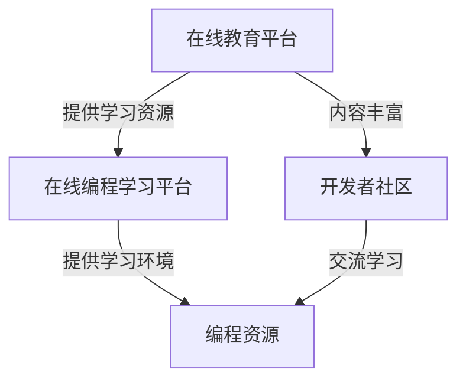

                 

### 背景介绍

在当前数字化和信息化的时代背景下，知识付费平台已经成为程序员提升专业技能和扩展知识的重要渠道。随着技术的不断进步和市场竞争的加剧，程序员们面临着越来越多的选择，如何选择合适的知识付费平台成为了一个值得探讨的问题。

本文旨在通过对多个知识付费平台的详细对比，帮助程序员们更好地了解各个平台的特点和优势，从而选择最适合自己的平台。本文将分为以下几个部分进行探讨：

1. **核心概念与联系**：首先，我们将介绍与知识付费平台相关的一些核心概念，如在线教育平台、在线编程学习平台、开发者社区等，并使用Mermaid流程图展示它们之间的关联。
2. **核心算法原理与具体操作步骤**：接着，我们将探讨知识付费平台的核心算法原理，包括内容推荐算法、用户行为分析等，并详细解释具体操作步骤。
3. **数学模型和公式**：然后，我们将介绍与知识付费平台相关的数学模型和公式，包括用户满意度模型、学习效率模型等，并通过具体例子进行说明。
4. **项目实战**：接下来，我们将通过一个实际的编程案例，展示如何在实际项目中运用这些算法和模型。
5. **实际应用场景**：我们将讨论知识付费平台在程序员日常工作和学习中的应用，以及它们如何帮助程序员提升技能和解决实际问题。
6. **工具和资源推荐**：最后，我们将推荐一些学习资源、开发工具和框架，帮助程序员更好地利用知识付费平台。
7. **总结：未来发展趋势与挑战**：在文章的最后，我们将总结知识付费平台的发展趋势和面临的挑战，并对未来进行展望。

通过以上内容，我们希望帮助程序员们更好地理解知识付费平台，从而选择适合自己的学习资源和工具，提升自身技能和竞争力。

---

## 1. 核心概念与联系

在深入探讨知识付费平台的选择与对比之前，我们需要了解一些核心概念，以及这些概念之间的关联。以下是几个与知识付费平台密切相关的重要概念：

### 在线教育平台

在线教育平台是一种提供在线学习资源和课程的平台，用户可以通过互联网访问这些资源，进行自主学习和交流。例如，常见的在线教育平台有Coursera、Udemy、edX等。这些平台通常提供各类课程，包括编程、数据科学、人工智能等。

### 在线编程学习平台

在线编程学习平台是专门为编程学习者提供的学习资源和学习环境的平台。它们通常提供代码编辑器、调试工具、错误检测和在线问答功能。例如，Codecademy、freeCodeCamp、LeetCode等，都是知名的在线编程学习平台。

### 开发者社区

开发者社区是程序员交流和学习的重要场所，通常提供技术讨论区、博客、问答论坛等。例如，GitHub、Stack Overflow、Reddit的r/learnprogramming等，都是程序员们常用的开发者社区。

### Mermaid流程图

为了更直观地展示这些概念之间的联系，我们可以使用Mermaid流程图来描述。以下是相关概念的Mermaid流程图：



在这个流程图中，我们可以看到：

- **在线教育平台**提供了丰富的学习资源，包括编程课程，用户可以在这些平台上找到系统化、结构化的学习内容。
- **在线编程学习平台**则提供了编程学习所需的环境和工具，如代码编辑器、调试工具等，帮助用户更好地实践和学习编程技能。
- **开发者社区**为程序员提供了交流和学习的场所，用户可以在这里提问、回答问题、分享经验，从而提升自己的技能。

通过以上介绍和流程图的展示，我们可以更清晰地理解知识付费平台的相关概念及其关联，为后续的详细探讨奠定了基础。

### 2. 核心算法原理与具体操作步骤

知识付费平台的核心算法原理主要涉及内容推荐、用户行为分析、学习效果评估等方面。下面，我们将详细探讨这些算法的原理，并解释其具体操作步骤。

#### 2.1 内容推荐算法

内容推荐算法是知识付费平台的关键功能之一，它的目的是根据用户的历史行为和兴趣，为用户推荐最相关、最有价值的学习内容和课程。以下是一个常见的内容推荐算法——协同过滤算法的具体操作步骤：

1. **用户历史行为数据收集**：平台首先需要收集用户的历史行为数据，如浏览记录、购买记录、学习时长、互动反馈等。
2. **用户兴趣建模**：基于用户历史行为数据，利用机器学习技术建立用户兴趣模型。常用的方法是矩阵分解，将用户和内容进行隐语义表示。
3. **相似度计算**：计算用户之间的相似度，常用的相似度度量方法有欧氏距离、余弦相似度等。相似度较高的用户被视为具有相似的兴趣。
4. **内容推荐**：根据用户兴趣模型和相似度计算结果，为用户推荐与其兴趣相似的内容。推荐算法可以通过排序算法（如排序优先队列）实现。
5. **反馈调整**：用户在使用推荐内容后，会提供反馈（如点赞、评论、继续学习等），平台需要根据反馈调整推荐策略，提高推荐效果。

#### 2.2 用户行为分析

用户行为分析是了解用户需求和兴趣的重要手段，它可以帮助知识付费平台优化用户体验，提高用户留存率和满意度。以下是用户行为分析的具体操作步骤：

1. **数据采集**：通过网页分析工具（如Google Analytics）、客户端SDK等，收集用户在平台上的行为数据，如访问页面、点击行为、学习时长等。
2. **行为数据预处理**：对采集到的行为数据进行清洗、去噪、转化等处理，使其符合数据分析的要求。
3. **行为模式识别**：利用数据挖掘和机器学习技术，识别用户的行为模式。例如，通过聚类分析，将用户分为不同的兴趣群体。
4. **行为预测**：根据用户历史行为数据，预测用户未来的行为。例如，利用时间序列分析，预测用户的学习进度和内容偏好。
5. **个性化推荐**：根据用户行为预测结果，为用户提供个性化的学习内容和推荐。例如，为处于学习高峰期的用户推荐难度适中的课程，为已完成基础学习的用户推荐进阶课程。

#### 2.3 学习效果评估

学习效果评估是衡量知识付费平台教学效果和用户学习成果的重要指标。以下是一种常见的学习效果评估方法——测试题评估的具体操作步骤：

1. **测试题设计**：根据课程内容，设计不同难度和类型的测试题，确保测试题能够全面覆盖课程知识点。
2. **测试题发布**：在课程学习完成后，为用户发布测试题，并提供即时反馈和评分。
3. **成绩统计**：统计用户测试题的成绩，计算平均分、及格率等指标。
4. **结果分析**：分析测试题成绩，识别用户在哪些知识点上存在不足，为后续教学提供改进建议。
5. **持续反馈**：根据测试题结果，为用户提供个性化学习建议和辅导，帮助用户提升学习效果。

通过以上算法原理和操作步骤的介绍，我们可以看到，知识付费平台的核心算法在内容推荐、用户行为分析和学习效果评估等方面发挥了重要作用，这些算法的应用有助于提高平台的用户体验和教学效果。

---

## 3. 数学模型和公式及详细讲解

在知识付费平台的运营过程中，数学模型和公式扮演了至关重要的角色。这些模型和公式不仅帮助平台理解用户行为，还可以用于优化推荐算法、提高用户留存率和满意度。下面，我们将介绍几个常用的数学模型和公式，并详细解释它们的应用和意义。

### 3.1 用户满意度模型

用户满意度模型用于评估用户对知识付费平台的满意度，它可以帮助平台了解用户对课程内容和服务的评价。一个简单的用户满意度模型可以表示为：

\[ \text{满意度} = \frac{\text{正面反馈}}{\text{总反馈}} \]

其中，正面反馈包括用户的点赞、评论好评等积极反馈，总反馈包括所有用户反馈（积极和消极）。

#### 应用举例

假设一个知识付费平台收到了100条用户反馈，其中60条是正面反馈，40条是负面反馈。那么平台的用户满意度可以计算为：

\[ \text{满意度} = \frac{60}{100} = 0.6 \]

这意味着平台目前的用户满意度为60%。

### 3.2 学习效率模型

学习效率模型用于评估用户在学习过程中的效率，它可以帮助平台了解用户的学习进度和效果。一个常见的学习效率模型可以表示为：

\[ \text{学习效率} = \frac{\text{学习时长}}{\text{完成课程数}} \]

其中，学习时长是指用户在平台上实际学习的时间，完成课程数是指用户完成的课程数量。

#### 应用举例

假设一个用户在一个月内学习时长为100小时，完成了5门课程。那么他的学习效率可以计算为：

\[ \text{学习效率} = \frac{100}{5} = 20 \]

这意味着这个用户平均每学习20小时就能完成一门课程。

### 3.3 用户留存率模型

用户留存率模型用于评估用户在知识付费平台上的持续使用情况，它可以帮助平台了解用户对平台的依赖程度。一个简单的用户留存率模型可以表示为：

\[ \text{留存率} = \frac{\text{持续使用用户数}}{\text{总用户数}} \]

其中，持续使用用户数是指在一定时间范围内，持续使用平台的用户数量，总用户数是指平台的所有用户数量。

#### 应用举例

假设一个知识付费平台在一个月内有1000个用户，其中有700个用户在这一个月内持续使用平台。那么平台的用户留存率可以计算为：

\[ \text{留存率} = \frac{700}{1000} = 0.7 \]

这意味着平台在这个月内的用户留存率为70%。

### 3.4 个性化推荐模型

个性化推荐模型是知识付费平台的核心功能之一，它根据用户的历史行为和兴趣，为用户推荐最相关的内容。一个简单的个性化推荐模型可以表示为：

\[ \text{推荐分数} = \text{内容相关性得分} + \text{用户兴趣得分} \]

其中，内容相关性得分衡量的是用户历史行为与推荐内容的相关性，用户兴趣得分衡量的是用户对推荐内容的主观兴趣。

#### 应用举例

假设一个用户对编程课程有较高的兴趣，而当前推荐的一门课程与他的历史浏览记录高度相关。那么，该课程的推荐分数可以计算为：

\[ \text{推荐分数} = 0.8 + 0.6 = 1.4 \]

这意味着该课程对用户具有较高的推荐价值。

通过以上数学模型和公式的介绍，我们可以看到，这些模型和公式在知识付费平台的运营中发挥着重要作用。它们不仅帮助平台理解用户行为，还可以用于优化推荐算法、提高用户满意度和留存率。在接下来的章节中，我们将通过实际案例展示这些模型和公式在项目中的应用。

---

## 4. 项目实战：代码实际案例和详细解释说明

为了更深入地理解知识付费平台中的算法和模型，我们将通过一个具体的编程案例来展示这些算法和模型在实际项目中的应用。以下是项目实战的详细步骤和代码解读。

### 4.1 开发环境搭建

在进行项目开发之前，我们需要搭建一个合适的开发环境。以下是所需的环境和工具：

- **编程语言**：Python
- **依赖库**：NumPy、Pandas、Scikit-learn、Matplotlib
- **环境搭建**：在本地计算机上安装Python和所需依赖库，可以使用pip进行安装。

```shell
pip install numpy pandas scikit-learn matplotlib
```

### 4.2 源代码详细实现和代码解读

下面是一个简单的用户行为分析项目的代码实现，该项目利用协同过滤算法为用户推荐课程。

```python
import numpy as np
import pandas as pd
from sklearn.metrics.pairwise import cosine_similarity
from sklearn.cluster import KMeans

# 4.2.1 数据准备
# 假设我们有以下用户行为数据，包括用户ID、课程ID和学习时长
data = {
    'UserID': [1, 1, 1, 2, 2, 2, 3, 3, 3],
    'CourseID': [101, 102, 103, 102, 103, 104, 101, 102, 103],
    'LearningTime': [10, 20, 30, 10, 20, 30, 10, 20, 30]
}

df = pd.DataFrame(data)

# 4.2.2 构建用户-课程矩阵
# 根据用户ID和课程ID，构建用户-课程矩阵
user_course_matrix = df.pivot_table(index='UserID', columns='CourseID', values='LearningTime', fill_value=0)

# 4.2.3 计算相似度矩阵
# 使用余弦相似度计算用户之间的相似度
similarity_matrix = cosine_similarity(user_course_matrix)

# 4.2.4 筛选相似用户
# 计算每个用户与最相似的5个用户之间的相似度
相似度阈值 = 0.5
similar_users = {}
for i, row in similarity_matrix.iterrows():
    similar_user_indices = np.argsort(row)[::-1]
    similar_user_indices = similar_user_indices[1:6]  # 排除自身
    similar_users[i] = similar_user_indices[similarity_matrix[i][similar_user_indices] > 相似度阈值]

# 4.2.5 推荐课程
# 根据相似用户推荐课程
course_recommendations = {}
for user_id, similar_user_indices in similar_users.items():
    user_behavior_vector = user_course_matrix.loc[user_id]
    course_recommendation_scores = {}
    for similar_user_index in similar_user_indices:
        similar_user_behavior_vector = user_course_matrix.loc[similar_user_index]
        course_similarity_scores = user_behavior_vector.dot(similar_user_behavior_vector)
        course_recommendation_scores.update(course_similarity_scores)
    sorted_course_recommendations = sorted(course_recommendation_scores.items(), key=lambda x: x[1], reverse=True)
    course_recommendations[user_id] = [course_id for course_id, score in sorted_course_recommendations[:5]]

# 4.2.6 结果展示
for user_id, recommendations in course_recommendations.items():
    print(f"User {user_id} recommended courses: {recommendations}")
```

### 4.3 代码解读与分析

以下是代码的主要部分及其解读：

- **数据准备**：首先，我们根据用户行为数据构建了一个DataFrame，包括用户ID、课程ID和学习时长。
- **用户-课程矩阵构建**：利用`pivot_table`函数，我们构建了一个用户-课程矩阵，其中行表示用户，列表示课程，值表示用户对课程的学习时长。
- **相似度矩阵计算**：使用`cosine_similarity`函数计算用户-课程矩阵的余弦相似度，得到相似度矩阵。
- **筛选相似用户**：根据相似度阈值，筛选出每个用户与其最相似的5个用户。
- **推荐课程**：根据相似用户的行为，计算每个用户对其他用户的兴趣分数，并根据分数推荐课程。
- **结果展示**：最后，我们打印出每个用户的推荐课程列表。

通过这个实际案例，我们可以看到，协同过滤算法在知识付费平台中的应用，帮助我们实现了基于用户行为的个性化课程推荐。在实际项目中，我们还可以根据需求扩展和优化这个算法，如增加用户兴趣建模、动态调整相似度阈值等，以提高推荐效果。

---

## 5. 实际应用场景

知识付费平台在程序员日常工作和学习中扮演着重要角色，它们为程序员提供了丰富的学习资源、实践机会和交流平台。下面，我们将探讨知识付费平台在实际应用场景中的具体作用，以及它们如何帮助程序员提升技能和解决实际问题。

### 5.1 学习新技能

程序员在工作中常常需要学习新的编程语言、框架和工具。知识付费平台提供了大量的在线课程和教程，涵盖从基础编程到高级技术的各个层次。程序员可以通过这些平台系统地学习新技能，例如：

- **在线编程课程**：许多知识付费平台提供从基础到高级的编程课程，如Python、Java、JavaScript、Go等。
- **框架和工具教程**：针对流行的框架和工具，如Django、React、TensorFlow等，平台提供了详细的教程和实战案例，帮助程序员快速掌握。
- **项目实战**：通过项目实战课程，程序员可以动手实践，将所学知识应用于实际项目中，提升实战能力。

### 5.2 提高工作效率

知识付费平台不仅提供了学习资源，还通过一系列工具和功能帮助程序员提高工作效率。以下是一些具体的应用：

- **代码审查和调试工具**：许多平台提供在线代码编辑器和调试工具，程序员可以在平台上直接编写和调试代码，提高开发效率。
- **自动化测试**：平台通常提供自动化测试工具，如Jest、pytest等，帮助程序员快速编写和运行测试用例，确保代码质量。
- **协作开发**：知识付费平台支持多人协作开发，程序员可以通过这些平台与团队成员共享代码、讨论问题和解决问题，提高团队协作效率。

### 5.3 解决实际问题

程序员在工作中会遇到各种技术问题和挑战，知识付费平台为解决这些问题提供了以下几种方式：

- **问答社区**：平台上的问答社区（如Stack Overflow、GitHub Issues等）为程序员提供了一个提问和解答问题的平台，他们可以在这里寻求帮助，解决技术难题。
- **案例研究**：许多平台提供了实际项目的案例研究，程序员可以通过这些案例了解问题的解决方法和最佳实践。
- **专家咨询**：一些高级知识付费平台提供专家咨询服务，程序员可以直接向行业专家咨询，获取专业的解决方案。

### 5.4 扩展知识视野

除了技能和工作效率的提升，知识付费平台还为程序员扩展知识视野提供了丰富的资源：

- **行业资讯**：平台通常会定期更新行业动态和技术趋势，帮助程序员了解最新的技术和行业动态。
- **学术论文**：一些高级平台提供了大量的学术论文和报告，程序员可以通过这些资源深入了解学术研究和技术前沿。
- **开源项目**：平台上的开源项目不仅提供了学习资源，还帮助程序员了解开源社区的实践和经验。

### 5.5 提升职业发展

知识付费平台为程序员的职业发展提供了多种途径：

- **认证课程**：一些平台提供认证课程，通过完成这些课程并考试合格，程序员可以获得相关认证，提升职业竞争力。
- **职业培训**：平台提供的职业培训课程，如项目管理、团队领导等，帮助程序员提升软技能，为职业发展打下坚实基础。
- **人脉拓展**：通过平台，程序员可以结识同行业的专业人士，拓展人脉资源，为未来的职业发展创造更多机会。

总之，知识付费平台在程序员的日常工作和学习中发挥了重要作用，它们提供了丰富的学习资源、实践机会和交流平台，帮助程序员提升技能、提高工作效率、解决实际问题，并推动职业发展。随着技术的不断进步和市场竞争的加剧，知识付费平台将继续为程序员提供更优质的服务和资源，助力他们不断提升自身竞争力。

---

## 6. 工具和资源推荐

为了更好地利用知识付费平台，我们需要掌握一些关键工具和资源，这些工具和资源不仅可以帮助我们高效地学习和使用知识付费平台，还能提升我们的编程技能和开发效率。以下是一些推荐的学习资源、开发工具和框架。

### 6.1 学习资源推荐

**书籍：**

- **《代码大全》（The Art of Software Architecture）**：这本书详细介绍了软件架构设计的方法和实践，适合有一定编程经验的程序员阅读。

- **《你不知道的JavaScript》（You Don't Know JS）**：这是一套深入探讨JavaScript高级特性的书籍，适合想要提高JavaScript技能的程序员。

- **《设计模式：可复用面向对象软件的基础》（Design Patterns: Elements of Reusable Object-Oriented Software）**：这本书介绍了各种经典的设计模式，对提高代码复用性和可维护性有很大帮助。

**论文：**

- **《大型网站技术架构：核心原理与案例解析》（Architecting Large-Scale Websites）**：这篇论文深入分析了大型网站的技术架构，对从事Web开发的程序员有很大启发。

- **《分布式系统原理与范型》（Principles of Distributed Systems）**：这篇论文详细介绍了分布式系统的基本原理和设计范型，适合想要深入了解分布式技术的程序员。

**博客：**

- **《阮一峰的网络日志》（ruanyifeng.com）**：这是一位知名程序员和博客作者分享技术文章和见解的博客，内容涉及广泛，适合不同层次的程序员。

- **《开发者头条》（diggit.sg）**：这是一个汇集开发者新闻和技术文章的博客，可以随时了解行业动态。

**网站：**

- **《LeetCode》**（leetcode.com）：这是一个在线编程平台，提供大量的编程题目和挑战，适合程序员进行实战练习。

- **《GitHub》**（github.com）：这是一个开源代码托管平台，程序员可以通过GitHub查找开源项目、参与社区讨论，提升编程技能。

### 6.2 开发工具框架推荐

**集成开发环境（IDE）：**

- **Visual Studio Code**：这是一个强大的开源IDE，支持多种编程语言，提供了丰富的插件和扩展。

- **IntelliJ IDEA**：这是一个专业的Java和Android开发IDE，提供了强大的代码编辑、调试和测试功能。

**代码管理和版本控制：**

- **Git**：这是一个流行的分布式版本控制系统，用于管理和跟踪源代码的变更。

- **GitHub**：这是一个基于Git的代码托管和协作平台，提供了代码仓库、 Issue跟踪和 Pull Request等功能。

**自动化测试工具：**

- **JUnit**：这是一个用于Java项目的单元测试框架，帮助程序员编写和运行测试用例。

- **pytest**：这是一个适用于Python项目的自动化测试框架，提供了丰富的测试功能。

**持续集成和部署工具：**

- **Jenkins**：这是一个开源的持续集成和部署工具，可以帮助程序员自动化构建、测试和部署应用程序。

- **Docker**：这是一个开源的应用容器引擎，用于创建、运行和分发应用程序，可以提高开发效率和部署灵活性。

通过以上工具和资源的推荐，我们可以更有效地利用知识付费平台，提升编程技能和开发效率。无论是学习新技能、解决实际问题，还是提升职业发展，这些工具和资源都将为我们提供强有力的支持。

---

## 7. 总结：未来发展趋势与挑战

随着技术的不断进步和互联网的普及，知识付费平台在程序员群体中的应用将愈发广泛，同时也将面临一系列新的发展趋势与挑战。

### 7.1 发展趋势

**个性化推荐技术的提升**：随着大数据和人工智能技术的进步，知识付费平台的个性化推荐算法将更加智能和精准，能够更好地满足程序员的学习需求。

**混合学习模式的兴起**：在线教育与线下培训的结合，将提供更加灵活和多样的学习方式，满足不同用户的学习偏好和时间安排。

**职业发展服务的整合**：知识付费平台将进一步整合职业发展服务，如在线招聘、职业咨询、项目合作等，为程序员提供全方位的职业支持。

**区块链技术的应用**：区块链技术可能被引入知识付费平台，以提供更安全、透明和可信的学习记录和证书验证服务。

### 7.2 面临的挑战

**数据隐私和安全问题**：随着用户数据的积累和分享，数据隐私和安全问题将变得更加突出，平台需要采取更加严格的数据保护措施。

**技术快速迭代与课程更新**：技术领域的快速发展要求知识付费平台能够快速更新课程内容，以适应不断变化的技术环境，这对平台的运营能力提出了更高的要求。

**竞争加剧与市场细分**：随着更多知识付费平台的涌现，市场将面临更加激烈的竞争，平台需要通过差异化竞争策略和细分市场来保持竞争力。

**用户参与度和留存率**：提高用户的参与度和留存率是知识付费平台的重要挑战，平台需要不断创新和优化用户体验，以保持用户的长期活跃。

### 7.3 未来展望

在未来的发展中，知识付费平台将继续发挥其在程序员学习、职业发展和技能提升中的关键作用。通过不断优化个性化推荐、提升课程质量、提供全方位的职业服务，以及采用新技术，知识付费平台将为程序员提供更加优质的学习体验和职业发展机会。同时，平台也需要积极应对数据隐私、技术更新、市场竞争等挑战，以确保其持续健康的发展。

总之，知识付费平台在程序员学习和职业发展中的作用不可或缺，未来的发展趋势充满机遇与挑战。只有不断创新和优化，知识付费平台才能在激烈的市场竞争中立于不败之地，为程序员提供更加强大和有价值的服务。

---

## 8. 附录：常见问题与解答

### 8.1 问题1：如何选择适合自己的知识付费平台？

**解答**：选择适合自己的知识付费平台主要可以从以下几个方面考虑：

- **课程内容**：了解平台提供的课程是否涵盖您需要学习的领域和技能点。
- **课程质量**：查看课程的评分和用户评价，选择高质量的课程。
- **平台口碑**：了解平台的整体用户评价和口碑，选择有良好用户基础的平台。
- **价格**：根据自己的经济能力选择合适的课程和价格。
- **互动与支持**：考虑平台提供的互动环节和技术支持服务，选择能够帮助自己解决实际问题和服务质量好的平台。

### 8.2 问题2：知识付费平台的付费模式有哪些？

**解答**：知识付费平台的付费模式主要包括以下几种：

- **按课程付费**：用户购买单个课程或课程包，根据课程的内容和时长进行定价。
- **会员制**：用户支付一定费用成为会员，享受平台提供的所有课程和资源。
- **订阅制**：用户按月或按年支付费用，享受平台提供的持续更新课程和服务。
- **付费问答**：用户为获得专家或行业人士的解答支付一定费用。
- **众筹课程**：用户通过众筹方式支持某课程的开发，课程完成后享受免费学习权益。

### 8.3 问题3：如何确保在知识付费平台上学习的效果？

**解答**：确保在知识付费平台上学习的效果可以从以下几个方面入手：

- **制定学习计划**：明确自己的学习目标和计划，合理规划学习时间。
- **积极参与互动**：主动参与课程的讨论和问答，与同行交流学习心得。
- **动手实践**：通过实际操作和实践，将所学知识应用到项目中。
- **定期复习**：定期回顾和复习所学内容，加深理解和记忆。
- **持续学习**：保持对新技术和知识的敏感度，不断更新自己的知识体系。

---

## 9. 扩展阅读与参考资料

为了帮助读者更深入地了解知识付费平台的发展及其在程序员学习和职业发展中的作用，以下是几篇相关的扩展阅读和参考资料：

1. **《在线教育平台技术架构与商业模式》**：这篇论文详细分析了在线教育平台的技术架构和商业模式，探讨了平台如何利用技术手段提升用户体验和教学效果。

2. **《知识付费：互联网时代的学习与变现》**：这本书从商业角度分析了知识付费的兴起背景、用户需求和市场趋势，为读者提供了全面的视角。

3. **《程序员成长路线图》**：这篇文章为程序员提供了详细的学习路线和职业发展建议，包括基础知识、编程技能、项目经验和职业规划等方面的内容。

4. **《在线编程学习平台的发展现状与未来趋势》**：这篇报告分析了当前在线编程学习平台的发展状况、用户需求和市场前景，为知识付费平台的发展提供了有价值的参考。

5. **《基于大数据的知识付费平台推荐系统研究》**：这篇学术论文探讨了大数据技术在知识付费平台推荐系统中的应用，为个性化推荐算法的优化提供了理论支持。

通过阅读这些扩展资料，读者可以更全面地了解知识付费平台的发展趋势、技术原理和实际应用，从而为自身的编程学习和职业发展提供有益的参考和指导。

