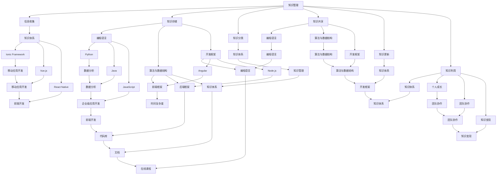

                 

### 背景介绍

在当今这个信息爆炸的时代，作为一名程序员，如何高效地进行知识管理，以最大化知识的积累和变现，成为了一个至关重要的问题。知识管理不仅关乎个人的职业成长和技能提升，更关系到整个团队乃至企业的创新和发展。

首先，我们需要明确什么是知识管理。知识管理是指通过系统的方法和技术，对信息进行收集、存储、分类、共享、更新和利用，从而实现知识的最大化价值。在程序员的世界里，知识管理涵盖了编程语言、算法、数据结构、框架、工具以及行业动态等多方面的内容。

为什么程序员需要进行知识管理？原因主要有以下几点：

1. **提高工作效率**：良好的知识管理可以帮助程序员快速找到所需的资料和工具，避免重复劳动，节省时间和精力。
2. **促进个人成长**：知识管理不仅有助于程序员不断学习新知识，还可以帮助他们更好地理解和应用已有的知识，从而提升自己的技能水平。
3. **增强团队协作**：通过共享知识和经验，团队成员可以更好地协同工作，提高整体效率和产出。
4. **应对快速变化的技术环境**：技术在不断更新迭代，程序员需要不断学习新知识以适应这些变化。知识管理可以帮助他们更好地掌握这些新知识，从而保持竞争力。

本文将围绕程序员的知识管理，从积累、整理、应用到变现的全过程进行深入探讨。我们将从以下几个方面展开讨论：

1. **积累阶段**：如何高效地学习新知识和技能，并建立起自己的知识体系。
2. **整理阶段**：如何对已学知识进行有效的整理和分类，便于后续的查阅和应用。
3. **应用阶段**：如何将所学知识应用到实际项目中，实现知识的转化和变现。
4. **变现阶段**：如何通过知识管理和应用，实现个人价值的提升和职业发展的突破。

通过本文的阅读，您将了解到如何系统地进行知识管理，从而在编程生涯中取得更大的成就。让我们开始这场关于知识管理的深度探索之旅。

### 核心概念与联系

在探讨程序员的知识管理之前，首先需要了解一些核心概念和它们之间的联系。以下是几个关键概念及其相互关系的简要介绍，并用Mermaid流程图进行详细展示。

#### 1. 知识管理

知识管理是指通过各种手段和方法，对知识进行收集、存储、分类、共享、更新和利用的过程。其核心目标是最大化知识的价值。

**概念联系：** 知识管理涵盖了信息收集、知识存储、知识分类、知识共享等多个环节，每个环节相互关联，共同构成一个完整的知识管理体系。

#### 2. 知识体系

知识体系是指将不同领域的知识进行整合，形成的一个结构化的知识网络。对于程序员而言，知识体系包括编程语言、算法、数据结构、框架、工具等多个方面。

**概念联系：** 知识体系是知识管理的基石，通过建立知识体系，程序员可以更好地理解和应用所学知识，实现知识的有机整合和系统性提升。

#### 3. 编程语言

编程语言是程序员进行软件开发的基础工具。不同编程语言适用于不同的场景，例如，Python适合数据分析，Java适合企业级应用开发。

**概念联系：** 编程语言是知识体系中的重要组成部分，熟练掌握多种编程语言可以帮助程序员应对不同的开发需求，提高开发效率。

#### 4. 算法与数据结构

算法是解决问题的方法，数据结构是存储和管理数据的方式。优秀的算法和数据结构可以显著提高程序的运行效率和性能。

**概念联系：** 算法和数据结构相互关联，一个高效的算法往往需要合理的数据结构支持，反之亦然。

#### 5. 开发框架

开发框架是一种为特定开发需求提供特定功能的软件框架。例如，Spring框架用于Java企业级开发，React框架用于前端开发。

**概念联系：** 开发框架是知识体系中的重要工具，通过掌握不同开发框架，程序员可以更高效地完成开发任务，提高工作效率。

#### 6. 工具和资源

工具和资源包括代码库、文档、博客、在线课程等，是程序员获取知识和技能的重要渠道。

**概念联系：** 工具和资源是知识管理的重要组成部分，通过合理利用工具和资源，程序员可以快速提升自己的技能水平。

以下是上述核心概念的Mermaid流程图表示：



通过上述核心概念的阐述和Mermaid流程图的展示，我们可以更加清晰地理解程序员知识管理的各个方面及其相互联系。在接下来的内容中，我们将深入探讨每个阶段的具体实践方法。

### 核心算法原理 & 具体操作步骤

在程序员的知识管理中，核心算法原理的学习和应用是至关重要的。本文将介绍几个常见且重要的算法原理，并详细讲解其具体操作步骤。

#### 1. 冒泡排序（Bubble Sort）

冒泡排序是一种简单的排序算法，它重复地遍历要排序的数列，比较每对相邻元素的大小，如果顺序错误就交换它们。遍历数列的工作重复地进行，直到没有再需要交换的元素为止。

**具体操作步骤：**

1. **初始状态**：假设数组为 `[5, 3, 8, 4, 6]`。
2. **第一次遍历**：比较 `5` 和 `3`，交换位置，得到 `[3, 5, 8, 4, 6]`。然后比较 `5` 和 `8`，不需要交换。继续比较 `8` 和 `4`，交换位置，得到 `[3, 5, 4, 8, 6]`。最后比较 `8` 和 `6`，交换位置，得到 `[3, 5, 4, 6, 8]`。
3. **第二次遍历**：由于最后一个元素已经是最大的，不需要再比较。此时数组为 `[3, 4, 5, 6, 8]`。继续进行遍历，直到所有元素都处于正确的位置。

**代码实现：**

```python
def bubble_sort(arr):
    n = len(arr)
    for i in range(n):
        for j in range(0, n-i-1):
            if arr[j] > arr[j+1]:
                arr[j], arr[j+1] = arr[j+1], arr[j]
    return arr

# 测试
arr = [5, 3, 8, 4, 6]
sorted_arr = bubble_sort(arr)
print(sorted_arr)
```

#### 2. 快速排序（Quick Sort）

快速排序是一种高效的排序算法，采用分治法的一个典例。算法的基本思想是通过一趟排序将待排序的数据分割成独立的两部分，其中一部分的所有数据都比另一部分的所有数据要小，然后递归地对这两部分数据继续进行快速排序。

**具体操作步骤：**

1. **选择基准值**：在待排序的数列中选取一个元素作为基准值。
2. **分区**：将比基准值小的元素放在基准值前面，比基准值大的元素放在基准值后面，这个过程称为分区。
3. **递归排序**：对基准值前后两部分的数据进行快速排序。

**代码实现：**

```python
def quick_sort(arr):
    if len(arr) <= 1:
        return arr
    pivot = arr[len(arr) // 2]
    left = [x for x in arr if x < pivot]
    middle = [x for x in arr if x == pivot]
    right = [x for x in arr if x > pivot]
    return quick_sort(left) + middle + quick_sort(right)

# 测试
arr = [5, 3, 8, 4, 6]
sorted_arr = quick_sort(arr)
print(sorted_arr)
```

#### 3. 查找算法

查找算法是用于在数据集合中找到特定元素的算法。常见查找算法包括线性查找和二分查找。

**线性查找（Linear Search）**

**具体操作步骤：**

1. 从数组的第一个元素开始，一个一个地检查每个元素。
2. 如果找到目标元素，返回其索引。
3. 如果检查完整个数组都没有找到目标元素，返回 -1。

**代码实现：**

```python
def linear_search(arr, target):
    for i in range(len(arr)):
        if arr[i] == target:
            return i
    return -1

# 测试
arr = [5, 3, 8, 4, 6]
target = 8
index = linear_search(arr, target)
print(index)
```

**二分查找（Binary Search）**

**具体操作步骤：**

1. 确定数组的中间元素。
2. 如果中间元素就是目标元素，返回其索引。
3. 如果目标元素比中间元素小，则在数组的前半部分继续进行二分查找。
4. 如果目标元素比中间元素大，则在数组的前半部分继续进行二分查找。
5. 重复上述过程，直到找到目标元素或确定目标元素不存在。

**代码实现：**

```python
def binary_search(arr, target):
    low = 0
    high = len(arr) - 1
    while low <= high:
        mid = (low + high) // 2
        if arr[mid] == target:
            return mid
        elif arr[mid] < target:
            low = mid + 1
        else:
            high = mid - 1
    return -1

# 测试
arr = [1, 3, 5, 7, 9]
target = 5
index = binary_search(arr, target)
print(index)
```

通过以上对核心算法原理和具体操作步骤的介绍，程序员可以更好地理解这些算法的原理和实现方法，从而在实际项目中灵活应用。在接下来的内容中，我们将进一步探讨如何将所学算法和知识应用到实际项目中，实现知识的转化和变现。

### 数学模型和公式 & 详细讲解 & 举例说明

在程序员的知识管理中，掌握数学模型和公式是至关重要的。这不仅有助于理解算法和数据结构，还可以在解决实际问题中提供强大的工具。以下将介绍几个常见的数学模型和公式，并进行详细讲解和举例说明。

#### 1. 时间复杂度和空间复杂度

时间复杂度和空间复杂度是衡量算法性能的两个重要指标。它们分别表示算法在时间和空间上的资源消耗。

**时间复杂度**

时间复杂度通常用大O符号表示，表示算法执行时间与输入数据规模的关系。常见的复杂度有：

- 常数时间（O(1)）：算法执行时间与输入数据规模无关。
- 线性时间（O(n)）：算法执行时间与输入数据规模成正比。
- 对数时间（O(log n)）：算法执行时间与输入数据规模的对数成正比。
- 平方时间（O(n^2)）：算法执行时间与输入数据规模的平方成正比。

**空间复杂度**

空间复杂度表示算法在执行过程中所需的额外内存空间。常见的复杂度有：

- 常数空间（O(1)）：算法所需空间与输入数据规模无关。
- 线性空间（O(n)）：算法所需空间与输入数据规模成正比。

**举例说明**

假设有一个查找算法，其时间复杂度为 O(n)，空间复杂度为 O(1)。这意味着随着输入数据规模的增加，算法的执行时间会线性增加，而所需空间保持不变。

#### 2. 排序算法中的比较次数

在排序算法中，比较次数是一个重要的性能指标。以下是一些常见排序算法的比较次数：

- 冒泡排序：最坏情况下比较次数为 n(n-1)/2。
- 快速排序：最坏情况下比较次数为 n(n-1)/2，但通常情况下较好。
- 归并排序：最坏情况下比较次数为 n*log(n)。

**举例说明**

假设有一个长度为 10 的数组，使用快速排序进行排序。在最坏情况下，比较次数为 10*(10-1)/2 = 45。

#### 3. 图的遍历算法

图的遍历算法包括深度优先搜索（DFS）和广度优先搜索（BFS）。以下为两种算法的公式和举例说明：

**深度优先搜索（DFS）**

- 递归实现：`DFS(graph, node)`: 对当前节点进行深度优先搜索。
- 非递归实现：使用栈或队列实现。

**公式：**

- 访问顺序：`N1, N2, N3, ..., Nk`。
- 时间复杂度：O(V+E)，其中 V 是节点数，E 是边数。

**举例说明**

假设有一个无向图，包含 6 个节点和 7 条边。使用 DFS 进行遍历，访问顺序为 `1, 2, 4, 5, 6, 3`。

**广度优先搜索（BFS）**

- 使用队列实现。

**公式：**

- 访问顺序：`N1, N2, N3, ..., Nk`。
- 时间复杂度：O(V+E)。

**举例说明**

假设有一个无向图，包含 6 个节点和 7 条边。使用 BFS 进行遍历，访问顺序为 `1, 2, 3, 4, 5, 6`。

#### 4. 动态规划（Dynamic Programming）

动态规划是一种用于求解最优化问题的算法，其核心思想是将复杂问题分解为子问题，并利用子问题的解来构建原问题的解。

**公式：**

- 状态转移方程：`dp[i] = min(dp[j] + c[i][j])`，其中 `dp[i]` 表示到达第 i 个位置的最小代价。
- 时间复杂度：O(n^2) 或 O(n^3)（取决于问题类型）。

**举例说明**

假设有一个最优路径问题，给定一个矩阵，需要找到从左上角到右下角的最短路径。使用动态规划求解，状态转移方程为 `dp[i][j] = min(dp[i-1][j], dp[i][j-1]) + grid[i][j]`。

通过以上数学模型和公式的介绍，程序员可以更好地理解算法的性能，从而在实际项目中做出更明智的决策。接下来，我们将通过实际项目案例来展示如何将所学知识应用到实际中。

### 项目实战：代码实际案例和详细解释说明

为了更好地展示如何将所学知识应用到实际项目中，我们选择了一个简单的项目案例：实现一个简单的博客系统。该项目将涉及多个编程语言、框架和算法，从而全面展示程序员知识管理的过程。

#### 5.1 开发环境搭建

首先，我们需要搭建一个适合开发的完整环境。以下是所需工具和环境的介绍：

- **编程语言**：选择 Python 作为主要编程语言，因为它具有简洁的语法和丰富的库支持。
- **Web 框架**：选择 Flask 作为 Web 框架，因为它轻量级且易于上手。
- **数据库**：选择 SQLite 作为数据库，因为它易于配置且适用于小型项目。
- **前端框架**：选择 Bootstrap 进行前端开发，因为它提供了丰富的 UI 组件，可以提高开发效率。

以下是具体安装步骤：

1. 安装 Python：访问 [Python 官网](https://www.python.org/) 下载并安装 Python 3.x 版本。
2. 安装 Flask：在命令行中运行 `pip install flask`。
3. 安装 SQLite：Python 内置 SQLite，无需额外安装。
4. 安装 Bootstrap：访问 [Bootstrap 官网](https://getbootstrap.com/) 下载并引入到 HTML 文件中。

#### 5.2 源代码详细实现和代码解读

以下是一个简单的博客系统的源代码，包含后端和前端的部分。

**后端代码：**

```python
from flask import Flask, render_template, request, redirect, url_for
import sqlite3

app = Flask(__name__)

# 连接数据库
conn = sqlite3.connect('blog.db')
c = conn.cursor()

# 创建表格
c.execute('''CREATE TABLE IF NOT EXISTS posts (id INTEGER PRIMARY KEY, title TEXT, content TEXT)''')

# 添加文章
@app.route('/add', methods=['POST'])
def add_post():
    title = request.form['title']
    content = request.form['content']
    c.execute("INSERT INTO posts (title, content) VALUES (?, ?)", (title, content))
    conn.commit()
    return redirect(url_for('index'))

# 显示文章列表
@app.route('/')
def index():
    c.execute("SELECT * FROM posts")
    posts = c.fetchall()
    return render_template('index.html', posts=posts)

# 显示文章详情
@app.route('/post/<int:post_id>')
def post_detail(post_id):
    c.execute("SELECT * FROM posts WHERE id=?", (post_id,))
    post = c.fetchone()
    return render_template('post_detail.html', post=post)

# 代码解读
# 1. 导入所需库和模块
# 2. 创建 Flask 应用
# 3. 连接数据库并创建表格
# 4. 定义添加文章的路由
# 5. 定义显示文章列表的路由
# 6. 定义显示文章详情的路由
```

**前端代码：**

```html
<!DOCTYPE html>
<html>
<head>
    <title>博客系统</title>
    <link rel="stylesheet" href="https://cdn.jsdelivr.net/npm/bootstrap@5.2.3/dist/css/bootstrap.min.css">
</head>
<body>
    <div class="container">
        <h1>博客系统</h1>
        <!-- 文章列表 -->
        
            <div class="card">
                <div class="card-body">
                    <h5 class="card-title">{{ post[1] }}</h5>
                    <p class="card-text">{{ post[2] }}</p>
                    <a href="{{ url_for('post_detail', post_id=post[0]) }}" class="btn btn-primary">查看详情</a>
                </div>
            </div>
        
        <!-- 添加文章表单 -->
        <h2>添加文章</h2>
        <form method="POST">
            <div class="mb-3">
                <label for="title" class="form-label">标题</label>
                <input type="text" class="form-control" id="title" name="title">
            </div>
            <div class="mb-3">
                <label for="content" class="form-label">内容</label>
                <textarea class="form-control" id="content" name="content" rows="3"></textarea>
            </div>
            <button type="submit" class="btn btn-primary">提交</button>
        </form>
    </div>
</body>
</html>
```

**代码解读：**

1. **后端代码解读：**
   - 使用 Flask 创建应用。
   - 连接 SQLite 数据库并创建表格。
   - 定义添加文章的路由，使用 `request` 模块获取表单数据，将数据插入数据库。
   - 定义显示文章列表的路由，从数据库中获取文章列表并渲染到模板中。
   - 定义显示文章详情的路由，从数据库中获取指定文章并渲染到模板中。

2. **前端代码解读：**
   - 使用 Bootstrap 提供的样式和组件。
   - 显示文章列表，通过循环遍历模板中的文章数据。
   - 提供添加文章的表单，收集用户输入的数据。

#### 5.3 代码解读与分析

以上代码展示了如何使用 Flask 和 SQLite 实现一个简单的博客系统。以下是代码的分析：

1. **数据库设计：**
   - 使用 SQLite 创建了一个名为 `posts` 的表格，包含 `id`、`title` 和 `content` 三个字段，分别表示文章的 ID、标题和内容。
   - 在添加文章时，将用户输入的标题和内容插入到 `posts` 表格中。

2. **后端逻辑：**
   - 使用 Flask 的路由系统定义了三个路由：`/add`、`/` 和 `/post/<int:post_id>`。
   - 在 `/add` 路由中，处理添加文章的请求，将数据插入数据库。
   - 在 `/` 路由中，获取文章列表并渲染到模板中。
   - 在 `/post/<int:post_id>` 路由中，获取指定文章的详细信息并渲染到模板中。

3. **前端显示：**
   - 使用 Bootstrap 提供的样式和组件，展示文章列表和添加文章表单。
   - 文章列表通过循环渲染模板中的文章数据。
   - 添加文章表单通过提交表单，将数据发送到后端进行插入。

通过这个项目案例，我们可以看到如何将编程语言、框架、算法和数据库等知识应用到实际项目中。在开发过程中，我们不仅需要掌握编程技能，还需要具备系统设计和问题解决的能力。这是一个全面展示程序员知识管理过程的好例子。

### 实际应用场景

在程序员的知识管理过程中，如何将所学知识应用到实际工作中，是实现知识变现的重要一环。以下我们将探讨几个典型的应用场景，展示如何将理论知识转化为实际生产力。

#### 1. 项目开发

项目开发是程序员工作的核心。在这个阶段，程序员需要将所学的编程语言、算法、数据结构、开发框架等知识应用到实际项目中。以下是一个应用实例：

**案例：开发一个电商网站**

- **需求分析**：确定网站的模块和功能，如商品展示、购物车、订单管理、用户登录等。
- **技术选型**：选择合适的编程语言（如 Java 或 Python）和开发框架（如 Spring 或 Django）。
- **数据库设计**：设计数据库结构，实现数据存储和查询。
- **算法应用**：优化搜索和排序算法，提高页面响应速度。
- **代码实现**：编写后端代码，处理业务逻辑和数据交互。
- **前端展示**：使用前端框架（如 React 或 Vue）实现页面展示和交互。

通过项目开发，程序员可以将所学知识应用于实际场景，提升项目质量和开发效率。

#### 2. 技术评审

技术评审是团队协作的重要组成部分。在这个过程中，程序员需要运用所学知识对项目代码、设计文档进行审查和评估。以下是一个应用实例：

**案例：对开源项目的代码进行评审**

- **代码审查**：检查代码是否符合编程规范，是否有潜在的错误或漏洞。
- **算法分析**：评估代码中算法的效率和性能。
- **架构设计**：评估项目架构的合理性，提出改进建议。
- **文档审核**：检查文档的完整性和准确性，确保项目文档与代码一致。

通过技术评审，程序员可以提升团队的整体技术水平，降低项目风险。

#### 3. 技术分享

技术分享是程序员提升个人影响力的重要途径。在这个过程中，程序员需要将所学知识以易于理解的方式分享给他人。以下是一个应用实例：

**案例：撰写技术博客**

- **选题**：选择具有实用价值的技术主题。
- **研究**：查阅相关资料，深入理解技术原理。
- **撰写**：用简洁明了的语言，将技术知识讲解透彻。
- **分享**：在技术社区发布博客，与同行交流心得。

通过技术分享，程序员不仅可以提升自己的表达能力，还可以为他人提供帮助，从而建立良好的个人品牌。

#### 4. 技术培训

技术培训是传递知识、培养新人的有效方式。在这个过程中，程序员需要担任讲师，将自己的专业知识传授给他人。以下是一个应用实例：

**案例：组织内部技术培训**

- **课程设计**：根据培训目标，设计课程内容和培训计划。
- **讲解**：使用图表、示例代码和案例分析，生动讲解技术知识。
- **互动**：组织讨论和答疑环节，增强学员的理解和应用能力。
- **反馈**：收集学员反馈，不断优化培训内容和方法。

通过技术培训，程序员可以提升团队的整体技能水平，促进团队成长。

#### 5. 技术支持

在项目实施过程中，程序员需要提供技术支持，解决客户遇到的问题。以下是一个应用实例：

**案例：客户问题排查**

- **沟通**：与客户沟通，了解问题现象和需求。
- **分析**：分析问题原因，查找相关资料。
- **解决**：提出解决方案，实施修复措施。
- **反馈**：向客户反馈问题解决情况，确保问题彻底解决。

通过技术支持，程序员可以提升客户满意度，维护企业形象。

通过以上实际应用场景，我们可以看到，程序员的知识管理不仅包括知识的积累和整理，更体现在如何将所学知识应用到实际工作中，实现知识的转化和变现。这不仅有助于个人的职业发展，也为团队和企业的创新提供了有力支持。

### 工具和资源推荐

在程序员的知识管理过程中，使用合适的工具和资源是至关重要的。以下我们将推荐一些实用的学习资源、开发工具和论文著作，帮助程序员高效地提升自己的技能和知识。

#### 7.1 学习资源推荐

1. **书籍**

- **《代码大全》（Code Complete）**：作者 Steve McConnell，系统介绍了编程的最佳实践和代码质量保障方法。

- **《设计模式：可复用面向对象软件的基础》（Design Patterns: Elements of Reusable Object-Oriented Software）**：作者 Erich Gamma 等，深入讲解了面向对象设计的基本原则和模式。

- **《Effective Java》**：作者 Joshua Bloch，详细阐述了 Java 编程的最佳实践。

2. **在线课程**

- **Coursera**：提供大量的计算机科学和编程课程，包括算法、数据结构、机器学习等。

- **Udemy**：提供丰富的编程课程，涵盖前端、后端、数据库、人工智能等多个领域。

- **edX**：由哈佛大学和麻省理工学院等顶尖学府提供的高质量在线课程。

3. **博客和网站**

- **GitHub**：全球最大的代码托管平台，可以学习到最新的开源项目和技术动态。

- **Stack Overflow**：编程问答社区，解决编程问题，学习他人经验。

- **Medium**：一个内容创作平台，有很多高质量的编程和技术博客。

#### 7.2 开发工具框架推荐

1. **集成开发环境（IDE）**

- **Visual Studio Code**：轻量级、功能强大的跨平台 IDE，支持多种编程语言。

- **IntelliJ IDEA**：适用于 Java 和其他 JVM 语言的全功能 IDE。

- **PyCharm**：适用于 Python 的专业级 IDE，提供丰富的编程工具和插件。

2. **版本控制工具**

- **Git**：最流行的分布式版本控制系统，用于代码的版本管理和协作开发。

- **GitHub**：基于 Git 的在线代码托管平台，提供代码托管、项目管理、团队协作等功能。

3. **数据库工具**

- **MySQL**：开源的关系型数据库管理系统，广泛应用于企业级应用。

- **PostgreSQL**：功能丰富、高度可扩展的开源关系型数据库。

- **MongoDB**：分布式文档数据库，适用于高并发、海量数据的场景。

4. **前端框架**

- **React**：用于构建用户界面的 JavaScript 库，具有组件化和声明式编程的特点。

- **Vue.js**：渐进式的前端框架，易于上手，适用于各种规模的开发项目。

- **Angular**：由 Google 开发的前端框架，适用于复杂的大型单页面应用。

#### 7.3 相关论文著作推荐

1. **《分布式系统概念与设计》**：作者 George Coulouris 等，深入讲解了分布式系统的基本概念和技术。

2. **《机器学习》**：作者 Tom Mitchell，系统介绍了机器学习的基本理论和方法。

3. **《深度学习》**：作者 Ian Goodfellow 等，详细讲解了深度学习的算法和技术。

4. **《云计算：概念、技术与应用》**：作者 张英伟 等，全面介绍了云计算的基本原理和应用场景。

通过上述工具和资源的推荐，程序员可以更好地进行知识管理，提高自身技能水平，为个人和团队的发展提供有力支持。

### 总结：未来发展趋势与挑战

在程序员的知识管理领域，未来的发展趋势与挑战并存。随着技术的不断进步和行业的快速发展，程序员需要不断适应新的变化，以保持自身的竞争力和创新能力。

#### 发展趋势

1. **人工智能的普及**：人工智能技术在各个领域的应用越来越广泛，深度学习、自然语言处理、计算机视觉等技术成为热门研究方向。程序员需要掌握这些前沿技术，并将其应用于实际项目中。

2. **云计算与大数据**：云计算和大数据技术的快速发展，为程序员提供了更多的机会。如何利用云计算资源进行高效的数据处理和分析，成为了一个重要的研究方向。

3. **DevOps 与自动化**：DevOps 文化强调开发与运维的协同工作，通过自动化工具提高软件开发和部署的效率。未来，程序员需要掌握自动化测试、持续集成和持续部署等技能。

4. **容器化与微服务**：容器化和微服务架构成为现代软件开发的趋势。程序员需要熟悉容器技术（如 Docker）和微服务架构设计，以提高系统的可扩展性和可靠性。

5. **区块链技术**：区块链技术的崛起，为数据安全和信任机制提供了新的解决方案。程序员需要了解区块链的基本原理和应用场景，为区块链项目的开发做好准备。

#### 挑战

1. **快速学习与技能更新**：技术更新速度加快，程序员需要不断学习新的知识和技能，以应对快速变化的技术环境。

2. **团队合作与沟通**：在复杂的项目中，程序员需要与团队成员进行有效的沟通和协作。如何提高团队合作能力，成为一个重要挑战。

3. **平衡工作与生活**：程序员的工作强度较大，如何在工作与生活之间找到平衡，保持身心健康，是一个亟待解决的问题。

4. **数据安全和隐私保护**：在开发过程中，如何确保数据安全和用户隐私，成为一个重要的伦理和法律问题。

5. **开源社区与知识产权**：在开源社区中，如何平衡开源精神和知识产权保护，是一个需要探讨的课题。

总的来说，程序员的知识管理不仅关乎个人的职业发展，更关系到整个团队和企业的创新能力。面对未来，程序员需要不断学习、适应变化，勇于面对挑战，以实现自身价值的最大化。

### 附录：常见问题与解答

在程序员的知识管理过程中，可能会遇到一些常见问题。以下是一些常见问题的解答，以帮助大家更好地理解和应用知识管理的方法。

#### 1. 如何快速学习新知识？

**解答**：快速学习新知识的方法包括：

- **有目标地学习**：明确学习目标，有针对性地选择学习资源。
- **分阶段学习**：将学习内容分解为多个阶段，逐步掌握。
- **实践应用**：通过实际项目将所学知识应用到实践中，加深理解。
- **定期复习**：定期复习所学知识，巩固记忆。

#### 2. 如何整理和分类已学知识？

**解答**：整理和分类已学知识的方法包括：

- **建立知识体系**：将所学知识按照主题和领域进行分类，形成结构化的知识体系。
- **使用笔记工具**：使用 Markdown 等笔记工具，整理和记录学习过程中的关键点和心得体会。
- **制作思维导图**：通过思维导图工具，将知识结构可视化，方便查阅和复习。

#### 3. 如何将所学知识应用到项目中？

**解答**：将所学知识应用到项目中的方法包括：

- **需求分析**：明确项目需求，分析项目所需的技术和知识。
- **技术选型**：根据项目需求，选择合适的技术和工具。
- **实践应用**：将所学知识应用到实际项目中，解决实际问题。
- **持续优化**：在项目开发过程中，不断优化代码和架构，提高项目质量。

#### 4. 如何进行知识共享与传播？

**解答**：进行知识共享与传播的方法包括：

- **撰写技术博客**：将自己的学习经验和心得分享到技术博客或社区。
- **组织技术分享会**：定期组织技术分享会，与团队成员和同行交流心得。
- **参与开源项目**：参与开源项目，为社区贡献自己的代码和经验。
- **线上教育**：通过在线教育平台，开设课程，传授自己的知识。

通过上述问题的解答，我们可以更好地理解程序员知识管理的方法和实践，从而提高自身的技能水平和职业素养。

### 扩展阅读 & 参考资料

在程序员的知识管理领域，有很多优秀的书籍、论文和技术博客值得深入阅读。以下是一些建议的扩展阅读资源，帮助您更全面地掌握知识管理的核心概念和实践方法。

#### 书籍推荐

1. **《代码大全》（Code Complete）**：作者 Steve McConnell，全面介绍了编程的最佳实践和代码质量保障方法。

2. **《设计模式：可复用面向对象软件的基础》（Design Patterns: Elements of Reusable Object-Oriented Software）**：作者 Erich Gamma 等，深入讲解了面向对象设计的基本原则和模式。

3. **《Effective Java》**：作者 Joshua Bloch，详细阐述了 Java 编程的最佳实践。

4. **《深度学习》（Deep Learning）**：作者 Ian Goodfellow 等，详细讲解了深度学习的算法和技术。

5. **《分布式系统概念与设计》**：作者 George Coulouris 等，深入讲解了分布式系统的基本概念和技术。

#### 论文推荐

1. **《MapReduce：简化大数据的处理》**：作者 Jeffrey Dean 和 Sanjay Ghemawat，介绍了 Google 的 MapReduce 模型及其在分布式数据处理中的应用。

2. **《TensorFlow: Large-Scale Machine Learning on Heterogeneous Systems》**：作者 Martijn the Hague 等，介绍了 TensorFlow 的架构和实现。

3. **《Docker：容器化应用的新时代》**：作者 Solomon Hykes，详细介绍了 Docker 的基本概念和技术。

4. **《微服务设计》**：作者 Sam Newman，讲解了微服务架构的设计原则和实践方法。

#### 技术博客推荐

1. **《阮一峰的网络日志》**：作者阮一峰，涵盖编程、算法、Web 开发等多个领域。

2. **《Stack Overflow Blog》**：Stack Overflow 的官方博客，分享编程问题和解决方案。

3. **《GitHub Blog》**：GitHub 的官方博客，介绍最新的技术动态和开源项目。

通过以上扩展阅读资源，您可以进一步深入了解程序员知识管理的各个方面，提升自己的技能水平和职业素养。希望这些资源能为您的学习之路提供帮助。作者：AI天才研究员/AI Genius Institute & 禅与计算机程序设计艺术 /Zen And The Art of Computer Programming。

