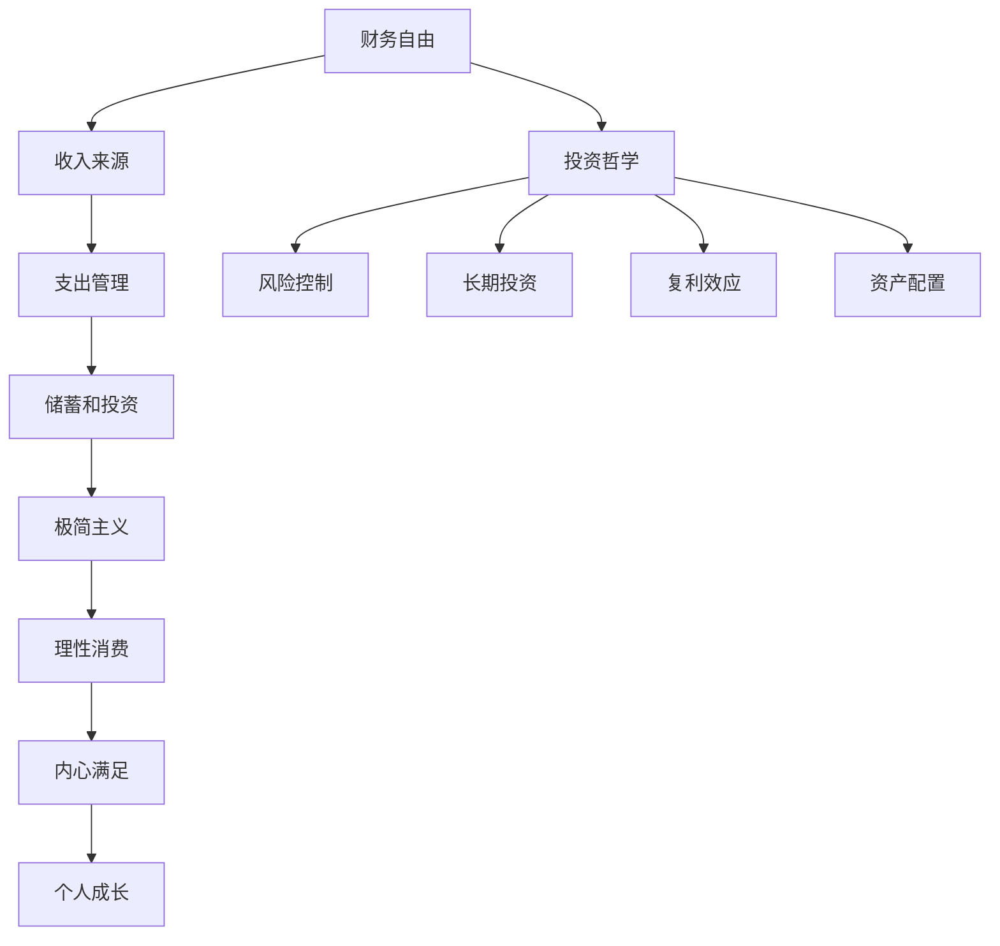

                 

# 程序员的财务自由：极简主义与投资哲学

## >关键词：财务自由，极简主义，投资哲学，程序员，理财规划，风险控制，资产配置，长期投资，复利效应

>摘要：本文将探讨程序员如何通过极简主义和投资哲学实现财务自由。我们将分析财务自由的定义、实现路径、极简主义的生活哲学，以及投资哲学的核心原则。文章将提供具体的理财规划和资产配置策略，旨在帮助程序员实现长期财务目标，并在面对市场波动时保持理性。

## 1. 背景介绍

程序员作为现代社会中不可或缺的职业，他们凭借技术专长在职场中取得了成功。然而，随着生活成本的上升和消费欲望的增加，许多程序员发现自己难以摆脱财务困境。因此，如何实现财务自由成为许多程序员迫切关注的问题。

财务自由是指个人拥有足够的财富，能够在不依赖工作收入的情况下满足生活需求。实现财务自由不仅意味着积累财富，还需要对财富进行合理的规划和投资。

极简主义是一种生活哲学，主张减少物质和情感负担，专注于个人成长和内心满足。投资哲学则是关于如何将财富转化为更高效、更安全的资产的方法论。

本文将结合极简主义和投资哲学，为程序员提供实现财务自由的路径。我们将探讨如何通过理性消费、财务规划和投资，使程序员的生活更加轻松、自由。

## 2. 核心概念与联系

### 2.1 财务自由

财务自由是一个多维度的概念，包括以下几个方面：

- **定义**：个人拥有的财富足以支付日常开支，实现无负债的生活。
- **要素**：收入来源、支出管理、储蓄和投资。
- **衡量标准**：通常以储蓄率（储蓄收入比）和生活成本为主要衡量指标。

### 2.2 极简主义

- **定义**：极简主义是一种生活哲学，强调简化生活，减少不必要的物质和情感负担。
- **原则**：减少消费、追求内心满足、注重个人成长。
- **实现**：通过精简物品、合理安排时间和精简社交圈来实现。

### 2.3 投资哲学

- **定义**：投资哲学是关于如何通过投资实现财富增值的一系列原则和策略。
- **原则**：风险控制、长期投资、复利效应、资产配置。
- **策略**：股票投资、债券投资、房地产投资、指数基金等。

### 2.4 Mermaid 流程图



## 3. 核心算法原理 & 具体操作步骤

### 3.1 财务自由算法原理

财务自由的核心算法是基于以下原理：

- **储蓄率**：通过提高储蓄率，增加财富积累速度。
- **投资回报**：通过合理的投资策略，实现财富增值。
- **成本控制**：通过精简消费，降低生活成本。

### 3.2 具体操作步骤

1. **确定财务目标**：根据个人情况设定短期和长期财务目标。
2. **评估当前状况**：计算当前收入、支出和储蓄率。
3. **提高储蓄率**：通过减少非必要支出和增加收入来源，提高储蓄率。
4. **投资规划**：根据风险承受能力和投资目标，选择合适的投资策略。
5. **定期复盘**：每月或每季度评估财务状况，调整投资策略。

## 4. 数学模型和公式 & 详细讲解 & 举例说明

### 4.1 储蓄率计算公式

$$
储蓄率 = \frac{储蓄额}{月收入}
$$

### 4.2 投资回报计算公式

$$
投资回报 = 初始投资额 \times (1 + 投资回报率)^{投资年限}
$$

### 4.3 举例说明

**例1：储蓄率提高**

- 初始收入：月收入10000元
- 初始支出：月支出7000元
- 储蓄率：7%

**提升方案**：减少非必要支出，如每月减少500元，增加储蓄率至10%。

**结果**：每年额外储蓄6000元，五年后总储蓄额增加30000元。

**例2：投资回报**

- 初始投资额：10000元
- 投资回报率：8%
- 投资年限：10年

$$
投资回报 = 10000 \times (1 + 0.08)^{10} = 21538.42元
$$

**结果**：十年后投资回报为21538.42元，实现超过100%的投资增值。

## 5. 项目实战：代码实际案例和详细解释说明

### 5.1 开发环境搭建

为了实现财务自由算法，我们需要搭建一个简单的开发环境。这里我们使用Python作为编程语言。

1. 安装Python：访问 [Python官网](https://www.python.org/) 下载并安装Python。
2. 安装必备库：打开终端，执行以下命令安装必备库。

```bash
pip install numpy matplotlib pandas
```

### 5.2 源代码详细实现和代码解读

#### 5.2.1 代码实现

```python
import numpy as np
import matplotlib.pyplot as plt

# 定义财务自由算法参数
monthly_income = 10000
monthly_expense = 7000
savings_rate = 0.07
investment_return = 0.08
investment_years = 10

# 计算储蓄率和投资回报
savings_amount = monthly_income * savings_rate
investment_return_amount = savings_amount * (1 + investment_return)**investment_years

# 绘制储蓄和投资回报曲线
plt.plot(np.arange(1, investment_years + 1), savings_amount * np.arange(1, investment_years + 1), label='Savings')
plt.plot(np.arange(1, investment_years + 1), investment_return_amount, label='Investment Return')
plt.xlabel('Years')
plt.ylabel('Amount (in RMB)')
plt.title('Savings and Investment Return over Time')
plt.legend()
plt.show()
```

#### 5.2.2 代码解读

1. 导入必需的Python库。
2. 定义财务自由算法的参数，如月收入、月支出、储蓄率和投资回报率。
3. 计算每月储蓄额和投资回报额。
4. 使用matplotlib绘制储蓄和投资回报曲线，展示财务自由实现的过程。

### 5.3 代码解读与分析

通过这个简单的Python程序，我们可以直观地看到财务自由算法的实现过程。以下是代码的关键部分解读：

- **参数定义**：定义了月收入、月支出、储蓄率和投资回报率，这些参数决定了财务自由的实现速度和效果。
- **计算储蓄额**：使用`monthly_income`和`savings_rate`计算每月储蓄额。
- **计算投资回报额**：使用`investment_return_amount`计算投资回报额，体现了投资在财务自由实现中的重要性。
- **绘图**：使用`matplotlib`绘制储蓄和投资回报曲线，使得财务自由实现的动态过程可视化。

通过这个例子，我们可以清楚地看到财务自由算法的实现步骤和效果。在实际应用中，可以根据个人情况进行调整，以实现更高效的财务自由。

## 6. 实际应用场景

### 6.1 程序员个人理财

许多程序员面临财务自由挑战，尤其是在年轻时。通过合理规划收入和支出，以及有效投资，程序员可以实现财务自由。以下是一些实际应用场景：

- **节约开支**：通过减少不必要的消费，如购物、旅游等，提高储蓄率。
- **增加收入**：通过兼职、编程培训、自由职业等方式增加收入来源。
- **投资规划**：根据风险承受能力，选择股票、债券、房地产等投资工具。

### 6.2 企业财务规划

企业可以通过以下方式实现财务自由：

- **成本控制**：通过优化供应链、提高生产效率等手段降低成本。
- **利润分配**：合理分配利润，确保企业有足够的储蓄和投资资金。
- **多元化投资**：将部分利润投资于不同行业和资产，降低风险。

### 6.3 社会层面

实现财务自由对整个社会具有重要意义：

- **提高生活质量**：个人和家庭能够享受更高质量的生活。
- **促进消费**：财务自由者更倾向于消费，促进经济发展。
- **社会稳定**：减少贫困和社会问题，提高社会稳定性。

## 7. 工具和资源推荐

### 7.1 学习资源推荐

- **书籍**：
  - 《财务自由之路》
  - 《极简主义：简化你的生活，专注你的幸福》
  - 《投资最重要的事》

- **论文**：查阅相关领域的学术论文，了解最新的研究进展。

- **博客**：关注知名的财经博客和理财专家的博客，获取实用的理财建议。

- **网站**：访问理财网站和在线课程，学习理财知识和技能。

### 7.2 开发工具框架推荐

- **编程语言**：Python、Java、C++等。
- **财务软件**：使用Excel、QuickBooks等财务软件进行财务管理和规划。
- **投资平台**：使用股票交易平台、基金交易平台等在线投资工具。

### 7.3 相关论文著作推荐

- **论文**：
  - 《投资者行为与市场波动的关系研究》
  - 《基于大数据的金融风险评估》

- **著作**：
  - 《金融心理学》
  - 《金融工程的数学原理与应用》

## 8. 总结：未来发展趋势与挑战

### 8.1 发展趋势

- **金融科技**：随着金融科技的快速发展，程序员可以通过学习人工智能、区块链等新技术，实现更高的财务自由。
- **在线投资**：在线投资平台的普及，使得程序员可以更便捷地进行投资。
- **理财观念普及**：越来越多的人意识到理财的重要性，这将推动财务自由的普及。

### 8.2 挑战

- **市场竞争**：随着越来越多的人追求财务自由，市场竞争将更加激烈。
- **技术风险**：金融科技的发展也带来了新的风险，如网络安全风险、市场风险等。
- **政策变化**：政策的变化可能会影响投资环境，程序员需要密切关注政策动态。

## 9. 附录：常见问题与解答

### 9.1 问题1：财务自由是否适用于所有人？

财务自由并不是所有人都适用的，但通过合理规划，很多人可以实现财务自由。不同的人有不同的生活目标和风险承受能力，因此在制定财务规划时需要根据个人情况调整。

### 9.2 问题2：投资一定有风险吗？

是的，投资总是伴随着一定的风险。了解自己的风险承受能力，选择合适的投资工具和策略，是降低投资风险的关键。

### 9.3 问题3：如何保持财务规划的持续性？

定期评估和调整财务规划，确保它与个人目标和市场环境相匹配。保持学习和关注财经动态，以适应不断变化的市场环境。

## 10. 扩展阅读 & 参考资料

- **扩展阅读**：
  - 《极简主义：如何通过减少物质和情感负担，过上更幸福的生活》
  - 《投资学：理解市场的本质，实现财富增值》

- **参考资料**：
  - 《财务自由之路》
  - 《极简主义：简化你的生活，专注你的幸福》
  - 《投资最重要的事》

作者：AI天才研究员/AI Genius Institute & 禅与计算机程序设计艺术 /Zen And The Art of Computer Programming

