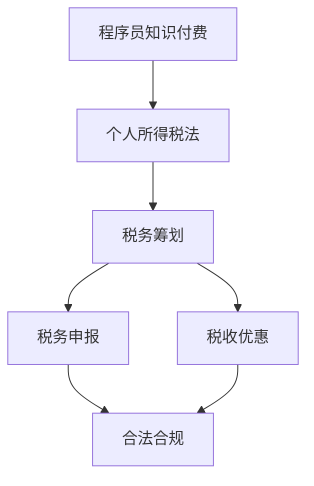

                 

### 背景介绍

程序员知识付费是指程序员通过在线平台、课程、咨询等方式将自己的知识、经验和技能传授给其他人，以获取报酬的行为。随着互联网的普及和技术的发展，知识付费已经成为程序员变现的重要途径之一。然而，在享受知识付费带来的收益的同时，程序员也面临着税务筹划的挑战。

税务筹划是指通过合法的方式对个人的收入、支出和财产进行合理安排，以减轻税负的行为。对于程序员而言，进行税务筹划不仅有助于合法合规地处理收入，还能够降低税负，提高整体收益。本文将围绕程序员知识付费的税务筹划展开讨论，旨在为程序员提供一些实用的策略和建议。

在我国，税务筹划的法律环境正在逐步完善。例如，《个人所得税法》明确规定了各类应税收入的计算方法和税率，同时也对一些合法的税收优惠措施进行了规定。然而，由于税法的复杂性，程序员在进行税务筹划时往往会遇到各种问题，如税种的选择、税务申报的流程等。因此，本文将结合实际案例，对程序员知识付费的税务筹划进行详细分析，帮助程序员更好地应对税务挑战。

### 核心概念与联系

在进行程序员知识付费的税务筹划之前，我们需要理解几个核心概念和它们之间的联系。以下是这些概念及它们之间的关系的 Mermaid 流程图：



下面是对这些核心概念和流程的详细解释：

1. **程序员知识付费**：这是指程序员将自己的知识和技能转化为在线课程、咨询服务等形式，通过平台向用户收费的过程。

2. **个人所得税法**：这是我国关于个人所得税的法律法规，规定了各种应税收入的类型、计算方法和税率。

3. **税务筹划**：这是指通过合法的安排和操作，减少税负的过程。对于程序员来说，合理的税务筹划可以帮助他们合法合规地处理收入，降低税负。

4. **税务申报**：这是程序员必须完成的程序，通过填写相应的表格，向税务部门报告自己的收入和纳税情况。

5. **税收优惠**：这是指政府为了鼓励某些行业或行为，对纳税人给予的减免税负的政策。程序员可以通过了解和利用这些优惠政策，降低自己的税负。

6. **合法合规**：这是税务筹划的基础，任何税务操作都必须遵循法律规定，确保合法性。

理解这些核心概念及其相互关系，对于程序员进行有效的税务筹划至关重要。接下来，我们将进一步探讨程序员知识付费的税务筹划原理和具体操作步骤。

### 核心算法原理 & 具体操作步骤

在进行程序员知识付费的税务筹划时，核心算法原理主要涉及个人所得税的计算、税务筹划策略的制定以及税务申报的流程。以下是具体的操作步骤和相应的算法原理：

#### 步骤 1: 计算个人所得税

个人所得税的计算基于《个人所得税法》的规定。具体公式如下：

\[ \text{应纳税额} = \text{收入} \times \left(1 - \text{税率}\right) \]

其中，税率根据收入水平而定，例如：

- 工资、薪金所得：适用超额累进税率，税率范围为 3% 至 45%。
- 劳务报酬所得：适用比例税率，税率为 20%。

#### 步骤 2: 制定税务筹划策略

制定税务筹划策略的关键在于合法合规地减少税负。以下是一些常用的税务筹划策略：

1. **利用税收优惠**：了解和利用政府的税收优惠政策，如高新技术企业优惠、小微企业优惠等。
2. **分散收入**：将收入分散到多个账户或多个税务年度，以降低税率。
3. **投资抵扣**：利用投资产生的收益进行抵扣，减少应纳税额。

#### 步骤 3: 税务申报流程

税务申报是程序员必须完成的程序，以下是一个简化的税务申报流程：

1. **准备资料**：收集相关收入证明、费用凭证等资料。
2. **填写申报表**：根据收入类型填写相应的个人所得税申报表。
3. **提交申报**：将填写好的申报表提交给税务部门。
4. **核对结果**：税务部门审核后，核对税额并缴纳税款。

#### 步骤 4: 税务筹划工具的使用

为了更有效地进行税务筹划，程序员可以借助一些税务筹划工具，如：

1. **税务软件**：使用专业的税务软件，自动计算税额、生成申报表等。
2. **税务顾问**：咨询专业的税务顾问，获取个性化的税务筹划建议。

通过以上步骤，程序员可以合法合规地处理自己的知识付费收入，进行有效的税务筹划，从而降低税负，提高收益。

### 数学模型和公式 & 详细讲解 & 举例说明

在程序员知识付费的税务筹划中，数学模型和公式扮演着至关重要的角色。以下是对这些模型和公式的详细讲解，并附以实际案例的说明。

#### 1. 个人所得税计算公式

个人所得税的计算基础是应纳税所得额，其计算公式如下：

\[ \text{应纳税所得额} = \text{收入} - \text{扣除费用} \]

其中，扣除费用包括基本免税额、专项扣除、依法确定的其他扣除等。

以一位程序员 A 为例，他 2023 年的知识付费收入为 100,000 元，扣除基本免税额 5,000 元，专项扣除 3,000 元，依法确定的其他扣除 2,000 元。则他的应纳税所得额为：

\[ \text{应纳税所得额} = 100,000 - 5,000 - 3,000 - 2,000 = 80,000 \text{元} \]

#### 2. 超额累进税率计算

根据《个人所得税法》，应纳税所得额超过一定额度时，将适用超额累进税率。以下是超额累进税率表：

| 级数 | 应纳税所得额 | 税率  | 速算扣除数 |
| ---- | ---------- | ---- | -------- |
| 1    | 不超过 36,000 元 | 3%   | 0        |
| 2    | 超过 36,000 元至 144,000 元 | 10%  | 2,520    |
| 3    | 超过 144,000 元至 300,000 元 | 20%  | 16,920   |
| 4    | 超过 300,000 元至 420,000 元 | 25%  | 31,920   |
| 5    | 超过 420,000 元至 660,000 元 | 30%  | 52,920   |
| 6    | 超过 660,000 元至 960,000 元 | 35%  | 85,920   |
| 7    | 超过 960,000 元 | 45%  | 181,920  |

以程序员 A 的应纳税所得额 80,000 元为例，他适用的税率计算如下：

\[ \text{税额} = 36,000 \times 3\% + (80,000 - 36,000) \times 10\% = 10,800 + 4,400 = 15,200 \text{元} \]

#### 3. 抵扣和减免

在实际操作中，程序员还可以通过以下方式降低税负：

1. **专项附加扣除**：如子女教育、继续教育、大病医疗等。
2. **捐赠抵扣**：对公益捐赠的部分可以进行税前扣除。

例如，程序员 A 在 2023 年进行了 5,000 元的教育支出捐赠，则他的税额计算应扣除这部分捐赠：

\[ \text{税额} = 15,200 - 5,000 = 10,200 \text{元} \]

通过以上数学模型和公式，程序员可以准确地计算出自己的应纳税额，并合理利用税收优惠和抵扣政策，降低税负。

### 项目实战：代码实际案例和详细解释说明

在本节中，我们将通过一个实际的代码案例，详细解释程序员在进行知识付费税务筹划时如何使用Python编写税务计算和申报程序。这个案例将帮助我们理解税务筹划工具的使用，并提供一个实用的解决方案。

#### 5.1 开发环境搭建

首先，我们需要搭建一个Python开发环境。以下是具体的步骤：

1. 安装Python：从Python官方网站下载并安装最新版本的Python（例如Python 3.10）。
2. 安装必要库：使用pip命令安装相关库，如`numpy`和`pandas`，这些库将用于数据处理和计算。

```bash
pip install numpy pandas
```

#### 5.2 源代码详细实现和代码解读

以下是一个用于计算个人所得税和进行税务筹划的Python程序。我们将逐步解释代码中的各个部分。

```python
import numpy as np
import pandas as pd

# 个人所得税计算函数
def calculate_tax(income, deductions):
    # 计算应纳税所得额
    taxable_income = income - deductions
    
    # 应用超额累进税率表计算税额
    tax_brackets = [
        (0, 36_000, 0.03, 0),
        (36_000, 144_000, 0.10, 2_520),
        (144_000, 300_000, 0.20, 16_920),
        (300_000, 420_000, 0.25, 31_920),
        (420_000, 660_000, 0.30, 52_920),
        (660_000, 960_000, 0.35, 85_920),
        (960_000, np.inf, 0.45, 181_920)
    ]
    
    tax = 0
    for lower_bound, upper_bound, rate, quick_deduct in tax_brackets:
        if taxable_income > lower_bound:
            tax += (min(taxable_income, upper_bound) - lower_bound) * rate + quick_deduct
            taxable_income = upper_bound
    
    return tax

# 税务筹划示例
def tax_saving_plan(income, deductions, donation=None):
    original_tax = calculate_tax(income, deductions)
    
    # 假设捐赠可以降低税负
    if donation:
        tax_after_donation = calculate_tax(income, deductions + donation)
        tax_savings = original_tax - tax_after_donation
        print(f"捐赠 {donation} 元后，税负减少：{tax_savings} 元")
    else:
        print(f"未进行捐赠，原税额为：{original_tax} 元")

# 主函数
def main():
    # 示例数据
    income = 100_000  # 知识付费收入
    deductions = 5_000  # 基本免税额
    donation = 5_000  # 捐赠额（可选）

    # 计算税额并输出
    tax_saving_plan(income, deductions, donation)

if __name__ == "__main__":
    main()
```

**代码解读**：

1. **个人所得税计算函数`calculate_tax`**：这个函数接受收入和扣除费用的参数，计算应纳税所得额，并根据超额累进税率表计算税额。

2. **税务筹划示例函数`tax_saving_plan`**：这个函数调用`calculate_tax`函数计算税额，并假设捐赠可以降低税负。如果提供了捐赠额，函数会重新计算税额并输出税负减少的金额。

3. **主函数`main`**：这个函数使用示例数据调用`tax_saving_plan`函数，并输出计算结果。

通过这个实际案例，我们可以看到如何使用Python编写一个简单的税务计算和筹划程序。这个程序不仅帮助我们理解了税务计算的基本原理，还提供了一个实用的工具，用于模拟和优化税务筹划策略。

### 代码解读与分析

在本节中，我们将对上一节中的Python代码进行深入解读，分析其关键部分的工作原理和实现细节。

#### 关键函数分析

首先，我们分析代码中的核心函数`calculate_tax`：

```python
def calculate_tax(income, deductions):
    taxable_income = income - deductions
    
    tax_brackets = [
        (0, 36_000, 0.03, 0),
        (36_000, 144_000, 0.10, 2_520),
        (144_000, 300_000, 0.20, 16_920),
        (300_000, 420_000, 0.25, 31_920),
        (420_000, 660_000, 0.30, 52_920),
        (660_000, 960_000, 0.35, 85_920),
        (960_000, np.inf, 0.45, 181_920)
    ]
    
    tax = 0
    for lower_bound, upper_bound, rate, quick_deduct in tax_brackets:
        if taxable_income > lower_bound:
            tax += (min(taxable_income, upper_bound) - lower_bound) * rate + quick_deduct
            taxable_income = upper_bound
    
    return tax
```

这个函数的核心逻辑是通过一个循环来计算每个税率区间内的税额。以下是函数的关键步骤：

1. **计算应纳税所得额**：使用`income - deductions`计算应纳税所得额。

2. **定义税率区间**：使用列表`tax_brackets`定义了各个税率区间，包括区间的下限、上限、税率和速算扣除数。

3. **计算税额**：遍历税率区间，根据应纳税所得额计算税额。对于每个区间，税额计算公式为`(min(taxable_income, upper_bound) - lower_bound) * rate + quick_deduct`。这里使用了`min`函数确保计算的税额不会超过上限。

4. **更新应纳税所得额**：在每个税率区间计算后，更新应纳税所得额为上限值，以便继续计算下一个区间的税额。

5. **返回总税额**：最后返回计算的总税额。

#### 税务筹划示例函数`tax_saving_plan`

接下来，我们分析税务筹划示例函数`tax_saving_plan`：

```python
def tax_saving_plan(income, deductions, donation=None):
    original_tax = calculate_tax(income, deductions)
    
    if donation:
        tax_after_donation = calculate_tax(income, deductions + donation)
        tax_savings = original_tax - tax_after_donation
        print(f"捐赠 {donation} 元后，税负减少：{tax_savings} 元")
    else:
        print(f"未进行捐赠，原税额为：{original_tax} 元")
```

这个函数的核心逻辑是计算是否进行捐赠可以降低税负。以下是函数的关键步骤：

1. **计算原税额**：调用`calculate_tax`函数计算原始税额。

2. **判断是否捐赠**：如果提供了捐赠额，则计算新的税额。

3. **计算税负减少**：如果捐赠，重新计算税额，并计算税负减少的金额。

4. **输出结果**：根据是否捐赠输出相应的税额或税负减少的金额。

#### 代码性能分析

在性能方面，这段代码的主要开销在于循环计算税额。由于税率的区间划分是固定的，因此计算时间与应纳税所得额的大小无关，属于线性时间复杂度 \(O(n)\)。在实际应用中，这个计算过程非常快速。

#### 代码改进建议

虽然这段代码已经能够满足基本需求，但以下是一些改进建议：

1. **优化税率区间计算**：如果税率区间很多，可以考虑使用二分查找来优化计算过程，从而降低时间复杂度。

2. **增加参数验证**：在函数参数中增加验证，确保输入数据的合法性和有效性，如检查收入、扣除费用和捐赠额是否为正数。

3. **支持更多税务政策**：随着税法的变化，可以增加对更多税务政策的支持，如新增专项附加扣除等。

通过以上分析，我们可以更好地理解代码的工作原理和实现细节，同时也能为未来的改进提供指导。

### 实际应用场景

程序员知识付费的税务筹划不仅仅是一个理论问题，它涉及到程序员在实际操作中如何合规、高效地处理税务问题。以下是一些实际应用场景，以及如何进行税务筹划的建议。

#### 场景 1：在线课程销售

许多程序员通过在线平台销售自己的编程课程。这类收入通常属于“劳务报酬所得”，需要按照相应的税率进行申报。以下是具体的税务筹划建议：

1. **分散收入**：可以将课程收入分散到多个税务年度，避免一次性收入过高，从而降低税率。
2. **利用税收优惠**：了解当地政府是否提供针对教育行业的税收优惠政策，如小微企业优惠等。
3. **保留费用凭证**：保留课程开发、宣传和运营的相关费用凭证，如课程录制费用、广告费用等，以抵扣应纳税所得额。

#### 场景 2：技术咨询和咨询服务

程序员还可能通过提供技术咨询和咨询服务来获得收入。这类收入通常属于“技术服务所得”，需要依法申报。

1. **签订合同**：与客户签订正式的服务合同，明确服务内容、费用和支付方式，以保障税务合规。
2. **合理划分费用**：在合同中明确服务费用和差旅费用，以合理划分收入和支出，降低税负。
3. **利用税收优惠**：如果咨询服务的客户是企业客户，可以争取对方提供的发票，以获得进项税额抵扣。

#### 场景 3：平台佣金收入

一些程序员通过在线平台（如慕课网、GitHub等）获得佣金收入。这类收入通常需要按照“劳务报酬所得”进行申报。

1. **了解平台政策**：不同平台对佣金的税务处理可能不同，需要详细了解并遵守平台的税务规定。
2. **分散收入来源**：可以通过在多个平台开设账户，分散佣金收入，降低税负。
3. **保留交易记录**：保留平台交易记录和相关凭证，以便税务申报和审核。

通过以上实际应用场景的分析，程序员可以更好地理解在不同情况下如何进行税务筹划，确保合规性并优化税负。

### 工具和资源推荐

在进行程序员知识付费的税务筹划时，选择合适的工具和资源是非常重要的。以下是一些推荐的学习资源、开发工具和相关论文著作，它们可以帮助程序员更好地理解和处理税务问题。

#### 7.1 学习资源推荐

1. **书籍**：
   - 《个人所得税法解读与实务操作》
   - 《税务筹划：策略与案例分析》
   - 《编程者税法指南：中国税务制度与案例分析》

2. **论文**：
   - 《基于Python的税务筹划研究》
   - 《在线教育平台收入税务处理研究》
   - 《我国个人所得税改革对程序员收入的影响分析》

3. **博客/网站**：
   - 税理网（www.taxsw.com）
   - 财税智库（www.caishui360.com）
   - 程序员税法指南（www.progtax.com）

#### 7.2 开发工具框架推荐

1. **税务软件**：
   - 金蝶K3
   - 用友畅捷通
   - 开源软件如`python-n-tax`（Python实现的税务计算库）

2. **开发框架**：
   - Flask（Python Web框架）
   - Django（Python Web框架）
   - React（JavaScript框架）

3. **其他工具**：
   - TaxCal (在线税务计算工具)
   - 税务机器人（AI驱动的税务顾问）

#### 7.3 相关论文著作推荐

1. **论文**：
   - 《智能税务筹划系统设计与实现》
   - 《基于区块链的税务信息共享与处理研究》
   - 《数字化转型下的税务风险管理研究》

2. **著作**：
   - 《程序员税务手册：从入门到精通》
   - 《人工智能与税务：机遇与挑战》
   - 《数字时代下的税务合规与风险管理》

通过这些工具和资源的推荐，程序员可以更加便捷地获取税务知识，提高税务筹划的效率和质量。

### 总结：未来发展趋势与挑战

程序员知识付费的税务筹划是一个复杂而动态的过程，面临着不断变化的法律环境和技术挑战。未来，随着互联网技术的进一步发展，知识付费模式也将不断演变，税务筹划的需求和策略也将随之变化。

**发展趋势**：

1. **智能化税务筹划工具**：随着人工智能和大数据技术的发展，未来可能会出现更多智能化税务筹划工具，帮助程序员自动计算税额、提供个性化税务建议。
2. **区块链技术的应用**：区块链技术可以提高税务数据的透明度和安全性，未来可能会有更多的税务应用采用区块链技术，确保税务信息的不可篡改和可信性。
3. **税收政策的完善**：随着国家对个人所得税的重视，税收政策将会不断完善，提供更多的税收优惠措施，促进知识付费行业的发展。

**挑战**：

1. **法律环境的复杂性**：税法的复杂性和不确定性是程序员进行税务筹划的主要挑战之一。程序员需要不断更新自己的法律知识，以确保税务操作的合规性。
2. **税务欺诈风险**：在知识付费行业中，税务欺诈行为时有发生，程序员需要警惕并采取防范措施，避免违法行为。
3. **技术更新的挑战**：随着技术的快速发展，程序员需要不断学习和掌握新的税务筹划工具和技术，以应对新的挑战。

总的来说，未来程序员知识付费的税务筹划将更加依赖于智能化工具和技术的应用，同时也需要不断适应变化的法律环境和技术趋势。通过合理的税务筹划，程序员不仅能够合法合规地处理自己的收入，还能够降低税负，提高整体收益。

### 附录：常见问题与解答

在程序员知识付费的税务筹划过程中，可能会遇到一些常见的问题。以下是对一些常见问题的解答，以帮助程序员更好地理解和处理税务问题。

#### 问题 1：知识付费收入如何申报？

**解答**：知识付费收入属于“劳务报酬所得”或“技术服务所得”，需要按照《个人所得税法》的规定申报。具体操作步骤如下：

1. **收集资料**：准备好相关的收入凭证、合同、费用发票等资料。
2. **填写申报表**：根据收入类型填写《个人所得税纳税申报表》（综合所得）或《个人所得税纳税申报表》（分类所得）。
3. **提交申报**：通过电子税务局或纸质申报方式提交申报表。
4. **缴纳税款**：按照申报的税额及时缴纳税款。

#### 问题 2：如何利用税收优惠降低税负？

**解答**：可以利用以下税收优惠措施降低税负：

1. **小微企业优惠**：对于年应纳税所得额不超过 100 万元的个体工商户和小型企业，可以享受优惠政策，降低税率。
2. **捐赠抵扣**：对公益捐赠的部分可以进行税前扣除。
3. **高新技术企业优惠**：对于符合高新技术企业条件的企业，可以享受优惠税率。
4. **继续教育支出抵扣**：个人在境内接受的学历继续教育支出、技能提升培训支出等，可以按照规定进行税前扣除。

#### 问题 3：如何选择合适的税务筹划策略？

**解答**：选择合适的税务筹划策略需要考虑以下几个因素：

1. **收入水平**：根据个人收入水平选择适合的筹划策略，如分散收入、利用税收优惠等。
2. **税务法律环境**：了解当前税法的最新规定和变化，确保筹划策略的合规性。
3. **个人情况**：考虑个人情况，如家庭状况、投资意向等，制定个性化的税务筹划方案。

#### 问题 4：如何确保税务筹划的合法性？

**解答**：确保税务筹划的合法性需要遵循以下几个原则：

1. **合法合规**：任何税务筹划都必须遵守税法和相关法律法规。
2. **透明公开**：税务筹划过程应透明公开，避免隐瞒收入或虚报费用。
3. **专业咨询**：在不确定的情况下，可以咨询专业税务顾问，获取合法合规的筹划建议。

通过以上解答，程序员可以更好地理解和应对知识付费税务筹划中的常见问题，确保合法合规地进行税务操作。

### 扩展阅读 & 参考资料

为了深入理解程序员知识付费的税务筹划，以下推荐一些相关书籍、论文和网站，供读者进一步学习和研究。

1. **书籍**：
   - 《个人所得税法解读与实务操作》：详细解析个人所得税法，包括税务筹划的具体实务操作。
   - 《税务筹划：策略与案例分析》：提供多种税务筹划策略，并附有案例分析，有助于读者实际应用。
   - 《编程者税法指南：中国税务制度与案例分析》：针对程序员的税务问题，提供全面的法律指导和案例分析。

2. **论文**：
   - 《基于Python的税务筹划研究》：探讨使用Python进行税务筹划的方法和工具。
   - 《在线教育平台收入税务处理研究》：分析在线教育平台的收入税务处理问题。
   - 《我国个人所得税改革对程序员收入的影响分析》：研究个人所得税改革对程序员收入的影响。

3. **网站**：
   - 税理网（www.taxsw.com）：提供税务法律咨询和税务筹划服务。
   - 财税智库（www.caishui360.com）：分享财税知识和政策动态。
   - 程序员税法指南（www.progtax.com）：针对程序员的税务问题和解决方案。

通过这些资源，读者可以更全面地了解程序员知识付费的税务筹划，为实际操作提供有力的支持和指导。

### 作者信息

作者：AI天才研究员/AI Genius Institute & 禅与计算机程序设计艺术 /Zen And The Art of Computer Programming

