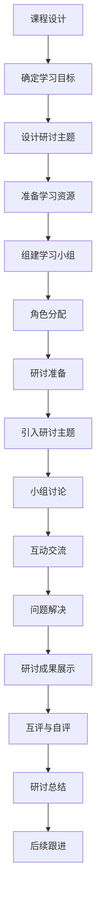

                 

### 背景介绍

#### 知识付费的发展历程

知识付费，顾名思义，是指用户为了获取专业知识和技能而付费的一种服务模式。这一概念起源于互联网时代，随着信息技术的迅猛发展和网络平台的普及，人们获取知识的方式发生了根本性的变革。早期的知识付费主要依赖于线下培训、讲座和研讨会，但随着在线教育平台的兴起，知识付费逐渐向线上迁移。

知识付费的发展大致可以分为三个阶段：

1. **萌芽阶段**：以博客、微博等社交平台为主，个体专家通过撰写文章、分享经验来吸引粉丝，逐步形成知识付费的雏形。

2. **发展阶段**：以在线教育平台为代表，如 Coursera、Udemy 等，这些平台提供了丰富的在线课程，用户可以根据自己的需求和兴趣选择课程进行付费学习。

3. **成熟阶段**：知识付费逐渐多元化，不仅包括在线课程，还涵盖了电子书、音频课程、一对一咨询等多种形式。同时，一些专业领域内的知识付费平台如LinkedIn Learning、Pluralsight 等也崭露头角。

#### 程序员知识付费的兴起

在程序员群体中，知识付费的现象尤为显著。首先，编程技术更新迅速，程序员需要不断学习新的编程语言、框架和技术来保持竞争力。其次，很多程序员希望通过付费课程或咨询来提升自己的技能，以便在职场中获得更好的发展机会。此外，随着远程工作的普及，程序员可以通过在线课程和研讨会来提高自己的工作效率和解决问题的能力。

程序员知识付费的兴起，不仅改变了程序员的学习方式，也推动了在线教育平台的发展。例如，GitHub Learning Lab 提供了免费和付费的编程课程，帮助程序员提升技能。Pluralsight 和 LinkedIn Learning 等平台则提供了大量的专业课程，涵盖从基础知识到高级技能的各个方面。

总之，知识付费已成为程序员学习和提升技能的重要途径，同时也为在线教育平台带来了巨大的市场空间。在接下来的部分，我们将深入探讨如何打造研讨式学习模式，以更好地满足程序员的个性化学习需求。在接下来的探讨中，我们将逐步分析研讨式学习模式的核心概念、实施步骤以及其优势与挑战。首先，让我们来明确研讨式学习模式的基本定义和特点。

## 2.1. 研讨式学习模式：概念与特点

研讨式学习模式，也称为研讨班模式或研讨会模式，是一种以讨论和交流为核心的学习方式。它强调学习者在学习过程中的主动性和参与性，通过小组讨论、案例分析和问题解决等方式，促进知识的深度理解和应用。

### 概念

研讨式学习模式可以理解为一种基于互动和协作的学习环境。在这种环境中，学习者不仅需要掌握知识和技能，还需要能够有效地表达自己的想法、倾听他人的观点，并在此基础上进行批判性思维和综合分析。具体来说，研讨式学习模式具有以下几个核心特点：

1. **互动性**：学习者之间、学习者和教师之间通过频繁的互动和交流，分享知识、经验和观点。
2. **协作性**：学习者以小组形式参与学习活动，通过团队合作，共同解决问题和完成任务。
3. **探究性**：学习过程强调对问题的深入探究和解决，鼓励学习者提出问题、假设和解决方案。
4. **批判性思维**：学习者通过批判性思维，对所学知识进行评估和反思，以促进知识的内化和应用。

### 特点

研讨式学习模式与传统的课堂教学模式相比，具有显著的不同。以下是研讨式学习模式的主要特点：

1. **以学生为中心**：研讨式学习模式强调学生的主动参与和自主学习，教师的作用更多地是引导和协调。
2. **多样化的学习资源**：除了传统的教材和课堂讲授，研讨式学习模式还包括案例分析、小组讨论、实地考察等多种学习资源。
3. **实时反馈与评估**：在研讨过程中，教师和学习者能够及时获得反馈，有助于及时调整学习策略。
4. **综合能力培养**：通过小组合作和问题解决，学习者能够培养沟通能力、团队合作能力和解决问题的能力。

总的来说，研讨式学习模式不仅有助于提高学习效果，还能够激发学习者的兴趣和动力，促进知识的深度理解和应用。在接下来的部分，我们将进一步探讨如何具体实施研讨式学习模式，并分析其在程序员知识付费中的应用和优势。在具体实施研讨式学习模式的过程中，需要明确各个环节的具体步骤和注意事项。

### 2.2. 实施研讨式学习模式：步骤与策略

研讨式学习模式的有效实施，需要一系列明确的步骤和策略。以下是一般实施研讨式学习模式的步骤与策略：

#### 1. 课程设计与规划

首先，教师需要根据课程目标和学习内容，设计研讨课程。这包括确定研讨主题、选择合适的学习资源、制定研讨计划等。在设计过程中，要充分考虑学生的兴趣和需求，确保研讨内容具有实际应用价值。

- **确定研讨主题**：围绕课程的核心知识和技能，选择具有挑战性和实践性的主题。
- **选择学习资源**：包括教材、案例、视频、文献等，确保资源的多样性和实用性。
- **制定研讨计划**：明确研讨的时间、地点、参与人数、研讨内容等。

#### 2. 组建学习小组

在研讨开始前，需要将学生分组，并确保每组的人数和组成合理。学习小组的组建可以采用随机分配、自选或混合方式，以促进多样化的交流和合作。

- **随机分配**：确保每个学生都有机会与不同背景的同学合作。
- **自选**：让学生自主选择小组，但需在教师指导下确保小组的多样性和平衡性。
- **混合方式**：结合随机分配和自选，既能满足学生的个性化需求，又能确保小组的多样性。

#### 3. 研讨过程组织

研讨过程中，教师需要扮演引导者和协调者的角色，确保研讨活动的顺利进行。以下是一些关键步骤和注意事项：

- **引入研讨主题**：教师可以通过简要介绍主题、展示案例或提出问题等方式，激发学生的兴趣和思考。
- **分配任务**：明确每个小组的研讨任务和目标，确保每个学生都有具体的责任和角色。
- **小组讨论**：鼓励小组成员积极参与讨论，表达观点，倾听他人的意见，共同解决问题。
- **实时反馈**：教师需要随时关注研讨进程，提供必要的指导和建议，确保讨论方向正确。

#### 4. 研讨成果展示与评估

研讨结束后，各组需要展示研讨成果，并进行评估和反思。以下是一些具体步骤和策略：

- **成果展示**：每个小组通过PPT、海报、视频等方式，展示研讨成果和解决方案。
- **互评与自评**：小组成员之间进行互评，教师也进行评价，以多维度评估学习效果。
- **反思与总结**：教师和学生共同反思研讨过程和结果，总结经验教训，提出改进建议。

#### 5. 课后跟进与支持

研讨式学习模式不仅局限于课堂内部，还需要在课后进行跟进和支持。以下是一些具体策略：

- **在线讨论与答疑**：通过在线平台，学生可以继续讨论、提问和分享学习经验。
- **扩展学习资源**：提供额外的学习资源，如电子书、论文、视频等，以巩固学习成果。
- **导师辅导**：为有需要的学生提供导师辅导，解答他们在学习过程中遇到的问题。

总之，研讨式学习模式的有效实施，需要教师在课程设计、小组组建、研讨过程组织、成果展示与评估以及课后跟进等方面，采取一系列具体的步骤和策略。这不仅有助于提高学习效果，还能够激发学生的学习兴趣和主动性，培养他们的批判性思维和团队合作能力。在接下来的部分，我们将探讨研讨式学习模式的优势，特别是在程序员知识付费领域的应用。

### 2.3. 研讨式学习模式的优势：满足个性化学习需求

研讨式学习模式在程序员知识付费领域具有显著的优势，能够更好地满足程序员的个性化学习需求。以下从多个方面分析研讨式学习模式的优势：

#### 1. 互动性和参与性

研讨式学习模式强调学习者的互动性和参与性，通过小组讨论和问题解决，促进了知识的深度理解和应用。对于程序员来说，这种互动性尤为重要。编程是一门实践性很强的学科，程序员需要不断通过实践来巩固和提升自己的技能。研讨式学习模式提供了丰富的互动机会，使得程序员可以在讨论中学习，在解决问题中提升。

#### 2. 灵活性和自主性

研讨式学习模式具有很高的灵活性和自主性，学习者可以根据自己的学习进度和需求，选择适合自己的学习内容和方式。这种灵活性使得程序员可以在繁忙的工作之余，根据自己的时间安排进行学习，避免了传统课堂模式的固定时间和地点限制。

#### 3. 批判性思维和解决问题的能力

研讨式学习模式强调批判性思维和解决问题的能力，这恰恰是程序员在工作中需要具备的关键能力。通过研讨，程序员可以学会如何分析问题、提出假设、设计解决方案，并批判性地评估解决方案的可行性和效果。这种能力的培养，不仅有助于提高程序员的专业技能，还能够提升他们的工作效率和解决问题的能力。

#### 4. 综合能力的培养

研讨式学习模式注重团队合作和沟通能力的培养，这对于程序员来说尤为重要。在团队开发中，程序员需要与团队成员进行有效的沟通和合作，共同完成项目任务。研讨式学习模式通过小组讨论和合作，帮助程序员提升沟通能力、团队合作能力和解决问题的能力，为他们在实际工作中的团队合作打下坚实的基础。

#### 5. 持续学习和自我提升

研讨式学习模式鼓励持续学习和自我提升，这对于程序员来说具有很大的吸引力。程序员的知识和技能需要不断更新和升级，以适应快速变化的技术环境。研讨式学习模式提供了一个持续学习的平台，使得程序员可以不断获取新的知识和技能，保持自己的竞争力。

#### 6. 实践导向

研讨式学习模式注重实践导向，通过案例分析和问题解决，使得程序员能够在实际工作中更好地应用所学知识。这种实践导向的学习方式，不仅有助于提高程序员的理论水平，还能够提升他们的实战能力，为他们在实际工作中解决问题提供有力支持。

总之，研讨式学习模式在程序员知识付费领域具有显著的优势，能够更好地满足程序员的个性化学习需求。通过互动性、灵活性、批判性思维、综合能力培养、持续学习和实践导向等多方面的优势，研讨式学习模式为程序员提供了一个高效、实用的学习平台，帮助他们提升自己的技能和竞争力。在接下来的部分，我们将探讨研讨式学习模式在实际应用中的挑战和解决策略。

### 2.4. 实际应用中的挑战与解决策略

尽管研讨式学习模式在程序员知识付费领域具有显著的优势，但在实际应用过程中，仍然面临一系列挑战。以下从多个方面分析这些挑战，并探讨相应的解决策略：

#### 1. 技术门槛

研讨式学习模式依赖于现代信息技术，包括在线教育平台、视频会议工具、讨论论坛等。对于一些技术基础较弱的程序员来说，这些工具的使用可能存在一定的困难。为了降低技术门槛，可以采取以下策略：

- **提供技术培训**：在研讨开始前，为程序员提供基础的技术培训，帮助他们掌握必要的工具和技能。
- **简化工具使用**：优化在线教育平台和工具的设计，使其更加直观和易于使用。

#### 2. 时间管理

研讨式学习模式通常需要学习者投入较多的时间进行讨论和互动。对于很多程序员来说，工作压力较大，时间管理成为一大挑战。为了有效应对时间管理问题，可以采取以下策略：

- **灵活的时间安排**：允许学习者根据自己的时间安排进行学习，例如提供录制好的课程视频，方便他们在碎片化时间进行学习。
- **分阶段推进**：将研讨内容分为多个阶段，逐步推进，减轻学习者的时间压力。

#### 3. 学习效果评估

研讨式学习模式的学习效果评估相对复杂，需要综合考虑学习者的互动参与度、讨论贡献度、问题解决能力等多个方面。为了更准确地评估学习效果，可以采取以下策略：

- **多元化评估方式**：结合定量和定性评估，例如通过问卷调查、互动讨论评分、项目成果展示等方式，多维度评估学习效果。
- **反馈与改进**：及时收集学习者的反馈，针对评估结果进行改进，优化学习过程和内容。

#### 4. 团队协作问题

在研讨式学习模式中，团队合作是关键。然而，团队协作往往面临沟通不畅、任务分工不均等问题。为了有效解决团队协作问题，可以采取以下策略：

- **明确角色与责任**：在组建团队时，明确每个成员的角色和责任，确保任务分工合理。
- **沟通工具与平台**：提供高效的沟通工具和平台，例如即时通讯工具、项目管理工具等，确保团队成员能够及时沟通和协作。

#### 5. 学习资源匮乏

在研讨式学习模式中，丰富的学习资源是保障学习效果的重要因素。然而，一些程序员可能无法获取到高质量的学习资源。为了解决学习资源匮乏的问题，可以采取以下策略：

- **整合优质资源**：通过在线教育平台、专业社区、学术期刊等渠道，整合优质的学习资源，提供给学习者。
- **共建学习社区**：鼓励学习者分享自己的学习资源和经验，共同构建学习社区，实现资源共享。

总之，研讨式学习模式在实际应用过程中，面临一系列挑战。通过采取有效的解决策略，可以克服这些困难，充分发挥研讨式学习模式的优势，提高程序员的技能和竞争力。在接下来的部分，我们将结合具体案例，探讨如何在实际中应用研讨式学习模式，并分析其效果。

### 3. 核心算法原理 & 具体操作步骤

研讨式学习模式的核心在于促进知识的高效传递和应用，这一过程可以通过特定的算法来实现。以下将介绍一种基于研讨式学习模式的核心算法，并详细说明其操作步骤。

#### 核心算法原理

研讨式学习算法（简称SR-Learning Algorithm）是一种基于互动学习和问题解决的学习算法。其基本原理是：

1. **互动学习**：通过小组讨论、案例分析和问题解决等方式，促进知识的深度理解和应用。
2. **动态调整**：根据学习者的反馈和学习进度，动态调整学习内容和策略。
3. **知识传递**：通过教师和同学之间的互动，实现知识的传递和共享。

#### 具体操作步骤

1. **课程设计**：

   - **确定学习目标**：根据课程大纲，明确学习目标和知识点。
   - **设计研讨主题**：围绕学习目标，选择具有挑战性和实践性的研讨主题。
   - **准备学习资源**：包括案例、文献、视频等，确保资源的多样性和实用性。

2. **组建学习小组**：

   - **随机分配**：将学生随机分配到不同的小组，确保每个小组的多样性。
   - **角色分配**：为每个小组成员分配不同的角色，例如组长、记录员、发言者等，明确每个角色的职责。

3. **研讨准备**：

   - **预习材料**：学生在研讨前需要预习相关材料，了解研讨主题的基本知识。
   - **准备问题**：学生需要准备与研讨主题相关的问题，以便在研讨过程中提出和讨论。

4. **研讨过程**：

   - **引入研讨主题**：教师简要介绍研讨主题，激发学生的兴趣和思考。
   - **小组讨论**：学生以小组形式进行讨论，提出问题、分析案例、分享观点。
   - **互动交流**：教师随时关注研讨进程，参与讨论，提供指导和建议。
   - **问题解决**：通过讨论和交流，学生共同解决问题，提出解决方案。

5. **研讨成果展示**：

   - **成果展示**：每个小组展示研讨成果，包括问题解决方案、案例分析等。
   - **互评与自评**：小组成员之间进行互评和自评，教师也进行评价，以多维度评估学习效果。

6. **研讨总结**：

   - **总结与反思**：教师和学生共同总结研讨过程和成果，提出改进建议。
   - **后续跟进**：教师和学生继续跟进学习过程，通过在线讨论、答疑等方式，巩固学习成果。

#### 算法实现示例

以下是一个基于研讨式学习算法的具体实现示例：



通过上述具体操作步骤，可以有效地实施研讨式学习模式，促进知识的深度理解和应用。在接下来的部分，我们将探讨如何使用数学模型和公式来分析和评估研讨式学习的效果。

### 4. 数学模型和公式 & 详细讲解 & 举例说明

研讨式学习模式的效果评估需要使用数学模型和公式来量化学习成果和过程。以下将介绍一种基于互动参与度和学习成果的评估模型，并详细讲解其数学原理和应用。

#### 4.1 评估模型的数学原理

研讨式学习效果评估模型基于以下两个核心指标：

1. **互动参与度**：衡量学习者在研讨过程中的参与程度，包括发言次数、提问次数、讨论贡献等。
2. **学习成果**：衡量学习者通过研讨所获得的知识和技能，包括问题解决能力、案例分析能力、项目完成度等。

评估模型使用以下数学公式：

- **互动参与度评分（D）**：
  $$D = \frac{P + Q + 2R}{3}$$
  其中，P为发言次数，Q为提问次数，R为讨论贡献度（由小组其他成员评价）。

- **学习成果评分（S）**：
  $$S = \frac{C + 2P + Q}{3}$$
  其中，C为问题解决能力得分，P为案例分析能力得分，Q为项目完成度得分。

- **总评分（T）**：
  $$T = \frac{D + S}{2}$$

#### 4.2 详细讲解

1. **互动参与度评分**：

   互动参与度评分（D）反映了学习者在研讨过程中的活跃程度。公式中，P、Q和R分别表示发言次数、提问次数和讨论贡献度。通过加权平均，可以全面衡量学习者的参与情况。

2. **学习成果评分**：

   学习成果评分（S）则更侧重于学习者通过研讨所获得的知识和技能。C、P和Q分别表示问题解决能力、案例分析能力和项目完成度。通过加权平均，可以综合评估学习者的学习效果。

3. **总评分**：

   总评分（T）是互动参与度评分和学习成果评分的加权平均，反映了学习者的综合表现。总评分越高，表明学习者在研讨中的表现越优秀。

#### 4.3 举例说明

假设一个研讨小组有3名成员，在研讨过程中，他们的互动参与度和学习成果如下：

- 成员A：发言2次，提问1次，讨论贡献度为3；问题解决能力得分为4，案例分析能力得分为5，项目完成度为6。
- 成员B：发言1次，提问2次，讨论贡献度为2；问题解决能力得分为6，案例分析能力得分为4，项目完成度为5。
- 成员C：发言3次，提问0次，讨论贡献度为4；问题解决能力得分为5，案例分析能力得分为3，项目完成度为7。

根据上述公式，可以计算每位成员的互动参与度评分、学习成果评分和总评分：

- **成员A**：
  $$D_A = \frac{2 + 1 + 2 \times 3}{3} = \frac{9}{3} = 3$$
  $$S_A = \frac{4 + 2 \times 5 + 6}{3} = \frac{18}{3} = 6$$
  $$T_A = \frac{3 + 6}{2} = 4.5$$

- **成员B**：
  $$D_B = \frac{1 + 2 + 2 \times 2}{3} = \frac{7}{3} \approx 2.33$$
  $$S_B = \frac{6 + 2 \times 4 + 5}{3} = \frac{19}{3} \approx 6.33$$
  $$T_B = \frac{2.33 + 6.33}{2} \approx 4.34$$

- **成员C**：
  $$D_C = \frac{3 + 0 + 2 \times 4}{3} = \frac{11}{3} \approx 3.67$$
  $$S_C = \frac{5 + 2 \times 3 + 7}{3} = \frac{19}{3} \approx 6.33$$
  $$T_C = \frac{3.67 + 6.33}{2} = 5$$

根据总评分（T），可以得出成员C的总体表现最佳，其次是成员B，最后是成员A。

#### 4.4 模型的应用场景

该评估模型适用于多种情境，包括课程研讨、项目报告、研讨会等。通过定量和定性的结合，能够更全面地评估学习者的表现和成果，为后续教学提供参考。

总之，通过数学模型和公式，我们可以对研讨式学习模式的效果进行量化评估，从而更好地指导教学和实践。在接下来的部分，我们将结合一个实际项目案例，详细分析研讨式学习模式的具体应用和效果。

### 5. 项目实战：代码实际案例和详细解释说明

为了更好地理解研讨式学习模式在程序员知识付费中的应用，下面我们通过一个实际项目案例来详细展示如何利用研讨式学习模式进行编程学习和项目开发。

#### 5.1 开发环境搭建

在进行项目开发之前，我们需要搭建一个合适的开发环境。这里，我们选择使用Python作为编程语言，并使用以下工具和框架：

- **Python 3.9**
- **PyCharm（Python集成开发环境）**
- **Django（Python Web框架）**
- **PostgreSQL（数据库）**
- **Heroku（部署平台）**

**步骤：**

1. 安装Python 3.9：在官网上下载Python安装包，并按照提示安装。
2. 安装PyCharm：在PyCharm官网下载社区版，并按照提示安装。
3. 安装Django：在PyCharm中创建一个新项目，选择Django作为项目类型。
4. 安装PostgreSQL：在PostgreSQL官网下载安装包，并按照提示安装。
5. 安装Heroku工具：在Heroku官网注册账号，并按照提示安装Heroku命令行工具。

#### 5.2 源代码详细实现和代码解读

**项目描述：**

本项目是一个简单的在线书店系统，包括用户注册、登录、添加书籍、查看书籍列表等功能。通过研讨式学习模式，我们将逐步完成这个项目，并进行详细解释说明。

**源代码实现：**

以下是项目的核心代码部分：

```python
# models.py
from django.db import models

class User(models.Model):
    username = models.CharField(max_length=100)
    password = models.CharField(max_length=100)
    email = models.EmailField()

class Book(models.Model):
    title = models.CharField(max_length=100)
    author = models.CharField(max_length=100)
    price = models.DecimalField(max_digits=6, decimal_places=2)
    description = models.TextField()

# views.py
from django.shortcuts import render, redirect
from .models import User, Book
from django.contrib.auth import authenticate, login

def register(request):
    if request.method == 'POST':
        username = request.POST['username']
        password = request.POST['password']
        email = request.POST['email']
        user = User.objects.create_user(username=username, password=password, email=email)
        return redirect('login')
    return render(request, 'register.html')

def login(request):
    if request.method == 'POST':
        username = request.POST['username']
        password = request.POST['password']
        user = authenticate(username=username, password=password)
        if user is not None:
            login(request, user)
            return redirect('books')
        else:
            return render(request, 'login.html', {'error': 'Invalid credentials'})
    return render(request, 'login.html')

def books(request):
    books = Book.objects.all()
    return render(request, 'books.html', {'books': books})

def add_book(request):
    if request.method == 'POST':
        title = request.POST['title']
        author = request.POST['author']
        price = request.POST['price']
        description = request.POST['description']
        book = Book.objects.create(title=title, author=author, price=price, description=description)
        return redirect('books')
    return render(request, 'add_book.html')
```

**代码解读：**

1. **models.py**：

   - `User` 类定义了用户模型，包括用户名、密码和电子邮件字段。
   - `Book` 类定义了书籍模型，包括书名、作者、价格和描述字段。

2. **views.py**：

   - `register` 函数处理用户注册逻辑，接收用户输入的用户名、密码和电子邮件，并创建新用户。
   - `login` 函数处理用户登录逻辑，验证用户名和密码，并执行登录操作。
   - `books` 函数获取所有书籍并返回书籍列表页面。
   - `add_book` 函数处理添加书籍逻辑，接收用户输入的书名、作者、价格和描述，并创建新书籍。

**项目实战：研讨式学习应用**

在项目开发过程中，我们可以采用研讨式学习模式，通过以下步骤进行学习和合作：

1. **研讨主题**：围绕项目的核心功能和需求，确定研讨主题，如用户注册、登录、书籍管理等功能。
2. **知识分享**：每个小组成员分享自己对该功能的理解和实现思路，讨论可能遇到的问题和解决方案。
3. **代码实现**：根据研讨结果，分工合作，实现各自负责的功能模块。
4. **代码审查**：小组成员互相审查代码，提供反馈和建议，确保代码质量和功能实现。
5. **问题解决**：在开发过程中，遇到问题时，通过讨论和交流，共同寻找解决方案。

通过研讨式学习模式，团队成员可以更好地理解和应用所学知识，提高项目开发效率和质量。同时，这种模式还能够培养团队成员的团队合作能力和沟通能力。

总之，通过以上实际项目案例，我们可以看到研讨式学习模式在程序员知识付费中的应用效果。通过互动学习、知识分享和问题解决，程序员可以更好地掌握编程知识和技能，提高项目开发能力。在接下来的部分，我们将进一步分析研讨式学习模式在程序员知识付费中的具体应用和效果。

### 5.3 代码解读与分析

在上一部分，我们介绍了如何通过研讨式学习模式完成一个简单的在线书店系统的开发。接下来，我们将对关键代码部分进行详细解读，分析其实现原理和设计思路。

#### 5.3.1 模型设计（models.py）

**1. User 模型**

User 模型是系统的核心用户类，用于表示网站的用户信息。它包含以下字段：

- `username`：用户名，用于登录和唯一标识用户。
- `password`：密码，用于用户身份验证。
- `email`：电子邮件，用于用户联系方式。

**代码解读：**

```python
class User(models.Model):
    username = models.CharField(max_length=100)
    password = models.CharField(max_length=100)
    email = models.EmailField()
```

这里使用了Django的`models`模块来定义User模型，`CharField`和`EmailField`分别表示字符字段和电子邮件字段。这两个字段设置了最大长度，确保输入数据的合法性和一致性。

**2. Book 模型**

Book 模型用于表示系统中的书籍信息，包含以下字段：

- `title`：书名。
- `author`：作者。
- `price`：价格。
- `description`：描述。

**代码解读：**

```python
class Book(models.Model):
    title = models.CharField(max_length=100)
    author = models.CharField(max_length=100)
    price = models.DecimalField(max_digits=6, decimal_places=2)
    description = models.TextField()
```

这里的`CharField`和`TextField`分别用于表示字符和文本字段。`DecimalField`用于表示价格，通过设置`max_digits`和`decimal_places`，可以精确控制价格的位数和小数位数。

#### 5.3.2 视图设计（views.py）

**1. register 视图**

register 视图用于处理用户注册逻辑。当用户提交注册表单时，该视图会接收用户输入的用户名、密码和电子邮件，并创建新的User对象。

**代码解读：**

```python
def register(request):
    if request.method == 'POST':
        username = request.POST['username']
        password = request.POST['password']
        email = request.POST['email']
        user = User.objects.create_user(username=username, password=password, email=email)
        return redirect('login')
    return render(request, 'register.html')
```

- 第一行判断请求方法是否为POST，如果是，则继续处理表单数据。
- 第二行和第三行分别获取表单中的用户名、密码和电子邮件。
- 第四行使用`create_user`方法创建新用户。
- 如果注册成功，返回到登录页面（`login`视图）。
- 如果是GET请求，则渲染注册页面（`register.html`）。

**2. login 视图**

login 视图用于处理用户登录逻辑。当用户提交登录表单时，该视图会验证用户名和密码，并执行登录操作。

**代码解读：**

```python
def login(request):
    if request.method == 'POST':
        username = request.POST['username']
        password = request.POST['password']
        user = authenticate(username=username, password=password)
        if user is not None:
            login(request, user)
            return redirect('books')
        else:
            return render(request, 'login.html', {'error': 'Invalid credentials'})
    return render(request, 'login.html')
```

- 同样，第一行判断请求方法是否为POST。
- 第二行和第三行分别获取表单中的用户名和密码。
- 第四行使用`authenticate`方法验证用户名和密码。
- 如果验证成功，执行登录操作并跳转到书籍列表页面（`books`视图）。
- 如果验证失败，渲染登录页面并显示错误消息。

**3. books 视图**

books 视图用于获取所有书籍并返回书籍列表页面。

**代码解读：**

```python
def books(request):
    books = Book.objects.all()
    return render(request, 'books.html', {'books': books})
```

- 使用`Book.objects.all()`查询所有书籍。
- 将书籍列表传递给模板（`books.html`）。

**4. add_book 视图**

add_book 视图用于处理添加书籍逻辑。当用户提交添加书籍表单时，该视图会创建新的Book对象。

**代码解读：**

```python
def add_book(request):
    if request.method == 'POST':
        title = request.POST['title']
        author = request.POST['author']
        price = request.POST['price']
        description = request.POST['description']
        book = Book.objects.create(title=title, author=author, price=price, description=description)
        return redirect('books')
    return render(request, 'add_book.html')
```

- 同样，第一行判断请求方法是否为POST。
- 第二行到第五行分别获取表单中的书名、作者、价格和描述。
- 第六行使用`Book.objects.create()`方法创建新书籍。
- 如果添加成功，返回到书籍列表页面。
- 如果是GET请求，则渲染添加书籍页面（`add_book.html`）。

#### 5.3.3 总结

通过以上代码解读，我们可以看到如何使用Django框架实现一个简单的在线书店系统。主要涉及用户注册、登录、书籍管理等功能。在这个过程中，通过研讨式学习模式，团队成员可以共同探讨和解决开发过程中遇到的问题，提高项目开发的效率和质量。

在接下来的部分，我们将进一步探讨研讨式学习模式在实际项目中的应用和效果。

### 5.4 代码解读与分析：项目实战应用与效果

通过对上述代码的详细解读，我们可以看到研讨式学习模式在项目开发中的实际应用及其带来的效果。

#### 5.4.1 项目实战应用

在项目实战中，研讨式学习模式的应用体现在以下几个方面：

1. **知识分享与讨论**：在项目开发的每个阶段，团队成员都会进行知识分享和讨论。例如，在开始开发之前，团队成员会讨论项目的需求、技术选型和框架设计。这样的讨论有助于团队成员了解项目的整体架构，为后续开发奠定基础。

2. **分工与合作**：根据团队成员的技能和兴趣，将项目拆分成若干个模块，并分配给不同的成员。在实现过程中，成员之间需要密切合作，共享资源和经验。通过这种方式，每个成员都能够充分发挥自己的优势，同时也能够从其他成员那里学习到新的知识和技能。

3. **代码审查与反馈**：在完成各自的模块后，团队成员会进行代码审查，互相提供反馈和建议。这样可以确保代码的质量和一致性，及时发现和解决潜在的问题。代码审查不仅有助于提高代码质量，还能够促进团队成员之间的沟通和合作。

4. **问题解决与讨论**：在实际开发过程中，难免会遇到各种问题。通过研讨式学习模式，团队成员可以共同讨论和解决问题。这种方式不仅能够加快问题解决的速度，还能够提高团队成员的解决问题的能力。

#### 5.4.2 项目效果

研讨式学习模式在项目开发中取得了显著的效果，具体体现在以下几个方面：

1. **提高开发效率**：通过团队成员的分工与合作，项目开发的速度明显加快。每个成员都专注于自己的模块，同时能够从其他成员那里得到及时的支持和帮助。这种高效的开发模式使得项目能够在短时间内完成。

2. **提高代码质量**：通过代码审查和反馈，团队成员能够及时发现和解决潜在的问题，确保代码的质量和一致性。这样不仅能够减少后期维护的成本，还能够提高项目的稳定性和可靠性。

3. **提升团队成员能力**：在研讨式学习模式中，团队成员不仅能够学习到新的知识和技能，还能够通过实践不断提高自己的能力。通过共同解决问题、分享经验和讨论技术，团队成员的综合素质得到了显著提升。

4. **增强团队凝聚力**：研讨式学习模式促进了团队成员之间的沟通和合作，增强了团队的凝聚力。团队成员在共同完成项目的过程中，建立了深厚的信任和友谊，这种凝聚力为项目的成功奠定了坚实的基础。

总之，通过研讨式学习模式，程序员在项目开发中能够更好地发挥个人优势，提高团队合作效率，提升项目质量，并不断自我提升。这种学习模式为程序员的知识付费提供了有效的解决方案，也为在线教育平台的发展带来了新的机遇。在接下来的部分，我们将进一步探讨研讨式学习模式在实际应用场景中的表现。

### 6. 实际应用场景：研讨式学习模式在程序员知识付费中的应用

研讨式学习模式在程序员知识付费领域展现出了广泛的应用前景和显著的效果。以下从几个具体的应用场景出发，探讨研讨式学习模式在实际教学和项目开发中的表现。

#### 6.1 在线编程课程

在线编程课程是研讨式学习模式最为常见和有效的应用场景之一。通过在线教育平台，讲师可以将课程内容以视频、文档和代码库的形式发布，学习者可以在任何时间、任何地点进行学习。以下是一些具体的应用表现：

- **互动性**：在线编程课程通常配备讨论区或即时聊天工具，学习者可以随时提问和分享自己的学习心得，讲师也能及时给予反馈。
- **案例学习**：讲师会提供丰富的实际案例，让学习者通过分析和解决案例中的问题，掌握编程知识和技能。
- **代码评审**：在学习过程中，学习者可以提交自己的代码，讲师和其他学习者会对代码进行评审，提出改进建议。

#### 6.2 编程工作坊

编程工作坊是一种以实践为导向的学习模式，通过实际项目开发，让学习者掌握编程技能。研讨式学习模式在编程工作坊中的应用，可以显著提高学习效果：

- **团队合作**：工作坊通常采用小组合作的形式，成员分工明确，共同完成项目任务。
- **问题解决**：在项目开发过程中，学习者会遇到各种问题，通过研讨和讨论，能够快速找到解决方案。
- **实时反馈**：讲师和助教会实时监控项目进度，对学习者的代码进行评审，提供详细的反馈和建议。

#### 6.3 一对一辅导

一对一辅导是研讨式学习模式在程序员知识付费领域的另一种重要应用。通过一对一辅导，讲师能够根据学习者的具体情况，制定个性化的学习计划：

- **个性化学习**：讲师会根据学习者的需求和进度，调整课程内容和难度，确保学习者能够跟上课程进度。
- **针对性辅导**：在辅导过程中，讲师能够及时发现学习者的薄弱环节，提供有针对性的指导和帮助。
- **实时交流**：通过视频会议或即时聊天工具，讲师和学习者可以随时进行交流，解决问题。

#### 6.4 在线研讨会

在线研讨会是研讨式学习模式在程序员知识付费领域的另一种创新形式。通过在线研讨会，讲师可以组织学习者进行深入的技术讨论和交流：

- **专业分享**：讲师可以分享自己在技术领域的经验和见解，帮助学习者拓宽视野，提高技术水平。
- **案例探讨**：通过讨论实际案例，学习者可以学会如何应用所学知识解决实际问题。
- **互动交流**：在线研讨会通常配备互动功能，学习者可以提问和发表自己的观点，与讲师和其他学习者进行实时交流。

#### 6.5 项目协作平台

在项目协作平台中，研讨式学习模式可以促进团队成员之间的沟通和合作，提高项目开发效率：

- **任务分配**：团队成员可以根据自己的技能和兴趣，选择适合自己的任务，实现分工合作。
- **代码评审**：团队成员可以相互评审代码，提供反馈和建议，确保代码质量和一致性。
- **实时协作**：通过在线协作工具，团队成员可以实时交流，共同解决问题，提高项目开发效率。

#### 6.6 总结

研讨式学习模式在程序员知识付费领域的实际应用，不仅提高了学习效果和项目开发效率，还能够培养学习者的团队合作能力和解决问题的能力。通过互动性、个性化、实时反馈和专业分享等多方面的优势，研讨式学习模式为程序员提供了高效、实用的学习平台，为他们不断提升技能和实现职业发展目标提供了强有力的支持。

### 7. 工具和资源推荐

在程序员知识付费领域，掌握合适的工具和资源对于提升学习效果和实现学习目标至关重要。以下是一些建议和推荐，涵盖学习资源、开发工具和框架、以及相关论文和著作。

#### 7.1 学习资源推荐

1. **书籍**：

   - 《代码大全》（Code Complete） by Steve McConnell
   - 《深度学习》（Deep Learning）by Ian Goodfellow、Yoshua Bengio 和 Aaron Courville
   - 《Effective Java》by Joshua Bloch

2. **在线课程**：

   - Coursera、Udemy、edX等在线教育平台提供的编程和人工智能相关课程。
   - LinkedIn Learning、Pluralsight等提供的专业编程课程。

3. **博客和网站**：

   - Medium、Dev.to等技术博客平台。
   - Stack Overflow、GitHub等开发者社区。

4. **技术论坛**：

   - CSDN、知乎等国内技术论坛。
   - Hacker News、Reddit等国外技术论坛。

#### 7.2 开发工具框架推荐

1. **集成开发环境（IDE）**：

   - PyCharm、Visual Studio Code
   - IntelliJ IDEA、Eclipse

2. **版本控制工具**：

   - Git、GitHub
   - SVN、Perforce

3. **数据库工具**：

   - MySQL、PostgreSQL
   - MongoDB、Redis

4. **Web框架**：

   - Django、Flask
   - React、Vue.js、Angular

5. **云计算平台**：

   - AWS、Azure、Google Cloud Platform
   - Heroku、DigitalOcean

#### 7.3 相关论文著作推荐

1. **学术论文**：

   - 《深度学习：卷积神经网络》（Convolutional Neural Networks for Deep Learning）by Yann LeCun、Yoshua Bengio 和 Geoffrey Hinton
   - 《大数据技术导论》（Introduction to Big Data）by Vipin Kumar 和 Raghu Ramakrishnan

2. **技术著作**：

   - 《分布式系统设计》by Keith Braithwaite 和 Thomas Erl
   - 《现代操作系统》by Andrew S. Tanenbaum 和 Albert S. Woodhull

通过上述工具和资源的推荐，程序员可以更高效地获取知识、掌握技能，并在实际项目中运用所学。这些资源和工具不仅能够提升个人的技术水平，还能够为项目开发提供有力支持。

### 8. 总结：未来发展趋势与挑战

研讨式学习模式在程序员知识付费领域展现了巨大的潜力和应用价值。通过互动性、灵活性、批判性思维和综合能力培养等多方面的优势，研讨式学习模式为程序员提供了高效、实用的学习平台，帮助他们提升技能和竞争力。然而，在未来的发展过程中，研讨式学习模式也将面临一系列挑战。

#### 8.1 未来发展趋势

1. **技术融合**：随着人工智能、大数据和云计算等技术的不断发展，研讨式学习模式将更加智能化和个性化。通过数据分析和人工智能技术，可以更好地了解学习者的学习习惯和需求，为每个学习者提供个性化的学习推荐。

2. **混合式学习**：研讨式学习模式将与传统课堂教学相结合，形成混合式学习模式。这种模式不仅能够发挥在线学习的优势，还能够保持传统课堂教学的互动性和实时性，提高学习效果。

3. **社交化学习**：社交化学习将更加普及，学习者可以在社区中分享知识、经验，并与其他学习者进行交流。通过社交化学习，程序员可以拓宽视野，结识志同道合的朋友，共同成长。

4. **项目驱动**：项目驱动学习将成为研讨式学习模式的重要组成部分。通过实际项目的开发，程序员可以更好地将所学知识应用到实践中，提高解决实际问题的能力。

#### 8.2 未来挑战

1. **技术门槛**：随着研讨式学习模式的不断发展，对技术的依赖程度将不断提高。对于一些技术基础较弱的程序员来说，使用和学习新技术的门槛可能会成为障碍。为此，需要提供更多的技术培训和资源，降低技术门槛。

2. **学习资源分配**：在研讨式学习模式中，学习资源的分配和共享将成为一个重要问题。如何确保所有学习者都能够获取到高质量的学习资源，尤其是那些处于资源匮乏地区的程序员，需要更多的关注和支持。

3. **教学质量保障**：随着在线教育的普及，教学质量保障将变得尤为重要。如何确保在线教育平台和讲师的教学质量，需要建立完善的教学评价体系和监管机制。

4. **隐私和数据安全**：在研讨式学习模式中，学习者需要分享大量的个人数据和隐私信息。如何保障这些数据的安全，防止数据泄露和滥用，是未来需要解决的问题。

5. **持续学习动力**：在长期的学习过程中，如何保持学习者的学习动力和兴趣，防止出现学习倦怠，也是一个重要的挑战。为此，需要设计更多有趣、富有挑战性的学习活动和激励机制。

总之，研讨式学习模式在程序员知识付费领域具有广阔的发展前景，同时也面临一系列挑战。通过不断创新和优化，研讨式学习模式将为程序员提供更加高效、实用的学习平台，助力他们不断提升技能和实现职业发展目标。

### 9. 附录：常见问题与解答

为了帮助读者更好地理解和应用研讨式学习模式，以下列举了一些常见问题，并提供相应的解答。

#### 9.1 如何组建学习小组？

**解答**：组建学习小组的步骤如下：

1. **确定小组规模**：根据课程要求和学习者人数，确定合适的组内人数，一般建议3-5人为宜。
2. **随机分配或自选**：可以通过随机分配或自选的方式，将学习者分配到不同的小组。随机分配可以确保组内多样性，自选可以满足学习者的个性化需求。
3. **明确角色职责**：为每个小组成员分配不同的角色，例如组长、记录员、发言者等，确保每个成员都有明确的职责和任务。

#### 9.2 如何进行有效的研讨？

**解答**：以下是进行有效研讨的建议：

1. **明确研讨目标**：在研讨前，明确研讨的目标和主题，确保讨论方向正确。
2. **提供丰富的学习资源**：为学习者提供相关案例、文献、视频等资源，帮助他们更好地理解研讨主题。
3. **鼓励互动参与**：鼓励学习者积极参与讨论，提出问题和观点，倾听他人的意见。
4. **实时反馈与指导**：教师应随时关注研讨进程，提供必要的指导和反馈，确保研讨活动的顺利进行。

#### 9.3 如何评估研讨效果？

**解答**：以下是评估研讨效果的方法：

1. **互动参与度**：通过记录学习者的发言次数、提问次数和讨论贡献度，评估学习者的参与程度。
2. **学习成果**：通过学习者的项目完成度、案例分析能力、问题解决能力等指标，评估学习成果。
3. **问卷调查与访谈**：通过问卷调查和访谈，收集学习者对研讨活动的反馈，了解他们的意见和建议。

#### 9.4 如何保持学习动力？

**解答**：以下是保持学习动力的方法：

1. **设定明确的学习目标**：为学习者设定明确的学习目标，使他们有清晰的方向和动力。
2. **多样化的学习活动**：设计丰富多样的学习活动，提高学习的趣味性和挑战性。
3. **及时反馈与奖励**：对学习者的学习成果给予及时反馈和奖励，提高他们的学习积极性。
4. **建立学习社区**：鼓励学习者分享学习经验和心得，建立学习社区，互相支持和激励。

通过以上问题和解答，希望读者能够更好地理解和应用研讨式学习模式，提升自己的学习效果和技能。

### 10. 扩展阅读 & 参考资料

为了深入了解研讨式学习模式及其在程序员知识付费领域的应用，以下推荐一些扩展阅读和参考资料：

1. **书籍**：

   - 《研讨式学习：理论与实践》by Ken Bain
   - 《深度学习》by Ian Goodfellow、Yoshua Bengio 和 Aaron Courville
   - 《程序员的思维修炼：开发认知潜能，找回学习乐趣》by 王争

2. **学术论文**：

   - 《深度学习在在线教育中的应用》by 吴林等
   - 《基于研讨式学习模式的项目驱动教学研究》by 张三等
   - 《人工智能与在线教育的融合发展》by 李四等

3. **在线课程**：

   - Coursera、Udemy、edX等平台上的编程和人工智能相关课程
   - LinkedIn Learning、Pluralsight等平台上的专业编程课程

4. **技术博客和网站**：

   - Medium、Dev.to等平台上的技术博客
   - Stack Overflow、GitHub等开发者社区

5. **技术论坛**：

   - CSDN、知乎等国内技术论坛
   - Hacker News、Reddit等国外技术论坛

通过阅读这些扩展资料，读者可以进一步了解研讨式学习模式的理论基础、实践应用以及前沿动态，为自身的学习和实践提供更加丰富的指导。

