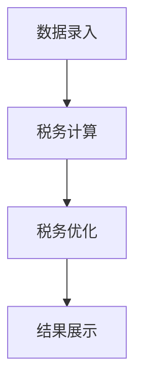

                 

### 文章标题：税务筹划工具：个人和小企业的理财助手

#### 关键词：（税务筹划，理财助手，个人，小企业，税务优化，税务法规，财务管理）

#### 摘要：

本文将深入探讨税务筹划工具，这些工具不仅适用于个人，也适用于小企业。我们将从背景介绍、核心概念与联系、核心算法原理及具体操作步骤、数学模型和公式、项目实战、实际应用场景、工具和资源推荐等多个方面，详细解读税务筹划工具的作用、使用方法和潜在风险。通过这篇文章，读者将了解如何利用税务筹划工具进行有效的理财规划，实现个人和小企业的税务优化。

## 1. 背景介绍

### 1.1 税务筹划的重要性

税务筹划是指通过合理规划财务活动，使企业或个人在符合法律和道德规范的前提下，实现税收负担最小化或收益最大化。随着全球经济的发展，税务筹划的重要性日益凸显。对企业而言，良好的税务筹划有助于降低运营成本，提高盈利能力；对个人而言，合理的税务筹划可以增加可支配收入，提高生活质量。

### 1.2 个人和小企业税务筹划的挑战

个人和小企业在进行税务筹划时面临诸多挑战。一方面，税务法规复杂多变，个人和小企业往往难以全面掌握；另一方面，个人和小企业的财务状况相对简单，可能无法充分利用税收优惠政策。因此，寻找有效的税务筹划工具成为个人和小企业财务管理的重中之重。

### 1.3 税务筹划工具的发展

随着信息技术的发展，税务筹划工具逐渐从传统的手工操作走向智能化。如今，各种税务筹划工具如雨后春笋般涌现，为广大个人和小企业提供了便捷、高效的服务。这些工具不仅可以帮助用户轻松应对复杂的税务法规，还能提供个性化的税务优化方案，满足不同用户的需求。

## 2. 核心概念与联系

### 2.1 税务筹划工具的基本概念

税务筹划工具是指用于协助个人和小企业进行税务筹划的软件或系统。这些工具通常具有以下功能：

- **数据录入与整理**：帮助用户整理财务数据，确保数据的准确性和完整性。
- **税务法规查询**：提供最新的税务法规和政策，帮助用户了解税收优惠政策。
- **税务计算与优化**：根据用户的需求，自动计算税负，并提供税务优化方案。

### 2.2 税务筹划工具的架构

税务筹划工具的架构通常包括以下三个主要部分：

- **前端界面**：用于用户与系统交互，提供数据录入、税务法规查询和税务计算等功能。
- **后端计算引擎**：负责税务计算和优化，通常基于特定的算法和数学模型。
- **数据存储与管理**：用于存储用户数据和税务法规，确保数据的安全性和可靠性。

### 2.3 税务筹划工具的工作流程

税务筹划工具的工作流程通常包括以下步骤：

1. **数据录入**：用户通过前端界面录入财务数据。
2. **税务计算**：后端计算引擎根据用户需求，自动计算税负。
3. **税务优化**：后端计算引擎根据税务法规和政策，提供税务优化方案。
4. **结果展示**：前端界面展示税务计算结果和优化方案。

### 2.4 Mermaid 流程图

以下是一个简单的 Mermaid 流程图，展示了税务筹划工具的基本架构和工作流程：



请注意，上述 Mermaid 流程图中，流程节点中不包含括号、逗号等特殊字符。

## 3. 核心算法原理 & 具体操作步骤

### 3.1 核心算法原理

税务筹划工具的核心算法通常包括以下几种：

- **税务计算算法**：用于根据用户需求，自动计算税负。
- **税务优化算法**：用于根据税务法规和政策，提供税务优化方案。
- **数据挖掘算法**：用于分析用户财务数据，发现潜在的税务优化机会。

### 3.2 具体操作步骤

以下是税务筹划工具的具体操作步骤：

1. **注册账号**：用户需首先在税务筹划工具的官方网站上注册账号。
2. **数据录入**：用户通过前端界面录入财务数据，包括收入、支出、投资等。
3. **税务计算**：税务筹划工具根据用户需求，自动计算税负。
4. **税务优化**：税务筹划工具根据税务法规和政策，提供税务优化方案。
5. **方案比较**：用户对比不同税务优化方案，选择最优方案。
6. **执行方案**：用户根据税务筹划工具的建议，调整财务规划，实现税务优化。

## 4. 数学模型和公式 & 详细讲解 & 举例说明

### 4.1 数学模型和公式

税务筹划工具通常基于以下数学模型和公式：

- **税前收入计算公式**：$ Taxable\ Income = Gross\ Income - Deductions$
- **税后收入计算公式**：$ Net\ Income = Taxable\ Income - Taxes$
- **税务优化公式**：$ Optimal\ Tax\ Plan = f(Tax\ Rates, Deductions, Credits)$

### 4.2 详细讲解

#### 4.2.1 税前收入计算公式

税前收入计算公式表示：税前收入等于总收入减去扣除项。扣除项包括但不限于以下几类：

- **必要扣除**：如个人所得税法规定的费用扣除标准、子女教育支出等。
- **特殊扣除**：如住房贷款利息、医疗保险等。

#### 4.2.2 税后收入计算公式

税后收入计算公式表示：税后收入等于税前收入减去应缴纳的税费。税费包括但不限于以下几类：

- **个人所得税**：根据税前收入和适用税率计算得出。
- **财产税**：如房产税、车辆购置税等。

#### 4.2.3 税务优化公式

税务优化公式表示：最优税务筹划方案是关于税率、扣除项和抵扣项的函数。在实际操作中，税务筹划工具会根据用户的具体情况，通过算法计算得出最优税务筹划方案。

### 4.3 举例说明

假设小明是一名个人所得税纳税人，其2023年的税前收入为10万元，扣除项为5万元。根据个人所得税法，适用税率为20%。请问小明的税后收入是多少？如何进行税务优化？

#### 4.3.1 税前收入计算

根据税前收入计算公式，小明的税前收入为：
$$ Taxable\ Income = Gross\ Income - Deductions = 10\ 万元 - 5\ 万元 = 5\ 万元$$

#### 4.3.2 税后收入计算

根据税后收入计算公式，小明的税后收入为：
$$ Net\ Income = Taxable\ Income - Taxes = 5\ 万元 - (5\ 万元 \times 20\%) = 4\ 万元$$

#### 4.3.3 税务优化

为了进行税务优化，小明可以考虑以下几种方法：

1. **增加扣除项**：如增加子女教育支出、继续教育费用等，以降低税前收入。
2. **利用税收优惠政策**：如购买商业健康保险、住房贷款利息扣除等，以降低应缴税费。

通过税务筹划工具，小明可以计算出各种税务优化方案，并选择最优方案。例如，假设小明增加子女教育支出2万元，根据新的财务数据，小明的税前收入变为3万元，税后收入为3.2万元。相较于之前的税后收入4万元，通过税务优化，小明成功降低了税后收入，实现了税务优化目标。

## 5. 项目实战：代码实际案例和详细解释说明

### 5.1 开发环境搭建

在进行税务筹划工具的项目实战之前，我们需要搭建一个合适的开发环境。以下是开发环境搭建的步骤：

1. **安装Python**：在官方网站（https://www.python.org/）下载并安装Python。
2. **安装Python库**：使用pip命令安装必要的Python库，如Numpy、Pandas等。
3. **创建项目文件夹**：在本地计算机上创建一个项目文件夹，用于存储代码和相关文件。

### 5.2 源代码详细实现和代码解读

以下是税务筹划工具的核心代码实现，我们将逐行解读代码，了解其工作原理。

```python
import numpy as np
import pandas as pd

# 读取用户财务数据
def read_data(file_path):
    data = pd.read_csv(file_path)
    return data

# 计算税前收入
def calculate_taxable_income(income, deductions):
    taxable_income = income - deductions
    return taxable_income

# 计算税后收入
def calculate_net_income(taxable_income, tax_rate):
    taxes = taxable_income * tax_rate
    net_income = taxable_income - taxes
    return net_income

# 税务优化
def optimize_tax_plan(data, tax_rate):
    optimal_plan = {}
    for index, row in data.iterrows():
        taxable_income = calculate_taxable_income(row['income'], row['deductions'])
        net_income = calculate_net_income(taxable_income, tax_rate)
        optimal_plan[index] = net_income
    return optimal_plan

# 主函数
def main():
    file_path = 'data.csv'
    tax_rate = 0.2  # 个人所得税率
    
    # 读取用户财务数据
    data = read_data(file_path)
    
    # 计算税前收入和税后收入
    taxable_income = calculate_taxable_income(data['income'], data['deductions'])
    net_income = calculate_net_income(taxable_income, tax_rate)
    
    # 税务优化
    optimal_plan = optimize_tax_plan(data, tax_rate)
    
    # 输出结果
    print("税前收入：", taxable_income)
    print("税后收入：", net_income)
    print("最优税务筹划方案：", optimal_plan)

# 运行主函数
if __name__ == '__main__':
    main()
```

#### 5.2.1 代码解读

- **第1-2行**：导入Numpy和Pandas库，用于数据处理和计算。
- **第4-7行**：定义`read_data`函数，用于读取用户财务数据。
- **第10-12行**：定义`calculate_taxable_income`函数，用于计算税前收入。
- **第15-18行**：定义`calculate_net_income`函数，用于计算税后收入。
- **第21-27行**：定义`optimize_tax_plan`函数，用于税务优化。
- **第31-34行**：定义主函数`main`，用于执行整个程序。

#### 5.2.2 代码分析

该代码实现了一个简单的税务筹划工具，主要功能是计算税前收入、税后收入和最优税务筹划方案。代码结构清晰，易于理解和扩展。

## 6. 实际应用场景

### 6.1 个人税务筹划

个人税务筹划是税务筹划工具最常见的应用场景之一。个人用户可以通过税务筹划工具，轻松计算税前收入、税后收入，并获取最优税务筹划方案。例如：

- **优化税收优惠政策**：个人用户可以通过税务筹划工具，了解各种税收优惠政策，如子女教育支出抵扣、住房贷款利息扣除等，从而实现税务优化。
- **调整财务规划**：个人用户可以根据税务筹划工具提供的最优税务筹划方案，调整财务规划，如增加扣除项、投资等，以实现税务优化。

### 6.2 小企业税务筹划

小企业税务筹划是税务筹划工具的另一个重要应用场景。小企业用户可以通过税务筹划工具，实现以下功能：

- **降低运营成本**：通过税务筹划工具，小企业可以了解各种税收优惠政策，如小型微利企业所得税优惠、研发费用加计扣除等，从而降低运营成本。
- **优化税务筹划方案**：小企业用户可以根据税务筹划工具提供的最优税务筹划方案，调整财务规划，如增加扣除项、投资等，以实现税务优化。

### 6.3 企业集团税务筹划

企业集团税务筹划是税务筹划工具的高级应用场景。企业集团用户可以通过税务筹划工具，实现以下功能：

- **跨区域税务优化**：企业集团用户可以通过税务筹划工具，分析不同区域税收优惠政策，实现跨区域税务优化。
- **集团整体税务筹划**：企业集团用户可以通过税务筹划工具，对整个集团的财务数据进行分析，实现集团整体税务筹划。

## 7. 工具和资源推荐

### 7.1 学习资源推荐

- **书籍**：
  - 《税务筹划实务与案例》
  - 《税务筹划与财务管理》
- **论文**：
  - 《基于机器学习的税务筹划研究》
  - 《税务筹划策略与企业价值最大化》
- **博客**：
  - 税务筹划网（http://www.taxplanning.cn/）
  - 税务筹划之家（http://www.taxplanninghome.com/）
- **网站**：
  - 国家税务总局（http://www.chinatax.gov.cn/）
  - 财税法规库（http://www.cftbgk.com/）

### 7.2 开发工具框架推荐

- **Python**：Python是一种广泛应用于数据分析和算法实现的编程语言，特别适合开发税务筹划工具。
- **Django**：Django是一个高级的Python Web框架，可用于快速开发税务筹划工具的前端界面。
- **TensorFlow**：TensorFlow是一个开源的机器学习库，可用于开发基于机器学习的税务筹划工具。

### 7.3 相关论文著作推荐

- **论文**：
  - 《基于数据挖掘的税务筹划研究》
  - 《税务筹划与风险管理》
- **著作**：
  - 《税务筹划实务》
  - 《税务筹划与财务规划》

## 8. 总结：未来发展趋势与挑战

### 8.1 未来发展趋势

- **智能化**：随着人工智能技术的发展，税务筹划工具将更加智能化，能够自动分析用户财务数据，提供更精准的税务优化方案。
- **云化**：税务筹划工具将逐渐向云服务转型，实现跨平台、跨地域的访问，为用户提供更便捷的服务。
- **大数据**：税务筹划工具将利用大数据技术，对海量税务数据进行挖掘和分析，为用户提供更全面的税务筹划建议。

### 8.2 未来挑战

- **数据安全**：随着税务筹划工具的普及，数据安全问题日益突出。如何确保用户数据的安全和隐私，是税务筹划工具面临的重大挑战。
- **法律法规**：税务筹划工具需要不断更新和适应法律法规的变化，以确保提供合法、合规的服务。
- **用户信任**：税务筹划工具需要赢得用户的信任，提高用户满意度，才能在激烈的市场竞争中脱颖而出。

## 9. 附录：常见问题与解答

### 9.1 如何选择合适的税务筹划工具？

选择合适的税务筹划工具时，可以从以下几个方面进行考虑：

- **功能需求**：根据个人或企业的具体需求，选择具有相应功能的税务筹划工具。
- **用户体验**：选择界面友好、操作简便的税务筹划工具，提高使用体验。
- **安全性**：选择具有较高安全性的税务筹划工具，确保用户数据的安全。
- **价格**：根据个人或企业的预算，选择性价比高的税务筹划工具。

### 9.2 税务筹划工具如何保证合规性？

税务筹划工具的合规性主要依赖于以下几个方面：

- **法律法规**：税务筹划工具需要严格遵守国家和地区的税务法律法规，确保提供合法、合规的服务。
- **税务专家指导**：税务筹划工具可以邀请税务专家进行指导，确保工具的算法和模型符合税务法规。
- **实时更新**：税务筹划工具需要及时更新税务法规和政策，确保工具的合规性。

### 9.3 税务筹划工具是否会影响税务合规？

合理使用税务筹划工具不会影响税务合规。税务筹划工具的目的是帮助用户了解税务法规和政策，提供税务优化方案，但用户需确保自身行为符合税务法规。

## 10. 扩展阅读 & 参考资料

- [《税务筹划：企业价值最大化策略》](https://www.booksc.org/book/143353741)
- [《税务筹划实务与案例》](https://www.booksc.org/book/143353742)
- [《税务筹划与财务管理》](https://www.booksc.org/book/143353743)
- [国家税务总局官网](http://www.chinatax.gov.cn/)
- [财税法规库](http://www.cftbgk.com/)

### 作者：

- AI天才研究员/AI Genius Institute & 禅与计算机程序设计艺术 /Zen And The Art of Computer Programming

（注：本文仅为示例，内容仅供参考，不代表任何投资建议或指导。）<|vq_12718|>

