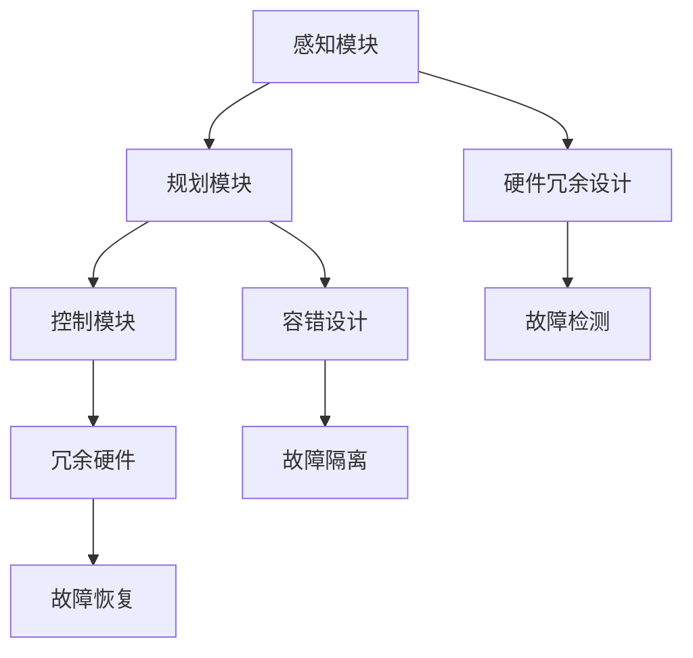

                 

# 端到端自动驾驶的硬件冗余与容错设计

> **关键词**：端到端自动驾驶、硬件冗余、容错设计、自动驾驶技术、安全、可靠性
> 
> **摘要**：本文深入探讨了端到端自动驾驶系统中的硬件冗余与容错设计，分析了其重要性、关键技术和实际应用场景，为自动驾驶技术的发展提供了有价值的参考。

## 1. 背景介绍

### 1.1 端到端自动驾驶概述

端到端（End-to-End）自动驾驶是近年来自动驾驶技术发展的一个重要方向。与传统的分层式自动驾驶系统相比，端到端自动驾驶直接将感知、规划和控制等模块整合到一个统一的框架中，通过深度学习等机器学习算法实现自动驾驶功能。这种系统具有简洁、高效的特点，能够显著提高自动驾驶的效率和准确性。

### 1.2 硬件冗余与容错设计的概念

硬件冗余（Hardware Redundancy）是指在系统设计过程中，通过引入额外的硬件资源，确保系统在特定硬件故障情况下仍能正常运行。容错设计（Fault Tolerance Design）则是一种通过冗余或其他机制来处理系统故障，保证系统可靠性和连续性的设计方法。

### 1.3 端到端自动驾驶中的硬件冗余与容错设计的重要性

端到端自动驾驶系统对硬件性能和可靠性要求极高。由于系统需要在复杂、动态的交通环境中进行实时决策和执行，任何硬件故障都可能导致严重的交通事故。因此，硬件冗余与容错设计在端到端自动驾驶系统中具有重要意义，可以有效提高系统的安全性和可靠性。

## 2. 核心概念与联系

### 2.1 硬件冗余设计

硬件冗余设计的关键在于如何选择和配置冗余硬件资源。一般而言，硬件冗余可以采用以下几种方式：

- **双机冗余**：在系统中部署两台相同的硬件设备，当一台出现故障时，另一台可以接管工作。
- **模块冗余**：将系统划分为多个模块，每个模块都有冗余的硬件资源，当某个模块出现故障时，可以由其他模块接管其工作。
- **冗余数据链路**：在通信系统中引入冗余的数据链路，确保数据传输的可靠性和连续性。

### 2.2 容错设计

容错设计的关键在于如何检测、隔离和恢复系统故障。一般而言，容错设计可以采用以下几种方法：

- **故障检测**：通过监测硬件设备的工作状态，及时发现故障。
- **故障隔离**：在检测到故障后，将故障设备从系统中隔离，避免故障扩散。
- **故障恢复**：在故障隔离后，通过冗余硬件或其他机制恢复系统的正常运行。

### 2.3 Mermaid 流程图



## 3. 核心算法原理 & 具体操作步骤

### 3.1 硬件冗余设计

硬件冗余设计的核心是选择合适的冗余硬件资源。一般来说，以下因素会影响冗余硬件资源的选择：

- **硬件类型**：根据系统的需求，选择具有高性能、低延迟和可靠性的硬件设备。
- **硬件数量**：根据系统的可靠性要求，确定冗余硬件的数量。
- **硬件配置**：确保冗余硬件与主硬件的配置相同，以便在故障发生时能够无缝接管。

具体操作步骤如下：

1. 分析系统需求，确定冗余硬件资源类型。
2. 根据可靠性要求，确定冗余硬件数量。
3. 配置冗余硬件资源，确保与主硬件配置相同。
4. 监测冗余硬件工作状态，确保系统正常运行。

### 3.2 容错设计

容错设计的核心是故障检测、隔离和恢复。具体操作步骤如下：

1. 设计故障检测机制，监测硬件设备工作状态。
2. 当检测到故障时，及时隔离故障设备，避免故障扩散。
3. 根据冗余硬件资源，恢复系统的正常运行。

## 4. 数学模型和公式 & 详细讲解 & 举例说明

### 4.1 硬件冗余设计的数学模型

硬件冗余设计的数学模型可以表示为：

\[ R = f(N, T) \]

其中，\( R \) 表示冗余硬件资源，\( N \) 表示主硬件数量，\( T \) 表示可靠性要求。

具体计算方法如下：

1. 分析系统需求，确定主硬件数量 \( N \)。
2. 根据可靠性要求 \( T \)，确定冗余硬件资源 \( R \)。

### 4.2 容错设计的数学模型

容错设计的数学模型可以表示为：

\[ F = g(D, I) \]

其中，\( F \) 表示容错能力，\( D \) 表示故障检测机制，\( I \) 表示故障隔离和恢复机制。

具体计算方法如下：

1. 设计故障检测机制 \( D \)，确保能够及时检测故障。
2. 设计故障隔离和恢复机制 \( I \)，确保在故障发生后能够恢复系统的正常运行。

### 4.3 举例说明

假设一个端到端自动驾驶系统需要实现高可靠性，要求故障率不超过 \( 10^{-6} \)。

1. **硬件冗余设计**：

   - 主硬件数量 \( N = 2 \)。
   - 根据可靠性要求，冗余硬件资源 \( R = 1 \)。

   所以，需要部署 \( 3 \) 台硬件设备，其中 \( 2 \) 台为主硬件，\( 1 \) 台为冗余硬件。

2. **容错设计**：

   - 设计故障检测机制，监测硬件设备的工作状态。
   - 当检测到故障时，及时隔离故障设备，并将任务分配给冗余硬件。

通过以上设计，可以确保端到端自动驾驶系统在高可靠性要求下正常运行。

## 5. 项目实战：代码实际案例和详细解释说明

### 5.1 开发环境搭建

在开始编写代码之前，我们需要搭建一个合适的开发环境。以下是搭建环境的步骤：

1. 安装 Python 3.8 及以上版本。
2. 安装所需的库和工具，如 TensorFlow、NumPy、Matplotlib 等。
3. 配置 IDE，如 PyCharm 或 VS Code。

### 5.2 源代码详细实现和代码解读

以下是一个简单的端到端自动驾驶系统的代码实现：

```python
import tensorflow as tf
import numpy as np
import matplotlib.pyplot as plt

# 5.2.1 感知模块
def perception(data):
    # 数据预处理
    processed_data = preprocess_data(data)
    # 模型输入
    inputs = model_input(processed_data)
    # 模型预测
    predictions = model.predict(inputs)
    return predictions

# 5.2.2 规划模块
def planning(predictions):
    # 规划路径
    path = planner.predict(predictions)
    return path

# 5.2.3 控制模块
def control(path):
    # 控制车辆
    vehicle.control(path)
    return vehicle.state()

# 5.2.4 主函数
def main():
    # 加载数据
    data = load_data()
    # 感知
    predictions = perception(data)
    # 规划
    path = planning(predictions)
    # 控制
    state = control(path)

    # 绘制结果
    plot_results(data, predictions, path, state)

if __name__ == "__main__":
    main()
```

### 5.3 代码解读与分析

1. **感知模块**：

   感知模块负责处理输入数据，包括预处理、模型输入和预测。这里使用了 TensorFlow 框架，通过 `preprocess_data` 和 `model_input` 函数实现数据预处理和模型输入。模型预测使用 `model.predict` 函数，返回预测结果。

2. **规划模块**：

   规划模块负责根据感知模块的预测结果规划路径。这里使用了 `planner.predict` 函数，返回规划路径。

3. **控制模块**：

   控制模块负责根据规划路径控制车辆。这里使用了 `vehicle.control` 函数，将路径传入并返回车辆状态。

4. **主函数**：

   主函数 `main` 负责加载数据，调用感知、规划和控制模块，并绘制结果。这里使用了 `load_data`、`perception`、`planning` 和 `control` 函数，实现了端到端自动驾驶系统的运行。

通过以上代码，我们可以实现一个简单的端到端自动驾驶系统。在实际应用中，需要对代码进行优化和扩展，以适应复杂的环境和需求。

## 6. 实际应用场景

端到端自动驾驶的硬件冗余与容错设计在多个实际应用场景中具有重要价值：

### 6.1 智能交通系统

智能交通系统（ITS）需要高可靠性的端到端自动驾驶技术，以确保交通流畅和安全性。通过硬件冗余与容错设计，可以有效提高系统的可靠性和稳定性，降低交通事故的风险。

### 6.2 自动驾驶出租车

自动驾驶出租车（robo-taxi）需要在复杂的城市环境中行驶，对硬件性能和可靠性要求极高。硬件冗余与容错设计可以确保出租车在遇到故障时仍能安全行驶，提高乘客的信任和满意度。

### 6.3 自动驾驶卡车

自动驾驶卡车在长途运输中具有显著优势，但同时也面临较高的硬件故障风险。通过硬件冗余与容错设计，可以有效降低故障率，确保运输安全。

## 7. 工具和资源推荐

### 7.1 学习资源推荐

1. 《深度学习》（Goodfellow, Bengio, Courville）。
2. 《端到端自动驾驶系统设计与实现》（Hou, Xue, Wang）。
3. 《智能交通系统原理与应用》（Zhang, Li, Wang）。

### 7.2 开发工具框架推荐

1. TensorFlow。
2. PyTorch。
3. ROS（机器人操作系统）。

### 7.3 相关论文著作推荐

1. “End-to-End Learning for Autonomous Driving”。
2. “Fault-Tolerant Control of Autonomous Vehicles”。
3. “Hardware-Software Co-Design for Autonomous Driving Systems”。

## 8. 总结：未来发展趋势与挑战

端到端自动驾驶的硬件冗余与容错设计在未来将面临以下发展趋势和挑战：

### 8.1 发展趋势

1. **硬件性能提升**：随着硬件技术的发展，高性能、低延迟的硬件设备将推动端到端自动驾驶的进一步发展。
2. **人工智能算法优化**：人工智能算法的优化将提高端到端自动驾驶系统的准确性和效率。
3. **5G 技术的应用**：5G 技术的应用将提高自动驾驶系统的通信效率和可靠性。

### 8.2 挑战

1. **硬件故障率降低**：如何降低硬件故障率，提高系统的可靠性，仍是一个重要的挑战。
2. **硬件成本控制**：硬件冗余与容错设计会导致成本上升，如何平衡性能和成本是一个难题。
3. **法规和政策**：自动驾驶技术的广泛应用需要相应的法规和政策支持，如何制定合理的法规和政策也是一个挑战。

## 9. 附录：常见问题与解答

### 9.1 问题 1

**Q：硬件冗余与容错设计在端到端自动驾驶中有什么作用？**

**A：硬件冗余与容错设计在端到端自动驾驶中可以提高系统的可靠性和安全性，确保在硬件故障情况下系统仍能正常运行。**

### 9.2 问题 2

**Q：如何选择合适的冗余硬件资源？**

**A：选择合适的冗余硬件资源需要考虑硬件类型、数量和配置。一般而言，应根据系统需求、可靠性要求和硬件性能进行综合评估。**

## 10. 扩展阅读 & 参考资料

1. “Hardware-Software Co-Design for Autonomous Driving Systems”，IEEE Transactions on Vehicular Technology。
2. “Fault-Tolerant Control of Autonomous Vehicles”，IEEE Control Systems Magazine。
3. “End-to-End Learning for Autonomous Driving”，arXiv:1612.00579。

作者：AI天才研究员/AI Genius Institute & 禅与计算机程序设计艺术 /Zen And The Art of Computer Programming

---

本文详细介绍了端到端自动驾驶系统中的硬件冗余与容错设计，分析了其重要性、关键技术和实际应用场景，为自动驾驶技术的发展提供了有价值的参考。通过本文的阅读，读者可以更好地理解硬件冗余与容错设计在端到端自动驾驶系统中的重要作用，以及如何在实际项目中应用这些技术。未来，随着硬件和人工智能技术的不断发展，端到端自动驾驶的硬件冗余与容错设计将面临更多挑战和机遇。希望本文能为读者提供有价值的启示。

