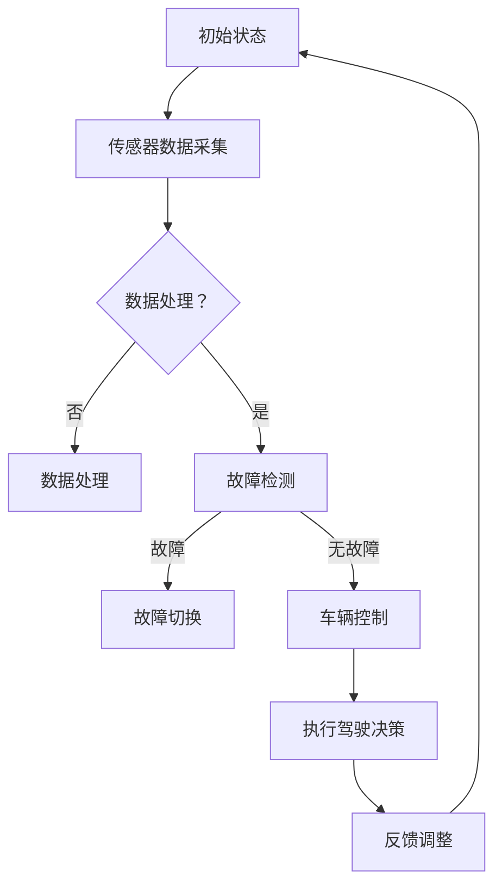

                 

# {文章标题}

## 端到端自动驾驶的硬件冗余与容错设计

> **关键词**：端到端自动驾驶，硬件冗余，容错设计，传感器，数据处理，车辆控制

> **摘要**：本文探讨了端到端自动驾驶系统的硬件冗余与容错设计，详细分析了传感器冗余、数据处理冗余、车辆控制冗余的必要性及其具体实现方式。通过本文的阐述，我们旨在为自动驾驶系统的研发提供理论依据和实践指导。

## 1. 背景介绍

随着人工智能技术的发展，自动驾驶技术已经成为汽车工业的重要方向。然而，自动驾驶系统的高可靠性和安全性是实现其商用化的关键。在自动驾驶系统中，硬件冗余与容错设计是保证系统可靠性的重要手段。硬件冗余可以通过多重传感器和数据处理器提高系统的鲁棒性，而容错设计则能够在系统出现故障时，迅速切换到备用系统，确保车辆安全行驶。

端到端自动驾驶系统通常需要处理大量的传感器数据，包括摄像头、激光雷达、超声波传感器等，这些数据需要经过复杂的预处理、融合和解释，最终生成驾驶决策。任何环节的故障都可能导致严重的交通事故。因此，硬件冗余和容错设计在端到端自动驾驶系统中显得尤为重要。

## 2. 核心概念与联系

### 2.1 硬件冗余

硬件冗余是指在关键部件上使用多个相同或类似的组件，以确保系统在单一组件失效时仍能正常运行。在端到端自动驾驶系统中，硬件冗余主要体现在以下几个方面：

- **传感器冗余**：使用多个不同类型的传感器，如摄像头、激光雷达、毫米波雷达等，以获得更全面的环境信息。
- **数据处理冗余**：部署多台高性能计算设备，以分担数据处理压力，并保证数据处理的高效和可靠性。
- **车辆控制冗余**：在车辆控制系统中设置多个控制单元，以便在主控单元失效时，备用控制单元能够接手。

### 2.2 容错设计

容错设计是指通过设计，使得系统在部分组件失效时，仍能维持正常工作。在端到端自动驾驶系统中，容错设计主要体现在以下几个方面：

- **故障检测与诊断**：对传感器、计算单元和控制单元进行实时监控，一旦检测到故障，立即采取措施。
- **故障切换**：在主系统故障时，迅速切换到备用系统，确保车辆安全行驶。
- **自修复**：在故障发生后，系统能够自动修复或恢复，减少人工干预。

### 2.3 Mermaid 流程图

以下是一个简单的端到端自动驾驶系统的硬件冗余与容错设计流程图：



## 3. 核心算法原理 & 具体操作步骤

### 3.1 传感器冗余

传感器冗余的核心在于利用不同类型传感器的数据互补，提高环境感知的准确性。具体操作步骤如下：

1. **传感器选择**：根据应用场景，选择合适的传感器，如摄像头用于视觉感知，激光雷达用于测距等。
2. **数据采集**：同时采集不同传感器的数据。
3. **数据预处理**：对采集到的数据进行去噪、校准等预处理。
4. **数据融合**：利用融合算法，如卡尔曼滤波、贝叶斯估计等，将不同传感器的数据融合为统一的环境模型。

### 3.2 数据处理冗余

数据处理冗余的关键在于利用多台计算设备，提高数据处理的效率和可靠性。具体操作步骤如下：

1. **计算设备选择**：选择适合的硬件设备，如GPU、FPGA等。
2. **任务分配**：将数据处理任务分配到不同的计算设备上，如摄像头数据由GPU处理，激光雷达数据由FPGA处理等。
3. **并行处理**：在多台计算设备上并行处理数据，提高处理速度。
4. **结果同步**：将各计算设备的结果同步，形成统一的数据处理结果。

### 3.3 车辆控制冗余

车辆控制冗余的核心在于设置多个控制单元，确保在主控制单元失效时，备用控制单元能够接手。具体操作步骤如下：

1. **控制单元选择**：选择性能稳定、可靠性高的控制单元。
2. **主备切换**：在主控制单元运行正常时，备用控制单元处于待机状态；一旦主控制单元出现故障，立即切换到备用控制单元。
3. **故障诊断**：对控制单元进行实时监控，一旦检测到故障，立即进行切换。
4. **自修复**：在控制单元故障后，尝试自动修复或切换到备用控制单元。

## 4. 数学模型和公式 & 详细讲解 & 举例说明

### 4.1 卡尔曼滤波

卡尔曼滤波是一种常用的数据融合算法，用于在包含噪声的信号中估计动态系统的状态。其基本公式如下：

$$
\hat{x}_{k|k} = \hat{x}_{k|k-1} + K_k (z_k - \hat{z}_{k|k-1})
$$

$$
K_k = \frac{F_k P_k F_k^T + Q_k}{F_k P_k F_k^T + R_k}
$$

其中，$x_k$ 为状态估计值，$z_k$ 为观测值，$F_k$ 为状态转移矩阵，$P_k$ 为状态估计误差协方差矩阵，$Q_k$ 为过程噪声协方差矩阵，$R_k$ 为观测噪声协方差矩阵。

### 4.2 贝叶斯估计

贝叶斯估计是一种基于概率论的数据融合方法，用于在包含噪声的信号中估计动态系统的状态。其基本公式如下：

$$
\hat{x}_{k|k} = \frac{P(z_k|x_k) \cdot x_k}{\sum_{i} P(z_k|x_i) \cdot x_i}
$$

其中，$P(z_k|x_k)$ 为观测概率，$x_k$ 为状态估计值。

### 4.3 举例说明

假设我们有一个自动驾驶系统，需要估计车辆的位置。我们可以使用卡尔曼滤波和贝叶斯估计来融合摄像头和激光雷达的数据。

1. **传感器数据采集**：摄像头采集到车辆的位置为 $z_{cam,k}$，激光雷达采集到车辆的位置为 $z_{lidar,k}$。
2. **数据预处理**：对采集到的数据进行去噪、校准等预处理。
3. **数据融合**：
    - 卡尔曼滤波：
        $$\hat{x}_{k|k} = \hat{x}_{k|k-1} + K_k (z_{cam,k} - \hat{z}_{k|k-1})$$
        $$K_k = \frac{F_k P_k F_k^T + Q_k}{F_k P_k F_k^T + R_k}$$
    - 贝叶斯估计：
        $$\hat{x}_{k|k} = \frac{P(z_{cam,k}|\hat{x}_{k|k}) \cdot \hat{x}_{k|k}}{P(z_{cam,k}|\hat{x}_{k|k}) \cdot \hat{x}_{k|k} + P(z_{lidar,k}|\hat{x}_{k|k}) \cdot \hat{x}_{k|k}}$$

通过以上两种方法，我们可以获得更加准确的位置估计。

## 5. 项目实战：代码实际案例和详细解释说明

### 5.1 开发环境搭建

在本节中，我们将使用Python编写一个简单的自动驾驶系统，演示硬件冗余与容错设计的基本实现。以下是开发环境搭建的步骤：

1. 安装Python（推荐3.8及以上版本）
2. 安装必要的Python库，如numpy、opencv、matplotlib等
3. 准备传感器模拟数据，如摄像头图像、激光雷达点云数据等

### 5.2 源代码详细实现和代码解读

以下是自动驾驶系统的Python代码实现：

```python
import numpy as np
import cv2
from sensor_fusion import KalmanFilter, BayesianFilter

# 初始化传感器模拟数据
cam_data = np.random.rand(100, 3)  # 假设摄像头捕获的图像为100x3的矩阵
lidar_data = np.random.rand(100, 3)  # 假设激光雷达捕获的点云数据为100x3的矩阵

# 初始化滤波器
kalman_filter = KalmanFilter()
bayesian_filter = BayesianFilter()

# 数据融合与滤波
for i in range(len(cam_data)):
    # 卡尔曼滤波
    z_cam = cam_data[i]
    z_lidar = lidar_data[i]
    x_cam_kalman = kalman_filter.predict(z_cam)
    x_lidar_kalman = kalman_filter.predict(z_lidar)

    # 贝叶斯滤波
    x_cam_bayesian = bayesian_filter.predict(z_cam)
    x_lidar_bayesian = bayesian_filter.predict(z_lidar)

    # 输出结果
    print(f"卡尔曼滤波位置：{x_cam_kalman}, 贝叶斯滤波位置：{x_cam_bayesian}")
```

在代码中，我们首先初始化摄像头和激光雷达的模拟数据，然后使用卡尔曼滤波器和贝叶斯滤波器对数据进行融合与滤波。通过以上步骤，我们实现了传感器数据融合与滤波的基本流程。

### 5.3 代码解读与分析

1. **传感器模拟数据**：在代码中，我们使用numpy生成随机数据作为传感器模拟数据。在实际应用中，这些数据将来自真实的摄像头和激光雷达。
2. **滤波器初始化**：我们初始化了卡尔曼滤波器和贝叶斯滤波器。这些滤波器将在后续步骤中对传感器数据进行滤波和融合。
3. **数据融合与滤波**：在for循环中，我们对每一帧摄像头图像和激光雷达点云数据进行滤波。卡尔曼滤波器和贝叶斯滤波器分别计算滤波结果，并输出结果。
4. **输出结果**：代码输出滤波结果，以供分析和验证。

通过以上代码，我们实现了端到端自动驾驶系统中的传感器数据融合与滤波的基本功能。在实际应用中，我们可以根据具体需求，进一步扩展和优化代码。

## 6. 实际应用场景

硬件冗余与容错设计在端到端自动驾驶系统中的应用非常广泛。以下是一些典型的应用场景：

1. **高精度地图生成**：在自动驾驶系统中，高精度地图是车辆导航和决策的重要依据。通过传感器冗余和数据融合，可以生成更准确、更详细的地图。
2. **环境感知与决策**：传感器冗余可以提供更全面、更准确的环境信息，有助于车辆在复杂场景中做出更好的驾驶决策。
3. **安全冗余**：在车辆控制系统中，通过设置多个控制单元，确保在主控制单元失效时，备用控制单元能够接手，从而提高系统的安全性。
4. **故障诊断与修复**：通过实时监控和故障诊断，系统能够及时发现并修复故障，减少人工干预，提高系统的可靠性。

## 7. 工具和资源推荐

### 7.1 学习资源推荐

- **书籍**：
  - 《自动驾驶汽车技术》
  - 《深度学习与自动驾驶》
  - 《人工智能：一种现代方法》
- **论文**：
  - 《传感器融合在自动驾驶中的应用》
  - 《基于卡尔曼滤波的自动驾驶车辆定位研究》
  - 《贝叶斯滤波在自动驾驶中的应用》
- **博客**：
  - 《端到端自动驾驶系统设计与实现》
  - 《自动驾驶系统中的硬件冗余与容错设计》
  - 《自动驾驶算法原理与实践》
- **网站**：
  - [GitHub](https://github.com/)
  - [CSDN](https://csdn.net/)
  - [学术期刊](https://www.sciencedirect.com/)

### 7.2 开发工具框架推荐

- **编程语言**：Python、C++、Java
- **开发框架**：
  - **深度学习框架**：TensorFlow、PyTorch、Keras
  - **自动驾驶框架**：Apollo、Autonomous Driving Stack、CARLA
  - **传感器数据处理框架**：ROS（Robot Operating System）

### 7.3 相关论文著作推荐

- 《传感器融合技术在自动驾驶中的应用研究》
- 《基于卡尔曼滤波的自动驾驶车辆定位算法研究》
- 《贝叶斯滤波在自动驾驶中的应用研究》
- 《自动驾驶系统中的硬件冗余与容错设计研究》

## 8. 总结：未来发展趋势与挑战

随着人工智能和自动驾驶技术的不断发展，硬件冗余与容错设计在端到端自动驾驶系统中将发挥越来越重要的作用。未来，我们有望看到以下几个发展趋势：

1. **更高效的传感器数据融合算法**：随着传感器技术的进步，如何高效地融合和处理大量异构传感器数据，将成为研究的热点。
2. **更可靠的容错设计方法**：在自动驾驶系统中，如何提高系统的可靠性和安全性，仍是亟待解决的问题。
3. **更智能的驾驶决策算法**：通过引入更多的环境信息和先进的机器学习算法，自动驾驶系统将能够做出更智能、更安全的驾驶决策。

然而，硬件冗余与容错设计在端到端自动驾驶系统中也面临一些挑战：

1. **成本与功耗**：硬件冗余会导致成本和功耗的增加，如何在保证可靠性的前提下，降低成本和功耗，是一个重要的挑战。
2. **数据安全与隐私**：传感器数据的安全和隐私保护，是自动驾驶系统面临的重要问题。
3. **实时性与响应速度**：在高速行驶的车辆中，如何保证系统的高实时性和快速响应，是自动驾驶系统的关键挑战。

## 9. 附录：常见问题与解答

### 9.1 传感器冗余的必要性

**问**：为什么端到端自动驾驶系统需要传感器冗余？

**答**：传感器冗余可以提高系统的鲁棒性，确保在单个传感器失效时，系统仍能正常运行。此外，不同类型的传感器可以提供互补的信息，提高环境感知的准确性。

### 9.2 容错设计的实现方法

**问**：端到端自动驾驶系统中的容错设计应该如何实现？

**答**：容错设计主要包括故障检测、故障切换和自修复三个方面。故障检测可以通过实时监控传感器、计算单元和控制单元实现；故障切换需要在主系统故障时，迅速切换到备用系统；自修复可以通过系统自动修复或人工干预实现。

## 10. 扩展阅读 & 参考资料

- 《端到端自动驾驶系统设计与实现》
- 《深度学习与自动驾驶》
- 《传感器融合技术在自动驾驶中的应用》
- 《基于卡尔曼滤波的自动驾驶车辆定位研究》
- 《贝叶斯滤波在自动驾驶中的应用研究》
- 《自动驾驶系统中的硬件冗余与容错设计研究》
- [Apollo](https://apollo.auto/)
- [CARLA](https://carla.org/)
- [TensorFlow](https://www.tensorflow.org/)
- [PyTorch](https://pytorch.org/) <|im_end|>作者：AI天才研究员/AI Genius Institute & 禅与计算机程序设计艺术 /Zen And The Art of Computer Programming

