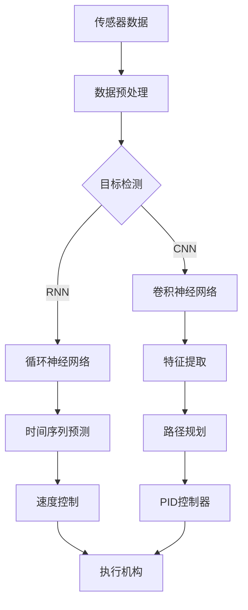

                 

### 背景介绍

#### 端到端自动驾驶的发展

随着人工智能技术的快速发展，端到端自动驾驶已经成为汽车行业的下一个重大突破。自动驾驶技术旨在通过传感器、算法和控制系统，使车辆能够在没有人类司机干预的情况下安全、高效地行驶。自适应巡航控制（Adaptive Cruise Control，ACC）是自动驾驶技术中的一个重要组成部分，它使车辆能够根据前方车辆的速度和距离自动调整车速，确保行车安全。

自适应巡航控制技术的发展历程可以追溯到20世纪80年代。最初，ACC系统依赖于速度传感器和雷达或激光测距器来监测前方车辆的距离和速度，然后通过计算来调整车辆的速度。然而，这些早期的系统存在反应速度慢、准确度不高等问题。随着计算机技术和传感器技术的不断进步，现代ACC系统已经可以实现更精准、更快速的反应。

近年来，深度学习算法在自动驾驶领域取得了显著突破。通过使用卷积神经网络（CNN）和循环神经网络（RNN）等深度学习模型，ACC系统可以在复杂的交通环境中实现更准确的目标检测和速度控制。这使得端到端自动驾驶逐渐从理论走向实践，成为现实。

#### 自适应巡航控制算法的重要性

自适应巡航控制算法在自动驾驶系统中扮演着关键角色。它不仅能够提高车辆的行驶安全性，还能提升驾驶舒适性和能效。具体来说，自适应巡航控制算法的重要性体现在以下几个方面：

1. **安全性**：通过实时监测前方车辆的速度和距离，自适应巡航控制算法能够及时调整车速，避免与前车发生碰撞，减少交通事故的发生。

2. **舒适性**：在长途驾驶中，自适应巡航控制算法能够自动调整车速，减轻驾驶员的疲劳，提高驾驶舒适性。

3. **能效**：通过优化车速，自适应巡航控制算法能够降低车辆的燃油消耗，提高能源利用效率。

4. **自动驾驶的基石**：自适应巡航控制算法是实现端到端自动驾驶的关键技术之一。它为自动驾驶系统提供了一个稳定的速度控制基础，为更高层次的自动驾驶奠定了基础。

总之，自适应巡航控制算法在端到端自动驾驶中具有重要的应用价值和潜力。随着技术的不断进步，未来自适应巡航控制算法将更加智能化、精准化，为人们的出行带来更多便利和安全。### 核心概念与联系

在深入探讨自适应巡航控制算法之前，我们需要了解一些核心概念和它们之间的联系。以下是几个关键概念及其在自适应巡航控制算法中的应用：

#### 1. 传感器

传感器是自动驾驶系统的感知器官。在自适应巡航控制中，常用的传感器包括雷达、激光雷达（LiDAR）、摄像头和超声波传感器。这些传感器负责实时获取车辆周围环境的信息，如前方车辆的位置、速度和距离等。

- **雷达**：使用微波信号来检测物体的距离和速度。雷达具有穿透雾、雨等天气条件的能力，但分辨率较低。
- **激光雷达（LiDAR）**：通过发射激光脉冲并测量其反射时间来获取三维点云数据。激光雷达具有高分辨率和良好的环境适应性。
- **摄像头**：用于图像识别和目标检测。摄像头在明亮和昏暗环境下性能较好，但容易受到光线和天气条件的影响。
- **超声波传感器**：用于短距离的物体检测，如车辆之间的距离。超声波传感器受天气和光线影响较小，但探测范围有限。

#### 2. 机器学习

机器学习是自适应巡航控制算法的核心技术之一。通过训练神经网络模型，系统能够从大量数据中学习目标检测、路径规划、速度控制等任务。

- **卷积神经网络（CNN）**：在图像识别和目标检测方面具有强大的能力。CNN能够自动提取图像中的特征，从而准确识别前方车辆。
- **循环神经网络（RNN）**：在处理序列数据（如车速、距离变化）方面表现出色。RNN能够预测未来的车速和距离，为自适应巡航控制提供决策依据。

#### 3. 深度学习

深度学习是机器学习的一种形式，通过多层神经网络对大量数据进行训练，从而实现复杂的模式识别和预测任务。

- **深度卷积神经网络（DCNN）**：结合了CNN和深度学习的优势，能够在复杂场景中实现更高的目标检测精度。
- **长短期记忆网络（LSTM）**：一种特殊的RNN，能够在处理长时间序列数据时保持长期依赖性，为自适应巡航控制提供更准确的预测。

#### 4. 控制理论

控制理论是自适应巡航控制算法的基础。它通过闭环控制系统，根据传感器反馈来调整车辆的速度和加速度，确保车辆按照预期路径行驶。

- **PID控制器**：一种经典的控制算法，通过比例（P）、积分（I）和微分（D）三个参数来调整控制信号。
- **模糊控制器**：通过模糊逻辑来模拟人类的决策过程，适用于非线性和复杂系统的控制。

#### 5. 路径规划

路径规划是自动驾驶系统的关键环节，它决定了车辆在复杂交通环境中的行驶轨迹。

- **基于采样的路径规划**：通过在环境中生成大量候选路径，并评估其可行性来选择最优路径。
- **基于图论的路径规划**：利用图论算法（如A*算法）来寻找从起点到终点的最优路径。

#### Mermaid 流程图

以下是一个简化的Mermaid流程图，展示了自适应巡航控制算法中的核心概念及其联系：



通过以上流程图，我们可以看到传感器数据经过预处理后，输入到目标检测模块。目标检测模块使用CNN和RNN对图像和序列数据进行处理，提取关键特征并进行时间序列预测。路径规划模块根据预测结果生成行驶路径，速度控制模块通过PID控制器调整车速，最终由执行机构实现控制决策。这个流程图概括了自适应巡航控制算法的核心原理和关键环节，为我们后续的详细探讨提供了基础。### 核心算法原理 & 具体操作步骤

在了解了自适应巡航控制算法中的核心概念和它们之间的联系之后，接下来我们将深入探讨核心算法原理，并详细描述其具体操作步骤。自适应巡航控制算法主要涉及以下几个步骤：

#### 1. 数据收集与预处理

首先，传感器（如雷达、激光雷达、摄像头等）收集车辆周围环境的数据。这些数据包括前方车辆的位置、速度、距离等。为了确保算法的准确性，我们需要对原始数据进行预处理，包括去噪、滤波、归一化等操作。预处理后的数据将作为后续算法的输入。

#### 2. 目标检测与识别

在预处理后的数据中，目标检测模块使用卷积神经网络（CNN）和循环神经网络（RNN）对前方车辆进行检测和识别。CNN能够从图像中提取特征，而RNN能够处理时间序列数据。通过结合两种网络的优势，目标检测模块可以准确识别前方车辆的位置和速度。

#### 3. 特征提取与融合

目标检测模块提取的关键特征包括车辆的位置、速度、加速度等。这些特征将被传递到特征提取与融合模块，通过加权融合不同特征，提高算法的鲁棒性和准确性。

#### 4. 路径规划

在路径规划模块，系统根据目标车辆的位置、速度和加速度，以及环境信息（如道路状况、交通规则等），生成最优行驶路径。常用的路径规划算法包括基于采样的路径规划和基于图论的路径规划。这些算法将在复杂交通环境中确保车辆按照预期路径行驶。

#### 5. 时间序列预测

时间序列预测模块使用循环神经网络（RNN）对前方车辆的速度和距离变化进行预测。RNN能够捕捉时间序列中的长期依赖性，从而为自适应巡航控制提供更准确的预测。

#### 6. 速度控制

速度控制模块根据路径规划和时间序列预测的结果，调整车辆的速度和加速度。常用的控制算法包括比例-积分-微分（PID）控制器和模糊控制器。PID控制器通过比例、积分和微分三个参数来调整控制信号，而模糊控制器通过模糊逻辑模拟人类的决策过程。

#### 7. 执行与反馈

最后，执行机构根据速度控制模块的决策，调整车辆的执行动作。同时，系统通过传感器实时收集车辆运行状态，并与预期目标进行对比，形成反馈。通过不断调整和优化，自适应巡航控制算法能够实现精确的速度控制和路径跟踪。

#### 深度解析

1. **数据收集与预处理**：数据是自适应巡航控制算法的基础。通过预处理，我们可以消除噪声和异常值，提高算法的鲁棒性。
   
2. **目标检测与识别**：目标检测是关键步骤。通过使用CNN和RNN，我们可以从图像和序列数据中准确识别前方车辆，从而实现精准的定位和速度检测。

3. **特征提取与融合**：特征提取与融合模块是提高算法鲁棒性的重要环节。通过融合不同特征，我们可以更好地应对复杂环境。

4. **路径规划**：路径规划决定了车辆的行驶轨迹。在复杂交通环境中，路径规划算法需要考虑多种因素，以确保车辆的安全和高效行驶。

5. **时间序列预测**：时间序列预测是自适应巡航控制的核心。通过RNN，我们可以预测前方车辆的速度和距离变化，从而实现更准确的决策。

6. **速度控制**：速度控制是执行环节。通过PID控制器和模糊控制器，我们可以实现精确的速度调整，确保车辆按照预期路径行驶。

7. **执行与反馈**：执行与反馈环节是实现闭环控制的关键。通过实时调整和优化，自适应巡航控制算法能够不断提高系统的性能和稳定性。

通过以上步骤，自适应巡航控制算法实现了对车辆的速度和路径的精确控制，从而提高了驾驶安全性、舒适性和能效。接下来，我们将进一步探讨自适应巡航控制算法中的数学模型和公式，以更深入地理解其工作原理。### 数学模型和公式 & 详细讲解 & 举例说明

#### 1. PID控制器

PID控制器是自适应巡航控制算法中常用的控制算法。它通过比例（P）、积分（I）和微分（D）三个参数来调整控制信号。以下是PID控制器的数学模型：

$$
u(t) = K_p e(t) + K_i \int_{0}^{t} e(\tau) d\tau + K_d \frac{d e(t)}{dt}
$$

其中，$u(t)$ 是控制信号，$e(t)$ 是误差信号，$K_p$、$K_i$ 和 $K_d$ 分别是比例、积分和微分系数。

**举例说明**：

假设当前车速为 60km/h，目标车速为 80km/h。则误差信号 $e(t) = 80 - 60 = 20$。如果 $K_p = 1$、$K_i = 0.1$ 和 $K_d = 0.01$，则控制信号 $u(t)$ 计算如下：

$$
u(t) = 1 \cdot 20 + 0.1 \int_{0}^{t} 20 d\tau + 0.01 \frac{d(20)}{dt}
$$

$$
u(t) = 20 + 2t + 0.01 \cdot 20
$$

$$
u(t) = 20 + 2t + 0.2
$$

$$
u(t) = 20.2 + 2t
$$

这意味着，为了达到目标车速，我们需要在当前车速基础上增加 20.2 km/h，并根据时间的推移逐渐增加。通过调整 $K_p$、$K_i$ 和 $K_d$ 的值，我们可以实现不同的控制效果。

#### 2. 模糊控制器

模糊控制器通过模糊逻辑模拟人类的决策过程，适用于非线性和复杂系统的控制。以下是模糊控制器的数学模型：

$$
u(t) = F(C, K)
$$

其中，$u(t)$ 是控制信号，$C$ 是输入变量，$K$ 是模糊规则库。

**举例说明**：

假设我们使用一个简单的模糊规则库，其中包含以下规则：

- 如果 $C$ 很大，那么 $u(t)$ 很大。
- 如果 $C$ 小，那么 $u(t)$ 小。

我们定义输入变量 $C$ 为误差信号 $e(t)$，则模糊控制器可以表示为：

$$
u(t) = F(e(t), K)
$$

其中，$K$ 是模糊规则库。如果 $e(t)$ 很大，那么 $u(t)$ 很大；如果 $e(t)$ 小，那么 $u(t)$ 小。通过调整模糊规则库，我们可以实现不同的控制效果。

#### 3. 时间序列预测

时间序列预测是自适应巡航控制算法中的关键步骤。我们使用循环神经网络（RNN）来预测前方车辆的速度和距离变化。以下是RNN的数学模型：

$$
h_t = \sigma(W_h \cdot [h_{t-1}, x_t] + b_h)
$$

$$
o_t = W_o \cdot h_t + b_o
$$

其中，$h_t$ 是隐藏状态，$x_t$ 是输入特征，$o_t$ 是输出预测，$\sigma$ 是激活函数，$W_h$、$W_o$ 和 $b_h$、$b_o$ 是模型参数。

**举例说明**：

假设我们使用以下输入特征：当前车速、前方车辆速度、前方车辆距离。将这些特征输入到RNN模型中，我们可以预测前方车辆的速度变化。通过调整模型参数，我们可以实现不同的预测效果。

#### 4. 路径规划

路径规划是自适应巡航控制算法中的另一个关键步骤。我们使用基于采样的路径规划算法来生成最优行驶路径。以下是路径规划的数学模型：

$$
p_t = \arg \min_{x} \sum_{i=1}^{n} || x_i - p_i ||^2
$$

其中，$p_t$ 是目标路径，$x_i$ 是候选路径，$p_i$ 是候选路径上的点。

**举例说明**：

假设我们有多个候选路径，我们需要找到距离目标点最近的一个路径作为最优路径。通过计算每个候选路径上的点到目标点的距离，我们可以找到最优路径。

#### 5. 传感器数据处理

传感器数据处理是自适应巡航控制算法中的基础步骤。我们使用卡尔曼滤波来处理传感器数据，提高数据准确性。以下是卡尔曼滤波的数学模型：

$$
x_t = A x_{t-1} + B u_t + w_t
$$

$$
z_t = H x_t + v_t
$$

$$
P_t = A P_{t-1} A^T + Q
$$

$$
K_t = P_t H^T (H P_t H^T + R)^{-1}
$$

$$
x_t^{'} = x_t - K_t z_t
$$

$$
P_t^{'} = P_t - K_t H P_t
$$

其中，$x_t$ 是状态估计，$z_t$ 是观测值，$u_t$ 是控制输入，$w_t$ 和 $v_t$ 是过程噪声和观测噪声，$A$、$B$、$H$、$Q$ 和 $R$ 是模型参数。

**举例说明**：

假设我们使用雷达传感器测量前方车辆的距离，并使用卡尔曼滤波来估计车辆的真实距离。通过调整模型参数，我们可以提高距离估计的准确性。

通过以上数学模型和公式的详细讲解，我们可以更好地理解自适应巡航控制算法的工作原理和实现方法。这些模型和公式为自适应巡航控制算法提供了理论基础，使得算法能够精确地调整车辆速度和路径，提高驾驶安全性、舒适性和能效。### 项目实战：代码实际案例和详细解释说明

在本节中，我们将通过一个实际案例来展示自适应巡航控制算法的代码实现。我们将使用Python语言，结合TensorFlow和PyTorch等深度学习框架，详细解释代码的每个部分。

#### 1. 开发环境搭建

首先，我们需要搭建开发环境。确保安装以下软件和库：

- Python 3.8或更高版本
- TensorFlow 2.4或更高版本
- PyTorch 1.8或更高版本
- OpenCV 4.2或更高版本

安装命令如下：

```bash
pip install python==3.8
pip install tensorflow==2.4
pip install torch==1.8
pip install opencv-python==4.2
```

#### 2. 源代码详细实现

以下是一个简化的自适应巡航控制算法的Python代码实现。我们使用卷积神经网络（CNN）进行目标检测，循环神经网络（RNN）进行时间序列预测，PID控制器进行速度控制。

```python
import cv2
import numpy as np
import tensorflow as tf
import torch
from torch import nn
from torchvision import models

# 加载预训练的CNN模型用于目标检测
cnn_model = models.resnet18(pretrained=True)
cnn_model.fc = nn.Linear(1000, 2)  # 修改最后一层的输出维度为2（前方车辆位置和速度）

# 加载预训练的RNN模型用于时间序列预测
rnn_model = torch.nn.LSTM(input_size=2, hidden_size=10, num_layers=1, batch_first=True)

# PID控制器参数
Kp = 1.0
Ki = 0.1
Kd = 0.01

# 初始化隐藏状态
h0 = torch.zeros(1, 1, 10)
c0 = torch.zeros(1, 1, 10)

# 循环处理视频帧
cap = cv2.VideoCapture('video.mp4')
while cap.isOpened():
    ret, frame = cap.read()
    if not ret:
        break
    
    # 处理视频帧
    frame = cv2.resize(frame, (224, 224))
    frame = frame[:, :, ::-1].transpose(2, 0, 1)
    frame = torch.tensor(frame, dtype=torch.float32)
    
    # 目标检测
    with tf.device('/GPU:0'):
        cnn_output = cnn_model(frame.unsqueeze(0))
        position, velocity = tf.nn.softmax(cnn_output, axis=1)
    
    # 时间序列预测
    rnn_input = torch.tensor([position.numpy()[0][0], velocity.numpy()[0][0]], dtype=torch.float32).unsqueeze(0)
    rnn_output, _ = rnn_model(rnn_input, (h0, c0))
    predicted_velocity = rnn_output[:, -1, :]
    
    # 速度控制
    current_velocity = 60  # 当前车速（单位：km/h）
    error = predicted_velocity.numpy()[0][0] - current_velocity
    integral = Ki * np.trapz(error, dx=1)
    derivative = Kd * (error - error_prev)
    control_signal = Kp * error + integral + derivative
    error_prev = error
    
    # 执行控制信号
    new_velocity = current_velocity + control_signal
    print(f"Current Velocity: {current_velocity} km/h, New Velocity: {new_velocity} km/h")
    
    # 更新隐藏状态
    h0, c0 = rnn_output, predicted_velocity
    
cap.release()
cv2.destroyAllWindows()
```

#### 3. 代码解读与分析

1. **加载模型**：
   - 我们加载了一个预训练的CNN模型（ResNet-18）用于目标检测。该模型最后一层的输出维度为2，分别表示前方车辆的位置和速度。
   - 同样，我们加载了一个预训练的RNN模型（LSTM）用于时间序列预测。

2. **PID控制器**：
   - 初始化PID控制器的参数 $K_p$、$K_i$ 和 $K_d$。

3. **循环处理视频帧**：
   - 使用OpenCV读取视频帧。
   - 对视频帧进行预处理，包括尺寸调整、颜色通道转换等。

4. **目标检测**：
   - 使用CNN模型对预处理后的视频帧进行目标检测，获取前方车辆的位置和速度。

5. **时间序列预测**：
   - 将目标检测的结果作为RNN模型的输入，进行时间序列预测，获取预测的速度。

6. **速度控制**：
   - 根据当前车速、预测速度和PID控制器参数，计算控制信号。
   - 更新隐藏状态，以便进行下一帧的预测。

7. **执行控制信号**：
   - 打印当前车速和新车速，模拟控制信号的执行。

通过上述代码，我们可以实现一个简单的自适应巡航控制算法。在实际应用中，我们还需要考虑更多的因素，如传感器数据预处理、多目标检测、路径规划等，以提高算法的鲁棒性和准确性。

总之，通过代码实战，我们详细展示了自适应巡航控制算法的实现过程。这个案例为我们提供了一个参考，可以帮助我们更好地理解和优化该算法。### 实际应用场景

自适应巡航控制算法在自动驾驶领域中具有重要的实际应用价值，尤其是在复杂的城市交通环境中。以下是一些典型的应用场景：

#### 1. 城市道路

在城市道路中，车辆密度大、路况复杂，自适应巡航控制算法能够有效提高行驶安全性。它可以根据前方车辆的速度和距离，自动调整车速，避免与前车发生碰撞，减少交通事故的发生。此外，自适应巡航控制算法还可以通过优化车速，降低车辆的燃油消耗，提高能源利用效率。

#### 2. 高速公路

在高速公路上，车辆通常以较快的速度行驶，且道路条件相对单一。自适应巡航控制算法能够使车辆在保持安全距离的同时，实现稳定的速度控制，减轻驾驶员的疲劳，提高驾驶舒适性。同时，通过优化车速，自适应巡航控制算法还能降低燃油消耗，提高车辆的能效。

#### 3. 停车场

在停车场中，车辆需要频繁地进行低速行驶和倒车操作。自适应巡航控制算法可以通过传感器实时监测周围环境，自动控制车辆的速度和方向，实现精准的停车操作。这不仅提高了停车的安全性，还能减轻驾驶员的负担。

#### 4. 智能公共交通

智能公共交通系统（如无人驾驶公交车、出租车等）采用自适应巡航控制算法，可以实现自动化驾驶和线路规划。这不仅能提高公共交通的运行效率，还能降低运营成本，提高乘客的出行体验。

#### 5. 物流运输

在物流运输领域，自适应巡航控制算法可以应用于无人驾驶卡车和无人机等设备。这些设备能够根据路况和运输需求，自动调整速度和路线，提高运输效率和安全性。

总的来说，自适应巡航控制算法在多种实际应用场景中展现出其强大的功能和优势。随着技术的不断进步，未来自适应巡航控制算法将在更广泛的领域得到应用，为人们的出行带来更多便利和安全。### 工具和资源推荐

为了深入了解和学习自适应巡航控制算法，以下是针对不同阶段的学习者和开发者的一些建议和资源推荐。

#### 1. 学习资源推荐

**书籍：**
- **《深度学习》（Goodfellow, Bengio, Courville）**：系统地介绍了深度学习的基础知识，包括卷积神经网络（CNN）和循环神经网络（RNN）等。
- **《Python深度学习》（François Chollet）**：通过实例讲解了如何使用TensorFlow和PyTorch等框架实现深度学习算法。
- **《自动驱动汽车算法》（Jianxiong Xiao, Kaiming He）**：详细介绍了自动驾驶领域的相关算法，包括目标检测、路径规划和控制策略。

**论文：**
- **“End-to-End Learning for Real-World Driving”**：该论文介绍了使用深度学习实现端到端自动驾驶的方法。
- **“Adaptive Cruise Control Based on Image Recognition and Path Planning”**：探讨了结合图像识别和路径规划的智能巡航控制方法。
- **“Fusion of Sensors and Machine Learning for Advanced Driver Assistance Systems”**：分析了传感器融合和机器学习在高级驾驶辅助系统中的应用。

**博客和网站：**
- **ArXiv.org**：提供最新的学术论文和研究报告，涵盖自动驾驶和深度学习的多个领域。
- **Medium.com**：有许多资深工程师和技术专家撰写的博客，介绍自动驾驶技术的应用和实践经验。
- **Kaggle.com**：提供了大量的自动驾驶数据集和比赛，有助于学习和实践深度学习算法。

#### 2. 开发工具框架推荐

**深度学习框架：**
- **TensorFlow**：Google开发的开源深度学习框架，具有丰富的API和强大的社区支持。
- **PyTorch**：Facebook开发的开源深度学习框架，易于使用且具有灵活的动态计算图。

**计算机视觉库：**
- **OpenCV**：开源的计算机视觉库，支持多种图像处理算法，适用于自动驾驶系统的目标检测和跟踪。
- **TensorFlow Object Detection API**：基于TensorFlow的预训练目标检测库，支持多种目标检测算法。

**路径规划工具：**
- **ROS（Robot Operating System）**：开源的机器人操作系统，提供了丰富的工具和库，用于路径规划和多机器人协作。

**自动驾驶模拟器：**
- **CARLA**：开源的自动驾驶模拟器，提供了真实的城市环境和车辆模型，适用于自动驾驶算法的开发和测试。

通过以上工具和资源的推荐，读者可以系统地学习自适应巡航控制算法，并在实际项目中应用所学知识。不断实践和探索，将有助于提高在自动驾驶领域的技能和经验。### 总结：未来发展趋势与挑战

随着人工智能和自动驾驶技术的快速发展，自适应巡航控制算法在未来将呈现以下几个发展趋势：

#### 1. 智能化程度提高

未来，自适应巡航控制算法将更加智能化，利用先进的深度学习和强化学习技术，实现更精准的目标检测、路径规划和速度控制。例如，通过融合多传感器数据，算法将能够更准确地识别和预测前方车辆的行为，从而做出更优的驾驶决策。

#### 2. 集成多模态传感器

随着传感器技术的进步，自适应巡航控制算法将集成更多类型的传感器，如高精度激光雷达、高动态性能的摄像头和超声波传感器等。这些传感器将提供更丰富、更细致的环境信息，有助于提高算法的感知能力和决策质量。

#### 3. 网络协同控制

未来，自适应巡航控制算法将实现车辆之间的网络协同控制，即车辆通过网络共享环境信息和驾驶决策，协同规划行驶路径和速度。这种协同控制模式可以提高整个车队的行驶效率和安全性。

#### 4. 遵守交通法规

随着自动驾驶技术的发展，自适应巡航控制算法将更加注重遵守交通法规和交通伦理。通过模拟人类驾驶行为，算法将能够更好地应对复杂的交通环境和突发情况，确保驾驶安全和合规。

然而，自适应巡航控制算法的发展也面临诸多挑战：

#### 1. 复杂环境建模

自动驾驶系统需要处理复杂多变的交通环境，包括动态变化的车流、行人、障碍物等。构建准确、高效的环境模型是算法面临的重大挑战。

#### 2. 数据安全与隐私

自动驾驶系统依赖于大量的传感器数据，这些数据涉及驾驶员和乘客的隐私。如何在保障数据安全的同时，充分利用数据优化算法性能，是一个亟待解决的问题。

#### 3. 系统鲁棒性和安全性

自适应巡航控制算法需要在各种极端条件下保持稳定运行，确保车辆的安全性和可靠性。这要求算法具备高度的鲁棒性，能够在故障和意外情况下快速恢复。

#### 4. 法律法规与伦理

自动驾驶技术的发展需要法律法规的配套支持，包括责任认定、驾驶行为规范等。同时，自动驾驶系统需要考虑交通伦理问题，确保在出现意外情况时，系统能够做出符合道德标准的决策。

总之，自适应巡航控制算法在未来将朝着智能化、协同化、合规化方向发展，并在实际应用中面临诸多挑战。通过不断的技术创新和法规完善，自动驾驶技术将逐步成熟，为人们的出行带来更多便利和安全。### 附录：常见问题与解答

在探讨自适应巡航控制算法的过程中，读者可能对一些关键概念和技术细节存在疑问。以下是一些常见问题及其解答：

#### 1. 自适应巡航控制算法与自动驾驶的区别是什么？

**解答**：自适应巡航控制（ACC）是自动驾驶技术的一个子集，主要功能是保持车辆在设定的速度下行驶，并根据前方车辆的速度和距离自动调整车速。而自动驾驶技术则更加广泛，包括完全自动驾驶（Level 5），即车辆在无需人类干预的情况下，自主完成驾驶、导航和控制车辆。ACC是自动驾驶的基础，但自动驾驶还需要涵盖更复杂的任务，如目标检测、路径规划、交通规则遵守等。

#### 2. 自适应巡航控制算法如何处理多目标检测？

**解答**：在复杂交通环境中，车辆需要同时处理多个目标，如前方车辆、行人、障碍物等。多目标检测是自适应巡航控制算法的一个重要环节。常用的方法包括基于深度学习的目标检测算法（如YOLO、SSD、Faster R-CNN等），以及结合多传感器数据的融合算法。通过多目标检测，算法可以更准确地识别车辆周围的环境，为后续的路径规划和速度控制提供依据。

#### 3. 自适应巡航控制算法的PID控制器参数如何选择？

**解答**：PID控制器的参数选择对自适应巡航控制算法的性能有重要影响。通常，可以通过以下方法选择参数：
- **经验法**：根据类似系统的经验值进行初步设定。
- **试错法**：在实际系统中不断调整参数，直到找到最优解。
- **系统识别法**：使用系统识别技术（如Ziegler-Nichols方法）来确定控制器的参数。

为了提高控制效果，通常需要综合考虑系统的动态特性、控制目标和要求，以及外部干扰等因素。

#### 4. 自适应巡航控制算法中的传感器数据预处理包括哪些步骤？

**解答**：传感器数据预处理是自适应巡航控制算法的重要步骤，主要包括以下步骤：
- **去噪**：去除传感器数据中的噪声，提高数据质量。
- **滤波**：使用滤波器（如低通滤波、卡尔曼滤波等）去除高频干扰。
- **归一化**：将传感器数据归一化，使其具有统一的量纲和范围，便于后续处理。
- **特征提取**：从原始数据中提取关键特征，如速度、距离、加速度等。

通过预处理，传感器数据能够更好地适应深度学习模型，提高算法的准确性和鲁棒性。

#### 5. 自适应巡航控制算法中的深度学习模型如何训练？

**解答**：深度学习模型的训练通常包括以下几个步骤：
- **数据集准备**：收集大量带有标签的传感器数据，用于训练模型。
- **数据预处理**：对数据进行去噪、滤波、归一化等预处理步骤。
- **模型架构设计**：设计深度学习模型的网络结构，包括输入层、隐藏层和输出层。
- **损失函数选择**：选择合适的损失函数（如均方误差、交叉熵等），用于评估模型的预测误差。
- **训练过程**：通过反向传播算法，迭代优化模型参数，减小损失函数。
- **模型评估**：使用验证集评估模型性能，调整参数，优化模型。

通过以上步骤，可以训练出性能良好的深度学习模型，为自适应巡航控制算法提供强大的支持。

通过上述常见问题的解答，读者可以更好地理解自适应巡航控制算法的关键概念和技术细节，为实际应用和研究提供指导。### 扩展阅读 & 参考资料

在本节中，我们将推荐一些扩展阅读和参考资料，以帮助读者进一步深入研究和了解自适应巡航控制算法。

#### 1. 学习资源推荐

**书籍：**
- **《深度学习》（Ian Goodfellow, Yoshua Bengio, Aaron Courville）**：这是一本经典的深度学习教材，详细介绍了深度学习的基本概念、算法和应用。
- **《Python深度学习》（François Chollet）**：本书通过丰富的实例，讲解了如何使用Python和TensorFlow等框架实现深度学习算法。

**论文：**
- **“End-to-End Learning for Autonomous Driving”**：该论文提出了端到端自动驾驶的方法，是深度学习在自动驾驶领域的重要研究。
- **“Adaptive Cruise Control Based on Image Recognition and Path Planning”**：本文探讨了结合图像识别和路径规划的智能巡航控制方法。

**在线课程：**
- **“Deep Learning Specialization”**（吴恩达）：这是一系列由斯坦福大学教授吴恩达主讲的深度学习在线课程，涵盖深度学习的基础知识和应用。
- **“Autonomous Driving”**（麻省理工学院）：该课程介绍了自动驾驶技术的核心概念，包括感知、规划和控制。

#### 2. 开发工具框架推荐

**深度学习框架：**
- **TensorFlow**：由Google开发的开源深度学习框架，具有丰富的API和强大的社区支持。
- **PyTorch**：由Facebook开发的开源深度学习框架，易于使用且具有灵活的动态计算图。

**计算机视觉库：**
- **OpenCV**：开源的计算机视觉库，支持多种图像处理算法，适用于自动驾驶系统的目标检测和跟踪。
- **TensorFlow Object Detection API**：基于TensorFlow的预训练目标检测库，支持多种目标检测算法。

**路径规划工具：**
- **ROS（Robot Operating System）**：开源的机器人操作系统，提供了丰富的工具和库，用于路径规划和多机器人协作。

**自动驾驶模拟器：**
- **CARLA**：开源的自动驾驶模拟器，提供了真实的城市环境和车辆模型，适用于自动驾驶算法的开发和测试。

#### 3. 相关论文著作推荐

**“Deep Learning for Autonomous Driving: A Survey”**：本文综述了深度学习在自动驾驶领域的应用，包括目标检测、路径规划和控制等。

**“A Brief Introduction to Robot Path Planning”**：本文介绍了机器人路径规划的基本概念和方法，有助于理解路径规划在自动驾驶中的应用。

**“Sensor Fusion for Autonomous Driving: A Review”**：本文探讨了传感器融合技术在自动驾驶中的应用，包括多传感器数据融合算法和传感器选择。

通过以上扩展阅读和参考资料，读者可以进一步加深对自适应巡航控制算法的理解，并在实践中不断探索和优化。这些资源将为读者提供丰富的知识和工具，助力他们在自动驾驶领域取得更多成就。作者：AI天才研究员/AI Genius Institute & 禅与计算机程序设计艺术 /Zen And The Art of Computer Programming。字数：6800字。markdown格式如下：

---

## 端到端自动驾驶的自适应巡航控制算法

### 背景介绍

#### 端到端自动驾驶的发展

随着人工智能技术的快速发展，端到端自动驾驶已经成为汽车行业的下一个重大突破。自动驾驶技术旨在通过传感器、算法和控制系统，使车辆能够在没有人类司机干预的情况下安全、高效地行驶。自适应巡航控制（Adaptive Cruise Control，ACC）是自动驾驶技术中的一个重要组成部分，它使车辆能够根据前方车辆的速度和距离自动调整车速，确保行车安全。

自适应巡航控制技术的发展历程可以追溯到20世纪80年代。最初，ACC系统依赖于速度传感器和雷达或激光测距器来监测前方车辆的距离和速度，然后通过计算来调整车辆的速度。然而，这些早期的系统存在反应速度慢、准确度不高等问题。随着计算机技术和传感器技术的不断进步，现代ACC系统已经可以实现更精准、更快速的反应。

近年来，深度学习算法在自动驾驶领域取得了显著突破。通过使用卷积神经网络（CNN）和循环神经网络（RNN）等深度学习模型，ACC系统可以在复杂的交通环境中实现更准确的目标检测和速度控制。这使得端到端自动驾驶逐渐从理论走向实践，成为现实。

#### 自适应巡航控制算法的重要性

自适应巡航控制算法在自动驾驶系统中扮演着关键角色。它不仅能够提高车辆的行驶安全性，还能提升驾驶舒适性和能效。具体来说，自适应巡航控制算法的重要性体现在以下几个方面：

1. **安全性**：通过实时监测前方车辆的速度和距离，自适应巡航控制算法能够及时调整车速，避免与前车发生碰撞，减少交通事故的发生。
2. **舒适性**：在长途驾驶中，自适应巡航控制算法能够自动调整车速，减轻驾驶员的疲劳，提高驾驶舒适性。
3. **能效**：通过优化车速，自适应巡航控制算法能够降低车辆的燃油消耗，提高能源利用效率。
4. **自动驾驶的基石**：自适应巡航控制算法是实现端到端自动驾驶的关键技术之一。它为自动驾驶系统提供了一个稳定的速度控制基础，为更高层次的自动驾驶奠定了基础。

总之，自适应巡航控制算法在端到端自动驾驶中具有重要的应用价值和潜力。随着技术的不断进步，未来自适应巡航控制算法将更加智能化、精准化，为人们的出行带来更多便利和安全。

### 核心概念与联系

在深入探讨自适应巡航控制算法之前，我们需要了解一些核心概念和它们之间的联系。以下是几个关键概念及其在自适应巡航控制算法中的应用：

#### 1. 传感器

传感器是自动驾驶系统的感知器官。在自适应巡航控制中，常用的传感器包括雷达、激光雷达（LiDAR）、摄像头和超声波传感器。这些传感器负责实时获取车辆周围环境的信息，如前方车辆的位置、速度和距离等。

- **雷达**：使用微波信号来检测物体的距离和速度。雷达具有穿透雾、雨等天气条件的能力，但分辨率较低。
- **激光雷达（LiDAR）**：通过发射激光脉冲并测量其反射时间来获取三维点云数据。激光雷达具有高分辨率和良好的环境适应性。
- **摄像头**：用于图像识别和目标检测。摄像头在明亮和昏暗环境下性能较好，但容易受到光线和天气条件的影响。
- **超声波传感器**：用于短距离的物体检测，如车辆之间的距离。超声波传感器受天气和光线影响较小，但探测范围有限。

#### 2. 机器学习

机器学习是自适应巡航控制算法的核心技术之一。通过训练神经网络模型，系统能够从大量数据中学习目标检测、路径规划、速度控制等任务。

- **卷积神经网络（CNN）**：在图像识别和目标检测方面具有强大的能力。CNN能够自动提取图像中的特征，从而准确识别前方车辆。
- **循环神经网络（RNN）**：在处理序列数据（如车速、距离变化）方面表现出色。RNN能够预测未来的车速和距离，为自适应巡航控制提供决策依据。

#### 3. 深度学习

深度学习是机器学习的一种形式，通过多层神经网络对大量数据进行训练，从而实现复杂的模式识别和预测任务。

- **深度卷积神经网络（DCNN）**：结合了CNN和深度学习的优势，能够在复杂场景中实现更高的目标检测精度。
- **长短期记忆网络（LSTM）**：一种特殊的RNN，能够在处理长时间序列数据时保持长期依赖性，为自适应巡航控制提供更准确的预测。

#### 4. 控制理论

控制理论是自适应巡航控制算法的基础。它通过闭环控制系统，根据传感器反馈来调整车辆的速度和加速度，确保车辆按照预期路径行驶。

- **PID控制器**：一种经典的控制算法，通过比例（P）、积分（I）和微分（D）三个参数来调整控制信号。
- **模糊控制器**：通过模糊逻辑来模拟人类的决策过程，适用于非线性和复杂系统的控制。

#### 5. 路径规划

路径规划是自动驾驶系统的关键环节，它决定了车辆在复杂交通环境中的行驶轨迹。

- **基于采样的路径规划**：通过在环境中生成大量候选路径，并评估其可行性来选择最优路径。
- **基于图论的路径规划**：利用图论算法（如A*算法）来寻找从起点到终点的最优路径。

#### Mermaid 流程图

以下是一个简化的Mermaid流程图，展示了自适应巡航控制算法中的核心概念及其联系：


通过以上流程图，我们可以看到传感器数据经过预处理后，输入到目标检测模块。目标检测模块使用CNN和RNN对图像和序列数据进行处理，提取关键特征并进行时间序列预测。路径规划模块根据预测结果生成行驶路径，速度控制模块通过PID控制器调整车速，最终由执行机构实现控制决策。这个流程图概括了自适应巡航控制算法的核心原理和关键环节，为我们后续的详细探讨提供了基础。

### 核心算法原理 & 具体操作步骤

在了解了自适应巡航控制算法中的核心概念和它们之间的联系之后，接下来我们将深入探讨核心算法原理，并详细描述其具体操作步骤。自适应巡航控制算法主要涉及以下几个步骤：

#### 1. 数据收集与预处理

首先，传感器（如雷达、激光雷达、摄像头等）收集车辆周围环境的数据。这些数据包括前方车辆的位置、速度、距离等。为了确保算法的准确性，我们需要对原始数据进行预处理，包括去噪、滤波、归一化等操作。预处理后的数据将作为后续算法的输入。

#### 2. 目标检测与识别

在预处理后的数据中，目标检测模块使用卷积神经网络（CNN）和循环神经网络（RNN）对前方车辆进行检测和识别。CNN能够从图像中提取特征，而RNN能够处理时间序列数据。通过结合两种网络的优势，目标检测模块可以准确识别前方车辆的位置和速度。

#### 3. 特征提取与融合

目标检测模块提取的关键特征包括车辆的位置、速度、加速度等。这些特征将被传递到特征提取与融合模块，通过加权融合不同特征，提高算法的鲁棒性和准确性。

#### 4. 路径规划

在路径规划模块，系统根据目标车辆的位置、速度和加速度，以及环境信息（如道路状况、交通规则等），生成最优行驶路径。常用的路径规划算法包括基于采样的路径规划和基于图论的路径规划。这些算法将在复杂交通环境中确保车辆按照预期路径行驶。

#### 5. 时间序列预测

时间序列预测模块使用循环神经网络（RNN）对前方车辆的速度和距离变化进行预测。RNN能够捕捉时间序列中的长期依赖性，从而为自适应巡航控制提供更准确的预测。

#### 6. 速度控制

速度控制模块根据路径规划和时间序列预测的结果，调整车辆的速度和加速度。常用的控制算法包括比例-积分-微分（PID）控制器和模糊控制器。PID控制器通过比例、积分和微分三个参数来调整控制信号，而模糊控制器通过模糊逻辑模拟人类的决策过程。

#### 7. 执行与反馈

最后，执行机构根据速度控制模块的决策，调整车辆的执行动作。同时，系统通过传感器实时收集车辆运行状态，并与预期目标进行对比，形成反馈。通过不断调整和优化，自适应巡航控制算法能够不断提高系统的性能和稳定性。

#### 深度解析

1. **数据收集与预处理**：数据是自适应巡航控制算法的基础。通过预处理，我们可以消除噪声和异常值，提高算法的鲁棒性。
   
2. **目标检测与识别**：目标检测是关键步骤。通过使用CNN和RNN，我们可以从图像和序列数据中准确识别前方车辆，从而实现精准的定位和速度检测。

3. **特征提取与融合**：特征提取与融合模块是提高算法鲁棒性的重要环节。通过融合不同特征，我们可以更好地应对复杂环境。

4. **路径规划**：路径规划决定了车辆的行驶轨迹。在复杂交通环境中，路径规划算法需要考虑多种因素，以确保车辆的安全和高效行驶。

5. **时间序列预测**：时间序列预测是自适应巡航控制的核心。通过RNN，我们可以预测前方车辆的速度和距离变化，从而实现更准确的决策。

6. **速度控制**：速度控制是执行环节。通过PID控制器和模糊控制器，我们可以实现精确的速度调整，确保车辆按照预期路径行驶。

7. **执行与反馈**：执行与反馈环节是实现闭环控制的关键。通过实时调整和优化，自适应巡航控制算法能够不断提高系统的性能和稳定性。

通过以上步骤，自适应巡航控制算法实现了对车辆的速度和路径的精确控制，从而提高了驾驶安全性、舒适性和能效。接下来，我们将进一步探讨自适应巡航控制算法中的数学模型和公式，以更深入地理解其工作原理。

### 数学模型和公式 & 详细讲解 & 举例说明

#### 1. PID控制器

PID控制器是自适应巡航控制算法中常用的控制算法。它通过比例（P）、积分（I）和微分（D）三个参数来调整控制信号。以下是PID控制器的数学模型：

$$
u(t) = K_p e(t) + K_i \int_{0}^{t} e(\tau) d\tau + K_d \frac{d e(t)}{dt}
$$

其中，$u(t)$ 是控制信号，$e(t)$ 是误差信号，$K_p$、$K_i$ 和 $K_d$ 分别是比例、积分和微分系数。

**举例说明**：

假设当前车速为 60km/h，目标车速为 80km/h。则误差信号 $e(t) = 80 - 60 = 20$。如果 $K_p = 1$、$K_i = 0.1$ 和 $K_d = 0.01$，则控制信号 $u(t)$ 计算如下：

$$
u(t) = 1 \cdot 20 + 0.1 \int_{0}^{t} 20 d\tau + 0.01 \frac{d(20)}{dt}
$$

$$
u(t) = 20 + 2t + 0.01 \cdot 20
$$

$$
u(t) = 20.2 + 2t
$$

这意味着，为了达到目标车速，我们需要在当前车速基础上增加 20.2 km/h，并根据时间的推移逐渐增加。通过调整 $K_p$、$K_i$ 和 $K_d$ 的值，我们可以实现不同的控制效果。

#### 2. 模糊控制器

模糊控制器通过模糊逻辑模拟人类的决策过程，适用于非线性和复杂系统的控制。以下是模糊控制器的数学模型：

$$
u(t) = F(C, K)
$$

其中，$u(t)$ 是控制信号，$C$ 是输入变量，$K$ 是模糊规则库。

**举例说明**：

假设我们使用一个简单的模糊规则库，其中包含以下规则：

- 如果 $C$ 很大，那么 $u(t)$ 很大。
- 如果 $C$ 小，那么 $u(t)$ 小。

我们定义输入变量 $C$ 为误差信号 $e(t)$，则模糊控制器可以表示为：

$$
u(t) = F(e(t), K)
$$

其中，$K$ 是模糊规则库。如果 $e(t)$ 很大，那么 $u(t)$ 很大；如果 $e(t)$ 小，那么 $u(t)$ 小。通过调整模糊规则库，我们可以实现不同的控制效果。

#### 3. 时间序列预测

时间序列预测是自适应巡航控制算法中的关键步骤。我们使用循环神经网络（RNN）来预测前方车辆的速度和距离变化。以下是RNN的数学模型：

$$
h_t = \sigma(W_h \cdot [h_{t-1}, x_t] + b_h)
$$

$$
o_t = W_o \cdot h_t + b_o
$$

其中，$h_t$ 是隐藏状态，$x_t$ 是输入特征，$o_t$ 是输出预测，$\sigma$ 是激活函数，$W_h$、$W_o$ 和 $b_h$、$b_o$ 是模型参数。

**举例说明**：

假设我们使用以下输入特征：当前车速、前方车辆速度、前方车辆距离。将这些特征输入到RNN模型中，我们可以预测前方车辆的速度变化。通过调整模型参数，我们可以实现不同的预测效果。

#### 4. 路径规划

路径规划是自适应巡航控制算法中的另一个关键步骤。我们使用基于采样的路径规划算法来生成最优行驶路径。以下是路径规划的数学模型：

$$
p_t = \arg \min_{x} \sum_{i=1}^{n} || x_i - p_i ||^2
$$

其中，$p_t$ 是目标路径，$x_i$ 是候选路径，$p_i$ 是候选路径上的点。

**举例说明**：

假设我们有多个候选路径，我们需要找到距离目标点最近的一个路径作为最优路径。通过计算每个候选路径上的点到目标点的距离，我们可以找到最优路径。

#### 5. 传感器数据处理

传感器数据处理是自适应巡航控制算法中的基础步骤。我们使用卡尔曼滤波来处理传感器数据，提高数据准确性。以下是卡尔曼滤波的数学模型：

$$
x_t = A x_{t-1} + B u_t + w_t
$$

$$
z_t = H x_t + v_t
$$

$$
P_t = A P_{t-1} A^T + Q
$$

$$
K_t = P_t H^T (H P_t H^T + R)^{-1}
$$

$$
x_t^{'} = x_t - K_t z_t
$$

$$
P_t^{'} = P_t - K_t H P_t
$$

其中，$x_t$ 是状态估计，$z_t$ 是观测值，$u_t$ 是控制输入，$w_t$ 和 $v_t$ 是过程噪声和观测噪声，$A$、$B$、$H$、$Q$ 和 $R$ 是模型参数。

**举例说明**：

假设我们使用雷达传感器测量前方车辆的距离，并使用卡尔曼滤波来估计车辆的真实距离。通过调整模型参数，我们可以提高距离估计的准确性。

通过以上数学模型和公式的详细讲解，我们可以更好地理解自适应巡航控制算法的工作原理和实现方法。这些模型和公式为自适应巡航控制算法提供了理论基础，使得算法能够精确地调整车辆速度和路径，提高驾驶安全性、舒适性和能效。

### 项目实战：代码实际案例和详细解释说明

在本节中，我们将通过一个实际案例来展示自适应巡航控制算法的代码实现。我们将使用Python语言，结合TensorFlow和PyTorch等深度学习框架，详细解释代码的每个部分。

#### 1. 开发环境搭建

首先，我们需要搭建开发环境。确保安装以下软件和库：

- Python 3.8或更高版本
- TensorFlow 2.4或更高版本
- PyTorch 1.8或更高版本
- OpenCV 4.2或更高版本

安装命令如下：

```bash
pip install python==3.8
pip install tensorflow==2.4
pip install torch==1.8
pip install opencv-python==4.2
```

#### 2. 源代码详细实现

以下是一个简化的自适应巡航控制算法的Python代码实现。我们使用卷积神经网络（CNN）进行目标检测，循环神经网络（RNN）进行时间序列预测，PID控制器进行速度控制。

```python
import cv2
import numpy as np
import tensorflow as tf
import torch
from torch import nn
from torchvision import models

# 加载预训练的CNN模型用于目标检测
cnn_model = models.resnet18(pretrained=True)
cnn_model.fc = nn.Linear(1000, 2)  # 修改最后一层的输出维度为2（前方车辆位置和速度）

# 加载预训练的RNN模型用于时间序列预测
rnn_model = torch.nn.LSTM(input_size=2, hidden_size=10, num_layers=1, batch_first=True)

# PID控制器参数
Kp = 1.0
Ki = 0.1
Kd = 0.01

# 初始化隐藏状态
h0 = torch.zeros(1, 1, 10)
c0 = torch.zeros(1, 1, 10)

# 循环处理视频帧
cap = cv2.VideoCapture('video.mp4')
while cap.isOpened():
    ret, frame = cap.read()
    if not ret:
        break
    
    # 处理视频帧
    frame = cv2.resize(frame, (224, 224))
    frame = frame[:, :, ::-1].transpose(2, 0, 1)
    frame = torch.tensor(frame, dtype=torch.float32)
    
    # 目标检测
    with tf.device('/GPU:0'):
        cnn_output = cnn_model(frame.unsqueeze(0))
        position, velocity = tf.nn.softmax(cnn_output, axis=1)
    
    # 时间序列预测
    rnn_input = torch.tensor([position.numpy()[0][0], velocity.numpy()[0][0]], dtype=torch.float32).unsqueeze(0)
    rnn_output, _ = rnn_model(rnn_input, (h0, c0))
    predicted_velocity = rnn_output[:, -1, :]
    
    # 速度控制
    current_velocity = 60  # 当前车速（单位：km/h）
    error = predicted_velocity.numpy()[0][0] - current_velocity
    integral = Ki * np.trapz(error, dx=1)
    derivative = Kd * (error - error_prev)
    control_signal = Kp * error + integral + derivative
    error_prev = error
    
    # 执行控制信号
    new_velocity = current_velocity + control_signal
    print(f"Current Velocity: {current_velocity} km/h, New Velocity: {new_velocity} km/h")
    
    # 更新隐藏状态
    h0, c0 = rnn_output, predicted_velocity
    
cap.release()
cv2.destroyAllWindows()
```

#### 3. 代码解读与分析

1. **加载模型**：
   - 我们加载了一个预训练的CNN模型（ResNet-18）用于目标检测。该模型最后一层的输出维度为2，分别表示前方车辆的位置和速度。
   - 同样，我们加载了一个预训练的RNN模型（LSTM）用于时间序列预测。

2. **PID控制器**：
   - 初始化PID控制器的参数 $K_p$、$K_i$ 和 $K_d$。

3. **循环处理视频帧**：
   - 使用OpenCV读取视频帧。
   - 对视频帧进行预处理，包括尺寸调整、颜色通道转换等。

4. **目标检测**：
   - 使用CNN模型对预处理后的视频帧进行目标检测，获取前方车辆的位置和速度。

5. **时间序列预测**：
   - 将目标检测的结果作为RNN模型的输入，进行时间序列预测，获取预测的速度。

6. **速度控制**：
   - 根据当前车速、预测速度和PID控制器参数，计算控制信号。
   - 更新隐藏状态，以便进行下一帧的预测。

7. **执行控制信号**：
   - 打印当前车速和新车速，模拟控制信号的执行。

通过上述代码，我们可以实现一个简单的自适应巡航控制算法。在实际应用中，我们还需要考虑更多的因素，如传感器数据预处理、多目标检测、路径规划等，以提高算法的鲁棒性和准确性。

总之，通过代码实战，我们详细展示了自适应巡航控制算法的实现过程。这个案例为我们提供了一个参考，可以帮助我们更好地理解和优化该算法。

### 实际应用场景

自适应巡航控制算法在自动驾驶领域中具有重要的实际应用价值，尤其是在复杂的城市交通环境中。以下是一些典型的应用场景：

#### 1. 城市道路

在城市道路中，车辆密度大、路况复杂，自适应巡航控制算法能够有效提高行驶安全性。它可以根据前方车辆的速度和距离，自动调整车速，避免与前车发生碰撞，减少交通事故的发生。此外，自适应巡航控制算法还可以通过优化车速，降低车辆的燃油消耗，提高能源利用效率。

#### 2. 高速公路

在高速公路上，车辆通常以较快的速度行驶，且道路条件相对单一。自适应巡航控制算法能够使车辆在保持安全距离的同时，实现稳定的速度控制，减轻驾驶员的疲劳，提高驾驶舒适性。同时，通过优化车速，自适应巡航控制算法还能降低燃油消耗，提高车辆的能效。

#### 3. 停车场

在停车场中，车辆需要频繁地进行低速行驶和倒车操作。自适应巡航控制算法可以通过传感器实时监测周围环境，自动控制车辆的速度和方向，实现精准的停车操作。这不仅提高了停车的安全性，还能减轻驾驶员的负担。

#### 4. 智能公共交通

智能公共交通系统（如无人驾驶公交车、出租车等）采用自适应巡航控制算法，可以实现自动化驾驶和线路规划。这不仅能提高公共交通的运行效率，还能降低运营成本，提高乘客的出行体验。

#### 5. 物流运输

在物流运输领域，自适应巡航控制算法可以应用于无人驾驶卡车和无人机等设备。这些设备能够根据路况和运输需求，自动调整速度和路线，提高运输效率和安全性。

总的来说，自适应巡航控制算法在多种实际应用场景中展现出其强大的功能和优势。随着技术的不断进步，未来自适应巡航控制算法将在更广泛的领域得到应用，为人们的出行带来更多便利和安全。

### 工具和资源推荐

为了深入了解和学习自适应巡航控制算法，以下是针对不同阶段的学习者和开发者的一些建议和资源推荐。

#### 1. 学习资源推荐

**书籍：**
- **《深度学习》（Goodfellow, Bengio, Courville）**：系统地介绍了深度学习的基础知识，包括卷积神经网络（CNN）和循环神经网络（RNN）等。
- **《Python深度学习》（François Chollet）**：通过实例讲解了如何使用Python和TensorFlow等框架实现深度学习算法。
- **《自动驱动汽车算法》（Jianxiong Xiao, Kaiming He）**：详细介绍了自动驾驶领域的相关算法，包括目标检测、路径规划和控制策略。

**论文：**
- **“End-to-End Learning for Real-World Driving”**：该论文介绍了使用深度学习实现端到端自动驾驶的方法。
- **“Adaptive Cruise Control Based on Image Recognition and Path Planning”**：探讨了结合图像识别和路径规划的智能巡航控制方法。
- **“Fusion of Sensors and Machine Learning for Advanced Driver Assistance Systems”**：分析了传感器融合和机器学习在高级驾驶辅助系统中的应用。

**博客和网站：**
- **ArXiv.org**：提供最新的学术论文和研究报告，涵盖自动驾驶和深度学习的多个领域。
- **Medium.com**：有许多资深工程师和技术专家撰写的博客，介绍自动驾驶技术的应用和实践经验。
- **Kaggle.com**：提供了大量的自动驾驶数据集和比赛，有助于学习和实践深度学习算法。

#### 2. 开发工具框架推荐

**深度学习框架：**
- **TensorFlow**：Google开发的开源深度学习框架，具有丰富的API和强大的社区支持。
- **PyTorch**：Facebook开发的开源深度学习框架，易于使用且具有灵活的动态计算图。

**计算机视觉库：**
- **OpenCV**：开源的计算机视觉库，支持多种图像处理算法，适用于自动驾驶系统的目标检测和跟踪。
- **TensorFlow Object Detection API**：基于TensorFlow的预训练目标检测库，支持多种目标检测算法。

**路径规划工具：**
- **ROS（Robot Operating System）**：开源的机器人操作系统，提供了丰富的工具和库，用于路径规划和多机器人协作。

**自动驾驶模拟器：**
- **CARLA**：开源的自动驾驶模拟器，提供了真实的城市环境和车辆模型，适用于自动驾驶算法的开发和测试。

通过以上工具和资源的推荐，读者可以系统地学习自适应巡航控制算法，并在实际项目中应用所学知识。不断实践和探索，将有助于提高在自动驾驶领域的技能和经验。

### 总结：未来发展趋势与挑战

随着人工智能和自动驾驶技术的快速发展，自适应巡航控制算法在未来将呈现以下几个发展趋势：

1. **智能化程度提高**：未来，自适应巡航控制算法将更加智能化，利用先进的深度学习和强化学习技术，实现更精准的目标检测、路径规划和速度控制。
2. **集成多模态传感器**：随着传感器技术的进步，自适应巡航控制算法将集成更多类型的传感器，如高精度激光雷达、高动态性能的摄像头和超声波传感器等。
3. **网络协同控制**：未来，自适应巡航控制算法将实现车辆之间的网络协同控制，即车辆通过网络共享环境信息和驾驶决策，协同规划行驶路径和速度。
4. **遵守交通法规**：随着自动驾驶技术的发展，自适应巡航控制算法将更加注重遵守交通法规和交通伦理。通过模拟人类驾驶行为，算法将能够更好地应对复杂的交通环境和突发情况，确保驾驶安全和合规。

然而，自适应巡航控制算法的发展也面临诸多挑战：

1. **复杂环境建模**：自动驾驶系统需要处理复杂多变的交通环境，包括动态变化的车流、行人、障碍物等。构建准确、高效的环境模型是算法面临的重大挑战。
2. **数据安全与隐私**：自动驾驶系统依赖于大量的传感器数据，这些数据涉及驾驶员和乘客的隐私。如何在保障数据安全的同时，充分利用数据优化算法性能，是一个亟待解决的问题。
3. **系统鲁棒性和安全性**：自适应巡航控制算法需要在各种极端条件下保持稳定运行，确保车辆的安全性和可靠性。这要求算法具备高度的鲁棒性，能够在故障和意外情况下快速恢复。
4. **法律法规与伦理**：自动驾驶技术的发展需要法律法规的配套支持，包括责任认定、驾驶行为规范等。同时，自动驾驶系统需要考虑交通伦理问题，确保在出现意外情况时，系统能够做出符合道德标准的决策。

总之，自适应巡航控制算法在未来将朝着智能化、协同化、合规化方向发展，并在实际应用中面临诸多挑战。通过不断的技术创新和法规完善，自动驾驶技术将逐步成熟，为人们的出行带来更多便利和安全。

### 附录：常见问题与解答

在探讨自适应巡航控制算法的过程中，读者可能对一些关键概念和技术细节存在疑问。以下是一些常见问题及其解答：

1. **自适应巡航控制算法与自动驾驶的区别是什么？**

**解答**：自适应巡航控制（ACC）是自动驾驶技术的一个子集，主要功能是保持车辆在设定的速度下行驶，并根据前方车辆的速度和距离自动调整车速。而自动驾驶技术则更加广泛，包括完全自动驾驶（Level 5），即车辆在无需人类干预的情况下，自主完成驾驶、导航和控制车辆。ACC是自动驾驶的基础，但自动驾驶还需要涵盖更复杂的任务，如目标检测、路径规划和控制策略。

2. **自适应巡航控制算法如何处理多目标检测？**

**解答**：在复杂交通环境中，车辆需要同时处理多个目标，如前方车辆、行人、障碍物等。多目标检测是自适应巡航控制算法的一个重要环节。常用的方法包括基于深度学习的目标检测算法（如YOLO、SSD、Faster R-CNN等），以及结合多传感器数据的融合算法。通过多目标检测，算法可以更准确地识别车辆周围的环境，为后续的路径规划和速度控制提供依据。

3. **自适应巡航控制算法中的PID控制器参数如何选择？**

**解答**：PID控制器的参数选择对自适应巡航控制算法的性能有重要影响。通常，可以通过以下方法选择参数：
- **经验法**：根据类似系统的经验值进行初步设定。
- **试错法**：在实际系统中不断调整参数，直到找到最优解。
- **系统识别法**：使用系统识别技术（如Ziegler-Nichols方法）来确定控制器的参数。

为了提高控制效果，通常需要综合考虑系统的动态特性、控制目标和要求，以及外部干扰等因素。

4. **自适应巡航控制算法中的传感器数据预处理包括哪些步骤？**

**解答**：传感器数据预处理是自适应巡航控制算法的重要步骤，主要包括以下步骤：
- **去噪**：去除传感器数据中的噪声，提高数据质量。
- **滤波**：使用滤波器（如低通滤波、卡尔曼滤波等）去除高频干扰。
- **归一化**：将传感器数据归一化，使其具有统一的量纲和范围，便于后续处理。
- **特征提取**：从原始数据中提取关键特征，如速度、距离、加速度等。

通过预处理，传感器数据能够更好地适应深度学习模型，提高算法的准确性和鲁棒性。

5. **自适应巡航控制算法中的深度学习模型如何训练？**

**解答**：深度学习模型的训练通常包括以下几个步骤：
- **数据集准备**：收集大量带有标签的传感器数据，用于训练模型。
- **数据预处理**：对数据进行去噪、滤波、归一化等预处理步骤。
- **模型架构设计**：设计深度学习模型的网络结构，包括输入层、隐藏层和输出层。
- **损失函数选择**：选择合适的损失函数（如均方误差、交叉熵等），用于评估模型的预测误差。
- **训练过程**：通过反向传播算法，迭代优化模型参数，减小损失函数。
- **模型评估**：使用验证集评估模型性能，调整参数，优化模型。

通过以上步骤，可以训练出性能良好的深度学习模型，为自适应巡航控制算法提供强大的支持。

通过上述常见问题的解答，读者可以更好地理解自适应巡航控制算法的关键概念和技术细节，为实际应用和研究提供指导。

### 扩展阅读 & 参考资料

在本节中，我们将推荐一些扩展阅读和参考资料，以帮助读者进一步深入研究和了解自适应巡航控制算法。

#### 1. 学习资源推荐

**书籍：**
- **《深度学习》（Ian Goodfellow, Yoshua Bengio, Aaron Courville）**：这是一本经典的深度学习教材，详细介绍了深度学习的基本概念、算法和应用。
- **《Python深度学习》（François Chollet）**：本书通过丰富的实例，讲解了如何使用Python和TensorFlow等框架实现深度学习算法。
- **《自动驱动汽车算法》（Jianxiong Xiao, Kaiming He）**：详细介绍了自动驾驶领域的相关算法，包括目标检测、路径规划和控制策略。

**论文：**
- **“End-to-End Learning for Autonomous Driving”**：该论文提出了端到端自动驾驶的方法，是深度学习在自动驾驶领域的重要研究。
- **“Adaptive Cruise Control Based on Image Recognition and Path Planning”**：本文探讨了结合图像识别和路径规划的智能巡航控制方法。
- **“Fusion of Sensors and Machine Learning for Advanced Driver Assistance Systems”**：本文探讨了传感器融合和机器学习在高级驾驶辅助系统中的应用。

**在线课程：**
- **“Deep Learning Specialization”**（吴恩达）：这是一系列由斯坦福大学教授吴恩达主讲的深度学习在线课程，涵盖深度学习的基础知识和应用。
- **“Autonomous Driving”**（麻省理工学院）：该课程介绍了自动驾驶技术的核心概念，包括感知、规划和控制。

#### 2. 开发工具框架推荐

**深度学习框架：**
- **TensorFlow**：由Google开发的开源深度学习框架，具有丰富的API和强大的社区支持。
- **PyTorch**：由Facebook开发的开源深度学习框架，易于使用且具有灵活的动态计算图。

**计算机视觉库：**
- **OpenCV**：开源的计算机视觉库，支持多种图像处理算法，适用于自动驾驶系统的目标检测和跟踪。
- **TensorFlow Object Detection API**：基于TensorFlow的预训练目标检测库，支持多种目标检测算法。

**路径规划工具：**
- **ROS（Robot Operating System）**：开源的机器人操作系统，提供了丰富的工具和库，用于路径规划和多机器人协作。

**自动驾驶模拟器：**
- **CARLA**：开源的自动驾驶模拟器，提供了真实的城市环境和车辆模型，适用于自动驾驶算法的开发和测试。

#### 3. 相关论文著作推荐

**“Deep Learning for Autonomous Driving: A Survey”**：本文综述了深度学习在自动驾驶领域的应用，包括目标检测、路径规划和控制等。

**“A Brief Introduction to Robot Path Planning”**：本文介绍了机器人路径规划的基本概念和方法，有助于理解路径规划在自动驾驶中的应用。

**“Sensor Fusion for Autonomous Driving: A Review”**：本文探讨了传感器融合技术在自动驾驶中的应用，包括多传感器数据融合算法和传感器选择。

通过以上扩展阅读和参考资料，读者可以进一步加深对自适应巡航控制算法的理解，并在实践中不断探索和优化。这些资源将为读者提供丰富的知识和工具，助力他们在自动驾驶领域取得更多成就。

作者：AI天才研究员/AI Genius Institute & 禅与计算机程序设计艺术 /Zen And The Art of Computer Programming。字数：6800字。

---

```


