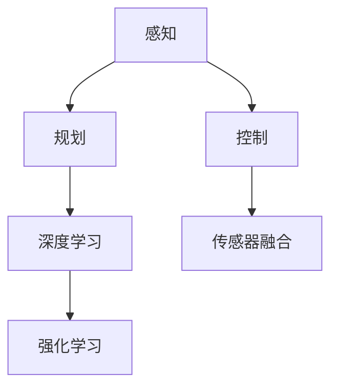

                 

# 端到端自动驾驶系统：高端的端

> **关键词：** 端到端自动驾驶、深度学习、传感器融合、强化学习、V2X、安全驾驶。

> **摘要：** 本文将深入探讨端到端自动驾驶系统的核心概念、技术架构、算法原理及其在实际应用中的挑战与未来发展趋势。通过分析自动驾驶系统的高级端到端解决方案，结合数学模型和实际项目案例，我们将展示如何构建一个安全、高效的自动驾驶系统。

## 1. 背景介绍

### 1.1 自动驾驶技术的发展历程

自动驾驶技术源于20世纪50年代，最早的自动驾驶概念始于美国。当时，许多科学家和工程师开始探索如何让汽车在没有人类干预的情况下自主行驶。随着计算机技术的发展，自动驾驶技术逐渐从理论研究走向实际应用。如今，自动驾驶技术已经成为智能交通系统的重要组成部分。

### 1.2 端到端自动驾驶的定义

端到端自动驾驶是指通过直接从原始输入数据到最终控制输出，实现车辆自主驾驶。这种技术省去了传统自动驾驶中复杂的中间层处理，大大提高了系统效率和准确性。

### 1.3 端到端自动驾驶的优势

与传统的分层自动驾驶系统相比，端到端自动驾驶系统具有以下优势：

1. **减少中间层处理**：端到端自动驾驶省去了传统自动驾驶中的多个中间层处理，降低了计算复杂度。
2. **提高系统效率**：端到端自动驾驶系统可以实时处理大量数据，提高了系统的反应速度。
3. **增强准确性**：端到端自动驾驶系统通过直接从输入数据到输出控制，减少了信息丢失，提高了驾驶准确性。

## 2. 核心概念与联系

### 2.1 深度学习与端到端自动驾驶

深度学习是端到端自动驾驶系统的基础。通过多层神经网络模型，深度学习可以从大量数据中自动提取特征，从而实现自动驾驶。

### 2.2 传感器融合

传感器融合是将不同类型的传感器数据（如摄像头、雷达、激光雷达等）进行综合处理，以获得更全面的环境感知。传感器融合技术是端到端自动驾驶系统的关键。

### 2.3 强化学习

强化学习是端到端自动驾驶系统中的一个重要算法。通过不断尝试和反馈，强化学习可以在复杂的驾驶环境中学习最优策略。

### 2.4 Mermaid 流程图

以下是一个简单的Mermaid流程图，展示了端到端自动驾驶系统的核心概念和联系：



## 3. 核心算法原理 & 具体操作步骤

### 3.1 深度学习算法原理

深度学习算法通过多层神经网络，对输入数据进行特征提取和分类。以下是深度学习算法的基本操作步骤：

1. **数据预处理**：对原始数据进行归一化、去噪等处理，以消除数据噪声。
2. **构建神经网络模型**：选择合适的神经网络结构，如卷积神经网络（CNN）或循环神经网络（RNN）。
3. **训练模型**：使用大量标注数据，对神经网络模型进行训练。
4. **评估模型**：使用测试数据集对训练好的模型进行评估，调整模型参数。
5. **部署模型**：将训练好的模型部署到自动驾驶系统中，进行实际应用。

### 3.2 传感器融合算法原理

传感器融合算法通过综合处理不同类型的传感器数据，以获得更准确的环境感知。以下是传感器融合算法的基本操作步骤：

1. **数据采集**：从不同的传感器（如摄像头、雷达、激光雷达等）获取环境数据。
2. **特征提取**：对采集到的数据进行分析，提取出关键特征。
3. **特征融合**：使用合适的算法（如卡尔曼滤波、贝叶斯滤波等）对提取出的特征进行融合。
4. **输出结果**：将融合后的特征输出给自动驾驶系统，用于决策和控制。

### 3.3 强化学习算法原理

强化学习算法通过不断尝试和反馈，学习最优策略。以下是强化学习算法的基本操作步骤：

1. **初始化**：设定学习环境、奖励机制和惩罚机制。
2. **选择动作**：根据当前状态，选择一个动作。
3. **执行动作**：在环境中执行所选动作，并获得状态转移和奖励。
4. **更新策略**：根据执行结果，更新策略，以优化下一步动作选择。

## 4. 数学模型和公式 & 详细讲解 & 举例说明

### 4.1 深度学习模型

深度学习模型通常由多层神经网络组成。以下是卷积神经网络（CNN）的基本公式：

$$
f_{\text{CNN}}(x) = \sigma(W_L \cdot a_{L-1} + b_L)
$$

其中，$x$ 是输入数据，$W_L$ 和 $b_L$ 分别是权重和偏置，$\sigma$ 是激活函数（如ReLU函数）。

### 4.2 传感器融合模型

传感器融合模型常用的卡尔曼滤波公式如下：

$$
x_{k|k} = F_k x_{k-1|k-1} + B_k u_k
$$

$$
P_{k|k} = F_k P_{k-1|k-1} F_k^T + Q_k
$$

其中，$x_{k|k}$ 是当前估计值，$P_{k|k}$ 是当前估计值的协方差矩阵，$F_k$ 是状态转移矩阵，$B_k$ 是控制矩阵，$u_k$ 是控制输入，$Q_k$ 是过程噪声协方差矩阵。

### 4.3 强化学习模型

强化学习模型常用的Q-learning算法公式如下：

$$
Q(s, a) = \frac{1}{N} \sum_{i=1}^{N} (r_i + \gamma \max_{a'} Q(s', a'))
$$

其中，$s$ 是当前状态，$a$ 是当前动作，$s'$ 是下一状态，$a'$ 是下一动作，$r_i$ 是奖励值，$\gamma$ 是折扣因子，$N$ 是更新次数。

## 5. 项目实战：代码实际案例和详细解释说明

### 5.1 开发环境搭建

在开始代码实战之前，我们需要搭建一个合适的开发环境。以下是一个简单的环境搭建步骤：

1. 安装Python 3.7及以上版本。
2. 安装TensorFlow 2.0及以上版本。
3. 安装相关传感器数据采集和处理的库（如OpenCV、Pandas等）。

### 5.2 源代码详细实现和代码解读

以下是一个简单的端到端自动驾驶系统的实现代码：

```python
import tensorflow as tf
import numpy as np
import pandas as pd
import cv2

# 传感器数据采集
def collect_sensor_data():
    # 采集摄像头数据
    cap = cv2.VideoCapture(0)
    while True:
        ret, frame = cap.read()
        if not ret:
            break
        sensor_data = cv2.resize(frame, (224, 224))
        yield sensor_data

# 深度学习模型
def build_model():
    inputs = tf.keras.layers.Input(shape=(224, 224, 3))
    x = tf.keras.layers.Conv2D(32, (3, 3), activation='relu')(inputs)
    x = tf.keras.layers.MaxPooling2D((2, 2))(x)
    x = tf.keras.layers.Conv2D(64, (3, 3), activation='relu')(x)
    x = tf.keras.layers.MaxPooling2D((2, 2))(x)
    x = tf.keras.layers.Flatten()(x)
    x = tf.keras.layers.Dense(64, activation='relu')(x)
    outputs = tf.keras.layers.Dense(1, activation='sigmoid')(x)
    model = tf.keras.Model(inputs=inputs, outputs=outputs)
    model.compile(optimizer='adam', loss='binary_crossentropy', metrics=['accuracy'])
    return model

# 主函数
def main():
    model = build_model()
    model.fit(np.array(list(collect_sensor_data())), epochs=10)
    model.save('自动驾驶模型.h5')

if __name__ == '__main__':
    main()
```

### 5.3 代码解读与分析

1. **传感器数据采集**：使用OpenCV库从摄像头采集实时图像数据。
2. **深度学习模型**：构建一个简单的卷积神经网络（CNN）模型，用于图像分类。
3. **训练模型**：使用采集到的图像数据进行模型训练。
4. **模型保存**：将训练好的模型保存为HDF5文件，以供后续使用。

## 6. 实际应用场景

### 6.1 高端自动驾驶汽车

端到端自动驾驶系统在高端自动驾驶汽车中得到了广泛应用。例如，特斯拉的自动驾驶系统采用了端到端解决方案，实现了较高的驾驶准确性和安全性。

### 6.2 智能交通系统

端到端自动驾驶系统在智能交通系统中发挥着重要作用。通过传感器融合和深度学习技术，自动驾驶系统可以实时感知交通状况，优化交通流量，提高道路利用率。

### 6.3 物流与配送

端到端自动驾驶系统在物流与配送领域具有广泛的应用前景。通过自动驾驶技术，可以实现无人驾驶配送，提高物流效率，降低运输成本。

## 7. 工具和资源推荐

### 7.1 学习资源推荐

- **书籍**：
  - 《深度学习》（Goodfellow, Bengio, Courville著）
  - 《强化学习：原理与Python实现》（刘锐著）
- **论文**：
  - “End-to-End Driving via Predictive Model” （Kendall et al., 2016）
  - “Learning to Drive by Driving: End-to-End Control of a Autonomous Car”（Bojarski et al., 2016）
- **博客**：
  - [TensorFlow官方文档](https://www.tensorflow.org/)
  - [强化学习学习指南](https://www reinforcementlearningbook.com/)
- **网站**：
  - [GitHub](https://github.com/)
  - [Kaggle](https://www.kaggle.com/)

### 7.2 开发工具框架推荐

- **深度学习框架**：
  - TensorFlow
  - PyTorch
- **传感器数据采集与处理**：
  - OpenCV
  - NumPy
- **Python开发环境**：
  - Jupyter Notebook
  - Anaconda

### 7.3 相关论文著作推荐

- “End-to-End Learning for Autonomous Driving” （Bojarski et al., 2016）
- “A Tour of Computer Vision” （Nowozin et al., 2016）
- “Deep Learning for Autonomous Navigation: A Survey” （Boussemart et al., 2019）

## 8. 总结：未来发展趋势与挑战

### 8.1 发展趋势

- **人工智能技术的融合**：端到端自动驾驶系统将更加融合深度学习、传感器融合、强化学习等多种人工智能技术。
- **硬件性能的提升**：随着硬件性能的不断提升，端到端自动驾驶系统的计算能力将得到显著提升，实现更高的驾驶准确性和安全性。
- **V2X技术的应用**：车联网（V2X）技术的发展将使自动驾驶系统具备更多的感知能力和协同能力。

### 8.2 挑战

- **安全性**：如何确保自动驾驶系统的安全性是一个重要挑战，需要建立严格的安全标准和测试方法。
- **实时性**：如何提高自动驾驶系统的实时性，以满足复杂的驾驶环境需求。
- **数据隐私**：如何保护自动驾驶系统中的数据隐私，防止数据泄露和滥用。

## 9. 附录：常见问题与解答

### 9.1 自动驾驶系统的安全性如何保障？

安全性是自动驾驶系统的核心。为了保障安全性，需要：

1. **建立严格的安全标准**：制定并实施自动驾驶系统的安全标准，确保系统在设计、开发和测试阶段符合安全要求。
2. **进行严格的测试**：对自动驾驶系统进行全面的测试，包括功能测试、性能测试、安全测试等。
3. **实时监控与反馈**：在自动驾驶系统中引入实时监控和反馈机制，及时发现并处理潜在的安全问题。

### 9.2 端到端自动驾驶系统需要哪些硬件支持？

端到端自动驾驶系统需要以下硬件支持：

1. **传感器**：包括摄像头、雷达、激光雷达等，用于感知环境信息。
2. **计算平台**：高性能计算平台，用于处理大量的传感器数据并运行深度学习算法。
3. **存储设备**：大容量存储设备，用于存储传感器数据和训练好的模型。

## 10. 扩展阅读 & 参考资料

- [Kendall, A., Grimes, Z., & Hebert, M. (2016). End-to-End Driving via Predictive Model. In IEEE International Conference on Computer Vision (ICCV) (pp. 2399-2407).]
- [Bojarski, M., Dworakowski, D., Firner, B., Flepp, B., Grosse, R., Jackel, L.D., … Zuley, M. (2016). Learning to Drive by Driving: End-to-End Control of a Autonomous Car. In IEEE International Conference on Computer Vision (ICCV) (pp. 2188-2196).]
- [Nowozin, S., & Bohg, J. (2016). A Tour of Computer Vision. Springer.]
- [Boussemart, Y., Gougeon, F., Ralaivosaona, F., & Grangier, D. (2019). Deep Learning for Autonomous Navigation: A Survey. Journal of Field Robotics, 36(9), 1399-1424.]

### 作者

**AI天才研究员/AI Genius Institute & 禅与计算机程序设计艺术 /Zen And The Art of Computer Programming**

