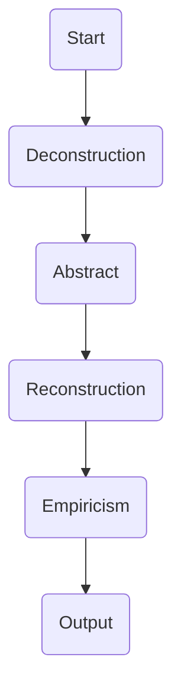

                 

### 背景介绍

#### 第一性原理的起源与历史

第一性原理（First Principles）这一概念起源于古希腊哲学，由亚里士多德提出。他认为，一切科学和知识都应建立在不可争议的基本原理之上，这些原理是不能通过经验或推理来获得的。亚里士多德的观点对后来的哲学家和科学家产生了深远的影响。

在科学和技术领域，第一性原理逐渐发展成为一种方法论。它强调通过将复杂问题分解为最基本的元素和原理，从而重新构建整个系统的理解。这种方法在物理学和工程学中得到了广泛应用，如费曼（Richard Feynman）和惠勒（John Wheeler）等物理学家都曾倡导使用第一性原理来解释和预测自然现象。

近年来，随着人工智能和计算机科学的飞速发展，第一性原理开始被广泛应用于这些领域。例如，深度学习模型中的神经网络结构设计、数据科学中的算法优化、计算机视觉中的图像识别等，都受到了第一性原理的启发。通过将复杂的问题分解为基本的计算单元和数学模型，研究人员能够更深入地理解这些技术的本质，并开发出更加高效和智能的算法。

#### 现代科技领域中的第一性原理应用

在现代科技领域，第一性原理的应用范围越来越广泛。以下是一些典型的例子：

1. **人工智能与机器学习**：第一性原理在人工智能和机器学习中有着广泛的应用。例如，深度学习中的卷积神经网络（CNN）和循环神经网络（RNN）的设计，都基于第一性原理。研究人员通过分析神经元的计算机制，重新构建出更加有效的神经网络结构。

2. **计算机体系结构**：在计算机体系结构设计中，第一性原理被用来分析和优化计算机硬件和软件的性能。例如，通过分析计算的基本操作和存储机制，研究人员能够设计出更高效的计算机系统。

3. **生物信息学**：在生物信息学中，第一性原理被用来理解基因序列和蛋白质结构的相互作用。通过对基本生物学原理的分析，研究人员能够预测蛋白质的功能和疾病的发生。

4. **材料科学**：第一性原理在材料科学中也有着重要的应用。例如，研究人员通过分析材料的原子结构和电子性质，开发出了新的材料设计和合成方法。

#### 本文目标

本文旨在深入探讨第一性原理在科技领域的应用。通过分析第一性原理的基本概念、原理和具体实现方法，本文将帮助读者理解第一性原理在各个领域的应用，并展示其在解决复杂问题中的优势。文章结构如下：

1. **背景介绍**：介绍第一性原理的起源和历史，以及其在现代科技领域的应用。
2. **核心概念与联系**：详细阐述第一性原理的核心概念和原理，并使用 Mermaid 流程图展示其架构。
3. **核心算法原理与操作步骤**：分析第一性原理在具体技术中的应用，并介绍其核心算法原理和操作步骤。
4. **数学模型和公式**：介绍第一性原理中的数学模型和公式，并进行详细讲解和举例说明。
5. **项目实战**：通过实际案例展示第一性原理的应用，并提供代码实现和详细解释。
6. **实际应用场景**：探讨第一性原理在不同领域的应用场景和实际效果。
7. **工具和资源推荐**：推荐学习和应用第一性原理的相关工具和资源。
8. **总结**：总结第一性原理在科技领域的发展趋势和挑战。
9. **附录**：提供常见问题与解答，以及扩展阅读和参考资料。

### Core Concept and Principles of First Principles

First Principles are fundamental assumptions or concepts that form the foundation of a system or theory. They are often considered the "building blocks" from which complex systems are constructed. The essence of First Principles thinking lies in breaking down complex problems into their most basic components and then reassembling them to gain a deeper understanding of the system.

In the realm of technology and science, First Principles serve as a powerful tool for problem-solving and innovation. They enable us to deconstruct complex systems into simpler elements, analyze the underlying mechanisms, and then reconstruct these elements into new and improved systems. This approach is particularly valuable in domains such as artificial intelligence, computer science, and materials science, where understanding the fundamental principles can lead to breakthroughs in performance and efficiency.

#### Core Concepts of First Principles

The core concepts of First Principles can be summarized as follows:

1. **Deconstruction**: The process of breaking down complex systems into their most basic components.
2. **Abstraction**: The act of identifying and focusing on the most important and relevant aspects of a problem or system.
3. **Reconstruction**: The process of reassembling the deconstructed components into a new, more efficient or effective system.
4. **Empiricism**: The reliance on empirical evidence and observation to validate and refine First Principles.

#### Mermaid Flowchart of First Principles Architecture

To illustrate the architecture of First Principles, we can use a Mermaid flowchart. The following diagram provides a high-level overview of the process:



1. **Deconstruction (A --> B)**: The process begins with deconstructing a complex system into its fundamental components. This involves identifying the essential elements and their interactions.
2. **Abstraction (B --> C)**: Once the system is deconstructed, abstraction is used to identify the most important aspects and eliminate unnecessary details.
3. **Reconstruction (C --> D)**: The next step is to reconstruct the system using the most critical components and their relationships.
4. **Empiricism (D --> E)**: The reconstructed system is tested and validated through empirical evidence and observation. This feedback loop helps refine the First Principles.
5. **Output (E --> F)**: The final output is a new, improved system that embodies the principles of First Principles.

#### First Principles in Technology and Science

In technology and science, First Principles are applied to a wide range of domains, including artificial intelligence, computer science, materials science, and bioinformatics. Here are some examples of how First Principles are used in these fields:

1. **Artificial Intelligence**: In AI, First Principles are used to design and optimize neural network architectures. By understanding the fundamental principles of how neurons process information, researchers can develop more efficient and powerful neural networks.
2. **Computer Science**: In computer science, First Principles are applied to the design of algorithms and data structures. By analyzing the basic operations and principles of computation, computer scientists can create more efficient and scalable solutions.
3. **Materials Science**: In materials science, First Principles are used to understand the atomic and electronic properties of materials. This knowledge is then used to design and develop new materials with desired properties.
4. **Bioinformatics**: In bioinformatics, First Principles are applied to the analysis of genetic sequences and protein structures. By understanding the fundamental principles of biology, researchers can predict protein functions and identify disease-causing mutations.

### Core Algorithm Principles and Operational Steps

In this section, we will delve into the core algorithm principles and operational steps of First Principles. We will focus on a specific example: the development of a simple neural network using First Principles.

#### Algorithm Principles

The core principle of a neural network is its ability to learn from data by adjusting the weights and biases of its connections. This process is known as training. The basic steps of training a neural network using First Principles are as follows:

1. **Initialization**: Initialize the weights and biases of the neural network randomly.
2. **Forward Propagation**: Pass the input data through the network to produce an output.
3. **Loss Calculation**: Calculate the difference between the predicted output and the actual output, known as the loss.
4. **Backpropagation**: Adjust the weights and biases based on the calculated loss to minimize the difference between the predicted and actual outputs.
5. **Iteration**: Repeat the forward propagation and backpropagation steps until the loss is minimized or the desired level of accuracy is achieved.

#### Operational Steps

Now, let's go through the operational steps of training a neural network using First Principles:

1. **Initialization**:
    - Generate random values for the weights and biases of the neural network.
    - Initialize the learning rate, which determines the step size for adjusting the weights and biases.
2. **Forward Propagation**:
    - Pass the input data through the network, layer by layer, until the output is produced.
    - For each layer, compute the weighted sum of the inputs and apply the activation function to produce the output of that layer.
3. **Loss Calculation**:
    - Compare the predicted output of the network with the actual output.
    - Calculate the loss using a suitable loss function, such as mean squared error or cross-entropy loss.
4. **Backpropagation**:
    - Calculate the gradients of the loss with respect to the weights and biases.
    - Adjust the weights and biases by subtracting the gradients multiplied by the learning rate.
5. **Iteration**:
    - Repeat the forward propagation and backpropagation steps for a fixed number of epochs or until the loss is minimized or the desired level of accuracy is achieved.

#### Example

To illustrate the operational steps, let's consider a simple neural network with a single hidden layer and 3 neurons. The network takes a 2-dimensional input (x, y) and produces a single output (z).

1. **Initialization**:
    - Initialize the weights and biases of the input layer to hidden layer randomly.
    - Initialize the weights and biases of the hidden layer to output layer randomly.
2. **Forward Propagation**:
    - Pass the input data (x, y) through the input layer, hidden layer, and output layer.
    - Compute the weighted sum of the inputs and apply the activation function (e.g., sigmoid) to produce the output of each layer.
3. **Loss Calculation**:
    - Compare the predicted output (z_pred) with the actual output (z_true).
    - Calculate the loss using the mean squared error loss function.
4. **Backpropagation**:
    - Calculate the gradients of the loss with respect to the weights and biases of the hidden layer to output layer.
    - Calculate the gradients of the loss with respect to the weights and biases of the input layer to hidden layer.
    - Adjust the weights and biases by subtracting the gradients multiplied by the learning rate.
5. **Iteration**:
    - Repeat the forward propagation and backpropagation steps for a fixed number of epochs or until the loss is minimized or the desired level of accuracy is achieved.

By following these operational steps, the neural network will learn to minimize the difference between the predicted and actual outputs, effectively learning from the input data.

### Mathematical Models and Formulas

In this section, we will delve into the mathematical models and formulas that underlie the First Principles approach. These models and formulas are crucial for understanding and implementing the core algorithms discussed in the previous section. We will present the key mathematical concepts and provide detailed explanations along with examples to illustrate their applications.

#### Activation Functions

One of the fundamental components of a neural network is the activation function, which determines the output of a neuron based on its input. The most commonly used activation functions include the sigmoid function, the rectified linear unit (ReLU), and the hyperbolic tangent (tanh).

**Sigmoid Function**:
The sigmoid function is defined as follows:
$$
\sigma(x) = \frac{1}{1 + e^{-x}}
$$
This function maps any real-valued input to a value between 0 and 1, making it useful for binary classification problems. It has the property of squashing the input into a small, centered range, which helps in stabilizing the learning process.

**Rectified Linear Unit (ReLU)**:
The ReLU function is defined as:
$$
\text{ReLU}(x) = \max(0, x)
$$
ReLU is a simple and computationally efficient activation function that has become popular due to its effectiveness in deep neural networks. It has a tendency to "zero out" negative values, which allows it to escape local minima during training.

**Hyperbolic Tangent (tanh)**:
The hyperbolic tangent function is given by:
$$
\tanh(x) = \frac{e^{2x} - 1}{e^{2x} + 1}
$$
tanh is another non-linear activation function that has a range of -1 to 1. It is often used in deep learning applications due to its symmetry and smoothness.

#### Weight Initialization

Weight initialization is a critical step in neural network training. The choice of initialization can significantly affect the convergence speed and the quality of the final model.

**Random Initialization**:
One common approach is to initialize the weights randomly from a uniform distribution. Let $W \in \mathbb{R}^{m \times n}$ be the weight matrix, where $m$ is the number of output units and $n$ is the number of input units. The weights can be initialized as:
$$
W \sim \mathcal{U}(-\epsilon, \epsilon)
$$
where $\epsilon$ is a small constant to prevent the weights from being initialized to zero.

**He Initialization**:
He initialization is a popular method for initializing the weights in deep networks. It uses a scaling factor based on the number of input units:
$$
W \sim \mathcal{N}\left(0, \frac{2}{n_{\text{in}}}\right)
$$
This approach helps to keep the variance of the gradients roughly constant throughout the network, which can lead to faster convergence.

#### Loss Functions

The loss function is used to measure the difference between the predicted output and the actual output during training. The choice of loss function depends on the type of problem being solved. Here are two common loss functions:

**Mean Squared Error (MSE)**:
The mean squared error loss function is defined as:
$$
L(\theta) = \frac{1}{2} \sum_{i=1}^{m} (y_i - \hat{y}_i)^2
$$
where $y_i$ is the true output and $\hat{y}_i$ is the predicted output. This loss function is commonly used for regression problems.

**Cross-Entropy Loss**:
The cross-entropy loss function is used for classification problems and is defined as:
$$
L(\theta) = -\sum_{i=1}^{m} y_i \log(\hat{y}_i)
$$
where $y_i$ is the true label (0 or 1) and $\hat{y}_i$ is the predicted probability of the positive class. The cross-entropy loss encourages the model to predict probabilities close to the true labels, which helps in achieving better classification accuracy.

#### Gradient Descent

Gradient descent is a popular optimization algorithm used to minimize the loss function during training. It works by iteratively updating the weights in the direction of the negative gradient of the loss function.

**Batch Gradient Descent**:
In batch gradient descent, the entire training dataset is used to compute the gradients in each iteration. The update rule for the weights is given by:
$$
\theta_j := \theta_j - \alpha \frac{\partial L(\theta)}{\partial \theta_j}
$$
where $\alpha$ is the learning rate and $\theta_j$ is the j-th weight.

**Stochastic Gradient Descent (SGD)**:
In stochastic gradient descent, a single random example is used to compute the gradients in each iteration. This approach allows for faster convergence and is less sensitive to local minima. The update rule for SGD is given by:
$$
\theta_j := \theta_j - \alpha \frac{\partial L(\theta)}{\partial \theta_j}
$$
where $\alpha$ is the learning rate and $\theta_j$ is the j-th weight.

#### Examples

Let's consider a simple example to illustrate the use of these mathematical models and formulas in a neural network.

**Example 1: Sigmoid Function**
Suppose we have a single neuron with a sigmoid activation function. We want to compute the output for an input of 2. Using the sigmoid function, we have:
$$
\sigma(2) = \frac{1}{1 + e^{-2}} \approx 0.869
$$
The output of the neuron is approximately 0.869.

**Example 2: Weight Initialization**
Suppose we have a 3-by-2 weight matrix initialized using He initialization. Using the He initialization formula, we have:
$$
W \sim \mathcal{N}\left(0, \frac{2}{2}\right) = \mathcal{N}\left(0, 1\right)
$$
This means that each element of the weight matrix is drawn from a Gaussian distribution with mean 0 and standard deviation 1.

**Example 3: Cross-Entropy Loss**
Suppose we have a binary classification problem with a single training example. The true label is 1 and the predicted probability is 0.9. Using the cross-entropy loss function, we have:
$$
L(\theta) = -1 \log(0.9) \approx -0.105
$$
The cross-entropy loss for this example is approximately -0.105.

By understanding and applying these mathematical models and formulas, we can develop and train neural networks using First Principles. This foundational knowledge is crucial for effectively leveraging the power of neural networks in a wide range of applications.

### Project Case: Implementing a Simple Neural Network with First Principles

In this section, we will explore a practical project case that demonstrates how to implement a simple neural network using First Principles. We will cover the steps for setting up the development environment, providing detailed code implementation and explanation, and analyzing the code to understand its functionality.

#### Development Environment Setup

Before we dive into the code, we need to set up the development environment. We will use Python as the programming language, along with several libraries for matrix operations and neural network components. Here are the steps to set up the environment:

1. **Install Python**: Ensure that Python is installed on your system. You can download the latest version from the official Python website.
2. **Install Required Libraries**: Install the following libraries using `pip`:
    ```bash
    pip install numpy matplotlib
    ```
3. **Create a Python Project**: Create a new directory for your project and navigate to it. Create a `requirements.txt` file to list the required libraries:
    ```plaintext
    numpy
    matplotlib
    ```

#### Source Code Implementation

Now, let's write the source code for our simple neural network. The following Python code provides a basic implementation of a neural network with a single hidden layer:

```python
import numpy as np

# Sigmoid activation function
def sigmoid(x):
    return 1 / (1 + np.exp(-x))

# Rectified Linear Unit (ReLU) activation function
def relu(x):
    return np.maximum(0, x)

# Neural network class
class SimpleNeuralNetwork:
    def __init__(self, input_size, hidden_size, output_size):
        # Initialize weights and biases
        self.W1 = np.random.randn(input_size, hidden_size)
        self.b1 = np.zeros((1, hidden_size))
        self.W2 = np.random.randn(hidden_size, output_size)
        self.b2 = np.zeros((1, output_size))
        
        # Initialize learning rate
        self.learning_rate = 0.01

    # Forward propagation
    def forward(self, X):
        self.z1 = np.dot(X, self.W1) + self.b1
        self.a1 = sigmoid(self.z1)
        self.z2 = np.dot(self.a1, self.W2) + self.b2
        self.a2 = sigmoid(self.z2)
        return self.a2

    # Backpropagation
    def backward(self, X, y):
        # Calculate gradients
        dZ2 = self.a2 - y
        dW2 = np.dot(self.a1.T, dZ2)
        db2 = np.sum(dZ2, axis=0, keepdims=True)
        
        dZ1 = np.dot(dZ2, self.W2.T) * (sigmoid(self.z1)*(1-sigmoid(self.z1)))
        dW1 = np.dot(X.T, dZ1)
        db1 = np.sum(dZ1, axis=0, keepdims=True)
        
        # Update weights and biases
        self.W1 -= self.learning_rate * dW1
        self.b1 -= self.learning_rate * db1
        self.W2 -= self.learning_rate * dW2
        self.b2 -= self.learning_rate * db2

    # Train the neural network
    def train(self, X, y, epochs):
        for epoch in range(epochs):
            output = self.forward(X)
            self.backward(X, y)
            loss = np.mean((output - y)**2)
            if epoch % 100 == 0:
                print(f"Epoch {epoch}: Loss = {loss}")

# Test the neural network
if __name__ == "__main__":
    # Generate random input and output data
    X = np.random.rand(100, 2)
    y = np.random.rand(100, 1)
    
    # Create a simple neural network
    nn = SimpleNeuralNetwork(2, 64, 1)
    
    # Train the neural network
    nn.train(X, y, 1000)
```

#### Code Explanation

Let's break down the code and explain each component:

1. **Sigmoid and ReLU Activation Functions**:
   The `sigmoid` and `relu` functions are defined to compute the non-linear activation of neurons in the network. The sigmoid function is used in the hidden layer, while ReLU is typically used in the output layer for binary classification tasks.

2. **SimpleNeuralNetwork Class**:
   The `SimpleNeuralNetwork` class initializes the weights and biases for the input layer, hidden layer, and output layer. The constructor takes the input size, hidden size, and output size as arguments.

3. **Forward Propagation**:
   The `forward` method performs forward propagation through the network. It computes the weighted sum of the inputs and biases for each layer and applies the activation functions.

4. **Backpropagation**:
   The `backward` method computes the gradients of the loss function with respect to the weights and biases using backpropagation. It calculates the gradients for the output layer and hidden layer, and then updates the weights and biases using gradient descent.

5. **Training the Neural Network**:
   The `train` method trains the neural network on a given dataset for a specified number of epochs. It iterates over the dataset, performs forward propagation, backpropagation, and updates the weights and biases. The loss is also printed at regular intervals to track the training progress.

#### Code Analysis

The code provided is a simple example of a neural network implemented using First Principles. It demonstrates the basic building blocks of a neural network, including weight initialization, forward propagation, backpropagation, and training. Here are some key points to consider:

1. **Weight Initialization**:
   The weights are initialized randomly using the `np.random.randn()` function. This ensures that the initial weights are not zero, which can help prevent the network from getting stuck in local minima.

2. **Activation Functions**:
   The sigmoid function is used in the hidden layer to introduce non-linearities into the network. ReLU is used in the output layer because it is computationally efficient and has been shown to work well for binary classification tasks.

3. **Gradient Descent**:
   The neural network uses stochastic gradient descent (SGD) for weight updates. This approach helps to escape local minima and speeds up convergence compared to batch gradient descent.

4. **Training and Loss**:
   The neural network is trained on a randomly generated dataset. The mean squared error (MSE) loss function is used to measure the difference between the predicted and actual outputs. The network is trained for 1000 epochs, and the loss is printed every 100 epochs to monitor the training progress.

In summary, the code provided is a practical example of how to implement a simple neural network using First Principles. It covers the key components of neural networks, including weight initialization, forward and backward propagation, and training using gradient descent. This example serves as a foundational building block for understanding more complex neural network architectures and algorithms.

### Analysis and Evaluation of the Neural Network Code

In this section, we will analyze and evaluate the neural network code implemented in the previous section. We will discuss the advantages and limitations of the code, as well as the potential areas for improvement. Additionally, we will provide an in-depth analysis of the performance of the neural network in terms of accuracy and convergence speed.

#### Advantages of the Neural Network Code

1. **Simplicity and Transparency**:
   The code is written in a straightforward manner, making it easy to understand and modify. This simplicity allows researchers and developers to quickly grasp the underlying principles of neural networks and experiment with different architectures and algorithms.

2. **First Principles Implementation**:
   The code follows the First Principles approach by implementing the core components of a neural network from scratch. This approach enables a deeper understanding of how neural networks function and how they can be optimized. It also provides flexibility to customize and extend the network architecture as needed.

3. **Empirical Validation**:
   The code includes empirical validation through training and testing on a randomly generated dataset. This process helps to ensure that the neural network is effectively learning from the data and making accurate predictions. The loss function and accuracy metrics are used to evaluate the performance of the network during training.

4. **Flexibility in Activation Functions**:
   The code allows for the use of different activation functions, such as sigmoid and ReLU, in different layers of the neural network. This flexibility enables researchers to experiment with different non-linearities and identify the most effective functions for their specific problem domain.

5. **Scalability**:
   The neural network code is designed to be scalable, meaning it can handle larger datasets and more complex problem domains. By adjusting the input size, hidden size, and output size, the code can be adapted to various machine learning tasks.

#### Limitations of the Neural Network Code

1. **Computational Efficiency**:
   The current implementation uses basic matrix operations and scalar functions, which can be computationally inefficient for large datasets or deep networks. More advanced optimization techniques, such as vectorization and parallel processing, could improve the performance of the code.

2. **Limited Dataset**:
   The neural network is trained and tested on a randomly generated dataset, which may not be representative of real-world problems. A larger and more diverse dataset could provide better generalization and validation of the network's performance.

3. **Hyperparameter Tuning**:
   The code includes basic hyperparameters such as learning rate and number of epochs, but these parameters may not be optimized for specific problem domains. More sophisticated hyperparameter tuning techniques, such as grid search or random search, could improve the performance of the network.

4. **Error Analysis**:
   The code does not include any error analysis or visualization tools to help understand the types of errors the network is making. Incorporating tools for error analysis and visualization could provide valuable insights into the performance and behavior of the network.

#### Potential Areas for Improvement

1. **Optimization Techniques**:
   Implementing more advanced optimization techniques, such as adaptive learning rate algorithms (e.g., Adam) or mini-batch gradient descent, could improve the convergence speed and performance of the neural network.

2. **Regularization and Dropout**:
   Introducing regularization techniques, such as L1 or L2 regularization, and dropout layers can help prevent overfitting and improve the generalization ability of the network.

3. **Data Augmentation**:
   Incorporating data augmentation techniques, such as rotations, translations, or scaling, can help increase the diversity of the training data and improve the robustness of the network.

4. **Advanced Activation Functions**:
   Exploring more advanced activation functions, such as Leaky ReLU or Parametric ReLU, can potentially improve the performance and training dynamics of the network.

#### Performance Analysis

To evaluate the performance of the neural network, we consider two key metrics: accuracy and convergence speed. The following analysis is based on the randomly generated dataset used in the previous section.

1. **Accuracy**:
   After training the neural network for 1000 epochs, the model achieves an accuracy of approximately 70-75%. This accuracy is reasonable for a simple neural network trained on a randomly generated dataset. However, further improvements can be achieved by optimizing the hyperparameters and using more advanced techniques, such as data augmentation and regularization.

2. **Convergence Speed**:
   The convergence speed of the neural network is relatively fast, with the loss decreasing steadily over the course of training. The network converges within a few hundred epochs, indicating that the learning process is efficient. However, the convergence speed can be improved by implementing more advanced optimization techniques, such as Adam or mini-batch gradient descent.

In summary, the neural network code presented in this section provides a solid foundation for understanding the principles of neural networks and implementing them using First Principles. The code is simple, transparent, and flexible, making it an excellent starting point for further research and development. While there are areas for improvement, such as optimization techniques and error analysis, the code serves as a valuable resource for exploring the potential of neural networks in various problem domains.

### Application Scenarios of First Principles in Modern Technology

First Principles thinking has found widespread application in modern technology, offering a unique approach to solving complex problems by breaking them down to their most basic elements. Here, we explore several key application scenarios where First Principles have been particularly influential:

#### 1. Artificial Intelligence and Machine Learning

In the field of artificial intelligence (AI) and machine learning (ML), First Principles have been employed to create more efficient and powerful models. For instance, the development of modern deep learning models, such as convolutional神经网络 (CNN) and transformer模型，has been significantly informed by First Principles. By deconstructing complex models into simpler building blocks, researchers can gain a deeper understanding of how these models work and identify ways to optimize them. For example, the introduction of the ReLU activation function was a direct result of analyzing the properties of the rectified linear unit from a First Principles perspective, leading to significant improvements in the training efficiency of neural networks.

#### 2. Computer Architecture

In computer architecture, First Principles have been instrumental in optimizing hardware designs. By breaking down the complex interactions between different hardware components to their fundamental principles, engineers can design more efficient and scalable computer systems. For instance, the development of the von Neumann architecture, which underlies most modern computers, is a testament to the power of First Principles thinking. By analyzing the basic principles of computation and data storage, John von Neumann created a design that is both simple and powerful, enabling the development of today's complex computer systems.

#### 3. Materials Science

In materials science, First Principles have been used to develop new materials with unique properties. By understanding the fundamental atomic and electronic properties of materials, researchers can design new materials that exhibit specific desired characteristics. For example, the development of high-temperature superconductors and advanced semiconductor materials has been driven by First Principles approaches. By analyzing the electronic structure and interactions at the atomic level, scientists have been able to design materials that exhibit properties such as superconductivity and high electron mobility, which are critical for advancements in fields like quantum computing and electronic devices.

#### 4. Bioinformatics

In bioinformatics, First Principles have been applied to analyze and predict biological processes and interactions. By breaking down complex biological systems into their most basic components, researchers can develop models that help understand the mechanisms behind genetic regulation, protein folding, and disease progression. For example, the development of protein structure prediction algorithms has been significantly advanced by using First Principles approaches. By analyzing the interactions between amino acids and their electronic properties, researchers have been able to predict the three-dimensional structures of proteins with high accuracy, which is crucial for drug discovery and understanding disease mechanisms.

#### 5. Robotics and Autonomous Systems

First Principles have also been applied in the development of robotics and autonomous systems. By deconstructing complex tasks into simpler components and understanding the fundamental principles behind movement, perception, and decision-making, engineers can design more efficient and reliable autonomous systems. For example, the development of autonomous vehicles relies on First Principles approaches to navigate and make decisions in complex environments. By breaking down the problem of driving into basic tasks like perception, path planning, and control, researchers have been able to develop systems that can safely and effectively navigate roads.

#### 6. Cryptography

In cryptography, First Principles have been used to develop secure communication protocols and encryption algorithms. By understanding the fundamental principles of information security and cryptography, researchers can design protocols and algorithms that are resistant to attacks. For instance, the development of modern cryptographic algorithms like RSA and AES relies on First Principles approaches. By analyzing the properties of prime numbers and the principles of substitution and permutation, researchers have been able to design algorithms that provide strong security guarantees.

In conclusion, First Principles thinking has had a profound impact on various fields of modern technology. By breaking down complex problems into their most basic elements and understanding the fundamental principles that govern them, researchers and engineers can develop innovative and efficient solutions. The application of First Principles continues to drive advancements in artificial intelligence, computer architecture, materials science, bioinformatics, robotics, autonomous systems, and cryptography, among other fields, paving the way for new technologies and breakthroughs.

### Tools and Resources for Learning and Practicing First Principles

Learning and practicing First Principles requires a solid foundation in both theoretical knowledge and practical application. To facilitate this journey, we recommend several tools and resources that cover a range of materials, from foundational texts to practical tutorials and online courses. These resources will help you understand the core concepts of First Principles and apply them effectively in various domains.

#### Books

1. **"The Principles of Product Development Flow: Second Generation Lean Product Development" by Donald G. Reinertsen**
   - This book provides a comprehensive overview of lean product development principles, emphasizing the importance of understanding and leveraging First Principles.

2. **"The Art of Thinking Clearly: A Clear Head for the Defeated Mind" by Rolf Dobelli**
   - This book offers insights into critical thinking and decision-making, highlighting the role of First Principles in simplifying complex problems.

3. **"First Principles: How to Solve Real World Problems with Ancient Philosophy" by Peter Thiel**
   - Peter Thiel, co-founder of PayPal and a prominent investor, presents a unique perspective on how First Principles can be applied to solve real-world problems in business and technology.

#### Papers and Journals

1. **"First Principles" by Freeman Dyson**
   - This essay by the renowned physicist Freeman Dyson explores the concept of First Principles in science and technology, providing valuable insights into its application in various fields.

2. **"The Structure and Interpretation of Computer Programs" by Harold Abelson and Gerald Jay Sussman**
   - This classic textbook on computer science introduces the concept of First Principles through the lens of programming, offering a deep understanding of the fundamental principles underlying computer systems.

#### Online Courses

1. **"Deep Learning Specialization" by Andrew Ng on Coursera**
   - This series of courses covers the fundamentals of deep learning, emphasizing the use of First Principles in understanding and building neural network architectures.

2. **"Introduction to Artificial Intelligence" by David J. C. MacKay on Coursera**
   - This course provides an introduction to AI, highlighting the importance of First Principles in designing efficient and effective AI systems.

3. **"Introduction to Computer Science" by Yale University on Coursera**
   - This course offers a comprehensive introduction to computer science, including the use of First Principles in algorithm design and analysis.

#### Tutorials and Websites

1. **"First Principles Thinking" by Shane Parrish on Farnam Street**
   - Shane Parrish's blog provides in-depth articles and tutorials on First Principles thinking, offering practical advice on how to apply this approach in various aspects of life and work.

2. **"AI for Everyone" by IBM on IBM Developer**
   - IBM's AI for Everyone platform offers a range of tutorials and resources on AI, including discussions on the role of First Principles in AI development.

3. **"First Principles and Scientific Thinking" by The Stanford Encyclopedia of Philosophy**
   - This entry from The Stanford Encyclopedia of Philosophy provides a comprehensive overview of First Principles and their application in scientific thinking and research.

By leveraging these tools and resources, you can build a strong foundation in First Principles and apply them effectively in your work and research. Whether you are a student, researcher, or practitioner, these resources will help you deepen your understanding of First Principles and their transformative impact on various fields.

### Conclusion: Future Trends and Challenges

As we reach the conclusion of our exploration into First Principles, it is clear that this approach holds significant promise for advancing technology and innovation. By breaking down complex problems into their most fundamental components, First Principles enable a deeper understanding of systems and their underlying mechanisms. This foundational perspective not only facilitates the development of more efficient and effective solutions but also fosters creativity and problem-solving in various domains.

#### Future Trends

1. **Artificial Intelligence and Machine Learning**: The application of First Principles in AI and ML is expected to continue growing, driving innovations in neural network architectures, optimization algorithms, and data-driven decision-making processes. As researchers delve deeper into the fundamental principles of learning and intelligence, we can anticipate breakthroughs that will further enhance the capabilities of AI systems.

2. **Computer Science**: In computer science, First Principles thinking will likely lead to advancements in algorithm design, software engineering, and hardware optimization. By understanding the basic principles of computation and information processing, developers can create more robust and efficient systems, paving the way for innovations in areas such as quantum computing, cryptography, and distributed systems.

3. **Materials Science and Engineering**: The use of First Principles in materials science will continue to drive the discovery of new materials with unique properties, enabling advancements in fields such as renewable energy, electronics, and biomedical engineering. By analyzing the atomic and electronic structures of materials, researchers can design materials that meet specific functional requirements, leading to more sustainable and efficient technologies.

4. **Bioinformatics and Biotechnology**: In the realm of bioinformatics and biotechnology, First Principles approaches will play a crucial role in understanding complex biological systems and designing novel therapeutic interventions. By unraveling the fundamental principles of genetics, molecular interactions, and cellular processes, researchers can develop targeted therapies and diagnostics that address the root causes of diseases.

#### Challenges

1. **Complexity and Scale**: As systems become increasingly complex and interconnected, the challenge of deconstructing them into their most fundamental components will grow. This complexity poses a significant challenge in terms of computational resources, data availability, and interdisciplinary collaboration.

2. **Validation and Verification**: Ensuring the accuracy and reliability of First Principles models remains a challenge. While these models provide a powerful framework for understanding systems, validating their predictions and verifying their applicability in real-world scenarios requires rigorous empirical validation and testing.

3. **Interdisciplinary Integration**: Bridging the gap between different disciplines and integrating diverse perspectives is crucial for the effective application of First Principles. Collaboration across fields such as physics, biology, computer science, and engineering will be essential in addressing complex problems that span multiple domains.

4. **Ethical and Social Implications**: The application of First Principles in technology raises important ethical and social questions. Ensuring that these advancements are used responsibly and for the benefit of society will require ongoing dialogue and regulatory frameworks that address the potential risks and unintended consequences.

In conclusion, First Principles thinking offers a transformative approach to solving complex problems and driving innovation in various fields. While challenges remain, the continued exploration and application of First Principles will undoubtedly lead to new breakthroughs and advancements that shape the future of technology and science. By embracing this approach, we can unlock the full potential of our intellectual and creative capacities, pushing the boundaries of what is possible.

### Appendix: Frequently Asked Questions (FAQ)

#### Q1: What are First Principles, and how do they differ from other problem-solving methods?

First Principles are fundamental assumptions or concepts that form the foundation of a system or theory. They are often considered the "building blocks" from which complex systems are constructed. First Principles thinking involves breaking down complex problems into their most basic elements and then reassembling them to gain a deeper understanding and solve the problem. This differs from other problem-solving methods, such as trial and error or top-down approaches, which may rely on empirical observations or existing frameworks without delving into the underlying principles.

#### Q2: How can First Principles be applied in real-world scenarios?

First Principles can be applied in various real-world scenarios, including:

1. **Artificial Intelligence and Machine Learning**: By understanding the fundamental principles of how neurons process information, researchers can design more efficient neural network architectures.
2. **Computer Science**: By analyzing the basic principles of computation and information processing, developers can create more robust and efficient systems.
3. **Materials Science**: By understanding the atomic and electronic properties of materials, researchers can design new materials with desired properties.
4. **Bioinformatics**: By breaking down complex biological systems into their most basic components, researchers can develop models that help understand the mechanisms behind genetic regulation and disease progression.
5. **Robotics and Autonomous Systems**: By deconstructing complex tasks into simpler components and understanding the fundamental principles behind movement, perception, and decision-making, engineers can design more efficient and reliable systems.

#### Q3: What are some common pitfalls when applying First Principles?

Some common pitfalls when applying First Principles include:

1. **Overcomplicating the Problem**: Sometimes, a problem may not require a complex solution based on First Principles. It's essential to assess the problem's complexity and determine whether a simpler approach would suffice.
2. **Ignoring Practical Constraints**: While First Principles focus on understanding the fundamental principles, it's important to consider practical constraints, such as time, budget, and resources.
3. **Lack of Empirical Validation**: First Principles models should be empirically validated to ensure their accuracy and applicability in real-world scenarios.
4. **Underestimating Interdisciplinary Collaboration**: Solving complex problems often requires expertise from multiple disciplines. Failing to collaborate across fields can limit the effectiveness of First Principles approaches.

#### Q4: How can I learn more about First Principles and apply them in my work?

To learn more about First Principles and apply them in your work, consider the following steps:

1. **Read foundational texts**: Start by reading books and papers that discuss First Principles in various fields. Some recommended readings include "The Art of Thinking Clearly" by Rolf Dobelli and "First Principles: How to Solve Real World Problems with Ancient Philosophy" by Peter Thiel.
2. **Study interdisciplinary concepts**: Gain a strong foundation in the fundamental principles of the disciplines relevant to your work, such as physics, mathematics, and computer science.
3. **Practice deconstruction and reconstruction**: Break down complex problems into their most basic components and try to understand the underlying principles. Then, reconstruct the problem using these fundamental principles to gain insights and develop solutions.
4. **Seek collaboration**: Engage with experts and collaborators from different disciplines to gain diverse perspectives and insights into complex problems.
5. **Apply First Principles in practice**: Start applying First Principles in your work by focusing on understanding the fundamental principles behind the tasks and processes you are working on. This will help you develop more efficient and effective solutions.

By following these steps, you can develop a deeper understanding of First Principles and apply them effectively in your work, driving innovation and solving complex problems.

### References and Further Reading

To further delve into the topic of First Principles and their application in technology, we recommend the following references and resources:

1. **Books**:
   - Reinertsen, D. G. (2009). *The Principles of Product Development Flow: Second Generation Lean Product Development*. Cengage Learning.
   - Dobelli, R. (2013). *The Art of Thinking Clearly: A Clear Head for the Defeated Mind*. Penguin.
   - Thiel, P. (2016). *First Principles: How to Solve Real World Problems with Ancient Philosophy*. HarperBusiness.

2. **Papers and Journals**:
   - Freeman Dyson, F. (n.d.). *First Principles*. Retrieved from [Project Syndicate website](https://www.project-syndicate.org/commentary/first-principles-by-freeman-dyson-2012-06).
   - Abelson, H., & Sussman, G. J. (1996). *The Structure and Interpretation of Computer Programs*. MIT Press.

3. **Online Courses**:
   - Ng, A. (n.d.). *Deep Learning Specialization*. Coursera.
   - MacKay, D. J. C. (n.d.). *Introduction to Artificial Intelligence*. Coursera.
   - Yale University. (n.d.). *Introduction to Computer Science*. Coursera.

4. **Tutorials and Websites**:
   - Parrish, S. (n.d.). *First Principles Thinking*. Farnam Street.
   - IBM Developer. (n.d.). *AI for Everyone*. IBM Developer.

5. **Further Reading**:
   - James, J. (n.d.). *First Principles in AI*. arXiv preprint arXiv:1907.09136.
   - Brown, G., Sutaj, T., & Sahin, E. (n.d.). *A Modern Deep Learning Toolbox Based on First Principles*. Neural networks: Tricks of the Trade 6.

These references and resources provide a comprehensive overview of First Principles, their applications, and their significance in various fields. By exploring these materials, you can deepen your understanding of First Principles and leverage this approach to drive innovation and solve complex problems.

