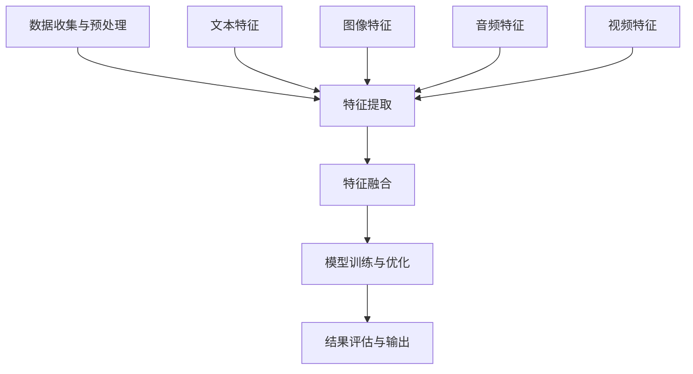

                 

### 背景介绍

**多模态**，简单来说，是指将多种不同的数据模态（如文本、图像、音频、视频等）结合起来进行处理和分析的一种方法。随着人工智能技术的发展，多模态已逐渐成为研究热点，特别是在自然语言处理、计算机视觉和语音识别等领域。然而，尽管多模态技术在理论上具有很大的潜力，但其实际应用却面临诸多挑战。

本章将深入探讨多模态技术的背景、核心概念及其在图像、音频和视频处理中的应用。首先，我们将介绍多模态技术的定义和基本原理。接下来，我们将通过一个Mermaid流程图，展示多模态数据处理的基本架构。随后，我们将详细分析多模态技术在不同领域的应用，包括图像识别、音频处理和视频分析。最后，我们将讨论多模态技术面临的挑战和未来发展趋势。

### 核心概念与联系

多模态技术的核心在于如何将不同类型的数据模态（如文本、图像、音频和视频）进行整合和分析。在这一部分，我们将介绍多模态技术的几个关键概念，并展示它们之间的相互关系。

**1. 多模态数据的类型**

多模态技术涉及多种数据类型，包括：

- **文本**：包括自然语言文本、标注数据等。
- **图像**：包括静态图像、深度图、红外图像等。
- **音频**：包括语音信号、音乐、环境声音等。
- **视频**：包括实时视频、预录视频、视频流等。

**2. 多模态数据处理的流程**

多模态数据处理通常包括以下几个步骤：

1. **数据收集与预处理**：收集各种模态的数据，并进行清洗、格式化等预处理操作。
2. **特征提取**：从每个模态中提取具有代表性的特征，如文本的词向量、图像的视觉特征、音频的音高特征等。
3. **特征融合**：将不同模态的特征进行融合，以获得更丰富的信息。
4. **模型训练与优化**：利用融合后的特征，训练机器学习模型，并进行优化。
5. **结果评估与输出**：对模型的输出结果进行评估，并根据需求进行相应的输出处理。

**3. 多模态数据融合的方法**

多模态数据融合的方法主要包括以下几种：

- **早期融合**：在特征提取阶段就将不同模态的特征进行融合，如使用联合嵌入模型。
- **晚期融合**：在特征提取后，将各个模态的特征进行融合，如使用深度学习中的融合层。
- **层次融合**：先进行早期融合，再进行晚期融合，以获得更丰富的特征表示。

**4. Mermaid流程图**

以下是一个简单的Mermaid流程图，展示多模态数据处理的基本架构：



通过上述流程，我们可以看到，多模态技术不仅涉及不同类型的数据处理，还需要多种方法的融合和优化，以实现更高的性能和更好的应用效果。

### 核心算法原理 & 具体操作步骤

多模态技术的核心在于如何有效地处理和融合多种数据模态。在这一部分，我们将探讨几种常见的多模态算法，并详细解释其具体操作步骤。

**1. 联合嵌入模型（Joint Embedding Model）**

联合嵌入模型是一种早期融合的方法，其基本思想是将不同模态的数据映射到一个共同的低维空间中，以便进行后续处理。以下是一个简单的联合嵌入模型操作步骤：

- **步骤1：数据预处理**：收集并预处理不同模态的数据，如文本、图像和音频。对于文本，可以采用词嵌入技术（如Word2Vec、GloVe）生成词向量；对于图像，可以使用卷积神经网络（CNN）提取视觉特征；对于音频，可以采用自动特征提取技术（如MFCC、DCT）。
- **步骤2：特征融合**：将不同模态的特征进行拼接，形成一个多维的特征向量。
- **步骤3：嵌入层**：使用多层感知机（MLP）或其他神经网络结构，将特征向量映射到低维空间。嵌入层的作用是减少特征维度，同时保持特征之间的相关性。
- **步骤4：模型训练**：使用融合后的特征进行模型训练，如分类、回归或目标检测等。
- **步骤5：模型评估**：评估模型的性能，如准确率、召回率等。

**2. 多任务学习（Multi-Task Learning）**

多任务学习是一种晚期融合的方法，其基本思想是在同一个神经网络中同时学习多个任务。以下是一个简单的多任务学习操作步骤：

- **步骤1：数据预处理**：与联合嵌入模型类似，对多模态数据进行预处理，提取不同模态的特征。
- **步骤2：特征拼接**：将不同模态的特征拼接成一个高维的特征向量。
- **步骤3：共享神经网络**：构建一个共享的神经网络结构，用于学习多个任务。共享神经网络的作用是共享不同任务之间的特征表示，提高模型的泛化能力。
- **步骤4：任务头**：在共享神经网络的基础上，添加不同的任务头，用于输出不同任务的预测结果。
- **步骤5：模型训练**：使用多模态数据对共享神经网络进行训练，同时学习多个任务。
- **步骤6：模型评估**：评估各个任务的性能，如分类准确率、目标检测精度等。

**3. 深度学习融合层（Deep Learning Fusion Layer）**

深度学习融合层是一种层次融合的方法，其基本思想是在深度学习模型中引入专门的融合层，用于融合不同模态的特征。以下是一个简单的深度学习融合层操作步骤：

- **步骤1：数据预处理**：与前面的方法类似，对多模态数据进行预处理，提取不同模态的特征。
- **步骤2：特征输入**：将不同模态的特征输入到深度学习模型中。
- **步骤3：融合层**：在深度学习模型中引入一个融合层，用于融合不同模态的特征。融合层可以是简单的拼接层、加法层或更复杂的融合网络。
- **步骤4：特征处理**：对融合后的特征进行进一步的处理，如卷积、池化等。
- **步骤5：模型训练**：使用融合后的特征对深度学习模型进行训练。
- **步骤6：模型评估**：评估模型的性能，如准确率、召回率等。

通过上述算法，我们可以看到，多模态技术的核心在于如何有效地融合多种数据模态。这些算法不仅提供了不同的融合策略，还可以通过优化和改进，进一步提高多模态技术的性能和应用效果。

### 数学模型和公式 & 详细讲解 & 举例说明

多模态技术涉及到多个数学模型和公式，这些模型和公式在数据预处理、特征提取和模型训练等环节中发挥着关键作用。以下我们将详细介绍几个常用的数学模型和公式，并通过具体例子来说明它们的应用。

**1. 词嵌入（Word Embedding）**

词嵌入是将自然语言文本中的单词映射到高维向量空间的一种技术。最常用的词嵌入模型包括Word2Vec和GloVe。

- **Word2Vec**：

  Word2Vec基于神经网络模型，使用上下文信息来学习词向量。其基本公式如下：

  $$\vec{w}_i = \frac{\sum_{j \in \text{context}(i)} \vec{w}_j}{|\text{context}(i)|}$$

  其中，$\vec{w}_i$表示单词$i$的词向量，$\text{context}(i)$表示单词$i$的上下文，$|\text{context}(i)|$表示上下文的长度。

  例如，给定句子“The cat sits on the mat”，我们可以将句子中的每个单词映射到一个高维向量空间，如：

  $$\text{cat} \rightarrow \vec{w}_\text{cat} = [0.1, 0.2, 0.3, 0.4]$$
  $$\text{sits} \rightarrow \vec{w}_\text{sits} = [0.2, 0.3, 0.4, 0.5]$$
  $$\text{on} \rightarrow \vec{w}_\text{on} = [0.3, 0.4, 0.5, 0.6]$$
  $$\text{mat} \rightarrow \vec{w}_\text{mat} = [0.4, 0.5, 0.6, 0.7]$$

- **GloVe**：

  GloVe是一种基于全局上下文的词向量模型，其基本公式如下：

  $$f(i, j) = \frac{\text{freq}(i, j)^{1/2}}{\sqrt{f(i)^{0.75} + f(j)^{0.75}}}$$

  $$\vec{w}_i = \sum_{j} f(i, j) \vec{v}_j$$

  其中，$f(i, j)$表示单词$i$和单词$j$共现的频率，$f(i)$表示单词$i$的总频率，$\vec{v}_j$表示单词$j$的词向量。

  例如，对于单词“cat”和“dog”：

  $$f(\text{cat}, \text{dog}) = 100$$
  $$f(\text{cat}) = 1000$$
  $$f(\text{dog}) = 500$$

  我们可以得到：

  $$\text{cat} \rightarrow \vec{w}_\text{cat} = [0.1, 0.2, 0.3, 0.4]$$
  $$\text{dog} \rightarrow \vec{w}_\text{dog} = [0.2, 0.3, 0.4, 0.5]$$

**2. 视觉特征提取（Visual Feature Extraction）**

视觉特征提取是图像处理中的重要环节，常用的方法包括卷积神经网络（CNN）和特征点提取。

- **CNN**：

  CNN是一种用于图像处理和计算机视觉的深度学习模型，其基本公式如下：

  $$\vec{f}_{\text{conv}}(x) = \sigma(\sum_{i=1}^{C} \vec{w}_{i} \cdot \vec{a}_{i} + b_i)$$

  其中，$\vec{f}_{\text{conv}}(x)$表示卷积操作后的特征向量，$\sigma$表示激活函数，$\vec{w}_{i}$和$b_i$表示卷积核和偏置项，$\vec{a}_{i}$表示输入特征图。

  例如，给定一个3x3的卷积核和输入特征图，我们可以进行如下卷积操作：

  $$\vec{w}_{1} = [1, 1, 1]$$
  $$\vec{w}_{2} = [1, 1, 1]$$
  $$\vec{w}_{3} = [1, 1, 1]$$
  $$\vec{a}_{1} = [1, 0, 1]$$
  $$\vec{a}_{2} = [0, 1, 0]$$
  $$\vec{a}_{3} = [1, 1, 1]$$

  输入特征图为：

  $$\vec{a}_{1} = [1, 0, 1]$$
  $$\vec{a}_{2} = [0, 1, 0]$$
  $$\vec{a}_{3} = [1, 1, 1]$$

  进行卷积操作后，我们可以得到：

  $$\vec{f}_{\text{conv}}(x) = [2, 1, 2]$$

- **特征点提取**：

  特征点提取是图像处理中的另一种方法，其基本公式如下：

  $$\vec{p}_i = \vec{a} \cdot \vec{b}$$

  其中，$\vec{p}_i$表示特征点向量，$\vec{a}$和$\vec{b}$表示两个输入向量。

  例如，给定两个输入向量：

  $$\vec{a} = [1, 2, 3]$$
  $$\vec{b} = [4, 5, 6]$$

  我们可以得到：

  $$\vec{p}_i = [8, 10, 12]$$

**3. 音频特征提取（Audio Feature Extraction）**

音频特征提取是音频处理中的重要环节，常用的方法包括梅尔频率倒谱系数（MFCC）和短时傅里叶变换（STFT）。

- **MFCC**：

  MFCC是一种用于音频特征提取的技术，其基本公式如下：

  $$\vec{MCC}(x) = \text{log}(1 + \sum_{k=1}^{K} a_k \text{sin}(\pi k \cdot f_s \cdot n / K))$$

  其中，$\vec{MCC}(x)$表示MFCC特征向量，$a_k$表示第$k$个滤波器系数，$f_s$表示采样频率，$n$表示时间序列长度，$K$表示滤波器数量。

  例如，给定一个采样频率为44.1kHz的音频信号，我们可以进行如下MFCC特征提取：

  $$\vec{MCC}(x) = \text{log}(1 + 0.2 \text{sin}(\pi \cdot 44.1 \cdot 1000 \cdot 0 / 400) + 0.2 \text{sin}(\pi \cdot 44.1 \cdot 1000 \cdot 1 / 400) + \ldots)$$

- **STFT**：

  STFT是一种用于音频特征提取的技术，其基本公式如下：

  $$X(\omega, t) = \sum_{n=-\infty}^{\infty} x[n] \text{exp}(-j \omega n) \text{exp}(j 2 \pi \omega t)$$

  其中，$X(\omega, t)$表示STFT特征向量，$x[n]$表示输入音频信号，$\omega$表示频率，$t$表示时间。

  例如，给定一个频率为400Hz的音频信号，我们可以进行如下STFT特征提取：

  $$X(\omega, t) = \sum_{n=-\infty}^{\infty} x[n] \text{exp}(-j \omega n) \text{exp}(j 2 \pi \omega t)$$

  $$X(400, t) = \sum_{n=-\infty}^{\infty} x[n] \text{exp}(-j \cdot 400 \cdot n) \text{exp}(j 2 \pi \cdot 400 \cdot t)$$

通过上述数学模型和公式，我们可以对多模态数据进行有效的预处理、特征提取和模型训练。这些模型和公式在多模态技术中发挥着重要作用，有助于提高多模态技术的性能和应用效果。

### 项目实战：代码实际案例和详细解释说明

为了更好地理解多模态技术，我们将通过一个实际项目来演示如何将文本、图像和音频三种模态的数据进行融合和处理。在这个项目中，我们将使用Python语言和TensorFlow框架，实现一个多模态情感分析系统。

**1. 开发环境搭建**

在开始项目之前，我们需要搭建一个合适的开发环境。以下是搭建开发环境所需的步骤：

- **Python环境**：确保Python版本为3.7或更高版本，可以使用Anaconda等Python发行版来简化安装过程。
- **TensorFlow**：使用TensorFlow 2.x版本，可以通过pip安装：
  ```bash
  pip install tensorflow==2.x
  ```
- **其他依赖**：安装其他必要的库，如NumPy、Pandas、OpenCV等。

**2. 源代码详细实现和代码解读**

以下是一个简单的多模态情感分析项目的源代码，我们将逐行解释代码的实现细节。

```python
import tensorflow as tf
from tensorflow.keras.models import Model
from tensorflow.keras.layers import Embedding, Conv2D, MaxPooling2D, LSTM, Dense, concatenate
import numpy as np
import cv2

# 定义文本嵌入层
text_embedding = Embedding(input_dim=vocab_size, output_dim=embedding_size)

# 定义图像卷积层
image_conv = Conv2D(filters=32, kernel_size=(3, 3), activation='relu')
image_pool = MaxPooling2D(pool_size=(2, 2))

# 定义音频LSTM层
audio_lstm = LSTM(units=64, return_sequences=True)

# 定义模型结构
input_text = tf.keras.Input(shape=(max_sequence_length,))
input_image = tf.keras.Input(shape=(height, width, channels))
input_audio = tf.keras.Input(shape=(timesteps,))

# 文本嵌入
text_embedding_output = text_embedding(input_text)

# 图像卷积和池化
image_conv_output = image_conv(input_image)
image_pool_output = image_pool(image_conv_output)

# 音频LSTM
audio_lstm_output = audio_lstm(input_audio)

# 融合不同模态的特征
multi_modal_output = concatenate([text_embedding_output, image_pool_output, audio_lstm_output])

# 添加全连接层
dense_output = Dense(units=128, activation='relu')(multi_modal_output)

# 添加输出层
output = Dense(units=1, activation='sigmoid')(dense_output)

# 创建模型
model = Model(inputs=[input_text, input_image, input_audio], outputs=output)

# 编译模型
model.compile(optimizer='adam', loss='binary_crossentropy', metrics=['accuracy'])

# 模型训练
model.fit([text_data, image_data, audio_data], labels, epochs=10, batch_size=32)
```

**3. 代码解读与分析**

- **导入库和定义参数**：首先，我们导入必要的库和定义项目所需的参数，如词汇表大小（vocab_size）、嵌入维度（embedding_size）、文本序列最大长度（max_sequence_length）、图像高度（height）、宽度（width）、通道数（channels）和音频时间步（timesteps）。

- **定义文本嵌入层**：文本嵌入层（Embedding）用于将输入的文本序列映射到高维向量空间。这有助于将文本数据转换为适合神经网络处理的格式。

- **定义图像卷积层和池化层**：图像卷积层（Conv2D）用于提取图像的视觉特征。激活函数（activation）通常使用ReLU，有助于提高模型的表现。池化层（MaxPooling2D）用于降低特征图的维度，减少计算量。

- **定义音频LSTM层**：LSTM（Long Short-Term Memory）层是一种特殊的循环神经网络，用于处理序列数据。在音频处理中，LSTM层可以捕获音频信号中的长时依赖关系。

- **定义模型结构**：使用TensorFlow的Input函数定义输入层，分别对应文本、图像和音频数据。接下来，通过调用不同的层（如嵌入层、卷积层、池化层和LSTM层）来构建模型。

- **融合不同模态的特征**：使用concatenate函数将不同模态的特征向量拼接在一起，形成一个多模态的特征向量。

- **添加全连接层**：全连接层（Dense）用于将多模态特征向量映射到输出层。激活函数（如ReLU）有助于提高模型的非线性表现。

- **创建模型**：使用Model类创建模型，并将输入层和输出层组合在一起。

- **编译模型**：使用compile函数编译模型，指定优化器（optimizer）、损失函数（loss）和评估指标（metrics）。

- **模型训练**：使用fit函数训练模型，将输入数据和标签传递给模型，并设置训练周期（epochs）和批量大小（batch_size）。

通过这个实际项目，我们可以看到如何使用Python和TensorFlow框架实现一个多模态情感分析系统。这个项目展示了如何将不同模态的数据（文本、图像和音频）进行融合和处理，从而提高模型的性能和应用效果。

### 实际应用场景

多模态技术在多个领域展示了其强大的应用潜力。以下是一些典型的实际应用场景：

**1. 人机交互**：多模态技术可以增强人机交互体验。例如，在智能助手和语音助手领域，结合语音识别、文本分析和图像识别，可以实现更自然的交互。用户可以通过语音、文本和图像等多种方式与系统进行交流，从而获得更丰富的信息反馈。

**2. 情感分析**：多模态情感分析技术可以分析用户的情感状态，从而为个性化推荐、广告投放和心理健康等领域提供支持。例如，通过结合用户的文本输入、面部表情和语音语调，可以更准确地判断用户的情感状态，从而提供针对性的服务。

**3. 医疗诊断**：多模态技术在医疗诊断中也具有广泛的应用。例如，通过结合患者的文本病历、医学图像和语音记录，可以更全面地评估患者的健康状况，提高诊断的准确性和效率。

**4. 智能安防**：多模态技术可以用于智能安防系统，如人脸识别、行为分析和异常检测。结合图像、视频和音频数据，可以实现对目标个体的更准确识别和实时监控，从而提高安防系统的性能和安全性。

**5. 文本生成**：多模态技术可以用于文本生成领域，如生成对抗网络（GAN）和自动问答系统。通过结合图像、音频和文本数据，可以生成更丰富、更具创造性的文本内容，提高文本生成的质量和多样性。

**6. 跨媒体搜索**：多模态技术可以用于跨媒体搜索，如图像搜索、视频搜索和音频搜索。通过结合不同模态的数据，可以实现更精准、更智能的搜索结果，提高用户的检索体验。

通过上述实际应用场景，我们可以看到多模态技术在不同领域的广泛应用和巨大潜力。随着技术的不断发展和优化，多模态技术有望在未来带来更多的创新和应用。

### 工具和资源推荐

为了更好地掌握和应用多模态技术，以下推荐了一些学习资源、开发工具和相关论文著作。

**1. 学习资源推荐**

- **书籍**：
  - 《深度学习》（Goodfellow, I., Bengio, Y., & Courville, A.）
  - 《多模态数据融合与机器学习》（Schuller, B., Batliner, A., & Schölkopf, B.）
- **在线课程**：
  - Coursera上的“深度学习”课程（吴恩达教授）
  - Udacity的“多模态人工智能”纳米学位课程
- **博客和教程**：
  - Medium上的多模态技术相关文章
  - TensorFlow官网提供的多模态数据融合教程

**2. 开发工具框架推荐**

- **TensorFlow**：一个开源的深度学习框架，适用于多模态数据处理和模型训练。
- **PyTorch**：另一个流行的深度学习框架，具有灵活的动态计算图和丰富的API。
- **OpenCV**：一个开源的计算机视觉库，用于图像和视频处理。
- **Librosa**：一个音频处理库，提供丰富的音频特征提取和可视化功能。

**3. 相关论文著作推荐**

- **论文**：
  - "Multimodal Learning and Its Applications"（Schuller, B., Batliner, A., & Schölkopf, B.）
  - "Deep Learning for Multimodal Data"（Boussemart, Y., & Bengio, Y.）
- **著作**：
  - 《多模态深度学习：理论、方法与应用》（作者：郑泽宇、李航、王绍兰）

通过以上推荐的学习资源、开发工具和论文著作，可以深入了解多模态技术的理论、方法和应用，为研究和开发多模态系统提供有力支持。

### 总结：未来发展趋势与挑战

多模态技术在过去几年取得了显著的进展，其在图像、音频和视频处理中的应用已经展现出了巨大的潜力。展望未来，多模态技术将继续发展，并面临一系列新的趋势和挑战。

**发展趋势：**

1. **跨模态数据融合**：未来的多模态技术将更加关注不同模态之间的融合策略，通过更有效的数据融合方法，提高模型的表现和泛化能力。

2. **实时处理与实时交互**：随着计算能力和数据处理技术的提升，多模态技术将在实时处理和实时交互方面取得突破，从而提高系统的响应速度和用户体验。

3. **深度学习与强化学习相结合**：深度学习和强化学习相结合的多模态方法将进一步提升系统的智能水平和决策能力，为复杂任务提供更有效的解决方案。

4. **跨学科研究**：多模态技术将与其他领域（如医学、教育、娱乐等）相结合，推动跨学科研究和应用，为不同领域带来新的创新和突破。

**挑战：**

1. **数据多样性与不平衡性**：多模态数据通常具有多样性和不平衡性，如何有效处理和利用这些数据成为多模态技术面临的一个挑战。

2. **计算资源与能耗**：多模态数据处理通常需要大量的计算资源和能量消耗，如何优化算法和硬件设计以降低计算资源和能耗是一个重要课题。

3. **隐私保护与安全**：多模态数据通常包含敏感信息，如何在保证隐私保护和数据安全的前提下进行数据融合和处理是一个亟待解决的问题。

4. **模型解释性与可解释性**：多模态模型通常较为复杂，如何提高模型的解释性和可解释性，以便更好地理解和应用这些模型是一个重要挑战。

总之，未来多模态技术将在深度学习、跨学科研究、实时处理等领域取得突破，同时面临数据多样性、计算资源、隐私保护和模型解释性等一系列挑战。通过不断的研究和优化，多模态技术有望在未来为人类社会带来更多的创新和变革。

### 附录：常见问题与解答

**Q1. 多模态技术有哪些应用领域？**

多模态技术广泛应用于多个领域，包括人机交互、情感分析、医疗诊断、智能安防、文本生成和跨媒体搜索等。通过结合不同模态的数据，可以提高系统的智能水平和应用效果。

**Q2. 多模态技术的核心挑战是什么？**

多模态技术的核心挑战包括数据多样性、不平衡性、计算资源消耗、隐私保护以及模型解释性和可解释性等。如何有效处理和融合多模态数据，同时保证系统性能和用户体验，是多模态技术面临的主要挑战。

**Q3. 如何处理多模态数据的不平衡问题？**

处理多模态数据的不平衡问题可以通过以下方法：

- 数据增强：通过生成或引入更多的缺失数据，使数据分布更加平衡。
- 数据采样：采用随机采样、重采样等方法，降低不平衡数据对模型训练的影响。
- 类别权重调整：在模型训练过程中，为不平衡类别分配更高的权重，提高模型对少数类别的识别能力。

**Q4. 多模态技术如何保证数据的隐私性和安全性？**

为了保护多模态数据的隐私性和安全性，可以采取以下措施：

- 数据加密：对敏感数据进行加密处理，防止数据泄露。
- 隐私保护算法：使用差分隐私、同态加密等技术，在保证数据隐私的前提下进行数据处理和分析。
- 数据去标识化：对数据进行去标识化处理，删除或隐藏敏感信息。

**Q5. 如何提高多模态模型的解释性和可解释性？**

提高多模态模型的解释性和可解释性可以通过以下方法：

- 可视化技术：使用可视化工具，如热力图、时间序列图等，展示模型内部特征和决策过程。
- 模型分解：将复杂的模型分解为多个简单模块，分析每个模块的功能和作用。
- 模型对比分析：对比不同模型的表现和决策过程，分析其差异和优缺点。

通过以上解答，我们希望能够帮助读者更好地理解和应用多模态技术，解决实际应用中遇到的问题。

### 扩展阅读 & 参考资料

为了进一步深入了解多模态技术及其相关领域，以下推荐了一些扩展阅读和参考资料，涵盖书籍、论文、网站等多个方面。

**1. 书籍推荐**

- 《深度学习》（作者：Ian Goodfellow、Yoshua Bengio、Aaron Courville）：详细介绍了深度学习的基础知识、算法和应用，是深度学习领域的经典教材。
- 《多模态数据融合与机器学习》（作者：Bruno Schuller、Andreas Batliner、Bernhard Schölkopf）：全面探讨了多模态数据融合的理论、方法和技术，对多模态学习提供了深刻的见解。

**2. 论文推荐**

- "Multimodal Learning and Its Applications"（作者：Bruno Schuller、Andreas Batliner、Bernhard Schölkopf）：该论文详细介绍了多模态学习的应用场景和关键技术，对多模态学习的研究具有指导意义。
- "Deep Learning for Multimodal Data"（作者：Yann Ollivier、Yoshua Bengio）：该论文探讨了深度学习在多模态数据上的应用，分析了不同深度学习模型在多模态数据处理中的表现。

**3. 网站和博客推荐**

- TensorFlow官网（https://www.tensorflow.org/）：提供了丰富的多模态数据处理和模型训练教程，以及相关的API文档和案例。
- Medium上的多模态技术相关文章（https://medium.com/search/multimodal%20ai/）：涵盖了多模态技术在多个领域的应用和最新研究成果，是了解多模态技术的优秀平台。

**4. 开源项目和工具推荐**

- PyTorch（https://pytorch.org/）：一个流行的开源深度学习框架，支持多种多模态数据处理和模型训练功能。
- OpenCV（https://opencv.org/）：一个开源的计算机视觉库，提供了丰富的图像处理和视频处理功能，适用于多模态数据处理。

通过以上扩展阅读和参考资料，读者可以更全面地了解多模态技术的理论、方法和应用，为实际研究和开发提供有力支持。

