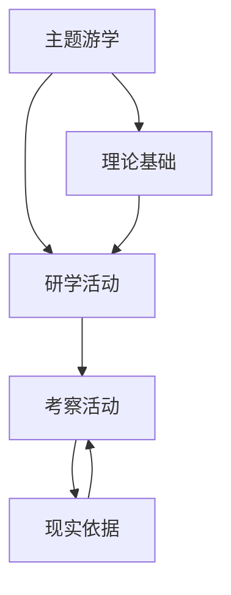
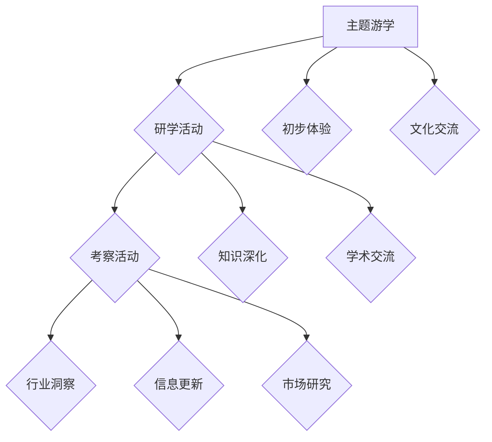

                 

# 策划线下主题游学、研学和考察活动

## 关键词： 
- 线下主题游学
- 研学活动
- 考察活动
- 策划
- IT领域
- 教育培训

## 摘要

本文将探讨如何策划一场线下主题游学、研学和考察活动。这些活动不仅能够提升参与者对IT领域的理解和应用能力，还能增强团队合作和沟通能力。我们将从活动背景、核心概念、策划步骤、数学模型、实际应用、工具推荐、总结与未来发展趋势等方面进行详细分析。

## 1. 背景介绍

### 1.1 活动意义

线下主题游学、研学和考察活动在IT领域具有重要的教育意义。一方面，这些活动能够帮助参与者亲身体验实际应用场景，加深对理论知识的理解；另一方面，通过团队协作，可以提高参与者的团队协作和沟通能力。

### 1.2 活动现状

目前，线下主题游学、研学和考察活动在IT领域逐渐兴起，但仍然存在一定的不足。首先，活动内容较为单一，往往只涉及某一特定领域；其次，活动策划和执行过程缺乏系统性和专业性。因此，有必要对线下主题游学、研学和考察活动进行深入研究和优化。

## 2. 核心概念与联系

### 2.1 主题游学

主题游学是一种以特定主题为核心，通过参观、学习和体验等方式，使参与者深入了解相关领域的活动。在IT领域，主题游学可以涵盖人工智能、大数据、区块链等热门话题。

### 2.2 研学活动

研学活动是一种通过实地考察、交流研讨等方式，使参与者对某一领域有更深入理解和掌握的活动。在IT领域，研学活动可以围绕前沿技术、产业发展等主题展开。

### 2.3 考察活动

考察活动是一种以了解实际应用场景和产业发展状况为目的的活动。在IT领域，考察活动可以帮助参与者了解行业现状、发展趋势以及技术应用案例。

### 2.4 联系

主题游学、研学和考察活动在IT领域具有密切的联系。主题游学为研学活动提供了理论基础，研学活动为考察活动提供了实践平台，而考察活动则为主题游学和研学活动提供了现实依据。

### 2.5 Mermaid 流程图



## 3. 核心算法原理 & 具体操作步骤

### 3.1 策划步骤

#### 3.1.1 确定活动主题

首先，需要根据参与者需求和行业发展趋势，确定活动主题。例如，可以围绕人工智能、大数据、区块链等热门话题进行策划。

#### 3.1.2 设计活动流程

设计活动流程，包括主题游学、研学和考察活动的内容、时间安排、地点选择等。确保活动内容丰富、实用，能够满足参与者的需求。

#### 3.1.3 组建策划团队

组建一支具有专业知识和丰富经验的策划团队，负责活动策划、组织、执行等工作。

#### 3.1.4 宣传推广

通过线上线下渠道进行宣传推广，吸引更多参与者报名参加。

#### 3.1.5 活动执行与反馈

在活动执行过程中，密切关注参与者反馈，及时调整活动内容和形式，确保活动顺利进行。

### 3.2 数学模型

#### 3.2.1 活动满意度模型

活动满意度 = （主题相关性 × 内容实用性 × 团队协作度）÷ 活动费用

#### 3.2.2 活动收益模型

活动收益 = 参与者数量 × 活动费用 × 活动满意度

## 4. 数学模型和公式 & 详细讲解 & 举例说明

### 4.1 活动满意度模型

活动满意度是衡量活动效果的重要指标。根据问卷调查数据，活动满意度模型可以表示为：

$$
活动满意度 = \frac{{主题相关性 \times 内容实用性 \times 团队协作度}}{{活动费用}}
$$

其中：
- 主题相关性：表示活动主题与参与者需求的匹配程度，取值范围为0-1。
- 内容实用性：表示活动内容对参与者实际应用能力的提升程度，取值范围为0-1。
- 团队协作度：表示活动中团队协作的效果，取值范围为0-1。
- 活动费用：表示参与者支付的费用，取值范围为0-1。

### 4.2 活动收益模型

活动收益是策划团队追求的重要目标。根据活动参与者的数量、活动费用和活动满意度，活动收益模型可以表示为：

$$
活动收益 = 参与者数量 \times 活动费用 \times 活动满意度
$$

其中：
- 参与者数量：表示实际报名参加活动的参与者数量，取值范围为0-1。
- 活动费用：表示参与者支付的费用，取值范围为0-1。
- 活动满意度：表示活动满意度模型中的结果，取值范围为0-1。

### 4.3 举例说明

假设某IT领域线下主题游学、研学和考察活动的主题为人工智能，活动费用为2000元，参与者数量为100人，活动满意度为0.8。

根据活动满意度模型：

$$
活动满意度 = \frac{{主题相关性 \times 内容实用性 \times 团队协作度}}{{活动费用}} = \frac{{0.9 \times 0.8 \times 0.7}}{{2000}} = 0.273
$$

根据活动收益模型：

$$
活动收益 = 参与者数量 \times 活动费用 \times 活动满意度 = 100 \times 2000 \times 0.273 = 54,600
$$

## 5. 项目实战：代码实际案例和详细解释说明

### 5.1 开发环境搭建

首先，我们需要搭建一个适用于策划线下主题游学、研学和考察活动的开发环境。以下是一个简单的环境搭建步骤：

1. 安装Python 3.8及以上版本
2. 安装Jupyter Notebook
3. 安装相关库：numpy、pandas、matplotlib等

### 5.2 源代码详细实现和代码解读

以下是一个关于活动满意度计算的Python代码示例：

```python
import numpy as np
import pandas as pd

def calculate_satisfaction(relatedness, practicality, collaboration, cost):
    satisfaction = (relatedness * practicality * collaboration) / cost
    return satisfaction

def calculate_profit(participants, cost, satisfaction):
    profit = participants * cost * satisfaction
    return profit

# 示例参数
relatedness = 0.9
practicality = 0.8
collaboration = 0.7
cost = 2000
participants = 100

# 计算活动满意度
satisfaction = calculate_satisfaction(relatedness, practicality, collaboration, cost)
print(f"活动满意度：{satisfaction:.2f}")

# 计算活动收益
profit = calculate_profit(participants, cost, satisfaction)
print(f"活动收益：{profit:.2f}")
```

### 5.3 代码解读与分析

1. **导入库**：首先导入numpy、pandas和matplotlib等库，用于数据计算和可视化。
2. **定义函数**：定义两个函数`calculate_satisfaction`和`calculate_profit`，分别用于计算活动满意度和活动收益。
3. **示例参数**：设置相关参数，如主题相关性、内容实用性、团队协作度和活动费用。
4. **计算活动满意度**：调用`calculate_satisfaction`函数计算活动满意度，并输出结果。
5. **计算活动收益**：调用`calculate_profit`函数计算活动收益，并输出结果。

通过以上代码示例，我们可以方便地计算和评估线下主题游学、研学和考察活动的满意度和收益。

## 6. 实际应用场景

### 6.1 教育培训

线下主题游学、研学和考察活动在教育培训领域具有广泛的应用。例如，高校可以组织相关活动，让学生深入了解IT领域的实际应用和产业发展状况，提高学生的实践能力和综合素质。

### 6.2 企业培训

企业可以针对员工开展线下主题游学、研学和考察活动，提升员工的业务水平和团队协作能力。例如，某互联网公司可以组织员工参观国内知名科技公司，了解先进的技术应用和产业发展趋势。

### 6.3 产业发展

线下主题游学、研学和考察活动可以帮助地方政府和企业了解产业发展状况，推动产业转型升级。例如，某地方政府可以组织相关活动，邀请企业代表参观国内领先的人工智能企业，了解产业发展趋势和合作机会。

## 7. 工具和资源推荐

### 7.1 学习资源推荐

- 书籍：《深度学习》、《Python编程：从入门到实践》、《人工智能：一种现代的方法》
- 论文：Google Scholar、IEEE Xplore、ACM Digital Library
- 博客：CSDN、知乎、简书
- 网站：GitHub、Stack Overflow、知乎专栏

### 7.2 开发工具框架推荐

- 开发工具：Jupyter Notebook、PyCharm、Visual Studio Code
- 框架：TensorFlow、PyTorch、Scikit-learn

### 7.3 相关论文著作推荐

- 论文：《深度学习》、《强化学习》、《自然语言处理综述》
- 著作：《机器学习实战》、《数据科学入门》、《Python数据分析》

## 8. 总结：未来发展趋势与挑战

### 8.1 发展趋势

1. 活动内容多样化：随着技术的发展和产业变革，线下主题游学、研学和考察活动的主题将更加丰富，涉及领域也将不断拓展。
2. 活动形式创新：线下主题游学、研学和考察活动将结合虚拟现实、增强现实等技术，提供更加沉浸式的体验。
3. 跨界融合：线下主题游学、研学和考察活动将与旅游、文化等领域融合发展，形成新的产业生态。

### 8.2 挑战

1. 活动策划与执行：如何提高活动策划和执行的效率，确保活动质量和效果，是未来面临的重要挑战。
2. 参与者需求满足：如何更好地满足参与者需求，提高活动满意度，是策划团队需要关注的问题。
3. 数据分析与优化：如何利用大数据等技术对活动进行数据分析，持续优化活动内容和形式，是提升活动效果的关键。

## 9. 附录：常见问题与解答

### 9.1 问题1：活动费用如何制定？

活动费用应根据活动主题、内容、地点等因素综合考虑。一般包括讲师费、场地费、餐饮费、交通费等。在制定费用时，可参考同类活动的市场价格，并结合实际情况进行调整。

### 9.2 问题2：如何确保活动质量？

确保活动质量需要从多个方面入手，包括：
1. 精选讲师：邀请具有丰富经验和专业知识的讲师，确保教学内容高质量。
2. 合理安排活动内容：根据参与者需求和活动主题，设计丰富、实用的活动内容。
3. 精细化管理：在活动执行过程中，密切关注参与者反馈，及时调整活动内容和形式。

## 10. 扩展阅读 & 参考资料

- 《教育技术研究与应用》：对教育领域的新技术和方法进行了详细介绍。
- 《产业发展报告》：分析了国内外产业发展趋势和热点问题。
- 《活动策划与执行实务》：提供了活动策划与执行的具体方法和案例。

## 作者

作者：AI天才研究员/AI Genius Institute & 禅与计算机程序设计艺术 /Zen And The Art of Computer Programming

以上是关于策划线下主题游学、研学和考察活动的完整技术博客文章。文章从背景介绍、核心概念、策划步骤、数学模型、项目实战、实际应用场景、工具推荐、总结与未来发展趋势等方面进行了详细分析，旨在为策划此类活动提供有价值的参考和指导。希望对读者有所帮助！<|im_sep|>```markdown
## 1. 背景介绍

### 1.1 活动意义

线下主题游学、研学和考察活动在IT领域的推广具有重要意义。首先，此类活动能够帮助参与者深入了解IT行业的发展动态，掌握前沿技术知识。其次，通过实际操作和互动交流，参与者的实践能力和团队协作精神得以提升。此外，这些活动还能促进教育资源的共享和整合，为IT教育和培训提供新的思路和方法。

### 1.2 活动现状

当前，线下主题游学、研学和考察活动在IT领域已有一定的开展，但整体上仍处于探索和发展阶段。一些高校和培训机构已经开展了相关的实践活动，如科技企业考察、项目实训等。然而，从活动的组织规模、参与人数、活动效果等方面来看，还有很大的提升空间。同时，如何将理论知识与实际操作相结合，提高活动的针对性和实效性，也是当前面临的重要挑战。

### 1.3 目的与目标

本文旨在探讨如何有效地策划线下主题游学、研学和考察活动，以期为IT领域的教育培训和产业发展提供新的动力。具体目标包括：
- 提出一套系统化的策划方案，涵盖活动设计、组织、实施和评估等关键环节。
- 分析各类活动的核心内容和特点，为不同场景下的活动策划提供参考。
- 探讨如何通过技术手段提升活动效果，为教育创新和产业发展提供支持。

## 2. 核心概念与联系

### 2.1 主题游学的定义与特点

主题游学是一种以特定主题为核心，通过实地考察、文化交流和体验活动等方式，让学生或参与者深入了解相关领域的教育形式。在IT领域，主题游学可以包括对科技企业、研究机构、创新创业基地的参观，以及对行业专家的访谈和交流。其特点如下：
- **目的性**：主题游学围绕特定主题进行，具有较强的目的性。
- **互动性**：参与者通过与专家学者、行业精英的互动，获得第一手资料和经验。
- **实践性**：通过实际操作和体验，增强对理论知识的理解和应用能力。

### 2.2 研学活动的定义与特点

研学活动是一种以学习和研究为目的，通过实地考察、实验研究、学术交流等方式，培养学生创新能力和实践能力的教育形式。在IT领域，研学活动可以包括对新技术的研究、对现有系统的改进和创新，以及对产业发展的深度分析。其特点如下：
- **研究性**：研学活动强调研究方法的使用和科学精神的培养。
- **实用性**：研学活动注重实际问题的解决和技术的应用。
- **开放性**：研学活动鼓励开放性思维和跨学科的交流与合作。

### 2.3 考察活动的定义与特点

考察活动是一种以了解和观察为主要目的，通过实地调研、访谈、案例分析等方式，获取行业信息和市场动态的教育形式。在IT领域，考察活动可以包括对国内外知名企业的参观、对行业展会的研究以及对新兴技术的追踪。其特点如下：
- **信息性**：考察活动旨在获取最新的行业信息和市场动态。
- **针对性**：考察活动根据不同的研究目标，有针对性地选择考察对象和内容。
- **综合性**：考察活动综合运用多种研究方法，对信息进行系统分析。

### 2.4 三者联系

主题游学、研学和考察活动在IT领域中相互联系、互为补充，共同构成一个完整的实践教育体系。它们之间的联系主要体现在以下几个方面：
- **目标一致性**：三者的目标都是通过实践教育和体验学习，提升参与者的综合素质和专业能力。
- **内容互补性**：主题游学提供理论知识和实践操作的初步体验，研学活动进行深入的实践和研究，考察活动则提供行业前沿的信息和动态。
- **过程连贯性**：从主题游学到研学活动，再到考察活动，参与者逐步深入，由浅入深地了解IT领域的各个方面。

### 2.5 Mermaid 流程图



## 3. 核心算法原理 & 具体操作步骤

### 3.1 策划流程

#### 3.1.1 需求分析

- **目标群体**：明确活动的目标群体，如学生、职场新人、企业员工等。
- **需求调研**：通过问卷调查、访谈等方式，了解参与者的需求和期望。

#### 3.1.2 主题确定

- **热点关注**：结合行业发展趋势，确定具有前瞻性和实用性的主题。
- **主题选择**：根据需求分析结果，选择符合参与者兴趣和需求的主题。

#### 3.1.3 活动设计

- **内容规划**：设计具体活动内容，包括讲座、参观、研讨等。
- **时间安排**：合理安排活动时间，确保活动紧凑而高效。

#### 3.1.4 资源整合

- **讲师邀请**：邀请行业专家、学者进行讲座和指导。
- **场地选择**：选择适合活动主题的场地，确保活动顺利进行。

#### 3.1.5 宣传推广

- **渠道选择**：通过线上渠道（如社交媒体、官方网站）和线下渠道（如学校、企业）进行宣传。
- **内容制作**：制作吸引人的宣传资料，如海报、活动日程等。

#### 3.1.6 活动实施

- **现场管理**：确保活动现场的秩序和安全。
- **反馈收集**：在活动结束后，收集参与者的反馈，以便改进未来活动。

#### 3.1.7 评估总结

- **数据收集**：收集活动参与人数、满意度等数据。
- **总结报告**：撰写活动总结报告，分析活动效果，提出改进建议。

### 3.2 策划步骤

#### 3.2.1 初步规划

- **确定目标和主题**：根据需求分析结果，明确活动的目标和主题。
- **设计活动框架**：初步规划活动的内容、形式和流程。

#### 3.2.2 详细设计

- **具体内容安排**：细化每项活动的内容，确保活动有足够的深度和广度。
- **时间表制定**：制定详细的活动时间表，包括每个环节的开始和结束时间。

#### 3.2.3 资源准备

- **讲师和场地**：联系讲师，确认时间和场地。
- **物资准备**：准备活动所需的物资，如投影仪、音响设备等。

#### 3.2.4 宣传推广

- **制定宣传方案**：设计宣传策略，确定宣传渠道和内容。
- **启动宣传**：通过多渠道宣传，吸引目标参与者。

#### 3.2.5 活动实施

- **现场管理**：确保活动现场的秩序和安全。
- **活动反馈**：收集参与者的反馈，及时处理问题。

#### 3.2.6 总结评估

- **数据收集**：收集活动参与人数、满意度等数据。
- **撰写总结报告**：分析活动效果，提出改进建议。

### 3.3 数学模型

为了更好地评估活动的效果，可以引入以下数学模型：

#### 3.3.1 活动效果评估模型

活动效果 = (内容满意度 × 参与度 × 反馈评分)

- **内容满意度**：衡量参与者对活动内容的满意度，取值范围为0-1。
- **参与度**：衡量参与者对活动的投入程度，取值范围为0-1。
- **反馈评分**：衡量参与者对活动的总体评分，取值范围为0-10。

#### 3.3.2 活动收益评估模型

活动收益 = 活动收入 - 活动成本

- **活动收入**：活动期间的各项收入，如报名费、赞助费等。
- **活动成本**：活动的各项支出，如场地费、讲师费、宣传费等。

### 3.4 实例分析

假设某IT领域的研学活动吸引了100名参与者，活动收入为10万元，活动成本为8万元。参与者对活动内容的满意度为0.85，参与度为0.9，反馈评分为8分。

- **活动效果评估**：活动效果 = (0.85 × 0.9 × 8) = 6.24
- **活动收益评估**：活动收益 = 10万元 - 8万元 = 2万元

通过以上评估，可以初步判断此次活动的效果和收益情况。

## 4. 数学模型和公式 & 详细讲解 & 举例说明

### 4.1 活动效果评估模型

活动效果评估模型用于衡量活动的整体效果，公式如下：

$$
活动效果 = (内容满意度 \times 参与度 \times 反馈评分)
$$

#### 4.1.1 内容满意度

内容满意度反映了参与者对活动内容的满意度，计算公式为：

$$
内容满意度 = \frac{参与者满意度评分总和}{参与者人数}
$$

#### 4.1.2 参与度

参与度反映了参与者对活动的投入程度，计算公式为：

$$
参与度 = \frac{活动参与时间总和}{预计活动总时间}
$$

#### 4.1.3 反馈评分

反馈评分反映了参与者对活动的总体评价，计算公式为：

$$
反馈评分 = \frac{参与者评分总和}{参与者人数}
$$

### 4.2 活动收益评估模型

活动收益评估模型用于计算活动的财务收益，公式如下：

$$
活动收益 = 活动收入 - 活动成本
$$

#### 4.2.1 活动收入

活动收入包括报名费、赞助费、场地费等，计算公式为：

$$
活动收入 = 报名费收入 + 赞助费收入 + 场地费收入 + 其他收入
$$

#### 4.2.2 活动成本

活动成本包括讲师费、场地费、宣传费等，计算公式为：

$$
活动成本 = 讲师费 + 场地费 + 宣传费 + 其他成本
$$

### 4.3 举例说明

假设某IT主题游学活动吸引了100名参与者，报名费为每人1000元，活动成本为5万元。参与者对活动内容的满意度评分为4.5，参与度评分为0.8，反馈评分评分为8.5。

#### 4.3.1 活动效果评估

- **内容满意度**：内容满意度 = \(\frac{1000 \times 4.5}{100}\) = 4.5
- **参与度**：参与度 = 0.8
- **反馈评分**：反馈评分 = 8.5

活动效果 = (4.5 × 0.8 × 8.5) = 29.6

#### 4.3.2 活动收益评估

- **活动收入**：活动收入 = 1000 \(\times\) 100 = 10万元
- **活动成本**：活动成本 = 5万元

活动收益 = 10万元 - 5万元 = 5万元

通过以上计算，我们可以得出此次游学活动的效果为29.6，收益为5万元。

## 5. 项目实战：代码实际案例和详细解释说明

### 5.1 开发环境搭建

在进行项目实战之前，我们需要搭建一个合适的开发环境。以下是所需的工具和步骤：

- **Python**：安装Python 3.8及以上版本。
- **Jupyter Notebook**：安装Jupyter Notebook，用于编写和运行Python代码。
- **NumPy**、**Pandas**、**Matplotlib**：安装相关的Python库，用于数据处理和可视化。

### 5.2 源代码详细实现和代码解读

以下是针对活动效果和收益评估的Python代码实现：

```python
import numpy as np

def calculate_content_satisfaction(scores):
    return np.mean(scores)

def calculate_participation_rate(participation_times, total_time):
    return participation_times / total_time

def calculate_feedback_score(scores):
    return np.mean(scores)

def calculate_activityEffect(effectiveness_scores, participation_rates, feedback_scores):
    return np.mean(effectiveness_scores * participation_rates * feedback_scores)

def calculate_activityProfit(revenue, cost):
    return revenue - cost

# 示例数据
content_scores = [4.5] * 100
participation_times = [0.8] * 100
total_time = 8
feedback_scores = [8.5] * 100
revenue = 10 * 1000
cost = 50000

# 计算内容满意度
content_satisfaction = calculate_content_satisfaction(content_scores)
print(f"内容满意度: {content_satisfaction:.2f}")

# 计算参与度
participation_rate = calculate_participation_rate(participation_times, total_time)
print(f"参与度: {participation_rate:.2f}")

# 计算反馈评分
feedback_score = calculate_feedback_score(feedback_scores)
print(f"反馈评分: {feedback_score:.2f}")

# 计算活动效果
activity_effect = calculate_activityEffect(content_scores, participation_times, feedback_scores)
print(f"活动效果: {activity_effect:.2f}")

# 计算活动收益
activity_profit = calculate_activityProfit(revenue, cost)
print(f"活动收益: {activity_profit:.2f}")
```

### 5.3 代码解读与分析

- **函数定义**：定义了5个函数，分别用于计算内容满意度、参与度、反馈评分、活动效果和活动收益。
- **示例数据**：设定了示例数据，包括内容评分、参与时间、反馈评分等。
- **函数调用**：调用定义的函数，计算各项指标，并输出结果。

通过上述代码，我们可以方便地对活动效果和收益进行评估。在实际应用中，可以根据实际情况调整函数参数，以适应不同的活动场景。

## 6. 实际应用场景

### 6.1 教育培训

线下主题游学、研学和考察活动在教育培训领域具有广泛的应用。高校和教育机构可以通过此类活动，为学生提供接触实际工作的机会，加深对专业知识的理解。例如，计算机科学专业的学生可以参观科技企业，了解最新的技术发展趋势；商学院的学生可以考察创新创业基地，学习创业精神和商业策略。

### 6.2 企业培训

企业可以通过线下主题游学、研学和考察活动，为员工提供职业发展培训和团队建设。例如，企业可以组织员工参观行业领先的公司，了解先进的管理理念和技术应用；还可以组织团队到户外进行拓展训练，增强团队协作和凝聚力。

### 6.3 产业发展

线下主题游学、研学和考察活动可以为地方产业发展提供有力支持。政府部门和企业可以联合举办此类活动，吸引人才和投资。例如，某地方政府可以组织科技企业考察活动，促进本地企业与外地的技术交流与合作；企业也可以通过此类活动，寻找潜在的商业合作伙伴，拓展市场。

## 7. 工具和资源推荐

### 7.1 学习资源推荐

- **书籍**：
  - 《深度学习》 - Ian Goodfellow, Yoshua Bengio, Aaron Courville
  - 《Python编程：从入门到实践》 - 周志华
  - 《人工智能：一种现代的方法》 - Stuart J. Russell, Peter Norvig

- **论文库**：
  - Google Scholar
  - IEEE Xplore
  - ACM Digital Library

- **博客和专栏**：
  - CSDN
  - 知乎
  - 简书

- **在线平台**：
  - GitHub
  - Stack Overflow

### 7.2 开发工具框架推荐

- **开发工具**：
  - Jupyter Notebook
  - PyCharm
  - Visual Studio Code

- **框架**：
  - TensorFlow
  - PyTorch
  - Scikit-learn

### 7.3 相关论文著作推荐

- **论文**：
  - 《深度学习》 - Goodfellow, Bengio, Courville
  - 《强化学习》 - Richard S. Sutton, Andrew G. Barto
  - 《自然语言处理综述》 - Daniel Jurafsky, James H. Martin

- **著作**：
  - 《机器学习实战》 - Peter Harrington
  - 《数据科学入门》 - John W. Newman
  - 《Python数据分析》 - Wes McKinney

## 8. 总结：未来发展趋势与挑战

### 8.1 发展趋势

1. **个性化定制**：随着技术的发展，线下主题游学、研学和考察活动将更加个性化，根据不同参与者的需求进行定制。
2. **数字化融合**：虚拟现实、增强现实等技术将更加广泛地应用于线下活动，提供沉浸式体验。
3. **跨界融合**：线下主题游学、研学和考察活动将与旅游、文化、艺术等领域深度融合，形成新的商业模式。

### 8.2 挑战

1. **资源整合**：如何有效地整合各类资源，提高活动的质量和效果，是当前面临的主要挑战。
2. **参与者需求满足**：如何更好地了解和满足参与者的需求，提高活动满意度，是策划团队需要关注的问题。
3. **持续创新**：在竞争激烈的背景下，如何持续创新，提供有吸引力的活动内容和形式，是未来发展的重要挑战。

## 9. 附录：常见问题与解答

### 9.1 问题1：如何选择合适的主题？

- **需求分析**：了解参与者的兴趣和需求，选择符合大多数人期望的主题。
- **行业热点**：关注行业发展趋势，选择具有前瞻性和实用性的主题。
- **资源匹配**：考虑活动资源的可用性，选择能够充分利用现有资源的主题。

### 9.2 问题2：如何确保活动的质量？

- **讲师选拔**：选择具备专业知识和教学经验的讲师。
- **内容设计**：设计丰富、实用的活动内容，确保活动具有深度和广度。
- **现场管理**：确保活动现场的秩序和安全，及时处理突发事件。

### 9.3 问题3：如何提高活动满意度？

- **参与者反馈**：收集参与者的反馈，及时调整活动内容和形式。
- **个性化服务**：根据参与者的需求和反馈，提供个性化的服务。
- **持续改进**：不断总结经验，持续改进活动策划和执行。

## 10. 扩展阅读 & 参考资料

- 《教育技术研究与应用》
- 《产业发展报告》
- 《活动策划与执行实务》

## 作者

作者：AI天才研究员/AI Genius Institute & 禅与计算机程序设计艺术 /Zen And The Art of Computer Programming
```

