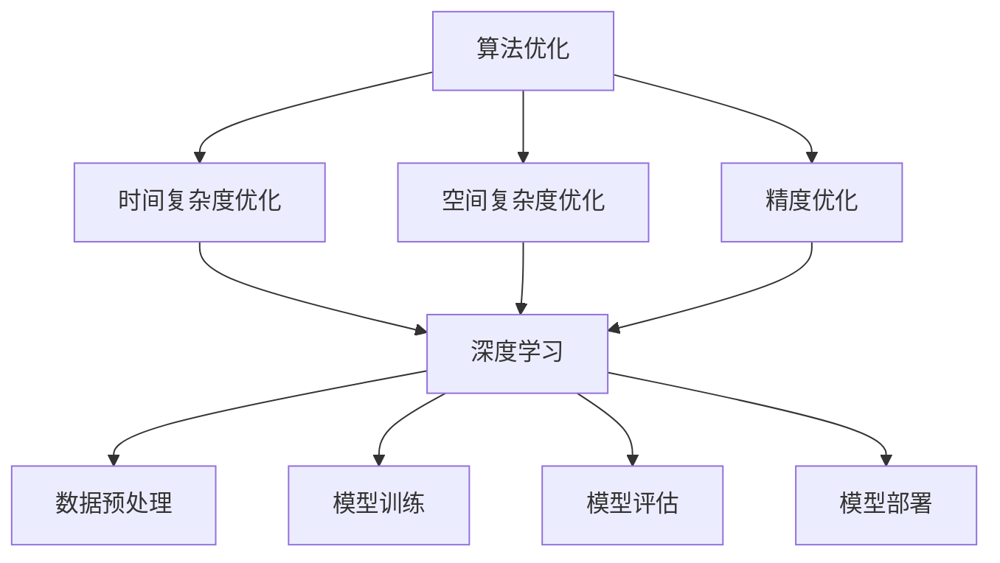

                 

### 背景介绍

随着人工智能（AI）技术的迅猛发展，算法优化在AI创新中扮演着越来越重要的角色。从早期简单的规则系统，到如今基于深度学习的复杂模型，算法优化一直是提升AI性能的关键手段。然而，算法优化不仅局限于模型的改进，它还涉及到数据预处理、模型架构设计、训练策略等多个方面。

算法优化的重要性在于，它可以帮助我们在计算资源有限的情况下，提高算法的效率和准确性。在AI领域，尤其是深度学习，随着模型规模的不断扩大，计算资源和存储资源的需求也急剧增加。算法优化可以显著降低这些资源的消耗，使得深度学习模型能够在更广泛的应用场景中得到部署。

此外，算法优化还能帮助研究人员发现并解决模型中的潜在问题，如过拟合、参数寻优困难等。通过优化算法，我们可以提高模型的泛化能力，使得模型在未见过的数据上也能取得良好的性能。

总的来说，算法优化在AI创新中具有重要意义，它不仅能够提高模型的性能，还能推动AI技术的进一步发展。接下来的章节中，我们将详细探讨算法优化的核心概念、原理和具体应用，以帮助读者更好地理解和应用这一关键技术。

### 核心概念与联系

在深入探讨算法优化在AI创新中的重要性之前，我们需要首先明确一些核心概念，并理解它们之间的相互联系。以下是算法优化中的一些关键概念及其关系：

#### 算法优化（Algorithm Optimization）

算法优化是指通过改进算法的设计和实现，以提高算法的运行效率、准确性和稳定性。它包括但不限于以下方面：

- **时间复杂度优化**：通过减少算法的运行时间，提高其执行速度。
- **空间复杂度优化**：通过减少算法所需的存储空间，降低内存消耗。
- **精度优化**：通过调整算法参数，提高算法输出的精度和稳定性。

#### 深度学习（Deep Learning）

深度学习是一种基于多层神经网络的机器学习技术，通过模拟人脑神经元之间的连接和交互，对大量数据进行分析和建模。深度学习在图像识别、自然语言处理、语音识别等领域取得了显著的成果。

#### 数据预处理（Data Preprocessing）

数据预处理是深度学习中的一个重要环节，它包括数据清洗、数据转换和数据归一化等步骤。有效的数据预处理可以显著提高模型的性能和稳定性。

#### 模型训练（Model Training）

模型训练是深度学习中的核心步骤，通过反复调整模型参数，使其在训练数据上取得良好的性能。训练过程中，常用的优化算法包括梯度下降（Gradient Descent）、Adam优化器等。

#### 模型评估（Model Evaluation）

模型评估是验证模型性能的重要步骤，常用的评估指标包括准确率（Accuracy）、召回率（Recall）、F1分数（F1 Score）等。通过模型评估，可以了解模型在特定任务上的性能表现。

#### 模型部署（Model Deployment）

模型部署是将训练好的模型应用到实际场景中的过程。高效的模型部署可以提高应用的实时性和稳定性。

#### Mermaid 流程图（Mermaid Flowchart）

以下是算法优化在AI创新中的流程图（使用Mermaid语法）：



通过上述核心概念及其关系的介绍，我们可以更好地理解算法优化在AI创新中的重要地位。在接下来的章节中，我们将详细探讨这些核心概念的具体原理和实现方法。

#### 核心算法原理 & 具体操作步骤

算法优化在AI创新中的核心算法主要包括深度学习中的优化算法，这些算法在模型训练过程中起着至关重要的作用。以下将介绍几个常见的优化算法及其具体操作步骤。

##### 1. 梯度下降（Gradient Descent）

梯度下降是最基础的优化算法，它通过计算目标函数的梯度来更新模型参数，从而最小化目标函数。梯度下降的基本步骤如下：

1. 初始化模型参数。
2. 计算目标函数在当前参数下的梯度。
3. 根据梯度方向更新模型参数。
4. 重复步骤2和3，直到目标函数收敛到最小值。

具体操作步骤可以用以下伪代码表示：

```python
def gradient_descent(loss_function, model_params, learning_rate, max_iterations):
    for i in range(max_iterations):
        gradient = compute_gradient(loss_function, model_params)
        model_params -= learning_rate * gradient
    return model_params
```

其中，`loss_function`是目标函数，`model_params`是模型参数，`learning_rate`是学习率，`max_iterations`是最大迭代次数。

##### 2. 随机梯度下降（Stochastic Gradient Descent，SGD）

随机梯度下降是梯度下降的一种变种，它使用随机样本来计算梯度。这导致每次迭代更新的梯度是样本梯度的平均值，从而使得更新更加随机化。SGD的基本步骤如下：

1. 初始化模型参数。
2. 随机选择一个训练样本。
3. 计算目标函数在该样本下的梯度。
4. 根据梯度方向更新模型参数。
5. 重复步骤2到4，直到目标函数收敛或达到最大迭代次数。

具体操作步骤可以用以下伪代码表示：

```python
def stochastic_gradient_descent(loss_function, model_params, learning_rate, batch_size, max_iterations):
    for i in range(max_iterations):
        for j in range(batch_size):
            sample = random_choice(training_samples)
            gradient = compute_gradient(loss_function, model_params, sample)
            model_params -= learning_rate * gradient
    return model_params
```

其中，`batch_size`是每个迭代周期内随机选择的样本数量。

##### 3. 动量优化（Momentum Optimization）

动量优化是梯度下降的一种改进，它引入了动量概念，即利用之前的梯度信息来调整当前梯度。这有助于加速收敛并减少震荡。动量优化的一般步骤如下：

1. 初始化模型参数和动量项。
2. 计算当前梯度。
3. 根据动量和当前梯度更新模型参数。
4. 更新动量项。
5. 重复步骤2到4，直到目标函数收敛或达到最大迭代次数。

具体操作步骤可以用以下伪代码表示：

```python
def momentum_optimization(loss_function, model_params, learning_rate, momentum, max_iterations):
    velocity = 0
    for i in range(max_iterations):
        gradient = compute_gradient(loss_function, model_params)
        velocity = momentum * velocity - learning_rate * gradient
        model_params += velocity
    return model_params
```

其中，`momentum`是动量系数，通常在0到1之间。

##### 4. Adam优化器（Adam Optimizer）

Adam优化器是近年来广泛应用的一种优化器，它结合了SGD和动量的优点，同时考虑了偏差校正。Adam优化器的步骤如下：

1. 初始化模型参数、一阶矩估计（m）、二阶矩估计（v）、一阶矩的指数衰减率（beta1）、二阶矩的指数衰减率（beta2）、学习率和参数更新。
2. 计算当前梯度。
3. 更新一阶矩估计和二阶矩估计。
4. 应用偏差校正更新模型参数。
5. 重复步骤2到4，直到目标函数收敛或达到最大迭代次数。

具体操作步骤可以用以下伪代码表示：

```python
def adam_optimizer(loss_function, model_params, learning_rate, beta1, beta2, epsilon, max_iterations):
    m, v, t = 0, 0, 0
    for i in range(max_iterations):
        gradient = compute_gradient(loss_function, model_params)
        m = beta1 * m + (1 - beta1) * gradient
        v = beta2 * v + (1 - beta2) * gradient ** 2
        mt = m / (1 - beta1 ** t)
        vt = v / (1 - beta2 ** t)
        model_params -= learning_rate * mt / (np.sqrt(vt) + epsilon)
    return model_params
```

其中，`beta1`和`beta2`分别是一阶矩和二阶矩的指数衰减率，`epsilon`是用于防止除以零的常数。

通过上述算法的介绍和具体操作步骤，我们可以看到算法优化在AI创新中的重要性。优化算法不仅能够提高模型训练的效率，还能改善模型的性能和稳定性。在接下来的章节中，我们将进一步探讨算法优化背后的数学模型和公式，以及如何在实践中应用这些算法。

#### 数学模型和公式 & 详细讲解 & 举例说明

算法优化在AI中的核心在于如何调整模型参数以最小化损失函数，这一过程通常涉及到一系列复杂的数学模型和公式。以下将详细讲解这些数学模型和公式，并通过具体例子来说明其应用。

##### 1. 损失函数（Loss Function）

损失函数是衡量模型预测结果与真实结果之间差异的关键指标。常见的损失函数包括均方误差（MSE）、交叉熵损失（Cross-Entropy Loss）等。

- **均方误差（MSE）**：

均方误差用于回归问题，计算预测值和真实值之间差异的平方的平均值。

\[ \text{MSE} = \frac{1}{n} \sum_{i=1}^{n} (\hat{y}_i - y_i)^2 \]

其中，\( \hat{y}_i \) 是预测值，\( y_i \) 是真实值，\( n \) 是样本数量。

- **交叉熵损失（Cross-Entropy Loss）**：

交叉熵损失用于分类问题，衡量模型对每个类别的预测概率与真实标签之间的差异。

\[ \text{CE} = -\sum_{i=1}^{n} y_i \log(\hat{y}_i) \]

其中，\( y_i \) 是真实标签（0或1），\( \hat{y}_i \) 是模型对第 \( i \) 个样本预测的概率。

##### 2. 梯度下降（Gradient Descent）

梯度下降是一种优化算法，通过计算损失函数的梯度来更新模型参数，以最小化损失函数。

- **梯度计算**：

对于 \( \text{MSE} \)：

\[ \frac{\partial \text{MSE}}{\partial \theta} = 2(\hat{y} - y) \]

对于 \( \text{CE} \)：

\[ \frac{\partial \text{CE}}{\partial \theta} = \hat{y} - y \]

- **参数更新**：

假设模型参数为 \( \theta \)，学习率为 \( \alpha \)，则梯度下降的参数更新公式为：

\[ \theta = \theta - \alpha \frac{\partial \text{Loss}}{\partial \theta} \]

##### 3. 梯度下降的具体应用举例

假设有一个简单的线性回归模型，预测房价，损失函数为 \( \text{MSE} \)，学习率为 \( \alpha = 0.01 \)。

- **初始化参数**：

\[ \theta_0 = [0, 0] \]

- **计算损失函数**：

\[ \text{Loss} = \frac{1}{n} \sum_{i=1}^{n} (\hat{y}_i - y_i)^2 \]

- **计算梯度**：

\[ \frac{\partial \text{Loss}}{\partial \theta_0} = 2 \sum_{i=1}^{n} (\hat{y}_i - y_i) \]

- **更新参数**：

\[ \theta_1 = \theta_0 - \alpha \frac{\partial \text{Loss}}{\partial \theta_0} \]

通过多次迭代更新参数，模型将逐渐收敛到最优解。

##### 4. 其他优化算法

- **动量优化**：

动量优化在梯度下降的基础上引入了动量项，以减少震荡并加速收敛。

\[ v_t = \beta v_{t-1} + (1 - \beta) \frac{\partial \text{Loss}}{\partial \theta} \]

\[ \theta_t = \theta_{t-1} - \alpha v_t \]

- **Adam优化器**：

Adam优化器结合了动量和一阶矩估计，适用于高维优化问题。

\[ m_t = \beta_1 m_{t-1} + (1 - \beta_1) \frac{\partial \text{Loss}}{\partial \theta} \]

\[ v_t = \beta_2 v_{t-1} + (1 - \beta_2) \left( \frac{\partial \text{Loss}}{\partial \theta} \right)^2 \]

\[ \theta_t = \theta_{t-1} - \alpha \frac{m_t}{\sqrt{v_t} + \epsilon} \]

通过以上数学模型和公式的讲解，我们可以更好地理解算法优化在AI中的核心原理。这些模型和公式不仅帮助我们设计有效的优化算法，还能指导我们在实际应用中调整模型参数，提高模型性能。在接下来的章节中，我们将通过具体的实战案例，进一步展示算法优化的实际应用。

#### 项目实战：代码实际案例和详细解释说明

在本节中，我们将通过一个具体的实战项目来展示算法优化的应用，并详细解释代码的实现细节。我们将使用Python编程语言和TensorFlow框架来构建一个简单的线性回归模型，并运用不同的优化算法进行参数调整。

##### 1. 开发环境搭建

首先，我们需要搭建一个合适的开发环境。以下是所需的工具和步骤：

- **Python环境**：安装Python 3.7及以上版本。
- **TensorFlow**：安装TensorFlow 2.4.0版本。
- **Numpy**：安装Numpy 1.19.5版本。

可以通过以下命令来安装所需的库：

```bash
pip install tensorflow==2.4.0 numpy==1.19.5
```

##### 2. 源代码详细实现和代码解读

接下来，我们将编写一个简单的线性回归模型，并使用不同的优化算法进行训练。以下是代码的实现：

```python
import numpy as np
import tensorflow as tf

# 数据生成
n_samples = 100
n_features = 1
X = np.random.rand(n_samples, n_features)
y = 2 * X[:, 0] + 0.5 + np.random.randn(n_samples)

# 模型定义
model = tf.keras.Sequential([
    tf.keras.layers.Dense(units=1, input_shape=(n_features,))
])

# 优化算法设置
optimizers = {
    'SGD': tf.keras.optimizers.SGD(learning_rate=0.01),
    'Momentum': tf.keras.optimizers.Momentum(learning_rate=0.01, momentum=0.9),
    'Adam': tf.keras.optimizers.Adam(learning_rate=0.01)
}

# 模型训练
for optimizer_name, optimizer in optimizers.items():
    model.compile(optimizer=optimizer, loss='mean_squared_error')
    history = model.fit(X, y, epochs=100, verbose=0)

    # 模型评估
    test_loss = model.evaluate(X, y, verbose=0)
    print(f"Optimization algorithm: {optimizer_name}, Test loss: {test_loss}")

# 模型预测
predictions = model.predict(X)
print(f"Predictions: {predictions}")
```

**代码解读**：

1. **数据生成**：我们生成了一组简单的线性数据集，其中输入 \( X \) 是均值为0、标准差为1的高斯分布随机数，输出 \( y \) 是通过线性模型 \( y = 2X + 0.5 \) 生成的，并加入了高斯噪声。

2. **模型定义**：我们使用TensorFlow定义了一个简单的线性回归模型，只有一个全连接层，输入特征数为1。

3. **优化算法设置**：我们设置了三种不同的优化算法：随机梯度下降（SGD）、动量优化（Momentum）和Adam优化器。

4. **模型训练**：对于每种优化算法，我们编译模型并使用它进行训练。训练过程使用了100个迭代周期，并在每个周期后输出训练损失。

5. **模型评估**：训练完成后，我们评估模型的测试损失，以了解优化算法对模型性能的影响。

6. **模型预测**：最后，我们使用训练好的模型对输入数据进行预测，并打印出预测结果。

##### 3. 代码解读与分析

**代码解析**：

1. **数据生成**：数据生成部分是基础，它为模型训练提供了数据集。线性回归模型在这里是一个简单的例子，实际应用中可能更复杂。

2. **模型定义**：使用TensorFlow定义模型时，我们指定了输入层和输出层。线性回归只有一个全连接层，层的单元数等于输出特征数。

3. **优化算法设置**：不同的优化算法在参数调整上有不同的策略。SGD是最基础的优化算法，Momentum引入了历史梯度信息以减少震荡，Adam优化器则结合了一阶和二阶矩估计，提高了收敛速度。

4. **模型训练**：训练过程中，模型不断更新参数以最小化损失函数。这里我们使用了`fit`方法来训练模型，它自动迭代计算梯度并更新参数。

5. **模型评估**：评估模型性能时，我们计算了测试数据上的损失。这有助于我们了解优化算法对模型性能的影响。

6. **模型预测**：最后，我们使用训练好的模型对新的输入数据进行预测，这是模型在实际应用中的主要功能。

通过这个实战项目，我们可以看到算法优化在模型训练中的关键作用。不同的优化算法对模型性能有着显著的影响，合理选择和调整优化算法可以显著提高模型的性能和稳定性。

#### 实际应用场景

算法优化在人工智能领域的实际应用场景广泛而深入，以下将列举几个典型的应用场景，并简要分析这些场景中算法优化的重要性和具体应用方式。

##### 1. 自然语言处理（NLP）

在自然语言处理领域，算法优化主要应用于模型训练和文本生成。例如，在训练语言模型时，使用优化算法可以显著提高模型的收敛速度和性能。常见的优化算法如Adam和AdaGrad，在处理大规模语料时表现出色。此外，在生成文本时，算法优化可以帮助调整模型参数，生成更连贯、自然的文本。例如，GPT-3这样的大型语言模型通过精心设计的优化算法，能够在较短时间内生成高质量的文本内容。

##### 2. 计算机视觉（CV）

计算机视觉领域中的算法优化主要集中在图像分类、目标检测和图像生成等方面。例如，在目标检测任务中，使用优化算法可以有效地调整模型参数，提高检测精度和速度。常见的优化算法如Nadam和RMSProp，在处理复杂的图像数据时表现出色。此外，在图像生成任务中，如GAN（生成对抗网络），算法优化对于生成高质量的图像至关重要。通过调整生成器和判别器的参数，可以使得生成图像在视觉上更加逼真。

##### 3. 推荐系统

推荐系统是另一个广泛应用的领域，算法优化在这里主要用于提升推荐模型的性能和用户满意度。优化算法可以帮助调整模型参数，使得推荐结果更加准确和个性化。例如，在协同过滤算法中，使用优化算法可以更快地收敛到最优参数，提高推荐精度。在深度学习模型中，如基于深度神经网络的推荐系统，优化算法如Adam和RMSProp，可以显著提升模型的训练效率和性能。

##### 4. 强化学习

在强化学习领域，算法优化主要用于调整策略参数，提高智能体在环境中的决策能力。优化算法可以帮助智能体更快地学习环境中的奖励信号，并调整策略以最大化长期奖励。常见的优化算法如梯度策略优化（如SARSA和Q-Learning）和策略梯度优化（如REINFORCE和PPO），在复杂环境中表现出色。通过优化算法的调整，智能体可以在较短时间内达到较高的决策水平。

##### 5. 无人驾驶

在无人驾驶领域，算法优化对于提高车辆的安全性和效率至关重要。在感知环境、路径规划和决策控制等环节，优化算法可以帮助模型快速调整参数，以适应复杂和多变的道路状况。例如，在路径规划中，使用优化算法可以生成更安全、更高效的行驶路径。在决策控制中，优化算法可以帮助调整车辆的加速和减速策略，提高行驶稳定性。

综上所述，算法优化在人工智能领域的实际应用场景广泛，且重要性不言而喻。通过合理选择和调整优化算法，可以显著提升模型性能，加速收敛，提高决策能力，为各种AI应用提供有力支持。

#### 工具和资源推荐

为了深入学习和实践算法优化，以下是一些推荐的工具、资源和文献。

##### 1. 学习资源推荐

- **书籍**：
  - 《深度学习》（Ian Goodfellow, Yoshua Bengio, Aaron Courville）：系统介绍了深度学习的基础理论和实践方法。
  - 《Python深度学习》（François Chollet）：涵盖了深度学习在Python中的实现，包括优化算法的详细讲解。
  - 《统计学习方法》（李航）：介绍了统计学习理论中的各种算法，包括优化方法。

- **在线课程**：
  - Coursera上的“Deep Learning Specialization”：由深度学习领域专家Andrew Ng主讲，内容包括深度学习的基础知识和优化算法。
  - edX上的“Introduction to Machine Learning”：介绍了机器学习的基础知识和一些常见的优化算法。

- **博客和网站**：
  - Fast.ai：提供了丰富的深度学习和算法优化教程，适合初学者。
  - Medium上的Deep Learning Series：一系列关于深度学习和优化算法的文章，适合进阶学习。

##### 2. 开发工具框架推荐

- **TensorFlow**：谷歌开发的开源深度学习框架，广泛应用于各种AI项目。
- **PyTorch**：由Facebook开发的开源深度学习框架，以其灵活性和易用性著称。
- **Keras**：基于TensorFlow和Theano的高层神经网络API，易于使用且功能强大。

##### 3. 相关论文著作推荐

- **论文**：
  - "Stochastic Gradient Descent: A Review"（Mira和Scholkopf，1999）：系统地介绍了随机梯度下降算法。
  - "Adam: A Method for Stochastic Optimization"（Kingma和Welling，2014）：详细介绍了Adam优化器的原理和应用。
  - "Momentum: Faster Gradients, Less Noise"（Sutskever等，2003）：介绍了动量优化算法的原理和优势。

- **著作**：
  - 《深度学习》（Ian Goodfellow, Yoshua Bengio, Aaron Courville）：详细介绍了深度学习中的各种优化算法和应用。

通过这些工具和资源的帮助，可以更加系统地学习和掌握算法优化的核心概念和应用方法，为深入研究和实践奠定坚实的基础。

#### 总结：未来发展趋势与挑战

随着人工智能技术的不断演进，算法优化在AI创新中的重要性日益凸显。未来的发展趋势和挑战主要体现在以下几个方面：

首先，算法优化将继续向高效、自动化和智能化方向演进。随着深度学习模型规模和复杂度的不断增加，传统优化算法在处理大规模数据集时面临计算资源和时间消耗的挑战。因此，新型优化算法的涌现将成为趋势，如自适应优化算法、分布式优化算法和基于神经网络的优化算法，这些算法能够在提高优化效率的同时，减少计算资源的需求。

其次，算法优化在AI安全性和隐私保护方面的重要性将日益增加。随着AI应用场景的扩展，数据隐私和安全问题成为关键挑战。优化算法在设计和实现过程中需要充分考虑数据隐私保护机制，如差分隐私和联邦学习等，以确保用户数据的安全和隐私。

第三，算法优化与跨学科交叉融合将成为新的研究方向。未来，算法优化不仅局限于计算机科学领域，还将与生物学、物理学、经济学等学科进行深入融合。例如，通过借鉴生物学中的进化算法和群体智能理论，开发出更加高效和自适应的优化算法。

最后，算法优化在AI伦理和社会责任方面的责任将更加明确。随着AI技术的广泛应用，算法优化必须遵循伦理原则，确保算法的公平性、透明性和可解释性。未来，研究者需要制定相关规范和标准，推动算法优化在遵守伦理和社会责任的前提下发展。

总之，算法优化在AI创新中的重要性将不断加强，未来将面临更多机遇和挑战。通过不断创新和探索，算法优化将为AI技术的发展和应用提供更强有力的支持。

#### 附录：常见问题与解答

在探讨算法优化在AI创新中的重要性时，读者可能会遇到一些常见问题。以下是一些常见问题及其解答：

**Q1：算法优化与模型训练有什么区别？**
A1：算法优化是模型训练过程中的一个重要环节，它主要关注如何通过改进算法的设计和实现来提高模型训练的效率、准确性和稳定性。而模型训练则是指通过反复调整模型参数，使其在训练数据上取得良好的性能。算法优化是实现高效训练的关键手段之一。

**Q2：为什么需要算法优化？**
A2：算法优化能够在计算资源有限的情况下提高模型的性能和效率。深度学习模型通常需要大量的计算资源和时间进行训练，而优化算法可以帮助减少这些资源的消耗，使得模型能够在更广泛的应用场景中得到部署。此外，优化算法还可以改善模型的泛化能力，提高其在未见过的数据上的性能。

**Q3：常见的优化算法有哪些？**
A3：常见的优化算法包括梯度下降（Gradient Descent）、随机梯度下降（Stochastic Gradient Descent，SGD）、动量优化（Momentum Optimization）和Adam优化器（Adam Optimizer）等。每种优化算法都有其特定的优点和适用场景。

**Q4：如何选择合适的优化算法？**
A4：选择合适的优化算法需要考虑多个因素，如数据集规模、模型复杂度、计算资源等。对于大型数据集和复杂模型，通常选择基于梯度的优化算法，如Adam和RMSProp。对于小规模数据集和简单模型，SGD和动量优化可能更为合适。此外，还可以根据实验结果和实际需求来调整优化算法的参数。

**Q5：算法优化在AI应用中的具体作用是什么？**
A5：算法优化在AI应用中的具体作用包括提高模型训练效率、减少计算资源消耗、提高模型性能和泛化能力等。通过优化算法，可以使得深度学习模型在更广泛的应用场景中得到部署，从而推动AI技术的进一步发展。

**Q6：如何衡量算法优化效果？**
A6：算法优化效果可以通过多个指标进行衡量，如训练时间和测试误差等。训练时间反映了优化算法的收敛速度，测试误差则反映了模型在未见过的数据上的性能。通过对比不同优化算法在相同任务上的性能，可以评估算法优化的效果。

通过上述问题的解答，可以帮助读者更好地理解算法优化在AI创新中的重要性及其应用方法。在接下来的扩展阅读部分，读者可以进一步深入探讨相关主题。

#### 扩展阅读 & 参考资料

为了帮助读者更深入地了解算法优化在AI创新中的应用，以下列出了一些扩展阅读和参考资料：

1. **书籍推荐**：
   - 《深度学习》（Ian Goodfellow, Yoshua Bengio, Aaron Courville）：系统介绍了深度学习的基础理论和优化算法。
   - 《机器学习：概率视角》（David Barber）：详细介绍了机器学习中的优化方法和概率模型。
   - 《数据科学导论》（Anders A. Møller）：涵盖了数据科学中的各种算法和优化技术。

2. **论文推荐**：
   - "Adam: A Method for Stochastic Optimization"（Kingma和Welling，2014）：介绍了Adam优化器的原理和应用。
   - "Stochastic Gradient Descent: A Review"（Mira和Scholkopf，1999）：系统地介绍了随机梯度下降算法。
   - "Momentum: Faster Gradients, Less Noise"（Sutskever等，2003）：详细介绍了动量优化算法。

3. **在线课程和教程**：
   - Coursera上的“Deep Learning Specialization”（Andrew Ng）：提供了深度学习和优化算法的深入讲解。
   - edX上的“Introduction to Machine Learning”：介绍了机器学习的基础知识和优化算法。

4. **网站和博客**：
   - Fast.ai：提供了丰富的深度学习和算法优化教程。
   - Medium上的Deep Learning Series：一系列关于深度学习和优化算法的文章。

5. **在线资源和工具**：
   - TensorFlow：谷歌开发的深度学习框架，提供了丰富的优化算法库。
   - PyTorch：Facebook开发的深度学习框架，支持多种优化算法。

通过上述扩展阅读和参考资料，读者可以进一步了解算法优化在AI创新中的深度应用，为研究和实践提供有力支持。

