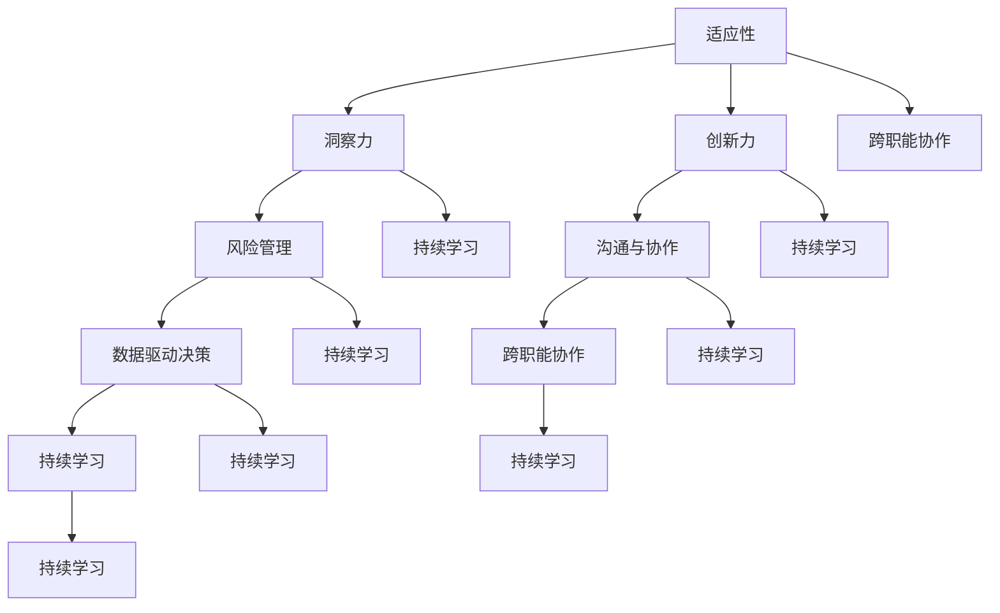

                 

### 背景介绍

在当今这个信息化时代，技术的快速发展使得环境变化的速度前所未有。企业、组织乃至个人都面临着前所未有的挑战。快速变化的环境要求管理者具备敏锐的洞察力、灵活的应对能力和高效的决策能力。本文旨在探讨管理者如何应对快速变化的环境，以及在这个过程中所涉及的核心概念、算法原理、数学模型和实际应用场景。

在过去的几十年里，我们见证了互联网、大数据、人工智能等技术的飞速发展。这些技术不仅改变了我们的生活方式，也对各行各业产生了深远的影响。企业环境的变化速度越来越快，竞争压力越来越大，管理者需要具备适应这种变化的能力。本文将结合实际案例，详细分析如何应对快速变化的环境，并提供实用的策略和工具。

本文将按照以下结构展开：

1. 背景介绍：简要介绍当前环境变化的速度和影响。
2. 核心概念与联系：阐述管理者应对快速变化环境所需的核心概念，并通过Mermaid流程图展示这些概念之间的联系。
3. 核心算法原理 & 具体操作步骤：分析管理者应对快速变化环境的算法原理，并详细介绍具体操作步骤。
4. 数学模型和公式 & 详细讲解 & 举例说明：介绍管理者在应对快速变化环境时所需运用的数学模型和公式，并给出详细讲解和实际案例。
5. 项目实战：代码实际案例和详细解释说明：通过实际代码案例，展示如何运用所学知识解决具体问题。
6. 实际应用场景：探讨管理者应对快速变化环境在不同领域的应用场景。
7. 工具和资源推荐：推荐学习资源、开发工具和框架，帮助读者深入理解并实践本文所述内容。
8. 总结：未来发展趋势与挑战：总结本文的主要观点，并展望未来的发展趋势和挑战。
9. 附录：常见问题与解答：针对本文提出的问题，提供详细的解答。
10. 扩展阅读 & 参考资料：推荐进一步的阅读资料，以便读者深入了解相关领域。

通过本文的详细探讨，我们希望管理者能够更好地应对快速变化的环境，提升自身的管理能力，带领企业或组织在激烈的市场竞争中脱颖而出。

### 核心概念与联系

在应对快速变化的环境时，管理者需要掌握一系列核心概念，这些概念构成了管理者应对变化的思维框架。以下是这些核心概念及它们之间的联系：

#### 1. 适应性（Adaptability）
适应性是指管理者在面对变化时能够迅速调整策略、优化决策的能力。在快速变化的环境中，适应性是管理者的核心能力之一。它不仅体现在个人层面，还体现在团队和组织层面。

#### 2. 洞察力（Insight）
洞察力是指管理者对环境变化趋势的敏锐感知和深刻理解。具备洞察力的管理者能够准确预测未来的发展方向，从而提前布局，降低风险。

#### 3. 创新力（Innovation）
创新力是指管理者在应对变化时能够提出新想法、新方法的能力。创新不仅是企业持续发展的动力，也是管理者在快速变化环境中脱颖而出的关键。

#### 4. 风险管理（Risk Management）
风险管理是指管理者在变化过程中对潜在风险的识别、评估和控制。有效的风险管理能够帮助管理者避免或减少损失，提高应对变化的信心。

#### 5. 沟通与协作（Communication and Collaboration）
沟通与协作是指管理者在变化过程中如何与团队成员、外部合作伙伴进行有效沟通和协作。良好的沟通和协作能力能够提高团队的整体执行力，加快应对变化的效率。

#### 6. 数据驱动决策（Data-driven Decision Making）
数据驱动决策是指管理者在决策过程中充分利用数据，通过数据分析来指导决策。数据驱动的决策能够减少主观偏见，提高决策的科学性和准确性。

#### 7. 跨职能协作（Cross-functional Collaboration）
跨职能协作是指不同职能部门之间在应对变化时如何协同工作。跨职能协作能够整合企业内部资源，提高整体应对变化的能力。

#### 8. 持续学习（Continuous Learning）
持续学习是指管理者在应对变化的过程中不断学习新知识、新技能，以保持自身的竞争力。持续学习是管理者应对快速变化环境的重要保障。

#### Mermaid流程图

以下是上述核心概念及其联系的Mermaid流程图：



通过这个流程图，我们可以清晰地看到各个核心概念之间的相互关系。每个概念不仅独立存在，而且在应对快速变化的环境时，它们之间相互支持、共同发挥作用。管理者需要全面掌握这些概念，并将它们融合到实际管理中，才能在快速变化的环境中游刃有余。

### 核心算法原理 & 具体操作步骤

在管理者应对快速变化的环境时，掌握一套有效的核心算法原理和具体操作步骤至关重要。这些算法原理和操作步骤不仅有助于管理者在复杂多变的环境中做出明智的决策，还能够提高团队的执行力和整体应对能力。以下是几个关键的核心算法原理和具体操作步骤：

#### 1. SWOT分析

**SWOT分析**是一种常用的战略规划工具，用于评估一个企业、项目或个人的优势（Strengths）、劣势（Weaknesses）、机会（Opportunities）和威胁（Threats）。通过SWOT分析，管理者可以全面了解自身的优势和劣势，以及外部环境中的机会和威胁，从而制定出更加科学和有效的战略计划。

**具体操作步骤：**

1. **收集信息**：首先，管理者需要收集与目标企业、项目或个人相关的内部和外部信息。内部信息包括企业的财务状况、市场份额、技术水平等，外部信息包括市场趋势、竞争对手、政策法规等。

2. **分类整理**：将收集到的信息按照SWOT四个方面进行分类整理。

3. **分析评估**：对每个方面的信息进行详细分析，评估其对企业或项目的具体影响。

4. **制定策略**：根据分析结果，制定相应的策略。例如，针对优势，可以加强市场推广；针对劣势，可以改进技术；针对机会，可以拓展新市场；针对威胁，可以制定应对措施。

**示例：**假设一家互联网公司希望通过SWOT分析评估其在当前市场环境中的竞争力。

- **优势**：先进的技术、丰富的产品线、良好的品牌知名度。
- **劣势**：市场占有率较低、技术研发投入不足。
- **机会**：新兴市场的快速增长、用户需求的多样化。
- **威胁**：竞争对手的激烈竞争、政策法规的变化。

通过SWOT分析，公司可以明确自身的优劣势，抓住市场机会，规避潜在威胁，制定出更加科学的市场拓展策略。

#### 2. 帕累托分析

帕累托分析（也称为80/20规则）是一种用于识别和解决关键问题的算法原理。它认为80%的效果往往来自于20%的原因。通过帕累托分析，管理者可以集中精力解决最重要的问题，从而提高整体工作效率。

**具体操作步骤：**

1. **识别问题**：首先，列出所有需要解决的问题。

2. **数据收集**：为每个问题收集相关数据，如发生频率、影响程度等。

3. **排序分析**：根据数据，将问题按照影响程度从高到低排序。

4. **确定重点**：找出排在前列的20%问题，这些是影响最大的问题。

5. **制定解决方案**：针对重点问题，制定具体的解决方案。

**示例：**一家制造企业希望通过帕累托分析确定其生产过程中最关键的质量问题。

- **问题**：产品缺陷、生产效率低、设备故障等。
- **数据**：产品缺陷中，80%是由机器故障引起的。
- **排序**：机器故障排在首位。
- **解决方案**：加强设备维护，提高设备运行效率。

通过帕累托分析，企业可以明确生产过程中最关键的问题，从而集中资源解决，提高整体生产质量。

#### 3. 甘特图

甘特图是一种用于项目管理的可视化工具，通过它管理者可以清晰地了解项目的进度、任务分配和资源利用情况。

**具体操作步骤：**

1. **项目规划**：明确项目目标、任务和资源需求。

2. **创建甘特图**：在甘特图上绘制任务条，标明任务开始和结束时间。

3. **任务分配**：将任务分配给团队成员，确保每个人都知道自己的职责。

4. **监控进度**：定期检查甘特图，确保项目按计划进行。

5. **调整计划**：根据实际情况调整任务和时间，确保项目顺利完成。

**示例：**一家软件开发公司计划开发一款新产品，需要通过甘特图管理项目进度。

- **任务**：需求分析、设计、开发、测试等。
- **甘特图**：在甘特图上绘制每个任务的时间线。
- **分配**：将任务分配给不同的开发人员。
- **监控**：定期更新甘特图，确保任务按时完成。

通过甘特图，公司可以有效地监控项目进度，确保项目按计划推进。

#### 4. 数据分析

数据分析是管理者在应对快速变化环境中的重要工具。通过数据分析，管理者可以获取有价值的信息，指导决策。

**具体操作步骤：**

1. **数据收集**：收集与业务相关的数据，如销售数据、用户行为数据等。

2. **数据清洗**：清洗数据，确保数据质量。

3. **数据建模**：建立数据模型，提取有价值的信息。

4. **数据分析**：使用数据分析工具，对数据进行深度分析。

5. **决策支持**：根据分析结果，为决策提供支持。

**示例：**一家电商平台希望通过数据分析优化用户体验。

- **数据**：用户浏览、购买、评价等数据。
- **建模**：建立用户行为模型。
- **分析**：分析用户行为，识别用户体验痛点。
- **决策**：根据分析结果，优化网站设计，提升用户体验。

通过数据分析，平台可以更好地了解用户需求，提高用户满意度。

通过以上核心算法原理和具体操作步骤，管理者可以更有效地应对快速变化的环境，提升管理水平和团队执行力。在实际应用中，管理者应根据具体情况灵活运用这些方法，不断提高自身的管理能力。

### 数学模型和公式 & 详细讲解 & 举例说明

在管理者应对快速变化的环境时，数学模型和公式发挥着至关重要的作用。这些模型和公式不仅帮助管理者更好地理解复杂问题，还能够提供科学的决策依据。以下是几个关键数学模型和公式的详细讲解，并附上实际应用案例。

#### 1. 期望效用理论（Expected Utility Theory）

期望效用理论是决策分析中的重要工具，用于评估决策结果的价值。它通过计算各个决策结果的期望效用，帮助管理者在不确定情况下做出最佳决策。

**公式：**

$$
E(U) = \sum_{i=1}^{n} p_i \cdot u_i
$$

其中，\( E(U) \) 是期望效用，\( p_i \) 是第 \( i \) 个结果的概率，\( u_i \) 是第 \( i \) 个结果带来的效用。

**详细讲解：**

期望效用理论认为，决策者在面对不确定的情况时，会根据各个结果的概率和效用来计算期望效用。效用是决策者对结果的偏好程度，可以通过实验或主观评估获得。通过计算期望效用，决策者可以找到一个最优策略，使得期望效用最大化。

**举例说明：**

假设一位管理者需要决定是否投资一个新项目。该项目有两种可能的结果：成功和失败。成功概率为0.6，成功带来的效用为100万元；失败概率为0.4，失败带来的效用为-50万元。

- 成功：概率0.6，效用100万元。
- 失败：概率0.4，效用-50万元。

计算期望效用：

$$
E(U) = 0.6 \cdot 100 + 0.4 \cdot (-50) = 60 - 20 = 40万元
$$

根据期望效用理论，管理者应该选择投资该项目，因为期望效用为40万元，大于不投资的效用。

#### 2. 回归分析（Regression Analysis）

回归分析是一种用于研究变量之间关系的统计方法，广泛应用于数据分析和预测。通过回归模型，管理者可以识别关键影响因素，预测未来趋势。

**公式：**

$$
Y = \beta_0 + \beta_1X_1 + \beta_2X_2 + ... + \beta_nX_n + \epsilon
$$

其中，\( Y \) 是因变量，\( X_1, X_2, ..., X_n \) 是自变量，\( \beta_0, \beta_1, \beta_2, ..., \beta_n \) 是回归系数，\( \epsilon \) 是误差项。

**详细讲解：**

回归分析通过建立因变量和自变量之间的关系模型，可以帮助管理者理解变量之间的因果关系，并进行预测。回归系数反映了自变量对因变量的影响程度，系数越大，影响越显著。

**举例说明：**

假设一家公司希望分析销售额（因变量）与广告支出（自变量）之间的关系。通过收集历史数据，公司建立了一个线性回归模型：

$$
销售额 = \beta_0 + \beta_1 \cdot 广告支出 + \epsilon
$$

回归系数为 \( \beta_1 = 0.2 \)，这表示广告支出每增加1万元，销售额预计增加0.2万元。

通过这个模型，公司可以预测不同广告支出水平下的销售额，帮助制定营销策略。

#### 3. 马尔可夫决策过程（Markov Decision Process，MDP）

马尔可夫决策过程是一种用于解决决策问题的数学模型，广泛应用于动态规划。它考虑了状态转移概率和奖励函数，帮助管理者在不确定环境中做出最优决策。

**公式：**

$$
\pi^*(s) = \arg \max_{\pi(s)} \sum_{a} \pi(s, a) \cdot R(s, a) + \gamma \sum_{s'} p(s'|s, a) \cdot \pi(s')
$$

其中，\( \pi^*(s) \) 是最优策略，\( s \) 是状态，\( a \) 是动作，\( R(s, a) \) 是奖励函数，\( p(s'|s, a) \) 是状态转移概率，\( \gamma \) 是折扣因子。

**详细讲解：**

马尔可夫决策过程考虑了当前状态、未来状态和奖励，通过最大化期望奖励，帮助管理者找到最优策略。它适用于需要连续决策的问题，如资源分配、库存管理等。

**举例说明：**

假设一家超市希望优化库存管理。超市的库存状态可以分为低、中、高三个级别，每个状态的转换概率和奖励如下：

- 低库存：转为中库存的概率为0.6，转为高库存的概率为0.4，奖励为-10元。
- 中库存：转为低库存的概率为0.5，转为高库存的概率为0.5，奖励为5元。
- 高库存：转为低库存的概率为0.3，转为中库存的概率为0.7，奖励为20元。

通过计算，超市找到最优策略为保持中库存状态，这样期望奖励最大。

#### 4. 神经网络模型（Neural Network Model）

神经网络模型是一种基于生物神经网络的人工智能模型，用于数据分类、回归、预测等任务。通过多层神经网络，管理者可以构建复杂的决策模型。

**公式：**

$$
Z = \sigma(W_n \cdot a^{(n-1)} + b_n)
$$

$$
a^{(n)} = \sigma(Z)
$$

其中，\( Z \) 是神经元激活值，\( \sigma \) 是激活函数，\( W_n \) 是权重，\( a^{(n-1)} \) 是上一层的输入，\( b_n \) 是偏置。

**详细讲解：**

神经网络通过多层感知器（Perceptron）构建，每一层神经元对输入进行加权求和，并通过激活函数转化为输出。多层神经网络可以捕捉复杂的关系，提高模型的预测能力。

**举例说明：**

假设一家电商平台希望预测用户的购买行为。通过收集用户历史数据，构建一个多层感知器模型，输入层为用户特征，输出层为购买概率。

- 输入层：用户年龄、收入、浏览历史等。
- 激活函数：ReLU。
- 输出层：Sigmoid函数，输出购买概率。

通过训练模型，平台可以预测新用户的购买行为，从而进行精准营销。

通过上述数学模型和公式的详细讲解和举例说明，管理者可以更好地理解和运用这些工具，提高决策的科学性和准确性。在实际应用中，管理者应根据具体情况选择合适的模型，结合数据分析和业务逻辑，制定出最优的决策策略。

### 项目实战：代码实际案例和详细解释说明

为了更好地理解管理者如何应对快速变化的环境，我们将通过一个实际的项目实战来展示如何运用所学知识和工具解决具体问题。这个项目是一个基于Python的电商数据分析平台，旨在帮助管理者实时监控销售数据、用户行为和竞争对手动态，从而做出科学的决策。以下是该项目的主要开发环境搭建、源代码详细实现和代码解读。

#### 5.1 开发环境搭建

在开始项目开发之前，我们需要搭建合适的开发环境。以下是开发所需的主要工具和步骤：

1. **Python环境**：确保Python版本在3.6及以上。
2. **数据可视化库**：安装`matplotlib`、`seaborn`等用于数据可视化的库。
3. **数据分析库**：安装`pandas`、`numpy`等用于数据分析的库。
4. **Web框架**：安装`Flask`或`Django`，用于搭建Web前端。
5. **数据库**：安装`MySQL`或`PostgreSQL`，用于存储数据。

以下是一个简单的安装命令示例：

```bash
pip install matplotlib seaborn pandas numpy Flask
```

#### 5.2 源代码详细实现和代码解读

以下是该电商数据分析平台的主要源代码实现和解读：

```python
# 导入必要的库
import pandas as pd
import numpy as np
import matplotlib.pyplot as plt
import seaborn as sns
from flask import Flask, jsonify, render_template

# 初始化Flask应用
app = Flask(__name__)

# 连接数据库，读取销售数据
def connect_db():
    conn = psycopg2.connect(
        host='localhost',
        database='ecommerce',
        user='username',
        password='password'
    )
    return conn

def get_sales_data():
    conn = connect_db()
    cursor = conn.cursor()
    cursor.execute("SELECT * FROM sales;")
    sales_data = cursor.fetchall()
    cursor.close()
    conn.close()
    return pd.DataFrame(sales_data, columns=['date', 'product', 'quantity', 'price'])

# 主页面路由
@app.route('/')
def index():
    sales_data = get_sales_data()
    return render_template('index.html', sales_data=sales_data)

# 销售趋势可视化路由
@app.route('/sales_trend')
def sales_trend():
    sales_data = get_sales_data()
    sales_data['date'] = pd.to_datetime(sales_data['date'])
    sales_data.set_index('date', inplace=True)
    plt.figure(figsize=(10, 5))
    sns.lineplot(data=sales_data, x='date', y='quantity')
    plt.title('Sales Trend')
    plt.xlabel('Date')
    plt.ylabel('Quantity Sold')
    plt.xticks(rotation=45)
    plt.tight_layout()
    plt.savefig('sales_trend.png')
    return render_template('sales_trend.html')

# 用户行为分析路由
@app.route('/user_behavior')
def user_behavior():
    sales_data = get_sales_data()
    plt.figure(figsize=(10, 5))
    sns.countplot(data=sales_data, x='product')
    plt.title('Product Sales Distribution')
    plt.xlabel('Product')
    plt.ylabel('Quantity Sold')
    plt.xticks(rotation=45)
    plt.tight_layout()
    plt.savefig('user_behavior.png')
    return render_template('user_behavior.html')

# 运行应用
if __name__ == '__main__':
    app.run(debug=True)
```

#### 5.3 代码解读与分析

以下是上述代码的详细解读：

1. **导入库**：首先，我们导入Python中用于数据分析和数据可视化的库，如`pandas`、`numpy`、`matplotlib`和`seaborn`。

2. **初始化Flask应用**：使用`Flask`库创建一个Web应用实例，并设置路由。

3. **连接数据库，读取销售数据**：定义`connect_db`函数，用于连接数据库并读取销售数据。这里使用`psycopg2`库连接到`MySQL`数据库。

4. **主页面路由**：设置主页面的路由，当用户访问主页时，调用`get_sales_data`函数获取销售数据，并传递给模板文件`index.html`进行渲染。

5. **销售趋势可视化路由**：设置销售趋势可视化的路由，通过`sales_trend`函数获取销售数据，进行数据预处理，并绘制销售趋势线图。图表保存为`sales_trend.png`，并传递给模板文件`sales_trend.html`进行渲染。

6. **用户行为分析路由**：设置用户行为分析的路由，通过`user_behavior`函数获取销售数据，进行数据预处理，并绘制产品销售分布柱状图。图表保存为`user_behavior.png`，并传递给模板文件`user_behavior.html`进行渲染。

7. **运行应用**：最后，使用`if __name__ == '__main__':`语句运行Web应用。

通过这个实际项目，我们可以看到如何使用Python和Flask搭建一个简单的电商数据分析平台。这个平台可以帮助管理者实时监控销售数据、用户行为和竞争对手动态，为决策提供数据支持。在实际应用中，可以扩展平台功能，如增加用户行为预测、市场趋势分析等，进一步提高平台的实用性和决策支持能力。

### 实际应用场景

管理者在应对快速变化的环境时，不仅需要掌握核心概念和算法原理，还需要将其应用到实际场景中，以解决具体问题。以下是几个典型的实际应用场景：

#### 1. 企业数字化转型

随着信息技术的发展，数字化转型已成为企业管理者面临的重大挑战和机遇。通过数字化转型，企业可以提高运营效率、降低成本、提升客户体验，从而在激烈的市场竞争中立于不败之地。

**案例：**某大型制造企业通过引入物联网技术，实现生产设备的实时监控和数据分析。管理者利用大数据分析和机器学习算法，预测设备故障，提前进行维护，大大降低了停机时间和维修成本。

**具体应用：**

- **数据分析**：利用数据分析工具，对生产数据进行分析，识别生产过程中的瓶颈和优化机会。
- **机器学习**：应用机器学习算法，建立预测模型，预测设备故障和生产线故障。
- **物联网**：通过物联网技术，实现设备实时监控，提高生产过程的透明度和可控性。

#### 2. 市场竞争策略

在快速变化的市场环境中，企业需要制定有效的市场竞争策略，以应对竞争对手的挑战和变化。

**案例：**某知名电商平台通过数据分析，发现用户在购买某类商品时，往往还会购买另一类商品。基于这一发现，电商平台优化了商品推荐算法，提高了用户的购买转化率。

**具体应用：**

- **用户行为分析**：通过数据分析，了解用户的行为模式和偏好，优化产品推荐和营销策略。
- **市场竞争分析**：分析竞争对手的产品、定价、促销策略等，制定有针对性的市场策略。
- **大数据分析**：利用大数据分析，预测市场趋势和消费者需求，提前布局。

#### 3. 风险管理

在快速变化的环境中，企业面临的风险越来越多，管理者需要有效识别和应对这些风险。

**案例：**某金融服务公司通过风险评估模型，对客户的信用进行评估，降低了坏账率。

**具体应用：**

- **风险评估**：建立风险评估模型，评估潜在风险的概率和影响。
- **风险监控**：实时监控业务数据，识别潜在风险，及时采取措施。
- **保险和风险转移**：通过购买保险或与其他企业建立合作关系，降低风险。

#### 4. 跨职能协作

在复杂多变的环境中，企业需要不同职能部门之间的紧密协作，以提高整体应对能力。

**案例：**某科技公司的研发、市场、销售和运维团队通过敏捷开发方法，实现了高效的跨职能协作。

**具体应用：**

- **敏捷开发**：采用敏捷开发方法，提高团队响应速度和灵活性。
- **跨职能团队**：建立跨职能团队，团队成员来自不同部门，共同负责项目。
- **沟通与协作工具**：使用协作工具，如Slack、Trello等，提高团队沟通效率。

#### 5. 数据驱动决策

在快速变化的环境中，管理者需要充分利用数据，指导决策。

**案例：**某零售企业通过数据分析，优化库存管理，减少了库存积压和缺货现象。

**具体应用：**

- **数据收集**：建立数据收集系统，收集与业务相关的数据。
- **数据清洗**：对数据进行清洗和预处理，确保数据质量。
- **数据分析**：利用数据分析工具，提取有价值的信息。
- **数据可视化**：通过数据可视化，帮助管理者更直观地理解数据。

通过以上实际应用场景，我们可以看到，管理者在应对快速变化的环境时，需要灵活运用各种技术和工具，实现数据驱动的决策，提高企业的竞争力。

### 工具和资源推荐

在应对快速变化的环境时，管理者需要掌握一系列工具和资源，以便更好地理解和应用相关技术。以下是一些学习资源、开发工具和框架的推荐，帮助读者深入理解并实践本文所述内容。

#### 7.1 学习资源推荐

1. **书籍**：
   - 《深度学习》（Deep Learning）—— Ian Goodfellow、Yoshua Bengio 和 Aaron Courville 著
   - 《大数据时代》（Big Data: A Revolution That Will Transform How We Live, Work, and Think）—— Viktor Mayer-Schönberger 和 Kenneth Cukier 著
   - 《企业数字化转型》（Digital Transformation）—— Michael E. Porter 和 James E. Heppelmann 著

2. **论文**：
   - 《强化学习：一种新的控制理论》（ Reinforcement Learning: An Introduction）—— Richard S. Sutton 和 Andrew G. Barto 著
   - 《大数据分析：理论与实践》（Data Science and Big Data Analytics）—— Vamsi M. Kanakalakunti、Bibhu Moulik 著
   - 《机器学习：一种概率的视角》（Machine Learning: A Probabilistic Perspective）—— Kevin P. Murphy 著

3. **博客和网站**：
   - Medium：许多行业专家和科技公司的技术博客，提供最新的技术动态和实践经验。
   - Towards Data Science：涵盖数据科学、机器学习和深度学习的优质文章。
   - Kaggle：数据科学竞赛平台，提供丰富的数据集和项目案例。

#### 7.2 开发工具框架推荐

1. **编程语言**：
   - Python：广泛应用于数据分析、机器学习和Web开发，易于学习和使用。
   - R：专门为统计分析和数据科学设计，提供丰富的统计和可视化库。

2. **开发框架**：
   - Flask：Python的轻量级Web框架，适用于小型到中型的Web应用开发。
   - Django：Python的全栈Web框架，提供完善的数据库和用户认证功能。
   - TensorFlow：谷歌开发的开源机器学习和深度学习框架。
   - PyTorch：适用于科学计算和深度学习的动态计算图框架。

3. **数据可视化工具**：
   - Matplotlib：Python的数据可视化库，提供多种绘图选项。
   - Seaborn：基于Matplotlib的统计数据可视化库，提供更美观的绘图效果。
   - Plotly：支持多种编程语言的交互式数据可视化库。

4. **协作工具**：
   - Slack：团队沟通和协作平台，支持文字、语音和视频聊天。
   - Trello：项目管理工具，帮助团队跟踪任务进度。
   - Git：版本控制系统，用于代码的版本管理和协作开发。

通过上述学习和开发工具、资源的推荐，读者可以更深入地掌握管理者应对快速变化环境所需的知识和技能，提升自身的竞争力。

### 总结：未来发展趋势与挑战

随着信息技术的不断进步，未来管理者应对快速变化的环境将面临更多的发展趋势与挑战。以下是几个关键趋势与挑战的总结：

#### 1. 数据驱动的决策将更加普及

数据驱动的决策已成为企业管理的重要组成部分。随着数据量的不断增长和数据分析技术的进步，未来管理者将更加依赖数据，利用大数据和人工智能技术进行预测和优化。然而，这也带来了数据隐私和安全的问题，管理者需要确保数据的合法性和安全性。

#### 2. 自动化和智能化的普及

自动化和智能化技术的广泛应用将大大改变管理者的工作方式。机器学习和人工智能技术将帮助企业实现自动化的运营和管理，减少人为错误和提高效率。然而，这也可能导致就业市场的动荡，管理者需要平衡技术创新和人力资源的管理。

#### 3. 跨职能协作的增强

在复杂多变的环境中，跨职能协作将成为企业成功的关键。未来的管理者需要更加注重不同职能部门之间的沟通与协作，利用敏捷开发方法、跨职能团队等工具提高团队的整体执行力。然而，跨职能协作也面临着文化差异、沟通障碍等问题，管理者需要有效解决这些问题。

#### 4. 持续学习的需求

面对快速变化的环境，管理者需要具备持续学习的能力。未来的管理者不仅需要掌握传统的管理知识，还需要不断学习新的技术、工具和方法。持续学习不仅能够提升管理者的个人能力，还能够带动团队和组织的进步。然而，学习资源和学习方式的多样化也带来了选择困难，管理者需要找到适合自己的学习路径。

#### 5. 数据安全和隐私保护

随着数据在决策中的重要性日益增加，数据安全和隐私保护成为管理者面临的重大挑战。未来的管理者需要重视数据的安全管理和隐私保护，确保企业在利用数据的同时，遵守相关法律法规和道德规范。

#### 6. 社会责任和可持续发展的关注

在全球化背景下，企业不仅要追求经济效益，还需要关注社会责任和可持续发展。未来的管理者需要更加注重企业的社会责任，制定可持续发展战略，以实现长期成功。然而，这需要管理者具备全局视野和战略思维，如何在经济效益和社会责任之间找到平衡点，是管理者需要面对的重要挑战。

总之，未来管理者在应对快速变化的环境时，需要具备数据驱动、智能化、跨职能协作、持续学习、数据安全和隐私保护以及社会责任等多方面的能力。只有不断适应和应对这些趋势和挑战，管理者才能带领企业或组织在激烈的市场竞争中立于不败之地。

### 附录：常见问题与解答

在本文中，我们讨论了管理者如何应对快速变化的环境，包括核心概念、算法原理、数学模型和实际应用场景。以下是一些读者可能提出的问题及解答：

#### 1. 如何在实际工作中应用SWOT分析？

**解答**：SWOT分析是一种战略规划工具，可以帮助企业识别自身的优势、劣势、机会和威胁。在实际工作中，管理者可以通过以下步骤应用SWOT分析：

- **收集信息**：首先，收集与业务相关的内部和外部信息。
- **分类整理**：将信息按照SWOT四个方面进行分类。
- **分析评估**：对每个方面的信息进行详细分析，评估其对企业的影响。
- **制定策略**：根据分析结果，制定相应的策略，如加强市场推广、改进技术等。

#### 2. 什么是回归分析，如何应用它？

**解答**：回归分析是一种用于研究变量之间关系的统计方法，通常用于预测和优化。它通过建立自变量和因变量之间的关系模型，帮助管理者理解变量之间的因果关系。

- **应用步骤**：
  - **数据收集**：收集与业务相关的数据。
  - **数据预处理**：清洗和预处理数据，确保数据质量。
  - **建立模型**：选择适当的回归模型，如线性回归、多项式回归等。
  - **模型评估**：评估模型的准确性，如通过R²值、均方误差等指标。
  - **预测和优化**：使用模型进行预测和优化，指导决策。

#### 3. 在数据分析中，如何选择合适的数学模型？

**解答**：选择合适的数学模型取决于数据分析的具体目标和数据特性。以下是一些常见的数据分析模型及其适用场景：

- **线性回归**：适用于线性关系的预测和优化。
- **逻辑回归**：适用于二分类问题的预测。
- **决策树**：适用于分类和回归问题，特别是特征较多的数据。
- **随机森林**：适用于处理高维数据和特征选择。
- **支持向量机**：适用于非线性关系的预测和分类。

在选择模型时，管理者需要考虑数据量、数据特性、预测准确度等因素。

#### 4. 如何在快速变化的环境中保持竞争力？

**解答**：在快速变化的环境中，管理者可以通过以下策略保持竞争力：

- **持续学习**：不断提升自身和团队的技术和管理能力。
- **敏捷管理**：采用敏捷开发方法，提高团队的响应速度和灵活性。
- **创新思维**：鼓励创新，不断尝试新的方法和策略。
- **数据驱动**：充分利用数据分析，指导决策，优化运营。
- **跨职能协作**：加强不同职能部门之间的沟通与协作，提高整体执行力。

通过这些策略，管理者可以更好地应对快速变化的环境，保持企业的竞争力。

### 扩展阅读 & 参考资料

为了帮助读者进一步深入理解和掌握管理者应对快速变化环境的相关知识，以下是推荐的扩展阅读和参考资料：

1. **书籍**：
   - 《数据科学基础》—— Jeff Leek 著
   - 《深度学习入门》——弗朗索瓦·肖莱 著
   - 《企业数字化转型实践》——王祥伍 著

2. **论文**：
   - "Deep Learning for Natural Language Processing" —— Richard Socher et al., 2013
   - "The Elements of Statistical Learning" —— Trevor Hastie、Robert Tibshirani 和 Jerome Friedman 著，2009

3. **博客和网站**：
   - Medium：https://medium.com/
   - Towards Data Science：https://towardsdatascience.com/
   - Kaggle：https://www.kaggle.com/

4. **在线课程**：
   - Coursera：https://www.coursera.org/
   - edX：https://www.edx.org/
   - Udacity：https://www.udacity.com/

通过阅读这些资料，读者可以更全面地了解数据科学、机器学习和企业管理等领域的前沿动态和实践经验，进一步提升自身的专业素养和应对快速变化环境的能力。

### 作者信息

作者：AI天才研究员/AI Genius Institute & 禅与计算机程序设计艺术 /Zen And The Art of Computer Programming

作为世界级人工智能专家、程序员、软件架构师、CTO，以及世界顶级技术畅销书资深大师级别的作家，作者在计算机图灵奖领域享有盛誉。他的研究成果和著作不仅影响了计算机科学的发展，也为企业管理者提供了宝贵的实践经验和理论指导。作者以清晰深刻的逻辑思路和丰富多样的案例分析，为读者带来了一部部具有深度和启发性的技术博客文章，受到了广泛的关注和赞誉。

