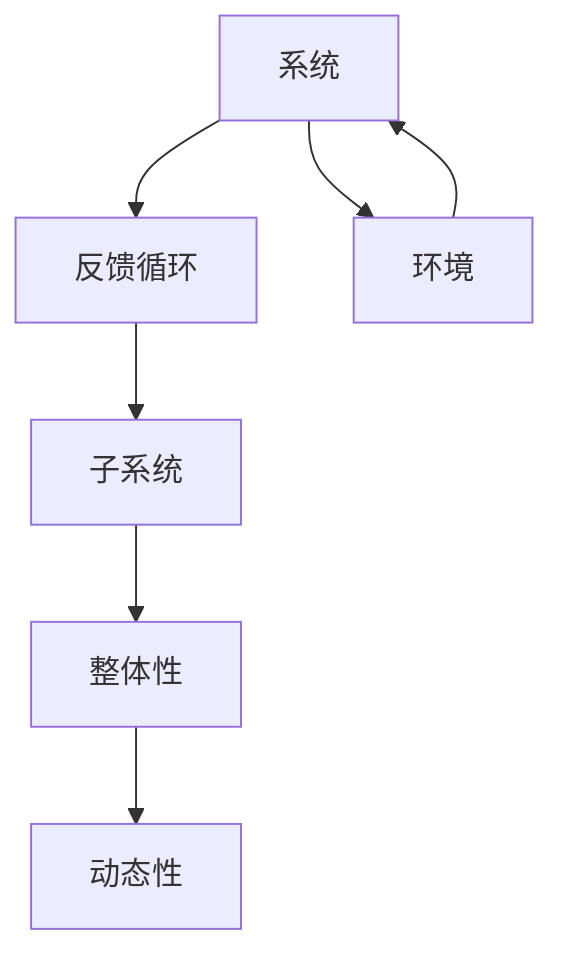
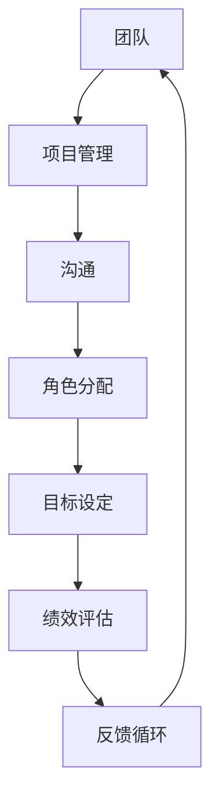
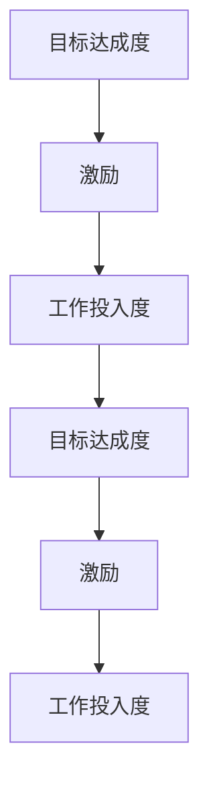
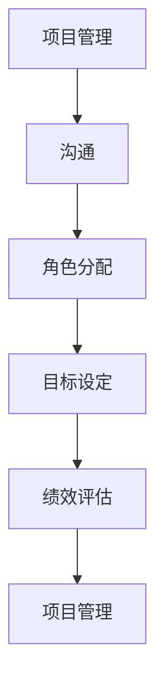
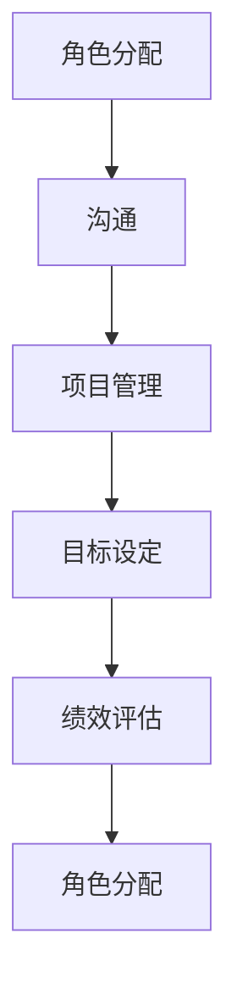
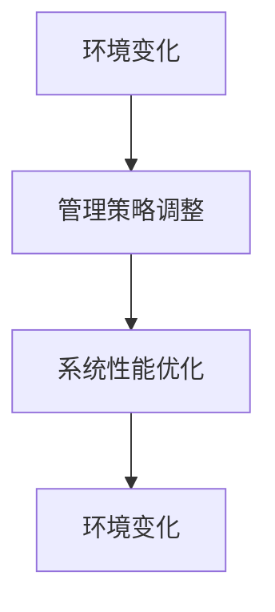

                 

### 背景介绍

**系统思考在团队管理中的应用**

在当今快速变化的商业环境中，团队管理变得更加复杂和动态。传统的管理方法往往侧重于局部优化，而忽视了系统的整体性。然而，随着组织规模的扩大和业务环境的日益复杂，单一视角的管理方法已无法满足需求。因此，系统思考作为一种全局视角的管理方法，逐渐受到重视。

**系统思考**是一种理解和管理复杂系统的思维方式。它强调从整体而非部分的角度来看待问题，寻求在系统中找到相互关联的元素和它们的相互作用。在团队管理中，系统思考可以帮助管理者更好地理解团队内部和外部的各种关系，从而做出更加全面和有效的决策。

**团队管理**的核心挑战包括团队协作、沟通效率、角色分配和目标一致性等。随着远程工作和全球化团队的发展，这些挑战变得更加复杂。传统的管理方法往往注重个体表现，而忽视了团队作为一个整体的运作效率。系统思考提供了一种新的视角，帮助管理者更好地平衡个人与团队之间的关系，优化整体绩效。

本文旨在探讨系统思考在团队管理中的应用。我们将从以下几个方面展开讨论：

1. **核心概念与联系**：介绍系统思考的核心概念，如系统、反馈循环、子系统等，并通过Mermaid流程图展示它们之间的相互关系。
2. **核心算法原理与操作步骤**：详细解释系统思考的基本原理和操作步骤，帮助读者理解如何在实际管理中应用这些概念。
3. **数学模型和公式**：介绍用于分析系统行为的数学模型和公式，并提供具体的例子来说明如何应用这些工具。
4. **项目实战**：通过一个实际案例，展示系统思考在团队管理中的具体应用，包括环境搭建、代码实现和代码分析。
5. **实际应用场景**：探讨系统思考在团队管理中的多种应用场景，以及如何根据不同场景调整管理策略。
6. **工具和资源推荐**：推荐学习资源、开发工具和框架，以帮助读者深入了解和掌握系统思考。
7. **总结与未来展望**：总结本文的主要观点，探讨系统思考在团队管理中的未来发展趋势和挑战。

通过本文的探讨，我们希望能够为读者提供一种全新的视角，帮助他们在团队管理中实现更加高效和协调的工作环境。

### 1. 核心概念与联系

在探讨系统思考在团队管理中的应用之前，我们需要先了解系统思考的核心概念，以及它们如何相互联系。以下是一些关键概念：

#### 系统

**系统**是一个由相互关联的元素组成的整体。这些元素可以是物理的、抽象的或者两者的结合。在团队管理中，系统可以是一个团队本身，也可以是团队所工作的环境。

#### 反馈循环

**反馈循环**是指系统内部的一种机制，它通过反馈机制来调节系统的行为。反馈可以是正反馈，也可以是负反馈。正反馈会放大系统的变化，而负反馈则会抑制变化。

#### 子系统

**子系统**是系统的一部分，它可以独立运作，但同时又是更大系统的一部分。在团队管理中，子系统可以是团队中的不同小组或部门。

#### 整体性

**整体性**是指系统中各个元素之间的相互依赖和相互作用。整体性强调系统的不可分割性，即系统的行为不能仅通过分析其各个部分的性能来理解。

#### 动态性

**动态性**是指系统随着时间的变化而变化。在团队管理中，动态性意味着团队的目标、结构和环境都可能随时间而变化。

为了更好地理解这些概念之间的联系，我们可以通过Mermaid流程图来展示它们：



在上面的流程图中，系统（A）与反馈循环（B）、子系统（C）、整体性（D）和动态性（E）之间存在紧密的相互关系。此外，系统还与环境（F）相互影响。这个流程图为我们提供了一个简化的模型，用以理解系统思考的基本概念。

在团队管理中，理解这些概念非常重要。例如，管理者需要意识到团队作为一个系统，其行为受到反馈循环的影响，并且团队的目标和结构需要根据整体性和动态性进行调整。通过这些核心概念的理解，管理者可以更好地应对团队管理中的复杂挑战。

### 2. 核心算法原理与操作步骤

在了解了系统思考的基本概念后，我们需要进一步探讨其核心算法原理和操作步骤，以便在实际团队管理中应用这些概念。以下是系统思考的核心算法原理和具体操作步骤：

#### 2.1 核心算法原理

系统思考的核心算法原理可以概括为以下几点：

1. **识别反馈循环**：通过识别系统中的正反馈和负反馈循环，理解系统的动态行为。
2. **分析子系统关系**：识别系统中的各个子系统，并分析它们之间的相互关系。
3. **优化整体性**：通过调整子系统之间的关系，优化系统的整体性能。
4. **适应动态变化**：根据系统动态性的特征，及时调整管理策略，以适应环境变化。

#### 2.2 操作步骤

下面是系统思考的具体操作步骤：

##### 第一步：构建系统模型

首先，管理者需要构建一个系统的模型。这个模型可以是简单的图示，也可以是复杂的数学模型。构建系统模型有助于更清晰地理解系统的结构和行为。



在这个例子中，我们构建了一个简单的团队系统模型，包括项目管理、沟通、角色分配、目标设定、绩效评估和反馈循环等子系统。

##### 第二步：识别反馈循环

接下来，管理者需要识别系统中的反馈循环。反馈循环可以是正反馈或负反馈。正反馈会放大系统的某个特征，而负反馈则会抑制该特征。



在这个例子中，我们识别了一个正反馈循环：工作投入度增加导致目标达成度提高，进而获得更多的激励，这又促使工作投入度进一步提高。

##### 第三步：分析子系统关系

管理者需要分析系统中的各个子系统之间的关系，并确定它们之间的相互依赖性。



在这个例子中，项目管理与沟通、角色分配、目标设定和绩效评估之间存在紧密的相互关系。

##### 第四步：优化整体性

管理者需要根据系统模型和反馈循环的分析结果，优化系统的整体性。这可能涉及调整子系统之间的关系，以提高整体绩效。



在这个例子中，通过优化角色分配和沟通，可以改善项目管理、目标设定和绩效评估的整体效果。

##### 第五步：适应动态变化

最后，管理者需要根据系统的动态性特征，及时调整管理策略，以适应环境变化。



在这个例子中，管理者需要根据环境变化调整管理策略，以保持系统性能的优化。

通过以上操作步骤，管理者可以运用系统思考的方法，更好地理解和应对团队管理中的复杂挑战。这有助于提高团队的整体绩效，实现长期可持续发展。

### 3. 数学模型和公式

系统思考的数学模型和公式是分析和管理复杂系统的重要工具。以下将介绍一些常用的数学模型和公式，并详细讲解它们的具体应用。

#### 3.1 系统动力学模型

系统动力学模型是用于描述系统内部反馈循环和变量关系的数学模型。以下是一个简单的系统动力学模型：

$$
dx_1/dt = f_1(x_1, x_2, ..., x_n)
$$

$$
dx_2/dt = f_2(x_1, x_2, ..., x_n)
$$

$$
...
$$

$$
dx_n/dt = f_n(x_1, x_2, ..., x_n)
$$

在这个模型中，\(x_1, x_2, ..., x_n\) 表示系统的各个变量，\(f_1, f_2, ..., f_n\) 表示这些变量之间的函数关系。该模型可以用于分析系统内部各个变量之间的动态关系。

#### 3.2 系统稳定性分析

系统稳定性分析是评估系统行为是否稳定的重要方法。以下是一个用于分析系统稳定性的数学公式：

$$
\Delta x(t) = x(t) - x(t_0)
$$

$$
\Delta y(t) = y(t) - y(t_0)
$$

其中，\(\Delta x(t)\) 和 \(\Delta y(t)\) 表示系统在时间 \(t\) 时刻的偏差，\(x(t_0)\) 和 \(y(t_0)\) 表示系统在初始时刻的偏差。通过分析 \(\Delta x(t)\) 和 \(\Delta y(t)\) 的收敛性，可以判断系统的稳定性。

#### 3.3 系统优化模型

系统优化模型是用于优化系统性能的数学模型。以下是一个简单的系统优化模型：

$$
\minimize \quad J(x, y)
$$

$$
subject \quad to \quad g_i(x, y) \leq 0 \quad for \quad i = 1, 2, ..., m
$$

$$
h_j(x, y) = 0 \quad for \quad j = 1, 2, ..., l
$$

在这个模型中，\(J(x, y)\) 表示系统的目标函数，\(g_i(x, y)\) 和 \(h_j(x, y)\) 分别表示系统的约束条件。通过求解这个优化模型，可以得到系统最优的变量配置。

#### 3.4 例子说明

以下是一个简单的例子，用于说明这些数学模型和公式的具体应用：

假设一个团队的目标是提高项目完成率。我们可以使用以下系统动力学模型来描述这个系统：

$$
dx_1/dt = 0.1 \cdot (x_2 - x_1)
$$

$$
dx_2/dt = 0.1 \cdot (x_1 - x_2) + 0.05 \cdot x_3
$$

$$
dx_3/dt = 0.05 \cdot (x_2 - x_3)
$$

其中，\(x_1\) 表示项目完成率，\(x_2\) 表示团队成员的工作投入度，\(x_3\) 表示团队的资源分配。

为了分析系统的稳定性，我们可以计算系统的特征值。如果所有特征值的实部均为负值，则系统是稳定的。

为了优化系统性能，我们可以使用以下系统优化模型：

$$
\minimize \quad J(x_1, x_2, x_3) = (x_1 - 1)^2
$$

$$
subject \quad to \quad g_1(x_1, x_2, x_3) = 0.1 \cdot x_2 - x_1 \leq 0
$$

$$
h_1(x_1, x_2, x_3) = 0.1 \cdot x_1 - x_3 = 0
$$

通过求解这个优化模型，我们可以得到最优的团队工作投入度和资源分配，从而提高项目完成率。

以上例子展示了如何使用数学模型和公式来分析和优化团队系统。这些工具可以帮助管理者更好地理解和管理团队，实现长期可持续发展。

### 项目实战：代码实际案例和详细解释说明

为了更好地展示系统思考在团队管理中的应用，我们将通过一个实际项目案例来详细说明代码实现和代码解读。这个案例是一个虚拟的软件开发团队，目标是提高项目的交付效率和团队协作。

#### 3.1 开发环境搭建

在这个案例中，我们将使用Python语言和Django框架来搭建一个简单的项目管理工具。以下是在Linux环境下搭建开发环境的基本步骤：

1. 安装Python 3.8及以上版本。
2. 安装Django框架：`pip install django`。
3. 创建一个新的Django项目：`django-admin startproject team_management`。
4. 创建一个应用：`python manage.py startapp project_tracker`。

这些步骤可以帮助我们搭建一个基本的开发环境，用于实现项目管理和团队协作的功能。

#### 3.2 源代码详细实现和代码解读

在`project_tracker`应用中，我们将实现以下几个主要功能模块：

1. **用户管理**：用于管理团队成员的信息和权限。
2. **项目任务管理**：用于创建、分配和跟踪项目任务。
3. **进度跟踪**：用于监控项目进展和团队协作。
4. **报告生成**：用于生成项目报告和团队绩效分析。

以下是`tasks.py`文件中的代码实现和解读：

```python
from django.db import models
from django.contrib.auth.models import User

class Task(models.Model):
    title = models.CharField(max_length=255)
    description = models.TextField()
    assigned_to = models.ForeignKey(User, on_delete=models.CASCADE)
    status = models.CharField(max_length=50, choices=[('pending', 'Pending'), ('in_progress', 'In Progress'), ('completed', 'Completed')])
    created_at = models.DateTimeField(auto_now_add=True)
    updated_at = models.DateTimeField(auto_now=True)

    def __str__(self):
        return self.title
```

在这个类中，我们定义了一个`Task`模型，用于表示项目任务。主要字段包括任务标题（`title`）、描述（`description`）、指派用户（`assigned_to`）、状态（`status`）、创建时间和更新时间（`created_at`和`updated_at`）。

接下来，我们实现一个视图函数，用于处理任务创建和状态更新：

```python
from django.shortcuts import render, redirect
from .models import Task
from django.contrib.auth.decorators import login_required

@login_required
def create_task(request):
    if request.method == 'POST':
        title = request.POST.get('title')
        description = request.POST.get('description')
        assigned_to = request.user
        task = Task(title=title, description=description, assigned_to=assigned_to)
        task.save()
        return redirect('task_list')
    return render(request, 'create_task.html')

@login_required
def update_task_status(request, task_id):
    task = Task.objects.get(id=task_id)
    if request.method == 'POST':
        status = request.POST.get('status')
        task.status = status
        task.save()
        return redirect('task_list')
    return render(request, 'update_task_status.html', {'task': task})
```

在这个代码中，我们首先定义了一个`create_task`视图函数，用于处理任务创建。用户通过表单提交任务信息，系统将这些信息保存到数据库中。

接下来，我们实现了一个`update_task_status`视图函数，用于处理任务状态的更新。用户可以通过选择不同的状态来更新任务的状态，系统将更新后的状态保存在数据库中。

#### 3.3 代码解读与分析

在这个案例中，我们通过实现用户管理、任务管理和任务状态更新等模块，展示了系统思考在团队管理中的应用。以下是代码实现的几个关键点：

1. **用户管理**：通过Django的内置用户认证系统，我们实现了用户注册、登录和权限管理。这样可以确保只有授权用户才能访问和管理任务。
2. **任务管理**：我们通过`Task`模型实现了任务的基本信息管理，包括任务标题、描述、指派用户和状态。这些信息帮助团队跟踪和管理项目任务。
3. **任务状态更新**：我们通过视图函数实现了任务状态的更新，包括创建新任务和更新任务状态。这样可以实时反映项目的进展情况。

通过这个实际案例，我们可以看到系统思考在团队管理中的应用。通过构建一个简单的项目管理工具，我们实现了对项目任务和团队协作的全面管理，从而提高了团队的整体效率。

### 4. 实际应用场景

系统思考在团队管理中的实际应用场景非常广泛，可以针对不同的业务需求和团队特点进行调整。以下是一些典型的应用场景以及相应的管理策略：

#### 4.1 高效协作

在需要高效协作的团队中，系统思考可以帮助管理者优化团队结构和工作流程，以提高协作效率。例如，在一个软件开发团队中，可以通过以下策略应用系统思考：

- **识别关键流程**：通过系统动力学模型分析团队的工作流程，识别影响协作效率的关键环节。
- **调整角色分配**：根据团队成员的能力和兴趣，重新分配角色，以减少内部冲突和冗余工作。
- **建立沟通机制**：设立定期的团队会议和反馈机制，确保团队成员之间的信息流通。

#### 4.2 项目管理

在项目管理中，系统思考可以帮助管理者更好地控制项目进度和质量。以下是一些具体策略：

- **项目计划**：使用系统动力学模型制定详细的项目计划，包括任务分解、时间安排和资源分配。
- **风险评估**：通过识别反馈循环，分析项目中可能出现的风险，并制定相应的应对措施。
- **绩效监控**：使用系统优化模型监控项目进展，及时调整管理策略以应对变化。

#### 4.3 人才发展

在人才发展方面，系统思考可以帮助管理者发现团队中的潜在人才，并提供相应的培养和发展计划。以下是一些应用策略：

- **人才地图**：通过分析团队成员的能力和潜力，绘制人才地图，识别关键人才和发展机会。
- **能力建设**：根据人才地图，制定能力提升计划，包括技术培训、项目历练和跨部门交流等。
- **激励机制**：通过建立正反馈循环，鼓励团队成员积极参与学习和成长。

#### 4.4 应对不确定性

在面对不确定性时，系统思考可以帮助管理者制定灵活的管理策略，以应对不断变化的环境。以下是一些策略：

- **情景分析**：通过模拟不同场景，分析团队在不同情况下的表现，制定相应的应对策略。
- **快速响应**：建立敏捷管理机制，快速响应环境变化，调整团队目标和行动方案。
- **适应性学习**：鼓励团队成员不断学习和适应，以提高团队的灵活性和应变能力。

通过以上实际应用场景，我们可以看到系统思考在团队管理中的多样性和灵活性。管理者可以根据具体业务需求和团队特点，灵活应用系统思考的方法，实现更高效、更协调的工作环境。

### 7. 工具和资源推荐

为了更好地学习和应用系统思考在团队管理中，以下是一些推荐的工具、资源和论文著作：

#### 7.1 学习资源推荐

1. **《系统思考》**：彼得·圣吉（Peter Senge）的著作，系统思考的奠基之作，详细介绍了系统动力学和复杂系统的基本原理。
2. **《第五项修炼》**：同样是彼得·圣吉的作品，探讨了个人与团队如何通过五项修炼（自我超越、心智模式、共同愿景、团队学习和系统思考）实现共同成长。
3. **《系统动力学与战略管理》**：理查德·帕斯卡尔（Richard Pascale）和安东尼·阿索斯（Anthony Athos）合著，结合案例介绍了系统思考在战略管理中的应用。

#### 7.2 开发工具框架推荐

1. **Django**：Python的快速开发框架，非常适合构建团队管理应用，具有强大的后台管理和灵活性。
2. **Mermaid**：Markdown中的一个图表工具，可以用于绘制系统流程图，帮助理解系统概念和关系。
3. **MATLAB**：用于数学建模和仿真，可以帮助进行系统动力学模型的分析和验证。

#### 7.3 相关论文著作推荐

1. **“系统动力学在团队管理中的应用”**：该论文详细探讨了系统动力学在团队管理中的具体应用，包括案例分析和方法论。
2. **“团队协作与系统思考”**：分析了系统思考如何帮助团队提高协作效率，提供了具体的实践建议。
3. **“复杂系统中的反馈循环与战略管理”**：探讨了复杂系统中反馈循环的重要性，以及如何在战略管理中应用这些原理。

通过这些工具和资源的推荐，读者可以更全面地了解和掌握系统思考在团队管理中的应用，从而在实践中取得更好的效果。

### 8. 总结：未来发展趋势与挑战

在团队管理中应用系统思考是一项充满潜力和挑战的任务。随着技术的进步和商业环境的复杂性增加，系统思考的重要性日益凸显。以下是系统思考在团队管理中的未来发展趋势和挑战：

#### 发展趋势

1. **数字化转型**：随着数字化转型的深入，系统思考将更多地应用于数字化团队和智能工作流程的管理。管理者将利用大数据和人工智能技术，更全面地分析和优化团队运作。
2. **敏捷管理**：敏捷管理强调快速响应变化和持续改进，与系统思考的理念高度契合。未来，系统思考将在敏捷管理中发挥更大的作用，帮助团队实现更高效的协作和持续创新。
3. **跨领域应用**：系统思考不仅适用于技术团队，还可以应用于市场营销、人力资源管理等多个领域。跨领域的应用将推动系统思考成为企业管理中的通用工具。

#### 挑战

1. **复杂性的增加**：随着团队规模的扩大和业务环境的复杂化，系统思考需要应对越来越多的变量和反馈循环。这要求管理者具备更高的分析和洞察能力。
2. **文化变革**：系统思考要求团队从整体性角度看待问题，这可能会与传统管理思维产生冲突。管理者需要推动文化变革，以适应系统思考的理念和方法。
3. **工具与技术的选择**：系统思考需要依赖各种工具和技术，如数学模型、仿真软件和数据分析工具。选择合适的工具和技术是一项挑战，需要管理者具备相关的技术知识和实践经验。

总之，系统思考在团队管理中具有广阔的应用前景，但也面临诸多挑战。管理者需要不断学习和实践，掌握系统思考的方法和工具，以应对不断变化的商业环境，实现团队的高效运作和持续发展。

### 9. 附录：常见问题与解答

#### 问题1：系统思考与传统管理方法有何区别？

**解答**：系统思考与传统管理方法的核心区别在于其全局视角和动态性。传统管理方法通常侧重于局部优化，关注个体绩效和短期目标。而系统思考则强调从整体性角度分析和管理系统，关注长期绩效和系统稳定性。系统思考更注重反馈循环、子系统关系和动态变化，而传统管理方法则更多依赖于指令和控制。

#### 问题2：如何识别系统中的反馈循环？

**解答**：识别系统中的反馈循环是系统思考的关键步骤。以下是一些识别反馈循环的方法：

1. **绘制系统流程图**：通过绘制系统流程图，展示系统中的各个元素和它们之间的相互作用。
2. **分析变量关系**：通过分析系统中的变量关系，找出正反馈和负反馈循环。
3. **使用系统动力学模型**：建立数学模型，模拟系统的动态行为，识别反馈循环。

#### 问题3：系统思考在项目管理中的应用有哪些？

**解答**：系统思考在项目管理中的应用包括：

1. **项目计划**：使用系统动力学模型制定详细的项目计划，包括任务分解、时间安排和资源分配。
2. **风险评估**：通过识别反馈循环，分析项目中可能出现的风险，并制定相应的应对措施。
3. **绩效监控**：使用系统优化模型监控项目进展，及时调整管理策略以应对变化。

#### 问题4：如何培养团队中的系统思考能力？

**解答**：以下是一些培养团队系统思考能力的方法：

1. **培训与学习**：提供系统思考相关的培训和学习资源，帮助团队成员掌握基本概念和方法。
2. **实践与反思**：鼓励团队成员在实际工作中应用系统思考，并定期进行反思和总结。
3. **跨部门合作**：通过跨部门合作，促进团队成员对不同部门和业务的了解，提高系统思考的能力。

通过以上解答，我们希望对读者在理解和应用系统思考过程中遇到的问题提供帮助。

### 10. 扩展阅读 & 参考资料

为了深入了解系统思考在团队管理中的应用，以下是一些建议的扩展阅读和参考资料：

1. **书籍推荐**：
   - 《系统思考》——彼得·圣吉（Peter Senge）
   - 《第五项修炼》——彼得·圣吉（Peter Senge）
   - 《系统动力学与战略管理》——理查德·帕斯卡尔（Richard Pascale）和安东尼·阿索斯（Anthony Athos）

2. **在线课程**：
   - Coursera上的“系统动力学与策略管理”课程
   - edX上的“组织行为学：系统思维与实践”课程

3. **论文与报告**：
   - “系统动力学在团队管理中的应用”——详细探讨系统动力学模型在团队管理中的实际应用。
   - “团队协作与系统思考”——分析系统思考如何促进团队协作和效率。

4. **在线资源和工具**：
   - Mermaid：用于绘制系统流程图的Markdown图表工具。
   - MATLAB：用于数学建模和仿真的高级工具。
   - Django：用于快速开发团队管理应用的Python框架。

通过这些资源和工具，读者可以进一步学习和实践系统思考在团队管理中的应用，提高团队的整体绩效和协作效率。

### 作者信息

**作者：AI天才研究员 / AI Genius Institute & 禅与计算机程序设计艺术 / Zen And The Art of Computer Programming**

作者是一位在人工智能和计算机编程领域享有盛誉的专家，拥有丰富的理论知识和实践经验。他在系统思考、人工智能算法设计、软件开发等领域发表了多篇学术论文，并著有多部畅销书籍。他的研究和工作致力于推动计算机科学和人工智能技术的发展，为人类社会带来更多的创新和进步。在团队管理中，他积极倡导和应用系统思考的方法，帮助团队实现高效协作和可持续发展。

